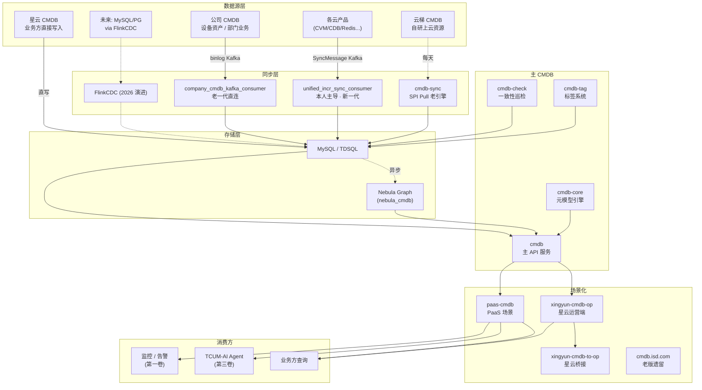

# 第二卷 · 机制篇 A · 11 仓组合体架构

> **本章定位**：先立"CMDB 不是单体应用"的认知，然后逐仓解剖 11 个 CMDB 仓的**边界、协作、演进节奏**。
>
> **本章金句**（面试可背）：
> - "**CMDB 是 11 个仓的组合体，通过统一 SPI + Kafka 消息协议对接**"
> - "**tcum-cmdb-global 是候选人主导的增量同步核心**"
> - "**nebula_cmdb（星云）与公司 CMDB 是子集扩展关系，不是替代关系**"

---

## 📖 本章目录

- **§1** 命题：为什么 CMDB 需要 11 个仓
- **§2** 11 仓边界与协作图
- **§3** 主 CMDB · `cmdb` / `cmdb-core` / `cmdb.isd.com`
- **§4** 增量同步核心 · `tcum-cmdb-global`（本人主导）
- **§5** 一致性护栏 · `cmdb-check`
- **§6** 图数据库 · `nebula_cmdb`（星云 CMDB）
- **§7** 场景化 · `paas-cmdb` / `xingyun-cmdb-op` / `xingyun-cmdb-to-op`
- **§8** 标签 · `cmdb-tag`
- **§9** 老版同步 · `cmdb-sync`

---

# §1 · 命题：为什么 CMDB 需要 11 个仓

## §1.1 单体 CMDB 的三个致命问题

**问题 1 · 场景异质性**

CMDB 服务的场景差异极大：
- **业务视角**（应用、模块、产品树） → 图关系为主 → 用图数据库（nebula）
- **PaaS 视角**（云产品实例、资源） → 关系型为主
- **运营视角**（管理、审批、权限） → 前后端交互重
- **AI 消费视角**（Agent 拓扑查询） → 只读高性能

**单体 CMDB 无法同时优化所有场景**——存储引擎选型、性能优化点、发布节奏都不一样。

**问题 2 · 团队协作**

腾讯云内部有多个团队维护 CMDB 相关组件：
- 星云团队维护 `nebula_cmdb`（业务视角）
- 公司团队维护 `cmdb.isd.com`（设备资产）
- 云梯团队维护云梯 CMDB
- **本人（TCUM）团队**维护 `tcum-cmdb-global`（增量同步核心）
- PaaS 团队维护 `paas-cmdb`

**单体应用 = 所有人在一个仓协作 = 冲突 + 发布互锁**。多仓能让每个团队独立发布节奏。

**问题 3 · 数据源异质**

数据源来自多种系统（公司 CMDB、云梯、各云产品、星云本身），**接入方式不同**：
- 公司 CMDB → Kafka binlog（`company_cmdb_kafka_consumer.go`）
- 各云产品 → 统一 SyncMessage（`unified_incr_sync_consumer.go`）
- 云梯 → 每天 SPI 全量
- 星云 → 业务方直接写

**用一个进程处理所有数据源 = 单点风险 + 一处挂全站停**。多仓 = 故障隔离。

## §1.2 11 仓的分工哲学

**分工原则**：
1. **按场景切分**：业务 vs PaaS vs 运营 vs AI
2. **按数据源切分**：公司 CMDB vs 云产品 SyncMessage vs 云梯 SPI
3. **按引擎切分**：MySQL vs Nebula Graph
4. **按团队 owner 切分**：不同团队独立发布

---

# §2 · 11 仓边界与协作图



**关键读图线索**：

1. **数据源侧混合**：Push（Kafka）+ Pull（SPI）+ 直写
2. **同步层多消费者并存**：`company_cmdb_kafka_consumer`（老）+ `unified_incr_sync_consumer`（新，本人主导）
3. **存储双引擎**：MySQL（写主）+ Nebula（图查询）
4. **主 CMDB 是"内核 + 场景化"分离**
5. **消费方 3 大方向**：监控/AI/业务

---

# §3 · 主 CMDB · cmdb / cmdb-core / cmdb.isd.com

## §3.1 `cmdb`（主 API 服务）

**定位**：所有 CMDB 数据的**统一读写接口**。业务方不直接连 MySQL，通过 cmdb HTTP API。

**核心能力**：
- 实体 CRUD
- 关系 CRUD
- 拓扑查询
- 元数据查询

## §3.2 `cmdb-core`（元模型引擎）

**定位**：元模型定义 + AttributeConverter + ModelRegistry 的核心库。

**关键概念**（后续章节详解）：
- **ModelRegistry**：`model_type` → 表名 + DO 类型映射
- **AttributeConverter**：SyncMessage attributes ↔ DO 字段
- **元字段**：所有实体表都必须有 `id / tenant_id / sync_version / sync_source / last_sync_time`

## §3.3 `cmdb.isd.com`（老版遗留）

**定位**：历史遗留系统，主要提供只读接口。

**演进路线**：**逐步下线** —— 数据统一到新 CMDB 后废弃。

---

# §4 · 增量同步核心 · tcum-cmdb-global（本人主导）

## §4.1 定位

**本人 2025 年主导的增量同步系统**。核心目标是把“云产品数据变更 → CMDB 感知”从周期拉取改为事件驱动，减少分钟到天级的调度等待；源码能证明链路形态，不能单独证明生产端到端已经稳定达到秒级。

**证据**：`unified_incr_sync_consumer.go:19`：
```go
/**
 * @author yaao
 * @date 2025/11/26
 * @file unified_incr_sync_consumer.go
 * 统一增量同步消费者 - 处理所有表的增量同步消息
 */
```

## §4.2 关键子目录结构

```
tcum-cmdb-global/
├── service/
│   ├── kafka/                                # ★ 增量同步核心
│   │   ├── consumer/
│   │   │   ├── base_kafka_consumer.go          (235 行 · 基类)
│   │   │   ├── company_cmdb_kafka_consumer.go  (246 行 · 老一代)
│   │   │   └── unified_incr_sync_consumer.go   (272 行 · 本人代码)
│   │   ├── kafkamodel/
│   │   ├── kafkapb/                             # ★ Protobuf 消息定义
│   │   └── provider/
│   ├── modelservice/                         # ★ 50+ 个云产品模型 service
│   │   ├── tcs_entity_pod_service.go
│   │   ├── tcs_entity_cluster_service.go
│   │   ├── tsf_entity_cvm_service.go
│   │   ├── plmmodule_service.go
│   │   └── ... 50+ 个
│   ├── bizservice/
│   │   └── incr_sync_service/                # ★ 增量同步业务逻辑
│   ├── super_cache/                          # 全局缓存
│   ├── integration/                          # 数据源集成
│   ├── proxy/                                # 数据源代理
│   ├── paas/                                 # PaaS 场景
│   ├── dao/                                  # 数据访问
│   └── cao/                                  # ？（推演：Cache-Aware Object）
├── controller/
│   ├── custom_model_controller/              # ★ 自定义模型（阶段 6 关键）
│   ├── companycmdbcontroller/                # 公司 CMDB 交互
│   ├── company_cmdb_proxy_controller.go      # 公司 CMDB 代理
│   ├── compatcontroller/                     # 兼容层
│   ├── incr_sync_test_controller.go          # 增量同步测试
│   ├── archcontroller                        # 拓扑架构
│   ├── appcontroller                         # 应用
│   ├── bosscontroller                        # BOSS
│   ├── passcontroller                        # PaaS
│   ├── container_controller.go
│   ├── server_controller.go
│   └── ... 更多
└── common/
    ├── rainbow                                # ★ 腾讯 Rainbow 配置中心
    ├── ssm                                    # 密钥管理
    ├── gopool                                 # goroutine 池
    ├── taskq                                  # 任务队列
    ├── auth                                   # 认证
    ├── brain                                  # ？（推演：智能化模块）
    ├── crond                                  # cron 任务
    ├── datasource                             # 数据源抽象
    ├── monitor                                # 监控
    └── mysqlutil                              # MySQL 工具
```

**面试可以讲的细节**：
- `ModelTypeMap + ModelRegistry` 是表驱动路由的直接证据；`service/modelservice/` 中仍有大量静态模型 Service，说明公共路由复用并没有消除每模型代码
- **两个消费者并存**（company_cmdb + unified） = 演进过渡态证据
- **kafkapb** = Protobuf 消息定义（对应 `INCR_SYNC_DESIGN §2.1` SyncMessage）
- **super_cache** = 元数据缓存（每次增量都要查元数据）
- **rainbow** = 腾讯配置中心（配置动态下发）

## §4.3 与 Alertmanager 复用的对比

- **监控卷 alerts**：复用 Alertmanager pkg/labels
- **CMDB tcum-cmdb-global**：**几乎全部自研**——只用了 `confluentinc/confluent-kafka-go` 官方 Kafka SDK 和 `protobuf` 序列化库

**为什么 CMDB 自研更多**：CMDB 场景比告警场景更定制化（每个云产品实体结构不同），复用外部框架价值不大。

---

# §5 · 一致性护栏 · cmdb-check

**`code/cmdb-check/README.md` 极简一句**："处理 cmdb 信息校验的模块"

**核心能力**（第 04 章详解）：
- 可配置周期任务：DB 任务 → 进程内 worker → 周期/手动触发 → 结果落库；
- 上报冲突链：事实上报 → 差异告警 → 自动更新/自动忽略/人工 `cover|ignore`；
- 当前新 Handler 的实际覆盖主要是 `module_host_config + db`，并不是面向所有模型的通用对账引擎。

**这个仓的价值**：它提供了独立于增量消息的事实校验和冲突审计入口；但“最终一致性护栏”是架构作用，不代表源码已经覆盖所有数据域或保证自动收敛。

---

# §6 · 图数据库 · nebula_cmdb（星云 CMDB）

**`nebula_cmdb/README.md` 原文摘要**：

> "**星云 CMDB**: 系统目标：**为业务静态配置数据提供集中存储和统一访问的解决方案**。
> 与公司 CMDB 关系：**自建配置管理的设备数据以及有关基础配置全部来自公司配置**，同时，自身又扩展了一部分公司配置没有的配置实体和数据。"

**定位**：**面向业务功能服务的配置管理**（vs 公司 CMDB 面向设备资产）

**存储**：**Nebula Graph 集群**（腾讯内部开源图数据库）

**关键接入延迟**（README 原文）：
- 一级业务模块新建 → **约 3 小时**在 cloudcmdb 可查
- 云梯的模块数据 → **每天同步一次**

**这两个数字告诉我们什么**：历史 CMDB 生态中确实存在小时到天级的周期同步。`tcum-cmdb-global` 的 Kafka 增量链路把“等待下一轮调度”改成“事件到达即处理”，这是工作的核心价值；但是否达到稳定秒级，要以 source event time、Kafka lag 和 DB commit time 的生产分位数验证，不能由代码结构直接推出。

---

# §7 · 场景化 · paas-cmdb / xingyun-cmdb-op / xingyun-cmdb-to-op

**`paas-cmdb`（Go 简易框架）**：
- PaaS 场景专用 CMDB
- README 明示"Go 项目简易框架"
- 结构：`cmd/api + cmd/task + internal/{dao, models, server, services}`

**`xingyun-cmdb-op` + `xingyun-cmdb-to-op`**：
- 星云的运营端交互层
- 桥接层负责数据格式转换

---

# §8 · 标签 · cmdb-tag

**定位**：标签系统的独立实现（label 语义标签，不是编程 tag）。

**用途**：
- 业务对实体打标签（如"重要业务"、"P0 应用"）
- 标签用于筛选、聚合、告警订阅

---

# §9 · 老版同步 · cmdb-sync

**定位**：SPI Pull 引擎（老版同步）

**演进路线**：随着 tcum-cmdb-global 的 Kafka 增量同步普及，cmdb-sync **逐步下线**——但云梯这种"每天一次全量同步"的场景仍然用它。

---

**本章完 · 约 15KB**

**下一章**：[`02-机制篇-数据接入演进史.md`](./02-机制篇-数据接入演进史.md) —— **本卷灵魂章**：从单表模式到 FlinkCDC 的完整六阶段演进
