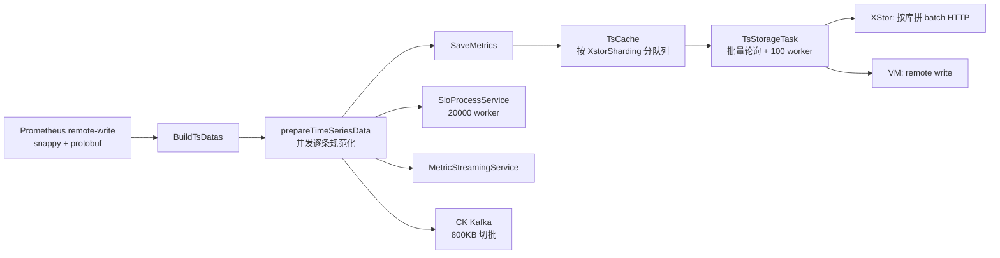

# 机制篇 A：Global 的写入数据面——接入、削峰、双写与旁路输出

> **结论先行**：Global 不是一个把 remote-write 直接转发给单一 TSDB 的薄代理。它先把请求反序列化为统一 `TsData`，并行完成元数据/标签处理，再将结果分为四条路径：XStor 异步批写、VM 代理写、实时流处理/SLO、ClickHouse Kafka 输出。这个设计把接入延迟与存储延迟部分解耦，但没有提供可靠的失败重放。

## 1. 从 HTTP 请求到四条输出路径

`MetricsService.WriteTimeSeries` 先并发处理输入，随后调用 `SaveMetrics` 入本地队列；同一份处理结果还会同步提交给 SLO、流处理与 CK Kafka。对应代码在 `service/bizservice/gwservice/gw_service.go:165-235`。

这里的关键边界是：**进入 `TsCache` 成功不等于已经落入 XStor 或 VM**。HTTP 请求的同步成功主要代表网关处理和入队完成；后端存储由后台任务异步完成。因此它降低了写入尾延迟，却把失败恢复责任留在了内存队列和监控告警上。

## 2. 接入层：减少反序列化分配，而不是照搬 vmagent

`VictoriaMetricsService.BuildTsDatas` 接收请求体：Snappy 解压、protobuf 反序列化、转换为内部 `TsDatas`。这里有两个高频路径优化：

1. `decodePool` 复用初始容量 5 MB 的解压缓冲；
2. `writeRequestPool` 复用 `WriteRequest`，对象归还前 `Reset()`；新对象预分配 8000 条 timeseries 容量。

见 `service/integration/victoria_metrics/victoria_metrics_service.go:202-250`。这是真实的 GC 优化：在高频 remote-write 请求下，避免每个请求重新申请大 byte slice 和 protobuf 容器。

但有一条工程前提：`defer decodePool.Put(buf[:0])` 依赖后续逻辑不持有解压 body 的引用。当前转换函数将 protobuf 字段复制到 `TsData`，所以逻辑成立；未来若改为零拷贝字符串/byte 引用，必须重新审计生命周期。

## 3. 入队：按 XStor 分片隔离，而非全局单队列

`TsCache.BatchSafePush` 按 `TsData.XstorSharding` 建立 `QueueMap`；没有分片键的数据进入 `default_db`。首次遇到某分片时按配置创建队列，随后批量压入。见 `service/cache/tscache/ts_cache.go:44-78`。

这解决的是典型的邻居干扰：某一个 XStor 分库慢，不应让其他分库的全部数据混在同一 FIFO 里。不过当前 `BatchPoll` 会遍历所有分片队列，把每个非空队列各取 `num` 条并合并，见同文件 `81-108`。当分片数很多时，一轮实际取出的总量可能远大于 `ReportTsNum`，因此 `ReportTsNum` 不是严格全局批次上限。

## 4. 削峰与并发：有界 worker，而非无限 goroutine

后台 `TsStorageTaskManager` 启动后持续批量拉取缓存，交给名为 `ts-save-pool` 的协程池；池大小常量为 `100`。有数据时提交任务，若配置 `OutputDataSleep` 大于零，则在提交后 sleep，源码注释即“削峰填谷”；队列为空时等待 500 ms。见 `task/local_task/ts_storage_task.go:38-105`。

协程池使用 `ants.PoolWithFunc`，`Invoke` 在容量耗尽时阻塞，这提供了进程级背压。实现见 `common/gopool/go_pool.go:33-58`。它比每批 `go func()` 更可控，也会上报 busy/max size 指标。

风险同样应坦诚：任务提交阻塞会把背压传回轮询循环，而入队一侧是否阻塞取决于队列实现与容量配置；当前这条链路没有持久化消息队列保证。源码自己在 `SaveTs` 前留下 TODO：写失败后数据会丢，尚未缓存失败数据重试（`ts_storage_task.go:128`）。

## 5. XStor：按分库拼 body、有界重试

`InfluxDBClient.WriteTsData` 遍历批内数据，以 `XstorSharding` 为 key 聚合。每个库使用复用的 `bytes.Buffer` 拼接 Influx Line Protocol，最终每个库发送一次 `/write` HTTP 请求。见 `service/integration/influxdb/influxdb_write_service.go:43-100`。

它并非无脑重试：仅配置白名单数据库才允许重试；仅网络错误、5xx、429 重试；最多 3 次；整批最多占用 5 秒。见 `influxdb_write_service.go:141-303`。这是保护后续批次的稳定性优先策略：当一个库失效时，宁可失败计数和告警，也不让 worker 无限卡死。

## 6. VM：配置门控的二次写入与标签护栏

写 VM 前，`Convert2PrompWriteRequestForCluster` 会按 StorageNode 分组，固定 `__name__` 后再将标签排序，以确保同一标签集合有稳定顺序。它还截断超过 100 字符的标签值、最多保留 60 个标签；见 `service/modelservice/model/ts_data.go:273-335`。这是高基数和异常 payload 的防护，但具有语义损失：两个仅后缀不同的长标签可能被压成同一值。

VM 代理写由 `VmProxyWrite` 与节点 `PreComputeWrite` 双重开关控制，且目前转换函数仅允许 `storageId == 1` 进入该路径。见 `service/integration/victoria_metrics/victoria_metrics_proxy_service.go:201-225`。客户端按 StorageNode ID 缓存，endpoint 变化时才重建，避免每批建连。

注意，XStor 与 VM 在同一 `SaveTs` worker 中是**串行调用**：先 XStor，后 VM（`ts_storage_task.go:130-134`）。因此“强一致双写”只是当前代码的顺序写尝试，并不是事务性双写；XStor 慢会拖慢 VM，任何一侧失败也没有补偿事务。

## 7. 两条旁路：SLO/流处理与 CK Kafka

网关完成处理后会直接调用：

- `SloProcessService.Submit`：逐条投递到 20000 容量 worker pool，进行 SLI 匹配、转换、注入和输出；
- `MetricStreamingService.WriteStreaming`：按流指标配置输出；
- `MetricCkKafkaService.WriteCkKafka`：仅 Ck 开关打开的指标被转换，按最大 800 KB protobuf 批次投递 Kafka。

入口见 `gw_service.go:200-214`，CK 批控制见 `service/bizservice/metric_ck_kafka_service/metric_ck_kafka_service.go:44-138`。Kafka 为 CK 下游提供了解耦，但在当前网关函数内仍是同步调用：Kafka producer 的慢或错会增加请求处理时间，只是错误被记录后并不阻断已经入队的 XStor 路径。

## 8. 面试回答

“Global 的写入面先把 remote-write 解码成统一时序对象，在网关中完成元数据处理。存储主链路用按 XStor 分片的内存队列和 100 worker 批量写，配合 `OutputDataSleep` 做可配置削峰；同批数据再按开关双写 VM，并旁路给 SLO、流计算和 CK Kafka。性能上我们做了 Snappy/protobuf 对象池、按库聚合、连接复用和 800 KB Kafka 切批。代价是现阶段没有落盘重放和双写事务，XStor 失败会影响后续 VM 写入，这是优先级很高的改进项。”
