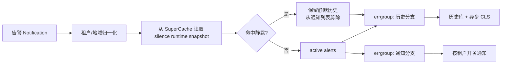

# 机制篇 D：Global 的告警接收、静默门控、历史留存与 SLO

> **结论先行**：从代码可直接验证的告警核心不是一个自研 PromQL 规则引擎，而是对进入 `AlertService` 的通知做租户归一化、静默命中、历史持久化与通知分发。最值得讲的性能设计是：静默在通知前短路；历史与通知并行；对告警列表原地过滤，避免高峰期重复分配。

## 1. 接收后的执行顺序

主要逻辑在 `service/bizservice/alertservice/alert_service.go` 的 `SaveAlerts` 与 `applySilence`。先归一化地域、确定 tenant；随后从 `SuperCache.AlarmSilenceCacheData` 得到活动静默规则，并在任何通知配置查询或外部通知前匹配。命中静默的 alert 仍进入历史分支，但从通知列表中剔除。

## 2. 为什么静默必须前置

`applySilence` 为匹配暂时加入 `alertId`、对象值等虚拟 label，匹配结束后删除；首条命中即短路。它既记录静默命中计数，也将静默引用写入 alert 的 process info。见 `alert_service.go` 中 `applySilence`。

如果静默放在发送通知之后，就仍会浪费规则查询、模板渲染、外部 IM/短信调用，并可能留下“已经通知后再标记静默”的审计矛盾。当前设计使“静默”成为通知链路的早期准入控制，同时保留所有历史，兼顾降噪与可审计性。

## 3. 历史和通知并行，但一致性是最终一致

静默处理后，`SaveAlerts` 用 `errgroup` 并发：

- 历史分支：将 active 与 silenced 合并，异步投递 CLS，转换后 `SaveAlarmHistory`；
- 通知分支：若无 active 或租户通知开关关闭则短路，否则 `Notify`。

代码通过每个分支耗时指标观察性能。这个并行降低了“保存历史阻塞通知”的尾延迟，却不提供原子性：通知成功、历史失败或反过来都可能发生。面试中应称为**最终一致的双副作用**，而非事务。

## 4. SLO 与告警的关系

SLO 不是在 `AlertService` 里实时计算。SLO 数据在写入数据面被 `SloProcessService` 提前转换并写 Kafka，详见 [03](./03-机制篇-流式处理与预计算.md)。告警服务消费的是已形成的 alert notification；本仓库没有证据表明它会在接收时对原始指标再执行一次完整 PromQL 评估。

因此更准确的架构说法是：**Global 同时提供 SLO 数据生产与告警通知运营能力，但规则评估器可能在外部系统。** 除非能给出评估任务的部署、接口或调用证据，不应宣称“Global 自研告警规则引擎”。

## 5. 缓存一致性和失效行为

静默规则来自 SuperCache 快照。快照加载失败时，`applySilence` 会返回未静默而继续处理，属于偏可用的失败策略；而某些核心缓存加载失败会终止当前刷新并继续使用旧快照。具体加载策略见 `service/cache/supercache/super_cache.go:190-315`。

这给出一个现实权衡：静默配置短时间不可用时，可能多发告警，但不会因为缓存故障全盘吞告警。对告警系统而言，这是比“未知就全部静默”更安全的默认值。

## 6. 面试回答

“Global 的告警核心是通知治理：接到告警后先做租户和地域归一化，在最前面用内存快照匹配静默；命中的告警仍保留历史，但不再进入通知。随后用 errgroup 并行写历史/CLS 和发送通知，以降低通知的尾延迟。它是最终一致设计，不假装有跨历史库和通知渠道的事务。SLO 计算则在数据写入期已异步转换后送 Kafka，和告警通知服务是两条协作链路。”
