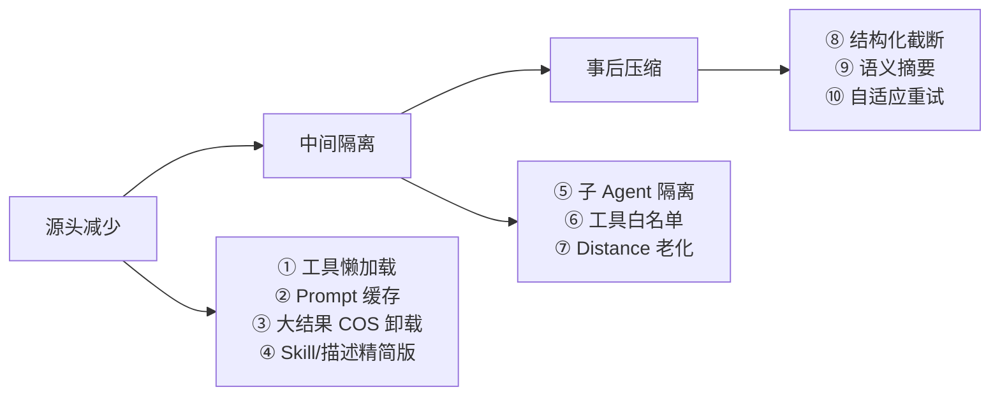

# 第一篇之一 · 架构坐标系 + 上下文管理

---

## 📑 目录

> 本篇讲「架构坐标系 + 上下文管理」，是机制篇第一篇。上下文管理是投入最多、最能讲深度的一块。

**0. 先建立坐标系**
- 0.1 进程与职责
- 0.2 推理循环不在业务代码里
- 0.3 五种 Agent 执行形态
- 0.4 四种协作拓扑

**1. 上下文管理（Context Engineering）**
- 1.0 全景：上下文管理 ≠ 压缩（三段式光谱）
- 1.1 压缩全景：七层，不是四层
- 1.2 Token 计数：三级降级 + 熔断
- 1.3 一次性上下文注入：`RunLocalValue` 哨兵去重
- 1.4 页面上下文的独立 Role 隔离
- 1.5 `BeforeModelRewriteState` vs `WrapModel`：两个钩子的分工
- 1.6 上下文压缩的短板（面试要主动说）
- 1.7 核心场景实战推演：七层是怎么协同的

---

# 0. 先建立坐标系

**为什么要先讲坐标系**：面试一该 tcum-ai，十个人里九个会开口就讲"上下文压缩、多 Agent、MCP"Ｌ——但面试官会反问一句：**"你们一共几个服务进程、Agent 循环到底写在哪个代码里、一个企业内的 15 个 Agent 是靠 supervisor 还是 transfer 协作的？"**——很多人当场就卡住了。因为你把循环、Agent 形态、协作拓扑这三件事混一起讲，就无法告诉对方 "哪些能力在与 eino 同一层、哪些在业务代码、哪些在拼装层"。而且后面讲上下文压缩时开射“请求层/会话层/接入层”这种术语，也必须先告诉对方这些层在哪里。**坐标系不是背名词，是为了后面每一个技术点不抢诖、不循环定义。**本节四个坐标推递：进程职责 → 循环写在哪 → 5 种 Agent 形态 → 4 种协作拓扑Ｌ——同时推出一个关键边界：**推理循环不在业务代码里（在 eino ADK）、官宣的 supervisor 代码里零调用实际走 Deep 模式**——这两条不主动讲面试官自己也能看代码发现，与其被击穿不如主动招供。

## 0.1 进程与职责

| 进程 | 入口 | 职责 |
|---|---|---|
| `agent_access` | `cmd/server/agent_access/` | 接入层：对话/会话、数字分身、知识库控制面、AG-UI SSE 网关、企微机器人 |
| `obs_agent` | `cmd/server/obs_agent/` | 可观测域 Agent（监控、指标、日志、Grafana、CMDB、天巡） |
| `ops_agent` | `cmd/server/ops_agent/` | 运维域 Agent |
| `mcp_server` | `cmd/server/mcp_server/` | MCP **Provider**：12 个子 MCP Server，对外约 128 个工具 |
| `kb_server` | `usercases/kb_server/` | 知识库数据面（trag 平台代理） |

## 0.2 推理循环不在业务代码里

这是面试第一个高频追问点。**业务侧完全不写推理循环**，循环在 eino ADK 内部：

| 层 | 位置 | 说明 |
|---|---|---|
| 循环图声明 | `vendor/github.com/cloudwego/eino/adk/react.go:340` | `newReact(ctx, *reactConfig)` |
| 循环驱动 | `vendor/.../adk/chatmodel.go:761` | `buildReactRunFunc` → `g.Compile()` → `runnable.Stream/Invoke` |
| 顶层入口 | `vendor/.../adk/chatmodel.go:952` | `(*ChatModelAgent).Run`，**每次调用起新 goroutine** + `AsyncIterator[*AgentEvent]` |
| 无工具捷径 | `vendor/.../adk/chatmodel.go:696` | `buildNoToolsRunFunc`，`Lambda → ChatModel` 不成环 |

图拓扑（节点名硬编码 `"Init"` / `"ChatModel"` / `"ToolNode"`）：

```
START → Init(Lambda) → ChatModel ──branch(toolCallCheck)──> END(无 tool_calls)
                          ↑                              └─> ToolNode ──┐
                          └──────────────────────────────────────────────┘
```

`toolCallCheck` 用 `compose.NewStreamGraphBranch` **流式**扫描 chunk，只要 `len(chunk.ToolCalls) > 0` 就走 `ToolNode`——**判定是流式的，但执行仍等完整 assistant message**（与 CC `StreamingToolExecutor` 的关键差距）。

`compose` 图 与 `adk.Runner` 是**纵向叠加**而非二选一：`Runner` 管Agent 生命周期（启动/恢复/checkpoint/事件流），`compose.Graph`/`Runnable` 管节点级图执行。一个 `ChatModelAgent` 被 `task` 工具委派时，外层套 `adk.Runner`、内层跑 `newReact` 编译出的 `Runnable`。

## 0.3 五种 Agent 执行形态

| # | 形态 | 载体 | 内部机制 | 生产实例 |
|---|---|---|---|---|
| 1 | 单体专家 | `DefaultAgent`（`pkg/agent/default_agent.go`） | `ChatModelAgent` + ReAct 图，`MaxStep` 控迭代 | `prometheus_promql_expert`、`barad_influxql_expert` |
| 2 | Deep Agent | `BuildDeepAgent` → `deep.New`（`agent_builder.go:176`） | 子 Agent 打包进**一个 `task` 工具**；自带 `write_todos`、文件系统工具、`general-purpose` 兜底子 Agent | `obs_summary_analysis_expert` 类 |
| 3 | 动态聚合总入口 | `NewSupervisorAgent`（`agent_service.go:112`） | **请求时**查库 `ListAgents(Enabled=1)` → 造远程壳 → `deep.New` 现场装配，子 Agent 描述拼进 `<子Agent列表>` prompt | `supervisor` |
| 4 | 运行时人格 Agent | `digital_twin_agent` + 4 个 Twin 中间件 | 构建期**空壳**（`GetSubAgents` 返回 `nil`、`WithoutGeneralSubAgent=true` → 连 `task` 工具都不生成），全靠 `BeforeAgent` 链现场注入；`Tools` 从 0 变非 0 触发 `rebuildGraph` **重编 ReAct 图** | `digital_twin_agent` |
| 5 | 工作流 Agent | `WorkflowAgent`（`pkg/agent/workflow_agent.go`） | 包一个编译好的 `compose.Chain`（模板→Model→Tools→模板→Model），**无迭代、无委派、无 BeforeAgent** | `rules_analysis_agent` |

## 0.4 四种协作拓扑

| 拓扑 | 机制 | 上下文 | 并发 | 现状 |
|---|---|---|---|---|
| 单 Agent | — | — | — | ✅ |
| **Deep（Agent-as-Tool）** | `task` 工具 + `adk.NewAgentTool` | 子 Agent **隔离**（只收一段 `description`） | 可并行 | ✅ 主力 |
| Supervisor（transfer） | 框架 `transfer_to_agent` 星形强制回传 | 共享上下文、串行 | 否 | ❌ **0 处调用** |
| 跨进程 A2A / AGUI | `A2AAgent`/`AGUIAgent` 远程壳，HTTP+SSE | 跨服务 | 流式 | ✅ 主力 |

---

# 1. 上下文管理（Context Engineering）

**为什么上下文管理是投入最多的一块**：很少团队一开始就想到这么多。我们自己也是 2026-01 告警诊断专家上线后，**连续两周在线上撞 `400 ContextWindowExceededError`**Ｌ——一次跨产品根因分析常常撞上限，整轮工作白费Ｌ——才认真把上下文当个正事。而且一重构发现难处不只一处，而是一个矛盾集合：工具结果一次几 MB、历史多轮多工具并发“从 18k 直跳 128k”、压缩自己又能把自己撞爆Ｌ——**任何单一手段都处理不了所有场景**。于是征征看到一个七层防御体系：**L0 输出表示 → L1 结构化截断+COS 卸载 → L2 说明书侧压缩 → L3 周期性 summarization → L4 撞墙自适应重试 → L5 摘要替代历史 → L6 场景化裁剪**Ｌ——每一层都对应一类真实失效。本节一开始先告诉你一个反直觉的结论：上下文管理不等于“压缩历史”，**真正高手先问“这段信息有没有必要进 context”（源头减少）、“进了之后能不能隔离掉”（中间隔离），实在不行才去压缩**。七层里 L0~L2 就是“不让它进来”那两段。

长会话 Agent 的上下文矛盾本质是**两个极端**：

- **单次注入爆炸**：一个"分析看板近 6 小时数据"请求，工具一次返回可能是几 MB 时序 JSON；
- **多轮累积爆炸**：排障会话动辄 20~30 轮，每轮带若干工具结果。

## 1.0 全景：上下文管理 ≠ 压缩（三段式光谱）

**先破一个最常见误判**：很多人以为"上下文管理 = 压缩历史"。实际上压缩只是最后一道防线，真正的高手会先问——**这段信息有没有必要进 context？进了之后能不能隔离掉？实在不行才去压缩它**。

整套上下文治理拆成**三段式光谱**，按"介入时机从早到晚"排：



- **源头减少**：从一开始就不让它进 context——懒加载、缓存、卸载、精简"说明书"；
- **中间隔离**：让它进 context 但"分开装"或"装完就过期"——子 Agent 只回结论、按租户/角色收窄工具、内容随时间淡出；
- **事后压缩**：已经进了 context 才想办法瘦身——结构化截断、摘要、撞墙自愈。

**第一性原则**：**能在便宜的层解决，就不要升级到贵的层**。同样是要省 token，Prompt Caching 是 O(1) 声明式、零推理开销；summarization 要额外调一次 LLM、几百 ms 延迟——只有前者失效才用后者。

### 1.0.1 现有手段 → 三段式映射

本章后面 `1.1~1.7` 讲实现细节，先给一张**归类总表**建立坐标系，面试开场用这张表立框架：

| 段 | 手段 | 本仓库实现 | 位置 | 状态 |
|---|---|---|---|---|
| 源头减少 | 工具懒加载 | `DynamicMcpMiddleware` 按分身 `McpConfig` 请求级注入 | `pkg/agent/dynamic_mcp_middleware.go` | ✅ 进程/请求级；⚠️ 轮次级可补 |
| 源头减少 | 大结果 COS 卸载 | L1 超 64KB 上传 COS + 沙箱回捞 | `middleware_truncator.go` | ✅ |
| 源头减少 | Skill 精简版 | `compactSkillContentForLLM` 喂模型用精简版、沙箱用完整目录 | `skill_content_compactor.go` | ✅ |
| 源头减少 | mcporter 零“远端 tool-schema” | 远端 MCP 工具不注册成 N 个 `tool.BaseTool`；初始固定工具仍有 `skill` + `skill_exec`，具体 MCP 说明在加载对应 Skill 后作为 tool result 按需出现 | `mcporter_schema.go` | ✅ |
| 源头减少 | 一次性注入哨兵 | `RunLocalValue` 去重，时间/用户/租户/实体规则只注入一次 | `1.3` | ✅ |
| 源头减少 | **Prompt Caching** | `cache_control: ephemeral` 标记稳定前缀 | — | ❌ **最大缺口** |
| 中间隔离 | 子 Agent 隔离 | Deep `task` 工具，子 Agent 完整 trace 不回传 | `0.4` | ✅ |
| 中间隔离 | 工具白名单 | `adminOnlyTools` + `allowedTools` + `SubAgentIDs` | `twin_soul_middleware.go` / `dynamic_mcp_middleware.go` | ✅ |
| 中间隔离 | Distance 老化 | `skill_cache` 轮次距离过期（L2） | `skill_cache.go` | ✅ |
| 中间隔离 | 页面上下文 Role 隔离 | `context` 角色只影响当次、不进历史 | `1.4` | ✅ |
| 事后压缩 | 结构化截断 | L0 紧凑契约 + L1 四类结构化截断 | `middleware_truncator.go` | ✅ |
| 事后压缩 | 语义摘要 | L3 预防性 + L5 跨轮 Period 分层 | `summarization_handler.go` / `dialog_history_service.go` | ✅ |
| 事后压缩 | 自适应重试 | L4 超限后 T1→T5 递进压缩 | `adaptive_context_retry.go` | ✅ |
| 事后压缩 | 场景化裁剪 | L6 报告/记忆的激进裁剪 | `filterMessagesForReport` | ✅ |

> 注：`✅`=已落地可核验；`⚠️`=部分落地；`❌`=未实现（roadmap）。

### 1.0.2 当前缺失 / 可扩展的手段（roadmap）

除上面标注 `❌` 的 Prompt Caching，还有几个低成本高收益方向，面试被问"你们还有什么没做"时可直接讲：

1. **Prompt Caching（最大缺口，最高优先级）**：system prompt 里的 skill 描述、工具描述、`<子Agent列表>` 都是稳定的——在这些块末尾加 `cache_control: {"type":"ephemeral"}`，下次请求（5 分钟内）走 KV Cache，费用降约 90%、延迟降约 85%。改造成本极低，但要先确认 TCUM-LLM-LB（litellm proxy）是否透传该字段。
2. **会话级 KV Cache**：同一 session 多轮对话前缀完全一致，只有最新 user 消息变化。若底层模型支持 session-scoped cache，可在会话入口传 `session_id` 复用。
3. **工具描述精简**：每个工具 description 常写 300 字、实际 50 字够。可用 LLM 重写为最短版 + 人工审核（如 `"Start ms timestamp"` 替代长句）。
4. **消息合并（Message Merging）**：一轮并发 N 个**相关** tool 结果（都在查同一告警上下文）可合并成一条摘要文本，省 20~30% tokens，代价是丢粒度。
5. **共享 Context Store**：多个 Agent 共用的"世界状态"（当前时间/用户/租户/地域）不放 context，存外部 KV，需要时用 `get_environment` 工具查。
6. **静态引用替代动态展开**：大而稳定的内容（如 Prometheus 全部 metric_type 列表）不每次 inline，用 `metric_types_ref_v1` 引用，首次 inline 一次走 prompt cache。
7. **子 Agent 结论缓存**：同一子 Agent 被主 Agent 反复调用问相似问题，给 `task` 工具加 `key = agent_name + question_hash` 缓存，避免重复委派。

---

## 1.1 压缩全景：七层，不是四层（三段式中以"事后压缩"为主，兼跨源头与隔离）

面试里最容易被打穿的说法是"我们做了截断 + 摘要"。真实链路是**七层，按"数据流经顺序"叠加**，其中三层不花任何 LLM 调用：

```
① 工具序列化时      L0 输出表示层压缩（列式 compact_table / 元组压缩）        零成本，**仅已实现紧凑契约的工具生效**
② 工具返回后L1 结构化截断 + COS 卸载（>64KB）                        零成本，事件触发
③ 组装 prompt 时    L2 Skill/工具描述侧压缩（精简版 SKILL.md / 距离淡出 / 零 schema）零成本，每轮
④ 每轮调模型前      L3 summarization 预防性摘要（累计 > maxTokens/2）         1 次 LLM
⑤ 真正调模型时      L4 AdaptiveContextRetry（400 超限后原地压缩重试）         零LLM（纯本地）
⑥ 跨轮/落库         L5 摘要替代历史 + Period 分层（未摘要 ≥10 条）            异步 1~2 次 LLM
⑦ 特定场景          L6 场景化裁剪（报告只留 user+最终回答 / 记忆 LLM Rerank）  0~1 次 LLM
      ─────────────────────────────────────────────────────────
      横切：TokenCounter 三级计数（local / litellm 精确 / fallback+熔断）
```

**总纲一句话**：L0~L2 是"**不花钱的表示层与结构层压缩**"，L3/L5/L6 是"**花 LLM 的语义压缩**"，L4 是"**不花 LLM 的应急压缩**"。工程原则是——**能在便宜的层解决，就不要升级到贵的层**；越靠前的层越无损、越可预测。

### L0：输出表示层压缩（最便宜、最容易被忽略的一层）

不属于任何中间件，也**不是一个“发现 JSON 数组就自动压缩”的全局算法**；它是工具作者在序列化结果前，主动选择的一种**输出契约（output contract）**。因此先把最容易混淆的问题说死：

> **不会。返回值里有数组，不等于触发 L0。** 代码中不存在“`json.Unmarshal` 后只要发现 `[]` 就把对象数组改成 columns + rows”这类扫描/改写逻辑。L0 的触发条件是：**本次实际被调用的工具，其实现显式构造并返回了紧凑格式**。没有采用该契约的工具，即使返回十万个数组元素，也不会在 L0 被自动改写；它仍会原样进入后面的 L1 大小阈值判断。

当前仓库中可以直接由代码确认的 L0 实现只有下列两类（这是“已落地范围”，不能泛化为所有工具）：

- `ListCmdbServersCompact` 在工具自身的成功输出处显式传入 `model.OutputTypeCompactTable` 和 `model.CompactTableData{Columns: validFields, Rows: rows}`（`usercases/obs_agent/tools/cmdb/tool_list_cmdb_servers_compact.go:375-377`）。这才会得到 `{"type":"compact_table","data":{"columns":[...],"rows":[...]}}`：**N 行数据只出现一次字段名**，相比 `[{k:v}, {k:v}...]` 行式 JSON 直接省掉 `(N-1)×key` 的重复 token；截断时 `columns` 保持不变、只截 `rows`（`middleware_truncator.go:257-267`），保证模型永远知道每个位置的字段含义；
- 为此专门给模型留了重构提示：`data.columns（字段名数组）+ data.rows[*]（每行是与 columns 顺序对齐的值数组，重构成 dict 的方法:pandas.DataFrame(data['rows'], columns=data['columns']))`（`getTruncateDataPathHint`）；
- `QueryArchTopology` 在工具内无条件把服务响应转换为 v3 紧凑图（`toCompactData → toCompactGraph`，`usercases/obs_agent/tools/cmdb/tool_query_arch_topology.go:158-186`）：同一 `DotType` 的节点共用一次 `schema`，每个节点变成 `[key, attrVal_0, ...]`；同一 `(FromDotId, EdgeType)` 的多条边折叠并序列化成 `[from, type, [to...]]` 元组（`:90-101`、`:128-155`、`:283-320`）。它支持的单次实体输入上限是 30（`:16-17`、`:349-354`），但“30”是**输入批次上限**，不是 L0 的触发阈值；查 1 个实体同样会走该紧凑编码。`QueryImpactChain` 复用了同一份 v3 紧凑图格式。

#### L0 的准确触发矩阵：不要把“数组”“阈值”和“紧凑格式”混为一谈

| 本次工具结果/条件 | L0 会不会发生 | 实际行为 | 后续是否可能 L1 |
|---|---:|---|---:|
| 调用 `ListCmdbServersCompact`，无论返回 0、1 还是 N 行 | 会 | 工具直接构造 `compact_table`；并非先返回普通数组再被框架压缩 | 会；只有序列化后的最终字符串超过有效字节阈值才截 `rows` |
| 调用 `QueryArchTopology`，无论输入是 1 个还是最多 30 个实体 | 会 | 工具直接构造 v3 列存节点 + 折叠边元组 | 一般不希望发生；该工具配置了 2 倍阈值来尽量完整返回，仍超限时才进入 L1 |
| 普通工具返回 `[]`、`[{...}]`、或对象里嵌套数组 | 不会 | 不做数组探测、不改 key、不改顺序、不自动变成 `columns + rows` | 会；只按完整结果的字节大小及 L1 例外规则判断 |
| 普通工具返回很小的 JSON 对象/数组 | 不会 | 原样透传 | 不会；未超过有效阈值 |
| 普通工具返回很大的 JSON 对象/数组 | 不会 | L0 仍不介入 | 可能；超过有效阈值后，L1 再按已支持的结构做截断或原始字符串降级 |
| `browser_screenshot`、`skill`、`task` | 取决于工具自身；白名单不负责 L0 | L1 白名单直接原样透传 | 不会；即使很大也跳过 L1 |

这里有两个十分重要的边界：

1. **“compact”不是 Go 的 `json.Marshal` 默认压缩。** 标准序列化去掉缩进、空格只是 JSON 的常规紧凑表示；文档中的 L0 指的是更强的、语义不变的结构重排——例如字段名外提为 `columns`，或把边对象折叠为固定位置的元组。两者不能混称为“JSON 压缩”。
2. **“零信息损失”有作用域。** 对已声明输出字段而言，`compact_table` 的 columns/rows 可逆，v3 图的 `schema`/rows/edge tuple 也保留了其紧凑契约中的信息；但 `QueryArchTopology` 的紧凑包装本来就刻意不带上游响应中的 `DotMetrics`、`DotStyle`、`InnerDot`、`Description`、`EdgeId` 等字段（源码注释 `tool_query_arch_topology.go:85-88`）。所以准确说法是“对**紧凑输出契约选择保留的字段**无损”，不能笼统说“对上游原始响应所有字段无损”。

> **可以吹、但必须带范围的点**：对采用紧凑输出契约的工具，L0 是**零 LLM、零额外网络调用、在该工具每次成功序列化时发生**的表示层优化，收益随重复字段和边对象数线性放大；它不是全仓“每次请求都生效”的通用中间件。很多团队一上来就做 LLM 摘要，反而把这类最便宜、最可预测的结构优化跳过了。

### L1：工具结果结构化截断 + COS 卸载

`usercases/obs_agent/tools/common/middleware/middleware_truncator.go`，挂在 eino 的 `ToolsNodeConfig.ToolCallMiddlewares`（**不是** `ChatModelAgentMiddleware`，两套独立扩展点）。

1. **阈值三级**：默认 `defaultToolResultMaxSize = 64KB`（`:22`）→ 环境变量 `TOOL_RESULT_MAX_SIZE` 覆盖（非法值 warn 后 fallback）→ per-tool 覆盖（`register.go:57`：`QueryArchTopology` 给 `2 * DefaultToolResultMaxSize()`，用**倍数**而非绝对值，保证调整默认值时相对比例稳定）。
2. **白名单完全跳过**：`skipTruncateTools = {browser_screenshot, skill, task}`（`register.go:43`）—— 截图是二进制、`skill` 返回的是文档正文、`task` 返回的是子 Agent 的**结论**（已经是压缩产物，再截会破坏结论完整性）。**但要主动承认这是个敞口**：子 Agent 报告和 skill 正文一旦失控膨胀，第一道防线完全不设防，只能靠 L3/L4 兜。
3. **业务错误跳过**：`isBaseOutputError(result)` 为真直接跳过（`ErrorCode` 非 0 且非 2xx，或 `ErrorMsg` 非空），避免对错误响应上传 COS 并污染 `metadata.COS_URL`。
4. **结构化截断而非暴力切字符串**，共 5 类 + 2 形态（`truncateBaseOutput`）：`metrics`(`data.data.result[*]`) / `table`(`data.results[*]`) / `compact_table`(只截 `rows`) / `raw_grafana`（**两种形态**：Grafana `/api/ds/query` 的 `results.{refID}.frames[*].data.values` 列式，与 CLS proxy 的 `Response.AnalysisRecords / Results / AnalysisResults` 行式，按序试探）/ 兜底 `AnalyzedMetricsOutput`(`Series`)；全部失败才降级 `truncateRawResult`（暴力切字符串 + 附 WarnMsg）。**动机**：暴力截断 JSON 会破坏结构，模型无法解析，等于既花 token 又没给到信息。列式结构里"同一 frame 内所有列对齐同一个 keep 数"，保证时间戳与数值一一对应。
5. **保留条数用比例法而非固定值**：`estimateTruncateCount = totalCount × (maxSize/totalSize) × 0.8`，最少保留 1 条（`:501`）。`0.8` 是给 WarnMsg 和 metadata 留的余量——**截断本身也会引入新内容**，这个细节很多实现会漏。
6. **COS 卸载 + 行动指令**：超限后会**先尝试**把完整结果上传 COS（`tool-results/` 前缀，预签名 URL 的有效期为 **2h**；`GetPresignedURL` 失败才降级为按 `BucketURL/key` 拼出的直链）。这里不能写成“超限必然有 COS_URL”：全局 COS client 未初始化、`PutBytes` 上传失败、或结构化/原始截断路径无法注入链接时，截断仍会发生，但 `COS_URL` 为空，WarnMsg 会明确写“完整数据上传失败”，只能基于样例分析；只有拿到非空 URL 的结构化结果才会在 `Metadata["COS_URL"]` 留链接，并生成 `WarnMsg`：

```
⚠️ 数据已截断：查询结果共 N 条，当前仅返回前 M 条作为样例…完整数据已上传至COS，COS_URL：…
请根据当前已返回的截断样例数据推断完整 JSON 结构，设计一个 Python 分析脚本：
1) 通过 HTTP GET 从上述 COS_URL 下载完整 JSON 数据；
2) 按照截断样例的相同结构解析完整的 N 条数据；
3) 根据用户需求对完整数据进行统计分析并输出结果。
请通过 skill_exec 工具执行该脚本以获取完整分析结果。
```

**最值得讲的一点**：框架**从不自动回读 COS**。真正读 COS 的执行体是"LLM 自己写的 Python 脚本在 `skill_exec` 沙箱里跑"，回到上下文的是**分析结论（stdout）而非原始数据**。

#### L1 的准确触发顺序：数组只是载荷，不是开关

`NewResultTruncateMiddleware` 注册为全局 ToolCall middleware 后，**每一次经过该 ToolsNode 的工具调用**都会先走下面的判定；但只有最后一个条件满足才真的截断。这样能回答“数组会不会触发 JSON 压缩”这个问题：**不会，L1 的开关是最终序列化结果的 byte 长度，不是 JSON 类型、数组数量或数组长度。**

```text
实际执行工具
  → 工具名在 {browser_screenshot, skill, task}？
       是：原样返回，L1 结束
       否：检查 result 是否可识别为 BaseOutput 业务错误
             是错误（非 2xx code 或 ErrorMsg 非空）：原样返回，L1 结束
             否：取 per-tool 覆盖值或全局 TOOL_RESULT_MAX_SIZE
                   → len(output.Result) > effectiveMaxSize？
                        否：原样返回，L1 结束
                        是：尝试上传完整字符串到 COS
                             → 按 BaseOutput.Type 做结构化截断
                             → 结构不匹配时退回原始字符串截断
```

特别注意三个容易误解的细节：

- **比较的是 Go 字符串的 `len(result)`，即 UTF-8 bytes，不是 token，也不是 `data` 数组的元素数。** 一个包含 1 个超长字段的对象可以触发；一个有 1 万个短元素、但整个结果仍不超过阈值的数组不会触发。反过来，L0 的 `compact_table` 虽然本身含 `rows` 数组，也只是让它更不容易达到 L1 阈值，不会因为 `rows` 是数组而“额外触发”任何压缩。
- **阈值是严格大于。** `resultSize == effectiveMaxSize` 原样返回；只有 `>` 才进入 COS/截断。默认 `64 * 1024` 是 65,536 bytes，`TOOL_RESULT_MAX_SIZE` 只在进程启动加载，空、非整数或小于等于 0 的配置都会 warn 并回退默认值。`QueryArchTopology` 的有效阈值是当前默认值的两倍，而不是写死 128KB。
- **“结构化截断”并不意味着任何 JSON 都能按数组截断。** `truncateBaseOutput` 必须能解析出非空 `data`，且其 `type/data` 要匹配已实现的 metrics、table、compact_table、raw_grafana 或 `AnalyzedMetricsOutput` 路径。纯数组、没有 `data` 的对象、未知类型、或者已知类型但对应数组为空/形状不符，都会走 `truncateRawResult`；那一支保留原文前缀样例并附提示，不能保证 JSON 仍可被机器解析。因此“所有数组都结构化压缩”既不符合 L0，也不符合 L1。

> **一句话价值**：把"数据大"与"上下文小"解耦成——**数据留在对象存储、算力放到沙箱、只有结论进 token**。

### L2：Skill / 工具描述侧压缩（零 LLM，每轮生效）

这一层压的**不是对话数据，而是"每轮都要重发的指令与schema"**——恰恰是长会话里最容易被忽视的固定开销（详见第二篇）。三个手段：

| 手段 | 代码 | 机制 | 效果 |
|---|---|---|---|
| **精简版 SKILL.md 替换** | `skill_content_compactor.go` | `compactSkillContentForLLM(name, content)`：`operations-analysis` 这个 skill 的原始 SKILL.md 太大，返回给模型的文本换成**人工手写的行为等价精简版**（含工具签名、静态 code→中文名映射、禁止项清单）；**`BaseDirectory` 保持完整**，`skill_exec` 仍能读到原始目录 | 单个 skill 每轮省数千 token，行为不变 |
| **对话级 skill 缓存 + 距离淡出** | `skill_cache.go` | `MaxDistanceThreshold=3`（3 轮后内容替换为 `ExpiredHint="[Skill内容已过期，如需使用请重新加载]"`）+ `ExpiredRetentionRounds=2`（再留 2 轮才真正删除）+ `MaxCacheSize=10` + `MaxContentLength=20KB` 单条截断；淘汰排序 = `Distance` 升序优先、`LastAccessed` 降序 tie-break（近似 LRU）；`UserQuery` 只在 `Distance ≤ 2` 时展示 | 技能内容随对话推进**渐进淡出**而非硬删 |
| **mcporter 零远端 tool-schema 路线** | `mcporter_schema.go` + `CosSkillBackend` | 远端 MCP 工具不注册成 N 个 `tool.BaseTool`，而是沙箱 CLI 命令；初始固定 schema 是 `skill` + `skill_exec`，具体工具签名只在对应 skill 被 `Get` 时作为该次 tool result 的正文追加 | 几十个远端 MCP 工具的常驻 schema 开销 → 近 0 |

> **这一层的价值主张**：`L1` 压的是"**数据**"，`L2` 压的是"**说明书**"。运维 Agent 挂 20+ 工具时，说明书的每轮固定开销常常比数据还大，而它100% 是可预测、可提前优化的。

### L3：summarization 预防性摘要

`pkg/agent/summarization_handler.go` → `BuildSummarizationHandler(ctx, cm)`，实现 `BeforeModelRewriteState`（框架**每轮**模型调用都触发）。对官方 `summarization.New` 做 4 处定制：

```go
handler, err := summarization.New(ctx, &summarization.Config{
    Model: compressAwareModel,                                     // ① 压缩模型自身也包 adaptiveContextModel
    Trigger: &summarization.TriggerCondition{
        ContextTokens: modelMaxTokens / 2,                         // ② 阈值 = 模型上限一半（100k → 50k）
    },
    UserInstruction: summarizeUserInstruction,                     // ③ 引导保留 COS_URL 清单
    GenModelInput:   buildSummarizeGenModelInput(modelMaxTokens),  // ④ 压缩请求自身的预算裁剪
    Callback: func(ctx, before, after adk.ChatModelAgentState) error {
        log.InfoContextf(ctx, "summarization completed: %d messages -> %d messages", ...)
        return nil
    },
})
```

- **① 的动机很妙**：压缩请求本身也可能超限（要把一大堆历史塞给压缩模型），所以用同一个 `adaptiveContextModel` 包一层，形成**递归自保**，避免 `failed to generate summary` 直接中断会话。
- **③ `UserInstruction`**：显式要求「不要复制 tool 样例 JSON，末尾集中列出一张"待用 COS 数据"清单（含 COS_URL）」。历史被摘要掉后，模型仍能顺着 COS_URL 重新触发沙箱下载。
- **④ `GenModelInput`**：预算 `modelMaxTokens * summarizeModelInputSafetyRatio(0.9)`，异常配置兜底 80000。**两道保护 + 三级 elide**：
  - 保护一（`markUnreadToolMessages`）：从后往前扫，**"其后没有出现过 assistant" 的 tool 消息= 未读**，一律不动—— 它们是当前推理轮的原始输入；
  - 保护二：`summarizeKeepRecentToolMsgs = 2` 条最近 tool 结果（无论已读未读）保持完整 —— **它们决定模型下一步行动**；
  - 候选集 = 已读 ∩ 非最近 2 条，按**时间从旧到新**依次 elide，累计释放够`overflow` 就停；
  - 单条 elide 三级降级（`elideToolMessage`）：① `elideToolMessageAsStructured` 解析 `BaseOutput`，命中 `warnMsg` 非空 **或** `metadata.COS_URL` 非空 → 只留 `{type, metadata, warnMsg, errorCode, errorMsg, dataElided}`，**`data` 整段丢弃**；② 字符串命中 `⚠️ 数据已截断` marker → 保留 marker 起至末尾的整段 WarnMsg；③ 都不命中且≥2000 chars → 降级为引用占位（附`extractCOSURLHint` 摘出的第一个 COS 链接）。**<2000 chars 的小 tool 结果一律不动**，避免压缩收益抵不过信息损失。
  - 若 `elidableIdxs` 为空（全是未读或全在最近 2 条内）→ 打 warn 日志并**原样返回**，附排查建议"近端 tool 结果过大，考虑降低 tool 结果截断阈值"。**这正是 L4 存在的原因**（见下一节）。
- **⑤ 顺带修协议**：`fixEmptyContentMessages` 把 `role=assistant && Content=="" && len(ToolCalls)>0` 的消息补成 `[调用工具: A, B]`。原因是 litellm 代理后端**严格要求 content 非空**，而 ReAct 下发起 tool_calls 的 assistant 消息 content 天然为空 → 会导致压缩请求自己被 400 拒绝。这是踩过的真实坑。
- **统一入口的动机**：注释写明——避免 `BuildDeepAgent` 路径静默丢失压缩能力（`agent_builder.go:236-242`）。踩过坑留下的防御。

### L4：AdaptiveContextRetry —— 超限后原地自适应压缩重试（零 LLM 调用）

`pkg/agent/adaptive_context_retry.go`，实现 `WrapModel`（把真实模型包成 `adaptiveContextModel`）。

**它存在的根本原因**（文件头注释，可直接当面试答案）：

1. summarization 的阈值判断粒度是「**轮次之间**」。而 eino 的 `ToolsNode` 对一轮 N 个 `tool_calls` 是**并发执行、`wg.Wait()` 一次性全部返回**的（`compose/tool_node.go:751-783`）。token 是**跃迁式**暴涨——完全可能从远低于 50k 一步跳到超过 100k，**直接跳过整个安全区**。
2. 更致命：这批结果全是「**未读tool**」（当前推理轮的原始输入），summarization 压缩阶段**强制保留未读 tool** → 无 elidable 内容 → 只能把超限 messages 原样送给主LLM → 400 → **会话中断**。

> **所以：并发是因，超限兜底是果。** 这个因果关系说清，远胜于背"我们做了压缩重试"。

**算法（目标预算驱动 + round 递进解禁）**：

```
外层循环 round = 1..3(adaptiveMaxCompressionRounds)
1. parseOverflowInfo(err)：4 条正则从 400 消息里 parse 真实 (currentTokens, maxTokens)
   —— 不是瞎猜；parse 失败才回退 utils.GetModelMaxTokens()
2. targetTokens = maxTokens * 0.85 (adaptiveTargetSafetyRatio，留 15% 给输出+估算偏差)
   currentTokens = parse 值 优先 > TokenCounter 精确值 > 本地 chars/4
   needSave = currentTokens - targetTokens（≤0 时给 10% 保底压缩量）
3. buildCandidates：给每条消息打5 个标签
   idx / role / sizeBytes / isUnread（其后无 assistant）/ toolBatchID / density
   computeDensity: system,user=High | tool 带 warnMsg|COS_URL|"已省略"=Low | 其他 tool=Medium
                   assistant <500 chars=High（决策）|≥500=Medium（CoT）
4. sortByCompressionPriority：先【剔除 system / user / 短 assistant】，
   再按 已读 > 未读 → Low > Medium > High → size 大 > 小 排序
5. 逐条 compressSingleMessage，累计 saved ≥ needSave 即停：
     tool:T1 结构化采样（保留 data 数组前 5 条 + 打 _sampledHint）
             → T2 结构化整段丢 data（保留 metadata/warnMsg/COS_URL）
             → T3 引用占位（仅 tool 名 + call_id + COS_URL 提示）   [round ≥ 2 才解禁]
     assistant: T4 头尾各留 800 chars，中段省略                [round ≥ 3 才解禁]
   ★ round 门控：round 1 完全不动未读消息；round 2 才允许动未读 + T3；round 3 才允许 T4
6. 一条都压不动 → compressExtremeFallback 极限档：
   system 头尾各留 1500 chars + 一条"[上下文因超限被强制截断]"占位 user 消息
   + 最后一条 user 起的 tail（tail 内 tool 全走 T2，>2000 chars 的走引用占位）
   仍超预算 → tail 内 >1000 chars 的 assistant 再头尾各留 400
   ★下限保护：targetTokens < 4096 (adaptiveMinBudgetTokens) 直接放弃，返回 nil
7. fail-fast：用 TokenCounter 重算，若 counted > target×1.05 且 round<3
   → 【不发请求】，带着压缩结果直接进下一轮更狠的压缩
   （最后一轮无条件发送，作为兜底）
8. 达标 → inner.Generate(compressed)；成功即返回，上层完全无感知
   非超限错误（限流/网络）→ 立即原样返回，不做无意义重试
```

**四个可单独讲的细节**：

- **协议安全**：严格保持 `tool_call_id ↔ tool` 一一对应，**只改 `Content` 不删消息**（极限档除外）。很多人做压缩直接删消息，结果触发另一类 400。
- **COS_URL 穿透压缩**：tool 侧 T1/T2/T3 三档都强制保留 `WarnMsg`/`COS_URL`（T1 保完整结构、T2 保 `metadata`、T3 靠 `extractCOSURLHint` 单独摘一条链接附在末尾，`buildReferencePlaceholder:776-793`）。**COS_URL 是一个能穿透任意层压缩的"数据传送门"**。
- **自我识别已压缩内容**：`computeDensity` 把含 `"已省略"` 的消息也判为 `densityLow`——避免对同一条消息反复施加无效压缩。
- **多供应商错误识别**：`contextOverflowKeywords`（`:63-80`）16 个关键字，覆盖 OpenAI 原生、litellm 代理（现网 TCUM-LLM-LB 走这条）、Anthropic、通用 400 变体，含中文「输入长度超过」「上下文长度」；且 `isContextOverflowError` 会**递归 `errors.Unwrap`**。

#### ⚠️ 这一层最重要的事实：它在生产主链路上基本没被触发过

面试必须主动交代，否则被追问"怎么验证它生效"会当场翻车：

```272:276:pkg/agent/adaptive_context_retry.go
// Stream 目前不做超限自适应处理（流式错误捕获逻辑与非流式差异较大）。
func (a *adaptiveContextModel) Stream(ctx context.Context, input []*schema.Message,
	opts ...model.Option) (*schema.StreamReader[*schema.Message], error) {
	return a.inner.Stream(ctx, input, opts...)
}
```

而 AG-UI 主链路把流式**硬编码为 true**：

```77:82:pkg/agui/eino-agui/adapter/adapter.go
	return &AgentInput{
		Messages:        filteredMessages,
		EnableStreaming: true, // 默认启用流式传输
```

`EnableStreaming=true` → `runnable.Stream()` → 图内ChatModel 节点调`model.Stream()` → **直接透传，400 超限不会被接住，会话照样中断**。

它**实际生效的路径只有三条**（都是 `Generate`）：
1. summarization 内部的压缩模型调用（`compressAwareModel`，这条最有价值——防`failed to generate summary`）；
2. A2A 非流式（`manager.go:718`，`EnableStreaming: false`）；
3. eino skill 中间件委派子 Agent（`skill.go:418`，`EnableStreaming: false`）。

**修复思路（面试可直接给方案）**：`Stream` 的超限错误有两个来源——① 建流时同步返回 400（litellm/OpenAI 对超限就是这种，**这类最容易补**：直接复用同一套`isContextOverflowError` + `compressToTarget`，压缩后重新 `inner.Stream`）；② 流中途 chunk 报错（需要"未产出任何 chunk 前才可重试"的判定，因为已经吐给前端的内容不能回退）。**先补 ① 就能覆盖绝大多数真实场景**，改动约 30 行，是全项目ROI 最高的改动之一。

### L5：跨轮上下文——摘要替代历史 + Period 分层异步压缩

这一层最容易讲漏的是**它真正省token 的地方不在"生成摘要"，而在"请求组装时用摘要替代历史"**。

#### ① 组装侧：摘要 + 增量历史（`agent_service.go:1207-1235`）

```go
//如果有累积总结，先注入总结消息
if dialog.Summary != "" {
    summaryMsg := fmt.Sprintf("<conversation_summary dialog_id=\"%d\">\n%s\n</conversation_summary>", dialog.ID, dialog.Summary)
    msgs = append(msgs, schema.UserMessage(summaryMsg))
}
// 注入 Skill 上下文（L2 的对话级skill 缓存）
skillMsg := s.buildSkillContextMessage(ctx, dialog.ID, dialog.SkillCache)
// 只加载「总结之后」的增量消息（而非全量历史）
list, err := GetDialogHistoryService().GetRecentDialogHistory(ctx, req.DialogId, dialog.SummaryMsgCount)
```

**`SummaryMsgCount` 是一个游标**：它之前的所有消息**永久不再进上下文**，只以 `<conversation_summary>` 的形式存在。所以一个 50 轮的排障会话，实际发给模型的永远是"1 段分层摘要 + 最近十几条消息"，**上下文长度收敛而非线性增长**——这是长会话可用性的根本保障，也是与 L3/L4（都在单次请求内做补救）本质不同的地方。

#### ② 生成侧：Period 分层异步摘要（`dialog_history_service.go`）

- 触发：未摘要消息数≥ `summarizeThreshold = 10` → **起 goroutine 异步**（`context.Background()` + 60s 超时），主流程完全不阻塞、不影响本次响应延迟；
- 边界：`summarizeUpTo = totalMsgCount - reserveRecentCount(6)` —— **永远保留最近 6 条不进摘要**，保证近期细节无损；
- 分层结构（带时间与消息区间元信息，便于模型判断新鲜度）：

```
<period from="10:00" to="10:30" msg_range="1-10">早期摘要…</period>
<period from="10:30" to="11:00" msg_range="11-20">中期摘要…</period>
<period from="11:00" to="11:20" msg_range="21-30">近期摘要…</period>
─── 最近 6 条完整消息（不进摘要） ───
```

- 二次压缩：`len(periods) > 4` 时，把**最早的若干个 period 交给 LLM 合并为 1 个粗粒度段**（限1000 字），保留最近 3 个细粒度 →稳态是 `1 粗 + 3 细`；单个 period 摘要限 500 字、纯文本；
- **降级策略要说准**：`mergePeriods` 的 LLM 调用失败时 fallback 是 **`strings.Join(periods, "\n")` 直接拼接**（保留原细粒度、放弃这次压缩），**不是**时间截断。效果上是"宁可这次不压缩，也绝不丢信息、绝不中断服务"；
- 落库字段：`Dialog.Summary`(longtext) / `SummaryMsgCount`(游标) / `SummaryUpdatedAt`。

#### ③ 落库侧：AG-UI 事件流压缩

`SaveAssistantMessage` 落库前跑 `compact.CompactEvents(eventStrings)`，把大量增量 `TextMessageChunk` 事件**合并成整条消息**。这层压的是存储和历史重放体积——历史重放时少解析成百上千个 chunk 事件，间接减少了组装上下文时的噪音。

### L6：场景化裁剪（针对特定任务的强力裁剪）

不是通用防线，而是"这个场景本来就不需要那些信息"，因此可以做**比通用压缩激进得多**的裁剪：

| 场景 | 代码 | 裁剪策略 | 注意 |
|---|---|---|---|
| **会话报告总结** | `filterMessagesForReport`（`dialog_history_service.go:454`） | 只留 `user` + `assistant` 且 Content 非空非占位；**`role=tool` / `context` / `system` 全丢**；保留的 assistant 还要**复制后剥掉 `ReasoningContent` 和 `ToolCalls`**，只留最终回答文本 | 剥离前先复制，**不修改原消息**（并发安全） |
| **分身记忆注入** | `memory_context_service.go` | 候选池 ≤50 条 → **每条截前 200 字节**降低 rerank 开销 → LLM 语义 Rerank 取 **Top-10** → 去重 → 注入 `<memories>`；LLM 失败 fallback 取最近 K条 | 这是"注入侧的选择性压缩"：不是压已有内容，而是**控制新增内容的入口** |

**报告场景有个真实风险要主动说**：`SummaryDialogMessages` 估算 tokens 超 `0.9 × maxTokens` 时**只打warn 日志，不做任何裁剪**（`:412-416`），而它调用的是 `bootstrap.GetChatModel().DefaultModel` —— **裸模型，没有被 `adaptiveContextModel` 包过**（`WrapModel` 只在 Agent 链路生效）。所以超长会话点"生成报告"仍可能直接 400。修法很轻：这里也套一层 `adaptiveContextModel`，或把 warn 改成真裁剪。

## 1.2 Token 计数：三级降级 + 熔断

`pkg/agent/token_counter.go`：

```go
type TokenCounter interface {
    Count(ctx context.Context, input []*schema.Message) (int, error)
    Name() string
}
```

| 实现 | 算法 | 用途 |
|---|---|---|
| `LocalTokenCounter` | `(总字符数+3)/4` | 兜底、零成本 |
| `LitellmTokenCounter` | POST 现网 litellm `/utils/token_counter`（`openai_tokenizer`）取**真实** token；`litellmCircuitBreakerThreshold=3` 连续失败熔断 60s | 精确值 |
| `FallbackTokenCounter` | 优先 primary，失败/超时/熔断降级 secondary；primary 成功时**再跑一次本地估算打`ratio=%.2fx` 偏差对比 Debug 日志**（自带效果度量）；`Stats()` 暴露 ok/fail 计数 | 生产实际注入（`agentserver/token_counter_init.go`） |

**为什么不能只用本地估算**（高频追问）：`chars/4` 是英文经验值。中文一字常 1~2 token，JSON 结构字符 token 密度也远高于英文。代码注释自己写明：*「chars/4 低估中文/JSON 1.5~2 倍，实际 tokenizer 可能把 90k 字符估算算成 120k+ tokens」*——**这正是 `ContextWindowExceededError` 的根源**。而在"已经超限、必须精确算出压缩量"的场景，估算偏小 → 压缩不到位 → 再发还超限 → 多轮无效重试，每轮都是一次浪费的模型调用，**比一次 300ms 的 tokenizer HTTP 调用贵得多**。

**克制之处**：只在 `adaptive_context_retry` 重试循环里调远端（注释明确"只在进入超限重试后才使用远端，不影响正常请求路径"）；800ms 短超时 + 熔断；统一封在 `FallbackTokenCounter` 后面；可用 `ADAPTIVE_TOKEN_COUNTER_DISABLE` 一键回滚纯本地。

`/utils/token_counter` 是 litellm 的**分词计数专用端点**（不做推理、不计费），按 `model` 字段选真实tokenizer，响应带 `tokenizer_type` 标明用了哪种方式——所以是精确值而非猜测。另外一个易忽略的工程细节：client 特意设了 `DisableKeepAlives: true` + `ForceAttemptHTTP2: false`，规避litellm proxy 部分路径 upstream 不一致导致的 `server gave HTTP response to HTTPS client`（注释标注为 IT 验证记录）。

**两处口径要说准，别被追问翻车**：
1. **"异步"是代码注释的自称，实现是同步的**：`FallbackTokenCounter.Count` 里 `f.secondary.Count(ctx, input)` 是直接调用（`token_counter.go:325-332`），只是本地 `chars/4` 开销极小、感知不到。说"顺带算一次本地值打偏差日志"是准确的，说"异步"不准确。
2. **两个超时并存**：`LitellmTokenCounterConfig.Timeout` 默认 2s（client 级），但 `countInputTokens` 每次调用会另建 `800ms` 的 `tokenCounterCallTimeout`子 ctx（`adaptive_context_retry.go:314/330`）→ **实际生效 800ms**。而同文件 `resolveCurrentTokensWithCounter` 的注释仍写"带 500ms 短超时"，是常量调过之后注释没跟着改——**主动指出这种注释漂移，比被面试官发现要好**。

### 更隐蔽的低估源：估算只统计 `Content`

所有本地估算（`estimateInputTokens` / `LocalTokenCounter.Count` / `estimateMessageTokens`）都只累加 `len(m.Content)`：

```814:816:pkg/agent/adaptive_context_retry.go
func estimateInputTokens(input []*schema.Message) int {
	return (estimateInputChars(input) + 3) / 4
}
```

**完全没有计入**：① 工具 schema（`tools` 字段，每轮全量发送，20+ 工具时可达数千 token）② `ToolCalls[].Function.Arguments`（模型生成的参数 JSON）③ `ReasoningContent`（思考链）④ 多模态 part ⑤ 每条消息的 role/固定包装开销。

所以低估是**两个因素叠加**：`chars/4` 对中文/JSON 低估 1.3~1.6 倍 **×** 漏算schema/arguments/reasoning。这解释了为什么"本地估算说 60k，实际 400说 120k+"这类现象——面试里能把低估拆成这两个正交来源，比只说"chars/4 不准"深一层。

（远端 `LitellmTokenCounter` 也只上传 `role/content/tool_call_id` 三个字段，**同样不含 tools schema** —— 所以它精确的只是"消息文本部分"，不是完整请求。这一点连代码注释都没写，是个真实盲区。）

## 1.3 一次性上下文注入：`RunLocalValue` 哨兵去重

`BeforeModelRewriteState` 框架**每轮都调**，但 obs_agent 的 4 个 inject 只需注入一次：

```go
_, found, err := adk.GetRunLocalValue(ctx, runLocalKeyEntityTagInjected)
if found { return ctx, state, nil }                               // 已注入 → 跳过
_ = adk.SetRunLocalValue(ctx, runLocalKeyEntityTagInjected, true)  // 打哨兵
state = h.injectEntityTagRule(ctx, state, mc)
```

| 中间件 | key | 注入内容 |
|---|---|---|
| `timeInjectMiddleware` | `time_inject` | 当前时间（obs/ops 各一份独立副本） |
| `userInjectMiddleware` | `user_inject` | 当前用户 ID |
| `entityTagInjectMiddleware` | `entity_tag_inject` | 实体链接语法规则 |
| `tenantsInjectMiddleware` | `tenants_inject` | 业务空间编码 |

**`entity_tag_inject` 值得单独讲**——全项目唯一读 `mc.Tools` 的中间件，实现「**工具自声明 + 中间件聚合**」的解耦：

```go
specs := collectEntitySpecs(mc)   // 遍历 mc.Tools，从 ToolInfo.Extra 提取 entitylink 声明
if len(specs) == 0 {
    return state  // 零实体兜底：当前 agent 的工具都没声明 → 静默跳过，不污染 prompt
}
content := renderEntityTagPrompt(specs)
insertIdx := 0                    // 插入位置：所有 system message 之后的第一个位置
for i, msg := range state.Messages {
    if msg.Role != schema.System { insertIdx = i; break }
    insertIdx = i + 1
}
```

作用：指导 LLM 用 `[display](entity://type/id)` 引用业务实体，让前端渲染成可点击链接。**设计价值**：工具新增实体类型不需改 prompt，中间件自动聚合；没有工具声明实体时不注入任何噪音。

## 1.4 页面上下文的独立 Role 隔离

前端可附带 `Context`（页面上下文），系统以独立 `context` 角色单独落一条消息（`saveContextMessage`）。两侧行为要说准：

- **当次请求**：在 AG-UI 适配层 `RunAgentInput.ToAgentInput()` 里把 `role=context` **转成 `user` 消息**（`adapter.go:62-75`，注释："使其能被 ChatModel 正确处理"）；
- **历史加载**：`ConvertDialogMessagesToSchemaMessages` 只处理 `user` / `assistant` 两种 role → `context` 记录**被隐式丢弃**，不进历史上下文。

效果是"页面临时数据只影响当次推理、永不沉淀进长期历史"。小但实用的边界设计；**唯一要注意的是它靠"Convert 不认识 context role"实现，属于隐式契约**——若有人给Convert 加了 default 分支，隔离就会静默失效。

## 1.5 `BeforeModelRewriteState` vs `WrapModel`：两个钩子的分工

这是理解整套上下文机制的关键区分：

| | `BeforeModelRewriteState` | `WrapModel` |
|---|---|---|
| 签名 | `(ctx, state *ChatModelAgentState, mc *ModelContext)` | `(ctx, m model.BaseChatModel, mc *ModelContext)` |
| 操作对象 | **对话状态**（`state.Messages`） | **模型实例** |
| 能做 | 删消息、压缩摘要、插入内容 | 拦截/修改 `Generate`/`Stream` 行为、换模型实例 |
| 调用方式 | 简单遍历一次 | **链式包裹**（先注册在最外层，层层套娃，最内层才是真模型） |
| TCUM 使用者 | summarization、4 个 inject | RuntimeModelSelector、AdaptiveContextRetry、skill 中间件 |

**为什么 AdaptiveContextRetry 必须用 `WrapModel`**：它需要"**捕获调用结果/错误后原地重试**"的能力。`BeforeModelRewriteState` 只能在调用前改数据，改完就管不了调用过程中发生了什么。

**为什么 skill 中间件也用 `WrapModel`**（容易答错）：SKILL.md 的 frontmatter 可声明 `model:` 字段，`skillTool.InvokableRun` 把模型名写进 `RunLocalValue`，而**真正换掉模型实例**只能在 `WrapModel` 里做。

执行顺序（`wrappers.go` `stateModelWrapper.Generate`）：

```go
// 第一步：遍历一次，依次改写 state（数据层面一次性做完）
for _, handler := range w.handlers { ctx, state, err = handler.BeforeModelRewriteState(ctx, state, mc) }
// 第二步：反向遍历，层层包裹出调用链（执行层面套娃）
for i := len(w.handlers)-1; i >= 0; i-- { endpoint = wrap(handler, endpoint) }
result, err := wrappedEndpoint(ctx, state.Messages, opts...)
```

## 1.6 上下文压缩的短板（面试要主动说，按严重度排序）

### 🔴 P0：机制存在但主链路未生效 / 无防护

| 短板 | 说明 | 修法|
|---|---|---|
| **L4 在流式主链路不生效** | `adaptiveContextModel.Stream` 直接透传（`:272-276`），而 AG-UI 入口 `EnableStreaming: true` 硬编码（`adapter.go:79`）→ 生产上 400 超限**不会**被自适应压缩接住。它目前只在 summarization 内部压缩模型、A2A 非流式、skill 子 Agent 三条 `Generate` 路径生效 | 先补"建流时同步返回 400"这一类（复用现有压缩函数 + 重新 `inner.Stream`），约 30 行，**全项目ROI 最高的改动之一** |
| **报告总结路径零防护** | `SummaryDialogMessages` 超预算**只 warn 不裁剪**（`:412-416`），且用的是裸 `DefaultModel`（未过 `WrapModel`）→ 长会话生成报告可能直接 400 | 套 `adaptiveContextModel` 或把 warn 改为真裁剪 |
| **`skill` / `task` 结果不设防** | `skipTruncateTools` 白名单让子 Agent 报告与 skill 正文完全跳过 L1；一个失控子 Agent 的长报告能一次冲爆上下文 | 给白名单工具单独设一个更宽的阈值（如 4×），而不是完全不限 |
| **无 `SanitizeMessages`** | 无对应 `tool_result` 的孤立 `tool_use`（子 Agent 中途派生、上轮被中断、极限档删消息）会**直接导致 API 报错**。当前只在 summarization 入口做了 `fixEmptyContentMessages`（补空 content），**没有孤立 tool_call 过滤** | CC `filterIncompleteToolCalls` 等价实现，放在最外层 `WrapModel` |

### 🟡 P1：算法与度量层面

| 短板 | 说明 |
|---|---|
| **token 估算漏算 schema/arguments/reasoning** | 只统计 `Content`（见 1.2）→ 低估是"chars/4 偏差"ד漏算字段"两个因素叠加。而工具 schema 每轮全量发送，恰恰是长会话里最大的固定项 |
| **常规档完全不动 `system`和 `user`** | `sortByCompressionPriority` 直接 filter 掉 system/user/短 assistant。但 Deep Agent 场景下 system 里塞了子 Agent 列表 + skill 正文 + 实体规则 + 时间/用户/租户注入，**system 本身常是最大头**，只有极限档才会碰它 → 出现"压不下去只能进极限档"的跳档 |
| **`toolBatchID` 是死字段** | `buildCandidates` 算了 batchID，注释说"便于极限档整批压缩或整批保留"，但**排序和极限档都没用它**（排序只用 unread/density/size三维）。所以"按tool_calls 批次整批处理"这个设计意图**尚未落地** —— 别对外宣称"5 维打分"，实际是"5 个标签、3 维排序" |
| **缺"微压缩"档位** | L0~L2 已经有零成本压缩，但**缺"运行时的无损微压缩"**：同工具重复结果去重、已 COS 卸载后`data` 直接清空、长 JSON key 路径压缩、空白规范化。CC 的经验是这类能省 20~40% 且零 LLM、零信息损失 |
| **摘要不可逆、无引用回溯** | 压缩后原始内容只剩 COS_URL；摘要漏细节则无法"按需回看"。应给被压缩消息保留 `msg_id` + 提供 `recall_message(msg_id)` 工具 |
| **压缩质量无度量** | 有 `adaptive_context_retry_test.go` / `summarization_handler_test.go` 覆盖函数行为，但**无任何线上指标**回答"压缩触发了多少次 / 每档命中率 / 压缩后任务是否仍成功"。建议先埋三个指标：各tier 命中次数、L4 触发率与成功率、压缩前后 token 比|
| **L3 触发阈值偏激进** | 100k 上限下 50k 就触发，而 L3 要额外一次 LLM 调用。建议提到 0.7~0.75，并在它之前插一档微压缩 |

### 🟢 P2：配置与一致性

| 短板 | 说明 |
|---|---|
| **阈值分散，靠注释维系一致性** | `64KB`(L1) / `×0.8`(比例法) / `2×`(per-tool) / `maxTokens/2`(L3 触发) / `0.9`(L3 预算) / `keepRecent=2` / `0.85`(L4 目标) / `1.05`(fail-fast 容差) / `3 轮` / `5 条样例` / `800·1500·400chars`(头尾) / `2000`(最小 elide) / `4096`(极限档下限) / `10·6·4·3`(Period) / `3·10·20KB·2`(skill 缓存) / `50·200·10`(记忆 rerank) —— **散在 6 个文件**，靠"与 xxx 保持一致"的注释维系，典型隐性耦合。应收敛为一个 `ContextBudgetPolicy` |
| **阈值以字节而非 token 为单位** | 64KB 中文 JSON 可能 30k+ token，与上下文预算天然不对齐 |
| **注释漂移** | `resolveCurrentTokensWithCounter` 注释写"500ms"但常量是 800ms；`FallbackTokenCounter` 注释写"异步"但实现同步；文件头写"T1→T5 五级"但 tier 标记只有 T1~T4（T5 是极限档 system头尾采样的常量名） |

## 1.7 核心场景实战推演：七层是怎么协同的

面试最有效的讲法不是罗列七层，而是**用一个真实场景把七层串起来**。以生产上最典型的「告警诊断专家排查一次容器 CPU 抖动」为例（`prometheus_alert_diagnose_expert`，`MaxStep=25`，模型上限 100k）：

```
第 1 轮  用户："xx 集群昨晚 23:00 的 CPU 告警帮我看一下根因"
         组装上下文 = system(agent prompt +时间/用户/租户/实体规则注入)
                    + <conversation_summary>(空，首轮)
                    + <skill_context>(空)
                    + user
         ▶ L2 已生效：说明书侧已是压缩态（skill 走精简版、MCP 工具零 schema）

第 3 轮  模型一次发起 5 个并发 tool_calls（列告警 / 查指标 / 查变更 / 查拓扑 / 查日志）
         ▶ eino ToolsNode 并发执行、wg.Wait() 一次性返回 5 条 tool 消息
         ▶ L0 **不一定生效**：这一批若包含 `ListCmdbServersCompact`，其输出会是 `compact_table` 列式；若包含 `QueryArchTopology`，会是 v3 列存 + 边元组。`QueryGrafana` 本身返回的是 `BaseOutput{type: raw_grafana, data: Grafana 原始响应}`，不走 `compact_table`；它若过大，由下一步 L1 针对 `raw_grafana` 的两种已识别形态做结构化截断。
         ▶ L1 生效：其中日志查询原始 3.2MB > 64KB
                    → 完整数据上传 COS（2h 预签名）
                    → 结构化截断保留前 N 条样例（比例法 ×0.8）
                    → WarnMsg 写入"用 skill_exec 写 Python 从 COS_URL 下载全量分析"
         ★ 注意此刻 token 从 18k 跃迁到 62k —— 跳变式，不是渐增

第 4 轮  模型读WarnMsg，决定写脚本：skill_exec沙箱内 HTTP GET COS_URL
         → pandas 聚合 → 只把"3 个 Pod 在 22:58 出现 throttling"这个结论带回
         ★ 3.2MB 原始数据一次都没进模型上下文（L1 的价值在这一步才兑现）

第 8 轮  累计 token 越过 50k(maxTokens/2)
         ▶ L3 触发：summarization 把"已读 + 非最近 2 条"的旧 tool 结果 elide
                    （结构化档保留 metadata/warnMsg/COS_URL，data 整段丢）
                    并按 UserInstruction 在摘要末尾列出"待用 COS 数据"清单
         ★ 若这一轮恰好又是 5 个并发 tool（全未读）→ L3 无 elidable → 只能进L4

第 8 轮  假设仍然 400ContextWindowExceededError（非流式路径）
  (续)   ▶ L4 触发：从错误里 parse 出 (128_431, 120_000)
                    → target=102_000, needSave=26_431
                    → 已读低密度大 tool 先走 T1 采样 →不够再 T2 丢 data
                    → 本地重算 counted=97k < 102k×1.05 → 发请求 → 成功
         ★ 用户完全无感知：既没报错，也没丢 COS_URL 线索

第 11 轮 未摘要消息数≥10
         ▶ L5 触发（异步 goroutine，不阻塞本次响应）：
           把 [SummaryMsgCount, total-6) 的消息压成一个 <period>，游标推进
         ★ 从第 12 轮起，组装上下文只带"1 段 period 摘要 + 最近 6+ 条"
           —— 这才是 20 轮会话不爆的根本原因

第 20 轮 用户点"生成报告"
         ▶ L6 触发：filterMessagesForReport 丢掉全部 tool/context/system，
           剥掉 assistant 的 ReasoningContent/ToolCalls，只留 user+最终回答
         ★ 报告输入通常只剩原始上下文的10~20%
```

**这个推演里有三处可以主动强调的因果**：

1. **L1 的价值不在"截断"而在"卸载 + 回捞闭环"**：截断只是省token，真正的能力是"完整数据留在 COS、算力放到沙箱、只有结论进上下文"——而这条链路能成立，靠的是 L3/L4 每一档都强制保留 `COS_URL`（**压缩不能把数据传送门压掉**）。
2. **L4 是 L3 的补集，不是重复**：L3 按"轮次之间"判断且强制保护未读 tool，而并发工具让 token 跃迁 + 整批都是未读 → 恰好落在 L3 的盲区。**能把"为什么需要两层"讲成盲区互补，而不是"多做一层更安全"，是这块的加分项。**
3. **L5 才是长会话可用性的根本**：L3/L4 都是"单次请求内的补救"，只有 L5 的游标机制让上下文长度**收敛**。面试若被问"你们最长会话多少轮不炸"，答案的依据在 L5 而不在 L4。

**如果只让讲一句**：

> 我们把上下文治理拆成"**能不进就不进（L0~L2 零成本表示层与说明书压缩）→ 进来了就卸载（L1 COS + 沙箱回捞）→ 定期语义瘦身（L3）→ 撞墙了原地自愈（L4）→ 跨轮用摘要顶替历史让长度收敛（L5）→ 特定场景激进裁剪（L6）**"六段式，每一段都对应一个具体的失效模式；其中最有意思的是 COS_URL 这个"能穿透任意层压缩的数据传送门"，以及"并发工具导致 token 跃迁"这个必须靠 L4 才能兜住的盲区。
