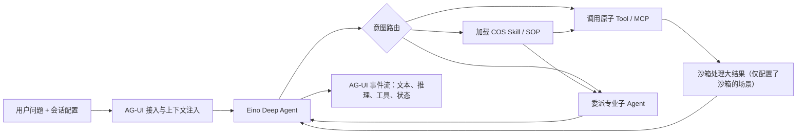
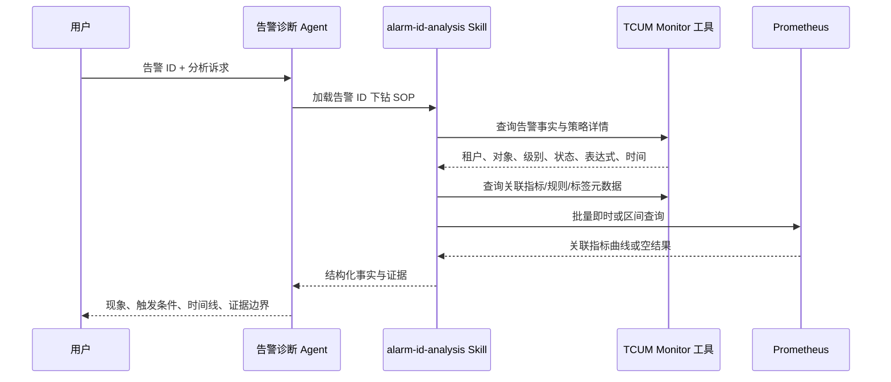
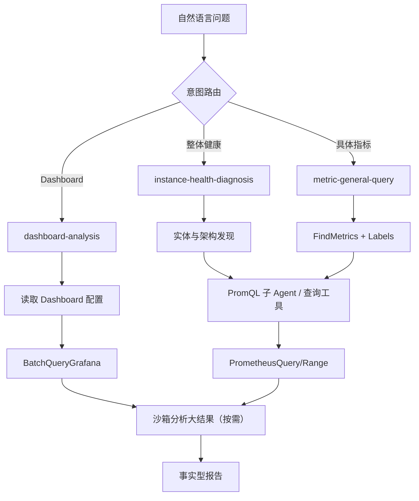
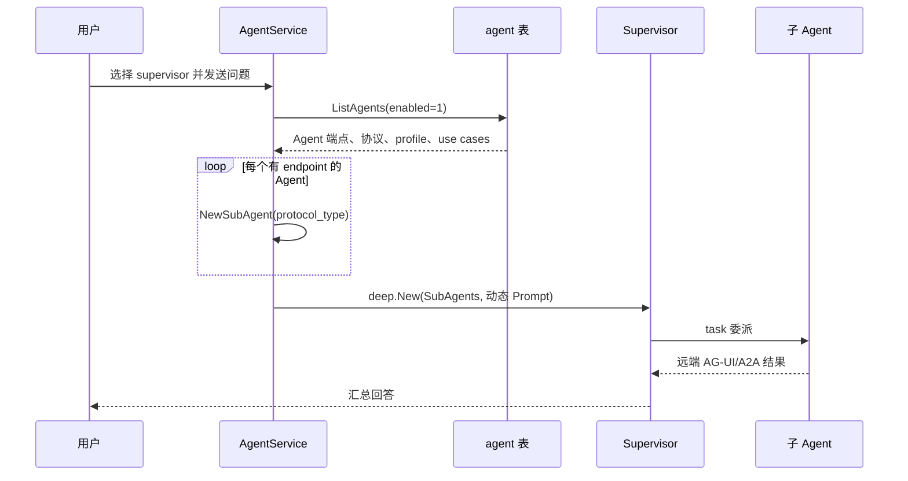
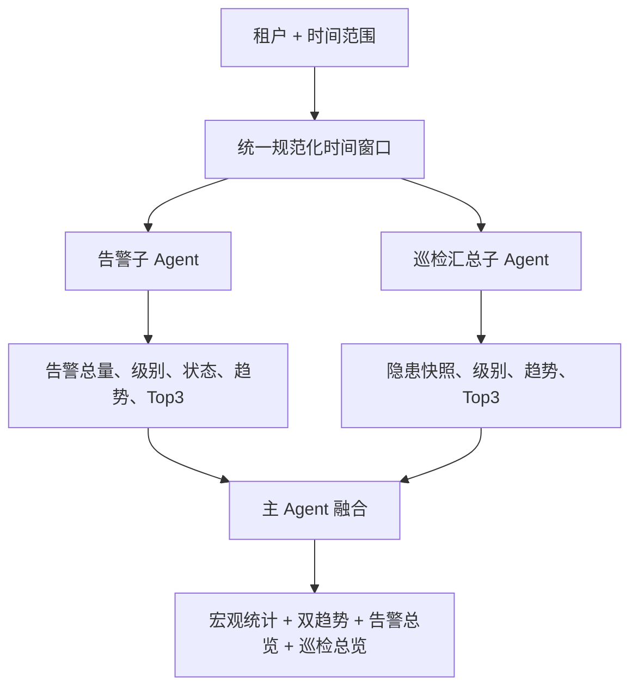
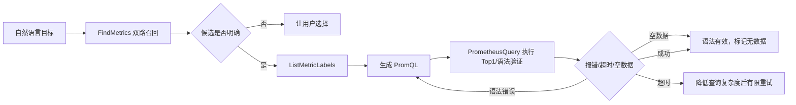

# 第二篇之一：场景案例——全景与监控可观测域

> 本篇不是产品功能清单，而是面试中的“场景落地证据”。内容交叉核对了两份数据库导出、`tcum-ai` 当前代码和设计 Wiki。凡是没有生产 trace 或源码支撑的内容，均明确标为“能力推演”或“待验证”，避免把合理猜测讲成既成事实。

---

# 0. 先把统计口径讲清楚

## 0.1 为什么不能直接说“TCUM-AI 有 15 个自研 Agent”

两份数据库导出对应不同的控制面：

- `agent` 接入表有 15 条记录，描述工作台可以选择或通过统一入口调度的 Agent，包括名称、协议、端点、展示信息、案例和运行时配置项。
- Agent 运行配置表有 16 条记录，描述模型 Prompt、最大迭代数、工具、Skill、子 Agent、中间件和暴露协议。
- 两张表不是一一对应。`sandbox_expert`、`tianxun_inspect_summary_analysis_expert`、`inspect_analysis_expert` 是内部支撑能力，不是工作台里的独立入口；`tcum_ai_assistant`、`sre_expert` 则是外部平台接入，TCUM-AI 只实现协议适配和统一体验，不能声称拥有其内部源码。
- 接入表中的 `prometheus_metric_expert` 对应运行配置中的 `prometheus_metrics_expert`。前者是产品侧 code，后者才是本地 Agent 实例名和路由路径。

面试时更准确的说法是：

> TCUM-AI 当前接入了 15 个运维 Agent 场景，其中大部分由 TCUM-AI 基于 Eino Deep Agent 自研，另有 Knot 知识助手和 AICoop SRE 两个外部 Agent 平台；系统内部还维护沙箱、巡检汇总等支撑 Agent。数据库把“产品接入”和“运行编排”分开管理，因此接入数量、运行实例数量与源码仓库中的能力模块并不相等。

## 0.2 证据分级

后文使用四类证据：

| 标记 | 含义 | 可以怎么讲 |
|---|---|---|
| 数据库可证 | 来自两份 DMC 导出的 Agent 配置、案例、工具和 Skill 绑定 | 可以准确描述当前配置，但不等于每次运行都走同一条轨迹 |
| 源码可证 | 能定位到 `tcum-ai` 中的构建器、工具或服务实现 | 可以讲机制、边界和异常处理 |
| Wiki/Trace 可证 | 来自设计 Wiki 或其中记录的 Langfuse trace | 可以作为量化结果，但要注明具体案例和时间窗口 |
| 能力推演 | 根据公开工具能力构造的完整案例，没有对应生产 trace | 可以用于解释流程，不能包装成线上真实结果 |

## 0.3 15 个接入场景与内部支撑 Agent

| 域 | 工作台接入 Agent | 实现归属 | 主要架构 |
|---|---|---|---|
| 告警 | `prometheus_alert_diagnose_expert` | TCUM-AI 自研 | Skill 路由 + 原子工具闭环 |
| 指标 | `prometheus_metric_expert` → `prometheus_metrics_expert` | TCUM-AI 自研 | Skill 路由 + PromQL 子 Agent + 沙箱 |
| 联合入口 | `supervisor` | TCUM-AI 自研 | 动态 Supervisor + 远程子 Agent |
| 可观测汇总 | `obs_summary_analysis_expert` | TCUM-AI 自研 | 固定双子 Agent 并行汇总 |
| SLO | `cloud_product_slo_analysis_expert` | TCUM-AI 自研 | Skill 路由 + 结构化 SLO 工具 |
| 查询语言 | `prometheus_promql_expert` | TCUM-AI 自研 | 元数据 RAG + 执行验证 |
| 查询语言 | `barad_influxql_expert` | TCUM-AI 自研 | 元数据发现 + 静态生成 |
| 大盘 | `grafana_dashboard_expert` | TCUM-AI 自研 | Skill 路由 + 确定性 Go Builder |
| CMDB | `tcum_cmdb_expert` | TCUM-AI 自研 | Skill-first + CMDB/影响面工具 |
| 巡检 | `tianxun_inspect_expert` | TCUM-AI 自研 | Skill-first + 天巡 MCP |
| 变更 | `change_analysis_expert` | TCUM-AI 自研 | 固定 SOP + 多 Skill + 子 Agent 降级 |
| 日志排障 | `tcum_tcs_error_debug_expert` | 部分可证 | Skill + 远程 CLS/知识库工具 |
| 产品问答 | `tcum_ai_assistant` | Knot 外部 Agent | Knot AG-UI 适配 |
| 综合 SRE | `sre_expert` | AICoop 外部 Agent | SRE AG-UI 适配 |
| 数字分身 | `digital_twin_agent` | TCUM-AI 自研 | 请求级动态能力注入 + 调度任务 |

内部支撑能力包括：

- `sandbox_expert`：文件、Shell、Python、浏览器等隔离执行能力，被指标、大盘、CMDB、巡检和变更 Agent 按配置复用。
- `tianxun_inspect_summary_analysis_expert`：只负责巡检概要，被可观测汇总 Agent 调用。
- `prometheus_promql_expert`：既是独立入口，也是指标与变更 Agent 的专业子 Agent。
- `inspect_analysis_expert`：仍有运行配置，但当前不在接入表，能力已与新的 `tianxun_inspect_expert` 重叠，应视为待治理的历史配置，而不是第 16 个对外场景。

## 0.4 场景层统一运行模型

本地 Agent 最终都通过 `BuildDeepAgent` 构造为 Eino `deep.New`。差异不在“换了多少套框架”，而在配置给每个 Agent 的责任边界：

共同底座包括：

- Skill 从 COS 或本地后端按需加载，复杂流程先读 SOP 再调用工具。
- 工具调用错误中间件把错误转为模型可理解结果，使模型可以换参数或降级，而不是让整轮直接失败。
- Summarization 中间件处理长上下文，Adaptive Context Retry 在模型上下文超限后渐进压缩并原地重试。
- 运行时模型选择器可以从 `forwardedProps.agent_config.chat_model` 切换模型。
- 默认关闭 Eino 的通用子 Agent，只有配置明确打开才启用，避免能力边界不可控。
- AG-UI 负责前端事件语义，A2A/AG-UI 客户端负责跨 Agent 调用。业务 Agent 不需要知道远端是同进程、独立服务还是外部平台。

这套架构的核心取舍是：稳定的领域流程交给 Skill，确定性的数据获取和渲染交给 Tool，需要自主拆解或跨域协作时才交给子 Agent。

---

# 1. `prometheus_alert_diagnose_expert`：告警诊断与配置专家

## 1.1 场景定位

告警场景不是单一的“解释一条告警”，而是至少包含九种意图：策略分析、历史统计、配置分析、告警 ID 下钻、指标查询、基础告警配置、高级 PromQL 配置、云 API 告警下钻和 DNS 播测告警下钻。把它们塞在一条自由 ReAct 链里，会出现工具误选、参数混用和报告模板漂移，因此 Agent 先做显式 Workflow Router，再加载对应 Skill。

数据库可证的配置为：`MaxStep=100`，17 个绑定工具，11 个 Skill，无子 Agent，同时暴露 A2A 与 AG-UI。工作台要求选择业务空间，默认 `tcs`。

## 1.2 核心设计逻辑

它采用“路由层—SOP 层—数据层—校验层”四层结构：

1. Prompt 根据用户输入选择九个分支之一，未命中就停止并提示能力范围，不让模型随意拼工具。
2. Skill 固化该类任务的调用顺序、报告结构和领域规则。Skill 内容存放在运行时 Skill 后端，当前仓库只能验证绑定名称，不能仅凭仓库复原每份 Skill 的完整脚本。
3. 工具负责真实数据：告警历史、策略、监控栈、实体、指标类型、标签和 Prometheus 查询。
4. 写配置前必须调用 `ValidateAlarmConfig`。它会校验产品栈、实体、指标类型、聚合组、指标名以及函数、粒度、运算符、阈值、级别和持续周期。校验失败通过 `valid=false` 返回给模型，禁止输出最终配置。

这里最值得强调的是：告警配置不是让 LLM 凭语法知识直接拼 JSON。`GenerateAlarmPromQL` 会把扁平化条件组装成 TCUM Monitor API 的 Trigger 和 LabelMatchers，再调用 `DescribeAlarmExpressions` 生成并去重 PromQL。业务规则由后端生成，LLM 只负责把自然语言映射成结构化条件。

## 1.3 运行流程

以“告警 ID: `ab644332cb58dd33:20260109030300`，分析告警情况”为例。这是数据库中的真实 query example，但本文没有该次执行 trace，以下流程由配置与工具能力还原：

几个关键约束：

- Unix 时间戳必须由时间转换工具产生，最终展示统一为北京时间。
- 同一目标禁止重复调用；Prometheus 空数据被视为有效结果，不能因为 `null` 无限重试。
- 租户优先从会话上下文获取，避免 LLM 伪造或遗漏。部分工具也允许 Skill→MCP 链路显式传 tenant，形成兼容路径。
- 对历史汇总，`AlarmHistoryAnalysis` 先解析规则 ID，再获取总量、级别、状态、Top 策略和时间分段统计；单次聚合查询有超时和有限重试，零告警时跳过无意义的时间分段调用。

## 1.4 另外两个真实输入怎么讲

数据库还给出两类真实入口：

### “分析告警策略，ID 为 107”

重点不是查一条告警事件，而是解释策略设计是否合理：

- 先按策略 ID 获取规则与表达式。
- 将表达式映射回指标语义、标签和聚合方式。
- 查询历史触发分布，判断阈值是否过敏、持续周期是否过短、对象是否集中。
- 输出“配置事实”和“历史表现”两组证据。若 Skill要求给建议，建议也必须能追溯到这两组证据。

### “分析最近一天的告警信息”

这是聚合任务：

- 时间工具确定精确窗口。
- `AlarmHistoryAnalysis` 获取总量、级别/状态分布、Top 策略、对象分布和时间趋势。
- 不应把“告警最多”直接等价为“根因”。最多只能说某策略或对象在这个窗口内出现最频繁；根因判断需要额外指标、日志或变更证据。

## 1.5 设计亮点

- 把领域枚举和有效性校验下沉到代码，减少幻觉配置。
- 基础模式与高级模式共用同一告警表达式生成接口：基础模式传指标、粒度和阈值，高级模式传 PromQL 与 duration。
- `FindMetrics` 使用原始查询与 LLM 重写查询两路检索，交替穿插去重，兼顾用户原词和语义归一化。
- 告警 ID、策略 ID、历史窗口三类任务虽然共享工具，却通过 Skill 隔离 SOP，避免生成配置时误走诊断逻辑。
- 工具输出结构化统计，而不是让模型下载全量告警自行计数，降低 token 和统计错误。

## 1.6 当前问题与改进空间

1. **Prompt 路由是单标签决策。** 一个请求可能同时要求“分析策略并给出新配置”，当前九分支要求选择一个分支。应引入可组合意图 DAG，显式区分读取、分析、生成和写入阶段。
2. **Skill 内容不在主仓库。** 代码评审只能看到 Skill 名称，无法做配置—代码原子一致性检查。应给 Skill 建版本号、Git 镜像和与 Agent 配置绑定的发布清单。
3. **“禁止重试”与底层工具重试语义不完全统一。** Prompt 对同一目标禁止重试，但 `AlarmHistoryAnalysis` 内部对聚合接口有有限重试。应把“模型层不得重复发起”和“工具内部网络重试”分开命名并观测。
4. **诊断结论缺少统一证据对象。** 建议输出 `claim → evidence(tool, params, time range, result excerpt)`，让每条结论可回溯，而不只是 Markdown。
5. **配置写入没有展示审批工具。** 当前可以生成并校验配置，但从绑定工具看不到真正的策略落库工具。面试时应明确“当前闭环到可执行配置生成和校验，不宣称已自动发布”。
6. **评测需要分支化。** 不能只看最终答案。应分别衡量意图路由准确率、工具参数准确率、数据忠实度、配置校验通过率、诊断证据覆盖率和端到端完成率。

## 1.7 P7—P9 追问回答

如果面试官问“为什么不用一个大 Prompt”，可以回答：

> 告警分析包含读、诊断、聚合和配置生成四类风险等级不同的任务。大 Prompt 的问题不是模型不会做，而是无法对每条路径建立稳定的工具前置条件和验收标准。我用 Prompt 做粗粒度意图路由，用 Skill 固化 SOP，用工具 schema 和后端校验形成硬约束。这样失败时能定位到底是路由错、检索错、参数错还是数据为空，而不是把所有问题都归因给模型。

---

# 2. `prometheus_metric_expert` / `prometheus_metrics_expert`：指标分析专家

## 2.1 场景定位与真实配置

工作台 code 是单数 `prometheus_metric_expert`，实际本地 Agent 名是复数 `prometheus_metrics_expert`。运行配置为 Deep 模式、`MaxStep=200`、16 个工具、5 个 Skill，子 Agent 为 `prometheus_promql_expert` 和 `sandbox_expert`。

它解决三类问题：

- 实例整体健康诊断。
- Dashboard/Folder 多面板分析。
- 指定指标的即时值、趋势、TopN 与关联实例查询。

Prompt 有明确优先级：用户只要明确提到具体指标，即使带有实例，也优先走“通用指标查询”；只有明确说健康诊断、巡检或整体状态，才走实例健康诊断。这是为了避免把“查 CPU”扩张成一次昂贵的全实例巡检。

## 2.2 核心架构

设计上把四件事拆开：

- `FindMetrics` 解决“中文业务描述到内部指标名”的鸿沟。
- `ListMetricLabels` 解决查询维度和过滤条件，不让模型猜 label。
- `GetTenantEntityInstance`、`GetInstanceArch` 等工具补齐实例身份和关联架构。
- PromQL 子 Agent 专注查询表达式；沙箱负责大数组统计、表格和文件处理。

主 Agent 的 Prompt 明确禁止输出运维建议，报告止步于数据事实。这与工作台 profile 中“提供优化建议”的宣传文案存在不一致。面试时应以运行 Prompt 为准：当前版本更偏“分析取证”，不是自动决策系统。

## 2.3 真实案例一：实例健康诊断

输入：`分析 ins-5acbf58b 实例的健康状态`，租户为 `tsf`。

可还原的执行逻辑：

1. 路由到 `instance-health-diagnosis`。
2. 解析实例 ID，通过实体工具确认实例类型和元数据。
3. 获取该实例关联的 Dashboard 或架构关系，确定需要覆盖的指标面。
4. 查询 CPU、内存、请求、错误、延迟等由 Skill 规定的关键指标；具体指标集合应以 Skill 返回为准，不能在面试文档里凭经验编造。
5. 对区间数据计算趋势、峰值、缺失和异常点，必要时交给沙箱处理。
6. 输出哪些指标正常、异常或缺数据，并列明时间范围和实例信息；不直接给变更、扩容或重启建议。

关键点是“健康”不是单指标阈值，而是由 Skill 定义的一组证据集合。架构层面应把健康诊断定义为可版本化的检查包，便于不同产品栈拥有不同基线。

## 2.4 真实案例二：子机与母机关联查询

输入：`分析 0000036b-55f1-4742-a7e6-eed48c7abb16 CVM 子机实例和其母机近 1 天的 CPU 使用率情况`。

这类问题难点在“关联对象发现”而不是 PromQL 本身：

1. 根据子机标识查询实例信息。
2. 通过架构/实体关系找到母机，不能把用户输入直接当成 Prometheus label。
3. 分别确定子机和母机 CPU 指标及各自 label。
4. 用同一时间窗口做区间查询。
5. 对齐两条时间序列，陈述峰值时间、趋势和是否同步变化。

如果母机关联缺失，正确结果是明确“未找到关联母机”并继续返回子机数据，而不是猜一个节点 ID。这体现运维 Agent 的事实边界。

## 2.5 真实案例三：多 Dashboard 异常实例汇总

输入包含两个 Dashboard ID、近 6 小时、分析异常实例、最终用表格汇总。这是典型的大上下文任务：

- `GetDashboardConfigJson` 获取真实面板、变量和查询表达式。
- `BatchQueryGrafana` 批量执行多个面板，避免模型逐 panel 循环造成 N 次往返。
- 返回过大时使用沙箱读取文件或 COS 结果，做结构化统计。
- 输出表格必须保留 Dashboard、panel、实例、指标、时间段和数据证据，避免把不同面板的异常混为一条。

这类场景最容易发生“统计正确但语义错误”：例如把 QPS 最大实例当成异常，或者把不同单位直接比较。因此异常判定必须由 Skill 给出规则，不能只用全局 TopN。

## 2.6 真实案例四：Top3 Pod 与十分钟趋势

输入：`查看 tce 命名空间下内存利用率前 3 的 pod，并查看这些 pod 过去十分钟的内存变化趋势`。

合理链路分两阶段：

1. 用即时查询或短窗口聚合找出 Top3 Pod。排序必须在 PromQL/查询引擎侧完成，不应拉回全部 Pod 让模型排序。
2. 把 Top3 的 label 值带入 range query，获取十分钟曲线。
3. 对每个 Pod 输出当前值、峰值、趋势和数据缺失情况。

这个案例能展示“先筛选、后下钻”的查询计划。若直接对全命名空间所有 Pod 拉十分钟数据，再在模型端筛 Top3，会放大时延、token 和 Prometheus 压力。

## 2.7 设计亮点

- 意图优先级解决“实例 + 指标”歧义，控制任务规模。
- 主 Agent 与 PromQL 子 Agent分工：主 Agent掌握业务目标，子 Agent掌握查询语言和验证。
- Dashboard 查询采用批量接口，沙箱只在数据量或计算复杂度需要时介入。
- 同时具备实体、架构、指标元数据和 Grafana 四类上下文，避免把监控分析退化成纯 PromQL 问答。
- `MaxStep=200` 给复杂大盘分析足够空间，但真正性能优化依赖批量工具，而不是靠更多迭代硬跑。

## 2.8 当前问题与演进

1. **`MaxStep=200` 是保险丝，不是预算。** 应增加按意图的 tool-call、token、时延和 Prometheus 查询成本预算，超过预算先缩小面板或实例范围。
2. **异常定义依赖 Skill。** 需要把阈值、同比/环比、基线和缺失数据规则变成可测试的结构化策略，而非只留在自然语言 SOP。
3. **输出约束与 profile 不一致。** profile 说可给优化建议，Prompt 又禁止。应统一产品能力契约，否则用户和评测集的预期不同。
4. **多序列归因仍可能幻觉。** 应给每条分析结论携带原始 series label 和 query ID。
5. **沙箱不是默认聚合引擎。** 优先让 Grafana/Prometheus 做聚合，沙箱处理跨查询合并和报告生成；否则会把数据面压力转成 Agent 侧 CPU、下载和安全风险。
6. **需要查询计划观测。** 建议记录“候选指标→最终指标→labels→PromQL→结果规模→结论”，用来评估每一步，而不仅看最终回答。

---

# 3. `supervisor`：动态多 Agent 总入口

## 3.1 它真正解决什么

Supervisor 解决用户不知道该选哪个专家，或一个问题跨越多个域的情况。它不是固定工作流，也不是一个写死的 Agent 列表，而是在请求时从接入表查询 `enabled=1` 的 Agent，按 `protocol_type` 构造远程子 Agent，再把每个 Agent 的 code、profile 和 use cases 放入主 Agent Prompt，让 Eino Deep Agent自主委派。

运行配置本身没有静态工具、Skill 或子 Agent，`MaxStep=100`。子 Agent 列表来自数据库，新增接入 Agent 后不需要修改 Supervisor 源码。

## 3.2 实际构建流程

协议工厂支持：

- `tcum_agui`：TCUM 标准 AG-UI 请求。
- `knot_agui`：转换成 Knot 私有请求和事件格式。
- `sre_agui`：在标准请求中注入 SRE 专用 `forwardedProps`。
- `a2a`：构造 A2A 远程 Agent。

这让 Supervisor 的拓扑可以跨进程、跨团队、跨 Agent 框架。

## 3.3 真实入口案例：“你有哪些能力？”

这条数据库案例看似简单，实际验证的是动态能力发现：

1. Supervisor 不能凭静态知识回答。
2. 它应读取当前动态注入的子 Agent 描述和案例。
3. 按用户可理解的领域归类，而不是原样输出 JSON。
4. 不应宣传 disabled、无端点或不可访问能力。

这也是一个很好的回归测试：接入表变更后，Supervisor 的能力回答是否同步更新。

## 3.4 设计亮点

- 控制面驱动：数据库更新即可改变子 Agent 集合。
- 协议多态：同一 Eino Supervisor 可以调用 TCUM、Knot、SRE 或 A2A Agent。
- 远程 Agent 保持独立部署和团队边界，Supervisor 只消费能力契约。
- dialog 中的 `agent_config` 会注入 Supervisor Prompt，提醒所有子调用携带统一配置。

## 3.5 源码暴露出的真实问题

1. **没有过滤自己。** `NewSupervisorAgent` 只过滤 `enabled=1` 和空端点，没有跳过 `supervisor` 自身，也没有跳过 `digital_twin_agent`。如果模型选择自身子 Agent，存在递归调用风险。数字分身即使 `visible=0`，也仍可能被 Supervisor 动态加载。
2. **`visible` 没有参与调度。** UI 隐藏与可调度不是同一个语义，但当前缺少专门的 `routable` 或 `supervisor_enabled` 字段，应显式建模。
3. **`order` 不是路由优先级。** Agent 列表接口返回前会按 `order` 排序，但 Supervisor 的 DAO 查询没有显式 sorter，代码也没有基于 order 打分。不能在面试中把 `order` 讲成确定性 fallback。
4. **能力描述是非结构化 Prompt。** code、完整 profile JSON 和 use cases JSON 直接拼进 Prompt，token 较大且存在 prompt injection 风险。应抽取结构化 `capability_card`，对内容做可信域隔离。
5. **子 Agent 配置透传不完整。** `parseAgentConfigItems` 当前直接返回 `nil`，源码注释也写明是简化处理。SRE 的 reasoning/planning/scenario 等配置在 Supervisor 子调用场景可能无法像直连场景一样可靠传递。
6. **缺少路由置信度和审批。** Supervisor 直接由 LLM 选择子 Agent。应支持候选打分、低置信度澄清、多 Agent 费用预算和写操作审批。

## 3.6 演进方案

- 在接入表增加 `routable`、`allowed_parents`、`risk_level`、`required_context`、`cost_class`。
- 构建子 Agent 时硬过滤 self、disabled、无权限和不可路由 Agent。
- 用结构化 capability card 做两阶段路由：规则/向量检索召回候选，再由 LLM 在 TopK 中选择。
- 对跨 Agent 配置定义统一 typed context，不依赖 Prompt 说“请携带”。
- 建立路由评测：Top1/Top3 路由准确率、误调率、澄清率、跨 Agent 完成率、平均子 Agent 数和端到端时延。
- 对复合任务支持并行执行和证据合并，但要限制 fan-out，并为每个子结果标注来源。

---

# 4. `obs_summary_analysis_expert`：告警与巡检融合报告

## 4.1 为什么它不是 Supervisor 的一个 Prompt 模板

这是目标明确、数据源固定、输出固定的汇总场景。自由 Supervisor 会根据模型判断选择任意 Agent，而该场景必须同时得到告警和巡检两份同窗口数据，因此采用固定层级编排更可靠：

- 子 Agent 1：`prometheus_alert_diagnose_expert`。
- 子 Agent 2：`tianxun_inspect_summary_analysis_expert`。
- 主 Agent：只融合两份结果，生成规定格式的《可观测性融合报告》。

它没有直接工具和 Skill，`MaxStep=100`，通过两个子 Agent 获取事实。Prompt 要求并行调用，并强制传入完全一致的开始、结束时间。

## 4.2 运行链路

没有数据库 query example，因此下面是能力推演：用户问“分析最近一天 TCS 的可观测整体情况”。系统应把同一个北京时间窗口发给两个子 Agent，然后分别得到告警事件流和巡检快照/趋势，再做时间轴对齐。

“告警高峰与巡检隐患同时出现”只能称为相关观察，不能自动写成因果关系。若采样粒度不同，也要先说明对齐方式。

## 4.3 设计亮点

- 为固定任务选固定层级架构，比通用 Supervisor 更可预测。
- 子 Agent 隔离领域复杂度，主 Agent 不需要拥有所有底层工具。
- 同一时间窗口是跨源分析最关键的数据契约，Prompt 已显式约束。
- 输出模板固定，有利于前端渲染和离线评测。

## 4.4 必须纠正的旧说法

该 Agent 没有配置 `sandbox_expert`，也没有直接工具。不能说它依赖 COS + 沙箱合并大结果。它当前能做的是消费两个子 Agent 的文本/结构化返回，由模型融合；如果子 Agent 返回过大，底层通用上下文压缩可能生效，但这不等价于业务级沙箱分析。

## 4.5 当前问题与改进

1. **数据契约仍是自然语言。** 主 Agent依赖子 Agent输出字段名如 `timeRangeStats`、`SnapshotStatistic`。应定义 protobuf/JSON Schema，而不是让模型解析报告文本。
2. **并行只是 Prompt 要求。** 应在 Workflow 层显式实现 fan-out/fan-in，获得可控并发、超时和部分失败语义。
3. **单边失败缺少标准。** 告警成功、巡检失败时，应该输出降级报告还是整体失败，需要结构化策略。
4. **跨源关联太弱。** 目前主要做时间趋势并列。下一步可按产品、集群、实例映射后做交集，但必须区分相关性和因果性。
5. **租户配置无默认值。** 接入表要求选择业务空间但没有默认值，这是产品层面的防误查设计，也意味着从 Supervisor 调用时必须可靠透传 tenant。
6. **评测应分两层。** 先验证两个子报告的完整性，再验证融合报告的数值一致性、时间对齐和无因果幻觉。

---

# 5. `cloud_product_slo_analysis_expert`：云产品可用性分析

## 5.1 场景定位与配置

该 Agent 把 TCUM 已经计算出的 SLO/SLI 破线数据，按产品、地域、客户、SLI 和实例做二次分析。运行配置 `MaxStep=100`，10 个工具、4 个 Skill，无子 Agent。

四个 Skill 对应四种观察视角：

- 云平台整体可用性概览。
- 单产品可用性分析。
- 客户持有产品的可用性分析。
- 产品故障的客户影响分析。

它的工具包括产品、SLI、SLO 汇总、SLI 汇总、破线实例、云账号、地域和时间工具。这里没有沙箱子 Agent，因此当前主要依赖后端结构化聚合与模型归纳。

## 5.2 领域语义是第一优先级

Prompt 有两条非常重要的防误判规则：

- 客户名称是纯文本，不能从名称中的“香港”等字样推断实际地域。
- “100% 破线”表示统计窗口内 SLI 持续未达到 SLO，不等于“100% 请求失败”或“产品完全不可用”。

这体现了运维数据分析的一个核心原则：指标名、统计口径和业务结论之间不能跨级推理。大模型最危险的错误往往不是算错，而是把可观测指标错误翻译成业务事实。

## 5.3 运行流程

没有数据库真实 query example，以下为能力推演。用户问“最近一周重点产品的可用性情况，并下钻破线最严重产品影响了哪些客户和实例”：

1. 路由到平台概览 Skill。
2. `QuerySloProducts(is_vip=true)` 从重点产品缓存获取产品集合。
3. 时间转换工具生成精确毫秒时间戳和按天步长。
4. `QuerySloSummary` 获取总数、破线数，并可按 product/region/uin 分组。
5. `QuerySliSummary` 计算各 SLI 的 `brokeCount / totalCount` 破线率。
6. 按返回数据确定需下钻的产品/SLI，而不是凭产品名判断。
7. `QuerySliInstances` 获取破线实例明细，默认分页前 5 条，可继续翻页。
8. 需要展示客户名称时，通过云账号工具把 UIN 映射为账户信息。
9. 报告保留产品、地域原文和“破线”术语，并根据破线比例做展示色分级。

## 5.4 工程实现亮点

- 产品列表按全量、重点、非重点走不同缓存/API 路径，避免每次都扫完整产品配置。
- `QuerySloSummary` 支持后端 group-by，将同一时间点的数据按指定标签求和，减少模型侧统计。
- `QuerySliSummary` 在 Go 中计算破线率，统一精度和零分母处理。
- `QuerySliInstances` 在工具层做默认分页，避免一次返回全部实例。
- 领域 Prompt 明确区分“观测事实”和“业务不可用”，这是比工具数量更重要的可靠性设计。

## 5.5 当前问题与演进

1. **无真实 use case 和 trace。** 产品入口缺乏示例，难以引导用户和构建稳定回归集。应至少覆盖平台概览、单产品、单客户、影响面四类 golden cases。
2. **没有沙箱却承担复杂聚类。** 对多产品×多地域×多客户的大结果，模型直接聚合可能不稳。应增加确定性 TopN/分布计算工具，或受控启用沙箱。
3. **破线严重度颜色是展示逻辑。** 当前写在 Prompt，应该由前端或结构化 severity 字段负责，避免不同模型输出不同图标。
4. **缺少误差与数据完整性说明。** 应返回采样覆盖率、缺失点、总样本数和 SLO 配置版本。
5. **无法证明因果。** SLO 破线与某事件同时发生只能说明相关，需要日志、变更或依赖拓扑进一步验证。
6. **指标定义需要可解释。** 报告应携带 SLI 名称、阈值、窗口和聚合口径，让面试官看到不是只做表面汇总。

---

# 6. `prometheus_promql_expert`：PromQL 生成、解释与诊断

## 6.1 为什么要从指标 Agent 中拆出来

PromQL 是一个高复用、强约束的专业能力：指标分析 Agent需要它，变更分析也可能需要它，用户还会直接要求生成或解释查询。独立成 Agent 后，可以作为入口，也可以被其他 Agent委派。

运行配置为 `MaxStep=100`，6 个工具，无 Skill、无子 Agent：时间转换、`FindMetrics`、`ListMetricLabels` 和 `PrometheusQuery`。它的流程完全写在 Prompt 中，分为生成、解释、诊断和自由问答四个分支。

## 6.2 生成链路

生成不是“模型记忆 PromQL 语法”这么简单：

- `FindMetrics` 同时检索用户原文和 LLM 提取后的指标描述，每路取候选并交替穿插去重。
- tenant 会转换成允许的 mStack 范围，支持租户配置中的 `*` 展开。
- `ListMetricLabels` 给出真实标签，防止模型发明 `pod_name`、`instance_id` 等不存在字段。
- 最终用 `PrometheusQuery` 做执行验证。空数据不等于语法错，因此空结果不能触发重复改写。

## 6.3 解释与诊断的区别

- **解释**回答“这条表达式做了什么”：解析指标、标签匹配、函数、聚合维度和返回语义。
- **诊断**回答“为什么报错、查不到或性能差”：除语义解释外，还要检查真实指标与 labels，并结合执行错误定位问题。
- 两者都要先查内部指标元数据，因为企业内部 recording rule 和指标命名无法靠公共 Prometheus 知识准确解释。

## 6.4 设计亮点

- 用内部元数据 RAG 补足企业私有指标知识。
- 先元数据、后生成、再执行，形成可验证闭环。
- 空结果与执行错误分流，避免“为了查出数据而篡改正确查询”。
- 子 Agent 化后把查询语言复杂度从业务 Agent 中隔离出来。

## 6.5 当前问题与改进

1. **“输出详细思考过程”不合适。** 应输出可审计的设计说明和证据，不应要求暴露模型内部思维链。可以改成“指标选择依据、label 依据、查询语义、验证结果”。
2. **验证只做即时查询。** Range query 的步长、基数和长窗口性能没有被充分验证。应增加 query plan、series count 或 explain 类工具。
3. **最多三次重试仍由 Prompt 控制。** 应在代码层记录 query hash 和重试预算，防止语义相同的查询换字符串绕过限制。
4. **无 Skill 使 Prompt 很长且难版本化。** 可将四类 Workflow 拆成 Skill，主 Prompt 只保留路由和全局守卫。
5. **缺少性能安全阀。** 对宽 label、无过滤和超长窗口查询，应在执行前估算范围并拒绝高风险查询。
6. **评测不只看语法。** 需要指标选择准确率、label 合法率、执行成功率、语义满足率、空结果误修率和查询资源成本。

---

# 7. `barad_influxql_expert`：Barad InfluxQL 生成专家

## 7.1 为什么不能复用 PromQL Agent

Barad 的模型是 namespace—view—metric：一个 view 类似多值表，时间、labels 和多个 metric 分别对应列。指标在最细 label 粒度上已经按周期聚合，因此查询语义与 PromQL 完全不同。

运行配置 `MaxStep=100`，6 个工具：时间转换、namespace 列表、指标发现和 label 查询。无 Skill、无子 Agent。

它的核心规则包括：

- 先 namespace，再指标，再 labels，最后生成查询。
- field、measurement、tag 使用双引号。
- 未指定时间时使用 Grafana `$timeFilter`。
- 需要二次聚合才 `GROUP BY time($__interval)`。
- TopN 使用 `TOP(field_key, N)`，而不是 SQL 风格 `ORDER BY ... LIMIT`。
- 实例级大结果默认加 `LIMIT 20`。
- 缺失窗口使用 `fill(null)`。

## 7.2 能力推演案例

用户问“生成查询 CVM CPU 利用率最高 10 台子机的 InfluxQL”：

1. `ListBaradNamespaces` 找到 `qce/cvm`。
2. `FindBaradMetrics` 找到 CPU 相关 metric 及所属 view，例如工具真实返回的 full name 才能作为依据。
3. `ListBaradMetricLabels` 获取该 view 的 `appid`、`projectid`、`vm_uuid` 等标签。
4. 生成 `TOP` 查询，保留必要标签，并使用 `$timeFilter`。
5. 根据 Prompt 规则做静态语法自检并解释语义。

## 7.3 设计亮点

- Prompt 对 Barad 已聚合数据模型有专门解释，避免无意义的二次 `GROUP BY vm_uuid`。
- 元数据工具让模型不必猜 namespace、view、metric 和 label。
- 把常见 SQL 习惯错误显式列为反例，有助于降低 InfluxQL 语法迁移错误。

## 7.4 一个必须如实说明的边界

当前绑定工具中没有 InfluxQL 查询执行工具。因此它只能做到“真实元数据约束下的生成 + Prompt 静态检查”，不能像 PromQL Agent 一样声称已经执行验证。现有文档若写成“生成—执行—纠错闭环”会被源码追问击穿。

## 7.5 当前问题与演进

1. **缺少执行验证。** 应增加只读、限时、限结果行数的 InfluxQL 查询工具，并区分空结果、语法错误和权限错误。
2. **所有工作流都在超长 Prompt。** 应拆成生成、解释、诊断 Skill，便于复用到 Grafana Agent。
3. **静态语法检查仍由模型完成。** 应接入 parser/AST 校验器，硬性检查函数参数、Group By、时间过滤和 limit。
4. **缺少成本估计。** 高基数 view、宽时间窗口即使带 limit 也可能扫描大量数据，需在执行前估算 series cardinality。
5. **没有真实入口案例。** 应沉淀至少 namespace 发现、TopN、分组趋势、Grafana 变量四类 golden cases。
6. **与 Grafana Agent 存在规则复制。** InfluxQL 规范应收敛到共享 Skill/AST 层，避免两个 Agent 的规则漂移。

---

# 8. 横切能力：指标元数据检索为什么是监控 Agent 的地基

## 8.1 问题本质

用户说的是“CPU 使用率”“Pod 内存”“请求失败率”，系统真实指标可能是内部 recording rule，且不同租户、产品栈、指标类型下重名或语义不同。如果跳过元数据检索，模型即使写出合法 PromQL，也可能查询错误指标。

`FindMetrics` 的核心逻辑是：

1. 从会话上下文或显式参数取 tenant。
2. 查询租户允许的 mStack；`*` 展开为当前全量产品栈。
3. 对用户原文和 LLM 重写后的指标描述各做一次相似检索，每路最多取 20 条。
4. 交替穿插两路结果，并按完整指标名去重。
5. 返回指标描述、产品栈描述、单位、类型和 Prometheus metric type。

它不是严格意义上的 RRF：源码只做交替穿插，没有基于 rank score 的倒数排名融合。面试中应说“双路召回 + 交替融合”，不要夸大成完整学习排序系统。

## 8.2 为什么双路比单路稳

- 原始 query 保留实例名、产品名和用户特有缩写，能防止重写丢信息。
- 重写 query 提取核心指标语义，减少口语噪声。
- 交替融合让两类候选都能进入上下文，模型再结合 labels 和产品栈选择。

代价是结果并没有统一相关度分数，Top1 不一定是全局最优。下一步可以加入：精确别名召回、BM25/向量混合、cross-encoder rerank、租户先验和用户选择反馈。

## 8.3 面试总结

> 监控 Agent 的核心不是让大模型背查询语言，而是把自然语言稳定映射到企业内部可观测数据模型。我用租户过滤保证搜索空间，用原文与重写双路检索提高召回，用 label 元数据做参数约束，再通过真实查询验证表达式。这样把“看起来像对”变成“指标存在、标签合法、查询可执行、结果可追溯”。

---

# 9. 本篇可以直接用于面试的收口

监控域的七个 Agent并不是七份复制 Prompt，而是四种架构原型：

- 告警、指标、SLO：Skill 路由型，适合一个领域内存在多套稳定 SOP。
- PromQL、InfluxQL：专业原子 Agent，适合被复用和独立评测。
- 可观测汇总：固定层级编排型，适合输入输出契约稳定、必须并行取数的任务。
- Supervisor：动态协作型，适合入口未知和跨域问题，但必须加强路由、权限和递归保护。

选择依据不是“哪个架构更高级”，而是任务的不确定性：流程越稳定，越应把步骤固化为 Skill/Workflow；数据越确定，越应放进 Tool；只有在目标需要动态分解和跨域选择时，才让 LLM 做多 Agent 调度。
