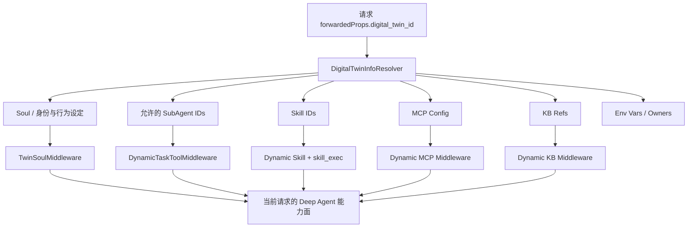

# 第二篇之二：场景案例——大盘、CMDB、巡检、变更、排障、外部 Agent 与数字分身

> 本篇继续使用“数据库可证、源码可证、Wiki/Trace 可证、能力推演”四级证据。尤其注意：Knot 与 AICoop 是外部 Agent 平台，本文只分析 TCUM-AI 的协议适配；TCUM 排障 Agent 的部分业务工具来自远程 MCP，仓库无法证明其内部实现；没有生产 trace 的案例不会包装成线上实测。

---

# 8. `grafana_dashboard_expert`：Grafana 大盘生成、编辑与分析

## 8.1 场景边界与实际配置

这是当前能力面最宽的领域 Agent。运行配置为 Deep 模式、`MaxStep=200`、46 个工具、9 个 Skill，并配置 `sandbox_expert` 子 Agent。它支持四类任务：

- 生成 TCUM Prometheus、Barad、智研 Grafana 大盘。
- 修改已有 Dashboard 的 panel、row、变量和顶层属性。
- PromQL/InfluxQL 生成、解释与诊断。
- 读取和分析已有 Dashboard。

Prompt 的第一条硬规则是：识别意图后，第一个 tool call 必须加载对应 Skill。大盘 Agent不是拿到 46 个工具后自由探索，而是先由 Skill 确定数据源类型、业务模板和工具顺序。

当前绑定 Skill 为：

- `grafana-tcum-app`
- `grafana-tcum-custom`
- `grafana-barad-after-sales`
- `grafana-barad-custom`
- `grafana-zhiyan-metric-group-transfer`
- `grafana-dashboard-edit`
- `grafana-free-chat`
- `tcum-promql-config`
- `barad-influxql-config`

## 8.2 最重要的架构重构：LLM 做决策，Go 做渲染

早期方案让 LLM 直接输出完整 Grafana JSON。一张 50 个 panel 的大盘可能需要输出 30K—80K token，常见失败包括：括号/逗号缺失、panel ID 重复、datasource UID 占位符未替换、`gridPos` 重叠和模型主动省略后续面板。

当前实现把职责重新切开：


三层代码抽象为：

- `core/`：Dashboard 外壳、panel 模板、ID、布局校验、COS 上传。
- `datasource/`：Prometheus 与 InfluxDB 的 target/变量字段形态。
- `flavor/`：TCUM、Barad、智研的业务默认值和约束。

这个切分不是简单“模板化”，而是把非确定性语义决策和确定性结构渲染分开：

- LLM 决定选什么指标、写什么 PromQL/InfluxQL、用什么 panel、如何布局。
- Tool 分配 ID，填 `fieldConfig`、`targets`、`__requires`、数据源引用，做 JSON marshal 与上传。
- 布局坐标仍由 LLM 给出，因为 L 型、田字格等布局属于用户意图；工具只软校验越界和重叠，不擅自改写布局。

## 8.3 Wiki 真实案例：智研监控大盘迁移到 TCUM

设计 Wiki 的真实目标是：输入智研 `serviceId/groupId` 与 Grafana folder，输出可导入 TCUM Grafana 的 Dashboard JSON，目标耗时小于 1 分钟。

### 运行流程

1. Skill 识别为智研指标组迁移。
2. `ListZhiyanMetricGroups` 找到指标组。
3. `GetZhiyanMetricGroupMeta` 获取 measurement、启用指标、业务维度和实例维度。
4. `ListGrafanaDatasources` 获取真实 InfluxDB datasource UID。
5. LLM 只决定单位、聚合函数与最小结构化骨架。
6. `BuildZhiyanDashboard` 调用 Go Builder 生成完整 JSON。
7. Builder 把 JSON 上传 COS，返回 24 小时预签名 URL、对象 key、文件大小和 panel 数。

### 指标到面板的确定性映射

每个指标默认生成三个 panel：

- 汇总 panel：`GROUP BY time(1m)`，不按业务维度分组。
- 实例 panel：按 `instance_mark` 或显式实例维度分组。
- 业务维度 panel：按全部业务维度分组。

没有业务维度时退化成两个宽度为 12 的 panel；有业务维度时采用三列、每列宽度 8。每个维度生成 `SHOW TAG VALUES` 变量，支持 All，All 值为 `.*`。高基数实例维度与业务维度分开，避免一个 panel 同时展开过多组合。

### 为什么不使用 `SLIMIT 500`

Wiki 中明确否决了简单加 `SLIMIT` 的方案：底层查询仍可能扫描全部 series，且返回的 500 条不是稳定的业务 Top500，既没有解决计算成本，也引入不确定抽样。最终通过“实例维度单独一图、业务维度单独一图”控制可读性。

## 8.4 唯一有真实量化证据的优化结果

设计 Wiki 中一条 Langfuse trace 记录：

| 指标 | 优化前 | 优化后 |
|---|---:|---:|
| 端到端耗时 | 955.88 秒 | 50.12 秒 |
| 最长 LLM 调用 | 895.94 秒 | 27.05 秒 |
| LLM 输出 token | 41,977 | 1,394 |
| 总 token | 约 155K | 约 97K |
| Go 组装工具耗时 | 不适用 | 143 毫秒 |

端到端约提升 19 倍，总 token 下降约 38%。这里需要区分两个口径：仓库优化总结对典型 50 panel 大盘估算“Dashboard 内容输出 token 下降约 93%”；Wiki 的这条真实 trace 统计的是整轮总 token，下降约 38%。面试时要说清楚一个是组件级估算，一个是特定请求端到端实测。

## 8.5 大盘编辑链路

编辑能力不是重新生成整张大盘，而是：

1. `SearchGrafanaDashboard` 定位大盘。
2. `GetDashboardSummary` 获取概要和可编辑对象。
3. 根据操作调用 Add/Remove/Update Panel、Row、Variable 或 Dashboard Attr。
4. 多次编辑在会话内暂存，`FlushDashboardEdits` 合并提交为一个版本；会话结束未显式 flush 也会自动提交。
5. `RestoreDashboardVersion` 支持版本回滚。

这比让 LLM 修改一整段 JSON 更适合生产写操作：操作粒度小、参数可审计、版本可回滚。但当前“写前确认”主要依赖 Skill 约束，仍应在工具层增加审批 token 或 dry-run。

## 8.6 设计亮点

- 通过 Builder 消灭长 JSON 的结构性失败，而不是继续调 Prompt。
- core/datasource/flavor 三层正交抽象，新增 Loki 等数据源时不需要复制所有业务模板。
- 大结果用 COS 链接交付，Agent 上下文只保留摘要和句柄。
- 大盘编辑采用局部操作和版本提交，符合真实配置系统的事务思路。
- LLM 保留业务决策和布局表达力，工具承担确定性渲染，没有过度代码化。

## 8.7 当前问题与演进

1. **Skill 与代码跨仓管理。** 业务 SOP 位于 Skill 后端，Builder 在主仓库，需要发布时校验 Skill schema 与工具入参版本。
2. **布局只是软校验。** 越界或重叠仍会生成文件。可增加 strict/draft 两种模式：草稿返回 warning，正式导入必须通过硬校验。
3. **查询语义不保证 100% 正确。** JSON 语法能由 Go 保证，PromQL/InfluxQL 选错指标仍可能发生，评测需拆分结构正确率和语义正确率。
4. **COS URL 只有 24 小时。** 应把大盘 spec 持久化，支持重签、重建和局部修改，而不依赖过期链接。
5. **租户枚举多达 30+。** 产品列表硬编码在接入配置中，容易过期，应从租户服务动态发现并结合用户权限过滤。
6. **写操作确认缺少代码级状态机。** 应实现 preview→confirm→apply，确认内容 hash 化，防止确认后参数被模型改变。
7. **需要真正的一键导入闭环。** 当前核心结果是 JSON/COS 链接；Wiki 也把前端表单、直接写入 folder、批量与增量迁移列为后续方向。

## 8.8 P7—P9 追问回答

> 我们最初的问题不是模型能力不够，而是职责边界错了。Grafana JSON 是长、重复、强结构化的确定性产物，让 LLM 逐字段生成既慢又不可靠。重构后 LLM 只输出 KB 级 spec，Go Builder 负责模板、ID、数据源注入、marshal 和上传。真实迁移案例从 955.88 秒降到 50.12 秒。这个案例体现我做 Agent 工程时会先判断问题属于语义决策还是确定性计算，而不是把所有工作都交给大模型。

---

# 9. `tcum_cmdb_expert`：资产、拓扑与影响面专家

## 9.1 真实配置与能力边界

运行配置 `MaxStep=100`，绑定 4 个 Skill：架构拓扑、资源查询、数据源解析、FlinkCDC 脚本优化，并配置 `sandbox_expert`。静态工具列表却是空的。

源码中确实注册了 CMDB 本地/MCP 工具，如服务器、PaaS 组件、业务模块、自定义模型、架构拓扑、影响面模板、异步影响面任务和影响链。但由于 Agent 配置没有直接绑定这些工具，具体 Skill 如何通过 `skill_exec`/MCP 调用它们，必须以运行时 Skill 内容为准；主仓库只能证明能力服务存在，不能证明每次路径。

## 9.2 四个数据库真实案例

### 案例一：“查看我名下机器的地域分布情况”

核心不是查一张表，而是“身份过滤 + 资产查询 + 聚合”：

1. 从请求上下文获取当前用户身份，不让模型接收或伪造 owner。
2. 通过服务器查询工具获取名下机器；大列表应优先使用 compact 输出。
3. 按地域字段做计数，数据较大时交给沙箱。
4. 输出总量、地域分布和数据口径，并保留无法识别地域的记录数。

风险点是“名下”可能指负责人、运维人或业务归属。Skill 必须把字段语义固定，否则相同问题在不同组织模型下会得出不同答案。

### 案例二：“查询业务模块 `[CDB冷备中转_深圳金融][其他]` 中的支撑域名”

这里体现路径解析：

1. 将带括号的层级路径作为整体输入，不能只按关键字模糊搜索最后一段。
2. `QueryCmdbModuleByPath` 逐层定位业务模块。
3. 查询模块关联的支撑域名或 PaaS 组件。
4. 若路径多解，返回候选让用户确认，不能自行选第一条。

### 案例三：“分析 `ins-05416f7f` Polaris 实例的架构拓扑”

典型链路是：

1. `ListCustomModels` 确认 Polaris 的 `ProductSlug` 与 `ModelName`。
2. `QueryArchTopology` 以 `mstackCode`、`mstackEntityCode` 和实例 ID 查询。
3. 服务端返回节点和边，工具转换成 v3 紧凑图。
4. Agent沿 edges 总结上游依赖、下游消费者、主节点和关键属性。

`QueryArchTopology` 的工程细节很值得讲：单次最多 30 个实体，进程内信号量把并发限制为 1；结果按节点类型列存，同类节点只写一次 schema；边按 `(from, type)` 折叠成元组；对典型拓扑提高单工具结果阈值，减少结构化截断造成的关系丢失。这不是普通 JSON 压缩，而是在 LLM 可读性、前端可还原性和上下文成本之间做的领域编码。

### 案例四：“分析两台母机所涉及的客户”

这是异步影响面分析：

1. `ListImpactScopeTemplates` 找到适用模板及变量定义。
2. `QueryImpactScope` 用两台主机标识创建异步任务，返回 `scopeId`。
3. `GetImpactScopeResult` 轮询进度和结果。
4. 对某个命中节点需要解释依赖时，再用 `QueryImpactChain` 下钻上下游。

`QueryImpactChain` 支持多个同类入口共享一次 BFS；节点上限为 50,000，超过时返回 `truncated=true`，最终结论必须注明不完整。当前代码的 TODO 是：它只接受 `archId`，不能直接复用 `QueryArchTopology` 的 mStack 参数，导致两条拓扑链路尚未完全打通。

## 9.3 架构选择

CMDB 适合“Skill-first + 图工具 + 沙箱”而不是自由多 Agent：

- 资产字段和关系模型稳定，查询顺序应该由 Skill 固化。
- 拓扑遍历属于确定性图问题，应该在服务端做 BFS、去重、截断和压缩。
- 沙箱适合分布统计和生成大表，不应承担核心图查询。
- 如果未来要关联监控、告警、变更，再由上层 Supervisor 或专用 Workflow 调用 CMDB Agent。

## 9.4 当前问题与改进

1. **Agent 工具列表为空导致可审计性差。** 应把 Skill 依赖的 MCP 工具声明成 manifest，启动时验证工具存在和 schema 兼容。
2. **图结果是自定义压缩协议。** 虽节省 token，但模型和前端都需要适配。应给 v3 schema 建正式版本和兼容测试。
3. **影响面任务是异步流程。** 轮询需要最大次数、退避、超时和可恢复 task handle，不能只靠模型循环。
4. **结果可能截断。** 应同时返回总节点估计、已返回数量、截断方向和继续分页/分层查询方式。
5. **权限要下沉。** “我名下”与客户影响数据敏感，必须由服务端按用户身份过滤，不能只依赖 Prompt。
6. **缺少关系置信度。** CMDB 数据可能过期，应展示来源、更新时间和关系质量，避免把陈旧拓扑当实时事实。
7. **评测要覆盖图正确性。** 除答案准确率外，应测节点/边召回率、影响面漏报率、截断标注率、路径解析成功率和权限越界率。

---

# 10. `tianxun_inspect_expert`：天巡巡检专家

## 10.1 配置与架构

运行配置为 Deep 模式、`MaxStep=100`、14 个绑定工具、6 个 Skill，子 Agent为 `sandbox_expert`。天巡工具已迁移为远程 MCP 注册，主 Agent通过 MCP 使用巡检概览、报告、目标、插件、标签、产品、业务树和资源等能力。

六类 Skill：

- 集群总览分析。
- 巡检控制台分析。
- 巡检报告分析。
- 巡检项生成。
- 插件解读。
- 巡检风险根因解释。

Prompt 采用 Skill-first：只要涉及具体插件、ID、巡检项或流程，第一动作必须检索 Skill/工具，禁止用模型训练知识猜插件参数。

## 10.2 真实案例一：全局隐患分布与一天趋势

输入：`分析当前巡检隐患的全局分布情况和最近 1 天的变化趋势`。

合理链路：

1. 加载集群总览 Skill。
2. 时间工具把“一天”转换成统一窗口。
3. `DescribeTianxunOverview` 不传 cluster，获取全局汇总；该工具也支持传 cluster 的单集群视角。
4. 解析实时快照、分级隐患、产品分布和时间趋势。
5. 大结果需要进一步统计时交给沙箱。
6. 报告区分“当前快照”和“窗口内趋势”，不能把当前隐患数当成一天累计值。

## 10.3 真实案例二：报告 ID 22404 解读

`GetInspectReport` 的实际 schema 同时要求 `cluster` 和 `reportId`。数据库示例只提供报告 ID，没有 cluster，因此真实运行必须从会话上下文、前序选择或澄清中补齐，不能默认猜集群。

完整链路：

1. 获取 cluster。
2. `GetInspectReport` 返回报告基本信息、产品列表、各产品正常/隐患/分级统计和 `playId`。
3. 对需要下钻的产品调用 `ListInspectTargetHistories(playId, product)`，默认查询 risk，可分页到最大 500。
4. 对 Top 隐患补充巡检项详情或插件定义。
5. 输出报告范围、产品分布、隐患明细和执行异常，并标明分页覆盖。

这条链路体现“先报告摘要，再按产品下钻”，避免一开始拉取所有隐患明细。

## 10.4 真实案例三：生成巡检项

输入包含集群、namespace、容器运行状态和目标进程。这类任务不是简单写 JSON：

1. 加载 `inspect-item-generate`。
2. `ListPlugins` 根据需求查候选插件；多个结果时必须让用户确认。
3. `GetPluginDetail` 获取真实入参、回参和执行模式。
4. `ListProducts`、`GetResourceNodeTree`、`ListResources` 确定业务树路径和覆盖资源。
5. `ListStaticLabels` 获取可用标签。
6. 按 Skill 生成巡检项配置，校验插件参数和 NodePaths。

必须如实说明一个边界：MCP 服务注册了 `UpsertInspectItems`，但当前 Agent 运行配置列出的 14 个工具中没有它。Skill 也存放在外部后端，无法仅凭当前仓库证明该示例一定会把巡检项写入平台。因此面试时应说“当前可确定做到配置生成；是否落库取决于运行时 Skill/MCP 授权，不能把自动写入当成已验证事实”。

## 10.5 真实案例四：解读 `K8sStatefulSetReplicasCheck` 插件

1. `ListPlugins(keyword=...)` 查找插件，而不是直接根据名称解释。
2. 若唯一命中，用 ID 调 `GetPluginDetail`。
3. 从返回结果解释功能、必填/可选入参、回参、执行模式和适用场景。
4. Skill 未返回默认值时不能自行补默认值；找不到时只能给通用巡检方法并显著标注非天巡特定配置。

## 10.6 设计亮点

- 数据主权清晰：插件定义必须来自天巡，不允许模型背知识。
- MCP 将天巡能力从 Agent进程解耦，工具核心逻辑与 Eino 框架解耦。
- 报告查询采用摘要→产品→明细的渐进下钻，控制结果规模。
- 插件、业务树、资源、标签都用真实工具补齐，支持从读数据走向配置生成。

## 10.7 当前问题与改进

1. **示例缺少 cluster。** 产品层应在入口配置中提供 cluster 选择，或建立 reportId→cluster 的安全解析工具。
2. **“生成”与“写入”边界模糊。** 应拆成 Draft、Validate、Confirm、Upsert 四步，写工具必须代码级确认。
3. **工具集合与 MCP 注册不一致。** MCP 有 14+能力，但 Agent绑定集合不含 Upsert。需要 capability manifest 和启动检查。
4. **历史 `inspect_analysis_expert` 仍存在。** 应迁移会话后下线，避免同域双入口和 Prompt 漂移。
5. **分页完整性。** 报告必须说明已读取多少条、总数多少、是否仍有下一页。
6. **根因解释要分级。** 巡检结果可以证明规则命中，不能自动证明系统根因；应把“规则触发解释”和“跨数据源根因”分开。

---

# 11. `change_analysis_expert`：变更前后影响分析

## 11.1 为什么这是当前最复杂的单 Agent SOP

该 Agent 的系统 Prompt 超过 28K 字符，运行配置为 Deep 模式、`MaxStep=100`、7 个工具、4 个 Skill，并配置 `sandbox_expert` 与 `prometheus_promql_expert` 两个子 Agent。它不是简单把变更时间前后各查一次，而是把变更单、变更事件、Dashboard 变量、分段指标和告警历史组合成一份受约束报告。

绑定能力：

- 工具：变更单关联 Dashboard、变更事件、时间转换/计算、Dashboard 配置、Grafana 批量查询、告警历史。
- Skill：变更单分析、Dashboard 分析、告警历史分析、数据分析。
- 子 Agent：沙箱与 PromQL。

## 11.2 变更单如何自动找到监控面板

`GetChangeOrderDashboardIds` 在代码中完成四跳关联：

```text
OrderId → SceneIds → ViewTemplateIds → DashboardIds
```

它同时返回变更单标题、产品、场景、对象类型、状态、起止时间，以及视图模板中的 `dashboardVarMapping`。后者把变更对象映射到 Dashboard 模板变量，避免只查整张大盘而无法定位具体实例。

`ListChangeEvents` 返回每个事件的 ID、状态、执行时间、结束时间、地域、操作人和 `deployObject`。部署对象被序列化为字符串，是为了避免前端表格把对象数组直接当 React 节点渲染。

## 11.3 固定执行流程

数据库没有真实 query example，以下以“分析变更单 O-2026-xxx 对系统的影响”为能力推演：

1. 展示执行计划。
2. 加载 `change-order-analysis`，查询关联 Dashboard 和全部变更事件，构造 `ChangeContext`。
3. 加载 `dashboard-analysis`，按基线、每个非瞬时事件和 post 分段。
4. 根据 `dashboardVarMapping` 选择每段的 deployObject，生成 panel×segment 查询。
5. 把所有查询合并成一次 `BatchQueryGrafana(enableAnalysis=true)`，后端直接返回均值、峰值、波动等分析字段。
6. 主路径数据不可用时，按 Prompt 的三重门控决定是否使用 COS 结果和沙箱，禁止为“交叉验证”重复计算已经存在的统计值。
7. 加载 `alarm-history-analysis`，使用相同窗口获取告警总量、级别、趋势和 Top 策略。
8. 生成固定报告：概览、变更事件、指标表、数据观察、告警分析。

## 11.4 时间分段的设计

变更影响分析的核心不是简单 before/after，而是保留事件序列：

- `baseline` 使用第一个纳入事件的对象，表示变更前基准。
- 每个非瞬时事件形成一个 segment。
- `post` 使用触发事件对象表示最新状态。
- 事件重叠时记录 overlap，不强行把指标变化归属给某一个事件。
- 时间偏移必须通过 `TimeRangeCalculator`，不能由模型手算时间戳。

这能处理多步骤发布、灰度和重叠事件，但也意味着 Prompt 承担了大量状态机逻辑。

## 11.5 客观表达守卫

运行 Prompt 明确禁止：

- 根据指标变化直接断言变更导致故障。
- 用策略名推断触发条件。
- 自行计算 P95 或对多序列求和/平均。
- 重算 `BatchQueryGrafana.analysis` 已给出的统计值。
- 输出运维建议、修复建议或价值判断式结论。

它把报告定位为“变更窗口内的事实对比”，而不是自动审批变更成败。这是合理的风险控制：因果判断需要对照组、长期基线或更多证据，单次时间相邻不足以证明。

## 11.6 设计亮点

- 变更单与监控视图通过场景模板关联，不要求用户手动提供 Dashboard。
- `dashboardVarMapping` 将变更对象映射到真实查询变量，解决“查对大盘但查错实例”。
- 所有 panel×segment 合并成一次批量调用，避免逐 panel 扫描。
- 主路径、COS/沙箱降级和空结果处理有明确门控，控制重复计算和 token。
- 告警分析使用同一时间窗口，报告能并列指标与告警事实。

## 11.7 当前问题与演进

1. **28K Prompt 是明显技术债。** 大量状态机、表格格式和禁词应拆成 Workflow 代码、结构化策略和渲染器，Prompt 只保留领域判断。
2. **固定四步实际写成五步。** Prompt 标题称“固定四步”，正文包含第一到第五步，这是配置一致性问题，也说明纯文本 SOP 难维护。
3. **客观表达主要靠禁词。** 应让结论结构化为 `fact`、`correlation`、`hypothesis`，不同类型有不同证据门槛。
4. **失败恢复缺少持久状态。** 长链路中某一步失败后应从 ChangeContext 继续，而不是重跑前面所有 API。
5. **重叠事件无法归因。** 可引入对照实例、历史同类变更、因果影响模型，但结论必须保留置信度。
6. **报告渲染应代码化。** 固定 Markdown 模板和数字格式可放在 renderer，减少模型输出漂移。
7. **评测要覆盖分段。** 应测 Dashboard 关联准确率、变量映射准确率、时间段边界、批量查询覆盖、统计字段忠实度、因果幻觉率和部分失败可用性。

---

# 12. `tcum_tcs_error_debug_expert`：TCS 底座日志与源码排障

## 12.1 当前能确认的实现

运行配置 `MaxStep=200`，绑定一个 `tcum-tcs-system-error-analysis` Skill 和四个工具：

- `CLS_TextToSearchLogQuery`
- `CLS_GetTopicInfoByNConverter`
- `CLS_SearchLog`
- `knot_knowledgebase_search`

系统角色是 TCS 底座运维研发排障专家，目标是错误日志、上下文日志、源码和错误代码定位。

但这四个工具在当前仓库中没有本地实现或注册代码，说明它们来自远程 MCP/外部能力；Skill 内容也不在主仓库。接入表的 profile、use cases、config items 全为空。因此本文只能验证能力绑定，不能声称知道 CLS 查询生成、知识库检索或源码关联内部算法。

## 12.2 能力推演流程

用户给出错误码、日志片段和大致时间时，合理流程为：

1. Skill 明确系统、集群、时间范围和关键词。
2. 通过 topic 转换工具定位日志主题。
3. 用自然语言转 CLS 查询工具生成查询语句。
4. `CLS_SearchLog` 拉取错误日志和前后上下文。
5. 从堆栈、错误码、模块和文件路径构造知识库查询。
6. `knot_knowledgebase_search` 查源码文档、历史案例或运维知识。
7. 输出错误现象、日志证据、可能代码位置、已证实事实与待验证假设。

由于没有真实 trace，这个顺序必须标为能力推演；实际 Skill 可能采用不同顺序。

## 12.3 这个场景最关键的可靠性要求

- 日志中的用户输入、异常文本和外部 payload 都是不可信数据，不能当成系统指令。
- 搜索源码只能给“相关位置”，除非有堆栈行号或可复现证据，不能断言根因。
- 日志查询必须限制时间、topic、返回数量和敏感字段。
- 输出需要给出日志时间、request ID/trace ID 和检索语句，便于人工复核。
- 涉及执行修复或写配置时必须另走审批能力；当前工具集合看起来是只读排障。

## 12.4 当前问题与改进

1. **产品元数据为空。** 用户不知道如何提问，Supervisor 也缺少有效路由描述。应补 profile、标签、能力、配置和真实脱敏示例。
2. **远程工具不可审计。** 应保存 MCP capability snapshot、schema hash、版本和 SLA。
3. **缺少租户/集群配置项。** 日志范围和权限边界不明确，应由服务端上下文注入。
4. **没有证据图。** 建议把日志→trace→模块→源码→知识条目做成 evidence graph。
5. **需要安全评测。** 覆盖日志 prompt injection、敏感字段泄漏、跨租户查询、错误时间范围和无证据根因断言。

---

# 13. `tcum_ai_assistant`：Knot 产品知识助手接入

## 13.1 正确定位

它是外部 Knot Agent 的统一接入，真实案例是“统一运维权限申请流程是怎样的”。TCUM-AI 不拥有其知识库、检索链或模型编排源码，只能讲自己实现的 `knot_agui` 协议适配。

## 13.2 请求适配

TCUM 内部标准消息被转换为 Knot 请求：

- 取最新用户消息作为 `input.message`。
- Knot 按无状态方式调用，`conversation_id` 为空。
- 为支持多轮，适配器把历史消息拼成 `<conversation_history>` 前缀放回 message。
- 设置 `stream=true`、关闭 web search。
- 从执行上下文提取 MCP headers 放入 `chat_extra.extra_headers`。
- 通过 `x-knot-api-token` 和 `x-knot-api-user` 传团队凭证与用户身份。

响应侧把 Knot 的 `{type, rawEvent}` 解包为标准 AG-UI：文本、思考、工具调用与结果都转换为 TCUM 前端认识的事件；遇到 `[DONE]` 时补 `RUN_FINISHED` 兜底。

## 13.3 真实案例链路

1. 用户在 TCUM 工作台选择统一运维 AI 助手。
2. TCUM 读取当前对话历史并构造 Knot 请求。
3. Knot 基于其知识库回答权限申请流程。
4. TCUM 把 Knot 特有 SSE 事件翻译成统一 AG-UI 事件，前端无需为 Knot 写一套聊天 UI。

这个场景的价值是“体验统一和协议治理”，不是 TCUM 自己做了一套知识 RAG。

## 13.4 设计亮点

- 对外部平台采用 Anti-Corruption Layer，私有请求/事件不污染内部领域模型。
- 保留工具与思考事件，前端仍能展示一致的运行过程。
- 用户身份和 MCP headers 可以继续透传，支持下游权限控制。

## 13.5 当前问题与改进

1. **数据库导出含明文团队 token。** 文档中不得展示实际值。应迁移到密钥系统，数据库只存 secret reference，导出默认掩码并支持轮换审计。
2. **多轮历史被拼成文本。** 容易增加 token、丢失 role 语义并引入历史 prompt injection。优先使用外部平台原生会话 ID，或定义结构化 history。
3. **每次新建会话。** 无法利用 Knot 侧缓存和连续性，也使上下文全量重传。
4. **外部能力黑盒。** 应监控端到端时延、事件兼容率、答案引用率和知识版本，不把外部故障归到本地 Agent。
5. **安全边界需明确。** 用户身份透传不代表授权，Knot 侧仍须校验资源权限。

---

# 14. `sre_expert`：AICoop SRE 多 Agent 平台接入

## 14.1 正确定位

它是另一个外部 Agent 平台。产品描述称 AICoop 内部可以像 SRE 团队一样多 Agent协作，但 TCUM-AI 仓库不能证明其内部 planner、子 Agent或根因算法。TCUM 负责的是 `sre_agui` 请求适配和统一入口。

数据库真实案例：`集群是 Upgrading 状态，查看详情是 region-dns 状态是 Failed；如何排查处理？`

## 14.2 三个运行配置

接入表定义：

- `scenario`：公有云 TCS、TCS 告警根因、TSF、TSF 告警根因、私有云 TCE、PulseView 六种运维域，默认 `tcsOpsTeam`。
- `reasoning`：是否启用深度思考，默认 false。
- `planning`：是否启用规划模式，默认 false。

SRE 请求构建器在标准 AG-UI `forwardedProps` 中注入 `sre_agent`：用户、session ID、问题、reasoning、planning、时间、request ID、来源、消息类型和 scenario。直连时 dialog ID 映射为稳定 session；作为子 Agent 且没有 dialog ID 时使用临时 session ID。

## 14.3 真实案例运行链路

1. 用户选择运维域，例如私有云 TCE，并决定是否启用 reasoning/planning。
2. TCUM 把配置与原始消息封装到 `forwardedProps.sre_agent`。
3. AICoop 内部完成其自己的多 Agent排障。
4. 返回标准/兼容 AG-UI SSE，TCUM 工作台统一展示。

TCUM 能保证的是参数映射、会话和事件流，不能把 AICoop 内部“如何定位 region-dns 失败”写成 TCUM 源码实现。

## 14.4 当前问题与改进

1. **Supervisor 子调用配置可能丢失。** `parseAgentConfigItems` 当前返回 `nil`，源码注释说明是简化处理。直连 dialog 配置能传入，但经 Supervisor 调用时 reasoning/planning/scenario 不一定可靠。
2. **临时 session 破坏连续性。** 子 Agent模式用纳秒时间生成 session，同一复合任务多次调用可能无法共享上下文。
3. **布尔能力的成本不透明。** reasoning/planning 应伴随预计时延、token 和适用范围，而不是只有开关。
4. **外部黑盒评测。** 需要分离“TCUM 适配成功率”和“AICoop 任务完成率”。
5. **跨平台 trace 关联。** request ID 已透传，下一步应建立统一 trace/span 关联和错误码映射。

---

# 15. `digital_twin_agent`：从被动问答到可配置数字员工

## 15.1 产品定位

接入表中它 `enabled=1`、`visible=0`：运行能力启用，但不在普通 Agent 列表中展示。数字分身不是一个固定领域专家，而是一个“用户可配置的 Agent 容器”：为每个分身绑定灵魂设定、子 Agent、Skill、MCP、知识库、环境变量和定时任务。

运行配置为 Deep 模式、`MaxStep=100`，数据库静态绑定 10 个管理工具，只暴露 AG-UI。代码注册表中还存在 `ListAgents`、`ExecuteSQL`，但它们没有出现在这份 Agent 配置的工具列表，因此不能假设数字分身当前可直接使用这两个工具。

## 15.2 请求级动态能力注入

数字分身没有把所有能力静态塞进一个超大 Agent，而是在请求里读取 `digital_twin_id`，实时查询分身配置：



关键语义：

- `SubAgentIDs=nil` 表示不限制，返回全部缓存 Agent。
- `SubAgentIDs=[]` 表示明确禁止所有子 Agent。
- 非空列表只注入授权子集。
- 构建/热更新时缓存所有 enabled 且有 endpoint 的业务 Agent，明确跳过数字分身自身和 Supervisor。
- 运行时动态 MCP 使用请求级 JWT；动态 KB 只注入启用的知识库引用。
- Skill 从 COS 同步到本地缓存，`skill_exec` 在沙箱执行并注入该分身环境变量。

这是一种“能力租户化”的设计：同一套 Agent runtime，根据 `digital_twin_id` 形成不同数字员工。

## 15.3 灵魂、记忆与知识库要区分

源码里存在三种容易混淆的上下文：

- `Soul`：分身身份和长期行为设定，`TwinSoulMiddleware` 在请求时注入。
- `KBRefs`：内部或外部知识库，通过动态 MCP 工具按需查询。
- `digital_twin_memory` 表：保存 category、key、content、source、confidence、hit count、TTL 等字段。

代码还实现了候选 50 条、LLM Rerank Top10 的 `MemoryContextService`，以及数字分身 MCP 的 `QueryMemory`。但在当前源码中，`getMemoryContextWithQuery` 只有定义，没有实际调用；数字分身 Provider 也没有自动注入 Memory 中间件。因此准确说法是：

> 系统具备记忆存储、LLM Rerank 和 MCP 按需查询能力，但当前代码不能证明普通数字分身对话会自动召回并注入长期记忆。Soul 是确定自动注入的，Memory 更接近显式服务/工具能力。

这个边界如果面试时讲错，源码追问很容易暴露。

## 15.4 定时任务：从问答转成主动工作

`ScheduleTask` 支持：

- 任务类型 `Custom`：指定某个业务 Agent 和 query。
- 任务类型 `Orchestration`：由数字分身 Agent执行编排 Prompt。
- 调度类型 `once`、`cron`、`manual`。
- 可选报告摘要/正文 Prompt。
- 可选前置检查脚本，支持 bash/python3：exit 0 继续，exit 100 作为主动跳过并记 success，其他码记 failed。

创建/更新流程包含：

1. 根据 task ID 或 `(task_name, twin_id)` 判断创建还是更新。
2. 校验数字分身 owner 权限。
3. Custom 类型校验目标 Agent存在。
4. 校验 ISO 时间、未来时间和 cron 表达式。
5. 持久化任务并接入调度器。
6. 异步执行，写执行日志和心跳。
7. once 任务完成后自动禁用。
8. 后台 recovery 检测长期 running 的陈旧任务，避免 goroutine panic 或模型 hang 让状态永久卡住。
9. 完成后通过企业微信等渠道通知。

## 15.5 能力推演案例

用户创建“每天 9 点检查核心集群过去一小时告警与巡检，如果有异常发报告”的数字分身：

1. 为分身绑定告警、巡检子 Agent和报告 Skill。
2. 创建 Orchestration cron 任务，Prompt 明确同时间窗口并行调用两个 Agent。
3. 可配置前置检查，先判断当天是否为维护窗口；exit 100 时跳过且不记失败。
4. 调度触发后以该分身身份运行，动态注入授权能力。
5. 保存执行日志和结果，发送摘要通知。

这是能力推演，不是数据库真实 use case；接入表没有给数字分身示例。

## 15.6 设计亮点

- 通过 Provider 与中间件实现请求级能力注入，而不是为每个分身启动一套进程。
- 子 Agent白名单、MCP、KB、Skill 与环境变量分别建模，支持组合式能力。
- 定时任务同时支持单专家执行和多 Agent编排。
- 权限检查、pre-check、执行日志、once 自动禁用和 stale recovery 体现生产调度意识。
- 首次构建与热更新复用同一 `RebuildAgent → BuildDeepAgent` 路径，减少配置漂移。

## 15.7 当前问题与改进

1. **nil 表示全量能力风险过高。** 安全默认值应是无权限或最小权限；“未配置”不应等于“全部 Agent”。
2. **写操作确认主要靠 Prompt。** 数字分身系统 Prompt要求写前确认，但工具层没有确认 token 状态机，计划任务又可能无人值守。应为交互写操作和定时写操作分别定义审批策略。
3. **记忆链路没有闭环。** 有存储和 rerank，但普通对话未自动调用。还缺写入时机、冲突消解、TTL 执行、命中计数和用户纠错闭环。
4. **Skill/MCP/环境变量供应链风险。** 动态能力必须签名、版本锁定、权限审计和脚本沙箱限额。
5. **Agent 缓存只在构建/热更新刷新。** 接入表实时变更与正在运行的分身能力之间要定义一致性 SLA。
6. **任务幂等性。** 调度重试、服务重启和通知失败时要有 execution id、业务幂等键和 exactly-once/at-least-once 语义。
7. **成本治理。** cron 多 Agent任务可能放大调用，需要单任务/分身/用户三级预算、并发限制和熔断。
8. **`ExecuteSQL` 暴露面。** 虽当前配置未绑定，但全局注册了可执行 SQL 的工具，未来动态绑定必须采用只读账户、SQL AST 白名单和审批，不能只拦 DDL。

---

# 16. 内部支撑 Agent：不要漏讲，也不要算错

## 16.1 `sandbox_expert`

它配置了 35 个 AgentRun 文件、Shell、Python、浏览器等工具，系统 Prompt强调工作目录、输出文件和执行安全。其价值是：

- 把大文件、复杂统计和脚本执行从主 Agent上下文中剥离。
- 让主 Agent只接收摘要或生成文件路径。
- 被指标、大盘、CMDB、巡检和变更场景复用。

风险包括命令注入、资源耗尽、敏感文件读取和网络外传，因此需要容器隔离、目录边界、CPU/内存/时间配额、网络策略和输出脱敏。它是内部能力，不应在“15 个工作台 Agent”中再加一项。

## 16.2 `tianxun_inspect_summary_analysis_expert`

它只绑定巡检概要与时间工具，被 `obs_summary_analysis_expert` 用作轻量汇总子 Agent。与完整天巡 Agent相比，它故意没有插件、业务树、资源和巡检项生成能力，避免汇总场景引入不必要工具。

这体现“同一领域按任务面裁剪 Agent”：子 Agent越专一，主 Agent越容易获得稳定结构。

## 16.3 `inspect_analysis_expert`

它仍在运行配置中，但不在当前接入表。能力与天巡新 Agent部分重叠，系统 Prompt仅 80 字左右，工具/Skill 集也较旧。应当作为迁移中的历史配置治理：确认是否仍有调用方、迁移会话与评测后下线，而不是对外宣传。

---

# 17. 跨场景架构分析

## 17.1 四类架构为什么同时存在

| 架构 | 代表场景 | 适用条件 | 优点 | 主要风险 |
|---|---|---|---|---|
| 单 Agent + Skill 路由 | 告警、指标、SLO、大盘、巡检 | 领域稳定，任务类型有限，SOP 可沉淀 | 可控、可评测、工具复用高 | Prompt/Skill 漂移 |
| 固定 Workflow/层级编排 | 可观测汇总、变更分析 | 数据源和步骤固定，要求并行或严格顺序 | 结果稳定、失败边界明确 | 灵活性低，状态机复杂 |
| 动态 Supervisor | 统一入口 | 用户目标跨域或不清楚专家 | 扩展快、跨团队 | 路由、递归、权限、成本 |
| 请求级动态 Agent | 数字分身 | 每个用户/角色能力组合不同 | 个性化、主动任务、能力组合 | 权限与供应链风险最大 |

TCUM-AI 的选择逻辑可以概括为：

- 确定性越高，越靠代码 Workflow 和工具。
- 领域 SOP 稳定但分支较多，用 Skill 路由。
- 目标不确定且跨域，用 Supervisor。
- 能力集合本身随用户变化，用动态中间件注入。

## 17.2 场景层共性问题

1. **控制面与运行面口径不一致。** code、name、运行实例名、visible、enabled、protocol 和 endpoint 缺少统一 capability registry。
2. **Skill 可观测性不足。** 主仓只知道名字，不知道当前生产版本和完整依赖。
3. **Prompt 承担过多状态机。** 变更、InfluxQL 等场景应把确定规则下沉代码。
4. **写操作缺少统一审批。** 大盘编辑、巡检项、数字分身与任务管理需要统一 preview/confirm/apply/audit。
5. **证据链未结构化。** 多数最终输出仍是 Markdown，难验证某结论来自哪个工具、哪个时间窗口。
6. **外部 Agent SLA 未分层。** 本地适配、远端执行、模型质量应分别监控。
7. **真实案例不均衡。** 告警、指标、CMDB、巡检有 query examples；SLO、汇总、变更、排障、数字分身缺少入口案例和脱敏 trace。

## 17.3 P7—P9 面试应主动给出的演进路线

### 第一优先级：可靠性与安全

- 自调用/递归过滤、最小权限、写操作审批、密钥托管。
- Tool/Skill schema 版本锁定和启动一致性检查。
- 结构化 evidence 与事实/假设分级。
- 外部输入 prompt injection 隔离。

### 第二优先级：可观测与评测

- 每个 Agent建立意图、计划、工具、数据、答案五层 trace。
- 离线 golden set + 线上用户反馈 + bad case 自动归类。
- 区分路由正确率、工具参数正确率、数据忠实度和任务完成率。
- 对长链路记录部分成功率和恢复点，而不是只有整轮 success/error。

### 第三优先级：性能与成本

- 查询计划、批量接口、结果句柄和增量上下文。
- Agent fan-out 和 token/tool/query 预算。
- 确定性渲染、统计和格式化继续下沉代码。

### 第四优先级：产品闭环

- 为无示例 Agent补真实脱敏案例。
- 统一场景配置动态发现，避免租户/产品硬编码。
- 从“生成配置”演进到“预览—确认—执行—回滚—审计”。
- 数字分身补全记忆写入、纠错、过期和可解释召回。

---

# 18. 一段可直接讲的项目总结

> TCUM-AI 不是简单堆了 15 个 Prompt。我们把运维场景按不确定性拆成四种架构：告警、指标、大盘等用 Skill 固化领域 SOP；可观测汇总和变更分析用固定编排保证时间窗口和步骤一致；Supervisor 通过 AG-UI/A2A 动态调度跨团队 Agent；数字分身再按请求动态注入子 Agent、Skill、MCP、知识库和任务调度。工程上最典型的案例是智研 Grafana 迁移：原来让 LLM 输出几十 KB JSON，真实 trace 需要 955.88 秒；把确定性渲染下沉 Go Builder 后降到 50.12 秒。与此同时我也能清楚说出当前不足：Supervisor 有自调用和 visible 过滤问题，InfluxQL 没有执行验证，巡检项写入链路不能从当前配置证明，外部 Agent只能分析适配层，数字分身长期记忆还没有普通对话自动召回闭环。我的原则是把源码能证明的讲透，不能证明的明确作为下一步，而不是用架构名词掩盖事实边界。

---

# 19. 证据索引

- 运行配置数据：`腾讯云DMC_数据导出_1787735498668.csv`，16 条 Agent runtime 配置。
- 接入产品数据：`腾讯云DMC_数据导出_1786277736744.csv`，15 条 Agent access 配置。
- 智研迁移设计：[智研监控大盘迁移到 TCUM 技术方案](https://iwiki.woa.com/p/4020918196)。
- Agent 构建：`cmd/server/common/agentserver/agent_builder.go`。
- Supervisor 与接入：`usercases/agent_access/service/agent_service.go`、`sub_agent_factory.go`。
- 数字分身动态能力：`usercases/agent_access/service/digital_twin_agent_provider.go`。
- 数字分身调度：`usercases/agent_access/tool/tool_schedule_task.go`、`service/digital_twin_service.go`。
- Grafana Builder：`usercases/obs_agent/service/grafana_dashboard/`、`service/zhiyan/dashboard_builder.go`。
- CMDB 工具：`usercases/obs_agent/tools/cmdb/`。
- 天巡 MCP：`usercases/mcp_server/obs_tianxun/`。
- 变更工具：`usercases/obs_agent/tools/monitor/tool_get_change_order_dashboard_ids.go`、`tool_list_change_events.go`。
