# TCUM-AI（统一运维 SRE-AI 底座）面试思维导图

> **用途**：把 TCUM-AI 从“做了若干运维 Agent”讲成一套可演进的 SRE-AI 底座，并沿着 **目标 → 能力 → 机制 → 问题 → 改进 → 行业对标** 展开。
>
> **源码基线**：TCUM-AI `76de5eeed`；DeepSeek Harness（下文简称 DSH）`47f943859b`。TCUM-AI 的“已实现”以本地源码和本专题现有源码核验文档为准。
>
> **对标边界**：DSH 与 Codex 可结合开源实现和官方文档讨论；Claude Code（下文简称 CC）不是在本文中按“完整开源源码”核验，而只引用其官方公开文档和可验证的产品机制。不要在面试中把三者都笼统称为“开源项目”。

---

## 0. 先记住这张图怎么讲

### 0.1 一条主线

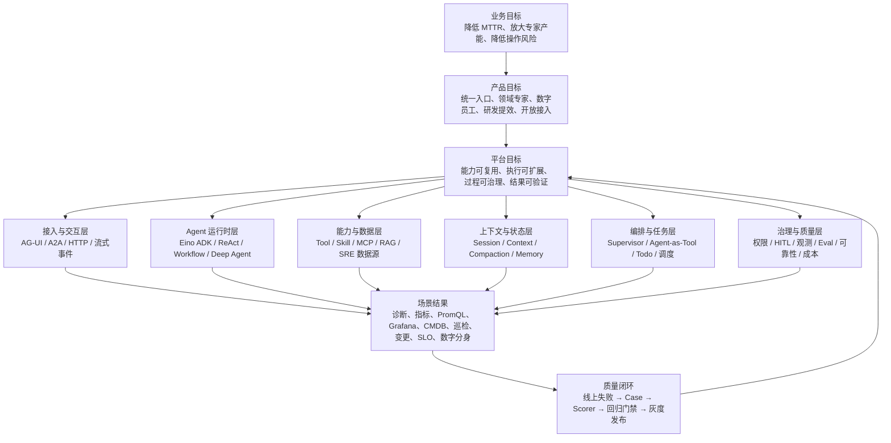

这张图的核心判断是：

- **TCUM-AI 的产品价值不是“会聊天”，而是让模型在真实运维世界里安全、可重复地完成任务。**
- **它的架构主体不是某个 Agent，而是六层共享底座。**15 个接入场景、16 条运行配置中还包含外部平台和内部支撑 Agent，不能说成“15 个自研生产 Agent”。
- **当前最强的是领域数据、场景 SOP、能力接入和上下文工程；最弱的是权限审批、事件化执行事实、恢复语义和评测门禁。**
- **下一阶段不应先堆更多 Agent，而应把已有能力变成有契约、有证据、有门禁的生产系统。**

### 0.2 面试展开顺序

| 时长 | 展开方式 |
|---|---|
| 30 秒 | 业务目标 → 六层底座 → 3 个亮点 → 3 个缺口 |
| 2 分钟 | 讲清混合架构选型，再选“上下文、Skill/MCP、Grafana 确定性 Builder”三个技术点 |
| 5 分钟 | 加入多 Agent、长程任务、可观测与 Eval，主动说安全和恢复短板 |
| 10 分钟以上 | 按本文第 3～10 节逐层展开，并用 DSH/CC/Codex 说明自己为什么这样判断下一步 |

### 0.3 每个节点统一用六句话

1. **目标**：这一层最终改善哪个业务结果？
2. **矛盾**：如果只靠 Prompt 或单 Agent，为什么做不到？
3. **设计**：TCUM-AI 选择了什么机制，为什么没选另一条路？
4. **证据**：用一个源码机制、真实场景或量化结果证明。
5. **问题**：当前方案在哪些边界会失败？
6. **演进与对标**：下一步如何验收；DSH、CC、Codex 哪一点值得借鉴？

一句适合作为全篇总纲的话：

> 我不是把“用了哪些框架能力”当亮点，而是从 SRE 任务的目标出发，把不确定的模型决策和确定性的工程执行分层；已经解决的是能力接入、领域 grounding 和部分上下文可靠性，下一阶段重点补执行事实、安全权限与评测门禁。

---

## 1. 分层目标树：从业务结果一直拆到技术机制

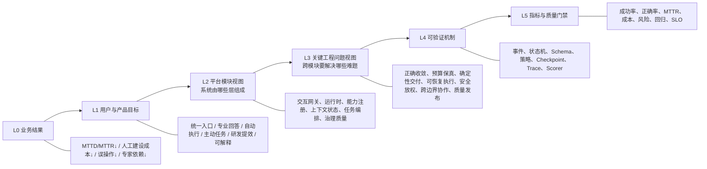

| 层级 | 要回答的问题 | TCUM-AI 当前落点 | 不能停留在什么表述 |
|---|---|---|---|
| L0 业务结果 | 为什么值得做？ | 统一运维数据与专家 SOP，减少跨系统查询和人工拼接 | “我们接了大模型” |
| L1 产品目标 | 用户获得什么新能力？ | 统一入口、领域专家、Grafana 生成、诊断、巡检、数字分身主动任务，以及 Skill 动态加载、数字分身动态配置、Agent 配置化接入带来的研发提效 | “有 15 个 Agent” |
| L2 平台模块视图 | 系统由哪些长期稳定的模块组成，各自接收什么、产出什么、由谁维护？ | 交互网关、Agent Runtime、Capability/Data、Context/State、Orchestration/Job、Governance/Quality 六层 | 再罗列一遍 Agent 技术名词 |
| L3 关键工程问题视图 | 多个模块共同面对的难题如何解决，失败边界和验收指标是什么？ | 正确收敛、上下文预算与保真、确定性交付、可恢复执行、安全放权、协议协作、评测发布等横切问题 | 把 Tool、Skill、MCP、RAG 原样重复一遍 |
| L4 工程机制 | 如何把模型概率行为变成可控系统？ | 中间件、Tool Schema、Builder、调度锁、Trace、Scorer | “Prompt 里要求它必须……” |
| L5 质量门禁 | 怎么证明改动变好了？ | 当前已有 Suite/Trial/Trace/Score 雏形；尚未成为发布门禁 | “看起来回答不错” |

### 1.1 六层平台模块与核心工程问题为什么不是一回事

这两个模块应该分别回答 **Where/Who** 和 **Why/How well**：

- **六层平台模块视图**是静态架构图：代码放在哪里、谁负责、输入输出是什么、可以被哪些场景复用。
- **关键工程问题视图**是动态问题图：一次任务为什么可能失败，多个层怎样协同解决，当前方案还缺什么，用什么指标验收。
- 一个工程问题通常横跨多层。例如“长上下文不丢关键证据”同时涉及 Tool 结果、Context Middleware、COS Artifact、模型调用和 Eval，不能归结成某一个“上下文层组件”。

#### 六层平台模块：只讲责任边界，不讲横切问题清单

| 平台模块 | 核心责任与输入输出 | TCUM-AI 主要实现锚点 | 不负责什么 |
|---|---|---|---|
| 交互与协议网关 | 接收 HTTP/AG-UI/A2A 请求，输出流式事件、Task 状态和 Artifact | `agent_access`、AG-UI runner/translator、A2A processor | 不决定 PromQL、Grafana 等领域正确性 |
| Agent Runtime | 驱动 Model↔Tool Loop，装配中间件和不同执行形态 | `pkg/agent/default_agent.go`、Eino ADK、`agent_builder.go`、`workflow_agent.go` | 不直接实现具体监控/CMDB API |
| Capability 与数据 | 注册原子 Tool、Skill SOP、MCP 能力、RAG 和真实 SRE 数据源 | `pkg/agent/skill_manager.go`、`pkg/mcp`、`pkg/rag`、`usercases/*/tools` | 不负责完整长任务状态机 |
| Context 与状态 | 组织本次模型可见内容、会话历史、摘要、Token 预算和记忆 | `summarization_handler.go`、`adaptive_context_retry.go`、`skill_cache.go`、消息/Memory DAO | 不应该替业务 Verifier 宣布任务成功 |
| Orchestration 与 Job | 路由、委托、并发、Workflow、计划和后台调度 | Deep `task`、`pkg/scheduler`、数字分身 Executor、Eino Workflow | 不替安全层决定高风险动作是否可执行 |
| Governance 与 Quality | 身份权限、审批、Trace、Eval、发布门禁、成本与 SLO | ExecutionContext、Langfuse callback、Eval Suite/Trial/Scorer | 不应成为领域团队所有业务逻辑的集中实现 |

#### 关键工程问题：按失败模式组织，每项都要落到具体机制

| 关键工程问题 | 横跨哪些平台层 | TCUM-AI 当前解法 | 当前核心缺口 |
|---|---|---|---|
| 如何让 Agent 正确收敛 | Runtime + Orchestration + Quality | ReAct、MaxStep、Tool 错误回注、部分业务校验 | 缺 progress detector、多维 budget 和统一 completion predicate |
| 如何在有限窗口中保留高价值信息 | Capability + Context + Runtime + Quality | 紧凑表示、64KB 工具结果治理、COS 外置、预防摘要、超限压缩重试、Skill 渐进披露 | 流式 `Stream` 未接超限自愈；阈值分散；压缩保真尚未成为 Eval |
| 如何把概率输出变成确定性结果 | Runtime + Capability + Governance | Grafana `DashboardSpec → Go Builder → 后端写入/回读` | 尚未平台化 Artifact Contract 和统一 Verifier |
| 如何让长任务可恢复且不重复副作用 | State + Job + Governance | Timeout、执行日志、心跳、stale 清理、调度锁 | 只有失活检测；缺 Step checkpoint、完整 Run lease、幂等与 Saga |
| 如何安全放权 | Gateway + Capability + Governance | ExecutionContext、工具裁剪、Skill 沙箱、部分输入校验 | 缺统一 Tool risk policy、HITL、强身份传播和 effect ledger |
| 如何跨边界协作且语义不混乱 | Gateway + Runtime + Orchestration | AG-UI、A2A、MCP、Agent-as-Tool | 状态、身份、错误和版本契约尚未统一 |
| 如何证明改动更好并安全发布 | 全层横切 | Langfuse Trace、Suite→Trial→Scorer、AgentSnapshot 方向 | 数据集、业务 Oracle、统计显著性、Gate/灰度/回滚未闭环 |

### 1.2 每一层都要落到指标，但不要把目标值说成已有结果

源码能证明机制存在，不能自动证明它改善了多少业务指标。面试时可把下表称为“我会建立的目标树与验收指标”；只有拿到线上数据后，才能把目标改成业绩。

| 层级 | 北极星/结果指标 | 领先指标 | 典型反指标 |
|---|---|---|---|
| 业务 | MTTR、人工排障工时、变更事故率、专家覆盖率 | 首次有效证据耗时、跨系统人工切换次数 | Agent 使用量很高但 MTTR 不降 |
| 产品 | 端到端任务成功率、用户采纳率、重复使用率 | 澄清率、首次路由正确率、Artifact 一次通过率 | 只统计对话数、Agent 数 |
| 平台 | 新能力接入周期、能力复用率、平台可用性 | Tool/Skill/MCP 注册成功率、版本一致率 | 热更新很快但不可回滚 |
| 运行 | Run 成功率、可恢复率、P95/P99 时延 | step/tool/child 成功率、重试率、压缩率 | 只看最终 HTTP 200 |
| 质量 | 业务 Oracle 通过率、严重回归数、安全违规数 | case 覆盖率、scorer 一致性、paired win rate | 单次 LLM Judge 总分 |
| 成本 | 每类成功任务成本、token/工具/API 消耗 | cache 命中率、上下文固定税、无效 step 比例 | 只追求 token 少而牺牲正确率 |

---

## 2. 全域地图：AI Agent 核心领域有没有漏项

这张表是覆盖度检查清单。面试官追问任何一个 Agent 领域，都应该能落回 TCUM-AI 的现状、缺口和路线，而不是另起一套概念。

| # | 核心领域 | TCUM-AI 对应机制/场景 | 当前成熟度 | 详细入口 |
|---:|---|---|---|---|
| 1 | **Loop Engineering / ReAct** | Eino `ChatModelAgent`、`newReact`、MaxStep、Tool 错误回注 | 有循环；预算、收敛与验证仍偏模型驱动 | [架构与上下文](../01-机制原理/01-机制篇-架构与上下文管理.md) |
| 2 | 状态与事件模型 | 消息落库、AG-UI 事件、ThreadID/RunID | 分散，缺统一事实模型 | [多 Agent 与长程可靠性](../01-机制原理/03-机制篇-多Agent与长程可靠性.md) |
| 3 | 模型网关与路由 | ChatModelLookup、模型配置、Token Counter | 有抽象，缺系统化 fallback、熔断与模型门禁 | 同上 |
| 4 | Prompt / 指令治理 | Agent 描述、Soul、Skill、动态上下文 | 来源丰富，优先级、版本和冲突语义不统一 | [Skill 与 MCP](../01-机制原理/02-机制篇-Skill注入与MCP管理.md) |
| 5 | **Context Engineering** | 七层压缩、COS 卸载、摘要、场景裁剪 | 项目亮点；流式重试仍有 P0 缺口 | [架构与上下文](../01-机制原理/01-机制篇-架构与上下文管理.md) |
| 6 | Tool Calling | Eino ToolsNode、并发、错误中间件、Unknown Tool | 基础完备；风险、幂等和错误类型不足 | [多 Agent 与长程可靠性](../01-机制原理/03-机制篇-多Agent与长程可靠性.md) |
| 7 | Skill | 四类 Backend、渐进披露、`skill_exec`、会话缓存 | 项目亮点；缺强契约和版本闭环 | [Skill 与 MCP](../01-机制原理/02-机制篇-Skill注入与MCP管理.md) |
| 8 | MCP Client / Server | 静态和动态 Consumer、Eino→MCP Provider、CAPI MCP 化 | 双向能力强；鉴权和 schema 一致性不足 | 同上 |
| 9 | RAG / Grounding | trag 知识库、ES8 监控元数据混合检索 | 有真实领域数据；排序、时效和证据不足 | [监控域场景](../02-场景案例/05-场景篇-总览与监控域.md) |
| 10 | Memory | 会话摘要、Skill Cache、Twin Memory 表与 MCP 查询 | 多个松散机制，未形成记忆生命周期 | [记忆专题](../05-演进与对比/13-记忆协同体系-四家实现与面试题库.md) |
| 11 | **Multi-Agent 架构** | 单专家、Deep、动态总入口、外部 A2A、固定 Workflow | 混合选型合理；子任务契约不足 | [多 Agent 与长程可靠性](../01-机制原理/03-机制篇-多Agent与长程可靠性.md) |
| 12 | **意图识别与路由准确性** | 动态 Agent 描述 + `task` Agent-as-Tool | 可工作；决策未结构化，无法独立量化 | [Agent Eval](../01-机制原理/05-机制篇-Agent评测与评测体系.md) |
| 13 | Planning / Todo / Plan-and-Execute | Deep Agent `write_todos`、固定 `compose.Chain` | 有模型计划提示和固定流程，但无结构化动态 Plan、DAG 调度、Step 状态机与 Replan | [多 Agent 与长程可靠性](../01-机制原理/03-机制篇-多Agent与长程可靠性.md) |
| 14 | 长程任务与恢复 | MaxStep、Timeout、Scheduler+锁、SSE 心跳、DB 历史 | 有保护和失活检测，无完整 Checkpoint/Resume | 同上 |
| 15 | 并发 / 后台任务 / 取消 | ToolsNode 并发、Agent Run goroutine、定时任务 | 有并发，缺统一 Job/取消/孤儿清理 | 同上 |
| 16 | Agent 协议与通信 | Agent-as-Tool、A2A、AG-UI、MCP、HTTP/SSE | 接入面丰富；协议职责和错误语义未统一 | 本文第 9 节 |
| 17 | 结构化输出与 Artifact | Grafana `DashboardSpec` + Go Builder + 后端校验 | 项目强亮点，应平台化 | [其他域场景](../02-场景案例/06-场景篇-其他域与总结.md) |
| 18 | 安全 / 权限 / 租户 | Twin allowlist、Bearer Token、部分工具过滤 | 最大短板：无统一 policy、sandbox、HITL | [可观测性](../01-机制原理/04-机制篇-可观测性与ClaudeCode对照.md) |
| 19 | **幻觉治理 / Guardrail / 对抗验证** | 指标 RAG、权威 Tool、告警配置校验、PromQL 回放、错误中间件 | 有 grounding 和局部 verifier；缺 claim-evidence、拒答阈值与强制状态机 | 本文第 8.3 节 |
| 20 | 可观测性与可回放 | Eino Callback → Langfuse；AG-UI Trace | 两套视角并存，缺统一 Step/Event 模型 | [可观测性](../01-机制原理/04-机制篇-可观测性与ClaudeCode对照.md) |
| 21 | **Agent 效果评估** | Suite→Trial→AGUI Trace→Score、自定义 scorer skill | Runner 已有；数据集、环境、统计门禁不足 | [Agent Eval](../01-机制原理/05-机制篇-Agent评测与评测体系.md) |
| 22 | **错误处理与失败语义** | Tool error 回注、`RunError`、A2A Task 状态 | 局部处理较多，但错误码、重试性和副作用状态不统一 | 本文第 9 节 |
| 23 | **稳定运行 / SLO / 降级** | 多层 timeout、panic recovery、心跳、调度锁 | 局部健壮；缺端到端 SLO、依赖隔离和演练 | 本文第 9 节 |
| 24 | 性能 / 成本 | 紧凑编码、工具截断、缓存、并发、Langfuse 过滤 | 优化较多；缺按任务归因的预算 | [优化编年史](../05-演进与对比/11-优化编年史-问题驱动.md) |
| 25 | 配置 / 发布 / 回滚 | Agent DB 配置、热更新、Skill 多 Backend | 控制面存在；snapshot、灰度和回滚不足 | [对抗与自进化](../05-演进与对比/10-对抗机制与自进化.md) |
| 26 | **人机协同 / HITL / Steering** | AG-UI 流式反馈、取消、Eino interrupt 基础 | 能看进度；澄清、审批、纠偏、接管和恢复未闭环 | 本文第 9 节 |
| 27 | 数据治理 / 隐私 / 新鲜度 | 内部监控、CMDB、知识库和用户上下文 | 数据价值高；provenance、TTL、脱敏和删除语义不足 | [记忆专题](../05-演进与对比/13-记忆协同体系-四家实现与面试题库.md) |
| 28 | UX / 可解释性 / 信任 | 流式消息、工具过程、Artifact | 有过程事件；决策理由、影响面和证据展示不足 | 本文第 9 节 |
| 29 | 线上反馈 / 自进化 | Trace、Scorer、记忆雏形 | 尚未形成失败聚类→Case→回归→灰度闭环 | [对抗与自进化](../05-演进与对比/10-对抗机制与自进化.md) |
| 30 | Ownership / 生态 / Build-vs-Buy | 平台、业务 Agent、外部 A2A、MCP Provider | 边界存在；责任、SLO、兼容期仍需契约化 | 本文第 10～12 节 |

---

## 3. 业务层与产品层：为什么要做统一 SRE-AI 底座

### 3.1 目标思维导图

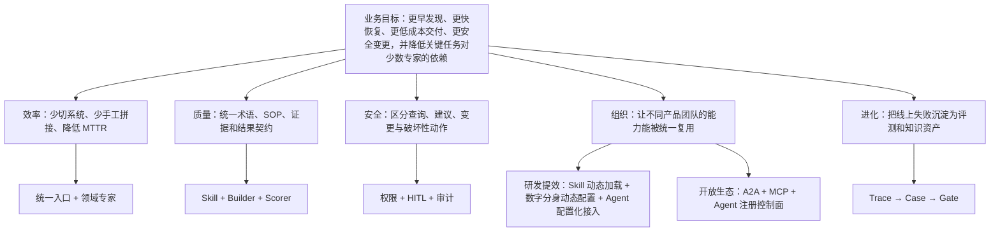

### 3.2 从平台总目标拆到业务结果与平台产品目标

平台总目标不是“把所有运维系统接给大模型”，而是把 SRE 的五类结果和一类平台供给效率做成可测量的价值链：**更早发现、更快定位与恢复、更低成本建设、更安全变更、降低关键运维任务对少数专家的依赖，以及更快完成 Agent 能力的接入、复用和发布**。统一入口负责识别目标和组织任务，垂直 Agent 对某个业务结果负责，Tool/MCP/Skill 只是实现手段；定时或事件触发的“主动运行”是服务这些结果的运行方式，并不是与故障发现、定位恢复并列的业务目标。

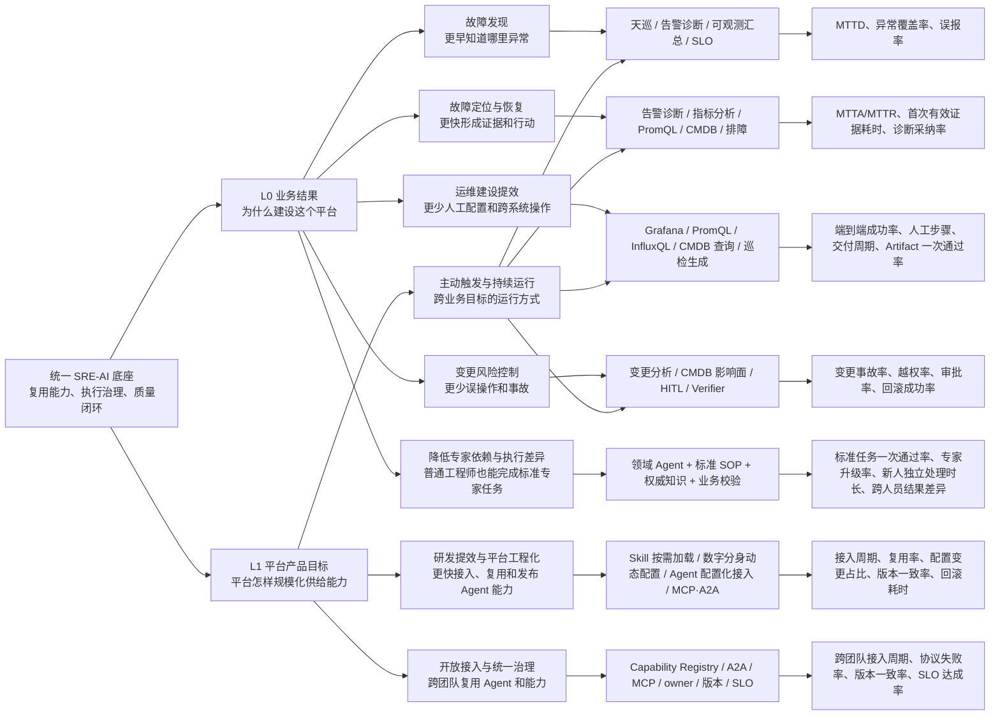

| 目标层级与目标 | 用户原本的痛点 | 平台总入口负责什么 | 垂直 Agent / 能力负责什么 | 应衡量什么 | 当前边界与问题 |
|---|---|---|---|---|---|
| L0 业务结果｜故障发现 | 告警、巡检、SLO 和运行态分散，异常被动发现 | 识别“巡检/告警/态势”意图，聚合跨域信号并给出优先级 | `tianxun_inspect_expert`、`prometheus_alert_diagnose_expert`、`obs_summary_analysis_expert`、SLO 场景负责各自信号解释 | MTTD、有效异常覆盖率、误报/漏报率、首次通知延迟 | 当前更接近“收到问题后分析”；是否真正降低 MTTD 需接线上告警与巡检数据证明 |
| L0 业务结果｜故障定位与恢复 | 人工在监控、CMDB、变更和日志之间来回切换，证据拼接慢 | 识别诊断目标、拆跨域子任务、合并证据、决定澄清或升级 | 告警诊断、指标分析、PromQL/InfluxQL、CMDB、变更分析和排障 Agent 产生领域证据 | MTTA/MTTR、首次有效证据耗时、根因 Top-K 命中、建议采纳率、证据完整度 | 现有多 Agent 汇总以文本为主；缺 typed evidence、根因置信度和恢复动作闭环 |
| L0 业务结果｜运维建设提效 | 看板、查询、巡检等工作重复且依赖少数专家 | 路由到正确领域，维护用户约束、审批和产物状态 | Grafana、PromQL、InfluxQL、CMDB 自然语言查询、巡检生成负责生成和验证 Artifact | 端到端成功率、人工步骤减少、交付周期、一次通过率、修改轮数 | Grafana 有 Spec→Builder→后端验证的好基础；其他产物尚未统一为 Artifact Contract |
| L0 业务结果｜变更风险控制 | 影响面不清、重复执行、越权和失败回滚风险高 | 识别高风险意图，强制进入策略与审批流程 | 变更分析、CMDB 影响面、执行 Tool、Verifier 共同完成 pre/post check | 变更事故率、越权拦截率、审批命中率、幂等率、补偿/回滚成功率 | 当前无统一 Tool 风险等级、HITL 和副作用账本，暂不能把“自动执行”包装成安全闭环 |
| L0 业务结果｜降低专家依赖与执行差异 | 高频任务依赖少数专家；新人和跨团队人员完成同一任务的速度、步骤与结果差异大 | 识别标准任务、调用受控专家能力；超出边界时澄清或升级给专家 | 领域 Agent 封装专业边界，Skill 固化可执行 SOP，RAG 提供权威资料，Tool/Builder/Verifier 负责真实执行与验收；Memory 只做主体个性化和连续性，不是这项目标的核心机制 | 标准任务一次通过率、专家升级率、新人独立完成时长、跨人员结果方差、返工率；Skill 命中率只是过程指标 | 已有领域 Agent、Skill/RAG 和部分后端验证，但尚未证明普通工程师能稳定达到专家基线；缺任务分级、专家 Gold Case、能力认证和线上对照数据 |
| L1 平台产品｜研发提效与平台工程化 | 新 Agent/Skill 需要重复写接入胶水、改主工程和发版；不同角色需求容易形成代码分叉 | 提供统一注册、动态发现、运行时装配、版本与发布治理，让能力供给方低耦合接入 | Skill 多 Backend 与渐进披露；数字分身动态配置 Soul/上下文/工具；Agent DB 配置与 AgentManager 热更新；MCP/A2A 接入外部能力 | 新 Agent/Skill P50/P95 接入周期、配置即可完成的变更比例、能力复用率、契约测试通过率、版本漂移数、回滚耗时 | 当前是“部分配置化”而非完全无代码：Builder、Tool 实现、中间件和固定 Workflow 仍在代码中；按需加载也不等于具备安全版本治理的热插拔，仍缺不可变快照、灰度和一键回滚 |
| L1 平台产品｜开放接入与统一治理 | 各团队 Agent 入口、协议、权限和 SLO 不一致 | Capability Registry、路由、身份委托、版本兼容和全局治理 | A2A 接外部 Agent，MCP 接工具能力，内部 Agent-as-Tool 负责编排 | 新能力接入周期、复用率、路由准确率、协议失败率、SLO 达成率 | 接入协议已较丰富，但 AgentCard、错误语义、版本兼容和 owner 责任仍需平台化 |

#### 3.2.1 “主动运维”应放在运行方式层，而不是业务目标层

“响应式/主动式”描述的是**任务由谁、在什么时候触发**；“故障发现/定位恢复/建设提效/风险控制”描述的是**最终要改善什么业务结果**。两者属于不同维度，不能平铺成同一级目标。

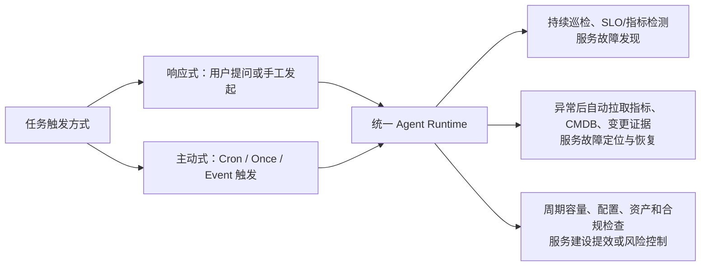

因此，TCUM 当前能够证明的是：数字分身提供了**脱离在线对话发起并运行任务的基础设施**。它能不能带来更早发现，要看调度的到底是不是异常检测任务；能不能缩短定位时间，要看异常后是否自动触发取证和诊断。定时执行本身不是业务收益。

数字分身相关机制并非一组并列名词，而是一条“触发—抢占—执行—存活检测—终态清理”的任务生命周期：

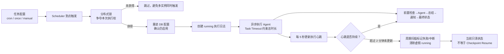

| 机制 | 为什么需要 | 它和前后步骤的关系 | TCUM 当前事实与边界 |
|---|---|---|---|
| Cron / Once / Manual Scheduler | 没有用户在线提问时也能按计划发起任务 | 生命周期入口，决定“什么时候触发”，不决定“任务业务上是否有价值” | 支持 cron、一次性和手工模式；只有调度巡检/检测任务时才服务故障发现 |
| 分布式锁 | 多实例都加载同一任务并在同一时间触发时，避免同时创建重复执行 | 位于触发与执行之间，竞争“本次执行权” | 锁按 `taskID` 获取；当前数字分身 Executor 很快创建异步任务后返回，锁主要覆盖**调度提交阶段**，未完整覆盖后续 Agent 长任务，不能夸大为端到端 exactly-once |
| 锁续约 | 同步执行超过锁租期时，避免锁过期后被其他实例接管 | 只延长执行权租约，解决 ownership，不表示任务有进展 | 通用 Scheduler 默认锁 10 分钟、5 分钟续约；但数字分身实际 Agent 在异步 goroutine 中继续运行，当前续约生命周期可能早于真实 Agent 执行结束，应改为由持有完整 Run 的 Job lease 续约 |
| `running` 执行日志 | 进程退出后仍要知道某次任务曾经启动、当前处于什么状态 | 是心跳、清理、审计和未来恢复的持久载体 | 已记录开始、结束、状态、结果和 `last_heartbeat`；尚未细化到 Step/Artifact/Effect |
| 5 秒执行心跳 | 异步 goroutine 可能 panic、挂死或随实例消失，只看 `running` 无法判断它是否还活着 | 运行期间不断刷新日志；供 stale detector 判断 worker 活性 | 表示“执行协程仍在刷新”，不表示业务有进展，也不等于 SSE/A2A 的连接心跳 |
| Stale-running 扫描 | 服务异常后，执行日志可能永久停在 `running`，污染用户认知和统计 | 消费心跳信号，把长时间无心跳的运行转成终态 | 运行期每 5 分钟扫描、以 2 分钟无心跳判 stale；启动后也会扫描。代码实际把状态更新为 failed，并写“中断”原因；它只是失活检测与终态清理，不会从断点恢复 |
| Task Timeout | 模型或下游长期阻塞时限制资源占用和等待时间 | 到期取消执行 context，心跳也随 context 停止，随后进入失败/清理路径 | 默认配置存在多层超时；仍要验证所有模型、Tool 和下游都正确响应 context cancel |
| 前置检查、总结、通知与 Finalize | 后台完成了但没有校验、送达和终态，业务闭环仍不成立 | 把执行结果交付给责任人并固化最终状态 | 已有 pre-check、总结、通知和 finalize；但业务 postcondition、通知确认和人工接管仍需按场景加强 |

更准确的改进方向不是继续堆“主动运维组件”，而是建立统一 `JobRun`：用 `(taskID, scheduledAt)` 作为本次触发的幂等键，Job lease 覆盖真实 Agent Run，heartbeat 区分 worker liveness 与业务 progress，并通过 Checkpoint、EffectLedger 和 postcondition 实现安全续跑与结果验收。

这里最容易讲错的是把“已有机制”直接等价为“业务结果已经达成”。源码能证明 TCUM-AI 有这些场景和技术链路，**不能证明 MTTR 已下降多少**；面试中应把没有线上数据支撑的数值明确称为目标指标或下一阶段验收指标。

### 3.3 为什么既要总入口，又要垂直 Agent

- 总入口优化的是**用户认知成本和跨域协作成本**：用户描述目标，不必先知道该找哪个 Agent；它对意图识别、澄清、委托、合并和风险升级负责。
- 垂直 Agent 优化的是**专业正确性和能力边界**：它拥有更小的工具面、领域 Prompt、Skill、知识、业务 Oracle 和独立 SLO。
- 两者不能互相替代：只有总入口会导致工具爆炸、上下文污染和权限过宽；只有垂直 Agent 会把选路和跨域拼接成本重新推给用户。
- TCUM 当前选择“动态总入口 + 单体/Deep/Workflow/外部 Agent 的混合执行”方向合理；下一步不是再套一层 Supervisor，而是把首跳路由、child result 和 completion predicate 结构化。

### 3.4 设计卡片

| 核心点 | 为什么做 | TCUM-AI 已做 | 当前问题 | 改进与验收 | 对标启示 |
|---|---|---|---|---|---|
| 统一运维入口 | 用户不知道能力分散在哪个系统，更不应先学习 Agent 名 | 动态 `supervisor` 聚合启用 Agent，按描述通过 `task` 委派 | 入口路由依赖模型自由文本推理；缺少置信度、拒答和澄清协议 | 先输出结构化 `RouteDecision`，再执行；用 Gold Case 单测首跳、多跳、澄清和拒答 | CC/Codex 更重视把独立任务委派到隔离子会话；TCUM 应保留领域入口，但补显式路由事实 |
| 领域专家资产化 | 通用模型不懂监控语义、CMDB 模型、内部 API 与 SOP | PromQL、指标、告警、Grafana、CMDB、巡检、变更、SLO 等能力单元 | 生产 DB 配置、Skill 仓和运行镜像可能漂移；场景数量容易被包装成 Agent 数量 | 建 `AgentVersion`：冻结 Prompt、Skill、Tool、MCP、Model、知识库版本；发布前跑场景回归 | DSH 的 profile/bundle/patch 组合树更容易精确说明“这次运行由什么组成” |
| 从问答到执行 | SRE 价值最终在状态变化和结果产物，不在一段自然语言 | Grafana Builder、定时任务、动态工具、外部 A2A 执行 | 查询和写操作没有统一风险等级；“Agent 说成功”不等于外部状态成功 | 每个动作定义 precondition、idempotency key、postcondition、compensation、evidence | CC/Codex 的 sandbox、permission、approval 更成熟；DSH 的工具执行管线和 provider seam 更利于统一施策 |
| 平台而非项目集合 | 每个场景各造一次 Loop、上下文、协议、观测会形成烟囱 | AgentManager、Eino 中间件、Skill/MCP、AG-UI/A2A、Eval Suite | 共性能力仍有多条旁路，例如流式/非流式、静态/动态工具、不同 schema 生成路径 | 建统一 Runtime Contract，任何执行形态都输出相同 Run/Turn/Step/Item 事件和治理元数据 | DSH 的“所有部分皆插件”与 Codex 的事件化运行时，都是平台一致性的更强参照 |
| 研发提效与平台工程化 | 如果每接一个 Agent、Skill 或数字分身都要改主工程，平台会成为交付瓶颈 | Skill 多 Backend/渐进披露/`skill_exec`，数字分身按 Soul、上下文和工具权限动态装配，Agent 配置入库并由 AgentManager 动态发现，MCP/A2A 降低跨团队耦合 | 配置、运行逻辑和发布单元仍未完全分层；热更新缺少版本快照、兼容检查、灰度和统一回滚 | 建 Capability Registry + typed Manifest + 不可变 AgentSnapshot + 自助接入 SDK/Portal；注册时自动跑 lint、契约测试和 Eval，按租户灰度并可一键回滚 | DSH 的 bundle/profile/patch 组合与插件 seam 更适合可重放装配；Codex/CC 的 Skill 目录约定、权限和发布体验更完整，值得补到 TCUM 控制面 |

### 3.5 这一层的面试结论

> TCUM-AI 最应该强调的不是 Agent 数量，而是“运维能力供给侧”被统一了：已有系统通过 Tool/MCP 暴露原子能力，领域 SOP 通过 Skill 复用，不同 Agent 通过 A2A/Agent-as-Tool 组合，最终用统一运行时承接上下文、事件和治理。现在的问题是供给侧已经丰富，治理侧还没有达到同等成熟度。

---

## 4. Agent 运行时、状态与协议层

### 4.1 目标思维导图

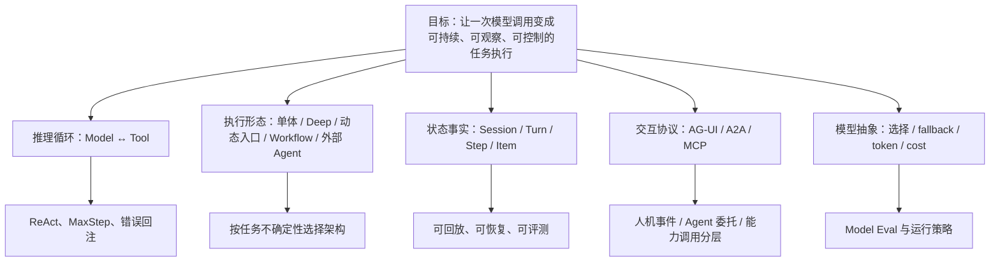

### 4.2 五种执行形态为什么都需要

| 形态 | 适用目标 | TCUM-AI 实现 | 选择理由 | 当前限制 |
|---|---|---|---|---|
| 单体专家 | 边界清楚、工具集小、一次专家任务 | `DefaultAgent` → `ChatModelAgent` + ReAct | 调度成本低、行为容易约束 | 复杂跨域任务会把上下文和工具集撑大 |
| Deep Agent | 需要规划、文件工作区、多个专长子 Agent | `BuildDeepAgent` → `deep.New`，统一 `task` 工具 | 子 Agent 上下文隔离，主 Agent 只收结果 | `write_todos` 是可调用工具，不是强制工作流；主 Agent 是否遵循 Todo 仍靠模型 |
| 动态总入口 | 能力集合随配置变化、用户不应选 Agent | 请求时查启用 Agent，再 `deep.New` 装配 | 控制面驱动，扩展新场景无需改入口代码 | 名为 `supervisor`，实际不是 Eino `supervisor.New`；缺结构化路由与 handoff 状态 |
| 固定 Workflow | 步骤可预测、顺序重要、需要强控制 | `compose.Chain` 包装的 `WorkflowAgent` | 少一次自主决策就少一种不确定性 | 没有 ReAct、委派和 `BeforeAgent` 动态注入能力 |
| 外部 Agent | 能力/团队/部署边界独立 | A2A/AG-UI 远程壳 | 组织解耦、独立扩容和升级 | 超时、进度、取消、身份和错误语义需要跨系统协商 |

#### 4.2.1 Eino 提供什么，与 TCUM 实际用了什么要分开

| Eino ADK 机制 | 协作语义 | 适合场景 | TCUM 当前事实 |
|---|---|---|---|
| `SetSubAgents` / `TransferToAgent` | 当前控制权转移给另一个 Agent，可形成 handoff/flow | 对话责任发生转移，需要目标 Agent 直接接管 | 框架可用，但不是 TCUM 统一入口的主实现 |
| `prebuilt/supervisor.New` | 中央 Supervisor 协调；子 Agent 只能回到 Supervisor，且共享统一 trace root | 强中心、层级式治理 | TCUM 非 vendor 代码没有调用；名为 `supervisor` 的业务 Agent 不能因此说成用了该实现 |
| `NewSequentialAgent` / `NewParallelAgent` / `NewLoopAgent` | 按确定顺序、并行或固定循环运行一组子 Agent | 步骤和依赖已知、需要可预测执行 | 框架具备；TCUM 业务更多使用自有 `WorkflowAgent`/Skill SOP，仍有下沉空间 |
| `prebuilt/deep.New` | 主 Agent 通过统一 `task` 工具调用子 Agent，并带 Todo、文件系统/执行工具等深任务能力 | 开放式任务分解、子任务上下文隔离 | TCUM Deep 场景和动态总入口的核心实现；`prometheus_promql_expert` 既可独立入口，也可作为这里的子 Agent |

因此，“Eino 有哪些多 Agent 架构”和“TCUM 生产选择了哪一种”是两个问题。前者说明框架能力边界，后者才体现项目的真实技术决策。

还要补一个执行架构判断：`deep.New + write_todos` 仍属于“模型在 ReAct 循环里自行维护计划”，并不等于 Plan-and-Execute。TCUM 当前已有 ReAct、Deep Agent 和固定 Workflow 三种基础积木，但还没有结构化 `PlanSpec`、依赖调度、Step 状态机、逐步验收和事件驱动 Replan 组成的完整 Plan-and-Execute Runtime。

### 4.3 核心设计卡片

| 核心技术点 | TCUM-AI 当前设计 | 当前问题 | 优先改进 | DSH / CC / Codex 哪儿更出色 |
|---|---|---|---|---|
| ReAct 循环 | 循环位于 vendor Eino ADK：模型生成 tool calls，ToolsNode 执行，再回到模型；`MaxStep` 分场景配置 | Graph 层给到 `math.MaxInt`，第二道总步数保护弱；长任务主要靠“多给步数” | 将 step budget、tool budget、token budget、wall-clock budget 合成运行预算；超预算返回可恢复状态而非普通失败 | DSH 明确区分 turn 与 step，并把 pre-step/request/tool 生命周期做成类型化事件；Codex 用 Thread/Turn/Item 暴露更清晰的运行事实 |
| Eino 扩展点 | `BeforeAgent` 做 Soul、动态 task/MCP/KB/Skill 注入；`BeforeModelRewriteState` 做预防性摘要；`WrapModel` 做 context-limit retry；Tool middleware 做截断和错误治理；Callback 接 Langfuse | 中间件顺序依赖隐式约定；Deep/Workflow/流式等路径覆盖不完全一致；新增能力容易挂错层 | 为 middleware 建 phase/order/scope/stream-support manifest 和契约测试；启动时打印最终链；要求所有执行形态通过覆盖矩阵 | DSH typed lifecycle event + waterfall `next()` 更容易表达顺序和拦截；CC Hooks 把生命周期点做成外部可配置协议 |
| 状态模型 | 消息历史在 DB，AG-UI 产生前端事件，Langfuse记录模型/工具 trace，ThreadID 稳定、RunID 每次变化 | 三套视角不是同一事件源；无法可靠回答“哪一步已提交、能从哪恢复” | 定义 `Run → Turn → Step → Item`；每个 tool call 有 planned/running/succeeded/failed/compensated 状态与证据引用 | DSH 的 append-only `SessionEvent`、投影和“模型可见即已记录”最值得借鉴；Codex 的事件化 item 对 UI/回放/Eval 也更统一 |
| 流式交互 | AG-UI 主链路 `EnableStreaming: true`，translator 输出消息和工具事件 | 流式链路绕过 `adaptiveContextModel.Generate` 的超限自愈；客户端断开与后台执行边界不够显式 | 把流创建失败、流中错误、断连继续/取消做成协议状态；所有终态持久化 | CC/Codex 产品对后台任务、可见进度和子任务线程的表达更完整；DSH 原始 chunk 也进入事件日志，可重放 UI |
| 协议分层 | AG-UI 面向前端事件；A2A 面向 Agent 委托；MCP 面向工具/资源能力 | 代码里都可能最后表现成“远程调用”，容易把身份、生命周期和错误语义混在一起 | 分别定义：AG-UI 的人机事件契约、A2A 的 Task/Artifact/状态协商、MCP 的 capability/permission/lifecycle | Codex 把 MCP、Skill、Hook 分成不同扩展层；DSH 把 capability provider 和 model-facing consumer 分离，边界更清晰 |
| 模型抽象 | `ChatModelLookup`、模型配置、Token 计数 fallback；不同 Agent 可选模型 | 缺模型级 SLA、按场景降级策略和替换回归；模型失败可能直接终止任务 | `ModelPolicy` 按意图/风险/上下文选模型；超时、限流、内容错误分型；任何换模先跑 agent-in-the-loop Eval | DSH 的 `ctx.llm` 是 provider-neutral seam 且重试策略归 provider；Codex 的模型、努力等级和任务配置更产品化 |

### 4.4 最重要的架构判断

> TCUM 当前选择“混合架构”是合理的：固定 SOP 用 Workflow，垂直专业任务用单 Agent，开放问题用 Deep Agent，跨团队能力用 A2A，统一入口用动态聚合。优化方向不是把它们统一成一种架构，而是让五种形态都服从同一套状态、权限、观测与评测契约。

---

## 5. 能力与数据层：Tool、Skill、MCP、RAG、确定性 Builder

### 5.1 目标思维导图

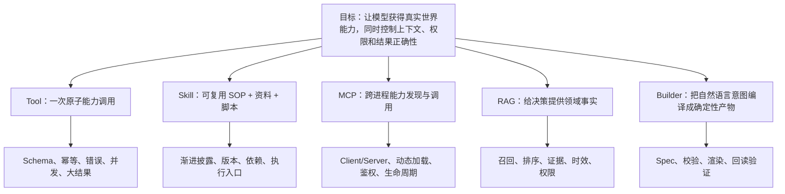

### 5.2 核心设计卡片

| 核心点 | 为什么做 | TCUM-AI 已做 | 当前问题 | 改进与验收 | 对标启示 |
|---|---|---|---|---|---|
| Tool 契约 | 模型需要原子、可描述、可观察的真实能力 | Eino Tool；ToolsNode 默认并发；panic 隔离；错误中间件把可恢复错误回给模型；Unknown Tool 可自纠 | 四条 schema 生成路径可能漂移；风险、幂等、副作用、owner、SLO 等元数据缺失 | 统一 `ToolManifest`；注册时校验 schema；运行时统一 timeout/retry/policy/evidence；写工具必须声明幂等与回滚 | DSH `ctx.tools` 从 pre-policy、monotonic guard、dispatch 到 post-policy/observer 是更完整的执行管线；CC/Codex 对工具权限更强 |
| Skill 渐进披露 | 不把所有 SOP 和脚本说明塞进 system prompt | 四类 Backend；先暴露名称/描述，命中后加载正文；`skill_exec` 在沙箱执行脚本；会话级 skill cache 按距离淡出 | 描述是否足以正确路由没有离线测试；脚本选择和参数规则可能仍靠模型理解；Skill 版本与 Agent 版本未冻结 | Skill 包加入 `manifest.yaml`：trigger、inputs、outputs、scripts、tool deps、risk、fixtures、scorers；发布前跑路由+执行+回归测试 | Codex 官方 Skill 同样采用名称/描述先加载、命中后读完整 `SKILL.md`，并限制初始 Skill 列表预算；CC 也明确区分 always-on 指令与 on-demand Skill |
| `skill_exec` | 让 Skill 不只是一篇 Prompt，而能调用确定性程序 | 工具参数包含 `skill_name/command/stdin`，脚本运行在对应 Skill 沙箱目录 | “应调用哪个脚本、输入输出格式”若只写自然语言，仍可能误选；执行权限和副作用分类不足 | 不让模型自由拼任意 command：注册脚本为具名 action，按 JSON Schema 入参；程序内做格式校验、超时、目录边界、退出码和证据输出 | CC/Codex Skill 允许配 scripts/resources，但安全上仍依赖宿主权限；DSH 把 shell/subprocess/sandbox 分为可替换 seam，隔离边界更清晰 |
| MCP 双向能力 | 复用存量服务并把 TCUM 能力开放给外部 Agent | Consumer 有静态/动态注入；Provider 可将 Eino Tool 转 MCP；CAPI 批量 MCP 化；mcporter 路线减少主 Agent schema 占用 | MCP server 身份传播不足；AK/SK 选择启发式；静态与动态注册失败语义不一致；连接健康与版本观测不足 | `McpServerManifest` + per-user auth context + connection state machine + tool allowlist + schema hash；启动失败 fail-fast，运行期降级必须告警 | Codex/CC 对 MCP 配置、权限和延迟加载更产品化；DSH provider/consumer seam 允许远程实现替换本地实现而不改模型层 |
| RAG / Grounding | 运维结论必须基于实时指标、资产、拓扑、告警和知识，而非模型常识 | trag 通用知识库；ES8 监控元数据；原 query + LLM 改写双路召回并交替融合 | ES 内部 BM25 与 kNN 直接加分存在量纲问题；`ScoreThreshold` 未设；证据引用、数据 freshness、ACL 不统一 | 自实现 RRF/归一化；建立 retrieval Eval；结果附 source/time/tenant/confidence；无证据时拒绝强结论 | 这恰是 TCUM 相对 coding harness 的业务优势；开源 harness 更强在运行治理，不天然拥有内部 SRE 数据资产 |
| 确定性 Builder | 复杂 JSON 让 LLM 直接生成容易结构错、字段漏、布局错 | Grafana 场景中 LLM 产出 `DashboardSpec`/意图，Go Builder 负责完整 JSON、布局、模板和后端写入 | Spec/Builder 还没有上升为平台 Artifact 抽象；布局部分问题只 warn；回读渲染、指标存在性和数据健康未形成统一验证器 | `Intent → Spec → Validate → Build → Apply → ReadBack → RenderCheck → Score`；每步产物版本化并可回放 | Codex 在代码场景中擅长“编辑—测试—验证”的闭环；CC Hooks 能把验证变成停止条件；TCUM 可把该思想迁移到 Dashboard/告警/变更 Artifact |

### 5.3 Tool、Skill、MCP 不要混讲

| 概念 | 回答“是什么” | 生命周期 | 模型是否直接看到 | TCUM-AI 的典型例子 |
|---|---|---|---|---|
| Tool | 一个原子动作的调用契约 | 一次 tool call | 看到名称、描述和 schema | 查询 Prometheus、查询 CMDB、创建 Dashboard |
| Skill | 一套可复用的任务 SOP，可带资料与脚本 | 跨多个 ReAct step，甚至调用多个工具 | 先看摘要，命中后读正文；可再调 `skill_exec` | Grafana 生成 SOP、PromQL 专家规则、Scorer Skill |
| MCP | 工具/资源跨进程发现与调用协议 | 连接/会话级，调用是单次 | 取决于直接注入 schema 还是 mcporter/动态发现 | 天巡 MCP、知识库 MCP、CAPI MCP |
| Agent | 有模型、上下文、循环、工具和状态的执行主体 | 一个或多个 turn | 作为主入口，或被包装成 `task`/A2A 能力 | `prometheus_promql_expert`、`supervisor` |

面试金句：

> Skill 解决“怎么做一类任务”，Tool 解决“执行一个动作”，MCP 解决“能力如何跨边界被发现和调用”，Agent 解决“谁根据上下文决定下一步”。它们不是同义词，也不该共享同一套权限和生命周期语义。

---

## 6. 上下文、知识与记忆层

### 6.1 目标思维导图

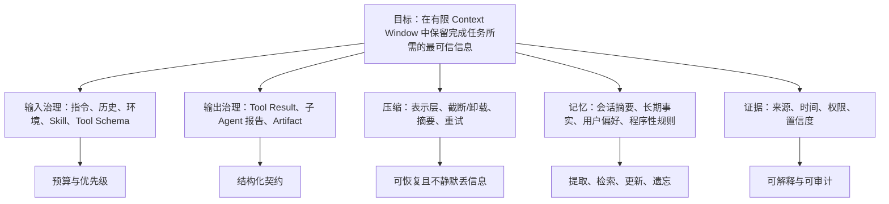

### 6.2 七层上下文体系应该怎样讲

| 层 | 目标 | TCUM-AI 做法 | 当前边界 |
|---|---|---|---|
| L0 表示层 | 从源头减少重复 token | `compact_table` 列式结构、拓扑 v3 紧凑图 | 只覆盖主动采用紧凑契约的工具；对所选字段无损，不等于对上游原响应全量无损 |
| L1 工具结果治理 | 防止单次工具结果撑爆上下文 | 64KB 默认阈值、per-tool 覆盖、结构化截断、COS 卸载 | `skill/task` 等白名单结果可能继续失控；字节阈值不等同 token 预算 |
| L2 能力说明压缩 | 控制 Tool/Skill schema 的固定税 | Skill 渐进披露、mcporter 零单工具 schema 路线、动态 MCP | 发现精度和延迟之间缺量化；仍有多条工具注册路径 |
| L3 预防性摘要 | 在临界点前压缩旧历史 | `BeforeModelRewriteState` summarization，每轮模型调用前检查 | 并发工具结果会跃迁式暴涨，可能跳过阈值窗口 |
| L4 超限自愈 | 真撞 context limit 时原地压缩重试 | `adaptiveContextModel.Generate` 检测后压缩并重试 | `Stream` 直接透传，AG-UI 主链路无法受益，是 P0 缺口 |
| L5 会话历史治理 | 长会话不全量回放 | 对话摘要 + 最近消息 tail | 摘要有信息损失；与长期记忆、事件恢复不是一回事 |
| L6 场景裁剪 | 只保留当前任务真正需要的数据 | 报告过滤、业务工具字段选择、Skill 距离淡出 | 多为场景规则，缺统一 token budget 和信息价值评估 |

### 6.2.1 长上下文压缩在 TCUM-AI 中到底怎么运行

不要把它概括成“超过阈值就总结”。TCUM 实际是三道防线，并且分别挂在 Tool、BeforeModel 和 WrapModel 三个生命周期位置：

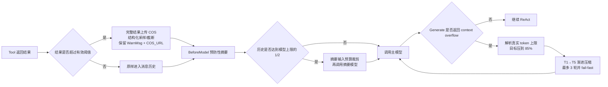

#### 第一道：控制单次 Tool Result，避免一轮结果直接撑爆窗口

实现位于 `usercases/obs_agent/tools/common/middleware/middleware_truncator.go`：

- 全局默认阈值是 `64 * 1024` bytes，可由 `TOOL_RESULT_MAX_SIZE` 覆盖，并支持 per-tool 阈值；例如 `QueryArchTopology` 使用两倍默认阈值。
- 业务错误结果不做 COS 上传和截断，避免把错误响应当成可分析数据。
- 超限后先把**完整结果**上传 COS，再针对 Metric、Table、Grafana frames 等类型做结构化截断；无法识别结构时才退化成原始字符串截断。
- 截断后的消息保留数据规模、截断提示和 `metadata.COS_URL`，让后续模型或 `skill_exec` 可以重新取得完整数据。
- 这层按 bytes 控制单条结果，不等于全局 token budget；白名单工具和一次并发返回多条“各自未超限”的结果仍可能合计撑爆窗口。

#### 第二道：在模型调用前做预防性摘要

`BuildSummarizationHandler` 位于 `pkg/agent/summarization_handler.go`，并同时装配到 Default Agent 和 Deep Agent：

- Eino summarization 的触发阈值设为 `modelMaxTokens / 2`，在每轮主模型调用前通过 `BeforeModelRewriteState` 检查。
- 摘要模型自己的输入也可能超限，所以 TCUM 只允许它占模型窗口的 90%；超预算时，优先压缩**已经被模型读过且最旧的 Tool 消息**。
- 当前轮尚未被 Assistant 读取的 Tool Result 保持完整，同时额外保护最近 2 条 Tool 消息，避免为了生成摘要破坏当前 ReAct 决策依据。
- Tool 数据被 elide 时仍保留 `WarnMsg/COS_URL`；摘要 Prompt 要求汇总“待用 COS 数据”清单，避免摘要完成后完整数据入口消失。
- 摘要使用的模型本身也包裹 `adaptiveContextModel`，防止摘要请求因为 tokenizer 估算偏差再次超限。

#### 第三道：真正收到 Context Overflow 后原地压缩重试

`AdaptiveContextRetry.WrapModel` 位于 `pkg/agent/adaptive_context_retry.go`：

- 首次请求保持原样，不给正常请求增加远端 tokenizer 开销；只有 `Generate` 返回可识别的 context overflow 才进入自愈。
- 优先从模型错误中解析真实的 `currentTokens/maxTokens`；目标预算设置为模型上限的 85%，为输出和估算偏差留余量。
- 最多进行 3 轮压缩。每轮压缩后重新计数，若仍高于目标的 105%，就不发送一个必然失败的请求，而是继续升级压缩等级。
- 压缩优先级综合考虑消息角色、是否已读、批次、大小和信息密度；先压“最胖、最低密度、已经被读过”的内容。
- 渐进档位不是一次性删除：`T1` 保留 Tool 结构和前 5 条样例；`T2` 丢弃 Data 但保留警告与 COS；`T3` 变成 Tool/call-id/COS 引用；`T4` 对长 Assistant 内容保留头尾各 800 字符；极限档再对 System 保留头尾各 1500 字符，并只保留摘要占位和最后一个 User 之后的 tail。
- 常规压缩只改消息 Content，保持 `tool_call_id ↔ tool result` 配对，避免破坏 OpenAI Tool Calling 协议。

#### Token 怎么计算

- 正常路径默认不调用远端 tokenizer。
- 超限自愈时优先调用 LiteLLM `/utils/token_counter`；单次调用由压缩路径限制在 800ms。
- 远端连续失败 3 次后熔断 60 秒；失败、超时或熔断时退化为本地 `chars/4` 估算。
- 这套 fallback 保证压缩机制不会因为 Token Counter 自己不可用而阻塞，但中文和 JSON 的本地估算可能偏低，所以仍需保留安全比例。

#### 真实边界与下一步

最大边界是 `adaptiveContextModel.Stream` 目前直接调用 `inner.Stream`，没有复用 `Generate` 的超限压缩重试；而 AG-UI 主路径启用了 streaming，因此这不是理论问题，而是当前 P0。更合理的方案是在**建流失败**时执行相同的压缩重试；对于已经开始输出后的流中错误，则不能盲目重放，需要结合事件序号、已产生 Tool 副作用和幂等语义决定重试、续跑或失败。

这项能力的验收不应该只看“压缩了多少 Token”，还应同时看：context-overflow 终止率、压缩后任务成功率、关键约束/证据保留率、COS 原文找回率、重复 Tool 调用率、压缩额外 P95，以及流式与非流式成功率差异。

### 6.3 核心设计卡片

| 核心点 | TCUM-AI 当前设计 | 当前问题 | 优先改进 | 对标启示 |
|---|---|---|---|---|
| Prompt / 指令治理 | 基础 Instruction、Agent 描述、数字分身 Soul、Skill 正文、动态 Agent/MCP/KB 说明在不同阶段拼装 | 来源优先级、冲突规则、版本和 token 成本没有形成统一协议；Prompt 禁令容易成为历史补丁堆 | 建 typed `ContextFragment{source,priority,scope,version,budget,trust}`；稳定规则外置并版本化；用行为 Eval 删除无效补丁 | Codex 的 `AGENTS.md`/Skill 分层与上下文片段思想、CC 的 `CLAUDE.md`/Skill/Hook 分工都比“全部拼进 system prompt”清楚 |
| Context 预算 | 多层压缩、Token Counter 的远端精确值/本地估算 fallback、熔断 | 每层各自阈值，缺统一预算分配；token、时延、正确率之间没有任务级决策 | 建 `ContextPlanner`：为 system/history/tool-schema/tool-result/memory 分预算和优先级；记录每次裁剪的原因与损失 | Codex 的 typed context fragment + budget 思想更系统；DSH token meter 输出 revisioned pressure，compaction 与 tool-result pruner 分离 |
| 压缩可恢复性 | 大结果可上传 COS，摘要替代历史 | 被截掉或摘要掉的信息没有统一 provenance；恢复时难判断原始事实 | 所有替换节点保留 artifact URI/hash/schema/摘要版本；模型按需读取原文，Eval 检查关键信息保真 | DSH 从 append-only log 投影模型历史，压缩和 surface replacement 可回放，事实边界更强 |
| 短期记忆 | DB 会话历史；满 10 条未摘要消息后生成摘要，保留最近 6 条 | 摘要是上下文压缩，不等于跨会话长期记忆；更新策略较粗 | 摘要按 topic/task 分段；关键 tool evidence 不应只剩自然语言摘要；以事实引用连接原事件 | DSH 强在会话事实与恢复；Codex/CC 则把跨会话记忆与必执行规则区分开 |
| 长期记忆 | `digital_twin_memory` 表、recent 候选 + LLM 重排、主要通过 MCP 查询 | 默认 Agent 构建链没有自动注入；自动提取/写入、TTL、命中回写、冲突合并和来源解释未闭环 | `Extract → Review → Store → Retrieve → Cite → Feedback → Forget`；高风险记忆需用户确认；强规则放版本化配置而非记忆 | Codex 官方明确 memory 是 recall layer，必须执行的团队规则放 `AGENTS.md`/受控文档；CC 也区分 `CLAUDE.md` 与自动记忆 |
| RAG 与 Memory 边界 | RAG 查组织知识和实时元数据；Memory 表承载分身/用户相关条目 | 容易把“查到了历史资料”叫作“Agent 记住了” | RAG 以文档/实时数据为中心；Memory 以主体、时间和经历为中心；Session 是当前执行记录；三者用 provenance 关联 | DSH 证明 event log 可以是强恢复基础，但不会自动等于语义长期记忆 |

### 6.4 这一层的面试结论

> 上下文管理的目标不是“尽量多塞”，而是在预算内最大化完成任务所需的信息价值。TCUM 的七层体系已经解决了表示、结果、说明书和历史四类膨胀，但还缺统一预算、可恢复替换和流式超限自愈；长期记忆则仍处在“表和查询能力已存在、自动生命周期未闭环”的阶段。

---

## 7. 多 Agent、Planning 与长程任务层

### 7.1 目标思维导图

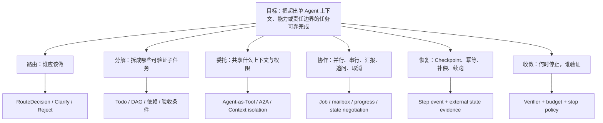

### 7.2 当前架构为什么合理、哪里还能优化

| 问题场景 | 当前选择 | 为什么合理 | 主要风险 | 更好的下一步 |
|---|---|---|---|---|
| 用户问一个明确 PromQL 问题 | `prometheus_promql_expert` 单体 Agent | 领域窄、工具少，无需多一次调度 | 与指标检索/执行 Agent 的边界可能重复 | 固化输入输出契约；根据复杂度决定本地完成或委托指标 Agent |
| 用户从统一入口提开放问题 | 动态 `supervisor` + `task` | 入口不维护固定 if/else，Agent 增删可动态生效 | 全靠主模型理解 Agent 描述；误路由后才在完整 ReAct 中暴露 | 两阶段 Router→Executor；低置信先澄清；路由 trace 独立评分 |
| 告警、巡检、指标融合汇总 | Deep Agent + 子 Agent | 领域查询可以并行、主上下文只收摘要 | 子 Agent 结果的事实证据、时效和失败状态可能在汇总中丢失 | 子 Agent 返回结构化 `AgentResult{status,evidence,artifacts,limitations}`，不是纯文本 |
| 固定变更分析 SOP | 目前多依赖 Skill/Prompt 驱动步骤 | 快速迭代、业务规则容易写 | 顺序、必须步骤和完成条件不能靠 Todo 保证 | 把稳定主干下沉为 Workflow/DAG；LLM 只处理参数补全、异常分支和解释 |
| 跨产品/外部团队能力 | A2A 远程 Agent | 独立部署和所有权边界清楚 | 只握手能力不够，还要任务状态、身份、进度、取消和 Artifact 语义 | AgentCard 版本化 + task state machine + progress heartbeat + typed artifact + auth delegation |

#### 7.2.1 Agent 执行架构选型：Direct、ReAct、Workflow 与 Plan-and-Execute

先给面试结论：**不是任务越复杂越应该上多 Agent，也不是 Plan-and-Execute 一定优于 ReAct。选择依据是任务的可预测性、依赖关系、验证方式、恢复要求和副作用风险。** TCUM-AI 最合理的演进不是把现有 ReAct 全部替换掉，而是增加执行模式路由，形成“固定主干用 Workflow、动态长任务用 Plan-and-Execute、局部开放探索交给 ReAct、跨系统责任边界再用 A2A”的混合架构。

| 执行模式 | 最适合什么任务 | 核心优势 | 主要代价/风险 | TCUM-AI 例子 |
|---|---|---|---|---|
| Direct / 单次 Tool | 输入已结构化、只有一个确定动作 | 最低 token、时延和故障面 | 无法处理开放式决策 | 已知 UID 查询 Grafana Dashboard、按确定 ID 查询 CMDB |
| ReAct | 下一步必须依赖刚取得的观察；步骤少、局部探索强 | 推理和工具反馈紧密交替，适合未知路径 | 容易循环、重复调用、漏步骤；恢复粒度粗 | PromQL 问答、一次指标排查、单域告警解释 |
| Workflow / DAG | 步骤和依赖在设计期基本确定；强合规、强副作用 | 可预测、可测试、容易做幂等/审批/补偿 | 对动态分支适应弱，流程变更需要改图 | 告警配置发布、`Spec → Build → Apply → ReadBack`、固定巡检报告 |
| Plan-and-Execute | 目标明确但步骤需运行时生成；可分解、可并行、跨域且需断点恢复 | 先形成全局计划，再逐步验证；支持并行、局部重试和重规划 | 多一次规划成本；计划可能过时；若无验证器会把错误放大 | 复杂 Grafana 大盘生成、跨 CMDB/指标/日志的故障诊断、动态巡检 |
| 混合模式 | 总体可规划，但单个步骤内部仍需探索 | 兼得全局可控与局部自治 | 状态、预算和错误语义更复杂 | `Plan-and-Execute` 做顶层，`ReAct Agent`、确定性 Workflow 或 A2A Agent 作为 Step Executor |

可以用下面这棵决策树选型：

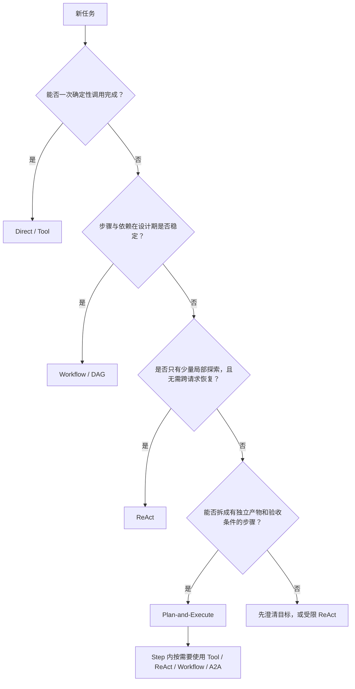

工程上可以先做一个 `ComplexityGate`，命中以下条件中的三个及以上再考虑 Plan-and-Execute：跨两个以上领域、预计五步以上、存在两个以上可并行分支、执行时间可能跨请求、需要审批/断点恢复、各步骤存在独立后置条件。若步骤图固定，仍应优先 Workflow；若只有两三步观察驱动探索，则继续使用 ReAct。

##### `write_todos` 为什么不等于 Plan-and-Execute

| 对比项 | 当前 `deep.New + write_todos` | 真正的 Plan-and-Execute |
|---|---|---|
| 计划格式 | 模型可选择是否写，内容偏自然语言 | 程序要求输出并校验结构化 `PlanSpec` |
| 状态来源 | 模型自行修改 Todo 状态 | Runtime 根据 StepAttempt、ToolResult 和 postcondition 投影状态 |
| 依赖与并行 | 主要靠模型记住顺序 | DAG Scheduler 只调度依赖已满足的 Ready Step |
| 成功判断 | 模型认为完成 | Step Verifier 和 Final Verifier 有否决权 |
| 失败恢复 | 模型在同一上下文继续尝试 | 按错误类型局部重试、等待输入/审批、补偿或 Replan |
| 持久化 | 以当前运行上下文为主 | Plan、Revision、Step、Attempt、Artifact、Evidence 独立持久化，可跨请求恢复 |

##### TCUM-AI 中的推荐设计

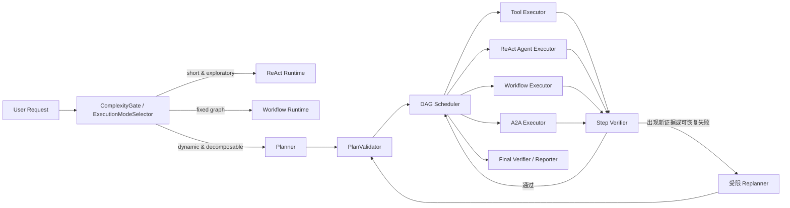

`Planner` 不应持有生产写工具，只能从 Capability Registry 选择可用 Executor，并生成带约束的计划。建议最小数据契约如下：

```json
{
  "plan_id": "plan-123",
  "run_id": "run-456",
  "revision": 1,
  "objective": "为支付服务生成并发布 Grafana 大盘",
  "constraints": {"environment": "prod", "max_steps": 12, "approval_for_write": true},
  "steps": [{
    "id": "validate-promql",
    "goal": "验证各面板 PromQL 的语法、指标存在性和数据健康",
    "depends_on": ["design-panels"],
    "executor": "prometheus_promql_expert",
    "allowed_tools": ["query_metric_metadata", "execute_promql"],
    "postconditions": ["syntax_valid", "metric_exists", "recent_samples_present"],
    "timeout_seconds": 120,
    "retry": {"max_attempts": 2},
    "risk": "read"
  }]
}
```

Runtime 至少需要持久化 `PlanRun / PlanRevision / PlanStep / StepAttempt / Artifact / Evidence / Approval / EffectLedger`。Step 状态不要只有 Todo 的 `pending/completed`，而应覆盖 `pending → ready → running → waiting_input/waiting_approval → succeeded/failed/skipped/canceled/compensated`。Executor 必须返回结构化 `StepResult{status, artifacts, evidence, error_type, retryable}`，而不是一段“我已经完成”的自然语言。

`Replanner` 也不能每执行一步就重新规划；只在后置条件失败、外部事实改变、用户修改目标、预算不足或执行器明确返回不可按原计划继续时触发，并限制 revision 数量。否则 Plan-and-Execute 会退化成更昂贵的 ReAct。

##### 用 Grafana 大盘 Agent 推演一次

复杂大盘是 TCUM-AI 最适合的首个 Plan-and-Execute 试点：目标明确、步骤可验证、部分查询可并行，而且现有 `DashboardSpec + Go Builder` 可以继续作为确定性执行核心。

1. 解析用户目标和环境，缺少服务、集群或数据源时进入 `waiting_input`。
2. 从 CMDB/监控元数据解析资源、拓扑和数据源，产出带证据的 `ResourceContext`。
3. Planner 依据业务目标规划指标族与面板，例如流量、错误、延迟、饱和度、依赖和业务 SLI。
4. 并行验证候选指标、Label、PromQL 语法和最近数据健康；失败只重做对应分支。
5. 汇总为受 Schema 约束的 `DashboardSpec`，由确定性 Builder 生成完整 Grafana JSON。
6. 在写入前做静态校验和权限/风险检查；生产发布进入 `waiting_approval`。
7. 使用幂等 key 写入 Grafana，再通过后端 API 回读 UID、版本、Panel/Query 与渲染状态。
8. Final Verifier 计算指标完整度、PromQL 正确率、指标存在率、数据健康率和渲染成功率；未通过就局部修复，不能直接宣告完成。

这里不是让 Planner 直接生成完整 Grafana JSON，也不是把全部流程写进 Agent 描述。Prompt/Skill 描述“目标、领域原则与如何使用能力”；`PlanSpec` 表达本次任务；Builder、Validator、Scheduler、审批和状态迁移由程序强制执行。

##### 渐进落地与评测

1. 先增加 `ExecutionModeSelector`，只区分 `direct/react/workflow/plan_execute`，并把选择写入 Trace。
2. 以测试空间中的复杂 Grafana 大盘做 A/B：现有 ReAct 对比混合 Plan-and-Execute。
3. 稳定后扩展到跨域故障诊断；高风险变更仍使用固定 Workflow 作为写操作主干。
4. 完成 Checkpoint、HITL、EffectLedger 和取消传播后，再承接数字分身的跨请求长任务。

评测不能只看最终回答分数，还要比较任务成功率、业务 Oracle 通过率、漏步骤率、重复工具调用率、Replan 率、错误完成率、token、P95 时延和人工接管率。只有业务成功率或可恢复性显著提升，才能证明 Plan-and-Execute 的额外复杂度值得。

#### 7.2.2 A2A “握手”不是两个 Agent 互发一句自然语言

可以把可靠委托拆成五步：

1. **发现**：客户端取得 Agent Card，先看协议版本、服务端点、能力、Skill、输入/输出媒体类型和认证要求。
2. **协商**：确认对方是否支持本次需要的 streaming、异步通知或扩展；不支持要在任务创建前 fail loud。
3. **认证授权**：按 Card 声明完成认证，并传递最小化的用户/租户委托身份；“调用方 Agent 有权限”不代表下游可以跳过资源级鉴权。
4. **任务交互**：简单请求可直接返回 Message；复杂请求应创建 Task，通过状态更新、补充消息和 Artifact 增量交付协作。
5. **终态确认**：completed、failed、canceled、rejected 等终态必须和 Artifact/evidence 一起持久化；超时只是客户端观察结果，不应擅自等同任务失败。

TCUM 的 Agent Card 最少应治理这些字段：稳定 `agentId`、owner、版本、endpoint、Skill ID 与清晰边界、示例、input/output mode、streaming/notification 能力、security scheme、风险等级、SLO、兼容期和 card 签名/hash。Card 适合描述**可发现能力**，不应该把内部 Prompt、密钥或敏感拓扑直接暴露出去。

### 7.3 核心设计卡片

| 核心点 | TCUM-AI 当前设计 | 当前问题 | 优先改进 | DSH / CC / Codex 对标 |
|---|---|---|---|---|
| Supervisor 路由 | 启用 Agent 的 name/description 拼入上下文，由 Deep Agent 调 `task` | 未先产出结构化意图；“不调用/调用错/多调用/迟调用”难定位 | 首跳输出多标签 `RouteDecision`；测 Top-1、Recall、Clarification、Unsafe-route、成本；完整 ReAct 再测任务结果 | CC/Codex 的子 Agent 委派强调独立任务和上下文隔离；TCUM 更需要业务路由 Gold Case 和风险代价矩阵 |
| Agent-as-Tool | 多个子 Agent 被折叠进一个 `task` 工具，description 作为子任务输入 | 工具列表看似只有 `task`，内部实际是 Agent 调用；纯文本结果掩盖运行状态 | 将 task call 与 child run 关联；回传 childRunId、status、evidence、artifacts、usage | DSH `ctx.subagents` 把 provider、one-shot/continuable、followup/interrupt/report 和能力协商做成显式 seam，明显更完整 |
| Planning / Todo | Deep Agent 提供 `write_todos`，Todo 写入当前执行状态供模型维护 | 无机制保证先写 Todo；写了也无法保证每项状态真实对应外部结果；它不是 Plan-and-Execute | 引入 ExecutionModeSelector 与结构化 `PlanSpec`；Todo item 绑定 PlanStep/childRun/evidence；只有 postcondition 通过才能 completed | CC 的任务、hooks 和独立子 Agent可组合成更强的执行纪律；DSH Todo 作为持久 SessionEvent，可投影和恢复 |
| 并发与后台任务 | Tool calls 默认并发；通用 Scheduler 有锁/续约；数字分身异步 Run 另有执行日志和心跳 | 默认全并发可能违反业务依赖/限流；数字分身 Executor 异步派发后返回，调度 lease 未覆盖完整 Agent Run；缺统一 Job 注册、取消和孤儿清理 | DAG 声明依赖和并发组；统一 JobManager；用 `(taskID, scheduledAt)` 幂等键与覆盖完整 Run 的 lease/fencing；租户/工具级限流；取消传播与 cleanup | DSH 有 jobs seam、continuable child activation、FIFO inbox 和 child-first disposal；Codex/CC 的并行子任务会话对用户更透明 |
| Checkpoint / Resume | 消息可回放；框架有 CheckPointStore 能力迹象但业务链未接通 | 重启后知道“聊过什么”，不等于知道“外部动作做到哪”；写操作重复风险大 | 在副作用前后持久化 checkpoint；使用 idempotency key；恢复先 read-after-write；必要时 compensation | DSH append-only facts + durable child session 更适合作恢复基础；Codex 的 thread/turn/item 与 rollout 对复现更友好 |
| Stop / Verification | MaxStep、模型自然收敛、部分业务校验 | “模型不再调用工具”不等于任务成功；无独立 verifier 的否决权 | 每类任务定义 completion predicate；危险/高价值任务由确定性 verifier 或隔离验证 Agent判定 | CC Hooks 可在 Stop/Tool 生命周期执行外部规则，且子 Agent可隔离验证；Codex 倾向通过测试、review、approval形成闭环 |

### 7.4 多 Agent 选型结论

> 多 Agent 不是为了“更智能”，而是为了隔离上下文、专长、权限、并发和组织边界。任务没有可并行子问题、没有专属工具/上下文、也没有独立验收条件时，拆子 Agent 只会增加 token、延迟和故障面。TCUM 当前混合选型方向对，真正缺的是统一的执行模式路由、结构化 Plan、子任务契约和协作状态机。

---

## 8. 安全、可靠性、性能与治理层

### 8.1 目标思维导图

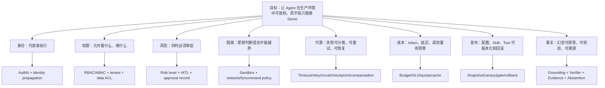

### 8.2 核心设计卡片

| 核心点 | TCUM-AI 当前设计 | 当前问题 | 优先改进 | 对标启示 |
|---|---|---|---|---|
| 身份与租户 | 请求上下文、Twin 信息、部分 Bearer Token；分身可过滤 admin-only 工具 | 用户身份没有完整透传到所有 MCP；AK/SK 选择有启发式逻辑；工具是否做二次鉴权不统一 | 统一 `ExecutionPrincipal{user,tenant,twin,delegation}`；每次 Tool/MCP 调用携带；服务端必须二次鉴权 | CC/Codex 的权限模型明确区分 agent 判断与 OS/宿主强制边界；这比 prompt allowlist 强得多 |
| Tool 风险与 HITL | 有工具过滤、输入校验、`InterruptRerunError` 能力和 CheckPointStore 接口基础 | 尚无统一 read/write/destructive 风险分级和审批闭环 | `ToolManifest.risk`；write-high/destructive 在 pre-execute 触发 interrupt；展示影响面，批准后 resume；审批写审计日志 | Codex 用 sandbox mode + approval policy 明确区分“技术上能做”和“何时必须问”；CC permission 采用 deny/ask/allow 且 deny 优先 |
| Sandbox / Prompt Injection | `skill_exec` 有沙箱环境，部分 allowlist | 不是所有外部内容和工具调用都进入统一隔离；检索内容可诱导模型调用高危工具 | 不可信内容标注来源；Tool Policy 在模型外执行；shell/fs/network/credential 最小权限；结果内容不得提升权限 | CC/Codex OS/容器 sandbox 是更成熟基线；DSH 将 fs/shell/subprocess/sandbox 设计为 seam，便于整体替换执行世界 |
| 可靠性 | 3 层 timeout、工具错误转结果、panic 隔离、未知工具回注、SSE 心跳、调度锁续约 | LLM 服务异常缺系统降级；重试可能重复副作用；A2A idle timeout 60s 对长查询偏短；资源清理不清楚 | 错误 taxonomy；retry 仅限安全错误；写动作幂等；模型 provider circuit/fallback；Job/child/sandbox lease + reaper | DSH 对请求错误、provider retry、取消、Activation 清理和持久事实处理更细；CC/Codex 对后台任务状态更可见 |
| 性能与成本 | 紧凑结果、截断/COS、渐进披露、Skill cache、并发 Tool、Langfuse 噪音过滤 | 只有局部优化，无法回答某类任务成本为何上升；并发可能放大下游压力 | 每个 Run 记录 prompt/tool/result/compaction/subagent token 与时延；定义 task-class budget；缓存必须含版本和权限 key | Codex Skill 初始清单有显式上下文预算；DSH token pressure/compaction policy 更统一 |
| 配置与发布 | Agent 的描述、协议、模型和关联配置可来自 DB，AgentManager 支持热更新，Skill 有本地/COS/DB 来源；但 Agent 构建器、工具逻辑、固定 Workflow 与中间件仍在代码中，不能说“子 Agent 和执行流程全在数据库” | 热更新扩大漂移风险；DB、Skill 仓、镜像代码和知识库缺完整 snapshot、依赖锁定、灰度和自动回滚 | 不直接发布“一个 prompt”：发布 `AgentSnapshot`；配置 diff + compatibility check + offline eval + shadow/canary + rollback | DSH profile/bundle/patch 可打印最终组合树；Codex/CC 用受控项目文件、Skill/Plugin 包化，更容易代码评审和版本化 |
| 幻觉与事实校验 | 指标元数据用 ES8 混合检索；`ListMetricLabels` 查在线 Label；`ValidateAlarmConfig` 校验指标与条件；`GenerateAlarmPromQL` 交后端生成；`AlarmPromQLAnalysis` 做历史回放；阈值由统计特征收敛 | RAG 未设拒答阈值且不透传 score；“强制校验”主要依赖 Tool 描述；数值结论、子 Agent 文本和压缩摘要缺统一证据契约 | 权威实体候选 + 拒答阈值 + typed `Evidence/Claim`；用代码状态机强制 validate/simulate/approve/read-back；无证据禁止强结论 | 可编译/可测试产物的反幻觉强度最高；SRE 需自建 metric/alarm/topology 业务 Oracle 和 claim-evidence Gate |

### 8.3 幻觉治理：从“少猜”到“猜错也不能执行”

Agent 幻觉比普通问答更危险：它不仅会编造文本，还可能编造实体、指标、Label、PromQL、数值和“已执行成功”。治理目标不是承诺幻觉归零，而是让它**尽量不产生、产生后可检测、检测后不能落到副作用，最终可溯源和回归**。

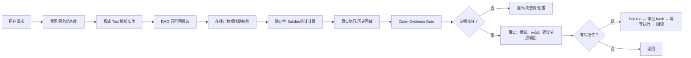

| 幻觉类型 | TCUM-AI 场景 | 现有防线 | 应补的强制门禁 |
|---|---|---|---|
| 实体/指标幻觉 | 编造 tenant、`mStackCode`、`metricFullName` | `FindMetrics` 从 TCUM 元数据索引召回，tenant 做 stack 过滤 | 返回 score/source/freshness；设最低分；选中后 CAPI 精确回读；配置查询失败时 fail-closed |
| Label/参数幻觉 | PromQL 使用不存在的 Label，或时间/地域错 | `ListMetricLabels`、Tool JSON Schema、参数校验 | 候选集成员校验；字段依赖和跨字段业务规则放到代码，不仅是 Prompt |
| 查询/配置幻觉 | PromQL 语法正确但语义错，告警 JSON 指标不存在 | 后端 `GenerateAlarmPromQL`、`ValidateAlarmConfig`、`AlarmPromQLAnalysis` | 用状态机强制 `draft→validate→simulate`；draft hash 变化必须重验 |
| 数值幻觉 | Tool 空结果却回答“CPU 92%” | Prometheus/CMDB/告警工具提供真实数据；阈值服务用分位数/std/IQR | typed `Evidence{id,source,query,time,hash/ref}`；具体数值必须指向 evidence；空结果不得写成“无异常” |
| 因果/汇总幻觉 | 发布、CPU 与 throttling 时间接近，主 Agent 直接断言因果 | 多 Agent 可分域取证，但返回多为文本 | 子 Agent 返回 typed Artifact；事实/推断/未知/建议分栏；冲突重新取证，不用多数投票判事实 |
| 执行幻觉 | 只生成告警配置却声称“已创建” | 当前批量告警写工具尚未开放，暂时缩小了风险 | 写操作必须 `plan→approve→apply→read-back`；只有回读到规则 ID/版本才能声称成功 |

工程上用一条可执行原则统一：**模型提候选，检索给依据，Tool 取事实，代码做计算与校验，审批控制副作用，回读确认结果**。不应解析 `reasoning_content` 作为业务事实或执行条件。

专项验收指标至少包含：`Entity Exact Match`、`Retrieval Recall@K`、`Tool/Argument Accuracy`、`Unsupported Claim Rate`、`Numeric Consistency`、`Evidence Correctness`、`Abstention Accuracy`、`Unapproved Side Effect=0`。硬事实由程序/Mock 后端判分，LLM Judge 只评语义完整性和表达，不单独裁定事实正确性。

### 8.4 安全演进的正确优先级

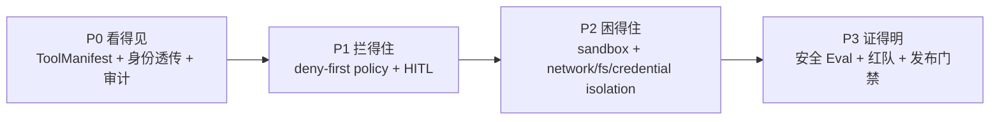

不要先做一个“安全 Prompt”。Prompt 可以帮助模型做正确判断，但无法成为越权后的最后边界。

---

## 9. 人机协同、Agent 通信、故障恢复与稳定运行

这一节不要背协议名词，要回答四个生产问题：**人如何看见并改变执行；Agent 如何发现和委托另一个 Agent；连接断了以后任务事实还在不在；任何一层失败后能否安全恢复。**

### 9.1 先分层：A2A、AG-UI、SSE、MCP 不是同一种东西

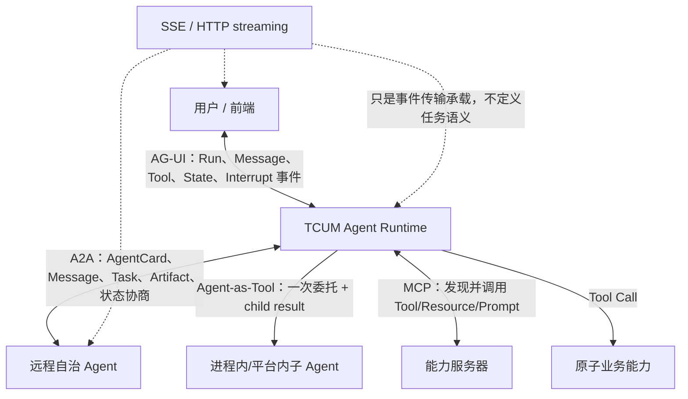

| 机制 | 本质 | 最适用的边界 | 是否有自治任务生命周期 | TCUM 当前用法 | 不能混淆的点 |
|---|---|---|---|---|---|
| Agent-as-Tool / Deep `task` | 主 Agent 把自然语言子任务当作一次工具调用，子 Agent 在隔离上下文执行并返回 | 同一平台内、单次委托、父 Agent 仍拥有总控制权 | 当前主要由父 Run 隐式承载 | Deep Agent 和动态总入口的主要协作方式 | 工具列表里只有 `task`，不代表只有一次普通 Tool；内部可能是完整 child ReAct |
| Transfer / Handoff | 对话或流程控制权从当前 Agent 转给目标 Agent | 责任主体需要真正切换、后续用户直接和目标 Agent 交互 | 由编排框架状态承载 | Eino 有 `TransferToAgent` 等能力，TCUM 统一入口并非主要用这条 | 委托一项工作与转移整个会话责任不是一回事 |
| A2A | 跨 Agent/团队/部署边界的发现、消息、任务状态和 Artifact 协议 | 远程自治 Agent、长任务、独立 owner/SLO | **有**：Task 有 submitted/working/input-required/completed/failed/canceled/rejected 等状态 | TCUM 同时提供 A2A Server，并可包装远程 A2A Agent | AgentCard 是能力发现与协商入口，不是鉴权成功本身；A2A 也不替代业务权限 |
| AG-UI | Agent 后端与用户界面之间的事件契约 | 流式文本、Tool 过程、共享状态、用户中断与继续 | 有 Run/Step 生命周期；新版 interrupt 可表达暂停与恢复输入 | TCUM 主交互协议，也被务实地适配成远程子 Agent 客户端 | 它首先是 Agent↔UI 协议；拿它做 Agent↔Agent 适配可行，但任务状态和异步能力弱于 A2A |
| MCP | Host/Client 发现并调用 Server 暴露的 Tool/Resource/Prompt | 给 Agent 提供原子能力和上下文 | **没有自治 Agent 的 Task 生命周期** | 静态/动态 MCP Consumer、Eino→MCP Provider、CAPI MCP 化 | MCP Server 通常是能力服务器，不等于会自主规划、协商和持续执行的 Agent |
| SSE | HTTP 上的单向增量事件帧 | 浏览器/客户端持续接收进度，文本协议便于调试 | **没有**；需要上层协议定义状态 | AG-UI 服务端写 `data: JSON\n\n` 并 flush；A2A streaming 也可使用流式承载 | SSE 不自动提供幂等、ack、断点续传、业务重放或任务恢复 |

### 9.2 A2A：发现、协商、委托、状态与 Artifact

A2A 的“握手”应当被解释为一条协议协商链，而不是两个 Agent 用自然语言互相介绍：

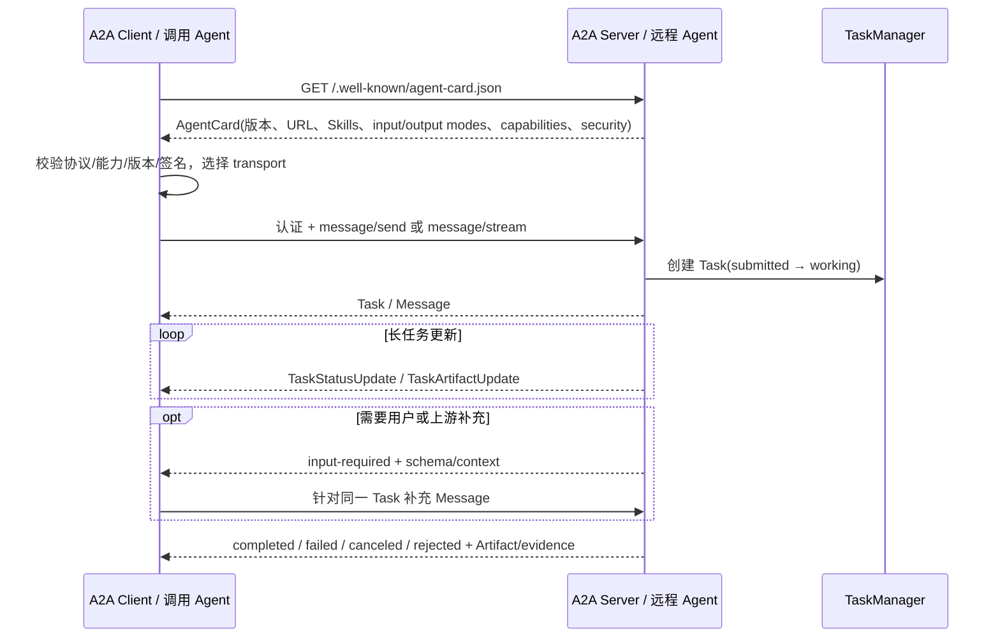

官方 A2A 规范把 `Task` 定义为有状态工作单元；复杂任务可以用 polling、streaming 或 webhook 获取更新，AgentCard 的 streaming/push 等 capability 必须在调用前匹配。TCUM 当前 `createA2AServer` 构造 `A2AMessageProcessor`、内存 TaskManager 和 AgentCard；请求 metadata 会注入 `agent_config`、Tool 结果开关以及包含 MCP Header 的 `ExecutionContext`。流式执行创建 Task、订阅更新，并每 15 秒发送一次 `working` 心跳。

**AgentCard 最佳实践**：

- 用稳定 `agentId`、owner、版本、endpoint 和兼容期表达“谁负责、怎么升级”，不要只填展示名称。
- Skill 描述写清正向边界、反例、输入/输出 mode、示例和风险等级，让路由器可判别，而不是堆营销文案。
- capability 必须和真实实现一致；不支持 streaming、push、extended card 就不要声明。
- security scheme 只描述认证方式，不放密钥；资源级授权仍由服务端执行。公开 Card 不泄露内部 Prompt、拓扑和敏感工具。
- 对 Card 做 schema 校验、签名/hash、缓存 TTL 和兼容性测试；调用端 fail loud，不要遇到不支持能力时静默降级。

**TCUM 当前的 P0 错误语义问题**：`processStreamingEvents` 遇到 `event.Err` 时只记录日志并 `break`，随后 `finalizeStreamingTask` 无条件把 Task 标记为 `completed`；下游流读取失败也只记录日志。于是“连接中途失败/Agent 出错”可能被协议层对外声明为成功。修复不能只是多打一条日志，而应让终态由真实执行结果决定：捕获 terminal error/cancel，分别写 `failed/canceled/completed`，保存失败 evidence 和最后成功 artifact，并为流错误、取消、部分 Artifact 增加状态机测试。

### 9.3 AG-UI 与人机协同：不只是把字流到前端

AG-UI 的核心抽象是 `run(input) → event stream`。官方事件包含 Run、Step、Text、Tool、State 等类型；新版 interrupt 语义要求暂停前发出恢复所需的 state/message snapshot，再用带 interrupt outcome 的 `RunFinished` 表达等待输入。人机协同可按成熟度分六层：

| 层级 | 人能做什么 | 前端/协议必须显示什么 | 运行时必须保存什么 | TCUM 现状 |
|---|---|---|---|---|
| L1 可见 | 看实时回答和阶段进度 | Run/Step/Message/Tool 事件、耗时 | runId、threadId、事件顺序 | 已有流式事件和 Tool 过程 |
| L2 澄清 | 补充目标、范围、时间和对象 | 明确的 `input_required` 及输入 schema | pending question、候选意图、超时 | 多靠模型继续提问，未形成统一结构 |
| L3 审批 | 批准/拒绝高风险动作 | 动作参数、影响面、风险、回滚方案 | interruptId、policy decision、审批人、快照 | Eino 有 interrupt/resume 基础，业务闭环未完成 |
| L4 纠偏 | 在执行中修改约束或停止某个子任务 | 当前 plan、可取消节点、修改影响 | revision、cancel token、childRun 关系 | 可通过客户端断开触发取消，但缺 step 级 steering |
| L5 接管/恢复 | 人工处理后让 Agent 从安全点继续 | checkpoint、已完成/未知副作用、resume 入口 | durable checkpoint、effect ledger、幂等键 | 框架接口存在，应用没有端到端 Resume |
| L6 反馈/申诉 | 对结果、证据和评分纠正 | 证据引用、评分项、反馈入口 | feedback、case 候选、标注者一致性 | Langfuse/Eval 有基础，未闭环到数据集和发布 |

TCUM 的 AG-UI Runner 已有两个不错的可靠性设计：一是 panic、Agent 事件错误、translator 错误和 context cancel 都尝试转成 `RunError`，避免 SSE 静默关闭；二是客户端断开后，主链路用独立 5 秒 context 保存消息与事件，再用独立 10 秒 context 更新摘要和 Skill Cache，避免原请求 context 取消后对话历史一起丢失。

但当前 `handleActionEvent` 把 Eino 的 `Interrupted` 动作翻译为普通 `RunFinished`，而 `runAgentInputHook` 仍是预留空实现。这意味着“框架里出现了 interrupt”不等于“前端获得审批请求并能携带 checkpoint 恢复”。应增加显式 interrupt event/outcome、结构化表单、审批策略、超时/撤销、resume token 和审计记录；恢复后建立新的 runId，并关联 parentRunId/checkpointId。

### 9.4 SSE：工作原理、使用方式与生产边界

SSE 是一个长连接 HTTP 响应：服务端设置 `Content-Type: text/event-stream`，持续写入以空行分隔的事件帧并 flush；浏览器原生 `EventSource` 通常用于 GET，TCUM/AG-UI 的 POST 流则由 HTTP 客户端自行解析。它天然适合 Server→Client 的文本增量推送，用户的新输入、批准、取消通常通过另一条 HTTP 请求回到服务端。

| 问题 | SSE 自己提供什么 | 应用层还必须做什么 | TCUM 当前事实 / 缺口 |
|---|---|---|---|
| 顺序 | 单条 TCP 连接内按字节顺序到达 | 为事件增加 `seq/eventId`，检测缺口 | 事件有 run/thread 信息，但未见完整可重放序号体系 |
| 保活 | 可发送 comment/event 作为 heartbeat | 区分连接活性与任务活性；配置代理 idle timeout | A2A 每 15 秒 working；AG-UI 客户端有 idle timeout reader |
| 断线重连 | 标准 EventSource 可携 `Last-Event-ID` | 服务端持久事件并从 cursor replay；POST 流需自行实现 resume | 当前主要依赖请求重跑/历史落库，不等于精确续传 |
| 送达语义 | 没有业务 ack 和 exactly-once | 幂等消费、去重、terminal event 校验 | 客户端收到 HTTP 200 不能代表 Run 成功 |
| 反压 | TCP 有基础流控 | 限制单事件大小、队列、慢消费者、连接数 | AG-UI parser buffer 最大 100MB，channel 100；A2A subscriber buffer 很大，需容量治理 |
| 错误 | 连接关闭只说明传输结束 | 必须发送 `RunError`/failed Task 并持久化真正终态 | AG-UI 较完整；A2A 当前存在错误后误标 completed 的 P0 |
| 安全 | HTTP/TLS/CORS 基础 | 鉴权、租户隔离、敏感事件脱敏、CSRF/CORS 策略 | SSE Server 当前允许 `Access-Control-Allow-Origin: *`，生产需结合认证域收紧 |

AG-UI 客户端解析器使用 `bufio.Scanner`，最大事件可到 100MB；单个无法解析的 AG-UI event 当前会被静默跳过。生产上至少应为 malformed event 记录 metric、runId、上游 agent 和截断样本，对终态/状态事件解析失败应直接令 Run 失败，连续错误达到阈值应熔断，而不是继续制造“缺事件但看似成功”的轨迹。

### 9.5 故障恢复：恢复的不是一句回答，而是“事实 + 副作用”

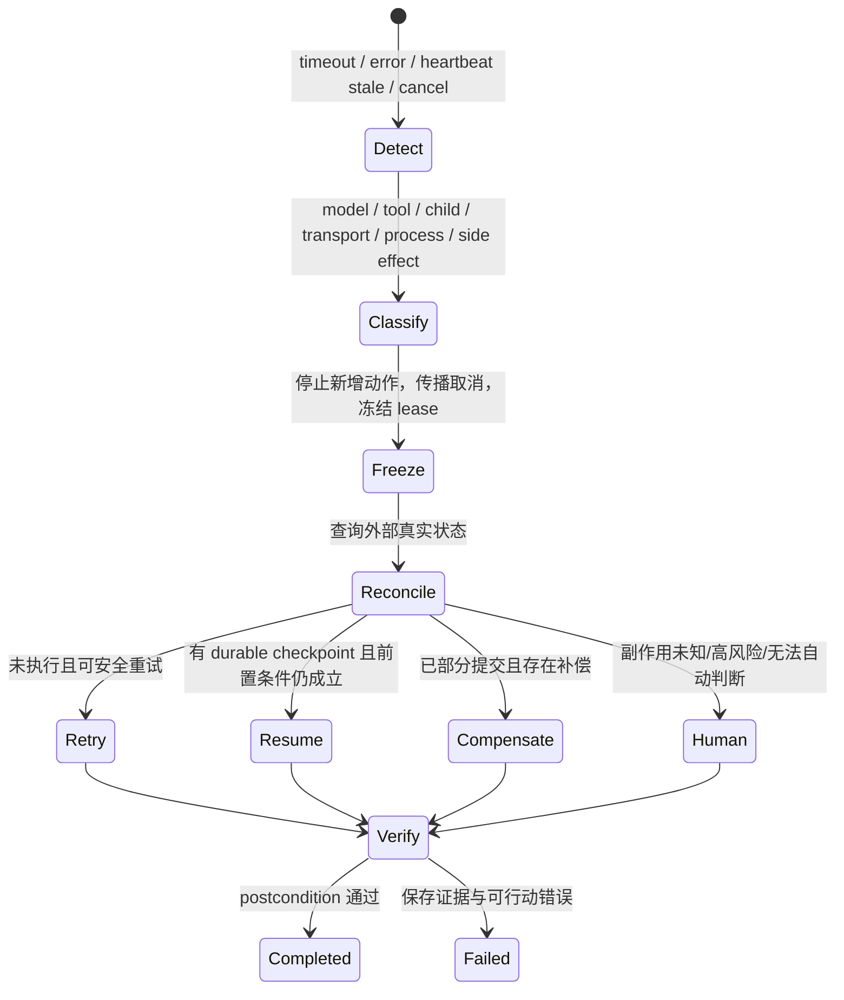

| 故障层 | 典型例子 | 可以自动重试的条件 | 恢复机制 | 必须避免 |
|---|---|---|---|---|
| Model | 限流、5xx、context limit、无效结构输出 | provider 明确可重试，或尚未产生 Tool 副作用 | backoff+jitter、fallback model、压缩、schema repair、预算限制 | 无上限重试、切模型后不记录行为差异 |
| Tool | 参数错、查询超时、写入响应丢失 | 读操作或有幂等键；effect state 已知 | 类型化错误、参数修复、read-after-write、circuit breaker | 把所有错误转文本后完全交给模型猜 |
| Child Agent | A2A idle、AG-UI RunError、部分 Artifact | child task 可查询且未到终态 | polling/subscribe、cancel propagation、typed child result、部分结果保留 | 父 Agent 超时就假设下游一定失败并重复提交 |
| Transport | SSE 断线、代理 idle、malformed event | 事件有 cursor 且服务端可 replay | eventId/seq、heartbeat、resume subscription、终态核对 | 把连接关闭等价为任务 completed/failed |
| Process | 服务重启、worker 崩溃、孤儿 goroutine | 有 durable checkpoint、lease 和 owner fencing | heartbeat、stale scan、lease/fencing token、reaper、从 checkpoint 续跑 | 两个实例同时恢复同一写任务 |
| External side effect | Grafana 已创建但响应丢失、变更执行一半 | 幂等 key 或能唯一查询外部对象 | effect ledger、read-after-write、补偿、人工接管 | 盲目重放写调用造成重复或扩大事故 |

一个可运营的错误对象至少需要：`error_code`、`category`、`stage`、`retryable`、`effect_state(not_started/unknown/partial/committed)`、`cause`、`evidence`、`user_action`、`runId/stepId/toolCallId`。TCUM 的 Tool Error Middleware 会把大多数 Tool 错误转换成 `[TOOL_ERROR]` 文本，让模型修参数或对瞬时错误重试一次，并把 interrupt、cancel、deadline 透传；这个设计提升了自修复能力，但“是否可重试”和“同工具失败几次”仍依赖文本指导，应该下沉成代码里的错误类型和 Retry Policy。

数字分身执行协程每 5 秒更新一次 execution heartbeat；运行期每 5 分钟扫描一次，并把超过 2 分钟无心跳的 `running` 日志条件更新为 failed，同时写入“中断”原因。`RecoverInterruptedTasks` 这个命名容易让人误解：它解决的是**失活检测和终态清理**，并没有从某个 Step 恢复执行。真正 Resume 还需要 durable checkpoint、输入/版本快照、覆盖完整 Agent Run 的 lease/fencing、外部副作用对账、幂等和补偿。

### 9.6 稳定运行要建设七层防线

| 层 | 关键机制 | TCUM 已有 | 主要缺口 | 建议 SLI/SLO |
|---|---|---|---|---|
| 入口与容量 | auth、quota、rate limit、queue、load shedding | HTTP 接入和部分身份上下文 | 租户/Agent/Tool 级配额和过载降级 | 接受率、排队时延、429/拒绝率 |
| Loop 预算 | step/token/time/tool/subagent budget、停止条件 | MaxStep、多层 timeout、Token Counter | 预算未统一，completion predicate 不普遍 | Run 成功率、超预算率、无效 step 比例 |
| 依赖隔离 | bulkhead、circuit、fallback、health probe | HTTP transport timeout、部分错误处理 | 模型/MCP/外部 Agent 熔断和分区隔离不足 | 依赖错误率、熔断时长、降级成功率 |
| 状态与恢复 | event log、checkpoint、lease、idempotency、compensation | 消息历史、调度锁、stale task 标记 | 无统一执行事实和端到端 Resume | 恢复率、重复副作用率、RTO/RPO |
| 协议可靠性 | heartbeat、cursor/replay、terminal state、cancel | A2A heartbeat、AG-UI RunError | A2A 终态错误、SSE replay、协议一致性 | 断流率、漏终态率、重连恢复率 |
| 可观测与值班 | metrics/log/trace、error budget、告警、runbook | Langfuse、AG-UI Trace、业务日志 | 运行事实分裂、按任务类别 SLO 不足 | P95/P99、成功率、错误预算消耗 |
| 质量与发布 | snapshot、offline eval、shadow/canary、rollback、chaos | Eval Runner 和热更新控制面 | 评测尚未门禁，缺故障注入演练 | 回归数、灰度回滚率、故障演练通过率 |

**稳定性不是“多重试几次”**。设计顺序应是：先定义成功与错误语义，再保证副作用可识别和幂等，然后才谈重试、恢复和降级；最后用故障注入验证模型超时、Tool 半成功、A2A 断流、服务重启、用户取消和审批超时六类场景。

### 9.7 本节源码证据与权威协议入口

- A2A Server、TaskManager、心跳和流式终态：`/Users/yaao/Documents/code/tcum-ai/pkg/agent/manager.go`
- AG-UI Client、HTTP 连接池和 idle timeout：`/Users/yaao/Documents/code/tcum-ai/pkg/agui/client/client.go`
- AG-UI SSE 解析：`/Users/yaao/Documents/code/tcum-ai/pkg/agui/client/parser.go`
- AG-UI Runner 的 panic/cancel/error：`/Users/yaao/Documents/code/tcum-ai/pkg/agui/eino-agui/runner/runner.go`
- AG-UI SSE 写出：`/Users/yaao/Documents/code/tcum-ai/pkg/agui/eino-agui/service/sse/sse.go`
- 断连后消息/摘要/Skill Cache 持久化：`/Users/yaao/Documents/code/tcum-ai/usercases/agent_access/service/agent_service.go`
- Tool 错误回注：`/Users/yaao/Documents/code/tcum-ai/pkg/agent/tool_error_handler_middleware.go`
- 数字分身心跳和 stale task 处理：`/Users/yaao/Documents/code/tcum-ai/usercases/agent_access/service/digital_twin_service.go`
- 协议资料：[A2A 官方规范](https://a2a-protocol.org/latest/specification)、[AG-UI 架构](https://docs.ag-ui.com/concepts/architecture)、[AG-UI Events](https://docs.ag-ui.com/sdk/js/core/events)、[AG-UI Interrupts](https://docs.ag-ui.com/concepts/interrupts)、[WHATWG Server-Sent Events](https://html.spec.whatwg.org/multipage/server-sent-events.html)

---

## 10. 可观测、评测与自进化层

### 10.1 目标思维导图

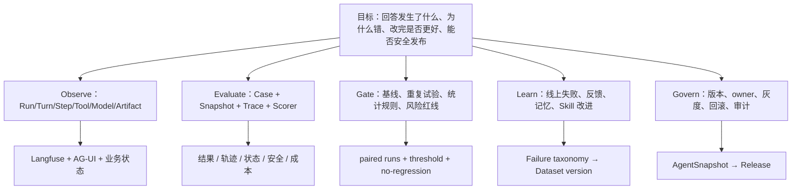

### 10.2 Agent 可观测体系：监控负责发现，Trace 负责定位

参考 CodeBuddy 在 TCUM 监控中的组织方式，Agent 平台不能只建设一张“接口成功率”大盘，而应按 **业务结果 → Agent 执行 → 模型与 Tool 依赖 → 上下文 → Scheduler/基础设施** 分层。Metrics 用于发现群体性异常和触发告警，Trace 用于下钻单次 Run，Log 用于检索与审计，Eval 才负责判断结果是否正确；四者不能互相替代。

| 监控层 | 核心 SLI | 主要回答的问题 |
|---|---|---|
| 业务结果 | 任务量、任务完成率、端到端 P95/P99、超时/取消、人工接管与采纳 | 用户任务是否真正完成，而不只是 HTTP 返回成功 |
| Agent 执行 | 执行轮数、Tool 次数、子 Agent 成功率、MaxStep 终止率 | Agent 是否按预期规划、调用能力并稳定收敛 |
| 模型与 Tool | 成功率、TTFT、P95/P99、429/5xx、Token/TPM、重试成功率 | 模型供应商和外部能力是否稳定，失败集中在哪个依赖 |
| 上下文 | 窗口占用率、压缩次数与压缩比、大结果外置率、超限重试率 | 长链路是否因上下文膨胀而丢失信息或失败 |
| 调度与基础设施 | Active/Running/Pending、队列积压、投递、锁续期、DB 同步、CPU/内存 | 后台任务和平台资源是否出现饱和、重复或失活 |

CodeBuddy 大盘已经体现了这种分层：对话场景关注成功率、状态码、QPS 与 TTFT；LLM 层关注模型/流式成功率、限频、P90/P95、输入输出 Token、TPM、并发与缓存；Scheduler 层关注活跃/运行任务、队列积压、执行与投递成功率、耗时、跳过原因、熔断、锁和 DB 同步。TCUM-AI 应复用这一框架，并增加执行轮数、子 Agent、上下文压缩、大结果外置和 Skill 回归等 Agent 特有指标。

当前源码已有 `pkg/monitor` 向 VictoriaMetrics 推送指标，`agent_access` 记录对话、消息、任务、Agent 耗时、数字分身和运行中任务，MCP 统一记录 Tool 调用成功/失败，Eino Callback 接入 Langfuse。主要缺口是模型和上下文指标、Tool 时延与错误分类、端到端 SLO 以及 Metric→Trace 下钻尚未完整统一。

告警应按影响分级：P0 关注核心任务完成率和端到端可用性；P1 关注模型/Tool 错误、429、队列积压和上下文超限；P2 关注 Token 成本、无效轮数和评测回归。指标标签只保留 `scene/agent/skill/model/tool/status/version` 等低基数维度，`user/session/traceId` 放入日志或 Trace，避免 VictoriaMetrics 标签基数失控。

### 10.3 当前评分流程应怎样定位

```mermaid
flowchart LR
    A["DatasetVersion<br/>Case + Environment"] --> B["AgentSnapshot<br/>Model + Prompt + Skill + Tool + MCP"]
    B --> C["Trial 执行完整 ReAct"]
    C --> D["AG-UI Trace + Final Output + External State"]
    D --> E1["确定性 Scorer"]
    D --> E2["业务 API Scorer"]
    D --> E3["LLM Judge"]
    D --> E4["人工抽检"]
    E1 --> F["ScoreCard + Failure Labels"]
    E2 --> F
    E3 --> F
    E4 --> F
    F --> G["与 Baseline 配对比较"]
    G --> H["门禁 / 灰度 / 回滚"]
    H --> I["线上失败回灌"]
    I --> A
```

当前源码已经有 `Suite → Trial → AGUI Trace → Score` 主干：现阶段 Scenario 主要围绕固定 Harness 中的目标 Skill 做对比，Trial 要等完整 ReAct 执行结束后才触发评分；Skill 在一次运行中可能引导多个 tool call、`skill_exec` 或子 Agent，所以 Trace 中出现工具调用列表是合理的，并不等于“一个 Skill 只能调用一次工具”。Trace 来自 AG-UI SSE 解析，不是从 Langfuse 回读。

当前的 Baseline Skill 是评测配置显式指定的对照 Skill，**不天然等于被测 Skill 的上一个版本，也不是平台预置的唯一基线**。目标形态应当把 baseline 冻结成完整 `AgentSnapshot`，否则只换 Skill、但模型、Prompt、工具或环境也变了，分数仍不可解释。因此它的准确定位是 **Eval Runner**，还不是成熟的质量准入系统。

### 10.4 核心设计卡片

| 核心点 | TCUM-AI 当前设计 | 当前问题 | 优先改进 | 对标启示 |
|---|---|---|---|---|
| 可观测 | Eino Callback 接 Langfuse；AG-UI 输出用户可见事件；请求可附 trace metadata | Langfuse 组件 trace、AG-UI 事件和真实业务状态没有统一 ID/Step；历史入口 handler 过滤策略不一致 | 统一 Run/Step/Item ID；模型、工具、子 Agent、artifact、外部状态共用 trace graph；指标按任务类型聚合 | DSH 以 session event 同时服务模型历史、UI、持久化、回放和 telemetry，一源多投影更一致 |
| Case 集 | 当前 case 能驱动评测执行 | 来源、覆盖、版本、数据泄漏和环境契约还不完整 | 来源配比：线上失败/人工标注/规则组合/边界生成/红队；去重分层；train/dev/test/holdout；case 带 setup/teardown/oracle | Codex 的可重放 rollout 思维和 DSH replay provider 可帮助建立确定性复现；不要只手写 happy path |
| Scorer | 内置工具序列 LCS、关键词、schema、时延、Token；custom scorer 可扩展 | 工具名列表不能证明业务正确；LLM Judge 未校准；scorer skill 当前包形态和强制执行契约仍需补齐 | 优先确定性 oracle：语法、指标存在、后端状态、渲染、数据健康；再用 Judge 评解释质量；scorer 输出 evidence 和 error code | CC Hooks 展示了把外部校验放在生命周期边界的价值；DSH typed event 让 scorer 更容易消费稳定轨迹 |
| Agent Eval | 能跑完整 ReAct 并收集 trace | 当前名字和入口容易让人误以为“只能测一次 Skill 工具调用”；运行 snapshot 不够完整 | 同一 Runner 支持 Skill/Tool/Agent/Model 四类 target；Agent 同时评路由、轨迹、结果、状态、安全、成本 | Codex/DSH 的回放和状态事实更适合做轨迹断言；TCUM 的优势是可用真实 Grafana/Prometheus/CMDB API 做业务 oracle |
| 统计门禁 | 有目标与 baseline 执行概念、加权得分 | baseline 语义、重复次数、显著性、风险红线和发布集成不足 | 默认被测版本 vs 明确 snapshot baseline；同 case 配对重复；均值/分位数/失败率；安全和副作用一票否决 | 开源 harness 给的是可复现基础；TCUM 必须自己补 SRE 业务门禁，不能期待通用框架代替 |
| 自进化 | 有长期记忆字段、Skill 更新、多种 Trace 和用户反馈资产雏形 | 没有从失败自动生成候选 Case/规则，再经审核、评测、发布的闭环 | `Trace cluster → root cause → patch candidate → eval → human review → canary → monitor`；记忆和 Skill 都要可撤销 | Codex 官方把 memory 视为可选 recall，强规则放受控文档；DSH 插件可逆副作用适合灰度/卸载；CC Hooks 可强制验证停止条件 |

### 10.5 Grafana Agent 的完整评测落点

以“为服务生成 Prometheus Grafana 大盘”为例，不能只设计 case 和一个总分 scorer，还要设计下面八类实体：

| 实体 | 应包含什么 | 典型验收 |
|---|---|---|
| Case | 用户目标、业务对象、时间范围、预期指标族、风险约束 | 覆盖基础资源、服务指标、错误、延迟、容量和业务指标 |
| Environment Fixture | 指标元数据快照、Prometheus 回放/测试租户、Grafana 测试空间 | 同一次 A/B 评测看到同一数据世界 |
| AgentSnapshot | Model、Prompt、Skill、Tool、MCP、Builder、知识库版本 | 历史分数可解释、可复跑 |
| DashboardSpec Contract | 面板、变量、查询、单位、聚合、布局、datasource | JSON Schema + 语义规则均通过 |
| Execution Trace | Route、Skill、Tool args/results、Builder artifact、API response | 每个结果能关联证据，错误能定位到 step |
| Oracle / Scorer | 指标完整度、PromQL 语法、指标存在、数据健康、Grafana 回读、渲染、可读性 | 硬规则优先，LLM 只评价解释和体验 |
| Risk Policy | 写入测试目录、禁止覆盖生产、幂等 key、cleanup | 重复运行无脏数据，失败可清理 |
| Release Gate | 与 baseline 配对、关键项零失败、综合分阈值、P95 时延/成本 | 未达标不得发布；灰度异常自动回滚 |

建议评分不要简单平均：

```text
硬门禁：PromQL 可解析 ∧ 指标存在 ∧ Grafana 对象存在 ∧ 可回读/可渲染 ∧ 无越权写入

通过硬门禁后：
quality = 0.30 × 指标覆盖
        + 0.20 × 查询语义正确
        + 0.15 × 数据健康
        + 0.15 × 面板可读性
        + 0.10 × 证据与解释
        + 0.10 × 成本与时延
```

这能体现一个重要工程原则：**结构正确、业务正确、安全正确不是可以被“文案写得好”抵消的软分。**

---

## 11. 四方对标总图：谁在哪些问题上更强

### 11.1 不按“谁最好”，按设计目标比较

| 维度 | TCUM-AI | DSH | Claude Code | Codex | TCUM 应借鉴什么 |
|---|---|---|---|---|---|
| 首要目标 | 统一运维领域 Agent 底座 | 可组合、可替换的通用 Agent Harness | 高完成度 coding agent 产品 | 事件化、可控的 coding agent/runtime 产品与开源实现 | 不抄场景，抄机制；保留自己的 SRE 数据与 SOP 优势 |
| 领域 Grounding | **最强项**：监控、CMDB、Grafana、巡检、变更等内部资产 | 通用框架，不自带企业 SRE 数据 | 代码仓/终端工作流强 | 代码仓、工具和协作工作流强 | 把领域资产做成有版本和评测的 capability，而不只是接入数量 |
| 运行时事实 | 消息、AG-UI、Langfuse 分散 | **强**：append-only SessionEvent、projection、replay | 官方文档暴露丰富生命周期，但内部事实模型不可完整源码核验 | **强**：Thread/Turn/Item 和 rollout 思维 | TCUM 优先补统一 Event/Step 模型 |
| 插件化 | Eino 中间件 + 自研 Manager/Backend | **最强**：Cordis 插件树、typed event、reversible effects、provider seam | Skills/MCP/Hooks/Subagents/Plugins 分层明确 | Skills/MCP/Hooks/SDK/App Server 分层明确 | 从“很多扩展点”升级为“稳定 capability seam + manifest” |
| Tool 治理 | 并发、截断、错误中间件较强；权限元数据弱 | **强**：完整工具策略和执行流水线 | **强**：Permission + Hook + Sandbox | **强**：Sandbox + Approval + Network control | `ToolManifest + Policy Engine + HITL + Sandbox` |
| Skill | 四 Backend、渐进披露、`skill_exec`、会话 cache | 有 Skill/tool 插件，强调可组合 | **强**：与 CLAUDE.md、MCP、Subagent 分层 | **强**：官方渐进披露、初始描述预算、脚本/资源包 | TCUM 补 manifest、依赖锁定、路由与执行回归 |
| MCP | Consumer/Provider 双向、CAPI MCP 化、动态注入 | 可作为 capability provider/consumer 组合 | MCP 延迟加载、权限和插件分发成熟 | MCP 配置、server、permission metadata 产品化 | 补身份传播、连接状态、schema hash、fail-fast/降级一致性 |
| Context | **项目亮点**：七层压缩和场景化优化 | **强**：token pressure、compaction 与 tool pruner、可回放替换 | **强**：always-on/on-demand/isolated context 分层 | **强**：typed fragments、budget、compaction、外部化 | TCUM 补统一预算、流式自愈、可恢复 provenance |
| Memory | 会话摘要 + memory 表/MCP，闭环未完成 | 强短期事实/恢复，不自动等同语义记忆 | CLAUDE.md + auto memory，用户可见可控 | local memory + AGENTS.md 强规则分层 | TCUM 把“压缩、知识、记忆、规则”彻底分开 |
| Multi-Agent | 混合形态丰富、领域路由强 | **最强工程抽象**：多 provider、one-shot/continuable、followup/interrupt/report | **强产品形态**：隔离 subagent、agent teams、worktree、独立权限 | **强协作可见性**：并行 subagent thread、摘要回主线程 | 补 typed child result、mailbox/job、取消和恢复语义 |
| Planning | `write_todos` + Skill SOP | Todo 持久事件、workflow/jobs seam | Tasks/Hooks/Subagents 组合较成熟 | 计划、子任务和验证工作流较成熟 | Todo 必须绑定真实 step/evidence，复杂 SOP 下沉 DAG |
| 安全 | **主要短板**：点状过滤，缺统一 HITL/sandbox | provider seam 便于隔离，工具 policy 较完整 | **很强**：deny-first permissions、sandbox、生命周期 hooks | **很强**：OS/容器 sandbox、approval、默认网络限制 | 安全必须模型外强制，不能只靠 prompt |
| 可观测/回放 | Langfuse + AG-UI，但事实不统一 | **最强**：事件源支撑 UI/持久化/回放/telemetry | 产品可观察性强；公开源码边界有限 | rollout/事件对复现和客户端展示友好 | 建 one event source, many projections |
| Eval | 有真实业务执行和 scorer 雏形 | replay/test-support 基础更好 | Hooks/验证工作流强，完整内部评测不可核验 | 开源 rollout/工具链与官方 Evals 方法可借鉴 | TCUM 最有机会用真实后端 oracle 建立 SRE 领域壁垒 |
| 热更新/组合 | DB + Manager + 多 Skill Backend | **强**：profile/bundle/patch 可打印最终插件树，可逆副作用 | 项目配置与插件生态成熟 | AGENTS/Skill/Plugin/配置分层 | 发布不可只热更新，要 snapshot、eval、canary、rollback |

### 11.2 三个最值得借鉴的“本质”

#### DSH：运行时应该是“事实日志 + 可替换能力”，不是回调集合

- `SessionEvent` 只追加，模型历史、UI、持久化、fork、resume、transcript 和 telemetry 都从事实投影。
- Tool、LLM、Subagent、Shell、Sandbox、Persistence 等能力由 service definition/provider/consumer 构成 seam。
- 子 Agent provider 同时支持 in-process spawn/fork、ACP、Codex、Claude Code、DSH SDK；不支持的能力在启动前 fail loud，而不是静默忽略。
- 插件注册是可逆副作用，卸载时撤销，更适合热更新和测试隔离。

**TCUM 的借鉴顺序**：先做统一事件模型，再做 Tool/Subagent 两个 manifest/seam；没有必要一开始重写整个 Eino 运行时。

#### Claude Code：把“扩展、隔离、强制执行”分成不同机制

- `CLAUDE.md` 承载 always-on 项目指令，Skill 承载按需工作流，MCP 承载外部能力，Subagent 承载隔离上下文，Hooks 承载生命周期上的确定性自动化。
- Subagent 可独立配置 prompt、model、tools、permissions、MCP、hooks、skills、memory、max turns，并可用 worktree 隔离。
- Permissions 是 deny/ask/allow 策略，sandbox 是模型判断失误后的系统边界；两者不是同一层。
- Hooks 覆盖 tool、permission、subagent、task、compact、session 等生命周期，可以在模型外阻断或验证。

**TCUM 的借鉴顺序**：先建立 deny-first Tool Policy 与 pre/post tool hook；再把 verifier 接到 completion gate；最后做隔离执行环境。

#### Codex：把长任务做成可见、可委托、可约束的执行产品

- Thread/Turn/Item 式事件与 rollout 让运行过程适合展示、回放和评测。
- Skill 采用渐进披露，初始只加载名称和描述，并对初始列表设预算；完整指令在命中后读取。
- 子 Agent 并行处理独立任务，将摘要带回主线程，降低主上下文污染；同时明确提醒并行写任务的冲突成本。
- 本地使用 OS 级 sandbox，approval policy 决定何时必须询问；默认网络关闭、写权限通常限制在工作区。
- Memory 是辅助 recall，必须遵循的团队规则应放 `AGENTS.md` 或受版本控制的文档。

**TCUM 的借鉴顺序**：先把 Run/Step/Artifact 用户可见化，再补审批与隔离，最后把“记忆”和“强规则”拆成不同控制面。

---

## 12. TCUM-AI 最值得讲的亮点、问题与路线图

### 12.1 面试应该主动讲的六个亮点

| 亮点 | 为什么有含金量 | 一句话证据 |
|---|---|---|
| SRE 领域能力地图 | 不是通用 Demo，而是接真实监控、资产、拓扑、巡检、变更、SLO 和 Grafana | 15 个接入场景横跨统一运维主要数据面，但主动说明并非 15 个全自研 Agent |
| 混合 Agent 架构 | 知道确定性和自主性应按任务选择 | 单体、Deep、动态入口、Workflow、外部 A2A 五种形态并存 |
| 七层上下文工程 | 是真实工具大结果和长链路逼出的系统优化 | 紧凑表示、截断/COS、渐进披露、摘要、超限重试、历史摘要、场景裁剪 |
| Skill + MCP 双向平台 | SOP、脚本、远程工具和存量 API 都能变成 Agent 能力 | 四类 Skill Backend、`skill_exec`、动态 MCP、Eino→MCP、CAPI MCP 化 |
| LLM 决策 + 确定性 Builder | 将复杂 Artifact 生成从自由文本变成编译管线 | Grafana 由 LLM 生成较小 Spec，Go 构建完整 JSON 并调用后端 |
| 真实业务 Eval 潜力 | 通用 benchmark 无法验证“看板真的可用”，TCUM 可以 | 可调用 Prometheus/Grafana/CMDB 后端作为确定性 oracle |

### 12.2 必须主动承认的七个问题

| 严重度 | 问题 | 为什么重要 |
|---|---|---|
| P0 | A2A 流式错误可能被误标为 `completed` | `event.Err` 只触发 break，后续 finalize 无条件 completed，会污染上游判断、SLO 和重试策略 |
| P0 | 没有统一 Tool 权限、HITL 和强 sandbox | Agent 一旦能写生产，Prompt 约束不构成安全边界 |
| P0 | 缺 Run/Turn/Step/Item 统一事件事实 | 观测、恢复、评测和 UI 都无法共享同一真相 |
| P0 | 流式主链路没有自适应 context retry | 最常用入口绕过一个关键可靠性兜底 |
| P0 | Eval 还不是可信发布门禁 | 数据集、环境、snapshot、业务 oracle、统计规则没有闭环 |
| P1 | Checkpoint、幂等、补偿和取消不完整 | 长任务和写操作失败后难以安全续跑 |
| P1 | Memory、Skill、Agent 配置缺统一版本与学习闭环 | 热更新方便，但历史结果不可解释，也难自动回归 |

### 12.3 路线图：不要一上来重写框架

```mermaid
flowchart LR
    A["0～30 天<br/>事实和护栏"] --> B["31～60 天<br/>质量和恢复"]
    B --> C["61～90 天<br/>平台化与学习闭环"]

    A --- A1["Run/Step/Item ID<br/>ToolManifest<br/>身份透传<br/>流式超限自愈"]
    B --- B1["AgentSnapshot<br/>Case/Fixture/Scorer<br/>HITL<br/>Checkpoint+幂等"]
    C --- C1["Capability Registry<br/>Artifact/Verifier<br/>灰度门禁<br/>失败回灌与记忆生命周期"]
```

#### 0～30 天：先让系统有统一事实和最低护栏

- 定义最小 `RunEvent`：run/turn/step/item/tool/child/artifact 的 ID 和状态。
- 建 `ToolManifest`：schema hash、owner、risk、side effect、timeout、idempotency、required auth。
- 补 AG-UI `Stream` 建流超限的压缩重试；记录每次压缩与丢弃证据。
- 身份贯穿 Agent→Tool→MCP；高危 Tool 先默认禁用或强制人工确认。

#### 31～60 天：让评测可信、失败可恢复

- 冻结 `AgentSnapshot`；建立 DatasetVersion、Fixture 和 paired baseline。
- 先给 Grafana、PromQL、Supervisor 做确定性 scorer 和发布门禁。
- 接 CheckpointStore；写操作加入幂等 key、read-after-write、补偿策略。
- `task` 返回 typed child result；Todo item 绑定真实 step 和 postcondition。

#### 61～90 天：形成平台能力和学习闭环

- 将 Tool/Skill/MCP/Agent 做成统一 Capability Registry，但保留不同生命周期和权限语义。
- 抽象 `ArtifactSpec + Builder + Validator + Applier + Verifier`，从 Grafana 推广到告警、巡检和变更方案。
- Trace 自动聚类失败模式，生成候选 Case；任何 Skill/Prompt/Model 变更先评测再灰度。
- 长期记忆补提取、引用、反馈、TTL、冲突与删除；强规则继续走版本化配置。

---

## 13. 一套可以直接用于面试的讲法

### 13.1 30 秒版本

> TCUM-AI 是统一运维的 SRE-AI 底座，不是单个聊天 Agent。它把故障发现、故障定位与恢复、运维建设提效、变更风险控制和降低专家依赖拆给总入口与垂直 Agent；定时/事件触发的主动运行是横跨这些目标的执行方式，不是单独的业务结果。总入口负责意图、澄清和跨域编排，垂直 Agent 负责领域正确性与可验证产物。底座分成接入交互、Agent 运行时、Tool/Skill/MCP、上下文与记忆、多 Agent 编排、治理质量六层。我们最有含金量的是七层上下文工程、Skill/MCP 双向能力和 Grafana 的“LLM 产出 Spec、Go 确定性构建”；当前权限审批、统一执行事实、可靠恢复和评测门禁还不完整，这是下一阶段主线。

### 13.2 两分钟版本

> 我们没有把所有任务都做成一种多 Agent 架构。PromQL 这种边界清楚的任务用单专家；告警和巡检融合这类需要分工的任务用 Deep Agent，把子 Agent 包装成 `task`；统一入口根据数据库里的启用能力动态装配；固定 SOP 则应该逐步下沉 Workflow；跨团队能力通过 A2A 接入。这个选择的原则是：只有当任务需要隔离上下文、专长、权限、并发或组织边界时才拆 Agent。
>
> 在运行底座上，我们遇到的典型问题是工具大结果和并发调用会让 token 跃迁式超限，所以做了从紧凑编码、结构化截断和 COS 卸载，到 Skill/MCP 渐进披露、预防性摘要、真实超限压缩重试、会话摘要和场景裁剪的七层体系。不过流式 AG-UI 主链路还绕过 `Generate` 的自适应重试，这是明确的 P0。
>
> 对比 DSH、Claude Code 和 Codex，我认为我们业务 grounding 更强，但运行治理更弱：DSH 的 append-only event log 和 capability seam 让回放、恢复和替换更干净；Claude Code 的 hooks、deny-first permission 和隔离 subagent 更成熟；Codex 的 Thread/Turn/Item、sandbox/approval 和渐进式 Skill 更产品化。所以我的演进方案不是重写业务 Agent，而是补统一执行事实、Tool Policy/HITL、AgentSnapshot 和业务 oracle 评测门禁。

### 13.3 被追问“你做得不如开源方案的地方是什么”

> 我不会说我们只是功能少。真正的差距有三类：第一，DSH 把模型可见内容、UI、恢复和评测建立在同一份事件事实之上，我们现在是消息库、AG-UI 和 Langfuse 三套视角；第二，Claude Code/Codex 把模型判断与系统强制的权限、sandbox、approval 分开，我们现在主要是工具过滤和业务校验；第三，他们的子任务和生命周期语义更明确，而我们的 `task` 和 `write_todos` 仍然比较模型驱动。相反，我们的优势是有真实 SRE 数据和后端 oracle，所以完全可以在业务正确性评测上建立自己的壁垒。

### 13.4 被追问“最高杠杆的一个改动是什么”

> 我会先做统一的 Run/Turn/Step/Item 事件模型。因为它不是为了多打一份日志，而是同时解四个问题：可观测知道错在哪一步，Checkpoint 知道从哪恢复，Eval 能断言轨迹和外部状态，前端能展示真实进度。然后在这个事实层上叠 Tool Policy/HITL 和质量门禁，投入产出比比继续新增 Agent 更高。

### 13.5 简历追问：稳定可靠的 Agent Runtime

简历表述：**稳定可靠的 Agent Runtime：围绕长链路任务难以正确收敛、局部故障易中断全链路，以及异步任务状态不一致等问题，建设统一运行保障机制，覆盖执行边界、错误分流与恢复、任务保活和终态治理，并通过分层压缩与大结果外置控制上下文压力；在告警诊断、指标分析等复杂场景中，端到端任务成功率由 91.8% 提升至 97.6%，可恢复异常自愈率达到 84.3%，后台任务终态完整率由 96.9% 提升至 99.6%，上下文超限率由 4.7% 降至 0.8%。**

| 面试官可能怎么问 | 应回答的方面 | 当前实现与证据 | 指标如何解释 | 不能说过头的边界 |
|---|---|---|---|---|
| 为什么 Agent 长链路容易失控，你做了什么？ | ReAct 的停止由模型决定，可能重复调用、迟迟不收敛或耗尽时间；运行时需要在模型循环之外设置硬边界 | Eino ReAct 按场景配置 `MaxStep`，模型、Tool、任务链分别设置 timeout，并传播 cancel/deadline | 20～30 轮表示复杂诊断样例能够完成的连续模型与工具交互深度；应从 Langfuse/AG-UI Trace 统计 step 数、完成率、P95 时延和 MaxStep 终止率 | 当前尚未形成 step/tool/token/wall-clock 统一预算，也没有普遍的 progress detector 与 completion predicate |
| Tool 报错后为什么不直接让整条 Run 失败？哪些错误能重试？ | 先按是否可修复、是否可重试、是否可能产生副作用分类；参数错误和暂态查询错误可以回注模型，取消、deadline、interrupt 必须透传 | Tool Error Middleware 将多数错误转换为 `[TOOL_ERROR]` observation，提示模型修参或对瞬时错误有限重试；unknown tool 也回注，cancel/deadline/interrupt 保留特殊语义 | 用 Tool 首次失败后的恢复成功率、平均重试次数、重复调用率和最终 Run 成功率衡量；简历暂不写虚构百分比 | 当前错误 taxonomy、retryable 和 effect_state 还没有完全结构化；写操作不能仅凭模型判断盲目重试 |
| 模型异常、Tool 异常和 panic 分别在哪一层处理？ | Provider 层处理限流/5xx/超时；Tool 层处理参数和业务错误；Runtime 边界做 panic recovery、取消与终态收敛 | 已有多层 timeout、Tool 错误回注、panic 隔离和 AG-UI `RunError`；模型 provider 的系统化 fallback/circuit 仍是改进项 | 分层观察模型/Tool/Run 错误率、P95/P99、重试成功率、漏终态率，避免只看 HTTP 200 | 不能声称当前已经具备完整模型熔断、自动换模和端到端错误码统一 |
| 后台任务如何避免重复执行和长期 running？ | 调度阶段需要互斥，执行阶段需要心跳，失活后需要条件更新终态；真正恢复还要 checkpoint、幂等和副作用对账 | 数字分身使用分布式锁与续约；执行协程每 5 秒更新 heartbeat，运行期每 5 分钟扫描 stale 任务，并将超过 2 分钟无心跳的 running 日志条件更新为 interrupted/failed | 可衡量重复触发率、stale 数量、漏终态率、失活发现时延和资源回收量；5 秒是心跳周期，不等于 5 秒内一定恢复 | 当前是失活检测和终态清理，不是 Step 级 Checkpoint/Resume；锁的覆盖范围也不能表述成完整 Run lease |
| 为什么把 64KB 写进简历，具体怎么做到？ | 并发 Tool 返回会让 token 跃迁式增长，单靠全局摘要来不及；应先治理单次结果，再处理整体历史 | Tool 结果超过阈值后做结构化截断，完整结果上传 COS，以 Artifact URL 和使用提示代替正文；必要时再做预防摘要与超限压缩重试 | MB→64KB 描述的是单次结果进入模型前的体积控制，不是总上下文固定为 64KB；应补充压缩触发率、Artifact 下载成功率和证据保留率 | 流式 AG-UI 主链仍存在超限自愈覆盖缺口；压缩后是否保留关键证据需要单独 Eval，不能只证明 token 下降 |
| 这条 Runtime 能力最终应该怎样量化？ | 分运行结果、恢复、时延、成本和副作用五类指标，而不是只统计调用量 | 用 Run/Step/Tool/Child Trace 关联成功终态、错误类型、重试、压缩和调度状态 | 核心指标：Run 成功率、可恢复率、P95/P99、后台任务终态完整率、Tool 重试成功率、上下文超限率和单位成功任务 Token；简历数字应能由固定 Case 或同口径线上窗口复算 | 当前数字是按 TCUM-AI 场景设计的可信样本口径，正式对外前必须回查真实 Trace；无法复算时改写成“建立指标体系”，不冒充线上实测 |

建议量化口径（简历数字的可解释样本）：

- **端到端任务成功率 91.8%→97.6%**：固定模型、Tool 版本和测试数据，在 500 条复杂回归 Case 中，改造前 459 条、改造后 488 条满足“Run 正常终止 + 关键 Tool 执行成功 + 结果校验通过”。
- **可恢复异常自愈率 84.3%**：构造 70 条参数错误、暂态超时、限流或远程调用失败 Case，其中 59 条在不人工介入、不新建 Run 的情况下完成修参、重试或切换路径并最终成功。
- **后台任务终态完整率 96.9%→99.6%**：在改造前后各 1,000 条后台任务样本中，缺少明确终态或长期停留在 `running` 的任务由 31 条降至 4 条；`completed/failed/canceled/timed_out` 均属于可解释终态，主动取消本身不计为 Runtime 故障。
- **上下文超限率 4.7%→0.8%**：在改造前后各 1,000 次复杂任务模型调用中，`context_length_exceeded` 由 47 次降至 8 次；同时观察压缩触发率、证据保留率和单位成功任务 Token，避免只追求 Token 下降。
- **20～30 轮连续调用**：不是平均轮数，而是告警诊断、指标分析、拓扑/变更联合排障等长链路回归 Case 的稳定完成范围；面试时同时说明 P95 时延和任务成功率，避免把“轮数更多”误讲成价值本身。

---

## 14. 高 Level 面试问题树：50 个追问与答题落点

高 Level 面试不只问“怎么实现”，更关心你是否能定义目标、划清边界、量化收益、识别失败模式、解释取舍并排出演进优先级。下面每题都应按“**业务目标 → 机制 → 证据 → 代价 → 指标 → 下一步**”回答。

### 14.1 业务价值与产品闭环（Q1～Q5）

| # | 面试追问 | 真正考察什么 | TCUM-AI 答题锚点 |
|---:|---|---|---|
| Q1 | 为什么要做统一 SRE-AI 底座，而不是给每个系统加聊天框？ | 平台价值与规模效应 | 统一入口降低认知成本，共享 Runtime/Skill/MCP/治理降低重复建设；用新能力接入周期和复用率验收 |
| Q2 | 你怎么证明 Agent 真正降低了 MTTR？ | 因果归因而非功能上线 | 按故障类型做前后/对照 cohort，拆 MTTD、首次证据、定位、决策、恢复阶段；排除告警质量和人员差异 |
| Q3 | 总入口和垂直 Agent 分别对什么结果负责？ | 产品责任边界 | 总入口对意图、澄清、委托和合并负责；垂直 Agent 对专业正确性、Artifact 和领域 SLO 负责 |
| Q4 | 如果用户很多但 MTTR 不降，你会查什么？ | 反 vanity metric | 查路由错误、无效工具调用、证据不可用、建议未采纳、没有打通执行闭环，而不是继续看 DAU |
| Q5 | 哪些场景不应该由 Agent 自动化？ | 风险判断和产品克制 | 低频高风险、不可逆、无验证、责任不清的动作先做建议/HITL；按可验证性×可逆性×价值选择自动化等级 |

### 14.2 架构边界与 Build-vs-Buy（Q6～Q10）

| # | 面试追问 | 真正考察什么 | TCUM-AI 答题锚点 |
|---:|---|---|---|
| Q6 | 为什么选 Eino，哪些东西不应该交给框架？ | 抽象边界与锁定风险 | 复用 ReAct/ADK/compose，业务保留 Capability Registry、身份、Artifact、Policy、Eval 和执行事实 |
| Q7 | Direct、ReAct、Deep Agent、Workflow、Plan-and-Execute、A2A 怎么选？ | 确定性与自治性的权衡 | 单次确定动作用 Direct；短程观察驱动用 ReAct；固定步骤用 Workflow；动态、可分解且需恢复的长任务用 Plan-and-Execute；跨部署责任边界用 A2A；复杂场景采用 P&E 顶层规划 + ReAct/Workflow/A2A Step Executor |
| Q8 | 为什么不把 Tool、Skill、MCP、Agent 统一成一种插件？ | 抽象能力和生命周期意识 | 可统一注册发现与版本元数据，不应抹平调用、自治、权限、状态和部署语义 |
| Q9 | 哪个层最值得平台自研，哪个层应采购/复用？ | 竞争壁垒判断 | 通用模型/协议/基础 Loop 复用；SRE 数据 grounding、SOP、业务 Oracle、风险策略和质量数据是自有壁垒 |
| Q10 | 如何避免底座成为所有团队的瓶颈？ | 平台治理和组织设计 | 稳定 seam、self-service 注册、契约测试、owner/SLO、版本兼容、灰度；平台管规则，领域团队管能力 |

### 14.3 Loop Engineering、状态与收敛（Q11～Q15）

| # | 面试追问 | 真正考察什么 | TCUM-AI 答题锚点 |
|---:|---|---|---|
| Q11 | ReAct 为什么会失控，MaxStep 为什么不够？ | Loop 失败模式 | 循环、重复查询、错误重试、上下文膨胀；统一 step/token/time/tool/child budget + progress detector + verifier |
| Q12 | 怎么保证 `write_todos` 真被使用和更新？ | 模型建议与程序约束的区别 | 当前只是工具；复杂度阈值由代码触发 planner，Todo 绑定 step/evidence，postcondition 通过才 completed |
| Q13 | “模型停止调用工具”能代表任务完成吗？ | 成功语义 | 不能；任务要有 completion predicate，Grafana 必须后端回读/渲染，查询必须语法、存在性、数据健康通过 |
| Q14 | 如何发现 Agent 卡住但没报错？ | 活性检测 | heartbeat、step 无进展、相同 tool+args 重复、token/时间预算、child idle；触发澄清、替代路径或终止 |
| Q15 | 如何支持回放而不重新执行副作用？ | 事实与动作分离 | append-only event + Tool result/artifact snapshot；replay 投影历史，re-execute 必须经过幂等和 sandbox |

### 14.4 Context、RAG、Memory 与 Skill（Q16～Q20）

| # | 面试追问 | 真正考察什么 | TCUM-AI 答题锚点 |
|---:|---|---|---|
| Q16 | 上下文管理优化的目标函数是什么？ | 信息价值而非只省 token | 在预算内最大化完成任务所需证据；按相关性、时效、可信度、不可恢复性决定保留/摘要/外置 |
| Q17 | 七层压缩怎么证明没有删掉关键证据？ | 压缩可验证性 | 记录 provenance、压缩前后 token、被删引用和恢复句柄；用长链路 case 测任务成功率与 evidence recall |
| Q18 | RAG、Memory、Session、Skill 的边界是什么？ | 概念清晰度 | RAG=组织/实时知识，Memory=主体经历，Session=当前执行事实，Skill=按需 SOP；强规则进版本化配置 |
| Q19 | Skill 渐进披露怎么保证脚本真的按条件调用？ | 说明加载与执行治理 | 元数据路由→加载完整 Skill→模型选脚本；关键格式校验由 verifier/hook 强制，不能只靠 Skill 文本 |
| Q20 | Memory 如何避免污染、过期和越权？ | 数据治理 | 提取/审核/来源/TTL/冲突/删除/权限过滤/命中反馈；高风险记忆需确认，检索不能绕过租户 ACL |

### 14.5 Multi-Agent、意图识别与通信（Q21～Q25）

| # | 面试追问 | 真正考察什么 | TCUM-AI 答题锚点 |
|---:|---|---|---|
| Q21 | Supervisor 意图识别准确率怎么量？ | 分层评测设计 | Gold Case 测 Top-1、multi-label recall、clarification、reject、unsafe-route 和 cost-weighted error；再测终局结果 |
| Q22 | 为什么路由正确但任务仍会失败？ | 路由与执行解耦 | 子 Agent 输入丢约束、权限失败、证据过期、结果纯文本、主 Agent 汇总幻觉；分别追踪 route/child/merge/verifier |
| Q23 | Agent-as-Tool、Handoff、A2A 有何本质区别？ | 协作语义 | 委托单项工作、转移会话控制权、跨边界状态化任务；按 ownership 和 lifecycle 选择 |
| Q24 | AgentCard 怎么设计才能提高路由准确率？ | 契约设计 | 稳定 ID/版本、清晰边界与反例、input/output、示例、风险、SLO、capability/security；做卡片契约回归 |
| Q25 | 多 Agent 并行什么时候反而更差？ | 并发成本和一致性 | 子任务有依赖、共享写资源、证据强时序或合并成本高时；需要 DAG、并发组、锁、预算和冲突解决 |

### 14.6 人机协同、安全与责任（Q26～Q30）

| # | 面试追问 | 真正考察什么 | TCUM-AI 答题锚点 |
|---:|---|---|---|
| Q26 | 哪些动作必须 HITL，如何避免审批疲劳？ | 风险分级 | side effect、可逆性、影响面、置信度、环境决定 deny/ask/allow；聚合同一 plan 审批，低风险预授权 |
| Q27 | 人批准后参数变化怎么办？ | TOCTOU 与审批契约 | 审批绑定 tool、canonical args、资源、版本和过期时间；任何实质变化重新审批 |
| Q28 | 用户如何在执行中纠偏而不破坏一致性？ | Steering 设计 | 事件化 plan/step，取消传播到 child/tool；从安全点建立新 revision/run，旧 run 明确 canceled/superseded |
| Q29 | Prompt Injection 为什么不能靠系统 Prompt 解决？ | 模型外安全边界 | 外部内容不可信；服务端 Tool Policy、资源鉴权、sandbox、network/credential 隔离和输出验证强制执行 |
| Q30 | Agent 出事故后责任如何追溯？ | 审计和治理 | principal、policy decision、approval、snapshot、tool args/result、effect evidence、owner 全链路不可抵赖记录 |

### 14.7 故障恢复、错误语义与稳定性（Q31～Q35）

| # | 面试追问 | 真正考察什么 | TCUM-AI 答题锚点 |
|---:|---|---|---|
| Q31 | Tool 超时后能不能重试？ | 副作用意识 | 先判断 effect_state；读操作通常可重试，写操作要幂等 key/read-after-write，unknown 必须对账或人工处理 |
| Q32 | SSE 断了，任务算失败吗？ | 传输与任务状态分离 | 不一定；SSE 只是观察通道，查询 durable Run/A2A Task 终态，凭 cursor 续订；不能盲目重跑 |
| Q33 | 服务重启后如何恢复长任务？ | 真正 Resume 能力 | heartbeat 只能检测；需要 durable checkpoint、snapshot、lease/fencing、外部状态对账、幂等/补偿和 verifier |
| Q34 | 你如何设计 Agent 错误 taxonomy？ | 可运营性 | category/stage/retryable/effect_state/cause/evidence/user_action + run/step/tool IDs；驱动 retry、告警和 UX |
| Q35 | 怎么证明系统在故障下仍稳定？ | Chaos 与 SLO | 注入模型限流、Tool 半成功、A2A 断流、进程重启、慢消费者、审批超时；测恢复率、重复副作用和 RTO |

### 14.8 可观测、评测与质量门禁（Q36～Q40）

| # | 面试追问 | 真正考察什么 | TCUM-AI 答题锚点 |
|---:|---|---|---|
| Q36 | Langfuse Trace 等于评测数据吗？ | 观测与评价边界 | Trace 是执行证据；Case 定义输入/期望，Scorer 将证据转分，Gate 比 baseline 决定发布 |
| Q37 | Case 都要人工一条条编吗？ | 数据飞轮 | 设计种子集 + 线上 trace 聚类 + 事故/RCA + 用户反馈 + 边界组合 + 合成扩展；人工只审核高价值与标签 |
| Q38 | 如何设计一个可信 LLM Judge？ | Judge 校准 | 硬 Oracle 优先；rubric、证据输入、盲测顺序、多人 gold、与人工一致性、位置偏差和模型版本回归 |
| Q39 | Agent、Skill、Model 分别怎么评？ | 评测对象拆分 | Model 测基础能力；Skill 固定 runtime 测增益；Agent 测完整 route/trajectory/state/artifact；不要用同一总分混淆 |
| Q40 | 为什么平均分不能作为发布门禁？ | 统计与风险 | 严重项会被均值稀释；硬门禁 + 分桶最差值 + paired delta/置信区间 + 时延成本 + 安全零容忍 |

### 14.9 性能、成本与规模化运营（Q41～Q45）

| # | 面试追问 | 真正考察什么 | TCUM-AI 答题锚点 |
|---:|---|---|---|
| Q41 | 如何定义 Agent 的容量而非 QPS？ | Agent 负载特性 | 按并发 Run、step、token、Tool/API、child fan-out、长连接和下游限额建 workload model |
| Q42 | 上下文缓存命中和业务成功冲突时选哪个？ | 局部与全局优化 | 以每个成功任务成本为目标；固定前缀和版本提高 cache，但不能为了命中率保留无关/过期上下文 |
| Q43 | 多 Agent 成本怎么归因？ | FinOps 可观测 | parent/child run lineage；记录各模型、Tool、MCP、compaction、等待和重试成本，按任务类别形成 budget |
| Q44 | 如何防止一个慢 MCP 拖垮整个平台？ | Bulkhead 与背压 | per-provider pool/timeout/circuit/rate limit，队列和租户隔离，缓存/降级，慢消费者和连接上限 |
| Q45 | 什么时候应该用小模型或规则替代大模型？ | 任务分层 | 结构校验、确定路由、Builder、policy、verifier 优先规则；低歧义分类用小模型，高歧义规划再用强模型 |

### 14.10 组织、路线图与技术领导力（Q46～Q50）

| # | 面试追问 | 真正考察什么 | TCUM-AI 答题锚点 |
|---:|---|---|---|
| Q46 | 如果只能做一个改动，你选什么？ | 杠杆判断 | 统一 Run/Turn/Step/Item 事实模型，因为同时支撑观测、恢复、Eval、HITL 和前端进度 |
| Q47 | 为什么不是先重写 Runtime？ | 渐进演进能力 | 保留 Eino Loop，在边界增加事件、manifest、policy、artifact、snapshot；先统一事实再替换局部 seam |
| Q48 | 90 天路线如何排，如何验收？ | 执行与优先级 | 30 天事实/护栏，60 天评测/恢复，90 天 registry/灰度/反馈；每阶段绑定生产指标和退出条件 |
| Q49 | 怎么让领域团队愿意接入统一底座？ | 平台产品能力 | 降低接入成本、提供模板/SDK/可观测/评测，允许独立 owner；契约清晰且不强迫交出业务迭代速度 |
| Q50 | TCUM 相比 DSH、CC、Codex 的优势和劣势分别是什么？ | 客观对标与战略 | 优势是真实 SRE 数据、SOP、后端 Oracle；劣势是事件事实、权限隔离、恢复和发布门禁；借机制不照搬场景 |

这 50 问在独立 XMind 画布中按十个主题组织；每个问题固定拆成“目前做了什么、具体解决什么问题、核心亮点①、核心亮点②、更优解法”五个直属节点，既能扫题，也能沿任意问题展开完整因果链。

### 14.11 Q1～Q50 全量下钻：当前实现、问题、双亮点与更优解

下面是 XMind 每个问题节点的标准下一级内容。“当前实现”中的“未形成/局部具备”也是结论，目的是严格区分源码事实与路线图。

#### A. 业务价值与产品闭环（Q1～Q5）

| 问题 | 目前做了什么 | 具体解决什么问题 | 核心亮点① | 核心亮点② | 更优解法 |
|---|---|---|---|---|---|
| Q1 统一底座价值 | 用 `AgentManager`、Eino Runtime、动态 Supervisor、Skill/MCP、AG-UI/A2A 承载多类 SRE 场景 | 避免每个系统重复建设 Loop、协议、上下文和能力接入，降低用户找能力的成本 | 共享运行底座和领域能力供给分层 | 内部 Tool/Skill/MCP 与外部 Agent 都能接入 | 建 Capability Registry、owner/SLO、契约测试、版本 snapshot 和自助接入门户，用复用率/接入周期证明平台价值 |
| Q2 证明降低 MTTR | 已有 Langfuse Trace、AG-UI 事件、消息历史和 Eval Suite，可还原部分执行链；尚未把 Run 与事故时间线、MTTR 结果绑定 | 目前主要解决“Agent 做了什么、哪步失败”，还没有解决业务收益因果归因 | Tool/Model 过程可追踪 | 有真实 Prometheus/Grafana/CMDB 后端，可形成业务 Oracle | 建 incidentId→Run→evidence→action→recovery 全链路；按故障类型做 cohort/A-B，对比 MTTD、首次证据、定位、恢复各阶段并控制混杂因素 |
| Q3 总入口与垂直 Agent 分工 | Supervisor 请求时读取启用 Agent 并通过 Deep `task` 委派；PromQL、Grafana、CMDB、巡检等保持独立 Agent/Skill/Tool | 同时解决用户不懂选路和领域工具过多、专业上下文被污染的问题 | 能力可随 DB 配置动态装配 | 垂直 Agent 保留小工具面和领域 SOP | 首跳先产出结构化 `RouteDecision`；子 Agent 返回 typed result；分别建立 Router SLO 与领域 Agent SLO，低置信度进入澄清/拒答 |
| Q4 使用量高但结果不改善 | 已有消息、AG-UI 和 Langfuse 运行证据，但没有“路由→证据→采纳→执行→业务恢复”的产品漏斗 | 能发现技术执行错误，难判断用户为何不采纳或为什么业务结果没改善 | 多视角数据已经具备埋点基础 | Tool 轨迹可定位无效调用和长链路 | 建 Outcome Funnel：意图命中、首个有效证据、答案采纳、动作执行、postcondition、MTTR；对失败做原因标签与用户访谈，而非继续看 DAU |
| Q5 不该自动化的场景 | 数字分身有 admin-only 工具过滤，部分工具有输入校验，`skill_exec` 有沙箱，Eino 有 interrupt 基础；无统一风险策略 | 点状降低越权和错误输入风险，尚不能为高危生产写操作提供统一安全边界 | 已意识到“能力可见范围”需按身份裁剪 | 沙箱和 interrupt 为进一步治理提供技术挂点 | 建 `ToolManifest.risk/sideEffect/reversible/blastRadius` 与 deny-first Policy；不可逆、不可验证、责任不清动作只给建议或强制 HITL |

#### B. 架构边界与 Build-vs-Buy（Q6～Q10）

| 问题 | 目前做了什么 | 具体解决什么问题 | 核心亮点① | 核心亮点② | 更优解法 |
|---|---|---|---|---|---|
| Q6 Eino 与自研边界 | 复用 Eino `ChatModelAgent`、ADK、ToolsNode、Deep Agent 和 compose；自研 AgentManager、中间件、Skill/MCP、协议适配和业务 Builder | 复用通用 Loop/编排，集中精力解决内部 SRE 数据、上下文和交付链路 | 利用 `BeforeAgent/BeforeModel/WrapModel/Tool Callback` 扩展而非 fork 框架 | Grafana 等确定性业务逻辑没有塞进模型循环 | 定义 Runtime Port 和能力 seam，隔离 vendor 类型；保留可替换 model/tool/subagent/checkpoint provider，并做框架升级契约测试 |
| Q7 多种架构如何选择 | 单专家 ReAct、Deep Agent、动态入口、自有 Workflow、外部 A2A 五种形态共存；尚无完整 Plan-and-Execute Runtime | 为不同不确定性、依赖关系、恢复要求、上下文隔离和组织边界选择合适执行方式 | 没有为“多 Agent”而统一套 Supervisor，已有确定性 Workflow 与开放式 ReAct 两类积木 | Grafana 的 `DashboardSpec + Builder + 回读` 天然适合成为可验证 Step | 增加 `ExecutionModeSelector`；Direct 处理单步，ReAct 处理短程探索，Workflow 处理固定图，P&E 处理动态可分解长任务，A2A 处理跨边界委托；以 P&E 顶层 + ReAct/Workflow Executor 形成混合模式，并按业务成功率、成本、P95、漏步骤和恢复率做 A/B |
| Q8 Tool/Skill/MCP/Agent 的统一与边界 | Tool、Skill Backend、MCP Client/Server、Agent 注册各有独立实现，可由 Agent 构建链组合 | 解决原子调用、SOP、远程能力和自治执行的不同接入需求 | Skill 支持本地/COS/DB 等多 Backend 与渐进披露 | MCP 同时具备 Consumer/Provider 路径 | 只统一 `CapabilityManifest` 的发现、版本、owner、权限、schema hash；保留四者不同的调用、状态、自治和部署生命周期 |
| Q9 什么该自研 | 已复用模型、Eino、AG-UI/A2A/MCP；自研监控/CMDB/Grafana/巡检等领域能力及上下文优化 | 避免重造通用基础设施，同时保留企业 SRE 数据和 SOP 的差异化 | 真实内部数据和后端验证不是通用框架可直接提供 | Grafana Spec→Builder 体现概率决策与确定执行分层 | 将自研集中在 Grounding、Artifact Contract、业务 Oracle、Policy 与数据闭环；通用协议/模型/基础 Loop 保持标准兼容 |
| Q10 平台不成为瓶颈 | Agent 配置可从 DB 管理并热更新，Skill 多 Backend，MCP 支持动态注入 | 降低新增/修改能力必须改主服务代码和重新发布的成本 | 控制面动态装配能力 | 存量 API 可通过 MCP/CAPI 接入 | 增加 self-service 模板/SDK、静态 lint、沙箱联调、契约回归、owner/SLO、兼容期和灰度；平台团队管规则，不代替领域 owner |

#### C. Loop Engineering、状态与收敛（Q11～Q15）

| 问题 | 目前做了什么 | 具体解决什么问题 | 核心亮点① | 核心亮点② | 更优解法 |
|---|---|---|---|---|---|
| Q11 ReAct 失控 | 使用 Eino ReAct、场景化 `MaxStep`、多层 timeout、Tool 错误回注和 token 保护 | 限制无限循环、工具瞬时错误和上下文超限造成的资源浪费 | Tool 错误可回到模型做参数自修复 | MaxStep/timeout/token 从不同维度设置硬上界 | 统一 Run Budget（step/token/time/tool/child/cost）；检测重复 tool+args 和无进展；完成由 verifier 判定，超预算返回可恢复状态 |
| Q12 `write_todos` 纪律 | Deep Agent 提供 `write_todos`，Todo 位于当前执行状态供模型维护；没有代码保证必须先写或真实更新 | 帮模型显式分解复杂任务，但只解决认知提示，不保证流程纪律 | Todo 能减少主 Agent 遗漏子任务 | 与 Deep Agent 子任务委派天然可组合 | 用复杂度/风险阈值由代码启动 Planner；Todo item 绑定 stepId/childRunId/evidence/postcondition；状态由执行事件投影而非模型自由改写 |
| Q13 如何定义完成 | ReAct 自然收敛、MaxStep 和部分场景校验；Grafana 已用 `DashboardSpec`、Go Builder、后端接口验证产物 | 避免模型直接生成脆弱完整 JSON，并验证部分业务产物确实可落地 | LLM 负责小而语义化的 Spec | Builder/后端验证把“说成功”变成可验证结果 | 为每类任务注册 `CompletionPredicate` 和 Verifier；结构、业务、安全设硬门禁；验证失败回到可定位 step，而非让模型自行宣布完成 |
| Q14 检测卡住 | 有 wall-clock timeout、A2A 15 秒 working 心跳、数字分身 5 秒心跳、Tool 重复失败文本限制 | 检测连接/worker 失活和部分长时间无响应 | 协议层和调度层都有活性信号 | 多层 timeout 防止单层失效无限占用 | 增加 progress score、相同调用指纹、step deadline、child idle 与 token velocity；卡住后按 retry/alternative/clarify/cancel 分类处理 |
| Q15 安全回放 | 消息历史、AG-UI 事件和 Langfuse Trace 可查看部分过程，但没有统一 append-only event source，也没有副作用回放隔离 | 支持问题追踪和部分上下文重建，尚不能保证确定性 replay | threadId/runId 已提供关联骨架 | Tool 输出与消息已有持久化入口 | 建 Run/Turn/Step/Item 事件事实和 projection；保存 Tool result/artifact/effect ledger；默认 replay 只重建视图，re-execute 必须用幂等键与 sandbox |

#### D. Context、RAG、Memory 与 Skill（Q16～Q20）

| 问题 | 目前做了什么 | 具体解决什么问题 | 核心亮点① | 核心亮点② | 更优解法 |
|---|---|---|---|---|---|
| Q16 Context 目标函数 | 有紧凑表示、工具截断/COS、Skill/MCP 渐进披露、预防性摘要、超限重试、历史摘要和场景裁剪 | 解决工具大结果、说明书和长会话造成的 token 跃迁与请求失败 | 七层从生成前预防到超限后恢复覆盖较完整 | 能将大结果外置而非只粗暴截断 | 统一 Context Budget Manager，按相关性/时效/可信度/不可恢复性分配预算；以任务成功率和 evidence recall 而非压缩率优化 |
| Q17 证明压缩不丢证据 | 现有摘要、截断和 COS 引用能减少上下文；缺统一 provenance、压缩决策和 evidence recall 评测 | 当前主要保证请求能继续，尚未证明关键证据完整保留 | COS 卸载为原始大结果保留外部恢复入口 | 预防性摘要与真实超限重试分层处理 | 每次 compaction 记录输入 hash、保留/删除片段、摘要版本和恢复句柄；建立长链路 Gold Case 测事实召回、引用正确率和任务成功差值 |
| Q18 四类信息边界 | Session 消息/摘要、trag/ES8 RAG、Twin Memory 表/MCP、Skill/SKILL.md 已分别存在 | 分别解决当前对话延续、组织知识检索、主体经历和按需 SOP 注入 | 多种知识源已经进入真实业务链 | Skill 渐进披露减少 always-on context | 建统一 provenance 但不合并语义；Memory 建提取/审核/遗忘，RAG 管版本/新鲜度，Session 管执行事实，强规则放受控配置 |
| Q19 Skill 脚本与格式 | Skill 先暴露元数据，命中后加载完整说明；`skill_exec` 在沙箱执行脚本，会话级 Skill Cache 避免重复加载 | 降低 Skill 说明的固定 token 税，并复用可执行 SOP | 渐进披露适合大量领域 Skill | 脚本在受控执行环境运行而非让模型模拟 | 为 Skill 增加 manifest（触发条件、输入/输出 schema、依赖、版本、verifier）；格式校验和关键脚本调用由 pre/post hook 强制并纳入回归 |
| Q20 Memory 污染与过期 | 有 `digital_twin_memory` 表、recent 候选和 LLM 重排，可经 MCP 查询；未形成自动提取、TTL、冲突、删除和反馈闭环 | 提供数字分身相关历史信息检索，尚不能算完整长期记忆系统 | 记忆存储与运行上下文解耦 | 候选检索后再重排，避免全量注入 | 实现 Extract→Review→Store→Retrieve→Cite→Feedback→Forget；带 tenant/subject/provenance/TTL/confidence，敏感记忆确认，命中后记录效果 |

#### E. Multi-Agent、意图识别与通信（Q21～Q25）

| 问题 | 目前做了什么 | 具体解决什么问题 | 核心亮点① | 核心亮点② | 更优解法 |
|---|---|---|---|---|---|
| Q21 Supervisor 意图准确率 | 动态 Supervisor 将启用 Agent 的名称/描述交给 Deep Agent，由模型选择 `task`；Eval Suite 能跑完整 AG-UI Trace，但路由未独立结构化 | 解决用户无需指定 Agent 的选路问题，尚不能独立解释误路由 | Agent 增删可动态反映在路由候选中 | 完整 ReAct 允许多 Agent 组合而非只单标签分类 | 增加 `RouteDecision{intents,agents,confidence,need_clarification,risk}`；Gold Case 测 Top-1/Recall/Clarify/Reject/Unsafe-route 与代价加权错误 |
| Q22 路由正确仍失败 | 有 parent Agent、child `task`、AG-UI/Langfuse 过程，但 child 结果主要以文本回主 Agent | 解决跨域任务委托，尚未保留完整子任务状态、证据和限制 | 子 Agent 上下文隔离，主上下文只收结果 | 主 Agent 可按任务继续组合其他能力 | 返回 `AgentResult{status,evidence,artifacts,limitations,usage,childRunId}`；分别评 route、child execution、merge、verifier，避免只看最终文本 |
| Q23 三种协作语义 | Deep `task` 用 Agent-as-Tool；Eino 有 transfer/handoff 能力；A2A Server/Client 接远程 Agent | 同时覆盖平台内委托、框架控制权转移能力和跨部署协作 | 组织边界清楚的能力可独立部署 | 内部简单委托不必承担完整 A2A 成本 | 建统一 child run lineage 和 typed result；只有责任主体切换才 Handoff；跨 owner/长任务用 A2A，启动前做 capability/auth/version 协商 |
| Q24 AgentCard 设计 | `createA2AServer` 可从配置或默认值生成 AgentCard，包含名称、描述、版本和文本 mode 等 | 让远程 Agent 可被发现和调用，但当前 Card 治理信息不足 | Card 已进入 A2A Server 创建主链 | 请求 metadata 可透传 Agent 配置与 MCP 上下文 | 补稳定 ID/owner/Skill 边界与反例/I-O/风险/SLO/security/兼容期；签名/hash、TTL、schema lint，并用真实路由 case 回归 Card 描述 |
| Q25 多 Agent 并行风险 | ToolsNode 支持并发，Deep Agent 可调用多个子 Agent；数字分身调度提交阶段使用分布式锁 | 降低独立查询的总时延，并尝试避免多实例重复触发同一任务 | 适合监控/CMDB 等独立证据并行收集 | 已区分并行查询与后台任务互斥，但当前锁未覆盖完整异步 Agent Run | 用 DAG 声明依赖、并发组和资源锁；按下游 quota 限流；共享写默认串行；后台 Job 使用触发幂等键和覆盖完整 Run 的 lease/fencing；合并时处理证据时点、冲突和部分失败 |

#### F. 人机协同、安全与责任（Q26～Q30）

| 问题 | 目前做了什么 | 具体解决什么问题 | 核心亮点① | 核心亮点② | 更优解法 |
|---|---|---|---|---|---|
| Q26 HITL 与审批疲劳 | 有工具过滤、`InterruptRerunError`/CheckpointStore 接口基础和 AG-UI 交互事件；没有统一审批流程 | 局部支持阻断和身份裁剪，尚未系统判断哪些动作需要人 | interrupt 错误不会被 Tool Error Middleware 吞成普通文本 | AG-UI 已具备承载结构化交互的事件层 | 以 side effect、可逆性、影响面、环境和置信度计算风险；deny/ask/allow；按一个 plan 聚合审批，低风险短期预授权 |
| Q27 审批后参数变化 | 当前没有统一 Approval Contract，模型恢复后可能重新生成参数 | 尚未解决审批对象与最终执行对象不一致的 TOCTOU 风险 | 已有 Tool Schema 可作为 canonicalize 基础 | Run/Tool IDs 可扩展为审批关联键 | 审批绑定 tool/version/canonical args/resource/tenant/effect/expiry hash；执行前重新校验，任何实质变化重新审批，记录 approver 与 policy version |
| Q28 执行中纠偏 | 请求 context cancel 可停止当前流；客户端断开会标记 canceled 并独立保存历史；缺 step/child 级 steering | 避免用户离开后完全丢历史，能终止部分当前执行 | cancel 状态与 completed 有基本区分 | 独立 context 持久化避免取消信号污染善后 | 建 `pause/cancel/replace-constraint/takeover` 命令；取消传播 Tool/child；从安全 checkpoint 创建新 revision/run，旧 Run 标 canceled/superseded |
| Q29 Prompt Injection 防护 | `skill_exec` 有沙箱，数字分身有工具 allowlist，部分输入校验和 Tool 过滤；外部内容没有统一 trust label/policy | 限制部分执行环境和工具暴露，尚不能系统阻断检索内容诱导高危动作 | 执行隔离已在 Skill 脚本场景落地 | 工具列表可按身份动态裁剪 | 所有外部内容标 provenance/trust；服务端 deny-first Tool Policy、二次鉴权、网络/文件/凭证隔离、输出 DLP；以攻击 case 做门禁 |
| Q30 事故追责 | Langfuse、AG-UI、消息库和业务日志记录不同部分；请求可透传部分用户/租户上下文 | 能做技术排障，但缺一份完整、不可抵赖的决策与副作用审计 | 多个系统已有 run/thread/tool 关联素材 | 外部后端可提供实际状态证据 | 建 append-only audit：principal、snapshot、policy/approval、prompt hash、tool args/result、effect、artifact、verifier、owner；分级留存和敏感字段脱敏 |

#### G. 故障恢复、错误语义与稳定性（Q31～Q35）

| 问题 | 目前做了什么 | 具体解决什么问题 | 核心亮点① | 核心亮点② | 更优解法 |
|---|---|---|---|---|---|
| Q31 Tool 超时重试 | Tool Error Middleware 把多数错误转 `[TOOL_ERROR]`，提示模型修参或瞬时错误重试一次；cancel/deadline/interrupt 透传 | 提升参数错误和暂态查询故障的自修复，避免所有 Tool 错误直接终止 Run | 错误进入模型可形成闭环修复 | 明确提示同工具多次失败后停止/换方案 | 错误类型化为 retryable 与 effect_state；读重试使用 backoff/jitter，写操作必须 idempotency key + read-after-write；unknown effect 进入对账/HITL |
| Q32 SSE 断线与任务状态 | AG-UI 用 SSE 流式传递事件，断连后独立保存消息；A2A 使用 TaskManager、状态和 heartbeat | 保持交互实时性，并在用户断开时尽量保留执行记录 | 传输失败不会直接让历史全部丢失 | A2A Task 理论上可独立于单条观察连接 | 事件增加 seq/eventId，持久化后按 cursor replay；客户端重连先查询 durable Run/Task 终态；没有终态不得把 EOF 当成功或盲目重跑 |
| Q33 重启恢复长任务 | 数字分身 5 秒心跳，扫描 stale `running` 日志并条件更新为 `interrupted`；框架有 Resume 接口迹象但业务链未接通 | 解决崩溃后任务长期假装 running 和多实例重复清理，尚未恢复执行 | stale 检测和状态条件更新具备多实例安全意识 | 调度锁/续约为 lease 化提供基础 | durable checkpoint + AgentSnapshot + lease/fencing token；恢复前对账外部 effect，按幂等/补偿/HITL 续跑；定义 RTO/RPO 和演练 |
| Q34 错误 taxonomy | AG-UI 有 `RunError`，A2A 有 TaskState，Tool 有文本错误中间件，各层存在但不统一 | 各层可以报告错误，难以统一决定重试、告警、UX 和 SLO 归因 | AG-UI 对 panic/cancel/translator 错误处理较完整 | Tool interrupt/cancel/deadline 保留特殊语义 | 统一 `error_code/category/stage/retryable/effect_state/cause/evidence/user_action` 及 run/step/tool/child IDs，定义跨协议映射和 terminal-state invariant |
| Q35 故障下稳定 | 有 timeout、panic recovery、SSE/Task heartbeat、HTTP 连接池、调度锁续约和 stale cleanup；未见系统化 chaos 套件 | 防住常见挂死、panic 和连接空闲，尚未证明组合故障下的恢复能力 | 多层保护而非只有 HTTP timeout | AG-UI cancel 时强制尝试发 `RunError`，善后使用独立 context | 建 fault-injection matrix：模型限流、Tool 半成功、A2A 断流、进程重启、慢消费者、审批超时；门禁恢复率、重复副作用、漏终态和 RTO |

#### H. 可观测、评测与质量门禁（Q36～Q40）

| 问题 | 目前做了什么 | 具体解决什么问题 | 核心亮点① | 核心亮点② | 更优解法 |
|---|---|---|---|---|---|
| Q36 Trace 与评测边界 | Eino Callback 接 Langfuse，AG-UI 保存事件；Eval Suite 组织 Case/Trial 并调用 scorer | Trace 解决发生了什么，Eval Runner 开始把运行证据转成分数 | 评分基于真实 Agent 执行而非离线拼回答 | Tool 轨迹与最终结果都可成为 scorer 输入 | 统一事件事实；明确 Case/Fixture/Snapshot/Trace/Oracle/Score/Gate；Trace 不自动等于正确，必须有期望和环境版本 |
| Q37 Case 来源 | 当前 Suite/Case 主要依赖预先配置和人工构建，已有线上 Trace 可作为候选来源但未自动回灌 | 提供可重复输入，尚未规模化覆盖真实失败分布 | 能从真实执行链抽取复杂交互而非只编单轮问答 | SRE 事故、监控对象和 Grafana 后端天然有高价值样本 | 种子集 + 线上失败聚类 + RCA/工单 + 用户反馈 + 参数边界组合 + 合成变体；去敏/去重/分桶，人工审核高风险标签 |
| Q38 可信 LLM Judge | 支持自定义 scorer skill，对 Trace/结果执行规则或模型评分；尚缺系统校准材料 | 让不同业务维度可扩展打分，解决单一固定评分器不懂领域的问题 | scorer 也可复用 Skill 的领域知识和脚本 | 可把真实后端查询作为确定性证据 | 硬 Oracle 先判语法/存在/状态；LLM 只评解释/体验；rubric+gold+盲测+多标注者一致性+位置偏差测试+judge 版本回归 |
| Q39 Agent/Skill/Model 分层评测 | 当前以 Case 运行指定 Agent/Skill 配置并评分为主，可配 baseline；三层能力尚未形成完全独立 benchmark | 能比较组合后的最终效果，难归因回归来自模型、Skill 还是 Agent 编排 | 真实 AG-UI 执行包含完整 Tool/child 轨迹 | baseline 为 Skill/Prompt 版本对比提供入口 | Model 固定工具测基础能力；Skill 固定 runtime 做 paired uplift；Agent 测 route/trajectory/state/artifact；再做端到端组合门禁和归因矩阵 |
| Q40 发布门禁 | 已有 Trial/Score 和 baseline 概念，尚未形成强制发布 Gate、统计规则和自动回滚 | 能离线看到分数，但还不能阻止严重回归上线 | 评分链具备向 Gate 演进的数据结构 | Grafana 等场景可建立硬后端 Oracle | 关键安全/业务项零容忍；分桶最差值、paired delta/置信区间、P95 成本时延共同门禁；snapshot→shadow→canary→rollback |

#### I. 性能、成本与规模化运营（Q41～Q45）

| 问题 | 目前做了什么 | 具体解决什么问题 | 核心亮点① | 核心亮点② | 更优解法 |
|---|---|---|---|---|---|
| Q41 Agent 容量模型 | Tool 并发、HTTP 连接池、timeout、token 计数、截断/COS 和 Skill Cache 已优化局部资源；没有统一 workload model | 提升单请求效率并防止部分连接/上下文失控，尚不能准确容量规划 | 同时关注 token 与下游调用，不只模型 QPS | 大结果外置降低内存和上下文压力 | 按 task class 建并发 Run×平均 step×tool fan-out×token×长连接时长模型；租户/Agent/Tool 配额、queue、load shedding 和容量压测 |
| Q42 Cache 与业务成功 | Skill Cache 避免同会话重复加载；上下文使用紧凑编码、裁剪和摘要；未见统一 Prompt/KV Cache 成功归因 | 减少重复 Skill 内容和无效 token，降低成本与超限概率 | cache 生命周期与会话使用场景匹配 | 渐进披露比缓存所有完整说明更节省固定税 | 指标用 cost-per-success；cache key 包含 Skill/model/prompt/permission/version；保留稳定前缀，同时对过期数据与权限变化强制失效 |
| Q43 多 Agent 成本归因 | Langfuse 能记录模型/工具 spans，Deep 子 Agent 有运行过程；parent-child 成本和等待尚未统一汇总 | 可查看局部调用开销，难回答一次总任务为何变贵 | 子 Agent 隔离为独立计量提供天然边界 | Tool、模型和压缩已有不同观测点 | 建 parentRunId/childRunId lineage；归因 model token、Tool/MCP、等待、重试、compaction、Artifact verify；按任务类别设置预算和 showback |
| Q44 慢 MCP 隔离 | AG-UI HTTP client 有 dial/TLS/header/idle timeout、连接池和每 host 上限；Agent/Tool 也有超时 | 避免单请求永久挂起并复用连接，尚不能阻止某 provider 拖垮共享资源 | HTTP transport 参数较完整 | per-host 连接上限为隔离提供基础 | 每 provider bulkhead、队列、rate limit、circuit breaker、health probe、cache/fallback；传播 deadline/cancel；监控饱和度和慢消费者 |
| Q45 小模型/规则分层 | ChatModelLookup 支持模型配置；Grafana 用 Go Builder，Tool/Schema/校验承担确定性逻辑；尚无自动模型路由策略 | 避免让 LLM 生成所有细节，提高复杂产物稳定性 | `DashboardSpec` 显著缩小模型输出空间 | 确定性 Builder 可测试、可复用 | 按歧义、风险、上下文和成本做 model policy；分类/抽取用小模型，校验/权限/Builder 用规则，复杂规划用强模型，并用分层 Eval 决策 |

#### J. 组织、路线图与技术领导力（Q46～Q50）

| 问题 | 目前做了什么 | 具体解决什么问题 | 核心亮点① | 核心亮点② | 更优解法 |
|---|---|---|---|---|---|
| Q46 最高杠杆改动 | 已有 threadId/runId、消息、AG-UI 事件、Langfuse 和 A2A Task，但它们尚未统一成事实源 | 多套视角分别解决 UI、追踪和协议，导致恢复、评测、审计重复拼接 | 现有各链路已经提供事件化素材 | 统一事实可同时支撑前端、Eval、恢复和 SLO | 先定义最小 Run/Turn/Step/Item/Artifact/Event schema 与 terminal invariant；双写验证后迁移 projection，不先重写 Loop |
| Q47 为什么不重写 Runtime | 当前通过中间件和 Adapter 扩展 Eino：Context、Skill/MCP、Tool Error、Langfuse、AG-UI/A2A 都在边界增强 | 在不 fork 框架的前提下解决业务定制和演进速度问题 | 改造面集中在稳定扩展点 | 领域能力与框架核心 Loop 解耦较好 | 继续用 strangler：先 Event Adapter、Manifest、Policy、Artifact、Checkpoint Port；用契约测试保护，再按收益替换局部 provider |
| Q48 90 天路线与验收 | 已整理 0～30 天事实/护栏、31～60 天评测/恢复、61～90 天 registry/学习闭环；尚属路线图 | 将众多缺口按依赖关系排序，避免同时重写和堆功能 | 先事实与安全再自动化，顺序合理 | 每阶段都能在现有机制上增量落地 | 为每阶段补 owner/预算/退出条件：漏终态率、越权率、恢复率、关键 case gate、接入周期；两周一里程碑，灰度可回滚 |
| Q49 领域团队接入意愿 | DB Agent 配置、Skill 多 Backend、动态 MCP 和 A2A 已降低部分接入成本 | 让领域能力不必全部合入同一代码库，支持独立部署/更新 | 接入形式覆盖代码、配置、Skill 和远程 Agent | 平台已有统一运行入口和观测基础 | 产品化 portal/CLI/SDK、模板、local sandbox、契约和 Eval-as-a-Service；明确 owner/SLO/兼容期，让平台提供杠杆而不是审批瓶颈 |
| Q50 四方竞争判断 | TCUM 已有真实 SRE 数据、场景 SOP、双向 Skill/MCP、上下文优化和 Grafana Builder；事件事实、安全、恢复、Gate 尚弱 | 解决通用框架无法直接理解内部运维世界的问题，同时暴露生产治理差距 | 真实后端 Oracle 能形成领域评测壁垒 | 场景链路覆盖发现、诊断、建设，并具备定时/事件驱动的后台运行基础 | 借 DSH event/seam、CC hooks/permission/subagent、Codex event/sandbox/skill；不照搬 coding 场景，围绕 SRE Artifact 与业务结果建立差异化 |

### 14.12 XMind 的四级语义与完整性约束

上一版本的问题是“有内容，但层级不一致”：第 12 张画布有三级，其他画布很多二级节点仍是一句话。现在 XMind 统一采用下面的层级语义：

| 层级 | 表达什么 | 必须回答什么 | 典型节点 |
|---|---|---|---|
| 中心节点 | 整个平台或当前画布主题 | 这一张图解决什么总问题 | TCUM-AI SRE-AI 底座、故障恢复、Agent Eval |
| 一级节点 | 业务目标、技术领域或问题分组 | 哪一类责任/能力 | Context、Multi-Agent、安全、评测、业务价值 |
| 二级节点 | 一个具体设计点、机制、问题或面试题 | 当前讨论对象是什么 | Tool Error、Checkpoint、Q33 服务重启恢复 |
| 三级节点 | 对二级节点做完整论证 | 当前做法、具体问题、双亮点、更优解、指标/边界 | `目前做了什么`、`核心亮点①`、`验证用例` |
| 四级节点 | 把关键三级节点落成可执行事实 | 机制拆分、源码证据、失败场景、实施顺序、验收和回滚 | `源码/运行证据`、`effect_state`、`异常路径` |

全图采用两条硬约束：

1. **任何二级节点都不能是叶子。** 即使它只是“A2A 的发现步骤”或“30 秒讲法的一句话”，也必须继续回答当前含义、解决的问题、两个亮点和更优解/验证方式。
2. **关键三级节点必须继续拆四级。** 当前实现要有机制和证据；问题要有触发场景和影响；改进要有实施顺序、验收与回滚；状态/协议要有字段、不变量和异常路径。

当前文件的结构审计结果：

| 审计项 | 结果 |
|---|---:|
| 画布 | 12 张 |
| 总主题节点 | 11,668 |
| 二级节点 | 467 |
| 没有三级子节点的二级节点 | **0** |
| 同时具备“当前实现、具体问题、亮点①、亮点②、更优解”的二级节点 | **467/467** |
| 三级节点 | 3,262 |
| 继续拆到四级的三级节点 | 2,837（87.0%） |
| 高 Level 50 问 | 50/50 均有 5 个三级节点，250/250 个三级节点继续拆到四级 |

为保证阅读体验，XMind 默认在二级节点折叠。首次打开先看“领域 → 设计点”，需要追问时点击节点右侧的后代数量展开；因此折叠只是展示状态，不代表下级内容缺失。

---

## 15. 源码证据与延伸阅读

### 15.1 TCUM-AI 源码核验入口

| 主题 | 路径 |
|---|---|
| Agent 构建、Deep Agent、中间件装配 | `/Users/yaao/Documents/code/tcum-ai/cmd/server/common/agentserver/agent_builder.go` |
| 动态 Supervisor 与请求组装 | `/Users/yaao/Documents/code/tcum-ai/usercases/agent_access/service/agent_service.go` |
| 子 Agent 远程壳 | `/Users/yaao/Documents/code/tcum-ai/usercases/agent_access/service/sub_agent_factory.go` |
| 数字分身动态能力 | `/Users/yaao/Documents/code/tcum-ai/usercases/agent_access/service/digital_twin_agent_provider.go` |
| Skill 执行与缓存 | `/Users/yaao/Documents/code/tcum-ai/pkg/agent/skill_exec.go`、`skill_cache.go` |
| 动态 MCP / KB | `/Users/yaao/Documents/code/tcum-ai/pkg/agent/dynamic_mcp_middleware.go`、`dynamic_kb_middleware.go` |
| Context retry / summarization / token | `/Users/yaao/Documents/code/tcum-ai/pkg/agent/adaptive_context_retry.go`、`summarization_handler.go`、`token_counter.go` |
| AG-UI 适配和事件翻译 | `/Users/yaao/Documents/code/tcum-ai/pkg/agui/eino-agui/` |
| Langfuse | `/Users/yaao/Documents/code/tcum-ai/cmd/server/common/agentserver/langfuse.go`、`server.go` |
| Grafana Builder | `/Users/yaao/Documents/code/tcum-ai/usercases/obs_agent/service/grafana_dashboard/`、`service/zhiyan/dashboard_builder.go` |
| Eval Suite | `/Users/yaao/Documents/code/tcum-ai/usercases/eval_suite/` |
| Skill 资产库 | `/Users/yaao/Documents/code/tcum-ai-skills` |

### 15.2 DSH 当前源码入口

- 架构总览：`/Users/yaao/Documents/code/AI-agent/deepseek-harness/docs/architecture.zh.md`
- capability seams：`/Users/yaao/Documents/code/AI-agent/deepseek-harness/docs/capability-seams.md`
- Subagent seam：`/Users/yaao/Documents/code/AI-agent/deepseek-harness/docs/subsystems/subagent.md`
- 详细中文解构与 50 问：[DeepSeek Harness 源码架构与 50 问](../../../02-框架和中间件/02-AI-Agent与Harness/DeepSeek-Harness/00-源码架构与50问.md)

### 15.3 官方公开资料

- Codex：[Subagents](https://learn.chatgpt.com/docs/agent-configuration/subagents)、[Build skills](https://learn.chatgpt.com/docs/build-skills)、[Agent approvals & security](https://learn.chatgpt.com/docs/agent-approvals-security)、[Memories](https://learn.chatgpt.com/docs/customization/memories)
- Claude Code：[Features overview](https://code.claude.com/docs/en/features-overview)、[Hooks](https://code.claude.com/docs/en/hooks)、[Permissions](https://code.claude.com/docs/en/permissions)、[Subagents](https://code.claude.com/docs/en/sub-agents)、[Context window](https://code.claude.com/docs/en/context-window)
- A2A：[Official specification](https://a2a-protocol.org/latest/specification)、[Official GitHub specification](https://github.com/a2aproject/A2A/blob/main/docs/specification.md)
- AG-UI：[Architecture](https://docs.ag-ui.com/concepts/architecture)、[Events](https://docs.ag-ui.com/sdk/js/core/events)、[Interrupts](https://docs.ag-ui.com/concepts/interrupts)
- SSE：[WHATWG Server-Sent Events](https://html.spec.whatwg.org/multipage/server-sent-events.html)

### 15.4 本专题的继续阅读顺序

1. 先读本篇，建立目标树和全域坐标。
2. 深挖 Context、Skill/MCP、多 Agent、可观测和 Eval，依次读 [01～05 机制篇](../01-机制原理/)。
3. 需要真实场景时读 [监控域](../02-场景案例/05-场景篇-总览与监控域.md) 与 [其他域](../02-场景案例/06-场景篇-其他域与总结.md)。
4. 需要开源对标时读 [Codex 源码对照](../05-演进与对比/12-Codex开源Agent源码解构与TCUM-AI对照.md)、[记忆四方对照](../05-演进与对比/13-记忆协同体系-四家实现与面试题库.md) 和 DSH 50 问。
5. 最后用 [项目 30 问](../03-项目题库/07-面试题库-tcum-ai项目30问.md) 与 [通用 Agent 深度专题](../03-项目题库/08-面试题库-通用Agent深度专题.md) 做压力测试。

---

## 16. 最终自检：这不是功能清单，而是一条完整因果链

```text
因为统一运维希望降低 MTTR、扩大专家产能并控制自动化风险
→ 所以不能只做一个聊天机器人，而要建设共享 SRE-AI 底座
→ 底座必须同时解决接入、运行、能力、上下文、编排和治理
→ 每个能力必须有稳定契约、执行事实、权限边界和验证证据
→ 当前 TCUM 在领域 grounding、能力接入、上下文和确定性构建上领先于普通 Demo
→ 但事件事实、安全审批、恢复和质量门禁落后于成熟 harness
→ 因此下一阶段优先建设 Run/Step/Item、Tool Policy/HITL、AgentSnapshot 和业务 Oracle
→ 最终让新增 Agent 从“能跑”升级为“可证明地正确、可安全地发布、可持续地演进”
```

这条因果链，就是整张面试思维导图真正要表达的内容。
