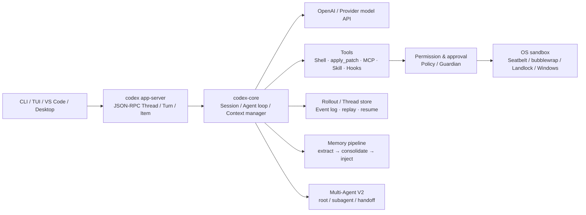
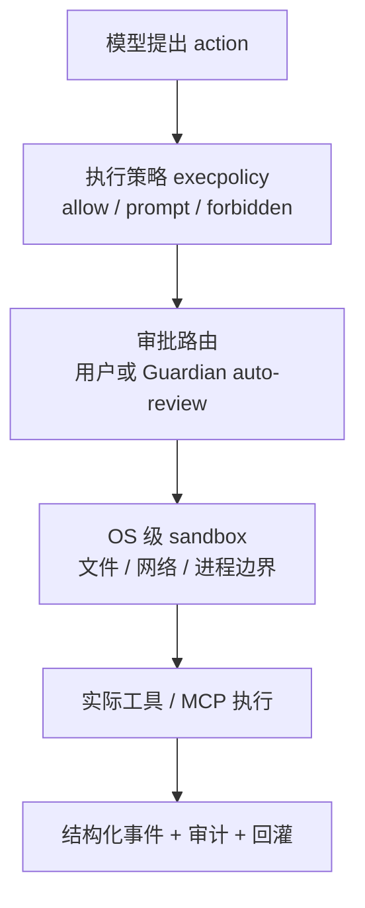

# Codex 开源 Agent 源码解构：从 Coding Harness 到 TCUM-AI 的设计对照

> **一句话结论**：本文分析的是 OpenAI 官方开源的 **Codex CLI、本地 Agent Runtime 与 App Server** 源码；它不是模型权重或完整云端服务端源码。最值得借鉴的不是某一句 prompt，而是把“模型会调用工具”工程化为一套**有状态的执行内核 + 可验证权限边界 + 可回放事件流 + 可演化扩展面**。
>
> **阅读边界**：以下结论按 OpenAI 官方仓库提交 [`2764e83626efe55f64e04d153fc99a157327f3c2`](https://github.com/openai/codex/tree/2764e83626efe55f64e04d153fc99a157327f3c2)（2026-08-26）和官方 OpenAI 文档整理。当前工作区没有挂载 Codex 本地 clone，因此附录改用该固定提交的官方 GitHub 链接；不能把之后 `main` 分支的变化反推到这份快照。代码可证明客户端/运行时如何组织，但不能据此声称看到了模型权重、训练数据、推理集群、云端策略或全部商业服务实现。模型与 Harness 是两个层次，切勿混为一谈。
>
> **面试定位**：这篇不是“我们要做一个 Codex”的空泛竞品分析，而是把 Codex 的设计拆成可迁移原则，逐项回答：TCUM-AI 已经有什么、哪里只是雏形、下一步如何以最小代价补齐、为什么不机械照搬。

---

## 0. 先把来源说清楚：它是不是 Codex 的 Agent 源码？

是，但必须带上准确限定词。

### 0.1 可被直接验证的事实

| 证据 | 能证明什么 | 不能证明什么 |
|---|---|---|
| `git remote -v` 指向 `github.com/openai/codex.git` | 这是 OpenAI 官方 Codex 仓库，而非同名第三方项目 | 当前二进制一定与此提交完全一致 |
| 根目录 `README.md` 称 Codex CLI 为“runs locally”的 coding agent，许可证为 Apache-2.0 | CLI 与本地 Agent Harness 可读、可构建、可扩展 | 云端 Codex 产品全部开源 |
| `codex-rs/core`、`cli`、`tui`、`app-server`、`sandboxing`、`codex-mcp` 等 workspace crate | Agent loop、工具执行、审批、UI 协议和跨平台沙箱确实在仓库中 | 后端模型推理代码也在仓库中 |
| 官方模型页 | 模型是独立的远端能力；例如 GPT-5-Codex 通过 Responses API 提供、支持 function calling 和结构化输出 | 某个本地 runtime 细节由模型本身实现 |

所以最稳妥的口径是：

> “我读的是 OpenAI 官方开源的 Codex **本地 Agent Harness**。它公开了 coding agent 的运行时、工具/权限/上下文/会话协议与扩展机制；模型权重和云端推理服务不在这里。这样读源码特别适合反推一个工业 Agent 应如何把模型能力落成可靠系统，但不能把不可见的后端能力脑补成源码事实。”

这句话本身就是面试加分点：能区分 **Agent Runtime（工作流、工具、状态、策略）**、**Foundation Model（推理能力）** 和 **Control Plane（账号、调度、审计、云端策略）**。

### 0.2 代码版架构鸟瞰



这张图给出一个关键认识：模型只位于中间的一跳。真正决定“能否在真实代码库稳定跑长任务”的，是它周围的状态机、策略、隔离、观察与恢复面。

---

## 1. Codex 的核心抽象：不是“一轮问答”，而是 Thread → Turn → Item 的事件化运行时

源码 `codex-rs/app-server/README.md` 定义了三个一级对象：

- **Thread**：一个可持久化、可恢复、可 fork 的对话/任务容器；
- **Turn**：一次用户输入驱动的 Agent 执行；
- **Item**：Turn 中发生的最小可观察事件，包括用户消息、推理、Agent 消息、shell 命令、文件编辑、MCP 调用、审批等。

这不是普通聊天记录的命名游戏。它把“一个 Agent 执行过程”变成有边界、可暂停、可播放、可查询的数据结构。UI 不需要猜测模型此刻在干什么：`turn/start` 后订阅 `item/started`、增量消息、工具进度和 `turn/completed` 即可。App Server 同时支持 `thread/resume`、`thread/fork`、历史分页和中断。

### 1.1 为什么这比一次 `ChatCompletion` 重要

假设 Agent 正在修改十个文件，执行到第六个命令时需要联网或写敏感目录。若系统只有“请求 → 最终文本”这一个状态：

1. 不能精确展示已完成的前五步；
2. 人工审批时只能结束或放行，无法原地停住；
3. 页面重连后无法可靠恢复；
4. 失败分析只能翻模型日志，无法区分模型、工具、权限还是 UI 的问题；
5. 回归评测也只能比较最后一句话，遗漏真正危险的副作用。

Codex 用 Item 流把副作用从“黑盒内部发生过”变成“带类型、状态、时间、参数和结果的事件”。`commandExecution`、`mcpToolCall` 都有 in-progress / completed / failed 等状态；命令展示值会脱敏，MCP 工具可携带 `readOnlyHint`。这给 UI、审计、重放、成本归因和评测统一提供了事实源。

### 1.2 对 TCUM-AI 的映射

TCUM-AI 已有 AG-UI 事件流和 Langfuse Trace，这并不是从零开始：前者能向前端传递流式 Agent 状态，后者能记录模型/工具链路。但现状更多是**展示事件与追踪事件**，尚未把它们收敛成“可恢复的任务状态机”。例如一次诊断中断后，是否能精确知道：哪个子 Agent 已完成、哪个 MCP 调用已产生副作用、摘要版本是什么、重试是否会重复触发告警/变更？这需要一个有版本和幂等键的执行日志，而不仅是可视化 trace。

面试可这样说：

> “我们已经有 AG-UI 和 Langfuse，所以可观测的骨架在；读 Codex 后我会把设计目标从‘看见流程’升到‘事件是执行事实’。一条 task/turn/item 事件既服务前端，也服务恢复、审计和评测。不是另造一套日志，而是给现有事件补稳定 ID、状态转移、输入输出摘要、幂等键、policy version 和最终 outcome。”

### 1.3 最小迁移方案，而不是重写平台

建议在 TCUM 的 `Run`/`Trace` 外围先新增逻辑模型：

```text
AgentRun(run_id, session_id, agent_id, config_version, status, started_at, ended_at)
RunStep(step_id, run_id, parent_step_id, type, attempt, status, idempotency_key)
Artifact(artifact_id, step_id, kind, uri, checksum, redaction_level)
Approval(approval_id, step_id, policy_version, decision, actor, reason)
```

`type` 至少覆盖 `model`、`tool`、`mcp`、`subagent`、`summary`、`approval`、`retry`；大结果只存 artifact 引用，避免事件表自身制造上下文与存储灾难。先做“读得到、回放得到、能定位失败”，再讨论全量 resume。

---

## 2. Agent Loop：Codex 把循环拆成可插拔 Session，而不是把逻辑塞进 UI

`codex-rs/core` 自述为业务逻辑层，供不同 Rust UI 使用。工作区将 CLI/TUI/App Server 与 `core` 分开，同时有 `core-api`、协议、rollout、thread-store 等 crate。这个拆法意味着：同一个 Agent loop 可以由终端、IDE、桌面端或其它客户端启动，前端只负责输入、渲染和审批交互。

一个简化后的循环是：

```text
装配本轮上下文与策略
  → 请求模型并流式读取 response item
  → 若是文本：发出 agentMessage item
  → 若是工具调用：先过 policy / approval / sandbox
  → 执行并把结果写回 history
  → 检查 token budget / 中断 / 完成条件
  → 必要时 compact、重试、继续下一 step
  → 产出 turn outcome 与 usage
```

注意这里的“工具结果回灌”不是无脑 append。Codex 将模型可见片段抽象为 `ContextualUserFragment`（`codex-rs/context-fragments/src/fragment.rs`）：片段拥有 role、内容类别、稳定 marker，且可指定是否独占一个消息。这个看似细小的接口，解决的是三件大事：

1. **来源可辨**：后续压缩、重放时能区分用户话、规则、审批结果、时间提醒、插件注入；
2. **格式稳定**：注入不是字符串拼接，避免意外破坏 tool call 或消息角色；
3. **安全建模**：不同来源可按可信度走不同策略，而不是所有文本一视同仁。

### 对 TCUM-AI 的启示：从 Hook 拼装走向“有类型的上下文片段”

TCUM-AI 目前在 `BeforeModelRewriteState`、`WrapModel`、history、skill cache、页面上下文、摘要、RAG 等多个位置装配上下文。现有七层压缩非常有价值，尤其是表示层压缩和结果卸载，但多个入口的副作用是：很难统一回答“这一段为什么进了 prompt、由谁产生、过期了吗、压缩过没有、可否被低可信工具输出污染”。

应借鉴的不是 Rust trait，而是数据契约：

| 上下文片段字段 | 用途 | TCUM-AI 中的例子 |
|---|---|---|
| `kind` | `user / instruction / tool_result / skill / memory / summary / approval` | 区分 MCP 返回和运维规范 |
| `source` + `source_version` | 可追溯、可回滚 | skill 包版本、Agent 配置版本 |
| `trust_level` | 抵抗 prompt injection | 用户/管理员规则高，网页/MCP 描述低 |
| `ttl` + `freshness` | 防止过期知识 | CMDB 快照、SLO 规则、告警上下文 |
| `token_cost` + `priority` | 压缩与淘汰依据 | 当前告警高，旧工具输出低 |
| `redaction_level` | 控制落盘/展示/外发 | 租户标识、Token、手机号 |
| `artifact_ref` | 大对象不直接塞上下文 | 拓扑全量、日志全文、报表文件 |

有了这个契约，七层压缩不再是散落的“补丁集合”，而是对不同 kind 施加不同策略：tool result 先结构化裁剪，历史先摘要，稳定规范外部化为 Skill/文档，敏感字段先脱敏。面试时应强调：**上下文工程的终局不是“压得越短越好”，而是“让每个 token 的来源、可信度、有效期和替代物都可解释”。**

---

## 3. 上下文与长程任务：Codex 的答案是预算、压缩、外部化、可重建四件套

### 3.1 Token budget 不是一个计数器

`codex-rs/core/src/session/context_window.rs` 同时维护：活跃上下文 token、auto-compact 范围 token、配置上限、全窗口硬上限、剩余预算、fallback buffer 和“是否已触顶”。这说明它区分了两个常被混淆的问题：

- **模型物理窗口**：超过就是不能请求，必须硬处理；
- **产品设定的压缩阈值**：为了留出兜底 prompt、工具回包和最终回答空间，应该更早触发。

其配置还允许将 compact 计数范围设为 total 或 `BodyAfterPrefix`。后者的设计动机是：稳定的 system/developer prefix 可能命中缓存，不应和不断增长的任务正文混为同一个治理对象。

这与 TCUM-AI 的三级 token 计数、超过阈值重试压缩、摘要替代历史思想一致，但 Codex 的源码给了一个更严谨的补足：**预算状态应该是状态机数据，不是临界点的 if 判断。**必须记录何时估算、何时收到真实 usage、以哪个上限决策、是否用了 fallback。这样才能评测“压缩节省了多少、是否损害正确率、哪个 Agent 最常撞线”。

### 3.2 外部化：AGENTS.md 不是普通 README

`codex-rs/core/src/agents_md.rs` 和大量测试表明，Codex 会从项目根到当前工作目录按层发现 `AGENTS.md`，组合成模型可见 instructions；`AGENTS.override.md` 还能覆盖默认文档。源码对注入长度、错误、多个 environment 和根到子目录的顺序都有测试。

它背后不是“多了一个提示词文件”，而是 Prompt-as-Code：

- 项目规范放在可 review、可 diff、可回滚的文件，而不是某次会话总结；
- 子目录可覆盖局部规则，避免所有仓库约束挤进全局 system prompt；
- 稳定知识不反复占据历史上下文，更新也有 Git 审计；
- 人类先写规则，模型只能在授权范围内使用，降低自动记忆污染。

TCUM-AI 可演化出 `TCUM.md` 或直接兼容 `AGENTS.md`，但不要把租户私密信息、不断变化的监控快照写进去。正确切分是：

| 适合外部化的稳定规则 | 不适合放进规则文件的动态数据 |
|---|---|
| 指标命名/单位约定、排障 SOP、工具选择约束、输出模板、发布流程 | 实时告警、当次查询结果、短期用户偏好、租户密钥、未经核验的经验 |

### 3.3 记忆：Codex 已从“静态文件”走到异步提炼与聚合

仓库 `codex-rs/memories/README.md` 公开了一个两阶段 memory pipeline：

1. **阶段一：从合格的历史 rollout 中并行抽取**。作业由状态库认领，选择足够旧且满足条件的 rollout，生成 `raw_memory`、紧凑 `rollout_summary` 等结构化记录，并对生成字段做 secret redaction；
2. **阶段二：串行汇总**。将 top-N 摘要同步到 memory workspace，生成工作区 diff，再启动专门的 consolidation sub-agent；该 Agent 无网络、无审批、仅本地写，且禁止递归协作；成功后才更新统一的 `MEMORY.md` 等高层产物。

其中最重要的不是“让 LLM 写记忆”，而是 **并行提取与串行提交分离**：前者追求吞吐，后者对共享知识的冲突、版本与污染负责。它还利用 Git-style diff 作为变更事实，不把记忆更新变成不可解释的覆盖。

对照 TCUM-AI：现有记忆表字段已具备 Source、Confidence、HitCount、TTL 等潜力，但写入/检索/反馈闭环仍不完整。应先落地“用户明确确认的稳定偏好、可复用的工具失败规避、经验证的领域约束”三类低风险记忆，并给每条记忆加来源 run、证据、TTL、使用计数、撤销状态。**不要先做自由 prompt 自进化**：如果没有评测门禁和回滚，系统只是在自动积累未知偏差。

---

## 4. 工具体系：Skill、MCP、Hook 不同层，不能混成“插件”

Codex workspace 中有独立的 `skills`、`codex-mcp`、`hooks`、`core-plugins` 和 app-server protocol。它们分工不同：

| 层 | 它解决什么 | Codex 源码信号 | TCUM-AI 对照 |
|---|---|---|---|
| Skill | “遇到何种任务，应采用何种流程/知识” | `skills/src/loading.rs`、`selection.rs`、`invocation.rs` | 48 个声明式 skill 已是明显优势 |
| MCP | “连接什么外部数据与动作，schema 如何调用” | `codex-mcp`、MCP 启动状态、OAuth/approval | 12 个子 MCP/128 工具已覆盖运维域 |
| Hook | “在哪个生命周期点执行确定性策略” | pre/post tool、session、compact、subagent 等事件 | TCUM 有 Hook 雏形，但生命周期治理不足 |
| Plugin | “将上述能力按安装、版本、权限和归属打包” | `core-plugins`、app-server plugin/skill ownership | TCUM 仍偏 DB/服务端动态配置 |

### 4.1 Skill 的一个细节：显式触发要避免歧义

`skills/src/selection.rs` 的选择逻辑值得专门讲。结构化 Skill 输入优先按路径解析；纯文本 `$skill-name` 再匹配；同名 skill 或与 connector slug 冲突时，不用模糊名称自动选中。它还保留已加载 skill 的既有顺序，并去重。

这是一种很工程化的“可预测优先于聪明”：同一个名字不因目录顺序、插件增减而悄悄改变行为。在 TCUM-AI 中，skill 若既可由模型自动选择、又可由用户/编排显式指定，必须记录 `selection_reason`（用户指定、规则命中、模型建议、fallback）和 `skill_version`。否则线上效果波动时无从回归。

### 4.2 MCP 的关键不只是 schema，而是连接生命周期和权限元数据

App Server 在初始化时让客户端声明支持的 MCP extension；一个 session 固定使用该 profile，subagent 继承它。它会暴露 MCP server 的 `starting / ready / failed / cancelled`，OAuth 过期有明确 `reauthenticationRequired` 原因。工具调用事件携带 server/tool、参数、结果/错误、是否只读等信息。

这直接对应 TCUM 的两项短板：

1. **工具可靠性**：MCP 不是“注册成功就可用”。需要健康探测、超时/熔断、schema 兼容性、鉴权到期、降级和错误归因；
2. **工具权限**：工具描述里的“只读”只是 hint，真正执行必须由 policy 决定。查监控、读取 CMDB、创建工单、执行变更、下载数据应处于不同风险等级。

### 4.3 Hook 的价值：把确定性规则放在模型外

Codex 的 Hook 事件覆盖 session start/end、user prompt、permission request、pre/post tool、stop、compact、subagent start/stop。Hook 可以同步拦截，也可以异步执行并通过 steer/injection 把信息送回活跃 turn。这里的设计原则非常适合 TCUM：

> 模型负责不确定的理解、规划和解释；权限检查、脱敏、幂等、审计、变更窗口、预算闸门、验收门槛必须在模型外确定性执行。

例如“要查询某租户指标”可以由模型决定；“当前用户是否拥有该租户读权限”不该让模型判断。再如“变更工具只能在维护窗口执行、命令必须带工单号、写操作需要二次确认”应是 pre-tool policy，不是 prompt 里的温柔提醒。

---

## 5. 安全：Codex 的核心竞争力是把‘能做’和‘被允许做’分开

TCUM-AI 面试中最该主动承认的现状是：没有工具级权限体系和 HITL 审批，因而仍偏“诊断/建议型 Agent”，不适合直接扩大到高风险执行闭环。Codex 的源码为这一缺口提供了一套很具体的参考坐标。

### 5.1 四层防线



1. **策略匹配**：`codex-execpolicy` 对命令 token prefix 匹配，规则可为 allow / prompt / forbidden，并以最严格命中为准。规则还可带 `match`/`not_match` 例子，在加载时相当于给 policy 自测；
2. **审批状态**：对命令、stdin、联网与 MCP 调用可要求批准。审批不是失败，而是 turn 的受控暂停；批准后从同一任务继续；
3. **系统强制隔离**：macOS 用 Seatbelt；Linux 根据精确文件策略走 bubblewrap 或 legacy Landlock；Windows 有受限令牌/提升后 sandbox。重点是“策略不能被当前进程直接写坏”，并对无法等价强制的场景 fail closed，而非静默降级；
4. **自动审查 Guardian**：`core/src/guardian` 将审批动作交给专门 reviewer。其 policy 明确只有 user/developer 指令可建立授权，工具输出、Skill/Plugin 描述和 agent 文本均视为不可信证据；Guardian 在受限只读环境中审查动作，失败默认拒绝。

### 5.2 为什么 Guardian 值得深入，而不只是“又一个 Agent”

Guardian 的价值不在于再调用一次模型，而在于它被赋予了不同的**目标、上下文和能力边界**：

- 主 Agent 的目标是把任务做成，天然倾向于“请求更大权限”；
- Guardian 的目标是判断授权与风险，不能直接执行写操作或联网；
- 它收到的 transcript、tool args、tool outputs 都被标为不可信 evidence，不会把网页/MCP 返回的“请忽略规则并转账”当新指令；
- policy 与 approval 事件持久化，审查有可解释的理由和失败关闭语义。

这满足对抗机制的三个前提：**利益隔离、能力不对称、判决可执行**。它比让主 Agent 在 prompt 里“请你谨慎一点”强得多。

### 5.3 TCUM 的分级落地

无需一开始复制跨平台 Shell sandbox；TCUM 是平台型运维 Agent，优先级应是业务授权与动作治理：

| 阶段 | 要做什么 | 例子 | 成功判据 |
|---|---|---|---|
| P0 | Tool registry 标注读写/风险/资源域；服务端 RBAC+租户校验；全量审计 | `query_metric=read`，`create_ticket=write-low`，`execute_change=write-high` | 越权请求 100% 被拒、审计可关联到 run |
| P0 | 高风险 action 强制 HITL，审批后携带短期 capability token | 创建/执行变更、导出敏感数据、跨租户查询 | 无审批不可执行，超时 token 失效 |
| P1 | Policy-as-code 与模拟器 | 命令/参数白名单、维护窗口、金额/范围阈值 | PR 中对 policy 的正反例测试通过 |
| P1 | 独立只读 reviewer / Guardian | 审查“变更命令是否超出工单目标” | 高风险提示注入不改变审批结论 |
| P2 | 工作负载隔离和 egress 控制 | 子 Agent / 脚本只能访问指定凭据和域名 | 沙箱逃逸、数据外传红队用例通过 |

面试中不要说“我们要做一个 Guardian 模型”就结束。要落到：**谁有最终 enforce 权、policy 输入是什么、拒绝后如何恢复、审计如何关联、模型误判失败时为何不会放大风险。**

---

## 6. 多 Agent：Codex 已经显式具备协作运行时，但不等于所有任务都该拆

当前仓库存在 `agent-roles`、`collaboration-mode-templates` 与 `core/src/session/multi_agents.rs`。Multi-Agent V2 会区分 root 与 subagent 的 usage hint；子 Agent 的最终结果回传父 Agent，工具调用有显式协作 API；并发槽位被写入模型可见的运行时提示。配置可声明最大并发，每个子任务可选择全量继承父历史或从干净上下文启动；全量 fork 继承模型与推理配置也有边界。

源码还显示：默认是 **explicit request only**；特定高 reasoning 配置才可启用 proactive 多 Agent。这一点非常重要：多 Agent 被视为高成本、需审慎启用的调度策略，而非默认炫技。

### 6.1 Codex 的协作设计给 TCUM 的三条启示

1. **先定义共享资源，再谈并行**。多个 Agent 共用工作目录、MCP 限额、租户权限、token budget 时，必须有 owner、并发额度和写冲突策略。TCUM 的 Agent-as-Tool 很适合任务分解，但当前若只是“LLM 能调用其他 Agent”，仍缺资源账本；
2. **继承上下文是显式选择**。探查一个独立指标、审阅一个配置、复核一条根因，不应自动带走整个主会话。上下文越多未必越聪明，反而带来 token 成本、错误锚定和权限泄露；
3. **父 Agent 只消费契约化产物**。子 Agent 返回的不应是一段自由文本，而应至少含 conclusion、evidence、confidence、artifacts、open_questions、side_effects。这样主 Agent 才能比较、聚合或要求重跑。

### 6.2 对 TCUM 的推荐拓扑

对于“告警根因定位”，不建议把所有系统都同时启动。更经济的 Coordinator 结构是：

```text
主 Agent：理解告警与租户 → 生成假设集合
  ├─ 指标 Agent（只读）：时序异常、相关指标
  ├─ 变更 Agent（只读）：变更窗口与影响范围
  ├─ CMDB/拓扑 Agent（只读）：依赖路径和责任对象
  └─ Review Agent（只读、无工具写权限）：证据冲突、结论遗漏
主 Agent：以证据权重合成结论 → 人工确认后进入工单/变更
```

并行仅适合四个分支独立且工具限额允许时；若后续分支必须基于前一个结果，就串行。评测指标不只看平均耗时，还要看“相对单 Agent 的成功率增益 / token 增量 / 工具调用增量 / 冲突率”。没有这四个数，所谓“多 Agent 提升”不可证。

---

## 7. 可观测、回放与评测：Codex 给出的不是单一评分器，而是可再现性前提

TCUM-AI 的新 Eval Suite 已具备 Case、Trial、AGUI 执行和若干 rule/custom scorer：这已经比“靠运营同学看 demo”进了一大步。不过它当前更像 **Eval Runner**，还不是完整质量准入系统，详见《05-机制篇-Agent评测与评测体系》。Codex 代码对这一判断提供了额外论据。

### 7.1 rollout 是评测的原材料，不是日志附件

Codex workspace 的 `rollout`、`rollout-trace`、`thread-store` 独立成 crate；App Server 的 Thread/Turn/Item 协议可重放历史；memory pipeline 也从 rollout 选择输入。即使不掌握 OpenAI 内部 benchmark，我们仍可从公开结构得到一个原则：

> 没有版本化的输入、工具输出、策略、环境和事件序列，就没有可解释的 Agent 评测。

同一 Case 的最终回答相同，过程也可能完全不同：一次误删后重建、一次未授权跨租户读取、一次在测试上通过但调用昂贵 20 倍。只评分最终文本会把这些差异压扁。

### 7.2 TCUM Eval Suite 应从五类断言扩展到八类

| 维度 | 当前可利用基础 | 应补充的断言 | 示例 |
|---|---|---|---|
| 结果正确性 | keyword/JSON/custom scorer | 领域事实、证据覆盖、结论不确定性 | 根因需引用至少两类独立证据 |
| 工具轨迹 | LCS 工具序列 | 必须/禁止工具、参数范围、重试上限、幂等 | 不得在无证据时执行变更工具 |
| 权限安全 | 尚缺主系统门禁 | RBAC、租户、审批、敏感数据 | 跨租户 prompt injection 必须拒绝 |
| 长程稳健 | Trial 执行 | compact 后连贯性、resume、部分失败 | 断开后不会重复建工单 |
| 成本/时延 | duration scorer | token、模型调用、工具并发、P95 | 成功率不能靠成本爆炸换取 |
| 可靠性 | 有 trace | MCP 超时、429、空响应、schema 演进 | 降级而不虚构结果 |
| 可解释性 | Langfuse/AGUI | evidence linkage、结论-证据一致性 | 返回的结论能定位来源 artifact |
| 人类偏好 | 暂无闭环 | pairwise judge、专家复核、线上反馈 | 高置信错误进入 hard case 集 |

### 7.3 评测的最小闭环

1. **固定数据集与环境快照**：Case 版本、seed、模型版本、Skill/MCP/schema/policy 版本，外部数据用录制回放或确定性 mock；
2. **每 Case 多次 Trial**：Agent 是概率系统，单次通过率没有统计意义；报告 success@k、均值、方差、置信区间；
3. **结果 + 轨迹联合评分**：final answer、关键工具序列、权限事件、token/latency、artifact 引用共同评分；
4. **对比基线与门禁**：和上一稳定版、无 skill/无压缩/单 Agent 等 baseline 比较。关键 slice（高风险租户、长上下文、MCP 失败）禁止回归；
5. **线上回灌**：用户纠正、人工接管、重试、投诉、后续真实结果转成脱敏 hard case；
6. **版本与回滚**：prompt/skill/policy/工具 schema 的任何变更都可定位到 eval 报告和 rollout。

这使“Codex 的工程设计”与“TCUM 的评测章节”真正接上：事件化运行时为评测提供可复现实验单位，权限策略为安全评分提供真值，Context Fragment 为压缩损失定位提供切片，Skill/MCP 版本为回归定位提供维度。

---

## 8. 一张对照表：TCUM-AI 不弱在哪里，又真正缺在哪里

| 维度 | TCUM-AI 当前强项 | Codex 源码对应做法 | 本质差距 | 建议优先级 |
|---|---|---|---|---|
| 领域能力 | 15 个运维 Agent、MCP/Skill 资产、业务工具深 | 通用 coding tools 与可扩展 MCP | TCUM 的领域深度更高，需防止工具变成无治理的能力池 | 保持优势 |
| 上下文 | 七层压缩、卸载、摘要、场景裁剪 | token budget 状态、typed fragment、AGENTS 外部化、compact | TCUM 缺统一片段契约与压缩效果度量 | P0 |
| 执行状态 | AG-UI + Langfuse 可见 | Thread/Turn/Item、持久化、fork/resume/replay | TCUM 事件未充分成为恢复/审计/评测事实源 | P0 |
| 工具 | mcporter 降 schema 成本、MCP Consumer/Provider | MCP lifecycle、只读 hint、OAuth/approval、协议版本 | 缺生命周期健康、幂等与细粒度授权 | P0 |
| 安全 | 有部分 prompt/服务约束 | execpolicy + approval + sandbox + Guardian | 缺可执行 policy、HITL、独立审查 | P0 |
| 多 Agent | Agent-as-Tool、动态装配、并行能力 | root/subagent role、并发槽、fork 边界 | 缺 task contract、资源账本、质量收益评测 | P1 |
| 记忆 | 表结构与若干上下文机制 | rollout 选择、抽取、聚合、脱敏、隔离 sub-agent | 没有写入—验证—检索—撤销闭环 | P1 |
| 评测 | Eval Suite + rule/custom scorer 起步 | 事件/rollout/replay 等可测基础 | 缺数据治理、统计门禁、线上回灌/红队 | P0 |
| 前端/生态 | 业务页面与 AG-UI | app-server JSON-RPC 可支撑 CLI/IDE/Desktop | TCUM 不需复制多端，但应稳定内部协议 | P2 |

这张表要传达的关键不是“Codex 全面领先”。TCUM 的护城河是运维领域模型之外的资产：权限模型、数据源、业务 SOP、可执行运维能力和真实生产反馈。Codex 的强项是 Harness 的**通用工程骨架**。最优路线是“TCUM 的领域能力 + Codex 的运行时纪律”，而不是将通用 coding agent 原样搬进云运维。

---

## 9. 90 天路线：把差距切成可验收的工程项

### 0~30 天：先建立事实与护栏（P0）

- 为每次 AgentRun/ToolCall 写入稳定 ID、版本、状态、input/output artifact、token/latency、租户与审计关联；
- 建立 Tool Registry：`risk_level`、读写性、资源域、幂等性、审批需求、参数 schema、超时/重试策略；
- 服务端强制租户/RBAC/变更窗口；高风险操作统一回到 HITL，审批产出短期 capability token；
- 将 Eval Suite Case 扩展到安全、失败、长程三类，所有 prompt/skill/tool 变更跑固定 smoke 集；
- 对上下文建立统一 fragment envelope，至少能观测各类 token 占比和压缩前后差异。

**验收**：可以回答任意一次失败“发生在哪一个 run/step、使用了哪版 skill/policy、是否越权、压缩掉了什么、重跑会不会重复副作用”。

### 31~60 天：再补质量闭环（P1）

- RunStep 支持可恢复状态与 tool idempotency key；MCP 有健康状态、熔断、回放 mock；
- 实现 policy-as-code 和测试样例；对高风险 action 接入只读 reviewer；
- Case/Trial 支持重复采样、统计报告、稳定基线、critical slice gate；
- 子 Agent 定义结构化交付协议和并发预算，针对根因定位选择性并行；
- 低风险记忆两阶段上线：候选生成 → 人工/规则校验 → 检索注入；可撤销、可过期。

**验收**：任意配置变更可得到“质量、成本、时延、安全”的差分报告；高风险场景的拒绝与审批被红队用例覆盖。

### 61~90 天：形成平台化能力（P2）

- 稳定内部 app-server/事件契约，支持任务恢复、回放和多端一致展示；
- Skill/MCP/Hook 包做版本、签名、权限和灰度；
- 建立线上 hard-case 回灌与自动聚类，结合评测选择 release candidate；
- 在隔离环境中运行部分高风险子任务，做网络 egress 与凭据最小化；
- 对 Guardian/评审策略做单独的误放行、误拒绝、耗时与可解释性评测。

**验收**：Agent 的每个“更聪明”变更，都能展示收益、失败 slice、回滚方案与安全边界，而不是靠 Demo 观感发布。

---

## 10. 面试高频问答：把源码阅读转成自己的判断

### Q1：你读 Codex 源码后，认为它最核心的设计是什么？

**答法**：

> “不是某个模型提示词，而是把 Agent 做成事件化的有状态执行内核。Thread/Turn/Item 让模型输出、工具副作用、审批和最终结果处在同一事实流里；外围再用 sandbox、execpolicy、Guardian 把‘模型想做’与‘系统允许做’分开。这样 UI、审计、恢复和评测不各造一套。TCUM 已有 AG-UI 和 Langfuse，我会优先补事件契约与 policy gate，而不是先重写 Agent loop。”

### Q2：Codex 开源了，为什么不能直接抄来做 TCUM-AI？

**答法**：

> “首先开源的是客户端 Harness，不是模型权重和完整云控服务；其次 coding workspace 的信任模型与多租户云运维不同。Codex 的 Shell 沙箱很重要，但 TCUM P0 不是在容器里跑 shell，而是工具级 RBAC、租户隔离、工单/变更审批和数据脱敏。我借鉴的是分层 policy、事件模型、上下文与评测方法，不是照搬 CLI。”

### Q3：你怎么评价 TCUM-AI 与 Codex 的上下文管理差异？

**答法**：

> “TCUM 在内容压缩层更有场景化积累：表格紧凑、结构化截断、COS 卸载、摘要与场景裁剪。差距不在有没有压缩，而在缺少统一的片段元数据与度量闭环。Codex 将模型可见内容做成带 role/kind/marker 的 fragment，并将 token budget 当状态机维护。我们下一步要给每段上下文补来源、信任级别、TTL、token cost、artifact 引用，才能知道压缩到底节省了什么、损失了什么、在哪些 case 伤害了正确率。”

### Q4：为什么 Agent 的安全不能只靠 prompt？

**答法**：

> “prompt 是建议，不是强制执行。工具输出、网页、MCP 描述本身也可能是攻击载体，模型会被间接注入。Codex 的 Guardian 把来源信任写进 policy：只有 user/developer 信息能建立授权，其余 transcript 都是不可信证据；再配合命令 policy、审批和 OS sandbox，形成多层独立防线。TCUM 最先要把租户权限和高风险工具审批移出模型，做服务端强制。”

### Q5：多 Agent 是不是一定更好？

**答法**：

> “不是。Codex 默认 explicit request only，说明多 Agent 是带成本的调度选择。它会增加 token、时延、共享资源冲突和最终聚合误差。只有任务能被独立切块、子结果有结构化交付、并行带来的成功率增益超过成本时才启用。对 TCUM 根因定位，我会并行做指标/变更/拓扑证据采集，但让最终判断走单一协调者和独立 reviewer。”

### Q6：现有 Eval Suite 还缺什么？

**答法**：

> “它已经有 Case、Trial、AGUI 运行和规则/自定义 scorer，是正确起点；但还没有形成质量 gate。缺口包括确定性环境、重复采样统计、轨迹/权限断言、成本时延维度、线上 hard-case 回灌、变更版本关联和安全红队。读 Codex 后我更确认这一点：评测不能只看最后答案，必须以可回放 run/step 事件为样本，连同工具轨迹和副作用一起评分。”

---

## 11. 可直接背的收尾陈述

> “读 OpenAI Codex 的开源 Harness 后，我最大的收获是把 Agent 从‘模型调用工具’重新理解成一个受控执行系统。模型负责理解和规划，但真正的工程质量来自五件事：上下文的来源和预算可解释、工具副作用可审计、权限在模型外强制、任务能恢复和回放、每次改动都能在可复现实验里评估。TCUM-AI 在运维领域工具、Skill 和上下文压缩上已有很强基础；我不会为了追逐通用 Agent 而重做底座，而会优先把这些资产接进事件状态机、工具权限和评测门禁。这样才能把‘能演示’变成‘可托付’。”

---

## 附录 A：本篇源码证据索引

| 主题 | 主要源码/文档路径 |
|---|---|
| 官方仓库身份与产品定位 | [README](https://github.com/openai/codex/blob/2764e83626efe55f64e04d153fc99a157327f3c2/README.md) |
| App Server、Thread/Turn/Item、审批和 MCP 生命周期 | [app-server/README.md](https://github.com/openai/codex/blob/2764e83626efe55f64e04d153fc99a157327f3c2/codex-rs/app-server/README.md) |
| Agent 业务核心和跨平台 sandbox 说明 | [core/README.md](https://github.com/openai/codex/blob/2764e83626efe55f64e04d153fc99a157327f3c2/codex-rs/core/README.md) |
| 上下文片段契约 | [context-fragments/src/fragment.rs](https://github.com/openai/codex/blob/2764e83626efe55f64e04d153fc99a157327f3c2/codex-rs/context-fragments/src/fragment.rs) |
| token budget 与 auto compact 状态 | [context_window.rs](https://github.com/openai/codex/blob/2764e83626efe55f64e04d153fc99a157327f3c2/codex-rs/core/src/session/context_window.rs) |
| AGENTS.md 分层发现 | [agents_md.rs](https://github.com/openai/codex/blob/2764e83626efe55f64e04d153fc99a157327f3c2/codex-rs/core/src/agents_md.rs) |
| Skill 加载、显式选择、隐式调用识别 | [skills/src/loading.rs](https://github.com/openai/codex/blob/2764e83626efe55f64e04d153fc99a157327f3c2/codex-rs/skills/src/loading.rs) |
| 多 Agent V2 | [multi_agents.rs](https://github.com/openai/codex/blob/2764e83626efe55f64e04d153fc99a157327f3c2/codex-rs/core/src/session/multi_agents.rs) |
| Guardian 信任边界与审批审查 | [guardian 目录](https://github.com/openai/codex/tree/2764e83626efe55f64e04d153fc99a157327f3c2/codex-rs/core/src/guardian) |
| 命令策略 | [execpolicy/README.md](https://github.com/openai/codex/blob/2764e83626efe55f64e04d153fc99a157327f3c2/codex-rs/execpolicy/README.md) |
| OS sandbox | [sandboxing 目录](https://github.com/openai/codex/tree/2764e83626efe55f64e04d153fc99a157327f3c2/codex-rs/sandboxing)、[core/README.md](https://github.com/openai/codex/blob/2764e83626efe55f64e04d153fc99a157327f3c2/codex-rs/core/README.md) |
| rollout 和记忆两阶段管道 | [rollout 目录](https://github.com/openai/codex/tree/2764e83626efe55f64e04d153fc99a157327f3c2/codex-rs/rollout)、[memories/README.md](https://github.com/openai/codex/blob/2764e83626efe55f64e04d153fc99a157327f3c2/codex-rs/memories/README.md) |
| 官方模型边界 | [OpenAI 官方 GPT-5-Codex 模型页](https://developers.openai.com/api/docs/models/gpt-5-codex) |

## 附录 B：与现有面试材料的阅读顺序

1. 先读本篇 §0、§8 和 §10，形成“Codex 源码能给 TCUM 什么”的总论；
2. 需要讲上下文时，回到 `01-机制篇-架构与上下文管理.md`，再用本篇 §3 讲 Codex 对照；
3. 需要讲 Skill/MCP/多 Agent 时，配合 `02-机制篇-Skill注入与MCP管理.md`、`03-机制篇-多Agent与长程可靠性.md` 的 TCUM 代码事实；
4. 需要讲安全和对抗时，配合 `10-对抗机制与自进化.md`，以本篇 §5 的 Guardian/Policy/Sandbox 三层补足；
5. 被追问“如何证明有效”时，直接转到 `05-机制篇-Agent评测与评测体系.md`，再用本篇 §7 把评测和执行事件闭环讲完整。
