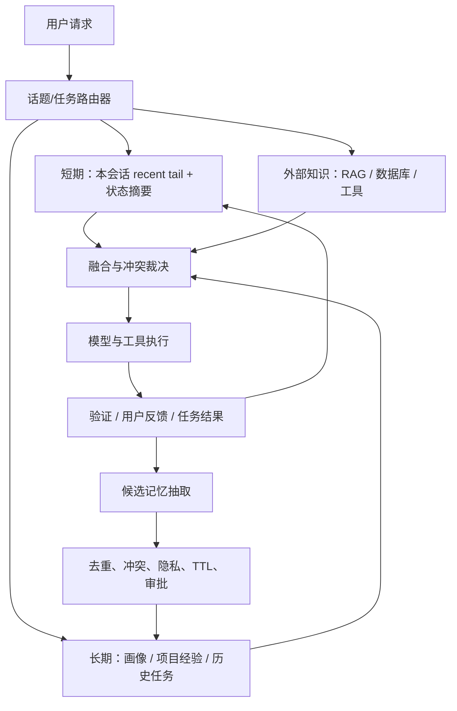
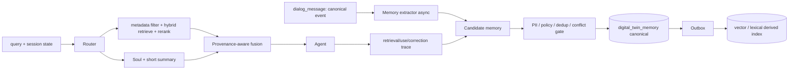

# 第七篇 · Agent 记忆协同体系：TCUM-AI、Codex、Claude Code、DSH 的实现对读与面试题库

> 阅读定位：这是一篇可独立使用的记忆专题。它回答“记忆是什么、怎么落地、怎么评估”，并逐题覆盖 Q1～Q30。原 [《对抗机制与自进化》](10-对抗机制与自进化.md) 保留其中的概览和演进讨论；本篇以“记忆协同”作为完整主线。
>
> 证据边界（截至 2026-08-26）：TCUM-AI、Codex、deepseek-harness（下称 DSH）结论来自给定本地仓库当前代码，提交分别为 `76de5eeed`、`2764e83626`、`b150a551b8`。Claude Code 没有提供本地源码，故只引用其官方公开文档；凡是文档未承诺的服务端实现，一律写“未知”，不从产品现象反推源码。这里的“Codex”同样指给定开源仓库所呈现的能力，不等于对云端产品全部实现的承诺。

---

## 0. 面试先说结论：不要把“上下文压缩”误称为“长期记忆”

一个成熟 Agent 的记忆不是一个向量库，而是四个彼此制约的系统：

1. **工作记忆（working / short-term memory）**：本会话内让模型保持任务状态。典型载体是最近消息、工具结果、状态摘要和当前待办。它追求低延迟、强时序和可恢复，而不是跨会话复用。
2. **情节记忆（episodic memory）**：一次会话或一次任务发生过什么，例如“上周在仓库 A 用命令 X 修过 Y”。它必须保留来源、时间、作用域，便于回溯与失效。
3. **语义/画像记忆（semantic / profile memory）**：稳定偏好、团队规范、项目事实、已验证经验，例如“该项目必须运行 make wire”“用户偏好中文”。它应是小而可信的可维护知识，而不是聊天日志的副本。
4. **程序性记忆（procedural memory）**：可执行的工作方式，如 `AGENTS.md`、`CLAUDE.md`、Skill、脚本、模板和权限规则。它通常比自然语言回忆可靠，因为可以验证、版本化、执行。

因此一个常见追问的标准回答是：**短期摘要解决上下文窗口；长期记忆解决跨会话的选择性复用；RAG 解决在大量候选中找证据；规则/Skill 解决把经验变成可执行约束。四者相互配合，但不能互相替代。**

### 0.1 四家实现的总览

| 维度 | TCUM-AI（代码现状） | Codex 开源仓库（代码现状） | Claude Code（官方公开能力） | DSH（代码现状） |
|---|---|---|---|---|
| 会话短期记忆 | `dialog_message` 持久化；历史摘要 + 摘要后增量消息 | thread/rollout 历史、上下文窗口、自动 compact | 当前会话历史；接近窗口时清理旧工具输出并摘要 | append-only Session event log，经 `deriveMessages()` 投影为模型历史 |
| 窗口处理 | 每累计 10 条未总结消息异步摘要，保留最近 6 条 | 维护 context window，compact 后以替代历史进入新窗口 | 自动 compaction；保留关键请求和片段 | token-pressure compaction，保留近期尾部和完整工具调用/结果边界；可先裁剪大工具结果 |
| 跨会话长期记忆 | `digital_twin_memory` 关系表 + `Soul`；主要经 MCP 按需查 | Phase 1 从历史 rollout 提取，Phase 2 汇总为本地文件记忆工作区 | 项目级 `CLAUDE.md` 与本机项目级 Auto memory | Session 日志可跨会话检索；`AGENTS.md`/`CLAUDE.md` 为持久指令；无自动语义记忆抽取 |
| 检索 | 取同 Twin 最近 50 条，再用 LLM 排 Top 10；**不是向量检索** | 给模型注入最多约 2,500 token 的 `memory_summary.md`，模型再查 `MEMORY.md` / 明细 | 启动加载 `MEMORY.md` 前 200 行或 25KB，主题文件按需；`CLAUDE.md` 分层加载 | SQLite FTS5 词法全文检索；可选 `session_search` 等工具，按同 cwd 授权 |
| 写入 | 管理端/接口 CRUD；未见对话后自动抽取写入 | 异步抽取、去密、DB lease/retry、全局串行 consolidation | Agent 在识别到有用经验或用户明确要求时写 Auto memory；用户可编辑/删除 | 会话事件自动追加；没有“把对话提炼为用户画像”的默认写入管线 |
| 来源与解释 | 表有 `Source`、`SourceDialogID`、`Confidence` 字段，但 prompt 不携带 ID/时间/置信度 | 读取提示要求回复末尾输出机器可解析 memory citation；代码解析并记录使用 | `/memory` 可查看已加载 CLAUDE.md 与 Auto memory；文件可直接审阅 | 每条会话事件天然可追溯；跨会话工具能查命中片段/trace；不是面向用户的画像解释 |
| 删除/遗忘 | CRUD 与 `Enabled` 存在；TTL/HitCount/LastHitAt 未接入读取生命周期 | 线程可禁用未来生成；全局 memory reset 清 DB 与文件；Phase 2 按使用时间淘汰候选 | 可编辑/删除 memory 文件；可禁用 Auto memory 或 CLAUDE.md 加载 | 事件日志普通路径 append-only；索引可重建，未见自动语义遗忘 |

### 0.2 面试中必须主动说明的 TCUM-AI 真实边界

这三句话应该主动说出来，反而显得可信：

1. **“TCUM-AI 已经完成短期对话压缩闭环，但不是 Redis 窗口。”** 源码是关系库消息历史 + `dialog.summary` + 增量加载；摘要是异步的，可能比当前轮滞后一小段时间。
2. **“长期记忆表的 schema 很完整，但运行闭环没有完成。”** `TTL`、`HitCount`、`LastHitAt`、`Confidence`、`SourceDialogID` 都存在，但当前召回 SQL 仅按 `twin_id + enabled + updated_at desc`；没有 TTL 过滤、命中回写、置信度过滤、向量召回或自动抽取。
3. **“MemoryContextService 已实现候选 + LLM 重排，但普通对话构建链路没有调用它。”** `getMemoryContextWithQuery` 只有定义没有调用者。可用路径是数字分身 MCP 的 `queryMemories` / `getFullContext`，即模型或编排需要主动调用；`TwinSoulMiddleware` 默认只注入 `Soul`，不会自动注入 `digital_twin_memory`。

这比“我们做了向量库长期记忆”更经得起追问。当前仓库中没有该记忆链路的向量库实现。

---

## 1. 四套实现到底怎么做：先用源码把事实钉住

### 1.1 TCUM-AI：短期已可用，长期能力是“表 + MCP 查询”，不是自动记忆系统

#### A. 短期记忆链路

用户消息、页面 context、助手事件分别被保存为 `dialog_message`。每次请求在 `AgentService.buildRequestParams()` 中按如下顺序组 prompt：

```text
<conversation_summary>历史 period 摘要</conversation_summary>
Skill context
SummaryMsgCount 之后的全部 dialog_message（含本轮已保存的用户消息）
```

`DialogHistoryService.MaybeSummarizeAndSave()` 在助手消息持久化后检查未总结消息数：达到 10 条时，后台 goroutine 在 60 秒超时内生成一段不超过 500 字的 period summary，**保留最新 6 条消息不总结**。历史 period 超过 4 段时，合并更早的段，留下“一个粗粒度历史段 + 最近三段细粒度段”。这是一种“摘要 + recent tail”策略，而不是简单 FIFO 截断。

优点是：每轮无需全量带历史，消息保存可恢复，且 `loadDialogDetail` MCP 工具能按 `msg_range` 回看原始区间。风险是：摘要是异步触发，摘要失败不阻塞当前回答；摘要没有显式版本、事实置信度、来源引用或质量评测；当前增量读取没有 token 上限，连续超长消息仍可能让上下文过大。

证据：`usercases/agent_access/service/dialog_history_service.go`（`summarizeThreshold=10`、`reserveRecentCount=6`、period 合并），`usercases/agent_access/service/agent_service.go`（`buildRequestParams` 与请求后 `MaybeSummarizeAndSave`）。

#### B. 长期记忆链路

`digital_twin_memory` 表按 `TwinID` 隔离，字段为：`Category`、`Key`、`Content`、`Source`、`SourceDialogID`、`Confidence`、`Enabled`、`HitCount`、`LastHitAt`、`TTL` 等。当前 `FindRecentByTwinID` 的真实查询只做：

```sql
WHERE twin_id = ? AND enabled = 1
ORDER BY updated_at DESC
LIMIT 50
```

然后 `MemoryContextService` 把候选内容各截前 200 **字节**交给一个 LLM 排序，取最多 10 条，格式化为 `<memories>`。这不是 embedding/vector search：候选池首先由“最近更新”决定，LLM 只做二阶段判别；LLM 失败/JSON 失败时回退到最近 10 条。

真正被 normal agent 默认注入的是 `TwinSoulMiddleware` 中的 `<digital_twin>` 和 `<soul>`。`MemoryContextService.GetMemoryContext()` 虽然注释写“会话初始化时调用”，但从本仓库的调用图看，`DigitalTwinService.getMemoryContextWithQuery()` 没有实际调用者。长期记忆可通过数字分身 MCP 服务器的 `queryMemories`、`getFullContext` 被按需读取；这是一条**工具调用路径**，不是每轮前置注入路径。

因此应区分：

- `Soul`：稳定人设/系统指令，默认全量注入；
- `digital_twin_memory`：可管理的记忆记录，当前按工具按需检索；
- `dialog.summary + messages`：同一 Dialog 的短期会话上下文；
- 知识库：另一类外部知识来源，不应混称为“用户长期记忆”。

证据：`usercases/agent_access/po/twin_memory.go`、`dao/twin_memory_operator.go`、`service/memory_context_service.go`、`service/digital_twin_mcp_server.go`、`pkg/agent/twin_soul_middleware.go`。

#### C. TCUM-AI 的“实现了什么 / 没实现什么”清单

| 项目 | 结论 | 依据或影响 |
|---|---|---|
| 对话短期持久化与摘要 | 已实现 | DB 消息 + 定期 summary + recent tail |
| 长期表 CRUD / 手动纠错 / 禁用 | 已实现 | DAO/service 提供创建、更新、删除；`Enabled` 可过滤 |
| 候选 LLM 重排 | 已实现 | 最近 50 条 → LLM JSON 排序 → Top 10 |
| 默认对话自动注入长期记忆 | 未见实现 | 普通 `buildRequestParams` 不调用 memory context；Soul 例外 |
| 对话后自动抽取长期记忆 | 未见实现 | 未找到从 dialog/summary 写 `digital_twin_memory` 的调用链 |
| 向量检索 / 图检索 | 未见实现 | 当前路径为关系库 recent query + LLM rerank |
| TTL 到期过滤、命中计数回写、按置信度衰减 | 未见实现 | 字段存在，`FindRecentByTwinID` 未用；未见清理任务 |
| 记忆引用、冲突消解、用户可见审计 | 部分/未完成 | 表有来源字段，但注入文本不携带 ID、时间、置信度；无冲突策略 |
| 多 Agent 共享协议 | 未见实现 | 仅见按 TwinID 的表隔离；没有 team/agent namespace、授权与合并契约 |

### 1.2 Codex：把“从历史学到东西”拆为异步抽取、文件化索引、按需证据读取

给定 Codex 仓库里有两条不同的记忆线，面试时不能混为一谈。

#### A. 短期：thread/rollout 历史与 context-window compaction

会话历史以 rollout/thread 形式持久化，运行时维护 context window。发生 compact 时，旧历史被摘要/替换为新的 `CompactedItem` 与 replacement history，并推进 context window；原始 rollout 仍用于恢复和后续记忆提取。这里的核心是“让当前 Agent 接着干活”，不是给用户建立人格画像。

此外，OpenAI 的模型/Responses 文档对跨回合也强调两种机制：`previous_response_id`/`reasoning.context` 用于复用已保存的推理上下文，`all_turns` 与 `current_turn` 决定是否把全对话再次发送；官方建议保持提示精简并明确管理 context。它是平台级上下文复用能力，不等于此仓库的 memory artifact 实现。[OpenAI model guidance](https://developers.openai.com/api/docs/guides/latest-model)

#### B. 长期：Memory Phase 1 + Phase 2

启动根会话时，若不是 ephemeral、不是 sub-agent、功能开关和 state DB 可用，后台启动 memory pipeline：

1. **Phase 1（逐 rollout 抽取）**：从 state DB 按来源、年龄、闲置时间和限制挑选可处理的历史线程；先 claim/lease 防重复；并行调用模型生成 `raw_memory`、`rollout_summary`、可选 slug；生成结果先脱敏，再落 DB。失败有 retry backoff，不热循环。
2. **Phase 2（全局 consolidation）**：拿全局锁，选择 Top-N stage-1 输出。选择优先级是 `usage_count`，再按 `last_usage`/`generated_at`，并忽略超过 `max_unused_days` 的记录。将候选同步为 `raw_memories.md`、每个线程一个 `rollout_summaries/*.md`；对工作区做 Git 风格 diff；有变化才启动一个内部 consolidation sub-agent。该子 Agent 无审批、无网络、只允许本地写、禁用协作递归，然后维护 `MEMORY.md`、`memory_summary.md`、`skills/` 等高层产物。

这非常像“离线/异步的经验蒸馏 + 可审计工作区”，不是每轮聊天同步把一切塞进向量库。优势是写入不阻塞主任务、可做全局去重和重组；代价是新经验的生效不是实时的，且模型抽取仍可能产生错误，必须靠来源与纠错机制兜底。

#### C. 读取：小摘要常驻 + 文件索引按需查 + 强制引用

Memory extension 在启用 `MemoryTool` feature 且 `use_memories` 时，把 `~/.codex/memories/memory_summary.md` 截断到 2,500 token 后作为 developer policy 注入。提示词明确要求：自包含的轻量任务跳过；涉及工作区历史、规范、先前决策或存在歧义的任务先做 quick memory pass；先看摘要关键词，再搜索 `MEMORY.md`，只在索引指向时打开 1～2 个 rollout/skill 明细。

它体现了一个重要设计：**小而稳定的路由层常驻，大而易漂移的证据按需读取**。模型若使用记忆文件，最终回答需在末尾输出 `<oai-mem-citation>`，包含文件行号和 rollout id；运行时解析 citation 并记录使用。读取工具还包括 ad-hoc note、list、read、search，是否暴露专用工具受 `dedicated_tools` 配置控制。

用户的“不要记住”有两层：线程级 memory mode 只影响该线程未来是否有资格被生成记忆；`memory/reset` 会清 state DB 的 memory rows 并清空 memory root 文件。用户直接要求写入时，提示要求只在 `extensions/ad_hoc/notes/` 新建一份小更新说明，不让模型直接篡改已经 consolidated 的主记忆文件。

证据：`codex-rs/memories/README.md`，`memories/read|write`，`ext/memories/templates/memories/read_path.md`，`ext/memories/src/extension.rs`，`app-server/.../thread_processor.rs`。

### 1.3 Claude Code：公开文档确认的是“本地 Markdown 持久记忆”，不是可验证的服务端知识库

Claude Code 官方文档明确区分每次 session 的新上下文与跨 session 机制：[Memory](https://code.claude.com/docs/en/memory)。跨会话机制包括：

- 用户/团队维护的分层 `CLAUDE.md`：从用户、项目根到当前目录逐层组合；读取到子目录文件时再按需加载更具体规则；`CLAUDE.local.md` 是本地覆盖。
- Auto memory：默认启用（可通过 `/memory`、设置或环境变量关闭），Agent 将有用经验写到**本机** `~/.claude/projects/<project>/memory/`。入口 `MEMORY.md` 在 session 启动时只加载前 200 行或 25KB；主题文件按需读取；同仓库 worktree 共享，跨机器/云端不同步；用户能查看、编辑、删除。

它的 context 文档还说明：上下文快满时会清除较老工具输出，再生成 summary；项目说明、Auto memory、技能、文件内容、命令输出都占用同一 context budget。`/memory` 可显示本次加载的说明和记忆文件，因而提供了基本可解释性。[How Claude Code works](https://code.claude.com/docs/en/how-claude-code-works)；[Manage context](https://code.claude.com/docs/en/context-window)。

必须守住的证据边界：官方公开文档没有承诺其 Auto memory 背后使用向量数据库、图数据库、特定 reranker、云端统一画像或多 Agent 共享协议。因此本篇不把这些能力归因给 Claude Code。前一篇里若有“CC 源码函数名”式表述，应按这条边界理解为历史材料而非本篇可验证结论。

### 1.4 DSH：事件溯源是强短期/恢复基础；跨 session 搜索是工具能力；不是自动画像记忆

DSH 采用“everything is a plugin”。Session 是 append-only event log，模型所见 history 由事件投影而来。事件保存了用户/助手消息、工具调用与结果、压缩检查点等；持久化 checkpoint policy 在模型请求前、外部副作用工具执行前、每个 pre-step 边界强制 flush，因此崩溃后能恢复为一个语义上平衡的会话。它首先解决的是**可靠的工作记忆和可恢复执行**。

窗口压力时 `dsh-compaction-basic`：先可选地无模型裁剪过大的工具结果，再以 token budget 选择最老的完整 surface unit，保留 recent tail 并确保 tool call/result 不被拆开；LLM 对旧区域产出摘要，摘要作为替换 user message 写回 event log。摘要失败不改变原 surface，压缩过程自己是带 `compaction/start`/`summary`/`end` 记录的持久事务。这比“把旧消息一截了之”可靠，但它仍是 session 内压缩而非长期个人记忆。

跨 session 的 `dsh-session-query-sqlite` 为事件构建独立的 SQLite FTS5 派生索引，搜索的是 current、shadowed、log-only surface。它是词法/短语检索，不是 embedding；默认只提供给可信宿主调用。可选的 `dsh-tool-session-query` 才把 `session_search`、`session_event_search`、trace/read 五个工具暴露给模型，且按调用 Agent 的 `cwd` 做精确工作区授权，默认 host composition 不挂载。模型拿到的是历史证据片段，之后仍要自行决定是否相信和怎样引用。

此外，`dsh-agent-instructions` 会把 `$DSH_HOME/AGENTS.md`、项目根到 cwd 的 `AGENTS.md`/`CLAUDE.md` 及 local overlay 作为 durable user-message 注入；它们是可版本化的程序性记忆。文件变化靠 read/write/edit 成功触发和 resume 再协调，不依赖常驻 watcher；预算有限时优先保留最具体文件，**截断而不让模型摘要**。这是一种很强的“指令记忆”实现。

结论：DSH 已有会话恢复、压缩、检索、程序性记忆的底座，但未见“从对话自动提炼 profile/经验、写入长期语义库、默认注入并解决冲突”的产品闭环。证据：`docs/architecture.md`、`packages/compaction/*`、`packages/session-query/*`、`packages/context/agent-instructions/README.md`。

---

## 2. 一张架构图讲清“协同”而非“一个 memory 表”



面试时要强调两个方向：

- **读路径**：先明确本轮任务需要什么，再最小化检索、重排、带来源融合。读路径追求延迟、相关性、可解释性。
- **写路径**：不是把所有对话写进去，而是先形成候选，再做敏感信息、价值、冲突、作用域和生命周期治理。写路径追求可信、可撤销、可审计。

---

## 3. Q1～Q30 逐题深答：通用原理 + 四家事实 + 面试结论

### 一、基础概念

#### Q1：短期记忆和长期记忆核心区别是什么？

**标准回答。** 区别不在“放 Redis 还是放向量库”，而在作用域和优化目标。短期记忆服务当前任务连续性：强时序、低延迟、随 session/窗口失效，典型内容是最近对话、工具结果、当前计划与摘要。长期记忆服务跨会话复用：必须按用户/项目/团队授权隔离，要有来源、时效、冲突和删除能力，典型内容是偏好、稳定事实、项目约定与已验证经验。历史日志本身不是长期记忆；只有被筛选、结构化、治理并可被正确复用的部分才是。

- **TCUM-AI**：`dialog.summary + SummaryMsgCount 后的消息` 是短期；`Soul` 和 `digital_twin_memory` 是长期候选。当前 `Soul` 比 memory table 更接近真正生效的长期层。
- **Codex**：thread history/compact 属短期；由 rollout 抽取、汇总到 `~/.codex/memories` 的文件属于长期。二者之间用 citation 联结。
- **Claude Code**：当前 context 属短期；`CLAUDE.md` 和本机 Auto memory 属跨 session 长期层。
- **DSH**：Session event/surface 和 compaction checkpoint 属短期；AGENTS/CLAUDE 指令与 session-query 可跨 session 查询，但后者是历史检索，不是自动沉淀的长期语义记忆。

**结论。** 设计时必须把“会话压缩”和“跨会话学习”拆开做指标；否则摘要召回失败会被误归因于向量库，长期污染也会被误归因于模型幻觉。

#### Q2：短期记忆通常用什么方案实现？窗口满了怎么处理？

**标准回答。** 常见组合是：原始消息/事件持久化 + recent tail + running summary + 工具结果裁剪 + 必要时按需回读原文。窗口满时先精确计量 token，优先删除或外置低价值大结果，再以完整语义边界压缩旧历史；不要只按消息条数硬截断，更不能断开 tool call/result 对。摘要要携带未完成任务、关键决定、约束、已执行命令、失败原因和待验证项，而非泛泛“聊了什么”。

- **TCUM-AI**：10 条未总结消息触发异步摘要，保留 6 条最新消息，最多保留“早期合并段 + 最近三段”。它解决了正常多轮增长，但没有对单条超大消息/工具结果作 token 级裁剪，摘要异步导致存在滞后窗口。
- **Codex**：上下文窗口有自动 compact/window metadata 与 replacement history；源码表明 compaction 后进入新 context window。对外 API 也可复用保存的 reasoning context，减少重复发送。[OpenAI model guidance](https://developers.openai.com/api/docs/guides/latest-model)
- **Claude Code**：接近 context limit 时先清较老工具输出，再 summary；官方警告巨量输出会造成反复 compact，最终失败。因此工具必须主动限量输出。
- **DSH**：最严谨：先 optional tool-result pruner，随后保留 recent tail、整块工具边界；摘要失败不替换原 history；压缩事件有持久锁和恢复语义。

**结论。** TCUM 应将“10 条阈值”升级为 token budget + message type policy，并引入工具输出外置/摘要、同步或可等待的 overflow retry。面试时说“压缩前先剪工具结果”会比只说“摘要”更专业。

#### Q3：长期记忆有哪些存储形式？向量库、关系库、图库各解决什么问题？

**标准回答。**

| 存储 | 擅长 | 不擅长 | 适用记忆 |
|---|---|---|---|
| 关系库 | 强 schema、事务、权限过滤、精确更新/删除、TTL、审计 | 不擅长开放语义召回 | 用户偏好、事实卡片、写入状态、来源、审批、指标 |
| 向量库 | 大规模语义近邻、同义改写召回 | 精确条件、时间/权限/冲突处理，需要 metadata filter 和 rerank | 非结构化经验、会话摘要、文档片段 |
| 图库 | 多跳关系、依赖、实体演化、因果/组织关系 | 开放文本语义、构建和维护成本高 | 人-项目-服务-事件关系、知识依赖、组织权限 |
| 文件/Markdown | 人可读、版本控制、可审阅、渐进读取 | 高并发检索和细粒度权限较弱 | 工程规范、项目记忆、Skill、总结索引 |
| 事件日志 | 可恢复、可追溯、可重放 | 不能直接作为高质量语义记忆 | 原始会话证据、审计、再抽取来源 |

现实通常是混合架构：关系库做 metadata/权限/生命周期，向量或 BM25 做召回，reranker 做精排，原文/对象存储做证据，图只在关系问题真正高频时引入。

- **TCUM-AI**：长期表是关系库；当前不是向量库/图库，且检索是 recent + LLM rerank。关系库字段设计支持治理，但读取未消费这些字段。
- **Codex**：state DB 保存 stage-1 状态，文件工作区保存 `MEMORY.md`/summary/rollout evidence，索引主要是 Markdown 路由与模型搜索；源码未显示向量图库依赖。
- **Claude Code**：公开的是本地 Markdown 文件；不应臆测向量或图。
- **DSH**：原始为事件日志，跨 session search 为 SQLite FTS5；这是词法索引，不是向量库。

**结论。** “用了向量库”不能替代记忆设计。TCUM 的第一优先级不是上图库，而是先让 Source/TTL/Confidence/HitCount 和自动抽取、默认读路径真正闭环。

#### Q4：记忆写入时机怎么设计？每轮都存还是按事件触发？

**标准回答。** 原始会话可以每轮记录，长期语义记忆不能每轮盲写。推荐“双层写入”：同步写不可变原始事件；异步或事件触发产出候选记忆。触发条件包括用户明确“请记住/忘掉”、任务完成且验证成功、同一偏好重复出现、关键配置变更、纠错发生、跨 session 可复用的成功/失败经验。候选经过价值评分、敏感信息过滤、相似去重、冲突检测和必要的人审，才 upsert 为长期记忆。

- **TCUM-AI**：每轮 user/assistant 已持久化，短期摘要也会触发；但未见从对话自动写 `digital_twin_memory` 的路径。长期表 CRUD 是管理端/显式接口语义，默认 Source 是 `manual`。
- **Codex**：不是每轮同步写。根 session 启动后后台 Phase 1 选择“已闲置且符合规则”的 rollout 进行抽取，Phase 2 再全局汇总；有 lease、并发上限和失败退避。这是事件/批处理触发。
- **Claude Code**：官方说用户直接要求记住或 Agent 识别到有用经验时写 Auto memory；具体判定模型、去重与后台时机未公开。
- **DSH**：事件每步追加，指令文件由用户/工程师编辑；未见 Agent 自动把会话抽取为长期 profile。

**结论。** TCUM 应采用“原始日志全量、长期候选事件触发、正式记忆异步 upsert”的三段式，不建议把每轮自然语言直接塞进长期表。

#### Q5：记忆读取策略有哪些？全量召回、向量检索还是结构化查询？

**标准回答。** 要先按记忆类型分流：稳定且小的 profile/硬约束可全量加载；键值事实用结构化精确查；自由文本经验走 lexical/vector hybrid 召回，再 metadata filter、rerank、去重和 token budget；高风险事实需要读取原始证据。不要“所有记忆都 vector top-k”，也不要“全量 prompt 注入”。

- **TCUM-AI**：`Soul` 全量注入；长期表先按 recent 取 50，LLM 排序取 10；没有向量检索，也没有按 `Category/TTL/Confidence` 的结构化过滤。MCP 是模型自己决定是否查。
- **Codex**：`memory_summary.md` 小摘要常驻；任务相关时先搜索 `MEMORY.md`，再打开极少量 rollout/skill 明细。是文件索引 + progressive disclosure。
- **Claude Code**：`MEMORY.md` 前 200 行/25KB 启动加载，主题文件按需；根到 cwd 的 `CLAUDE.md` 分层，子目录规则也按需。官方没有宣称向量检索。
- **DSH**：session-query 用 FTS5 精确短语/词法检索，并可约束 surface、时间等 filter；模型工具只在部署启用后可见，且搜索结果受 cwd 授权。

**结论。** 最佳读取不是三选一，而是“常驻 profile + 精确结构化 + 混合检索 + 原文证据回读”的路由策略。

#### Q6：短期和长期记忆冲突时，以谁为准？

**标准回答。** 不能写死“短期永远优先”或“长期永远优先”。先区分对象：用户本轮直接指令最高；本 session 最新且明确的陈述通常覆盖旧偏好；稳定项目规则以版本化的项目规则为准；外部实时事实必须工具验证。冲突应显式呈现为 `{claim, scope, source, observed_at, confidence, freshness}`，按作用域、权限、来源可信度、时间和验证状态裁决；高风险冲突询问用户或执行验证，不能悄悄覆盖历史。

- **TCUM-AI**：没有统一冲突裁决代码。`Soul` 是指令前缀，dialog history 与 MCP memory 可能同时存在，但没有 provenance/版本竞争逻辑。
- **Codex**：读取提示明确要求对易漂移事实优先 live verify，未验证 memory 要声明可能过时；citation 提供回溯。正式冲突合并算法未从本地源码文档中确认。
- **Claude Code**：`CLAUDE.md` 分层中更具体目录规则优先；Auto memory 是用户消息后加载的 guidance，并不是强制权限配置。冲突需靠明确指令/用户编辑处理。
- **DSH**：更具体 workspace instruction 优先更广 scope，且不覆盖 system/developer/direct user；session search 返回证据，但不替模型做语义冲突裁决。

**结论。** TCUM 应优先补“写入版本 + supersedes/contradicts 关系 + 读时冲突卡片”，至少让新旧偏好不再静默共存。

### 二、协同策略

#### Q7：系统怎么判断当前问题该查短期还是长期记忆？

**标准回答。** 先做任务分类，而不是对每问都检索：

1. 当前话语依赖指代、未完成任务、刚给出的数据、工具执行状态 → 读短期；
2. “之前”“上次”“我的偏好”“这个项目约定”“为什么这么做” → 查长期/历史；
3. 当前时间、配置、线上状态 → 先查实时工具，长期只作线索；
4. 自包含的翻译、格式化、单句解释 → 不查或仅保留最近窗口；
5. 置信度不足、反复失败、命中历史相关路径 → 触发二次检索。

路由器可以是规则 + 轻量分类器 + 模型自决的组合。重要的是记录 `retrieval_reason`，否则无法评估“该查没查”。

- **TCUM-AI**：短期 history 每轮固定加载；长期由 MCP 描述引导模型按需调用，未见显式 router/触发器，普通对话甚至没有默认 memory injection。
- **Codex**：memory developer instruction 写了决定边界：明显自包含的轻任务跳过，涉及 workspace/历史/歧义则默认 quick pass。这是明确的 prompt-level 路由策略。
- **Claude Code**：启动固定加载有限 auto memory/项目 instruction，更多主题内容按需；官方未公开可量化的 router。
- **DSH**：短期 derived history 固定；session-query 工具由模型按问题决定调用。工具提示明确“查 prior work 再 trace/read”。

**结论。** TCUM 应先增加确定性触发词/状态触发（“刚才”“上次”“偏好”“继续”“为什么”），再以 LLM router 做补充；不要一开始就把全量记忆交给模型决定。

#### Q8：RAG 检索后怎么和短期上下文融合？

**标准回答。** 融合顺序应是：system/developer 硬规则 → 当前用户指令 → 当前任务状态/最近对话 → 检索证据 → 低优先级背景。每条检索内容要有来源、时间、scope、score，最好隔离在 `<retrieved_memory>` 或 tool result 中，并明确“仅在与当前问题相关且不与更高优先级指令冲突时使用”。不要把检索内容伪装为系统指令；这既会 prompt injection，也让模型无法判断可信度。

- **TCUM-AI**：短期通过 `conversation_summary` + recent messages 进入 prompt；长期若经 `MemoryContextService`/MCP，则为 `<soul>`、`<memories>` XML。问题是记忆条目没有 ID、时间、来源/置信度，且不存在统一融合层。
- **Codex**：摘要是 developer instruction，详细记忆经文件/工具渐进读取；提示明确指出低成本 quick pass、漂移事实要验证、使用时附 citation。融合层本质上是“稳定路由提示 + 按需证据”。
- **Claude Code**：项目 instructions、Auto memory 与对话/工具输出共占 context；文档声明 Auto memory 以 user message 加载，说明它不应越权成系统规则。
- **DSH**：检索结果是模型可见的工具结果，保留到压缩；指令插件用 `<system-reminder>` 并明确不覆盖 system/developer/direct user，边界最清晰。

**结论。** TCUM 应为 memory format 增加 `id/source/dialog_id/updated_at/confidence/scope`，并把记忆注入放在明确的低权限 context block，而不是直接拼裸文本。

#### Q9：长期记忆写入短期的触发条件是什么？全部加载还是按需？

**标准回答。** 只有小、稳定、高价值且本轮可能相关的事实才进入短期上下文。建议：用户画像/安全约束/项目 hard rules 可常驻；当 query 命中、任务属于对应项目、会话摘要缺口、或 Agent 反复失败时按需加载；加载要有 token 上限与去重。所谓“长期记忆写入短期”实质是 read/injection，不要把它和持久化 write 混淆。

- **TCUM-AI**：Soul 常驻；memory table 设计为 query 相关 Top-K，但默认请求未接入，MCP 调用时才进入工具结果。没有“命中后把记忆缓存/写入 session”的机制。
- **Codex**：`memory_summary.md` 常驻但限制 2,500 tokens，`MEMORY.md` 和 rollout 细节按需；这就是标准的分层加载。
- **Claude Code**：`MEMORY.md` 入口只加载上限，主题文件按需；`CLAUDE.md` 根链在启动加载，子目录在 Agent 访问相应目录时加载。
- **DSH**：AGENTS baseline 在首请求注入，后续 scope 通过成功 filesystem 工具调用发现；session search 工具结果按需进入历史直到 compaction。

**结论。** TCUM 的 Soul 应限制为稳定身份/不可变规则；把动态经验留给 Top-K 按需读取。否则 Soul 会成为无边界、难回收的垃圾场。

#### Q10：记忆重要性如何判定？频次、时效性还是用户明确指令？

**标准回答。** 三者都不够，建议综合评分：

```text
importance = explicitness × durability × task_utility × verification
             × scope_fit × recency_decay × reuse_signal - sensitivity - contradiction_risk
```

用户明确“记住/删除”具有最高写入/删除优先级；频次说明可能稳定，但重复错误也会被放大；时效性决定衰减，不等于新的一定更真；任务成功、用户采纳、引用次数、人工确认提升验证分。对安全、隐私、医疗、财务类内容还应有“默认不记/需确认”门槛。

- **TCUM-AI**：schema 有 `Confidence`、`HitCount`、`LastHitAt`、`TTL`，说明设计意图已考虑重要性与生命周期；但当前没看到读写路径更新/消费这些字段，重要性实际近似“enabled 的最近更新时间”。
- **Codex**：Phase 2 明确按 `usage_count`、`last_usage`/`generated_at` 选择输入并用 `max_unused_days` 过滤；Phase 1 提取规则和 consolidation prompt 处理价值，但最终重要性仍包含模型判断。
- **Claude Code**：官方只说“有用的 learnings”或用户明确请求，具体评分未公开。
- **DSH**：没有自动重要性评分；指令文件的重要性由目录层级/优先级决定，历史搜索由 query 相关性决定。

**结论。** TCUM 可复用已有字段，P0 是把“用户明确指令、任务验证、命中回写、TTL”接起来，P1 才是学习一个复杂 importance 模型。

#### Q11：记忆过期机制怎么设计？短期多久失效？长期要不要遗忘？

**标准回答。** 短期不应仅以时间过期，而以 session 生命周期、context token budget、任务完成/话题切换来退场；原始日志可按合规 retention 留存。长期必须支持遗忘：软失效（不召回）、硬删除（用户/合规）、衰减（降低 rank）、重验证（过期前需确认）、保留例外（显式永久规则）。不要物理删掉唯一证据后无法审计；对用户删除请求又必须保证衍生索引、缓存和摘要同步删除。

- **TCUM-AI**：短期 summary 在同一 dialog 长存，dialog 的 `LogRetention` 属数字分身配置但本记忆路径未见实际清理逻辑。长期表有 TTL/Enabled/Delete，但 `FindRecentByTwinID` 不过滤 TTL，未见定时清扫和 hit 回写；所以“设计有 TTL，运行未生效”。
- **Codex**：Phase 2 会按 `max_unused_days` 排除长期未使用的 stage-1 输入并 prune 不再 selected 的 rollout summaries；用户可 memory reset 清 DB/文件，线程可禁未来生成。是否删除每一条原始 rollout 要看线程存储策略，不能据 memory 模块推断。
- **Claude Code**：用户可编辑/删除本机 memory，Auto memory 可关；官方未承诺自动 TTL。
- **DSH**：普通 session persistence 是 append-only，明确不做背景历史删除/压缩；compaction 仅影响模型可见 surface，不等于删除日志。FTS 索引跟源会话协调。

**结论。** TCUM 要为 TTL 加“read filter + async sweeper + cache invalidation + audit tombstone”，四者缺一个都会出现“用户以为忘了，模型仍能想起”。

#### Q12：多 Agent 场景下，记忆共享还是隔离？

**标准回答。** 先按 namespace 隔离：`user`、`project`、`team`、`agent-role`、`task/session` 五个范围不同。默认最小共享：子 Agent 只拿完成任务所需的 task context 和只读证据；写入走 owner/主 Agent 汇总，避免多个 Agent 竞态污染同一画像。共享必须带 ACL、provenance、版本、写冲突策略；“所有 Agent 共用一个向量库”通常会泄露上下文并放大错误。

- **TCUM-AI**：长期表按 `TwinID` 分区，体现了分身级隔离；但未见 team/user/agent-role namespace、共享白名单、合并协议或并发写冲突策略。子 Agent 关系存在于数字分身配置，不等于共享记忆实现。
- **Codex**：memory pipeline 排除 sub-agent session，Phase 2 用全局锁维护 shared memory workspace；这避免子 Agent 直接污染全局记忆。其 memory 作用域是本地 Codex home 的共享工作区，细粒度跨 Agent ACL 未从该模块确认。
- **Claude Code**：Auto memory 是项目/本机范围并在同仓库 worktree 共享；组织层 rules 有管理方式，但公开文档未提供 Agent-to-Agent memory protocol。
- **DSH**：agent teams 有 roster/task board/mailbox 的协作设施，但 session-query 授权按 exact `cwd`；未见自动共享语义记忆。可通过 session reference/工具有选择地传递历史快照。

**结论。** TCUM 应把“分身表隔离”升级为显式 memory namespace + ACL；共享知识库、项目规范与个人偏好必须分库/分 scope。

### 三、产品设计

#### Q13：用户说“你忘了我刚才说的”，该查短期还是长期？兜底怎么设计？

**标准回答。** “刚才”优先查短期，不应先做向量检索。步骤：先检查 current context 是否因截断/摘要遗漏；再从同 session 原始日志按时间/消息范围回读；若 session 已重启或用户说“上次”，才检索长期或历史 session；还找不到时诚实说明并让用户重述，不能编造。兜底要记录 `memory_miss`，把被纠正的事实送入评估集。

- **TCUM-AI**：当前摘要有 `<period msg_range>`，MCP `loadDialogDetail(dialog_id, from_index, to_index)` 可回读原始消息，正适合短期兜底；但模型是否会主动调用取决于工具可见和 prompt，未见专门的“忘了”路由。
- **Codex**：当前 thread history/compact 先解决；若需早期经验，memory prompt 指示查 `MEMORY.md` 和 rollout summary，并要求引用。
- **Claude Code**：先在当前 session context 内找；跨 session 才依赖 project memory/CLAUDE.md，官方 `/memory` 可看加载了什么。
- **DSH**：当前 Session raw log 可被精确读取；跨 session 时 `session_event_search`/trace/read 可检索，并排除当前活动 step 自匹配。

**结论。** TCUM 可以把“忘记”做成确定性 tool policy：summary 命中范围 → `loadDialogDetail` → 原始历史查找 → 说明未找到，不让模型凭印象回答。

#### Q14：用户要求“不要参考之前对话”，记忆层面怎么实现？

**标准回答。** 这至少有三种语义，必须澄清或默认最严格的当轮语义：

1. **本轮不读**：跳过历史注入、禁用检索工具/检索路由，创建 clean context；
2. **之后不再写**：给当前 session 设置 no-write/memory-mode-disabled，停止异步抽取；
3. **删除过去数据**：删除原始、摘要、向量、缓存、派生索引和备份可见副本（按合规政策），并反馈删除范围。

仅说“模型不要看”是不够的，因为历史可能已在 prompt、缓存、摘要、工具索引中。

- **TCUM-AI**：未见一个“本轮禁用 dialog summary/history/long-memory”的显式开关；默认 `buildRequestParams` 总会装载 summary 和摘要后消息。长期 memory 普通对话未默认注入，但 Soul 仍会注入。因此当前只能通过新 Dialog、修改请求构建或工具权限来实现，不能声称已支持。
- **Codex**：线程 memory mode 可禁用未来 memory generation；全局 reset 可清 memory data/roots。但“当前轮不读当前 thread 历史”的语义不等同于这两个开关，需另走 fresh context/新线程。代码还会在 external context 污染时按配置禁用该线程未来记忆生成。
- **Claude Code**：可用环境变量关闭 Auto memory 或 CLAUDE.md 加载；这影响未来加载，删除则需要编辑/删除本地文件。当前会话已进入 context 的内容不能靠开关追溯移除。
- **DSH**：可不挂载 `agent-instructions` / session-query 工具或开始新 session；已有 current session history 仍在，需明确创建 clean session 才是真正不参考。

**结论。** TCUM 要实现一个 request-scoped `memory_policy={read:none, write:none, retain:...}`，并在 prompt builder、MCP 可见性、async extractor 和 observability 四个点强制执行。

#### Q15：长期记忆有误，怎么让用户发现并纠正？

**标准回答。** 给用户“查看、解释、编辑、删除、确认”的控制面。每条记忆要显示内容、来源会话/文件、创建/更新时间、作用域、置信度、是否已验证；允许直接修正并产生新版本，旧版本标记 superseded 而不是静默覆盖；高风险或低置信度记忆在使用前可问一句确认。纠错操作本身应进入写入规则，防止下一轮 extractor 又把旧错误写回来。

- **TCUM-AI**：有 memory CRUD 与 `Enabled` 字段，具备后台控制面的基础；但对模型注入的 `<memory>` 未携带 ID/时间/置信度，用户难从回答发现是哪一条造成；也未见纠错版本/冲突模型。
- **Codex**：memory 文件是可审阅文本，读取结果要求 citation，用户又可通过 ad-hoc note 申请更新；`memory/reset` 是总清。它的可解释性较强，但从给定模块无法确认是否存在面向终端用户的细粒度 UI。
- **Claude Code**：官方明确 `/memory` 可看，文件可直接编辑和删除，透明度最高；但它是本机文件治理，不是中心化审批流。
- **DSH**：事件日志/搜索可追踪原文，但未提供“编辑自动画像”能力，因为本身没有该画像层。

**结论。** TCUM 的最小可行方案：返回中保留 memory id，新增“我记住了什么”页面与 `correct_memory(id, replacement, reason)`，再让读路径只取最新有效版本。

#### Q16：用户问“你为什么知道这个”，怎么保证可解释性？

**标准回答。** 模型回答要能区分：当前用户刚说、当前会话早先说、长期记忆、项目规则、外部检索、模型常识。每个来源返回 `provenance`，回答侧生成简短说明/可点击引用；不确定或过期时说明“这是历史记忆，尚未本轮验证”。日志里还要记录 retrieval query、候选、重排分、注入条目、最终是否引用，才能排查“为什么知道”。

- **TCUM-AI**：表层有 `SourceDialogID/Source/Confidence`，但 `formatMemories` 只输出 category/key/content，丢了可解释元数据；LLM rerank 的 reason 只打日志，未给用户。当前不足。
- **Codex**：读取 prompt 强制 `<oai-mem-citation>`，含 memory 文件行号、note、rollout ids；核心会解析并记录 citation。四家中代码证据最明确的“使用即归因”。
- **Claude Code**：`/memory` 显示加载文件，文件天然可审阅；公开文档没有承诺回答级 citation 格式。
- **DSH**：event ID、session trace、search snippets 可构成证据链；工具结果留在模型历史直至 compact。是否展示给用户由宿主 UI 决定。

**结论。** TCUM 不应只在数据库保存 provenance；必须让 provenance 跟随注入和回答。可先模仿 Codex 的“memory id + source dialog range”引用。

#### Q17：多轮对话中怎么判断话题切换？切换后旧记忆怎么处理？

**标准回答。** 话题切换由多信号判断：用户显式“换个话题”、实体/意图差异、当前任务 plan 完成、工具工作目录/系统变化、短期摘要中的 open loop 被关闭。切换不是立刻删除：将旧任务压缩为 checkpoint，保留最近少量回溯窗口；新话题只加载新 scope 相关长期记忆。若用户又说“回到刚才 X”，可从 topic checkpoint 或日志恢复。评估要关注错误切换（丢上下文）和漏切换（旧上下文污染）。

- **TCUM-AI**：没有发现 topic state、topic segmentation 或按 topic 检索；对话始终以一个 Dialog 的 summary + recent messages 进入，旧话题只能靠摘要压缩自然淡化。
- **Codex**：以 task/thread 和 context window 管理工作，memory prompt 根据 query/repo 决定 quick pass；未在 memory 模块看到显式通用 topic classifier。
- **Claude Code**：session compaction 和按文件/项目规则加载解决部分切换，但官方未公开 topic segmentation 算法。
- **DSH**：session/event 与 compaction 有明确 surface 生命周期；没有语义 topic classifier，宿主/Agent 可通过 session 或 task 分隔。

**结论。** TCUM 适合先用“显式任务卡 + summary 的 open/closed task”替代黑盒话题分类；复杂度更低、解释性更好。

#### Q18：端侧和云端记忆怎么分工？

**标准回答。** 端侧优先放敏感、低延迟、个人可控、离线可用的内容，如本机项目规则、个人偏好、临时索引、密钥绝不入记忆。云端放需要多端同步、团队共享、审计、权限管理的内容，如组织规范、共享项目知识、经过审批的经验。两边必须有 scope、加密、同步版本、删除传播、离线冲突策略；“端侧上传所有日志后再说”不可接受。

- **TCUM-AI**：当前实现是服务端 DB/数字分身数据模型，未见端侧长期记忆同步协议；不可虚构已有端云分工。
- **Codex**：本地 `~/.codex/memories` 文件和 state DB 是明确的本地工作区；给定模块是否上云/同步不在证据范围。线程来源可能来自不同环境，但不能推断全局同步语义。
- **Claude Code**：官方明确 Auto memory 是 machine-local，跨机器/云端不自动同步；这是端侧优先的清晰边界。
- **DSH**：可在本地 JSONL/SQLite 等持久化，telemetry 可选上传且需部署者自建脱敏；没有默认云画像方案。

**结论。** 对 TCUM 建议：个人数字分身画像至少按租户/用户加密与 ACL；团队记忆另设共享 scope；客户端只保存可失效 cache 和用户可控的本地草稿。

### 四、技术踩坑

#### Q19：Redis 存的短期和向量库存的长期，数据同步怎么保证？

**标准回答。** 不要做双写并期望“最终会一致”。先定义 source of truth：例如关系库/事件流为原始事实，Redis 是可重建 session cache，向量库是可重建派生索引。写入采取 outbox/CDC：同一事务写事实表和 outbox，异步消费者幂等写向量；事件带 `memory_id/version/operation`，用版本号防乱序；读路径检测 index lag 并可降级到关系库；删除必须发 tombstone 到所有派生层。定期 reconciliation 扫描补偿，指标看 lag、失败、孤儿向量、删后残留。

- **TCUM-AI**：当前这条 memory path 未见 Redis + vector DB 双存储，所以不能说已有同步方案。现状是 MySQL/GORM 关系表 + LLM rerank。
- **Codex**：state DB 是 stage-1 source/队列，文件 memory workspace 是 Phase 2 派生结果；用 DB claim/lease、全局锁、watermark、Git diff/成功 baseline 保证异步协调。这是“事实 DB → 文件化索引”的类 outbox 思路，但不是 Redis/vector 同步。
- **Claude Code**：公开 Auto memory 为本地文件，不涉及该问题的实现承诺。
- **DSH**：Session log 是权威来源，SQLite FTS 是派生索引；索引观察新/变更日志后事务 reconcile，live TEMP row 覆盖 durable row。它说明“派生索引不应成为事实源”。

**结论。** 如果 TCUM 后续引入 vector，先把 `digital_twin_memory` 作为 canonical row，加 version/outbox，再建向量索引；禁止业务请求同时直接写 MySQL 和向量库。

#### Q20：窗口不够时，压缩摘要和截断丢弃分别适用什么场景？

**标准回答。** 摘要用于不可轻易丢失的语义链：已做决策、未完成任务、错误原因、关键约束、重要数值。截断/丢弃用于可再得、冗余、低价值的大内容：重复工具输出、长日志、文件全文、思考草稿、已成功验证的中间过程。先对工具结果做结构化裁剪/外置，再摘要对话；对无法压缩的单个超大输入要拒绝或要求用户分块，而非无限递归摘要。

- **TCUM-AI**：采用摘要而非消息硬截断，保留 recent 6；报告总结路径会过滤工具/思考，但会话摘要的 `ConvertDialogMessagesToSchemaMessages` 细节需按当前实现验证。未见通用工具结果 pruner。
- **Codex**：自动 compaction 以 context window 管理 replacement history；具体摘要选择受运行时/模型策略影响，不能从这里断言所有工具结果是否先裁剪。
- **Claude Code**：官方明确先清理较早工具输出，再 summary；超大输出导致多次 compaction 是已知风险。
- **DSH**：有独立 optional `toolResultPruner`，只在 pressure/overflow 时工作，保留 tool pair 边界并拒绝不能缩小的 summary；实现最明确。

**结论。** TCUM 最需要补的是工具输出分级：inline preview + 外部 locator + 按需回读，避免把一次命令结果吞掉整轮 context。

#### Q21：向量检索召回不相关记忆，怎么降权过滤？

**标准回答。** 先说明召回和精排分工：向量只做宽召回，不能直接注入。过滤顺序通常是 tenant/user/project ACL → scope/实体/时间/记忆类型 filter → embedding/BM25 hybrid → cross-encoder/LLM rerank → MMR 去冗余 → 最小相似度阈值/置信度阈值 → token budget。对检索结果加入负反馈、query rewrite、hard negative eval；并让“不召回任何记忆”成为允许的结果。敏感或高风险领域还需事实验证。

- **TCUM-AI**：没有向量检索。其对应问题是“最近 50 条里混入无关记忆”，当前由 LLM rerank 控制，LLM 失败会退化成最近 10 条，**恰是最容易无关的回退**；没有 TTL/confidence/category filter，也没有阈值与 MMR。
- **Codex**：文件索引读取先由 task 相关关键词路由，再少量打开明细；提示允许无相关命中时停止，不会全量扫描。它的 anti-noise 是 progressive disclosure，不是 vector score。
- **Claude Code**：官方公开方式是入口文件+主题按需，并未宣称向量召回。
- **DSH**：FTS5 搜索有 phrase/metadata filter 与 workspace authorization；相关性排序为匹配 span、文档长度等词法规则，不是 semantic reranker。

**结论。** TCUM 即便后续上向量，也要保留当前 `twin_id`、category、source、TTL、confidence 的 metadata filter，并把 fallback 从“最近 N 条自动注入”改为“宁可空结果/请求澄清”。

#### Q22：记忆污染了怎么修正？

**标准回答。** 污染分为错误事实、恶意 prompt injection、隐私泄漏、过期规则、跨用户串数据五类。处理链：立即 stop-read/soft-disable → 定位 source/传播范围 → hard delete 或 supersede → 重建摘要/向量/缓存 → 加入 denylist/写入校验 → 将 bad case 加入回归集。写入前做内容分类、敏感数据检测、来源可信度和“指令与事实分离”；读取时把 memory 当低权限数据，绝不允许其中的文本提升为系统指令。

- **TCUM-AI**：可 delete/disable 单条记录，但没有看到传播追踪、向量/摘要再生成、prompt-injection 隔离或自动污染检测；`Soul` 属高权限 text，更要有审批与版本。
- **Codex**：Phase 1 会对生成 memory 字段脱敏；用户直接更新写入 ad-hoc note，consolidation 统一处理；可 reset 所有 memory。读取提示也要求历史易漂移事实验证。但提示文本本身并不能完全防 injection，仍需隔离和审计。
- **Claude Code**：用户可编辑/删除本地文件；`CLAUDE.md` 是 guidance 而非权限机制，官方建议用 hooks/permissions 执行安全边界。
- **DSH**：workspace instructions 用 system-reminder 降权，明确不覆盖上层指令；Session event 可回溯。搜索工具有 workspace 授权，但自动提炼污染不存在是因为未做自动语义写入。

**结论。** TCUM 的 P0 是：记忆内容用 data envelope 注入、Soul 改为受审配置、纠错触发派生缓存失效、按 `SourceDialogID` 追查受影响条目。

#### Q23：检索耗时从 200ms 涨到 2s，怎么优化？

**标准回答。** 先分段打点：query rewrite、metadata filter、ANN/BM25、rerank、DB、网络、序列化、prompt token、模型首 token。不要只看总耗时。优化顺序通常是：缩小 scope（tenant/project/session）→ cache 热 profile/索引 → ANN 参数和分片 → 少取候选（如 50→20）→ 轻量 reranker/两级排序 → 并发可并行的检索 → 结果异步预取 → timeout + 空结果/降级。长记忆注入造成的 prompt 增长也会拖慢模型端，需单独计量。

- **TCUM-AI**：关系库 recent 查询很轻，2 秒的主风险是额外 LLM rerank 调用；候选内容仍构成一个模型请求。可先用 category/keyword/TTL/confidence 缩至 10～20，再对小候选 rerank；设置硬超时，超时返回空或低风险摘要，而非无差别 recent 10。
- **Codex**：常驻 summary 有 2,500 token 上限，读取采用 quick pass 4～6 步预算，Phase 1/2 在后台，均是把写/读成本移出主链路。文件过大仍要注意搜索 I/O。
- **Claude Code**：入口文件有 200 行/25KB 上限、主题按需，直接控制启动 prompt；官方也提醒 context 管理会影响性能。
- **DSH**：FTS5 derived index、分页、limit、live/durable overlay 减少全量扫描；但 Node SQLite 同步查询会阻塞 JS 线程，README 明确这是限制，不能无限增大索引请求。

**结论。** TCUM 的第一优化不是换更快向量库，而是消除每次 query 都要一次 LLM rerank 的串行依赖：先 deterministic prefilter，再只对“需要个性化且候选多”的请求 rerank。

#### Q24：Session 过期重启后，长期画像多久重新生效？

**标准回答。** 应区分“可读”和“已进入本轮 prompt”。理想状态是启动时同步加载小而稳定的 profile（几十毫秒、可缓存）；大经验按 query 异步/按需检索；若索引未同步，用 canonical DB 做降级。必须让 UI/日志显示 `memory_status=loaded|stale|degraded|disabled`，不能静默假装记住。

- **TCUM-AI**：同 Dialog 重启后，DB 中的 summary 与消息下次请求即被读取；Soul 每次 middleware 实时查 Twin 后注入。长期 table 不会默认生效，因为 normal path 未调用 `MemoryContextService`；只有 MCP 被调时才可生效。
- **Codex**：`memory_summary.md` 在启用扩展的 thread context 构建时读入，故下一线程可立即有路由摘要；Phase 1/2 新产物是异步，刚结束会话的经验要等后续 pipeline 成功才进入汇总。
- **Claude Code**：新 session 启动加载 Auto memory 的入口内容和配置的 CLAUDE.md；主题内容按需，且 machine-local。
- **DSH**：恢复 session 时 durable event log 重建当前 surface；instructions baseline 若兼容则复用，跨 session 历史检索需服务/索引已挂载，FTS 索引会对变化来源再协调。

**结论。** TCUM 需要明确产品口径：现在“画像 Soul”可立即恢复，“长期经验表”不是默认恢复；未来可把高置信 profile 放同步热缓存，经验检索设 200～500ms SLA 与可观测降级。

### 五、评估与闭环

#### Q25：记忆协同效果看召回率、准确率还是任务完成率？

**标准回答。** 三者都要，但层级不同：

| 层级 | 指标 | 解释 |
|---|---|---|
| 写入 | precision、敏感信息漏检、去重率、冲突率、人工接受率 | 写进去的是不是该写 |
| 检索 | Recall@K、Precision@K、MRR/NDCG、空召回正确率、时延 | 该找的是否找回、无关的是否不进来 |
| 融合 | 引用正确率、冲突裁决准确率、prompt token、污染率 | 找到后是否正确使用 |
| 任务 | success/pass@1、返工率、用户纠正率、重复提问率、满意度 | 最终是否真的帮用户完成事 |
| 风险 | 跨租户泄漏、删除传播 SLA、过期记忆使用率、拒答/澄清率 | 不能只用业务成功掩盖风险 |

离线检索高分不等于线上任务更好：错误记忆可能提高“看似相关”的召回但降低正确率。因果评价应有 no-memory baseline、oracle memory 上界和真实用户任务集。

- **TCUM-AI**：代码中有 dialog/agent 时延等监控，但未见针对长期 memory 的 retrieval、rerank、hit、quality 评估闭环；`HitCount` 尚未回写，甚至基础 usage 指标不完整。
- **Codex**：stage-1 usage_count/last_usage 进入 Phase 2 选择，并记录 memory citation usage，是“被用到”的可观测信号；但 usage 不等于正确性，仍需任务级评测。
- **Claude Code**：公开文档未提供完整指标体系。
- **DSH**：事件日志、compaction events、session stats、query 结果为评估提供高质量原料，但没有自动画像评估产品。

**结论。** TCUM 先建立“是否检索、检索了什么、是否进 prompt、是否被最终答案引用、用户是否纠正”的 trace；没有 trace 就无从谈 Recall@K。

#### Q26：A/B 测试怎么验证新策略更好？

**标准回答。** 以 user/project 为随机单元，避免同一个人的长期记忆在 A/B 串桶；固定模型、工具、数据版本，预先定义主指标和 guardrail。至少比较：A=no memory、B=现网、C=新策略；分层看首次会话/回访、任务类型、记忆量、风险等级。主指标是任务成功或人工偏好，guardrail 包含 P95 latency、token/cost、无关引用、隐私事故、用户纠正率。对高风险场景采用 shadow retrieval 或人工审批，不把未经验证的记忆直接影响生产动作。

- **TCUM-AI**：未见 memory strategy A/B 框架。现有最适合的切点是 `MemoryContextService`/MCP 和 `buildRequestParams`，需新增 experiment_id、retrieval trace、bucket 固化。
- **Codex**：源码中有 feature/config gate（memory tool、generate memories、dedicated tools），可作为实验开关；但完整业务 A/B 平台不属于这段源码证据。
- **Claude Code**：公开文档没有给出其内部 A/B 方式。
- **DSH**：插件组合天然适合 A/B（是否挂载 compaction/session query/instructions），但实验分桶/统计需宿主实现。

**结论。** 第一轮不要直接 A/B “向量库 vs 不向量库”，而应 A/B 明确可解释的策略：TCUM 的“recent 50 + LLM rerank”对比“metadata prefilter + rerank + 空结果阈值”。

#### Q27：bad case 怎么回流形成优化闭环？

**标准回答。** 每个 bad case 要可重放：保存匿名化 query、session/task、候选集、过滤理由、rerank score、注入 prompt slice、模型回答、引用、用户纠正/真实结果。标注分类至少包括漏召回、错召回、过期、冲突、错误写入、隐私、摘要丢失、路由未触发、时延/降级。然后分别进入：检索 benchmark、写入规则集、冲突规则、prompt/工具策略、回归测试。上线前要跑 golden set；上线后监测漂移与新型错误。

- **TCUM-AI**：保留原始 dialog 和摘要，理论上有回放基础；但 memory retrieval trace、rerank 结果、使用/纠正关联未形成统一数据集。需要在 `MemoryContextService` 增加候选/选择/降级/耗时埋点，并将回答映射到 memory ids。
- **Codex**：rollout summaries、raw memory、workspace diff、citations 提供强证据链；Phase 1/2 的 job 状态、失败重试也可诊断写入问题。
- **Claude Code**：用户可直接检查和修正记忆文件；官方未公开自动 bad-case pipeline。
- **DSH**：append-only event log、compaction transaction 和 session-query 支持精确回放/检索，是构建评测集的优质底座。

**结论。** TCUM 要把“用户说你记错了”做成一类结构化 feedback event，不是只留在聊天文本里。

#### Q28：客服、教育、陪伴等场景对记忆协同要求有什么不同？

| 场景 | 高价值记忆 | 最重要的约束 | 典型策略 |
|---|---|---|---|
| 客服 | 订单/工单状态、历史承诺、用户身份与偏好 | 实时性、权限、可审计、绝不能编造状态 | 结构化实时系统为准；聊天记忆只作线索；强引用与权限 filter |
| 教育 | 知识掌握度、错题、学习目标、节奏 | 不误判能力、不固化标签、保护未成年人 | 事件化学习记录 + 可解释 mastery model + 周期复盘 |
| 陪伴 | 关系偏好、敏感边界、长期目标 | 隐私、情感操控风险、删除和告知 | 用户显式控制、敏感默认不记、简洁可见的记忆面板 |
| 编程 Agent | 项目约定、构建命令、历史决策、失败经验 | 事实会漂移、仓库边界、可验证 | 文件化规则 + rollout evidence + live repo verification |

- **TCUM-AI**：数字分身和运维 Agent 更接近“专业助理/客服/工程场景”，应把实时工单、CMDB、告警等工具结果设为事实源，长期 memory 只能做偏好与经验，不可覆盖实时状态。
- **Codex/Claude Code/DSH**：都更偏工程 Agent，说明“项目规则 + 可验证证据 + 渐进读取”比人格画像更重要。

**结论。** 面试时不要给一个通用 memory schema。场景决定是否允许自动写入、是否需要强验证、保留多长、能否共享、是否要解释给用户。

#### Q29：长期记忆增量更新还是定期全量重建？

**标准回答。** 两者结合。原始事件和 canonical memory row 增量写，保证新事实及时可见；向量索引、摘要索引、去重和全局合并采用异步增量；定期做全量/局部重建用于修复 embedding/model 变更、删除传播、历史 bug、schema 迁移和漂移。重建要双索引切换、版本化、校验覆盖率、可回滚，不能在线直接清库重算。

- **TCUM-AI**：当前是手动/CRUD 增量表，不存在向量索引或全量重建 pipeline；summary 是增量 period 合并，且老段会再压缩。
- **Codex**：Phase 1 增量抽取历史 rollout，Phase 2 每轮根据 selected Top-N 重新同步文件工作区、prune stale summary，并以 git baseline/diff 驱动 consolidation，是“增量输入 + 可重建视图”的典型。
- **Claude Code**：本机 markdown 被持续更新，官方未公开全量重建机制。
- **DSH**：event log append-only，SQLite FTS 是可从 session sources reconcile/rebuild 的派生索引；索引路径与 session persistence DB 被明确要求分开。

**结论。** TCUM 如果加向量库，应该把 embedding/version/updated_at 加到派生索引，支持按 memory version 增量更新，并定期以 canonical MySQL 表校验/重建。

#### Q30：记忆能力做到什么程度算“好用”？

**标准回答。** 用户不会因为“你记住了”感到惊讶或不安，而会在需要时自然受益：能正确延续任务、少重复描述、知道何时不确定、能说明来源、允许纠错/遗忘、不会越权泄露，且代价可接受。工程上可设可量化门槛：关键任务相对 no-memory baseline 有显著成功提升；memory-induced error 不上升；P95 检索/首 token 满足 SLA；删除在承诺时间内传播；高风险跨 scope 泄漏为零容忍；用户纠正后不重复犯同错。

对四家现状的诚实判断：

- **TCUM-AI**：短期对话“可用”；长期 memory 基础设施“可演进但未闭环”。要称为好用，至少完成默认按需读取、写入候选、TTL/置信度/命中回写、纠错与 trace。
- **Codex**：在工程记忆上已展示成熟方向：异步蒸馏、文件化层次、渐进读取、citation、usage-driven consolidation、reset；仍需通过真实任务评测证明每次 memory 使用真的提升结果。
- **Claude Code**：用户可见、可编辑、本地项目级记忆的产品形态清晰；服务端算法与质量保证不在公开证据范围。
- **DSH**：作为可组合 harness，短期恢复/压缩/历史检索/程序性指令的地基很强；是否“好用”取决于宿主是否补上语义长期记忆和评估闭环。

---

## 4. TCUM-AI 的问题诊断：不是“缺一个向量库”，而是缺完整闭环

### 4.1 当前问题按严重度排序

| 优先级 | 问题 | 代码事实 | 业务后果 |
|---|---|---|---|
| P0 | 长期记忆默认读路径断开 | `buildRequestParams` 未调用 `MemoryContextService`；`getMemoryContextWithQuery` 无调用者 | 写入/管理了记忆，普通回答却不使用，产品感知为“失忆” |
| P0 | 没有自动写入候选 | 未见 dialog → `digital_twin_memory` extractor | 记忆只能靠人工维护，无法从真实交互学习 |
| P0 | 生命周期字段未生效 | TTL/Confidence/HitCount/LastHitAt 未进入查询/回写/清扫 | 旧错记忆持续被检索，无法基于使用优化 |
| P0 | 无 provenance 透传 | prompt 只拼 content/key/category | 用户无法纠错，bad case 无法精确归因 |
| P1 | 最近 50 条候选的偏差 | 最近更新代替语义宽召回，失败时 recent 10 直接回退 | 老而重要的经验不入池，无关新条目污染 |
| P1 | LLM rerank 额外串行时延 | 每次有候选都请求模型 | P95 延迟不稳定，模型失败时质量反而下降 |
| P1 | 短期摘要无 token/工具输出策略 | 固定消息条数，异步摘要 | 超长工具/附件仍可能撑爆 context；摘要遗漏无告警 |
| P1 | scope/ACL/冲突模型不足 | 仅 TwinID；无 version/supersedes/ACL | 多 Agent/团队共享时难以安全扩展 |

### 4.2 推荐目标架构



关键设计不是把所有字段加齐，而是确保每一条边都有责任：

- `dialog_message` 是原始证据；
- `digital_twin_memory` 是受治理的 canonical memory，不让向量库成为真相源；
- outbox 驱动派生索引，带 `memory_id/version/delete tombstone`；
- router 决定要不要读，reader 决定读哪些，fusion 决定如何低权限呈现；
- extractor 不直接覆盖老事实，而是创建 candidate 或 `supersedes`；
- trace 把“候选—选择—注入—引用—纠正”串起来。

### 4.3 分阶段落地路线（面试可讲成 2 周 / 1 月 / 1 季度）

#### 第一阶段：两周，先把现有字段和读路径接活

1. 在 `buildRequestParams` 增加一个明确的 `MemoryPolicy`：默认只对有 `DigitalTwinId`、query 非自包含、且功能开关开启的请求调用 retrieval；不把 memory 直接塞 system prompt，而是 user/developer 的低权限 `<retrieved_memories>` 块。
2. 改 `FindRecentByTwinID`：加 `enabled=1 AND (ttl=0 OR updated_at + ttl > now)`，并按 category/source/confidence 过滤；将 `memory_id`、`source_dialog_id`、`updated_at`、confidence 写入格式化结果。
3. 记录 retrieval trace：query hash、候选 ids、过滤原因、rerank 选择、耗时、fallback、注入 token、最终 citation；成功使用后异步更新 `HitCount/LastHitAt`。
4. 为“不要参考历史”提供 read/write policy，并在 prompt、MCP tool visibility、extractor 上统一执行；为“你忘了刚才”接 `loadDialogDetail` 的确定性兜底。
5. 先做后台 memory 管理页：查看来源、禁用、编辑、删除、纠错原因。没有这一步不要开启自动写入。

#### 第二阶段：一个月，补受控自动写入与质量门

1. 对 task completed、用户明确记住/纠错、重复稳定偏好等事件异步抽取候选；绝不在每轮同步写正式记忆。
2. 候选 schema 补 `scope`、`version`、`status(candidate/active/superseded/deleted)`、`importance`、`sensitivity`、`evidence_refs`；相似 key 用 upsert，冲突保留双版本并路由澄清。
3. 写入 pipeline 加 PII/密钥检测、prompt injection 检测、用户/租户 ACL、去重、人工审批阈值；敏感/高风险内容默认 candidate 不自动激活。
4. 把短期摘要改为 token budget 触发，单独处理 tool output/附件，摘要质量加“未完成任务与关键事实是否保留”的离线测试。

#### 第三阶段：一季度，扩展混合检索与评测闭环

1. 建 outbox 驱动的 embedding + BM25/FTS 索引；metadata 先过滤，hybrid 宽召回，rerank 精排，MMR 去重，允许空结果。
2. 建离线金标集：短期回忆、长期偏好、过期冲突、跨 scope、恶意记忆、删除传播、工具大输出七类；线上做 no-memory/old/new 策略 A/B。
3. 以 `task_success` 为主指标，P95、token cost、错误引用、用户纠正、隐私/串租户为 guardrail；每周 bad case 进入 regression suite。
4. 多 Agent 引入 `owner + reader/writer ACL`：子 Agent 默认只读任务限定记忆，主 Agent/专门 consolidator 才能写共享记忆。

---

## 5. 面试时的 90 秒成稿

“我会先把 Agent memory 拆成短期工作记忆、可追溯的情节记忆、长期语义/画像记忆和程序性记忆。短期解决当前任务连续性，核心是 event/history、recent tail、token-aware summary 和工具结果裁剪；长期解决跨会话复用，核心不是向量库，而是选择性写入、scope/ACL、来源、时效、冲突、删除和评估。

在 TCUM-AI 里，短期已经有一个比较明确的实现：dialog 消息持久化，每 10 条未总结消息异步生成 period summary，保留最近 6 条，请求时是 summary 加增量消息。长期层有 `digital_twin_memory` 和 `Soul`：Soul 会默认进数字分身 prompt；memory 表目前是同 Twin 最近 50 条加 LLM 重排 Top 10，而且主要通过 MCP 按需查。我要如实说，它没有向量检索，TTL、命中计数、置信度等字段也还没有接进读写闭环，普通聊天请求也没有默认调用这条 memory context。

对比 Codex，它把长期学习拆成异步两阶段：先从闲置历史 rollout 提取、脱敏并入库，再用全局锁汇总为文件化 memory workspace；读时只常驻一个小 summary，再按需搜索索引和证据，而且要求 citation。Claude Code 的公开设计更偏本地 Markdown：CLAUDE.md 和 per-project auto memory，可看、可改、可删。DSH 则更像可组合 harness：事件日志、严格 compaction、SQLite FTS 历史检索和分层 AGENTS 指令很强，但默认没有自动用户画像抽取。

所以 TCUM 下一步我不会先上图库，而是先打通默认读路径、候选写入、TTL/置信度/来源、用户纠错和 retrieval trace；有了 canonical memory 和评测闭环，再用 outbox 增量建设 hybrid retrieval。最终指标不只看 Recall@K，而是 task success、错误引用、用户纠正、P95、删除传播和跨 scope 泄漏。”

---

## 6. 源码与文档索引（供被追问时定位）

### TCUM-AI

- `usercases/agent_access/service/agent_service.go`：`buildRequestParams`；消息保存后触发 `MaybeSummarizeAndSave`
- `usercases/agent_access/service/dialog_history_service.go`：短期摘要阈值、period 合并、`loadDialogDetail` 对应的数据读取
- `usercases/agent_access/po/twin_memory.go`：长期记忆表字段
- `usercases/agent_access/dao/twin_memory_operator.go`：真实查询仅 recent/enable
- `usercases/agent_access/service/memory_context_service.go`：LLM rerank、Top-K、fallback、format
- `usercases/agent_access/service/digital_twin_mcp_server.go`：`queryMemories` / `getFullContext` / `loadDialogDetail`
- `pkg/agent/twin_soul_middleware.go`：默认只注入 `Soul` 的运行路径

### Codex

- `codex-rs/memories/README.md`：Phase 1/2、lease、选择、consolidation、清理
- `codex-rs/ext/memories/templates/memories/read_path.md`：读取路由、渐进查询、citation、用户请求更新
- `codex-rs/ext/memories/src/prompts.rs`、`extension.rs`：2,500 token summary 注入与 feature gate
- `codex-rs/memories/read/src/citations.rs`：citation 解析
- `codex-rs/app-server/src/request_processors/thread_processor.rs`：thread memory mode 与全局 reset

### Claude Code（公开文档）

- [Memory](https://code.claude.com/docs/en/memory)：CLAUDE.md、Auto memory、位置、加载上限、编辑/禁用
- [How Claude Code works](https://code.claude.com/docs/en/how-claude-code-works)：上下文内容与 compaction 行为
- [Manage context](https://code.claude.com/docs/en/context-window)：context 预算与压缩使用方式

### DSH

- `docs/architecture.md`：event-sourced Session 与模型可见性原则
- `packages/compaction/compaction-basic/README.md`：token pressure、prune、摘要、durable transaction
- `packages/session-query/session-query-sqlite/README.md`：FTS5 派生索引和局限
- `packages/session-query/tool-session-query/README.md`：模型可用的历史检索工具与 cwd 授权
- `packages/context/agent-instructions/README.md`：分层持久指令、预算、刷新与权限语义
- `packages/session/session-checkpoint-policy/README.md`：语义 checkpoint 与崩溃恢复
