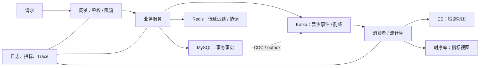

# 核心中间件面试题库（360 题）

> 本篇把“项目使用证据”和“通用原理延伸”分开。通用原理用于回答常见面试题，不等于当前项目已采用所有机制。

## 设计总线：先建立分布式系统的共同坐标

这 360 题不要按组件名孤立背诵。先用同一条链路组织它们：请求进入系统后，关系型数据库维护事务事实，缓存降低读取成本，消息队列解耦和削峰，搜索与时序存储服务不同读模型；协调、限流、网关和可观测性负责在故障与扩容时维持边界。每个中间件题都先回答它在这条链路中解决什么矛盾，再回答内部机制。

### 统一答题骨架

1. **职责与边界**：它保存的是事实、派生视图，还是传递事件？哪些问题不该由它解决？
2. **核心机制**：数据结构、读写路径、复制 / 提交协议和复杂度是什么？
3. **一致性与失败**：发生超时、重试、主从切换、重复或乱序时，数据语义是什么？
4. **容量与观测**：吞吐、P99、命中率、lag、连接、磁盘、GC / page fault 中哪些决定瓶颈？
5. **项目证据**：最后才说明该项目是否真的用到它、哪个链路用到；没有配置与运行数据就不报具体参数。

### 学习顺序

先掌握 MySQL（事实与事务）→ Redis（缓存一致性）→ Kafka（事件与消费语义）→ Elasticsearch / 时序库（派生读模型）→ Kubernetes / 网关 / 注册配置（运行控制面）→ 可观测与容量治理。这样后面的题目是对一条系统链路逐段加深，而不是 360 个互不相干的知识点。

## MySQL（40 题）

**项目证据：** `/Users/yaao/Documents/code/tcum-cmdb-global/common/datasource`；`/Users/yaao/Documents/code/tcum-cmdb-global/service/dao`

### MySQL-Q1. B+Tree 索引与回表的原理问题：它解决的核心问题、数据结构/协议和复杂度是什么？

**答案：** InnoDB 的聚簇索引和普通二级索引都采用 B+Tree；叶子节点分别保存整行和主键，因此二级索引查询可能需要回表。 回答时要把适用条件和不成立的边界一起讲清。

**分析：** 先讲机制，再讲成立条件；不要只背名词。 建议至少覆盖正确性、可用性、延迟、吞吐、资源成本五个维度，并说明降级或回滚方案。

### MySQL-Q2. B+Tree 索引与回表的项目应用问题：在当前项目链路里为什么使用它，位于哪里？

**答案：** InnoDB 的聚簇索引和普通二级索引都采用 B+Tree；叶子节点分别保存整行和主键，因此二级索引查询可能需要回表。 在本项目中只能确认存在相关代码或方案入口；具体部署形态、参数和是否启用高级能力必须继续查配置与运行数据。

**分析：** 只把本地代码或文稿能证明的使用方式说成项目事实。 建议至少覆盖正确性、可用性、延迟、吞吐、资源成本五个维度，并说明降级或回滚方案。

### MySQL-Q3. B+Tree 索引与回表的故障排查问题：出现延迟、错误、积压或不一致时怎样定位？

**答案：** InnoDB 的聚簇索引和普通二级索引都采用 B+Tree；叶子节点分别保存整行和主键，因此二级索引查询可能需要回表。 排查时先确认现象是否由该机制引起，再检查延迟、错误、队列/积压、资源和数据正确性，避免直接改参数。

**分析：** 按客户端、网络、服务端、存储与依赖逐层排查。 建议至少覆盖正确性、可用性、延迟、吞吐、资源成本五个维度，并说明降级或回滚方案。

### MySQL-Q4. B+Tree 索引与回表的性能与权衡问题：怎样压测、调参、扩容，替代方案是什么？

**答案：** InnoDB 的聚簇索引和普通二级索引都采用 B+Tree；叶子节点分别保存整行和主键，因此二级索引查询可能需要回表。 优化必须用基线压测与生产指标验证，并同时评估写放大、内存、网络、恢复时间和运维复杂度。

**分析：** 给出观测指标和实验方法，不编造线上参数。 建议至少覆盖正确性、可用性、延迟、吞吐、资源成本五个维度，并说明降级或回滚方案。

### MySQL-Q5. 联合索引与最左匹配的原理问题：它解决的核心问题、数据结构/协议和复杂度是什么？

**答案：** 联合索引按定义顺序排序，能否利用后续列取决于前导列是否形成连续可定位的范围；范围条件常会截断后续列的定位能力。 回答时要把适用条件和不成立的边界一起讲清。

**分析：** 先讲机制，再讲成立条件；不要只背名词。 建议至少覆盖正确性、可用性、延迟、吞吐、资源成本五个维度，并说明降级或回滚方案。

### MySQL-Q6. 联合索引与最左匹配的项目应用问题：在当前项目链路里为什么使用它，位于哪里？

**答案：** 联合索引按定义顺序排序，能否利用后续列取决于前导列是否形成连续可定位的范围；范围条件常会截断后续列的定位能力。 在本项目中只能确认存在相关代码或方案入口；具体部署形态、参数和是否启用高级能力必须继续查配置与运行数据。

**分析：** 只把本地代码或文稿能证明的使用方式说成项目事实。 建议至少覆盖正确性、可用性、延迟、吞吐、资源成本五个维度，并说明降级或回滚方案。

### MySQL-Q7. 联合索引与最左匹配的故障排查问题：出现延迟、错误、积压或不一致时怎样定位？

**答案：** 联合索引按定义顺序排序，能否利用后续列取决于前导列是否形成连续可定位的范围；范围条件常会截断后续列的定位能力。 排查时先确认现象是否由该机制引起，再检查延迟、错误、队列/积压、资源和数据正确性，避免直接改参数。

**分析：** 按客户端、网络、服务端、存储与依赖逐层排查。 建议至少覆盖正确性、可用性、延迟、吞吐、资源成本五个维度，并说明降级或回滚方案。

### MySQL-Q8. 联合索引与最左匹配的性能与权衡问题：怎样压测、调参、扩容，替代方案是什么？

**答案：** 联合索引按定义顺序排序，能否利用后续列取决于前导列是否形成连续可定位的范围；范围条件常会截断后续列的定位能力。 优化必须用基线压测与生产指标验证，并同时评估写放大、内存、网络、恢复时间和运维复杂度。

**分析：** 给出观测指标和实验方法，不编造线上参数。 建议至少覆盖正确性、可用性、延迟、吞吐、资源成本五个维度，并说明降级或回滚方案。

### MySQL-Q9. 覆盖索引的原理问题：它解决的核心问题、数据结构/协议和复杂度是什么？

**答案：** 覆盖索引让查询所需列全部位于索引中，减少回表随机 I/O，但会增加索引体积与写放大。 回答时要把适用条件和不成立的边界一起讲清。

**分析：** 先讲机制，再讲成立条件；不要只背名词。 建议至少覆盖正确性、可用性、延迟、吞吐、资源成本五个维度，并说明降级或回滚方案。

### MySQL-Q10. 覆盖索引的项目应用问题：在当前项目链路里为什么使用它，位于哪里？

**答案：** 覆盖索引让查询所需列全部位于索引中，减少回表随机 I/O，但会增加索引体积与写放大。 在本项目中只能确认存在相关代码或方案入口；具体部署形态、参数和是否启用高级能力必须继续查配置与运行数据。

**分析：** 只把本地代码或文稿能证明的使用方式说成项目事实。 建议至少覆盖正确性、可用性、延迟、吞吐、资源成本五个维度，并说明降级或回滚方案。

### MySQL-Q11. 覆盖索引的故障排查问题：出现延迟、错误、积压或不一致时怎样定位？

**答案：** 覆盖索引让查询所需列全部位于索引中，减少回表随机 I/O，但会增加索引体积与写放大。 排查时先确认现象是否由该机制引起，再检查延迟、错误、队列/积压、资源和数据正确性，避免直接改参数。

**分析：** 按客户端、网络、服务端、存储与依赖逐层排查。 建议至少覆盖正确性、可用性、延迟、吞吐、资源成本五个维度，并说明降级或回滚方案。

### MySQL-Q12. 覆盖索引的性能与权衡问题：怎样压测、调参、扩容，替代方案是什么？

**答案：** 覆盖索引让查询所需列全部位于索引中，减少回表随机 I/O，但会增加索引体积与写放大。 优化必须用基线压测与生产指标验证，并同时评估写放大、内存、网络、恢复时间和运维复杂度。

**分析：** 给出观测指标和实验方法，不编造线上参数。 建议至少覆盖正确性、可用性、延迟、吞吐、资源成本五个维度，并说明降级或回滚方案。

### MySQL-Q13. 事务 ACID的原理问题：它解决的核心问题、数据结构/协议和复杂度是什么？

**答案：** ACID 分别约束原子性、一致性、隔离性和持久性；InnoDB 通过 undo、锁/MVCC、redo 与刷盘协议协同实现。 回答时要把适用条件和不成立的边界一起讲清。

**分析：** 先讲机制，再讲成立条件；不要只背名词。 建议至少覆盖正确性、可用性、延迟、吞吐、资源成本五个维度，并说明降级或回滚方案。

### MySQL-Q14. 事务 ACID的项目应用问题：在当前项目链路里为什么使用它，位于哪里？

**答案：** ACID 分别约束原子性、一致性、隔离性和持久性；InnoDB 通过 undo、锁/MVCC、redo 与刷盘协议协同实现。 在本项目中只能确认存在相关代码或方案入口；具体部署形态、参数和是否启用高级能力必须继续查配置与运行数据。

**分析：** 只把本地代码或文稿能证明的使用方式说成项目事实。 建议至少覆盖正确性、可用性、延迟、吞吐、资源成本五个维度，并说明降级或回滚方案。

### MySQL-Q15. 事务 ACID的故障排查问题：出现延迟、错误、积压或不一致时怎样定位？

**答案：** ACID 分别约束原子性、一致性、隔离性和持久性；InnoDB 通过 undo、锁/MVCC、redo 与刷盘协议协同实现。 排查时先确认现象是否由该机制引起，再检查延迟、错误、队列/积压、资源和数据正确性，避免直接改参数。

**分析：** 按客户端、网络、服务端、存储与依赖逐层排查。 建议至少覆盖正确性、可用性、延迟、吞吐、资源成本五个维度，并说明降级或回滚方案。

### MySQL-Q16. 事务 ACID的性能与权衡问题：怎样压测、调参、扩容，替代方案是什么？

**答案：** ACID 分别约束原子性、一致性、隔离性和持久性；InnoDB 通过 undo、锁/MVCC、redo 与刷盘协议协同实现。 优化必须用基线压测与生产指标验证，并同时评估写放大、内存、网络、恢复时间和运维复杂度。

**分析：** 给出观测指标和实验方法，不编造线上参数。 建议至少覆盖正确性、可用性、延迟、吞吐、资源成本五个维度，并说明降级或回滚方案。

### MySQL-Q17. MVCC 与 ReadView的原理问题：它解决的核心问题、数据结构/协议和复杂度是什么？

**答案：** MVCC 通过隐藏事务版本、undo 版本链和 ReadView 做一致性读；长事务会拖住旧版本回收并放大存储与查询成本。 回答时要把适用条件和不成立的边界一起讲清。

**分析：** 先讲机制，再讲成立条件；不要只背名词。 建议至少覆盖正确性、可用性、延迟、吞吐、资源成本五个维度，并说明降级或回滚方案。

### MySQL-Q18. MVCC 与 ReadView的项目应用问题：在当前项目链路里为什么使用它，位于哪里？

**答案：** MVCC 通过隐藏事务版本、undo 版本链和 ReadView 做一致性读；长事务会拖住旧版本回收并放大存储与查询成本。 在本项目中只能确认存在相关代码或方案入口；具体部署形态、参数和是否启用高级能力必须继续查配置与运行数据。

**分析：** 只把本地代码或文稿能证明的使用方式说成项目事实。 建议至少覆盖正确性、可用性、延迟、吞吐、资源成本五个维度，并说明降级或回滚方案。

### MySQL-Q19. MVCC 与 ReadView的故障排查问题：出现延迟、错误、积压或不一致时怎样定位？

**答案：** MVCC 通过隐藏事务版本、undo 版本链和 ReadView 做一致性读；长事务会拖住旧版本回收并放大存储与查询成本。 排查时先确认现象是否由该机制引起，再检查延迟、错误、队列/积压、资源和数据正确性，避免直接改参数。

**分析：** 按客户端、网络、服务端、存储与依赖逐层排查。 建议至少覆盖正确性、可用性、延迟、吞吐、资源成本五个维度，并说明降级或回滚方案。

### MySQL-Q20. MVCC 与 ReadView的性能与权衡问题：怎样压测、调参、扩容，替代方案是什么？

**答案：** MVCC 通过隐藏事务版本、undo 版本链和 ReadView 做一致性读；长事务会拖住旧版本回收并放大存储与查询成本。 优化必须用基线压测与生产指标验证，并同时评估写放大、内存、网络、恢复时间和运维复杂度。

**分析：** 给出观测指标和实验方法，不编造线上参数。 建议至少覆盖正确性、可用性、延迟、吞吐、资源成本五个维度，并说明降级或回滚方案。

### MySQL-Q21. 隔离级别的原理问题：它解决的核心问题、数据结构/协议和复杂度是什么？

**答案：** 读未提交、读已提交、可重复读、串行化在并发异常和吞吐之间权衡；InnoDB 的可重复读结合 MVCC 与间隙/临键锁。 回答时要把适用条件和不成立的边界一起讲清。

**分析：** 先讲机制，再讲成立条件；不要只背名词。 建议至少覆盖正确性、可用性、延迟、吞吐、资源成本五个维度，并说明降级或回滚方案。

### MySQL-Q22. 隔离级别的项目应用问题：在当前项目链路里为什么使用它，位于哪里？

**答案：** 读未提交、读已提交、可重复读、串行化在并发异常和吞吐之间权衡；InnoDB 的可重复读结合 MVCC 与间隙/临键锁。 在本项目中只能确认存在相关代码或方案入口；具体部署形态、参数和是否启用高级能力必须继续查配置与运行数据。

**分析：** 只把本地代码或文稿能证明的使用方式说成项目事实。 建议至少覆盖正确性、可用性、延迟、吞吐、资源成本五个维度，并说明降级或回滚方案。

### MySQL-Q23. 隔离级别的故障排查问题：出现延迟、错误、积压或不一致时怎样定位？

**答案：** 读未提交、读已提交、可重复读、串行化在并发异常和吞吐之间权衡；InnoDB 的可重复读结合 MVCC 与间隙/临键锁。 排查时先确认现象是否由该机制引起，再检查延迟、错误、队列/积压、资源和数据正确性，避免直接改参数。

**分析：** 按客户端、网络、服务端、存储与依赖逐层排查。 建议至少覆盖正确性、可用性、延迟、吞吐、资源成本五个维度，并说明降级或回滚方案。

### MySQL-Q24. 隔离级别的性能与权衡问题：怎样压测、调参、扩容，替代方案是什么？

**答案：** 读未提交、读已提交、可重复读、串行化在并发异常和吞吐之间权衡；InnoDB 的可重复读结合 MVCC 与间隙/临键锁。 优化必须用基线压测与生产指标验证，并同时评估写放大、内存、网络、恢复时间和运维复杂度。

**分析：** 给出观测指标和实验方法，不编造线上参数。 建议至少覆盖正确性、可用性、延迟、吞吐、资源成本五个维度，并说明降级或回滚方案。

### MySQL-Q25. 锁与死锁的原理问题：它解决的核心问题、数据结构/协议和复杂度是什么？

**答案：** 死锁是事务间形成等待环，数据库检测后回滚代价较小的事务；固定加锁顺序、缩短事务和建立合适索引可降低概率。 回答时要把适用条件和不成立的边界一起讲清。

**分析：** 先讲机制，再讲成立条件；不要只背名词。 建议至少覆盖正确性、可用性、延迟、吞吐、资源成本五个维度，并说明降级或回滚方案。

### MySQL-Q26. 锁与死锁的项目应用问题：在当前项目链路里为什么使用它，位于哪里？

**答案：** 死锁是事务间形成等待环，数据库检测后回滚代价较小的事务；固定加锁顺序、缩短事务和建立合适索引可降低概率。 在本项目中只能确认存在相关代码或方案入口；具体部署形态、参数和是否启用高级能力必须继续查配置与运行数据。

**分析：** 只把本地代码或文稿能证明的使用方式说成项目事实。 建议至少覆盖正确性、可用性、延迟、吞吐、资源成本五个维度，并说明降级或回滚方案。

### MySQL-Q27. 锁与死锁的故障排查问题：出现延迟、错误、积压或不一致时怎样定位？

**答案：** 死锁是事务间形成等待环，数据库检测后回滚代价较小的事务；固定加锁顺序、缩短事务和建立合适索引可降低概率。 排查时先确认现象是否由该机制引起，再检查延迟、错误、队列/积压、资源和数据正确性，避免直接改参数。

**分析：** 按客户端、网络、服务端、存储与依赖逐层排查。 建议至少覆盖正确性、可用性、延迟、吞吐、资源成本五个维度，并说明降级或回滚方案。

### MySQL-Q28. 锁与死锁的性能与权衡问题：怎样压测、调参、扩容，替代方案是什么？

**答案：** 死锁是事务间形成等待环，数据库检测后回滚代价较小的事务；固定加锁顺序、缩短事务和建立合适索引可降低概率。 优化必须用基线压测与生产指标验证，并同时评估写放大、内存、网络、恢复时间和运维复杂度。

**分析：** 给出观测指标和实验方法，不编造线上参数。 建议至少覆盖正确性、可用性、延迟、吞吐、资源成本五个维度，并说明降级或回滚方案。

### MySQL-Q29. redo/undo/binlog的原理问题：它解决的核心问题、数据结构/协议和复杂度是什么？

**答案：** redo 保证崩溃恢复，undo 支持回滚和 MVCC，binlog 服务复制与时间点恢复；两阶段提交用于协调 redo 与 binlog。 回答时要把适用条件和不成立的边界一起讲清。

**分析：** 先讲机制，再讲成立条件；不要只背名词。 建议至少覆盖正确性、可用性、延迟、吞吐、资源成本五个维度，并说明降级或回滚方案。

### MySQL-Q30. redo/undo/binlog的项目应用问题：在当前项目链路里为什么使用它，位于哪里？

**答案：** redo 保证崩溃恢复，undo 支持回滚和 MVCC，binlog 服务复制与时间点恢复；两阶段提交用于协调 redo 与 binlog。 在本项目中只能确认存在相关代码或方案入口；具体部署形态、参数和是否启用高级能力必须继续查配置与运行数据。

**分析：** 只把本地代码或文稿能证明的使用方式说成项目事实。 建议至少覆盖正确性、可用性、延迟、吞吐、资源成本五个维度，并说明降级或回滚方案。

### MySQL-Q31. redo/undo/binlog的故障排查问题：出现延迟、错误、积压或不一致时怎样定位？

**答案：** redo 保证崩溃恢复，undo 支持回滚和 MVCC，binlog 服务复制与时间点恢复；两阶段提交用于协调 redo 与 binlog。 排查时先确认现象是否由该机制引起，再检查延迟、错误、队列/积压、资源和数据正确性，避免直接改参数。

**分析：** 按客户端、网络、服务端、存储与依赖逐层排查。 建议至少覆盖正确性、可用性、延迟、吞吐、资源成本五个维度，并说明降级或回滚方案。

### MySQL-Q32. redo/undo/binlog的性能与权衡问题：怎样压测、调参、扩容，替代方案是什么？

**答案：** redo 保证崩溃恢复，undo 支持回滚和 MVCC，binlog 服务复制与时间点恢复；两阶段提交用于协调 redo 与 binlog。 优化必须用基线压测与生产指标验证，并同时评估写放大、内存、网络、恢复时间和运维复杂度。

**分析：** 给出观测指标和实验方法，不编造线上参数。 建议至少覆盖正确性、可用性、延迟、吞吐、资源成本五个维度，并说明降级或回滚方案。

### MySQL-Q33. 主从复制的原理问题：它解决的核心问题、数据结构/协议和复杂度是什么？

**答案：** 复制通常由主库写 binlog、从库拉取并回放；异步复制存在延迟窗口，读写分离必须处理读己之写和故障切换。 回答时要把适用条件和不成立的边界一起讲清。

**分析：** 先讲机制，再讲成立条件；不要只背名词。 建议至少覆盖正确性、可用性、延迟、吞吐、资源成本五个维度，并说明降级或回滚方案。

### MySQL-Q34. 主从复制的项目应用问题：在当前项目链路里为什么使用它，位于哪里？

**答案：** 复制通常由主库写 binlog、从库拉取并回放；异步复制存在延迟窗口，读写分离必须处理读己之写和故障切换。 在本项目中只能确认存在相关代码或方案入口；具体部署形态、参数和是否启用高级能力必须继续查配置与运行数据。

**分析：** 只把本地代码或文稿能证明的使用方式说成项目事实。 建议至少覆盖正确性、可用性、延迟、吞吐、资源成本五个维度，并说明降级或回滚方案。

### MySQL-Q35. 主从复制的故障排查问题：出现延迟、错误、积压或不一致时怎样定位？

**答案：** 复制通常由主库写 binlog、从库拉取并回放；异步复制存在延迟窗口，读写分离必须处理读己之写和故障切换。 排查时先确认现象是否由该机制引起，再检查延迟、错误、队列/积压、资源和数据正确性，避免直接改参数。

**分析：** 按客户端、网络、服务端、存储与依赖逐层排查。 建议至少覆盖正确性、可用性、延迟、吞吐、资源成本五个维度，并说明降级或回滚方案。

### MySQL-Q36. 主从复制的性能与权衡问题：怎样压测、调参、扩容，替代方案是什么？

**答案：** 复制通常由主库写 binlog、从库拉取并回放；异步复制存在延迟窗口，读写分离必须处理读己之写和故障切换。 优化必须用基线压测与生产指标验证，并同时评估写放大、内存、网络、恢复时间和运维复杂度。

**分析：** 给出观测指标和实验方法，不编造线上参数。 建议至少覆盖正确性、可用性、延迟、吞吐、资源成本五个维度，并说明降级或回滚方案。

### MySQL-Q37. 慢查询优化的原理问题：它解决的核心问题、数据结构/协议和复杂度是什么？

**答案：** 慢查询优化先用执行计划确认访问类型、估算行数、索引与临时/排序，再检查数据分布、锁等待、I/O 和应用调用方式。 回答时要把适用条件和不成立的边界一起讲清。

**分析：** 先讲机制，再讲成立条件；不要只背名词。 建议至少覆盖正确性、可用性、延迟、吞吐、资源成本五个维度，并说明降级或回滚方案。

### MySQL-Q38. 慢查询优化的项目应用问题：在当前项目链路里为什么使用它，位于哪里？

**答案：** 慢查询优化先用执行计划确认访问类型、估算行数、索引与临时/排序，再检查数据分布、锁等待、I/O 和应用调用方式。 在本项目中只能确认存在相关代码或方案入口；具体部署形态、参数和是否启用高级能力必须继续查配置与运行数据。

**分析：** 只把本地代码或文稿能证明的使用方式说成项目事实。 建议至少覆盖正确性、可用性、延迟、吞吐、资源成本五个维度，并说明降级或回滚方案。

### MySQL-Q39. 慢查询优化的故障排查问题：出现延迟、错误、积压或不一致时怎样定位？

**答案：** 慢查询优化先用执行计划确认访问类型、估算行数、索引与临时/排序，再检查数据分布、锁等待、I/O 和应用调用方式。 排查时先确认现象是否由该机制引起，再检查延迟、错误、队列/积压、资源和数据正确性，避免直接改参数。

**分析：** 按客户端、网络、服务端、存储与依赖逐层排查。 建议至少覆盖正确性、可用性、延迟、吞吐、资源成本五个维度，并说明降级或回滚方案。

### MySQL-Q40. 慢查询优化的性能与权衡问题：怎样压测、调参、扩容，替代方案是什么？

**答案：** 慢查询优化先用执行计划确认访问类型、估算行数、索引与临时/排序，再检查数据分布、锁等待、I/O 和应用调用方式。 优化必须用基线压测与生产指标验证，并同时评估写放大、内存、网络、恢复时间和运维复杂度。

**分析：** 给出观测指标和实验方法，不编造线上参数。 建议至少覆盖正确性、可用性、延迟、吞吐、资源成本五个维度，并说明降级或回滚方案。

## Redis（40 题）

**项目证据：** `/Users/yaao/Documents/code/tcum-cmdb-global/common/cache`；`/Users/yaao/Documents/code/tcum-ai/pkg/cache`

### Redis-Q1. 数据结构选择的原理问题：它解决的核心问题、数据结构/协议和复杂度是什么？

**答案：** String、Hash、List、Set、ZSet、Stream 的选择取决于访问模式；数据结构错误会导致额外序列化、扫描或内存开销。 回答时要把适用条件和不成立的边界一起讲清。

**分析：** 先讲机制，再讲成立条件；不要只背名词。 建议至少覆盖正确性、可用性、延迟、吞吐、资源成本五个维度，并说明降级或回滚方案。

### Redis-Q2. 数据结构选择的项目应用问题：在当前项目链路里为什么使用它，位于哪里？

**答案：** String、Hash、List、Set、ZSet、Stream 的选择取决于访问模式；数据结构错误会导致额外序列化、扫描或内存开销。 在本项目中只能确认存在相关代码或方案入口；具体部署形态、参数和是否启用高级能力必须继续查配置与运行数据。

**分析：** 只把本地代码或文稿能证明的使用方式说成项目事实。 建议至少覆盖正确性、可用性、延迟、吞吐、资源成本五个维度，并说明降级或回滚方案。

### Redis-Q3. 数据结构选择的故障排查问题：出现延迟、错误、积压或不一致时怎样定位？

**答案：** String、Hash、List、Set、ZSet、Stream 的选择取决于访问模式；数据结构错误会导致额外序列化、扫描或内存开销。 排查时先确认现象是否由该机制引起，再检查延迟、错误、队列/积压、资源和数据正确性，避免直接改参数。

**分析：** 按客户端、网络、服务端、存储与依赖逐层排查。 建议至少覆盖正确性、可用性、延迟、吞吐、资源成本五个维度，并说明降级或回滚方案。

### Redis-Q4. 数据结构选择的性能与权衡问题：怎样压测、调参、扩容，替代方案是什么？

**答案：** String、Hash、List、Set、ZSet、Stream 的选择取决于访问模式；数据结构错误会导致额外序列化、扫描或内存开销。 优化必须用基线压测与生产指标验证，并同时评估写放大、内存、网络、恢复时间和运维复杂度。

**分析：** 给出观测指标和实验方法，不编造线上参数。 建议至少覆盖正确性、可用性、延迟、吞吐、资源成本五个维度，并说明降级或回滚方案。

### Redis-Q5. 单线程与 I/O 多路复用的原理问题：它解决的核心问题、数据结构/协议和复杂度是什么？

**答案：** 命令执行主路径串行化简化并发控制，网络 I/O 由事件循环复用；慢命令、大 Key 和 fork 仍会阻塞整体延迟。 回答时要把适用条件和不成立的边界一起讲清。

**分析：** 先讲机制，再讲成立条件；不要只背名词。 建议至少覆盖正确性、可用性、延迟、吞吐、资源成本五个维度，并说明降级或回滚方案。

### Redis-Q6. 单线程与 I/O 多路复用的项目应用问题：在当前项目链路里为什么使用它，位于哪里？

**答案：** 命令执行主路径串行化简化并发控制，网络 I/O 由事件循环复用；慢命令、大 Key 和 fork 仍会阻塞整体延迟。 在本项目中只能确认存在相关代码或方案入口；具体部署形态、参数和是否启用高级能力必须继续查配置与运行数据。

**分析：** 只把本地代码或文稿能证明的使用方式说成项目事实。 建议至少覆盖正确性、可用性、延迟、吞吐、资源成本五个维度，并说明降级或回滚方案。

### Redis-Q7. 单线程与 I/O 多路复用的故障排查问题：出现延迟、错误、积压或不一致时怎样定位？

**答案：** 命令执行主路径串行化简化并发控制，网络 I/O 由事件循环复用；慢命令、大 Key 和 fork 仍会阻塞整体延迟。 排查时先确认现象是否由该机制引起，再检查延迟、错误、队列/积压、资源和数据正确性，避免直接改参数。

**分析：** 按客户端、网络、服务端、存储与依赖逐层排查。 建议至少覆盖正确性、可用性、延迟、吞吐、资源成本五个维度，并说明降级或回滚方案。

### Redis-Q8. 单线程与 I/O 多路复用的性能与权衡问题：怎样压测、调参、扩容，替代方案是什么？

**答案：** 命令执行主路径串行化简化并发控制，网络 I/O 由事件循环复用；慢命令、大 Key 和 fork 仍会阻塞整体延迟。 优化必须用基线压测与生产指标验证，并同时评估写放大、内存、网络、恢复时间和运维复杂度。

**分析：** 给出观测指标和实验方法，不编造线上参数。 建议至少覆盖正确性、可用性、延迟、吞吐、资源成本五个维度，并说明降级或回滚方案。

### Redis-Q9. RDB/AOF的原理问题：它解决的核心问题、数据结构/协议和复杂度是什么？

**答案：** RDB 是时间点快照，恢复快但可能丢失最近数据；AOF 记录写命令，数据更完整但体积和重写成本更高，生产常组合使用。 回答时要把适用条件和不成立的边界一起讲清。

**分析：** 先讲机制，再讲成立条件；不要只背名词。 建议至少覆盖正确性、可用性、延迟、吞吐、资源成本五个维度，并说明降级或回滚方案。

### Redis-Q10. RDB/AOF的项目应用问题：在当前项目链路里为什么使用它，位于哪里？

**答案：** RDB 是时间点快照，恢复快但可能丢失最近数据；AOF 记录写命令，数据更完整但体积和重写成本更高，生产常组合使用。 在本项目中只能确认存在相关代码或方案入口；具体部署形态、参数和是否启用高级能力必须继续查配置与运行数据。

**分析：** 只把本地代码或文稿能证明的使用方式说成项目事实。 建议至少覆盖正确性、可用性、延迟、吞吐、资源成本五个维度，并说明降级或回滚方案。

### Redis-Q11. RDB/AOF的故障排查问题：出现延迟、错误、积压或不一致时怎样定位？

**答案：** RDB 是时间点快照，恢复快但可能丢失最近数据；AOF 记录写命令，数据更完整但体积和重写成本更高，生产常组合使用。 排查时先确认现象是否由该机制引起，再检查延迟、错误、队列/积压、资源和数据正确性，避免直接改参数。

**分析：** 按客户端、网络、服务端、存储与依赖逐层排查。 建议至少覆盖正确性、可用性、延迟、吞吐、资源成本五个维度，并说明降级或回滚方案。

### Redis-Q12. RDB/AOF的性能与权衡问题：怎样压测、调参、扩容，替代方案是什么？

**答案：** RDB 是时间点快照，恢复快但可能丢失最近数据；AOF 记录写命令，数据更完整但体积和重写成本更高，生产常组合使用。 优化必须用基线压测与生产指标验证，并同时评估写放大、内存、网络、恢复时间和运维复杂度。

**分析：** 给出观测指标和实验方法，不编造线上参数。 建议至少覆盖正确性、可用性、延迟、吞吐、资源成本五个维度，并说明降级或回滚方案。

### Redis-Q13. 主从复制的原理问题：它解决的核心问题、数据结构/协议和复杂度是什么？

**答案：** 主从复制用于读扩展和高可用基础，但异步复制可能丢失尚未同步的数据，复制积压缓冲区影响断线续传能力。 回答时要把适用条件和不成立的边界一起讲清。

**分析：** 先讲机制，再讲成立条件；不要只背名词。 建议至少覆盖正确性、可用性、延迟、吞吐、资源成本五个维度，并说明降级或回滚方案。

### Redis-Q14. 主从复制的项目应用问题：在当前项目链路里为什么使用它，位于哪里？

**答案：** 主从复制用于读扩展和高可用基础，但异步复制可能丢失尚未同步的数据，复制积压缓冲区影响断线续传能力。 在本项目中只能确认存在相关代码或方案入口；具体部署形态、参数和是否启用高级能力必须继续查配置与运行数据。

**分析：** 只把本地代码或文稿能证明的使用方式说成项目事实。 建议至少覆盖正确性、可用性、延迟、吞吐、资源成本五个维度，并说明降级或回滚方案。

### Redis-Q15. 主从复制的故障排查问题：出现延迟、错误、积压或不一致时怎样定位？

**答案：** 主从复制用于读扩展和高可用基础，但异步复制可能丢失尚未同步的数据，复制积压缓冲区影响断线续传能力。 排查时先确认现象是否由该机制引起，再检查延迟、错误、队列/积压、资源和数据正确性，避免直接改参数。

**分析：** 按客户端、网络、服务端、存储与依赖逐层排查。 建议至少覆盖正确性、可用性、延迟、吞吐、资源成本五个维度，并说明降级或回滚方案。

### Redis-Q16. 主从复制的性能与权衡问题：怎样压测、调参、扩容，替代方案是什么？

**答案：** 主从复制用于读扩展和高可用基础，但异步复制可能丢失尚未同步的数据，复制积压缓冲区影响断线续传能力。 优化必须用基线压测与生产指标验证，并同时评估写放大、内存、网络、恢复时间和运维复杂度。

**分析：** 给出观测指标和实验方法，不编造线上参数。 建议至少覆盖正确性、可用性、延迟、吞吐、资源成本五个维度，并说明降级或回滚方案。

### Redis-Q17. Sentinel的原理问题：它解决的核心问题、数据结构/协议和复杂度是什么？

**答案：** Sentinel 通过监控、主观/客观下线、选主和客户端通知完成故障转移；仍需考虑脑裂和最小副本写入约束。 回答时要把适用条件和不成立的边界一起讲清。

**分析：** 先讲机制，再讲成立条件；不要只背名词。 建议至少覆盖正确性、可用性、延迟、吞吐、资源成本五个维度，并说明降级或回滚方案。

### Redis-Q18. Sentinel的项目应用问题：在当前项目链路里为什么使用它，位于哪里？

**答案：** Sentinel 通过监控、主观/客观下线、选主和客户端通知完成故障转移；仍需考虑脑裂和最小副本写入约束。 在本项目中只能确认存在相关代码或方案入口；具体部署形态、参数和是否启用高级能力必须继续查配置与运行数据。

**分析：** 只把本地代码或文稿能证明的使用方式说成项目事实。 建议至少覆盖正确性、可用性、延迟、吞吐、资源成本五个维度，并说明降级或回滚方案。

### Redis-Q19. Sentinel的故障排查问题：出现延迟、错误、积压或不一致时怎样定位？

**答案：** Sentinel 通过监控、主观/客观下线、选主和客户端通知完成故障转移；仍需考虑脑裂和最小副本写入约束。 排查时先确认现象是否由该机制引起，再检查延迟、错误、队列/积压、资源和数据正确性，避免直接改参数。

**分析：** 按客户端、网络、服务端、存储与依赖逐层排查。 建议至少覆盖正确性、可用性、延迟、吞吐、资源成本五个维度，并说明降级或回滚方案。

### Redis-Q20. Sentinel的性能与权衡问题：怎样压测、调参、扩容，替代方案是什么？

**答案：** Sentinel 通过监控、主观/客观下线、选主和客户端通知完成故障转移；仍需考虑脑裂和最小副本写入约束。 优化必须用基线压测与生产指标验证，并同时评估写放大、内存、网络、恢复时间和运维复杂度。

**分析：** 给出观测指标和实验方法，不编造线上参数。 建议至少覆盖正确性、可用性、延迟、吞吐、资源成本五个维度，并说明降级或回滚方案。

### Redis-Q21. Cluster 槽位的原理问题：它解决的核心问题、数据结构/协议和复杂度是什么？

**答案：** Redis Cluster 将 16384 个槽分配给节点，客户端按槽路由；扩缩容迁槽期间需处理 ASK/MOVED 和热点槽。 回答时要把适用条件和不成立的边界一起讲清。

**分析：** 先讲机制，再讲成立条件；不要只背名词。 建议至少覆盖正确性、可用性、延迟、吞吐、资源成本五个维度，并说明降级或回滚方案。

### Redis-Q22. Cluster 槽位的项目应用问题：在当前项目链路里为什么使用它，位于哪里？

**答案：** Redis Cluster 将 16384 个槽分配给节点，客户端按槽路由；扩缩容迁槽期间需处理 ASK/MOVED 和热点槽。 在本项目中只能确认存在相关代码或方案入口；具体部署形态、参数和是否启用高级能力必须继续查配置与运行数据。

**分析：** 只把本地代码或文稿能证明的使用方式说成项目事实。 建议至少覆盖正确性、可用性、延迟、吞吐、资源成本五个维度，并说明降级或回滚方案。

### Redis-Q23. Cluster 槽位的故障排查问题：出现延迟、错误、积压或不一致时怎样定位？

**答案：** Redis Cluster 将 16384 个槽分配给节点，客户端按槽路由；扩缩容迁槽期间需处理 ASK/MOVED 和热点槽。 排查时先确认现象是否由该机制引起，再检查延迟、错误、队列/积压、资源和数据正确性，避免直接改参数。

**分析：** 按客户端、网络、服务端、存储与依赖逐层排查。 建议至少覆盖正确性、可用性、延迟、吞吐、资源成本五个维度，并说明降级或回滚方案。

### Redis-Q24. Cluster 槽位的性能与权衡问题：怎样压测、调参、扩容，替代方案是什么？

**答案：** Redis Cluster 将 16384 个槽分配给节点，客户端按槽路由；扩缩容迁槽期间需处理 ASK/MOVED 和热点槽。 优化必须用基线压测与生产指标验证，并同时评估写放大、内存、网络、恢复时间和运维复杂度。

**分析：** 给出观测指标和实验方法，不编造线上参数。 建议至少覆盖正确性、可用性、延迟、吞吐、资源成本五个维度，并说明降级或回滚方案。

### Redis-Q25. 缓存穿透击穿雪崩的原理问题：它解决的核心问题、数据结构/协议和复杂度是什么？

**答案：** 穿透可用空值/布隆过滤，击穿可用互斥或逻辑过期，雪崩通过 TTL 抖动、限流和多级缓存治理。 回答时要把适用条件和不成立的边界一起讲清。

**分析：** 先讲机制，再讲成立条件；不要只背名词。 建议至少覆盖正确性、可用性、延迟、吞吐、资源成本五个维度，并说明降级或回滚方案。

### Redis-Q26. 缓存穿透击穿雪崩的项目应用问题：在当前项目链路里为什么使用它，位于哪里？

**答案：** 穿透可用空值/布隆过滤，击穿可用互斥或逻辑过期，雪崩通过 TTL 抖动、限流和多级缓存治理。 在本项目中只能确认存在相关代码或方案入口；具体部署形态、参数和是否启用高级能力必须继续查配置与运行数据。

**分析：** 只把本地代码或文稿能证明的使用方式说成项目事实。 建议至少覆盖正确性、可用性、延迟、吞吐、资源成本五个维度，并说明降级或回滚方案。

### Redis-Q27. 缓存穿透击穿雪崩的故障排查问题：出现延迟、错误、积压或不一致时怎样定位？

**答案：** 穿透可用空值/布隆过滤，击穿可用互斥或逻辑过期，雪崩通过 TTL 抖动、限流和多级缓存治理。 排查时先确认现象是否由该机制引起，再检查延迟、错误、队列/积压、资源和数据正确性，避免直接改参数。

**分析：** 按客户端、网络、服务端、存储与依赖逐层排查。 建议至少覆盖正确性、可用性、延迟、吞吐、资源成本五个维度，并说明降级或回滚方案。

### Redis-Q28. 缓存穿透击穿雪崩的性能与权衡问题：怎样压测、调参、扩容，替代方案是什么？

**答案：** 穿透可用空值/布隆过滤，击穿可用互斥或逻辑过期，雪崩通过 TTL 抖动、限流和多级缓存治理。 优化必须用基线压测与生产指标验证，并同时评估写放大、内存、网络、恢复时间和运维复杂度。

**分析：** 给出观测指标和实验方法，不编造线上参数。 建议至少覆盖正确性、可用性、延迟、吞吐、资源成本五个维度，并说明降级或回滚方案。

### Redis-Q29. 分布式锁的原理问题：它解决的核心问题、数据结构/协议和复杂度是什么？

**答案：** 分布式锁至少需要唯一持有者标识、原子加锁与校验删除、租约续期和 fencing token；仅 SETNX+过期不足以覆盖所有故障。 回答时要把适用条件和不成立的边界一起讲清。

**分析：** 先讲机制，再讲成立条件；不要只背名词。 建议至少覆盖正确性、可用性、延迟、吞吐、资源成本五个维度，并说明降级或回滚方案。

### Redis-Q30. 分布式锁的项目应用问题：在当前项目链路里为什么使用它，位于哪里？

**答案：** 分布式锁至少需要唯一持有者标识、原子加锁与校验删除、租约续期和 fencing token；仅 SETNX+过期不足以覆盖所有故障。 在本项目中只能确认存在相关代码或方案入口；具体部署形态、参数和是否启用高级能力必须继续查配置与运行数据。

**分析：** 只把本地代码或文稿能证明的使用方式说成项目事实。 建议至少覆盖正确性、可用性、延迟、吞吐、资源成本五个维度，并说明降级或回滚方案。

### Redis-Q31. 分布式锁的故障排查问题：出现延迟、错误、积压或不一致时怎样定位？

**答案：** 分布式锁至少需要唯一持有者标识、原子加锁与校验删除、租约续期和 fencing token；仅 SETNX+过期不足以覆盖所有故障。 排查时先确认现象是否由该机制引起，再检查延迟、错误、队列/积压、资源和数据正确性，避免直接改参数。

**分析：** 按客户端、网络、服务端、存储与依赖逐层排查。 建议至少覆盖正确性、可用性、延迟、吞吐、资源成本五个维度，并说明降级或回滚方案。

### Redis-Q32. 分布式锁的性能与权衡问题：怎样压测、调参、扩容，替代方案是什么？

**答案：** 分布式锁至少需要唯一持有者标识、原子加锁与校验删除、租约续期和 fencing token；仅 SETNX+过期不足以覆盖所有故障。 优化必须用基线压测与生产指标验证，并同时评估写放大、内存、网络、恢复时间和运维复杂度。

**分析：** 给出观测指标和实验方法，不编造线上参数。 建议至少覆盖正确性、可用性、延迟、吞吐、资源成本五个维度，并说明降级或回滚方案。

### Redis-Q33. 热点 Key的原理问题：它解决的核心问题、数据结构/协议和复杂度是什么？

**答案：** 热点 Key 会集中 CPU、网络和带宽；可通过本地缓存、读副本、Key 拆分和请求合并缓解，但要处理一致性。 回答时要把适用条件和不成立的边界一起讲清。

**分析：** 先讲机制，再讲成立条件；不要只背名词。 建议至少覆盖正确性、可用性、延迟、吞吐、资源成本五个维度，并说明降级或回滚方案。

### Redis-Q34. 热点 Key的项目应用问题：在当前项目链路里为什么使用它，位于哪里？

**答案：** 热点 Key 会集中 CPU、网络和带宽；可通过本地缓存、读副本、Key 拆分和请求合并缓解，但要处理一致性。 在本项目中只能确认存在相关代码或方案入口；具体部署形态、参数和是否启用高级能力必须继续查配置与运行数据。

**分析：** 只把本地代码或文稿能证明的使用方式说成项目事实。 建议至少覆盖正确性、可用性、延迟、吞吐、资源成本五个维度，并说明降级或回滚方案。

### Redis-Q35. 热点 Key的故障排查问题：出现延迟、错误、积压或不一致时怎样定位？

**答案：** 热点 Key 会集中 CPU、网络和带宽；可通过本地缓存、读副本、Key 拆分和请求合并缓解，但要处理一致性。 排查时先确认现象是否由该机制引起，再检查延迟、错误、队列/积压、资源和数据正确性，避免直接改参数。

**分析：** 按客户端、网络、服务端、存储与依赖逐层排查。 建议至少覆盖正确性、可用性、延迟、吞吐、资源成本五个维度，并说明降级或回滚方案。

### Redis-Q36. 热点 Key的性能与权衡问题：怎样压测、调参、扩容，替代方案是什么？

**答案：** 热点 Key 会集中 CPU、网络和带宽；可通过本地缓存、读副本、Key 拆分和请求合并缓解，但要处理一致性。 优化必须用基线压测与生产指标验证，并同时评估写放大、内存、网络、恢复时间和运维复杂度。

**分析：** 给出观测指标和实验方法，不编造线上参数。 建议至少覆盖正确性、可用性、延迟、吞吐、资源成本五个维度，并说明降级或回滚方案。

### Redis-Q37. 内存淘汰的原理问题：它解决的核心问题、数据结构/协议和复杂度是什么？

**答案：** 淘汰策略决定内存满时从全量或带 TTL 集合中按 LRU/LFU/随机选择；生产应先控制 maxmemory、Key 大小和过期分布。 回答时要把适用条件和不成立的边界一起讲清。

**分析：** 先讲机制，再讲成立条件；不要只背名词。 建议至少覆盖正确性、可用性、延迟、吞吐、资源成本五个维度，并说明降级或回滚方案。

### Redis-Q38. 内存淘汰的项目应用问题：在当前项目链路里为什么使用它，位于哪里？

**答案：** 淘汰策略决定内存满时从全量或带 TTL 集合中按 LRU/LFU/随机选择；生产应先控制 maxmemory、Key 大小和过期分布。 在本项目中只能确认存在相关代码或方案入口；具体部署形态、参数和是否启用高级能力必须继续查配置与运行数据。

**分析：** 只把本地代码或文稿能证明的使用方式说成项目事实。 建议至少覆盖正确性、可用性、延迟、吞吐、资源成本五个维度，并说明降级或回滚方案。

### Redis-Q39. 内存淘汰的故障排查问题：出现延迟、错误、积压或不一致时怎样定位？

**答案：** 淘汰策略决定内存满时从全量或带 TTL 集合中按 LRU/LFU/随机选择；生产应先控制 maxmemory、Key 大小和过期分布。 排查时先确认现象是否由该机制引起，再检查延迟、错误、队列/积压、资源和数据正确性，避免直接改参数。

**分析：** 按客户端、网络、服务端、存储与依赖逐层排查。 建议至少覆盖正确性、可用性、延迟、吞吐、资源成本五个维度，并说明降级或回滚方案。

### Redis-Q40. 内存淘汰的性能与权衡问题：怎样压测、调参、扩容，替代方案是什么？

**答案：** 淘汰策略决定内存满时从全量或带 TTL 集合中按 LRU/LFU/随机选择；生产应先控制 maxmemory、Key 大小和过期分布。 优化必须用基线压测与生产指标验证，并同时评估写放大、内存、网络、恢复时间和运维复杂度。

**分析：** 给出观测指标和实验方法，不编造线上参数。 建议至少覆盖正确性、可用性、延迟、吞吐、资源成本五个维度，并说明降级或回滚方案。

## Kafka（40 题）

**项目证据：** `/Users/yaao/Documents/code/unified-gateway/internal/kafka`；`/Users/yaao/Documents/code/tcum-cmdb-global/service/kafka`

### Kafka-Q1. 分区与顺序的原理问题：它解决的核心问题、数据结构/协议和复杂度是什么？

**答案：** 单分区内按追加日志保证顺序，跨分区没有全局顺序；业务键决定分区，因此顺序需求和负载均衡存在权衡。 回答时要把适用条件和不成立的边界一起讲清。

**分析：** 先讲机制，再讲成立条件；不要只背名词。 建议至少覆盖正确性、可用性、延迟、吞吐、资源成本五个维度，并说明降级或回滚方案。

### Kafka-Q2. 分区与顺序的项目应用问题：在当前项目链路里为什么使用它，位于哪里？

**答案：** 单分区内按追加日志保证顺序，跨分区没有全局顺序；业务键决定分区，因此顺序需求和负载均衡存在权衡。 在本项目中只能确认存在相关代码或方案入口；具体部署形态、参数和是否启用高级能力必须继续查配置与运行数据。

**分析：** 只把本地代码或文稿能证明的使用方式说成项目事实。 建议至少覆盖正确性、可用性、延迟、吞吐、资源成本五个维度，并说明降级或回滚方案。

### Kafka-Q3. 分区与顺序的故障排查问题：出现延迟、错误、积压或不一致时怎样定位？

**答案：** 单分区内按追加日志保证顺序，跨分区没有全局顺序；业务键决定分区，因此顺序需求和负载均衡存在权衡。 排查时先确认现象是否由该机制引起，再检查延迟、错误、队列/积压、资源和数据正确性，避免直接改参数。

**分析：** 按客户端、网络、服务端、存储与依赖逐层排查。 建议至少覆盖正确性、可用性、延迟、吞吐、资源成本五个维度，并说明降级或回滚方案。

### Kafka-Q4. 分区与顺序的性能与权衡问题：怎样压测、调参、扩容，替代方案是什么？

**答案：** 单分区内按追加日志保证顺序，跨分区没有全局顺序；业务键决定分区，因此顺序需求和负载均衡存在权衡。 优化必须用基线压测与生产指标验证，并同时评估写放大、内存、网络、恢复时间和运维复杂度。

**分析：** 给出观测指标和实验方法，不编造线上参数。 建议至少覆盖正确性、可用性、延迟、吞吐、资源成本五个维度，并说明降级或回滚方案。

### Kafka-Q5. 副本与 ISR的原理问题：它解决的核心问题、数据结构/协议和复杂度是什么？

**答案：** 副本集由 Leader 服务读写，ISR 保存与 Leader 足够同步的副本；acks、min.insync.replicas 和副本数共同决定持久性。 回答时要把适用条件和不成立的边界一起讲清。

**分析：** 先讲机制，再讲成立条件；不要只背名词。 建议至少覆盖正确性、可用性、延迟、吞吐、资源成本五个维度，并说明降级或回滚方案。

### Kafka-Q6. 副本与 ISR的项目应用问题：在当前项目链路里为什么使用它，位于哪里？

**答案：** 副本集由 Leader 服务读写，ISR 保存与 Leader 足够同步的副本；acks、min.insync.replicas 和副本数共同决定持久性。 在本项目中只能确认存在相关代码或方案入口；具体部署形态、参数和是否启用高级能力必须继续查配置与运行数据。

**分析：** 只把本地代码或文稿能证明的使用方式说成项目事实。 建议至少覆盖正确性、可用性、延迟、吞吐、资源成本五个维度，并说明降级或回滚方案。

### Kafka-Q7. 副本与 ISR的故障排查问题：出现延迟、错误、积压或不一致时怎样定位？

**答案：** 副本集由 Leader 服务读写，ISR 保存与 Leader 足够同步的副本；acks、min.insync.replicas 和副本数共同决定持久性。 排查时先确认现象是否由该机制引起，再检查延迟、错误、队列/积压、资源和数据正确性，避免直接改参数。

**分析：** 按客户端、网络、服务端、存储与依赖逐层排查。 建议至少覆盖正确性、可用性、延迟、吞吐、资源成本五个维度，并说明降级或回滚方案。

### Kafka-Q8. 副本与 ISR的性能与权衡问题：怎样压测、调参、扩容，替代方案是什么？

**答案：** 副本集由 Leader 服务读写，ISR 保存与 Leader 足够同步的副本；acks、min.insync.replicas 和副本数共同决定持久性。 优化必须用基线压测与生产指标验证，并同时评估写放大、内存、网络、恢复时间和运维复杂度。

**分析：** 给出观测指标和实验方法，不编造线上参数。 建议至少覆盖正确性、可用性、延迟、吞吐、资源成本五个维度，并说明降级或回滚方案。

### Kafka-Q9. 生产者幂等的原理问题：它解决的核心问题、数据结构/协议和复杂度是什么？

**答案：** 幂等生产者用 Producer ID 与分区序列号去重单会话重试，避免因网络重试造成分区内重复。 回答时要把适用条件和不成立的边界一起讲清。

**分析：** 先讲机制，再讲成立条件；不要只背名词。 建议至少覆盖正确性、可用性、延迟、吞吐、资源成本五个维度，并说明降级或回滚方案。

### Kafka-Q10. 生产者幂等的项目应用问题：在当前项目链路里为什么使用它，位于哪里？

**答案：** 幂等生产者用 Producer ID 与分区序列号去重单会话重试，避免因网络重试造成分区内重复。 在本项目中只能确认存在相关代码或方案入口；具体部署形态、参数和是否启用高级能力必须继续查配置与运行数据。

**分析：** 只把本地代码或文稿能证明的使用方式说成项目事实。 建议至少覆盖正确性、可用性、延迟、吞吐、资源成本五个维度，并说明降级或回滚方案。

### Kafka-Q11. 生产者幂等的故障排查问题：出现延迟、错误、积压或不一致时怎样定位？

**答案：** 幂等生产者用 Producer ID 与分区序列号去重单会话重试，避免因网络重试造成分区内重复。 排查时先确认现象是否由该机制引起，再检查延迟、错误、队列/积压、资源和数据正确性，避免直接改参数。

**分析：** 按客户端、网络、服务端、存储与依赖逐层排查。 建议至少覆盖正确性、可用性、延迟、吞吐、资源成本五个维度，并说明降级或回滚方案。

### Kafka-Q12. 生产者幂等的性能与权衡问题：怎样压测、调参、扩容，替代方案是什么？

**答案：** 幂等生产者用 Producer ID 与分区序列号去重单会话重试，避免因网络重试造成分区内重复。 优化必须用基线压测与生产指标验证，并同时评估写放大、内存、网络、恢复时间和运维复杂度。

**分析：** 给出观测指标和实验方法，不编造线上参数。 建议至少覆盖正确性、可用性、延迟、吞吐、资源成本五个维度，并说明降级或回滚方案。

### Kafka-Q13. 事务消息的原理问题：它解决的核心问题、数据结构/协议和复杂度是什么？

**答案：** Kafka 事务把多分区写入和消费者位点提交纳入一个事务，read_committed 隔离未提交记录，但吞吐与运维复杂度更高。 回答时要把适用条件和不成立的边界一起讲清。

**分析：** 先讲机制，再讲成立条件；不要只背名词。 建议至少覆盖正确性、可用性、延迟、吞吐、资源成本五个维度，并说明降级或回滚方案。

### Kafka-Q14. 事务消息的项目应用问题：在当前项目链路里为什么使用它，位于哪里？

**答案：** Kafka 事务把多分区写入和消费者位点提交纳入一个事务，read_committed 隔离未提交记录，但吞吐与运维复杂度更高。 在本项目中只能确认存在相关代码或方案入口；具体部署形态、参数和是否启用高级能力必须继续查配置与运行数据。

**分析：** 只把本地代码或文稿能证明的使用方式说成项目事实。 建议至少覆盖正确性、可用性、延迟、吞吐、资源成本五个维度，并说明降级或回滚方案。

### Kafka-Q15. 事务消息的故障排查问题：出现延迟、错误、积压或不一致时怎样定位？

**答案：** Kafka 事务把多分区写入和消费者位点提交纳入一个事务，read_committed 隔离未提交记录，但吞吐与运维复杂度更高。 排查时先确认现象是否由该机制引起，再检查延迟、错误、队列/积压、资源和数据正确性，避免直接改参数。

**分析：** 按客户端、网络、服务端、存储与依赖逐层排查。 建议至少覆盖正确性、可用性、延迟、吞吐、资源成本五个维度，并说明降级或回滚方案。

### Kafka-Q16. 事务消息的性能与权衡问题：怎样压测、调参、扩容，替代方案是什么？

**答案：** Kafka 事务把多分区写入和消费者位点提交纳入一个事务，read_committed 隔离未提交记录，但吞吐与运维复杂度更高。 优化必须用基线压测与生产指标验证，并同时评估写放大、内存、网络、恢复时间和运维复杂度。

**分析：** 给出观测指标和实验方法，不编造线上参数。 建议至少覆盖正确性、可用性、延迟、吞吐、资源成本五个维度，并说明降级或回滚方案。

### Kafka-Q17. 消费者组的原理问题：它解决的核心问题、数据结构/协议和复杂度是什么？

**答案：** 同一消费者组内一个分区同一时刻只分配给一个消费者；并行度上限受分区数约束。 回答时要把适用条件和不成立的边界一起讲清。

**分析：** 先讲机制，再讲成立条件；不要只背名词。 建议至少覆盖正确性、可用性、延迟、吞吐、资源成本五个维度，并说明降级或回滚方案。

### Kafka-Q18. 消费者组的项目应用问题：在当前项目链路里为什么使用它，位于哪里？

**答案：** 同一消费者组内一个分区同一时刻只分配给一个消费者；并行度上限受分区数约束。 在本项目中只能确认存在相关代码或方案入口；具体部署形态、参数和是否启用高级能力必须继续查配置与运行数据。

**分析：** 只把本地代码或文稿能证明的使用方式说成项目事实。 建议至少覆盖正确性、可用性、延迟、吞吐、资源成本五个维度，并说明降级或回滚方案。

### Kafka-Q19. 消费者组的故障排查问题：出现延迟、错误、积压或不一致时怎样定位？

**答案：** 同一消费者组内一个分区同一时刻只分配给一个消费者；并行度上限受分区数约束。 排查时先确认现象是否由该机制引起，再检查延迟、错误、队列/积压、资源和数据正确性，避免直接改参数。

**分析：** 按客户端、网络、服务端、存储与依赖逐层排查。 建议至少覆盖正确性、可用性、延迟、吞吐、资源成本五个维度，并说明降级或回滚方案。

### Kafka-Q20. 消费者组的性能与权衡问题：怎样压测、调参、扩容，替代方案是什么？

**答案：** 同一消费者组内一个分区同一时刻只分配给一个消费者；并行度上限受分区数约束。 优化必须用基线压测与生产指标验证，并同时评估写放大、内存、网络、恢复时间和运维复杂度。

**分析：** 给出观测指标和实验方法，不编造线上参数。 建议至少覆盖正确性、可用性、延迟、吞吐、资源成本五个维度，并说明降级或回滚方案。

### Kafka-Q21. Rebalance的原理问题：它解决的核心问题、数据结构/协议和复杂度是什么？

**答案：** Rebalance 会撤销并重新分配分区；合作式再平衡、静态成员和合理 session/max.poll 参数可减少停顿。 回答时要把适用条件和不成立的边界一起讲清。

**分析：** 先讲机制，再讲成立条件；不要只背名词。 建议至少覆盖正确性、可用性、延迟、吞吐、资源成本五个维度，并说明降级或回滚方案。

### Kafka-Q22. Rebalance的项目应用问题：在当前项目链路里为什么使用它，位于哪里？

**答案：** Rebalance 会撤销并重新分配分区；合作式再平衡、静态成员和合理 session/max.poll 参数可减少停顿。 在本项目中只能确认存在相关代码或方案入口；具体部署形态、参数和是否启用高级能力必须继续查配置与运行数据。

**分析：** 只把本地代码或文稿能证明的使用方式说成项目事实。 建议至少覆盖正确性、可用性、延迟、吞吐、资源成本五个维度，并说明降级或回滚方案。

### Kafka-Q23. Rebalance的故障排查问题：出现延迟、错误、积压或不一致时怎样定位？

**答案：** Rebalance 会撤销并重新分配分区；合作式再平衡、静态成员和合理 session/max.poll 参数可减少停顿。 排查时先确认现象是否由该机制引起，再检查延迟、错误、队列/积压、资源和数据正确性，避免直接改参数。

**分析：** 按客户端、网络、服务端、存储与依赖逐层排查。 建议至少覆盖正确性、可用性、延迟、吞吐、资源成本五个维度，并说明降级或回滚方案。

### Kafka-Q24. Rebalance的性能与权衡问题：怎样压测、调参、扩容，替代方案是什么？

**答案：** Rebalance 会撤销并重新分配分区；合作式再平衡、静态成员和合理 session/max.poll 参数可减少停顿。 优化必须用基线压测与生产指标验证，并同时评估写放大、内存、网络、恢复时间和运维复杂度。

**分析：** 给出观测指标和实验方法，不编造线上参数。 建议至少覆盖正确性、可用性、延迟、吞吐、资源成本五个维度，并说明降级或回滚方案。

### Kafka-Q25. Offset 管理的原理问题：它解决的核心问题、数据结构/协议和复杂度是什么？

**答案：** Offset 是消费进度而非业务处理结果；自动提交可能先提交后失败，手动提交也要与业务幂等或事务协调。 回答时要把适用条件和不成立的边界一起讲清。

**分析：** 先讲机制，再讲成立条件；不要只背名词。 建议至少覆盖正确性、可用性、延迟、吞吐、资源成本五个维度，并说明降级或回滚方案。

### Kafka-Q26. Offset 管理的项目应用问题：在当前项目链路里为什么使用它，位于哪里？

**答案：** Offset 是消费进度而非业务处理结果；自动提交可能先提交后失败，手动提交也要与业务幂等或事务协调。 在本项目中只能确认存在相关代码或方案入口；具体部署形态、参数和是否启用高级能力必须继续查配置与运行数据。

**分析：** 只把本地代码或文稿能证明的使用方式说成项目事实。 建议至少覆盖正确性、可用性、延迟、吞吐、资源成本五个维度，并说明降级或回滚方案。

### Kafka-Q27. Offset 管理的故障排查问题：出现延迟、错误、积压或不一致时怎样定位？

**答案：** Offset 是消费进度而非业务处理结果；自动提交可能先提交后失败，手动提交也要与业务幂等或事务协调。 排查时先确认现象是否由该机制引起，再检查延迟、错误、队列/积压、资源和数据正确性，避免直接改参数。

**分析：** 按客户端、网络、服务端、存储与依赖逐层排查。 建议至少覆盖正确性、可用性、延迟、吞吐、资源成本五个维度，并说明降级或回滚方案。

### Kafka-Q28. Offset 管理的性能与权衡问题：怎样压测、调参、扩容，替代方案是什么？

**答案：** Offset 是消费进度而非业务处理结果；自动提交可能先提交后失败，手动提交也要与业务幂等或事务协调。 优化必须用基线压测与生产指标验证，并同时评估写放大、内存、网络、恢复时间和运维复杂度。

**分析：** 给出观测指标和实验方法，不编造线上参数。 建议至少覆盖正确性、可用性、延迟、吞吐、资源成本五个维度，并说明降级或回滚方案。

### Kafka-Q29. 积压治理的原理问题：它解决的核心问题、数据结构/协议和复杂度是什么？

**答案：** 积压治理先比较生产/消费速率和分区分布，再扩消费者、增加分区或降级非关键处理；扩容不能修复单条慢处理。 回答时要把适用条件和不成立的边界一起讲清。

**分析：** 先讲机制，再讲成立条件；不要只背名词。 建议至少覆盖正确性、可用性、延迟、吞吐、资源成本五个维度，并说明降级或回滚方案。

### Kafka-Q30. 积压治理的项目应用问题：在当前项目链路里为什么使用它，位于哪里？

**答案：** 积压治理先比较生产/消费速率和分区分布，再扩消费者、增加分区或降级非关键处理；扩容不能修复单条慢处理。 在本项目中只能确认存在相关代码或方案入口；具体部署形态、参数和是否启用高级能力必须继续查配置与运行数据。

**分析：** 只把本地代码或文稿能证明的使用方式说成项目事实。 建议至少覆盖正确性、可用性、延迟、吞吐、资源成本五个维度，并说明降级或回滚方案。

### Kafka-Q31. 积压治理的故障排查问题：出现延迟、错误、积压或不一致时怎样定位？

**答案：** 积压治理先比较生产/消费速率和分区分布，再扩消费者、增加分区或降级非关键处理；扩容不能修复单条慢处理。 排查时先确认现象是否由该机制引起，再检查延迟、错误、队列/积压、资源和数据正确性，避免直接改参数。

**分析：** 按客户端、网络、服务端、存储与依赖逐层排查。 建议至少覆盖正确性、可用性、延迟、吞吐、资源成本五个维度，并说明降级或回滚方案。

### Kafka-Q32. 积压治理的性能与权衡问题：怎样压测、调参、扩容，替代方案是什么？

**答案：** 积压治理先比较生产/消费速率和分区分布，再扩消费者、增加分区或降级非关键处理；扩容不能修复单条慢处理。 优化必须用基线压测与生产指标验证，并同时评估写放大、内存、网络、恢复时间和运维复杂度。

**分析：** 给出观测指标和实验方法，不编造线上参数。 建议至少覆盖正确性、可用性、延迟、吞吐、资源成本五个维度，并说明降级或回滚方案。

### Kafka-Q33. 消息重复与丢失的原理问题：它解决的核心问题、数据结构/协议和复杂度是什么？

**答案：** Kafka 常提供至少一次语义，重复需由业务幂等消化；丢失通常来自错误 acks、ISR 配置、提前提交或数据保留。 回答时要把适用条件和不成立的边界一起讲清。

**分析：** 先讲机制，再讲成立条件；不要只背名词。 建议至少覆盖正确性、可用性、延迟、吞吐、资源成本五个维度，并说明降级或回滚方案。

### Kafka-Q34. 消息重复与丢失的项目应用问题：在当前项目链路里为什么使用它，位于哪里？

**答案：** Kafka 常提供至少一次语义，重复需由业务幂等消化；丢失通常来自错误 acks、ISR 配置、提前提交或数据保留。 在本项目中只能确认存在相关代码或方案入口；具体部署形态、参数和是否启用高级能力必须继续查配置与运行数据。

**分析：** 只把本地代码或文稿能证明的使用方式说成项目事实。 建议至少覆盖正确性、可用性、延迟、吞吐、资源成本五个维度，并说明降级或回滚方案。

### Kafka-Q35. 消息重复与丢失的故障排查问题：出现延迟、错误、积压或不一致时怎样定位？

**答案：** Kafka 常提供至少一次语义，重复需由业务幂等消化；丢失通常来自错误 acks、ISR 配置、提前提交或数据保留。 排查时先确认现象是否由该机制引起，再检查延迟、错误、队列/积压、资源和数据正确性，避免直接改参数。

**分析：** 按客户端、网络、服务端、存储与依赖逐层排查。 建议至少覆盖正确性、可用性、延迟、吞吐、资源成本五个维度，并说明降级或回滚方案。

### Kafka-Q36. 消息重复与丢失的性能与权衡问题：怎样压测、调参、扩容，替代方案是什么？

**答案：** Kafka 常提供至少一次语义，重复需由业务幂等消化；丢失通常来自错误 acks、ISR 配置、提前提交或数据保留。 优化必须用基线压测与生产指标验证，并同时评估写放大、内存、网络、恢复时间和运维复杂度。

**分析：** 给出观测指标和实验方法，不编造线上参数。 建议至少覆盖正确性、可用性、延迟、吞吐、资源成本五个维度，并说明降级或回滚方案。

### Kafka-Q37. 分区倾斜的原理问题：它解决的核心问题、数据结构/协议和复杂度是什么？

**答案：** 分区倾斜来自 Key 分布和单条消息成本不均；需观测分区字节、消息数、lag 和处理耗时再调整分区键。 回答时要把适用条件和不成立的边界一起讲清。

**分析：** 先讲机制，再讲成立条件；不要只背名词。 建议至少覆盖正确性、可用性、延迟、吞吐、资源成本五个维度，并说明降级或回滚方案。

### Kafka-Q38. 分区倾斜的项目应用问题：在当前项目链路里为什么使用它，位于哪里？

**答案：** 分区倾斜来自 Key 分布和单条消息成本不均；需观测分区字节、消息数、lag 和处理耗时再调整分区键。 在本项目中只能确认存在相关代码或方案入口；具体部署形态、参数和是否启用高级能力必须继续查配置与运行数据。

**分析：** 只把本地代码或文稿能证明的使用方式说成项目事实。 建议至少覆盖正确性、可用性、延迟、吞吐、资源成本五个维度，并说明降级或回滚方案。

### Kafka-Q39. 分区倾斜的故障排查问题：出现延迟、错误、积压或不一致时怎样定位？

**答案：** 分区倾斜来自 Key 分布和单条消息成本不均；需观测分区字节、消息数、lag 和处理耗时再调整分区键。 排查时先确认现象是否由该机制引起，再检查延迟、错误、队列/积压、资源和数据正确性，避免直接改参数。

**分析：** 按客户端、网络、服务端、存储与依赖逐层排查。 建议至少覆盖正确性、可用性、延迟、吞吐、资源成本五个维度，并说明降级或回滚方案。

### Kafka-Q40. 分区倾斜的性能与权衡问题：怎样压测、调参、扩容，替代方案是什么？

**答案：** 分区倾斜来自 Key 分布和单条消息成本不均；需观测分区字节、消息数、lag 和处理耗时再调整分区键。 优化必须用基线压测与生产指标验证，并同时评估写放大、内存、网络、恢复时间和运维复杂度。

**分析：** 给出观测指标和实验方法，不编造线上参数。 建议至少覆盖正确性、可用性、延迟、吞吐、资源成本五个维度，并说明降级或回滚方案。

## ClickHouse（40 题）

**项目证据：** [https://iwiki.woa.com/pages/viewpage.action?pageId=4016429685](https://iwiki.woa.com/pages/viewpage.action?pageId=4016429685)；`/Users/yaao/Documents/code/tcum-yunshao-global`

### ClickHouse-Q1. MergeTree的原理问题：它解决的核心问题、数据结构/协议和复杂度是什么？

**答案：** MergeTree 将数据按排序键写入不可变 Part，后台合并 Part；分区、排序键与数据跳过能力决定大部分查询性能。 回答时要把适用条件和不成立的边界一起讲清。

**分析：** 先讲机制，再讲成立条件；不要只背名词。 建议至少覆盖正确性、可用性、延迟、吞吐、资源成本五个维度，并说明降级或回滚方案。

### ClickHouse-Q2. MergeTree的项目应用问题：在当前项目链路里为什么使用它，位于哪里？

**答案：** MergeTree 将数据按排序键写入不可变 Part，后台合并 Part；分区、排序键与数据跳过能力决定大部分查询性能。 在本项目中只能确认存在相关代码或方案入口；具体部署形态、参数和是否启用高级能力必须继续查配置与运行数据。

**分析：** 只把本地代码或文稿能证明的使用方式说成项目事实。 建议至少覆盖正确性、可用性、延迟、吞吐、资源成本五个维度，并说明降级或回滚方案。

### ClickHouse-Q3. MergeTree的故障排查问题：出现延迟、错误、积压或不一致时怎样定位？

**答案：** MergeTree 将数据按排序键写入不可变 Part，后台合并 Part；分区、排序键与数据跳过能力决定大部分查询性能。 排查时先确认现象是否由该机制引起，再检查延迟、错误、队列/积压、资源和数据正确性，避免直接改参数。

**分析：** 按客户端、网络、服务端、存储与依赖逐层排查。 建议至少覆盖正确性、可用性、延迟、吞吐、资源成本五个维度，并说明降级或回滚方案。

### ClickHouse-Q4. MergeTree的性能与权衡问题：怎样压测、调参、扩容，替代方案是什么？

**答案：** MergeTree 将数据按排序键写入不可变 Part，后台合并 Part；分区、排序键与数据跳过能力决定大部分查询性能。 优化必须用基线压测与生产指标验证，并同时评估写放大、内存、网络、恢复时间和运维复杂度。

**分析：** 给出观测指标和实验方法，不编造线上参数。 建议至少覆盖正确性、可用性、延迟、吞吐、资源成本五个维度，并说明降级或回滚方案。

### ClickHouse-Q5. 分区与排序键的原理问题：它解决的核心问题、数据结构/协议和复杂度是什么？

**答案：** 分区主要用于数据管理和分区裁剪，不宜高基数；过细分区会产生大量 Part 和后台合并压力。 回答时要把适用条件和不成立的边界一起讲清。

**分析：** 先讲机制，再讲成立条件；不要只背名词。 建议至少覆盖正确性、可用性、延迟、吞吐、资源成本五个维度，并说明降级或回滚方案。

### ClickHouse-Q6. 分区与排序键的项目应用问题：在当前项目链路里为什么使用它，位于哪里？

**答案：** 分区主要用于数据管理和分区裁剪，不宜高基数；过细分区会产生大量 Part 和后台合并压力。 在本项目中只能确认存在相关代码或方案入口；具体部署形态、参数和是否启用高级能力必须继续查配置与运行数据。

**分析：** 只把本地代码或文稿能证明的使用方式说成项目事实。 建议至少覆盖正确性、可用性、延迟、吞吐、资源成本五个维度，并说明降级或回滚方案。

### ClickHouse-Q7. 分区与排序键的故障排查问题：出现延迟、错误、积压或不一致时怎样定位？

**答案：** 分区主要用于数据管理和分区裁剪，不宜高基数；过细分区会产生大量 Part 和后台合并压力。 排查时先确认现象是否由该机制引起，再检查延迟、错误、队列/积压、资源和数据正确性，避免直接改参数。

**分析：** 按客户端、网络、服务端、存储与依赖逐层排查。 建议至少覆盖正确性、可用性、延迟、吞吐、资源成本五个维度，并说明降级或回滚方案。

### ClickHouse-Q8. 分区与排序键的性能与权衡问题：怎样压测、调参、扩容，替代方案是什么？

**答案：** 分区主要用于数据管理和分区裁剪，不宜高基数；过细分区会产生大量 Part 和后台合并压力。 优化必须用基线压测与生产指标验证，并同时评估写放大、内存、网络、恢复时间和运维复杂度。

**分析：** 给出观测指标和实验方法，不编造线上参数。 建议至少覆盖正确性、可用性、延迟、吞吐、资源成本五个维度，并说明降级或回滚方案。

### ClickHouse-Q9. 主键索引的原理问题：它解决的核心问题、数据结构/协议和复杂度是什么？

**答案：** ORDER BY 定义物理排序，PRIMARY KEY 定义稀疏索引键且通常为排序键前缀；它不是传统数据库的唯一约束。 回答时要把适用条件和不成立的边界一起讲清。

**分析：** 先讲机制，再讲成立条件；不要只背名词。 建议至少覆盖正确性、可用性、延迟、吞吐、资源成本五个维度，并说明降级或回滚方案。

### ClickHouse-Q10. 主键索引的项目应用问题：在当前项目链路里为什么使用它，位于哪里？

**答案：** ORDER BY 定义物理排序，PRIMARY KEY 定义稀疏索引键且通常为排序键前缀；它不是传统数据库的唯一约束。 在本项目中只能确认存在相关代码或方案入口；具体部署形态、参数和是否启用高级能力必须继续查配置与运行数据。

**分析：** 只把本地代码或文稿能证明的使用方式说成项目事实。 建议至少覆盖正确性、可用性、延迟、吞吐、资源成本五个维度，并说明降级或回滚方案。

### ClickHouse-Q11. 主键索引的故障排查问题：出现延迟、错误、积压或不一致时怎样定位？

**答案：** ORDER BY 定义物理排序，PRIMARY KEY 定义稀疏索引键且通常为排序键前缀；它不是传统数据库的唯一约束。 排查时先确认现象是否由该机制引起，再检查延迟、错误、队列/积压、资源和数据正确性，避免直接改参数。

**分析：** 按客户端、网络、服务端、存储与依赖逐层排查。 建议至少覆盖正确性、可用性、延迟、吞吐、资源成本五个维度，并说明降级或回滚方案。

### ClickHouse-Q12. 主键索引的性能与权衡问题：怎样压测、调参、扩容，替代方案是什么？

**答案：** ORDER BY 定义物理排序，PRIMARY KEY 定义稀疏索引键且通常为排序键前缀；它不是传统数据库的唯一约束。 优化必须用基线压测与生产指标验证，并同时评估写放大、内存、网络、恢复时间和运维复杂度。

**分析：** 给出观测指标和实验方法，不编造线上参数。 建议至少覆盖正确性、可用性、延迟、吞吐、资源成本五个维度，并说明降级或回滚方案。

### ClickHouse-Q13. 稀疏索引的原理问题：它解决的核心问题、数据结构/协议和复杂度是什么？

**答案：** 稀疏主键索引按 Granule 记录标记，只能跳过数据范围而非逐行定位，因此适合分析型扫描。 回答时要把适用条件和不成立的边界一起讲清。

**分析：** 先讲机制，再讲成立条件；不要只背名词。 建议至少覆盖正确性、可用性、延迟、吞吐、资源成本五个维度，并说明降级或回滚方案。

### ClickHouse-Q14. 稀疏索引的项目应用问题：在当前项目链路里为什么使用它，位于哪里？

**答案：** 稀疏主键索引按 Granule 记录标记，只能跳过数据范围而非逐行定位，因此适合分析型扫描。 在本项目中只能确认存在相关代码或方案入口；具体部署形态、参数和是否启用高级能力必须继续查配置与运行数据。

**分析：** 只把本地代码或文稿能证明的使用方式说成项目事实。 建议至少覆盖正确性、可用性、延迟、吞吐、资源成本五个维度，并说明降级或回滚方案。

### ClickHouse-Q15. 稀疏索引的故障排查问题：出现延迟、错误、积压或不一致时怎样定位？

**答案：** 稀疏主键索引按 Granule 记录标记，只能跳过数据范围而非逐行定位，因此适合分析型扫描。 排查时先确认现象是否由该机制引起，再检查延迟、错误、队列/积压、资源和数据正确性，避免直接改参数。

**分析：** 按客户端、网络、服务端、存储与依赖逐层排查。 建议至少覆盖正确性、可用性、延迟、吞吐、资源成本五个维度，并说明降级或回滚方案。

### ClickHouse-Q16. 稀疏索引的性能与权衡问题：怎样压测、调参、扩容，替代方案是什么？

**答案：** 稀疏主键索引按 Granule 记录标记，只能跳过数据范围而非逐行定位，因此适合分析型扫描。 优化必须用基线压测与生产指标验证，并同时评估写放大、内存、网络、恢复时间和运维复杂度。

**分析：** 给出观测指标和实验方法，不编造线上参数。 建议至少覆盖正确性、可用性、延迟、吞吐、资源成本五个维度，并说明降级或回滚方案。

### ClickHouse-Q17. 数据跳过索引的原理问题：它解决的核心问题、数据结构/协议和复杂度是什么？

**答案：** Bloom、minmax、set 等跳数索引只有在数据分布与谓词匹配时有效；错误索引会增加写入成本却几乎不跳数。 回答时要把适用条件和不成立的边界一起讲清。

**分析：** 先讲机制，再讲成立条件；不要只背名词。 建议至少覆盖正确性、可用性、延迟、吞吐、资源成本五个维度，并说明降级或回滚方案。

### ClickHouse-Q18. 数据跳过索引的项目应用问题：在当前项目链路里为什么使用它，位于哪里？

**答案：** Bloom、minmax、set 等跳数索引只有在数据分布与谓词匹配时有效；错误索引会增加写入成本却几乎不跳数。 在本项目中只能确认存在相关代码或方案入口；具体部署形态、参数和是否启用高级能力必须继续查配置与运行数据。

**分析：** 只把本地代码或文稿能证明的使用方式说成项目事实。 建议至少覆盖正确性、可用性、延迟、吞吐、资源成本五个维度，并说明降级或回滚方案。

### ClickHouse-Q19. 数据跳过索引的故障排查问题：出现延迟、错误、积压或不一致时怎样定位？

**答案：** Bloom、minmax、set 等跳数索引只有在数据分布与谓词匹配时有效；错误索引会增加写入成本却几乎不跳数。 排查时先确认现象是否由该机制引起，再检查延迟、错误、队列/积压、资源和数据正确性，避免直接改参数。

**分析：** 按客户端、网络、服务端、存储与依赖逐层排查。 建议至少覆盖正确性、可用性、延迟、吞吐、资源成本五个维度，并说明降级或回滚方案。

### ClickHouse-Q20. 数据跳过索引的性能与权衡问题：怎样压测、调参、扩容，替代方案是什么？

**答案：** Bloom、minmax、set 等跳数索引只有在数据分布与谓词匹配时有效；错误索引会增加写入成本却几乎不跳数。 优化必须用基线压测与生产指标验证，并同时评估写放大、内存、网络、恢复时间和运维复杂度。

**分析：** 给出观测指标和实验方法，不编造线上参数。 建议至少覆盖正确性、可用性、延迟、吞吐、资源成本五个维度，并说明降级或回滚方案。

### ClickHouse-Q21. 后台 Merge的原理问题：它解决的核心问题、数据结构/协议和复杂度是什么？

**答案：** 后台 Merge 合并小 Part 并应用引擎语义；小批量高频写会制造 too many parts，应在客户端或缓冲层批量化。 回答时要把适用条件和不成立的边界一起讲清。

**分析：** 先讲机制，再讲成立条件；不要只背名词。 建议至少覆盖正确性、可用性、延迟、吞吐、资源成本五个维度，并说明降级或回滚方案。

### ClickHouse-Q22. 后台 Merge的项目应用问题：在当前项目链路里为什么使用它，位于哪里？

**答案：** 后台 Merge 合并小 Part 并应用引擎语义；小批量高频写会制造 too many parts，应在客户端或缓冲层批量化。 在本项目中只能确认存在相关代码或方案入口；具体部署形态、参数和是否启用高级能力必须继续查配置与运行数据。

**分析：** 只把本地代码或文稿能证明的使用方式说成项目事实。 建议至少覆盖正确性、可用性、延迟、吞吐、资源成本五个维度，并说明降级或回滚方案。

### ClickHouse-Q23. 后台 Merge的故障排查问题：出现延迟、错误、积压或不一致时怎样定位？

**答案：** 后台 Merge 合并小 Part 并应用引擎语义；小批量高频写会制造 too many parts，应在客户端或缓冲层批量化。 排查时先确认现象是否由该机制引起，再检查延迟、错误、队列/积压、资源和数据正确性，避免直接改参数。

**分析：** 按客户端、网络、服务端、存储与依赖逐层排查。 建议至少覆盖正确性、可用性、延迟、吞吐、资源成本五个维度，并说明降级或回滚方案。

### ClickHouse-Q24. 后台 Merge的性能与权衡问题：怎样压测、调参、扩容，替代方案是什么？

**答案：** 后台 Merge 合并小 Part 并应用引擎语义；小批量高频写会制造 too many parts，应在客户端或缓冲层批量化。 优化必须用基线压测与生产指标验证，并同时评估写放大、内存、网络、恢复时间和运维复杂度。

**分析：** 给出观测指标和实验方法，不编造线上参数。 建议至少覆盖正确性、可用性、延迟、吞吐、资源成本五个维度，并说明降级或回滚方案。

### ClickHouse-Q25. 物化视图的原理问题：它解决的核心问题、数据结构/协议和复杂度是什么？

**答案：** 物化视图在写入时把 SELECT 结果写到目标表，适合预聚合；历史回填、重复写和目标表幂等需要单独设计。 回答时要把适用条件和不成立的边界一起讲清。

**分析：** 先讲机制，再讲成立条件；不要只背名词。 建议至少覆盖正确性、可用性、延迟、吞吐、资源成本五个维度，并说明降级或回滚方案。

### ClickHouse-Q26. 物化视图的项目应用问题：在当前项目链路里为什么使用它，位于哪里？

**答案：** 物化视图在写入时把 SELECT 结果写到目标表，适合预聚合；历史回填、重复写和目标表幂等需要单独设计。 在本项目中只能确认存在相关代码或方案入口；具体部署形态、参数和是否启用高级能力必须继续查配置与运行数据。

**分析：** 只把本地代码或文稿能证明的使用方式说成项目事实。 建议至少覆盖正确性、可用性、延迟、吞吐、资源成本五个维度，并说明降级或回滚方案。

### ClickHouse-Q27. 物化视图的故障排查问题：出现延迟、错误、积压或不一致时怎样定位？

**答案：** 物化视图在写入时把 SELECT 结果写到目标表，适合预聚合；历史回填、重复写和目标表幂等需要单独设计。 排查时先确认现象是否由该机制引起，再检查延迟、错误、队列/积压、资源和数据正确性，避免直接改参数。

**分析：** 按客户端、网络、服务端、存储与依赖逐层排查。 建议至少覆盖正确性、可用性、延迟、吞吐、资源成本五个维度，并说明降级或回滚方案。

### ClickHouse-Q28. 物化视图的性能与权衡问题：怎样压测、调参、扩容，替代方案是什么？

**答案：** 物化视图在写入时把 SELECT 结果写到目标表，适合预聚合；历史回填、重复写和目标表幂等需要单独设计。 优化必须用基线压测与生产指标验证，并同时评估写放大、内存、网络、恢复时间和运维复杂度。

**分析：** 给出观测指标和实验方法，不编造线上参数。 建议至少覆盖正确性、可用性、延迟、吞吐、资源成本五个维度，并说明降级或回滚方案。

### ClickHouse-Q29. 副本与分片的原理问题：它解决的核心问题、数据结构/协议和复杂度是什么？

**答案：** Distributed 表负责路由，ReplicatedMergeTree 负责副本；分片扩吞吐、副本保可用，二者不能互相替代。 回答时要把适用条件和不成立的边界一起讲清。

**分析：** 先讲机制，再讲成立条件；不要只背名词。 建议至少覆盖正确性、可用性、延迟、吞吐、资源成本五个维度，并说明降级或回滚方案。

### ClickHouse-Q30. 副本与分片的项目应用问题：在当前项目链路里为什么使用它，位于哪里？

**答案：** Distributed 表负责路由，ReplicatedMergeTree 负责副本；分片扩吞吐、副本保可用，二者不能互相替代。 在本项目中只能确认存在相关代码或方案入口；具体部署形态、参数和是否启用高级能力必须继续查配置与运行数据。

**分析：** 只把本地代码或文稿能证明的使用方式说成项目事实。 建议至少覆盖正确性、可用性、延迟、吞吐、资源成本五个维度，并说明降级或回滚方案。

### ClickHouse-Q31. 副本与分片的故障排查问题：出现延迟、错误、积压或不一致时怎样定位？

**答案：** Distributed 表负责路由，ReplicatedMergeTree 负责副本；分片扩吞吐、副本保可用，二者不能互相替代。 排查时先确认现象是否由该机制引起，再检查延迟、错误、队列/积压、资源和数据正确性，避免直接改参数。

**分析：** 按客户端、网络、服务端、存储与依赖逐层排查。 建议至少覆盖正确性、可用性、延迟、吞吐、资源成本五个维度，并说明降级或回滚方案。

### ClickHouse-Q32. 副本与分片的性能与权衡问题：怎样压测、调参、扩容，替代方案是什么？

**答案：** Distributed 表负责路由，ReplicatedMergeTree 负责副本；分片扩吞吐、副本保可用，二者不能互相替代。 优化必须用基线压测与生产指标验证，并同时评估写放大、内存、网络、恢复时间和运维复杂度。

**分析：** 给出观测指标和实验方法，不编造线上参数。 建议至少覆盖正确性、可用性、延迟、吞吐、资源成本五个维度，并说明降级或回滚方案。

### ClickHouse-Q33. 写入批次的原理问题：它解决的核心问题、数据结构/协议和复杂度是什么？

**答案：** 大批写提高压缩和吞吐，小批写降低延迟但增加 Part；应按行数/字节和允许延迟做批次权衡。 回答时要把适用条件和不成立的边界一起讲清。

**分析：** 先讲机制，再讲成立条件；不要只背名词。 建议至少覆盖正确性、可用性、延迟、吞吐、资源成本五个维度，并说明降级或回滚方案。

### ClickHouse-Q34. 写入批次的项目应用问题：在当前项目链路里为什么使用它，位于哪里？

**答案：** 大批写提高压缩和吞吐，小批写降低延迟但增加 Part；应按行数/字节和允许延迟做批次权衡。 在本项目中只能确认存在相关代码或方案入口；具体部署形态、参数和是否启用高级能力必须继续查配置与运行数据。

**分析：** 只把本地代码或文稿能证明的使用方式说成项目事实。 建议至少覆盖正确性、可用性、延迟、吞吐、资源成本五个维度，并说明降级或回滚方案。

### ClickHouse-Q35. 写入批次的故障排查问题：出现延迟、错误、积压或不一致时怎样定位？

**答案：** 大批写提高压缩和吞吐，小批写降低延迟但增加 Part；应按行数/字节和允许延迟做批次权衡。 排查时先确认现象是否由该机制引起，再检查延迟、错误、队列/积压、资源和数据正确性，避免直接改参数。

**分析：** 按客户端、网络、服务端、存储与依赖逐层排查。 建议至少覆盖正确性、可用性、延迟、吞吐、资源成本五个维度，并说明降级或回滚方案。

### ClickHouse-Q36. 写入批次的性能与权衡问题：怎样压测、调参、扩容，替代方案是什么？

**答案：** 大批写提高压缩和吞吐，小批写降低延迟但增加 Part；应按行数/字节和允许延迟做批次权衡。 优化必须用基线压测与生产指标验证，并同时评估写放大、内存、网络、恢复时间和运维复杂度。

**分析：** 给出观测指标和实验方法，不编造线上参数。 建议至少覆盖正确性、可用性、延迟、吞吐、资源成本五个维度，并说明降级或回滚方案。

### ClickHouse-Q37. 查询优化的原理问题：它解决的核心问题、数据结构/协议和复杂度是什么？

**答案：** 查询优化从分区裁剪、主键跳数、读取列、聚合基数、JOIN 方式、并发和系统表中的实际读行数入手。 回答时要把适用条件和不成立的边界一起讲清。

**分析：** 先讲机制，再讲成立条件；不要只背名词。 建议至少覆盖正确性、可用性、延迟、吞吐、资源成本五个维度，并说明降级或回滚方案。

### ClickHouse-Q38. 查询优化的项目应用问题：在当前项目链路里为什么使用它，位于哪里？

**答案：** 查询优化从分区裁剪、主键跳数、读取列、聚合基数、JOIN 方式、并发和系统表中的实际读行数入手。 在本项目中只能确认存在相关代码或方案入口；具体部署形态、参数和是否启用高级能力必须继续查配置与运行数据。

**分析：** 只把本地代码或文稿能证明的使用方式说成项目事实。 建议至少覆盖正确性、可用性、延迟、吞吐、资源成本五个维度，并说明降级或回滚方案。

### ClickHouse-Q39. 查询优化的故障排查问题：出现延迟、错误、积压或不一致时怎样定位？

**答案：** 查询优化从分区裁剪、主键跳数、读取列、聚合基数、JOIN 方式、并发和系统表中的实际读行数入手。 排查时先确认现象是否由该机制引起，再检查延迟、错误、队列/积压、资源和数据正确性，避免直接改参数。

**分析：** 按客户端、网络、服务端、存储与依赖逐层排查。 建议至少覆盖正确性、可用性、延迟、吞吐、资源成本五个维度，并说明降级或回滚方案。

### ClickHouse-Q40. 查询优化的性能与权衡问题：怎样压测、调参、扩容，替代方案是什么？

**答案：** 查询优化从分区裁剪、主键跳数、读取列、聚合基数、JOIN 方式、并发和系统表中的实际读行数入手。 优化必须用基线压测与生产指标验证，并同时评估写放大、内存、网络、恢复时间和运维复杂度。

**分析：** 给出观测指标和实验方法，不编造线上参数。 建议至少覆盖正确性、可用性、延迟、吞吐、资源成本五个维度，并说明降级或回滚方案。

## Prometheus（40 题）

**项目证据：** `/Users/yaao/Documents/code/prometheus`；`/Users/yaao/Documents/code/infrastore-prometheus`；[https://iwiki.woa.com/pages/viewpage.action?pageId=4018400587](https://iwiki.woa.com/pages/viewpage.action?pageId=4018400587)

### Prometheus-Q1. Pull 模型的原理问题：它解决的核心问题、数据结构/协议和复杂度是什么？

**答案：** Prometheus 默认主动 Pull 目标，便于发现目标失联和统一采集控制；短任务可通过 Pushgateway，但不能把它当通用代理。 回答时要把适用条件和不成立的边界一起讲清。

**分析：** 先讲机制，再讲成立条件；不要只背名词。 建议至少覆盖正确性、可用性、延迟、吞吐、资源成本五个维度，并说明降级或回滚方案。

### Prometheus-Q2. Pull 模型的项目应用问题：在当前项目链路里为什么使用它，位于哪里？

**答案：** Prometheus 默认主动 Pull 目标，便于发现目标失联和统一采集控制；短任务可通过 Pushgateway，但不能把它当通用代理。 在本项目中只能确认存在相关代码或方案入口；具体部署形态、参数和是否启用高级能力必须继续查配置与运行数据。

**分析：** 只把本地代码或文稿能证明的使用方式说成项目事实。 建议至少覆盖正确性、可用性、延迟、吞吐、资源成本五个维度，并说明降级或回滚方案。

### Prometheus-Q3. Pull 模型的故障排查问题：出现延迟、错误、积压或不一致时怎样定位？

**答案：** Prometheus 默认主动 Pull 目标，便于发现目标失联和统一采集控制；短任务可通过 Pushgateway，但不能把它当通用代理。 排查时先确认现象是否由该机制引起，再检查延迟、错误、队列/积压、资源和数据正确性，避免直接改参数。

**分析：** 按客户端、网络、服务端、存储与依赖逐层排查。 建议至少覆盖正确性、可用性、延迟、吞吐、资源成本五个维度，并说明降级或回滚方案。

### Prometheus-Q4. Pull 模型的性能与权衡问题：怎样压测、调参、扩容，替代方案是什么？

**答案：** Prometheus 默认主动 Pull 目标，便于发现目标失联和统一采集控制；短任务可通过 Pushgateway，但不能把它当通用代理。 优化必须用基线压测与生产指标验证，并同时评估写放大、内存、网络、恢复时间和运维复杂度。

**分析：** 给出观测指标和实验方法，不编造线上参数。 建议至少覆盖正确性、可用性、延迟、吞吐、资源成本五个维度，并说明降级或回滚方案。

### Prometheus-Q5. 服务发现的原理问题：它解决的核心问题、数据结构/协议和复杂度是什么？

**答案：** 服务发现生成目标集合，relabel 在采集前后重写或丢弃标签；错误规则会造成目标消失或基数膨胀。 回答时要把适用条件和不成立的边界一起讲清。

**分析：** 先讲机制，再讲成立条件；不要只背名词。 建议至少覆盖正确性、可用性、延迟、吞吐、资源成本五个维度，并说明降级或回滚方案。

### Prometheus-Q6. 服务发现的项目应用问题：在当前项目链路里为什么使用它，位于哪里？

**答案：** 服务发现生成目标集合，relabel 在采集前后重写或丢弃标签；错误规则会造成目标消失或基数膨胀。 在本项目中只能确认存在相关代码或方案入口；具体部署形态、参数和是否启用高级能力必须继续查配置与运行数据。

**分析：** 只把本地代码或文稿能证明的使用方式说成项目事实。 建议至少覆盖正确性、可用性、延迟、吞吐、资源成本五个维度，并说明降级或回滚方案。

### Prometheus-Q7. 服务发现的故障排查问题：出现延迟、错误、积压或不一致时怎样定位？

**答案：** 服务发现生成目标集合，relabel 在采集前后重写或丢弃标签；错误规则会造成目标消失或基数膨胀。 排查时先确认现象是否由该机制引起，再检查延迟、错误、队列/积压、资源和数据正确性，避免直接改参数。

**分析：** 按客户端、网络、服务端、存储与依赖逐层排查。 建议至少覆盖正确性、可用性、延迟、吞吐、资源成本五个维度，并说明降级或回滚方案。

### Prometheus-Q8. 服务发现的性能与权衡问题：怎样压测、调参、扩容，替代方案是什么？

**答案：** 服务发现生成目标集合，relabel 在采集前后重写或丢弃标签；错误规则会造成目标消失或基数膨胀。 优化必须用基线压测与生产指标验证，并同时评估写放大、内存、网络、恢复时间和运维复杂度。

**分析：** 给出观测指标和实验方法，不编造线上参数。 建议至少覆盖正确性、可用性、延迟、吞吐、资源成本五个维度，并说明降级或回滚方案。

### Prometheus-Q9. 标签模型的原理问题：它解决的核心问题、数据结构/协议和复杂度是什么？

**答案：** 时间序列由指标名和完整 Label 集唯一确定，任一高基数 Label 都会乘法扩大活跃序列。 回答时要把适用条件和不成立的边界一起讲清。

**分析：** 先讲机制，再讲成立条件；不要只背名词。 建议至少覆盖正确性、可用性、延迟、吞吐、资源成本五个维度，并说明降级或回滚方案。

### Prometheus-Q10. 标签模型的项目应用问题：在当前项目链路里为什么使用它，位于哪里？

**答案：** 时间序列由指标名和完整 Label 集唯一确定，任一高基数 Label 都会乘法扩大活跃序列。 在本项目中只能确认存在相关代码或方案入口；具体部署形态、参数和是否启用高级能力必须继续查配置与运行数据。

**分析：** 只把本地代码或文稿能证明的使用方式说成项目事实。 建议至少覆盖正确性、可用性、延迟、吞吐、资源成本五个维度，并说明降级或回滚方案。

### Prometheus-Q11. 标签模型的故障排查问题：出现延迟、错误、积压或不一致时怎样定位？

**答案：** 时间序列由指标名和完整 Label 集唯一确定，任一高基数 Label 都会乘法扩大活跃序列。 排查时先确认现象是否由该机制引起，再检查延迟、错误、队列/积压、资源和数据正确性，避免直接改参数。

**分析：** 按客户端、网络、服务端、存储与依赖逐层排查。 建议至少覆盖正确性、可用性、延迟、吞吐、资源成本五个维度，并说明降级或回滚方案。

### Prometheus-Q12. 标签模型的性能与权衡问题：怎样压测、调参、扩容，替代方案是什么？

**答案：** 时间序列由指标名和完整 Label 集唯一确定，任一高基数 Label 都会乘法扩大活跃序列。 优化必须用基线压测与生产指标验证，并同时评估写放大、内存、网络、恢复时间和运维复杂度。

**分析：** 给出观测指标和实验方法，不编造线上参数。 建议至少覆盖正确性、可用性、延迟、吞吐、资源成本五个维度，并说明降级或回滚方案。

### Prometheus-Q13. 高基数的原理问题：它解决的核心问题、数据结构/协议和复杂度是什么？

**答案：** 高基数会放大 Head 内存、WAL、索引和查询成本；治理应从埋点规范、relabel 丢弃和租户限额共同入手。 回答时要把适用条件和不成立的边界一起讲清。

**分析：** 先讲机制，再讲成立条件；不要只背名词。 建议至少覆盖正确性、可用性、延迟、吞吐、资源成本五个维度，并说明降级或回滚方案。

### Prometheus-Q14. 高基数的项目应用问题：在当前项目链路里为什么使用它，位于哪里？

**答案：** 高基数会放大 Head 内存、WAL、索引和查询成本；治理应从埋点规范、relabel 丢弃和租户限额共同入手。 在本项目中只能确认存在相关代码或方案入口；具体部署形态、参数和是否启用高级能力必须继续查配置与运行数据。

**分析：** 只把本地代码或文稿能证明的使用方式说成项目事实。 建议至少覆盖正确性、可用性、延迟、吞吐、资源成本五个维度，并说明降级或回滚方案。

### Prometheus-Q15. 高基数的故障排查问题：出现延迟、错误、积压或不一致时怎样定位？

**答案：** 高基数会放大 Head 内存、WAL、索引和查询成本；治理应从埋点规范、relabel 丢弃和租户限额共同入手。 排查时先确认现象是否由该机制引起，再检查延迟、错误、队列/积压、资源和数据正确性，避免直接改参数。

**分析：** 按客户端、网络、服务端、存储与依赖逐层排查。 建议至少覆盖正确性、可用性、延迟、吞吐、资源成本五个维度，并说明降级或回滚方案。

### Prometheus-Q16. 高基数的性能与权衡问题：怎样压测、调参、扩容，替代方案是什么？

**答案：** 高基数会放大 Head 内存、WAL、索引和查询成本；治理应从埋点规范、relabel 丢弃和租户限额共同入手。 优化必须用基线压测与生产指标验证，并同时评估写放大、内存、网络、恢复时间和运维复杂度。

**分析：** 给出观测指标和实验方法，不编造线上参数。 建议至少覆盖正确性、可用性、延迟、吞吐、资源成本五个维度，并说明降级或回滚方案。

### Prometheus-Q17. PromQL的原理问题：它解决的核心问题、数据结构/协议和复杂度是什么？

**答案：** PromQL 即时向量、区间向量、标量和标签匹配构成查询模型；rate 应用于 Counter，聚合顺序会影响重置处理和结果语义。 回答时要把适用条件和不成立的边界一起讲清。

**分析：** 先讲机制，再讲成立条件；不要只背名词。 建议至少覆盖正确性、可用性、延迟、吞吐、资源成本五个维度，并说明降级或回滚方案。

### Prometheus-Q18. PromQL的项目应用问题：在当前项目链路里为什么使用它，位于哪里？

**答案：** PromQL 即时向量、区间向量、标量和标签匹配构成查询模型；rate 应用于 Counter，聚合顺序会影响重置处理和结果语义。 在本项目中只能确认存在相关代码或方案入口；具体部署形态、参数和是否启用高级能力必须继续查配置与运行数据。

**分析：** 只把本地代码或文稿能证明的使用方式说成项目事实。 建议至少覆盖正确性、可用性、延迟、吞吐、资源成本五个维度，并说明降级或回滚方案。

### Prometheus-Q19. PromQL的故障排查问题：出现延迟、错误、积压或不一致时怎样定位？

**答案：** PromQL 即时向量、区间向量、标量和标签匹配构成查询模型；rate 应用于 Counter，聚合顺序会影响重置处理和结果语义。 排查时先确认现象是否由该机制引起，再检查延迟、错误、队列/积压、资源和数据正确性，避免直接改参数。

**分析：** 按客户端、网络、服务端、存储与依赖逐层排查。 建议至少覆盖正确性、可用性、延迟、吞吐、资源成本五个维度，并说明降级或回滚方案。

### Prometheus-Q20. PromQL的性能与权衡问题：怎样压测、调参、扩容，替代方案是什么？

**答案：** PromQL 即时向量、区间向量、标量和标签匹配构成查询模型；rate 应用于 Counter，聚合顺序会影响重置处理和结果语义。 优化必须用基线压测与生产指标验证，并同时评估写放大、内存、网络、恢复时间和运维复杂度。

**分析：** 给出观测指标和实验方法，不编造线上参数。 建议至少覆盖正确性、可用性、延迟、吞吐、资源成本五个维度，并说明降级或回滚方案。

### Prometheus-Q21. Recording Rule的原理问题：它解决的核心问题、数据结构/协议和复杂度是什么？

**答案：** Recording Rule 把高成本表达式预计算成新序列，换取查询速度，但会增加存储和规则延迟。 回答时要把适用条件和不成立的边界一起讲清。

**分析：** 先讲机制，再讲成立条件；不要只背名词。 建议至少覆盖正确性、可用性、延迟、吞吐、资源成本五个维度，并说明降级或回滚方案。

### Prometheus-Q22. Recording Rule的项目应用问题：在当前项目链路里为什么使用它，位于哪里？

**答案：** Recording Rule 把高成本表达式预计算成新序列，换取查询速度，但会增加存储和规则延迟。 在本项目中只能确认存在相关代码或方案入口；具体部署形态、参数和是否启用高级能力必须继续查配置与运行数据。

**分析：** 只把本地代码或文稿能证明的使用方式说成项目事实。 建议至少覆盖正确性、可用性、延迟、吞吐、资源成本五个维度，并说明降级或回滚方案。

### Prometheus-Q23. Recording Rule的故障排查问题：出现延迟、错误、积压或不一致时怎样定位？

**答案：** Recording Rule 把高成本表达式预计算成新序列，换取查询速度，但会增加存储和规则延迟。 排查时先确认现象是否由该机制引起，再检查延迟、错误、队列/积压、资源和数据正确性，避免直接改参数。

**分析：** 按客户端、网络、服务端、存储与依赖逐层排查。 建议至少覆盖正确性、可用性、延迟、吞吐、资源成本五个维度，并说明降级或回滚方案。

### Prometheus-Q24. Recording Rule的性能与权衡问题：怎样压测、调参、扩容，替代方案是什么？

**答案：** Recording Rule 把高成本表达式预计算成新序列，换取查询速度，但会增加存储和规则延迟。 优化必须用基线压测与生产指标验证，并同时评估写放大、内存、网络、恢复时间和运维复杂度。

**分析：** 给出观测指标和实验方法，不编造线上参数。 建议至少覆盖正确性、可用性、延迟、吞吐、资源成本五个维度，并说明降级或回滚方案。

### Prometheus-Q25. Alerting Rule的原理问题：它解决的核心问题、数据结构/协议和复杂度是什么？

**答案：** Alerting Rule 产生 Pending/Firing 状态，for 可过滤短抖动；告警质量还取决于标签、抑制、聚合和通知链路。 回答时要把适用条件和不成立的边界一起讲清。

**分析：** 先讲机制，再讲成立条件；不要只背名词。 建议至少覆盖正确性、可用性、延迟、吞吐、资源成本五个维度，并说明降级或回滚方案。

### Prometheus-Q26. Alerting Rule的项目应用问题：在当前项目链路里为什么使用它，位于哪里？

**答案：** Alerting Rule 产生 Pending/Firing 状态，for 可过滤短抖动；告警质量还取决于标签、抑制、聚合和通知链路。 在本项目中只能确认存在相关代码或方案入口；具体部署形态、参数和是否启用高级能力必须继续查配置与运行数据。

**分析：** 只把本地代码或文稿能证明的使用方式说成项目事实。 建议至少覆盖正确性、可用性、延迟、吞吐、资源成本五个维度，并说明降级或回滚方案。

### Prometheus-Q27. Alerting Rule的故障排查问题：出现延迟、错误、积压或不一致时怎样定位？

**答案：** Alerting Rule 产生 Pending/Firing 状态，for 可过滤短抖动；告警质量还取决于标签、抑制、聚合和通知链路。 排查时先确认现象是否由该机制引起，再检查延迟、错误、队列/积压、资源和数据正确性，避免直接改参数。

**分析：** 按客户端、网络、服务端、存储与依赖逐层排查。 建议至少覆盖正确性、可用性、延迟、吞吐、资源成本五个维度，并说明降级或回滚方案。

### Prometheus-Q28. Alerting Rule的性能与权衡问题：怎样压测、调参、扩容，替代方案是什么？

**答案：** Alerting Rule 产生 Pending/Firing 状态，for 可过滤短抖动；告警质量还取决于标签、抑制、聚合和通知链路。 优化必须用基线压测与生产指标验证，并同时评估写放大、内存、网络、恢复时间和运维复杂度。

**分析：** 给出观测指标和实验方法，不编造线上参数。 建议至少覆盖正确性、可用性、延迟、吞吐、资源成本五个维度，并说明降级或回滚方案。

### Prometheus-Q29. TSDB WAL/Block的原理问题：它解决的核心问题、数据结构/协议和复杂度是什么？

**答案：** 本地 TSDB 先写 WAL 和 Head，随后切 Block 并压缩；保留、崩溃恢复和磁盘水位直接影响可用性。 回答时要把适用条件和不成立的边界一起讲清。

**分析：** 先讲机制，再讲成立条件；不要只背名词。 建议至少覆盖正确性、可用性、延迟、吞吐、资源成本五个维度，并说明降级或回滚方案。

### Prometheus-Q30. TSDB WAL/Block的项目应用问题：在当前项目链路里为什么使用它，位于哪里？

**答案：** 本地 TSDB 先写 WAL 和 Head，随后切 Block 并压缩；保留、崩溃恢复和磁盘水位直接影响可用性。 在本项目中只能确认存在相关代码或方案入口；具体部署形态、参数和是否启用高级能力必须继续查配置与运行数据。

**分析：** 只把本地代码或文稿能证明的使用方式说成项目事实。 建议至少覆盖正确性、可用性、延迟、吞吐、资源成本五个维度，并说明降级或回滚方案。

### Prometheus-Q31. TSDB WAL/Block的故障排查问题：出现延迟、错误、积压或不一致时怎样定位？

**答案：** 本地 TSDB 先写 WAL 和 Head，随后切 Block 并压缩；保留、崩溃恢复和磁盘水位直接影响可用性。 排查时先确认现象是否由该机制引起，再检查延迟、错误、队列/积压、资源和数据正确性，避免直接改参数。

**分析：** 按客户端、网络、服务端、存储与依赖逐层排查。 建议至少覆盖正确性、可用性、延迟、吞吐、资源成本五个维度，并说明降级或回滚方案。

### Prometheus-Q32. TSDB WAL/Block的性能与权衡问题：怎样压测、调参、扩容，替代方案是什么？

**答案：** 本地 TSDB 先写 WAL 和 Head，随后切 Block 并压缩；保留、崩溃恢复和磁盘水位直接影响可用性。 优化必须用基线压测与生产指标验证，并同时评估写放大、内存、网络、恢复时间和运维复杂度。

**分析：** 给出观测指标和实验方法，不编造线上参数。 建议至少覆盖正确性、可用性、延迟、吞吐、资源成本五个维度，并说明降级或回滚方案。

### Prometheus-Q33. Remote Write的原理问题：它解决的核心问题、数据结构/协议和复杂度是什么？

**答案：** Remote Write 通过 WAL 读取、分片队列和重试发送样本；下游慢会积压并最终受 WAL 保留窗口限制。 回答时要把适用条件和不成立的边界一起讲清。

**分析：** 先讲机制，再讲成立条件；不要只背名词。 建议至少覆盖正确性、可用性、延迟、吞吐、资源成本五个维度，并说明降级或回滚方案。

### Prometheus-Q34. Remote Write的项目应用问题：在当前项目链路里为什么使用它，位于哪里？

**答案：** Remote Write 通过 WAL 读取、分片队列和重试发送样本；下游慢会积压并最终受 WAL 保留窗口限制。 在本项目中只能确认存在相关代码或方案入口；具体部署形态、参数和是否启用高级能力必须继续查配置与运行数据。

**分析：** 只把本地代码或文稿能证明的使用方式说成项目事实。 建议至少覆盖正确性、可用性、延迟、吞吐、资源成本五个维度，并说明降级或回滚方案。

### Prometheus-Q35. Remote Write的故障排查问题：出现延迟、错误、积压或不一致时怎样定位？

**答案：** Remote Write 通过 WAL 读取、分片队列和重试发送样本；下游慢会积压并最终受 WAL 保留窗口限制。 排查时先确认现象是否由该机制引起，再检查延迟、错误、队列/积压、资源和数据正确性，避免直接改参数。

**分析：** 按客户端、网络、服务端、存储与依赖逐层排查。 建议至少覆盖正确性、可用性、延迟、吞吐、资源成本五个维度，并说明降级或回滚方案。

### Prometheus-Q36. Remote Write的性能与权衡问题：怎样压测、调参、扩容，替代方案是什么？

**答案：** Remote Write 通过 WAL 读取、分片队列和重试发送样本；下游慢会积压并最终受 WAL 保留窗口限制。 优化必须用基线压测与生产指标验证，并同时评估写放大、内存、网络、恢复时间和运维复杂度。

**分析：** 给出观测指标和实验方法，不编造线上参数。 建议至少覆盖正确性、可用性、延迟、吞吐、资源成本五个维度，并说明降级或回滚方案。

### Prometheus-Q37. 联邦与长期存储的原理问题：它解决的核心问题、数据结构/协议和复杂度是什么？

**答案：** 联邦适合分层汇总部分序列，长期海量存储通常采用 Remote Write 或兼容查询层；必须权衡一致查询和多租户隔离。 回答时要把适用条件和不成立的边界一起讲清。

**分析：** 先讲机制，再讲成立条件；不要只背名词。 建议至少覆盖正确性、可用性、延迟、吞吐、资源成本五个维度，并说明降级或回滚方案。

### Prometheus-Q38. 联邦与长期存储的项目应用问题：在当前项目链路里为什么使用它，位于哪里？

**答案：** 联邦适合分层汇总部分序列，长期海量存储通常采用 Remote Write 或兼容查询层；必须权衡一致查询和多租户隔离。 在本项目中只能确认存在相关代码或方案入口；具体部署形态、参数和是否启用高级能力必须继续查配置与运行数据。

**分析：** 只把本地代码或文稿能证明的使用方式说成项目事实。 建议至少覆盖正确性、可用性、延迟、吞吐、资源成本五个维度，并说明降级或回滚方案。

### Prometheus-Q39. 联邦与长期存储的故障排查问题：出现延迟、错误、积压或不一致时怎样定位？

**答案：** 联邦适合分层汇总部分序列，长期海量存储通常采用 Remote Write 或兼容查询层；必须权衡一致查询和多租户隔离。 排查时先确认现象是否由该机制引起，再检查延迟、错误、队列/积压、资源和数据正确性，避免直接改参数。

**分析：** 按客户端、网络、服务端、存储与依赖逐层排查。 建议至少覆盖正确性、可用性、延迟、吞吐、资源成本五个维度，并说明降级或回滚方案。

### Prometheus-Q40. 联邦与长期存储的性能与权衡问题：怎样压测、调参、扩容，替代方案是什么？

**答案：** 联邦适合分层汇总部分序列，长期海量存储通常采用 Remote Write 或兼容查询层；必须权衡一致查询和多租户隔离。 优化必须用基线压测与生产指标验证，并同时评估写放大、内存、网络、恢复时间和运维复杂度。

**分析：** 给出观测指标和实验方法，不编造线上参数。 建议至少覆盖正确性、可用性、延迟、吞吐、资源成本五个维度，并说明降级或回滚方案。

## VictoriaMetrics（40 题）

**项目证据：** `/Users/yaao/Documents/code/VictoriaMetrics`；`/Users/yaao/Documents/code/tcum-yunshao-global`

### VictoriaMetrics-Q1. 单机与集群的原理问题：它解决的核心问题、数据结构/协议和复杂度是什么？

**答案：** 单机版组件少、运维简单；集群版拆分写入、存储和查询，适合需要独立扩缩容与故障隔离的规模。 回答时要把适用条件和不成立的边界一起讲清。

**分析：** 先讲机制，再讲成立条件；不要只背名词。 建议至少覆盖正确性、可用性、延迟、吞吐、资源成本五个维度，并说明降级或回滚方案。

### VictoriaMetrics-Q2. 单机与集群的项目应用问题：在当前项目链路里为什么使用它，位于哪里？

**答案：** 单机版组件少、运维简单；集群版拆分写入、存储和查询，适合需要独立扩缩容与故障隔离的规模。 在本项目中只能确认存在相关代码或方案入口；具体部署形态、参数和是否启用高级能力必须继续查配置与运行数据。

**分析：** 只把本地代码或文稿能证明的使用方式说成项目事实。 建议至少覆盖正确性、可用性、延迟、吞吐、资源成本五个维度，并说明降级或回滚方案。

### VictoriaMetrics-Q3. 单机与集群的故障排查问题：出现延迟、错误、积压或不一致时怎样定位？

**答案：** 单机版组件少、运维简单；集群版拆分写入、存储和查询，适合需要独立扩缩容与故障隔离的规模。 排查时先确认现象是否由该机制引起，再检查延迟、错误、队列/积压、资源和数据正确性，避免直接改参数。

**分析：** 按客户端、网络、服务端、存储与依赖逐层排查。 建议至少覆盖正确性、可用性、延迟、吞吐、资源成本五个维度，并说明降级或回滚方案。

### VictoriaMetrics-Q4. 单机与集群的性能与权衡问题：怎样压测、调参、扩容，替代方案是什么？

**答案：** 单机版组件少、运维简单；集群版拆分写入、存储和查询，适合需要独立扩缩容与故障隔离的规模。 优化必须用基线压测与生产指标验证，并同时评估写放大、内存、网络、恢复时间和运维复杂度。

**分析：** 给出观测指标和实验方法，不编造线上参数。 建议至少覆盖正确性、可用性、延迟、吞吐、资源成本五个维度，并说明降级或回滚方案。

### VictoriaMetrics-Q5. vmagent的原理问题：它解决的核心问题、数据结构/协议和复杂度是什么？

**答案：** vmagent 负责抓取/接收、relabel、缓冲和 remote_write，可在下游不可用时落盘缓冲，但磁盘耗尽仍需治理。 回答时要把适用条件和不成立的边界一起讲清。

**分析：** 先讲机制，再讲成立条件；不要只背名词。 建议至少覆盖正确性、可用性、延迟、吞吐、资源成本五个维度，并说明降级或回滚方案。

### VictoriaMetrics-Q6. vmagent的项目应用问题：在当前项目链路里为什么使用它，位于哪里？

**答案：** vmagent 负责抓取/接收、relabel、缓冲和 remote_write，可在下游不可用时落盘缓冲，但磁盘耗尽仍需治理。 在本项目中只能确认存在相关代码或方案入口；具体部署形态、参数和是否启用高级能力必须继续查配置与运行数据。

**分析：** 只把本地代码或文稿能证明的使用方式说成项目事实。 建议至少覆盖正确性、可用性、延迟、吞吐、资源成本五个维度，并说明降级或回滚方案。

### VictoriaMetrics-Q7. vmagent的故障排查问题：出现延迟、错误、积压或不一致时怎样定位？

**答案：** vmagent 负责抓取/接收、relabel、缓冲和 remote_write，可在下游不可用时落盘缓冲，但磁盘耗尽仍需治理。 排查时先确认现象是否由该机制引起，再检查延迟、错误、队列/积压、资源和数据正确性，避免直接改参数。

**分析：** 按客户端、网络、服务端、存储与依赖逐层排查。 建议至少覆盖正确性、可用性、延迟、吞吐、资源成本五个维度，并说明降级或回滚方案。

### VictoriaMetrics-Q8. vmagent的性能与权衡问题：怎样压测、调参、扩容，替代方案是什么？

**答案：** vmagent 负责抓取/接收、relabel、缓冲和 remote_write，可在下游不可用时落盘缓冲，但磁盘耗尽仍需治理。 优化必须用基线压测与生产指标验证，并同时评估写放大、内存、网络、恢复时间和运维复杂度。

**分析：** 给出观测指标和实验方法，不编造线上参数。 建议至少覆盖正确性、可用性、延迟、吞吐、资源成本五个维度，并说明降级或回滚方案。

### VictoriaMetrics-Q9. vminsert的原理问题：它解决的核心问题、数据结构/协议和复杂度是什么？

**答案：** vminsert 接收数据并按序列路由到 vmstorage；扩容、复制因子和节点不可用决定写入成功条件。 回答时要把适用条件和不成立的边界一起讲清。

**分析：** 先讲机制，再讲成立条件；不要只背名词。 建议至少覆盖正确性、可用性、延迟、吞吐、资源成本五个维度，并说明降级或回滚方案。

### VictoriaMetrics-Q10. vminsert的项目应用问题：在当前项目链路里为什么使用它，位于哪里？

**答案：** vminsert 接收数据并按序列路由到 vmstorage；扩容、复制因子和节点不可用决定写入成功条件。 在本项目中只能确认存在相关代码或方案入口；具体部署形态、参数和是否启用高级能力必须继续查配置与运行数据。

**分析：** 只把本地代码或文稿能证明的使用方式说成项目事实。 建议至少覆盖正确性、可用性、延迟、吞吐、资源成本五个维度，并说明降级或回滚方案。

### VictoriaMetrics-Q11. vminsert的故障排查问题：出现延迟、错误、积压或不一致时怎样定位？

**答案：** vminsert 接收数据并按序列路由到 vmstorage；扩容、复制因子和节点不可用决定写入成功条件。 排查时先确认现象是否由该机制引起，再检查延迟、错误、队列/积压、资源和数据正确性，避免直接改参数。

**分析：** 按客户端、网络、服务端、存储与依赖逐层排查。 建议至少覆盖正确性、可用性、延迟、吞吐、资源成本五个维度，并说明降级或回滚方案。

### VictoriaMetrics-Q12. vminsert的性能与权衡问题：怎样压测、调参、扩容，替代方案是什么？

**答案：** vminsert 接收数据并按序列路由到 vmstorage；扩容、复制因子和节点不可用决定写入成功条件。 优化必须用基线压测与生产指标验证，并同时评估写放大、内存、网络、恢复时间和运维复杂度。

**分析：** 给出观测指标和实验方法，不编造线上参数。 建议至少覆盖正确性、可用性、延迟、吞吐、资源成本五个维度，并说明降级或回滚方案。

### VictoriaMetrics-Q13. vmstorage的原理问题：它解决的核心问题、数据结构/协议和复杂度是什么？

**答案：** vmstorage 持久化时序数据并执行本地查询，磁盘吞吐、合并、索引和数据分布决定容量。 回答时要把适用条件和不成立的边界一起讲清。

**分析：** 先讲机制，再讲成立条件；不要只背名词。 建议至少覆盖正确性、可用性、延迟、吞吐、资源成本五个维度，并说明降级或回滚方案。

### VictoriaMetrics-Q14. vmstorage的项目应用问题：在当前项目链路里为什么使用它，位于哪里？

**答案：** vmstorage 持久化时序数据并执行本地查询，磁盘吞吐、合并、索引和数据分布决定容量。 在本项目中只能确认存在相关代码或方案入口；具体部署形态、参数和是否启用高级能力必须继续查配置与运行数据。

**分析：** 只把本地代码或文稿能证明的使用方式说成项目事实。 建议至少覆盖正确性、可用性、延迟、吞吐、资源成本五个维度，并说明降级或回滚方案。

### VictoriaMetrics-Q15. vmstorage的故障排查问题：出现延迟、错误、积压或不一致时怎样定位？

**答案：** vmstorage 持久化时序数据并执行本地查询，磁盘吞吐、合并、索引和数据分布决定容量。 排查时先确认现象是否由该机制引起，再检查延迟、错误、队列/积压、资源和数据正确性，避免直接改参数。

**分析：** 按客户端、网络、服务端、存储与依赖逐层排查。 建议至少覆盖正确性、可用性、延迟、吞吐、资源成本五个维度，并说明降级或回滚方案。

### VictoriaMetrics-Q16. vmstorage的性能与权衡问题：怎样压测、调参、扩容，替代方案是什么？

**答案：** vmstorage 持久化时序数据并执行本地查询，磁盘吞吐、合并、索引和数据分布决定容量。 优化必须用基线压测与生产指标验证，并同时评估写放大、内存、网络、恢复时间和运维复杂度。

**分析：** 给出观测指标和实验方法，不编造线上参数。 建议至少覆盖正确性、可用性、延迟、吞吐、资源成本五个维度，并说明降级或回滚方案。

### VictoriaMetrics-Q17. vmselect的原理问题：它解决的核心问题、数据结构/协议和复杂度是什么？

**答案：** vmselect 拆分查询到多个 vmstorage 并合并结果；大范围高基数查询会造成扇出和内存压力。 回答时要把适用条件和不成立的边界一起讲清。

**分析：** 先讲机制，再讲成立条件；不要只背名词。 建议至少覆盖正确性、可用性、延迟、吞吐、资源成本五个维度，并说明降级或回滚方案。

### VictoriaMetrics-Q18. vmselect的项目应用问题：在当前项目链路里为什么使用它，位于哪里？

**答案：** vmselect 拆分查询到多个 vmstorage 并合并结果；大范围高基数查询会造成扇出和内存压力。 在本项目中只能确认存在相关代码或方案入口；具体部署形态、参数和是否启用高级能力必须继续查配置与运行数据。

**分析：** 只把本地代码或文稿能证明的使用方式说成项目事实。 建议至少覆盖正确性、可用性、延迟、吞吐、资源成本五个维度，并说明降级或回滚方案。

### VictoriaMetrics-Q19. vmselect的故障排查问题：出现延迟、错误、积压或不一致时怎样定位？

**答案：** vmselect 拆分查询到多个 vmstorage 并合并结果；大范围高基数查询会造成扇出和内存压力。 排查时先确认现象是否由该机制引起，再检查延迟、错误、队列/积压、资源和数据正确性，避免直接改参数。

**分析：** 按客户端、网络、服务端、存储与依赖逐层排查。 建议至少覆盖正确性、可用性、延迟、吞吐、资源成本五个维度，并说明降级或回滚方案。

### VictoriaMetrics-Q20. vmselect的性能与权衡问题：怎样压测、调参、扩容，替代方案是什么？

**答案：** vmselect 拆分查询到多个 vmstorage 并合并结果；大范围高基数查询会造成扇出和内存压力。 优化必须用基线压测与生产指标验证，并同时评估写放大、内存、网络、恢复时间和运维复杂度。

**分析：** 给出观测指标和实验方法，不编造线上参数。 建议至少覆盖正确性、可用性、延迟、吞吐、资源成本五个维度，并说明降级或回滚方案。

### VictoriaMetrics-Q21. 分片与复制的原理问题：它解决的核心问题、数据结构/协议和复杂度是什么？

**答案：** 分片扩容量，复制提高节点故障容忍；复制因子增加存储与网络成本，扩缩容需关注数据重分布方式。 回答时要把适用条件和不成立的边界一起讲清。

**分析：** 先讲机制，再讲成立条件；不要只背名词。 建议至少覆盖正确性、可用性、延迟、吞吐、资源成本五个维度，并说明降级或回滚方案。

### VictoriaMetrics-Q22. 分片与复制的项目应用问题：在当前项目链路里为什么使用它，位于哪里？

**答案：** 分片扩容量，复制提高节点故障容忍；复制因子增加存储与网络成本，扩缩容需关注数据重分布方式。 在本项目中只能确认存在相关代码或方案入口；具体部署形态、参数和是否启用高级能力必须继续查配置与运行数据。

**分析：** 只把本地代码或文稿能证明的使用方式说成项目事实。 建议至少覆盖正确性、可用性、延迟、吞吐、资源成本五个维度，并说明降级或回滚方案。

### VictoriaMetrics-Q23. 分片与复制的故障排查问题：出现延迟、错误、积压或不一致时怎样定位？

**答案：** 分片扩容量，复制提高节点故障容忍；复制因子增加存储与网络成本，扩缩容需关注数据重分布方式。 排查时先确认现象是否由该机制引起，再检查延迟、错误、队列/积压、资源和数据正确性，避免直接改参数。

**分析：** 按客户端、网络、服务端、存储与依赖逐层排查。 建议至少覆盖正确性、可用性、延迟、吞吐、资源成本五个维度，并说明降级或回滚方案。

### VictoriaMetrics-Q24. 分片与复制的性能与权衡问题：怎样压测、调参、扩容，替代方案是什么？

**答案：** 分片扩容量，复制提高节点故障容忍；复制因子增加存储与网络成本，扩缩容需关注数据重分布方式。 优化必须用基线压测与生产指标验证，并同时评估写放大、内存、网络、恢复时间和运维复杂度。

**分析：** 给出观测指标和实验方法，不编造线上参数。 建议至少覆盖正确性、可用性、延迟、吞吐、资源成本五个维度，并说明降级或回滚方案。

### VictoriaMetrics-Q25. 压缩的原理问题：它解决的核心问题、数据结构/协议和复杂度是什么？

**答案：** VictoriaMetrics 通过按时序数据特征优化的编码和合并降低空间；压缩收益依赖 Label 稳定性与采样规律。 回答时要把适用条件和不成立的边界一起讲清。

**分析：** 先讲机制，再讲成立条件；不要只背名词。 建议至少覆盖正确性、可用性、延迟、吞吐、资源成本五个维度，并说明降级或回滚方案。

### VictoriaMetrics-Q26. 压缩的项目应用问题：在当前项目链路里为什么使用它，位于哪里？

**答案：** VictoriaMetrics 通过按时序数据特征优化的编码和合并降低空间；压缩收益依赖 Label 稳定性与采样规律。 在本项目中只能确认存在相关代码或方案入口；具体部署形态、参数和是否启用高级能力必须继续查配置与运行数据。

**分析：** 只把本地代码或文稿能证明的使用方式说成项目事实。 建议至少覆盖正确性、可用性、延迟、吞吐、资源成本五个维度，并说明降级或回滚方案。

### VictoriaMetrics-Q27. 压缩的故障排查问题：出现延迟、错误、积压或不一致时怎样定位？

**答案：** VictoriaMetrics 通过按时序数据特征优化的编码和合并降低空间；压缩收益依赖 Label 稳定性与采样规律。 排查时先确认现象是否由该机制引起，再检查延迟、错误、队列/积压、资源和数据正确性，避免直接改参数。

**分析：** 按客户端、网络、服务端、存储与依赖逐层排查。 建议至少覆盖正确性、可用性、延迟、吞吐、资源成本五个维度，并说明降级或回滚方案。

### VictoriaMetrics-Q28. 压缩的性能与权衡问题：怎样压测、调参、扩容，替代方案是什么？

**答案：** VictoriaMetrics 通过按时序数据特征优化的编码和合并降低空间；压缩收益依赖 Label 稳定性与采样规律。 优化必须用基线压测与生产指标验证，并同时评估写放大、内存、网络、恢复时间和运维复杂度。

**分析：** 给出观测指标和实验方法，不编造线上参数。 建议至少覆盖正确性、可用性、延迟、吞吐、资源成本五个维度，并说明降级或回滚方案。

### VictoriaMetrics-Q29. 高基数治理的原理问题：它解决的核心问题、数据结构/协议和复杂度是什么？

**答案：** 高基数同样会放大索引和内存，应在 vmagent relabel、租户限制和查询保护层治理。 回答时要把适用条件和不成立的边界一起讲清。

**分析：** 先讲机制，再讲成立条件；不要只背名词。 建议至少覆盖正确性、可用性、延迟、吞吐、资源成本五个维度，并说明降级或回滚方案。

### VictoriaMetrics-Q30. 高基数治理的项目应用问题：在当前项目链路里为什么使用它，位于哪里？

**答案：** 高基数同样会放大索引和内存，应在 vmagent relabel、租户限制和查询保护层治理。 在本项目中只能确认存在相关代码或方案入口；具体部署形态、参数和是否启用高级能力必须继续查配置与运行数据。

**分析：** 只把本地代码或文稿能证明的使用方式说成项目事实。 建议至少覆盖正确性、可用性、延迟、吞吐、资源成本五个维度，并说明降级或回滚方案。

### VictoriaMetrics-Q31. 高基数治理的故障排查问题：出现延迟、错误、积压或不一致时怎样定位？

**答案：** 高基数同样会放大索引和内存，应在 vmagent relabel、租户限制和查询保护层治理。 排查时先确认现象是否由该机制引起，再检查延迟、错误、队列/积压、资源和数据正确性，避免直接改参数。

**分析：** 按客户端、网络、服务端、存储与依赖逐层排查。 建议至少覆盖正确性、可用性、延迟、吞吐、资源成本五个维度，并说明降级或回滚方案。

### VictoriaMetrics-Q32. 高基数治理的性能与权衡问题：怎样压测、调参、扩容，替代方案是什么？

**答案：** 高基数同样会放大索引和内存，应在 vmagent relabel、租户限制和查询保护层治理。 优化必须用基线压测与生产指标验证，并同时评估写放大、内存、网络、恢复时间和运维复杂度。

**分析：** 给出观测指标和实验方法，不编造线上参数。 建议至少覆盖正确性、可用性、延迟、吞吐、资源成本五个维度，并说明降级或回滚方案。

### VictoriaMetrics-Q33. 查询缓存的原理问题：它解决的核心问题、数据结构/协议和复杂度是什么？

**答案：** 查询缓存适合重复区间查询，但最近时间段不断变化；缓存键、对齐步长和失效策略影响命中和正确性。 回答时要把适用条件和不成立的边界一起讲清。

**分析：** 先讲机制，再讲成立条件；不要只背名词。 建议至少覆盖正确性、可用性、延迟、吞吐、资源成本五个维度，并说明降级或回滚方案。

### VictoriaMetrics-Q34. 查询缓存的项目应用问题：在当前项目链路里为什么使用它，位于哪里？

**答案：** 查询缓存适合重复区间查询，但最近时间段不断变化；缓存键、对齐步长和失效策略影响命中和正确性。 在本项目中只能确认存在相关代码或方案入口；具体部署形态、参数和是否启用高级能力必须继续查配置与运行数据。

**分析：** 只把本地代码或文稿能证明的使用方式说成项目事实。 建议至少覆盖正确性、可用性、延迟、吞吐、资源成本五个维度，并说明降级或回滚方案。

### VictoriaMetrics-Q35. 查询缓存的故障排查问题：出现延迟、错误、积压或不一致时怎样定位？

**答案：** 查询缓存适合重复区间查询，但最近时间段不断变化；缓存键、对齐步长和失效策略影响命中和正确性。 排查时先确认现象是否由该机制引起，再检查延迟、错误、队列/积压、资源和数据正确性，避免直接改参数。

**分析：** 按客户端、网络、服务端、存储与依赖逐层排查。 建议至少覆盖正确性、可用性、延迟、吞吐、资源成本五个维度，并说明降级或回滚方案。

### VictoriaMetrics-Q36. 查询缓存的性能与权衡问题：怎样压测、调参、扩容，替代方案是什么？

**答案：** 查询缓存适合重复区间查询，但最近时间段不断变化；缓存键、对齐步长和失效策略影响命中和正确性。 优化必须用基线压测与生产指标验证，并同时评估写放大、内存、网络、恢复时间和运维复杂度。

**分析：** 给出观测指标和实验方法，不编造线上参数。 建议至少覆盖正确性、可用性、延迟、吞吐、资源成本五个维度，并说明降级或回滚方案。

### VictoriaMetrics-Q37. 备份恢复的原理问题：它解决的核心问题、数据结构/协议和复杂度是什么？

**答案：** 备份应验证元数据和数据块一致性，恢复演练要覆盖新集群、增量恢复与查询校验，而不只是确认文件存在。 回答时要把适用条件和不成立的边界一起讲清。

**分析：** 先讲机制，再讲成立条件；不要只背名词。 建议至少覆盖正确性、可用性、延迟、吞吐、资源成本五个维度，并说明降级或回滚方案。

### VictoriaMetrics-Q38. 备份恢复的项目应用问题：在当前项目链路里为什么使用它，位于哪里？

**答案：** 备份应验证元数据和数据块一致性，恢复演练要覆盖新集群、增量恢复与查询校验，而不只是确认文件存在。 在本项目中只能确认存在相关代码或方案入口；具体部署形态、参数和是否启用高级能力必须继续查配置与运行数据。

**分析：** 只把本地代码或文稿能证明的使用方式说成项目事实。 建议至少覆盖正确性、可用性、延迟、吞吐、资源成本五个维度，并说明降级或回滚方案。

### VictoriaMetrics-Q39. 备份恢复的故障排查问题：出现延迟、错误、积压或不一致时怎样定位？

**答案：** 备份应验证元数据和数据块一致性，恢复演练要覆盖新集群、增量恢复与查询校验，而不只是确认文件存在。 排查时先确认现象是否由该机制引起，再检查延迟、错误、队列/积压、资源和数据正确性，避免直接改参数。

**分析：** 按客户端、网络、服务端、存储与依赖逐层排查。 建议至少覆盖正确性、可用性、延迟、吞吐、资源成本五个维度，并说明降级或回滚方案。

### VictoriaMetrics-Q40. 备份恢复的性能与权衡问题：怎样压测、调参、扩容，替代方案是什么？

**答案：** 备份应验证元数据和数据块一致性，恢复演练要覆盖新集群、增量恢复与查询校验，而不只是确认文件存在。 优化必须用基线压测与生产指标验证，并同时评估写放大、内存、网络、恢复时间和运维复杂度。

**分析：** 给出观测指标和实验方法，不编造线上参数。 建议至少覆盖正确性、可用性、延迟、吞吐、资源成本五个维度，并说明降级或回滚方案。

## XStor（40 题）

**项目证据：** [https://iwiki.woa.com/pages/viewpage.action?pageId=4016226228](https://iwiki.woa.com/pages/viewpage.action?pageId=4016226228)；[https://iwiki.woa.com/pages/viewpage.action?pageId=4016429685](https://iwiki.woa.com/pages/viewpage.action?pageId=4016429685)

### XStor-Q1. 读写链路的原理问题：它解决的核心问题、数据结构/协议和复杂度是什么？

**答案：** XStor 在本资料中是时序存储方案的一部分；回答读写链路必须以 iWiki 方案为准，不能套用未经证实的内部实现。 回答时要把适用条件和不成立的边界一起讲清。

**分析：** 先讲机制，再讲成立条件；不要只背名词。 建议至少覆盖正确性、可用性、延迟、吞吐、资源成本五个维度，并说明降级或回滚方案。

### XStor-Q2. 读写链路的项目应用问题：在当前项目链路里为什么使用它，位于哪里？

**答案：** XStor 在本资料中是时序存储方案的一部分；回答读写链路必须以 iWiki 方案为准，不能套用未经证实的内部实现。 在本项目中只能确认存在相关代码或方案入口；具体部署形态、参数和是否启用高级能力必须继续查配置与运行数据。

**分析：** 只把本地代码或文稿能证明的使用方式说成项目事实。 建议至少覆盖正确性、可用性、延迟、吞吐、资源成本五个维度，并说明降级或回滚方案。

### XStor-Q3. 读写链路的故障排查问题：出现延迟、错误、积压或不一致时怎样定位？

**答案：** XStor 在本资料中是时序存储方案的一部分；回答读写链路必须以 iWiki 方案为准，不能套用未经证实的内部实现。 排查时先确认现象是否由该机制引起，再检查延迟、错误、队列/积压、资源和数据正确性，避免直接改参数。

**分析：** 按客户端、网络、服务端、存储与依赖逐层排查。 建议至少覆盖正确性、可用性、延迟、吞吐、资源成本五个维度，并说明降级或回滚方案。

### XStor-Q4. 读写链路的性能与权衡问题：怎样压测、调参、扩容，替代方案是什么？

**答案：** XStor 在本资料中是时序存储方案的一部分；回答读写链路必须以 iWiki 方案为准，不能套用未经证实的内部实现。 优化必须用基线压测与生产指标验证，并同时评估写放大、内存、网络、恢复时间和运维复杂度。

**分析：** 给出观测指标和实验方法，不编造线上参数。 建议至少覆盖正确性、可用性、延迟、吞吐、资源成本五个维度，并说明降级或回滚方案。

### XStor-Q5. 时序写入的原理问题：它解决的核心问题、数据结构/协议和复杂度是什么？

**答案：** 时序写入应围绕批量、顺序性、幂等和时间戳质量设计，乱序窗口与重复样本语义需由实际协议确认。 回答时要把适用条件和不成立的边界一起讲清。

**分析：** 先讲机制，再讲成立条件；不要只背名词。 建议至少覆盖正确性、可用性、延迟、吞吐、资源成本五个维度，并说明降级或回滚方案。

### XStor-Q6. 时序写入的项目应用问题：在当前项目链路里为什么使用它，位于哪里？

**答案：** 时序写入应围绕批量、顺序性、幂等和时间戳质量设计，乱序窗口与重复样本语义需由实际协议确认。 在本项目中只能确认存在相关代码或方案入口；具体部署形态、参数和是否启用高级能力必须继续查配置与运行数据。

**分析：** 只把本地代码或文稿能证明的使用方式说成项目事实。 建议至少覆盖正确性、可用性、延迟、吞吐、资源成本五个维度，并说明降级或回滚方案。

### XStor-Q7. 时序写入的故障排查问题：出现延迟、错误、积压或不一致时怎样定位？

**答案：** 时序写入应围绕批量、顺序性、幂等和时间戳质量设计，乱序窗口与重复样本语义需由实际协议确认。 排查时先确认现象是否由该机制引起，再检查延迟、错误、队列/积压、资源和数据正确性，避免直接改参数。

**分析：** 按客户端、网络、服务端、存储与依赖逐层排查。 建议至少覆盖正确性、可用性、延迟、吞吐、资源成本五个维度，并说明降级或回滚方案。

### XStor-Q8. 时序写入的性能与权衡问题：怎样压测、调参、扩容，替代方案是什么？

**答案：** 时序写入应围绕批量、顺序性、幂等和时间戳质量设计，乱序窗口与重复样本语义需由实际协议确认。 优化必须用基线压测与生产指标验证，并同时评估写放大、内存、网络、恢复时间和运维复杂度。

**分析：** 给出观测指标和实验方法，不编造线上参数。 建议至少覆盖正确性、可用性、延迟、吞吐、资源成本五个维度，并说明降级或回滚方案。

### XStor-Q9. 索引设计的原理问题：它解决的核心问题、数据结构/协议和复杂度是什么？

**答案：** 索引目标是减少按租户、指标和标签查询的扫描；索引越多写放大越大，具体结构必须引用代码或设计文稿。 回答时要把适用条件和不成立的边界一起讲清。

**分析：** 先讲机制，再讲成立条件；不要只背名词。 建议至少覆盖正确性、可用性、延迟、吞吐、资源成本五个维度，并说明降级或回滚方案。

### XStor-Q10. 索引设计的项目应用问题：在当前项目链路里为什么使用它，位于哪里？

**答案：** 索引目标是减少按租户、指标和标签查询的扫描；索引越多写放大越大，具体结构必须引用代码或设计文稿。 在本项目中只能确认存在相关代码或方案入口；具体部署形态、参数和是否启用高级能力必须继续查配置与运行数据。

**分析：** 只把本地代码或文稿能证明的使用方式说成项目事实。 建议至少覆盖正确性、可用性、延迟、吞吐、资源成本五个维度，并说明降级或回滚方案。

### XStor-Q11. 索引设计的故障排查问题：出现延迟、错误、积压或不一致时怎样定位？

**答案：** 索引目标是减少按租户、指标和标签查询的扫描；索引越多写放大越大，具体结构必须引用代码或设计文稿。 排查时先确认现象是否由该机制引起，再检查延迟、错误、队列/积压、资源和数据正确性，避免直接改参数。

**分析：** 按客户端、网络、服务端、存储与依赖逐层排查。 建议至少覆盖正确性、可用性、延迟、吞吐、资源成本五个维度，并说明降级或回滚方案。

### XStor-Q12. 索引设计的性能与权衡问题：怎样压测、调参、扩容，替代方案是什么？

**答案：** 索引目标是减少按租户、指标和标签查询的扫描；索引越多写放大越大，具体结构必须引用代码或设计文稿。 优化必须用基线压测与生产指标验证，并同时评估写放大、内存、网络、恢复时间和运维复杂度。

**分析：** 给出观测指标和实验方法，不编造线上参数。 建议至少覆盖正确性、可用性、延迟、吞吐、资源成本五个维度，并说明降级或回滚方案。

### XStor-Q13. 分片策略的原理问题：它解决的核心问题、数据结构/协议和复杂度是什么？

**答案：** 分片键需同时考虑均衡、局部性和扩容迁移；仅按租户可能热点，仅随机又会增加查询扇出。 回答时要把适用条件和不成立的边界一起讲清。

**分析：** 先讲机制，再讲成立条件；不要只背名词。 建议至少覆盖正确性、可用性、延迟、吞吐、资源成本五个维度，并说明降级或回滚方案。

### XStor-Q14. 分片策略的项目应用问题：在当前项目链路里为什么使用它，位于哪里？

**答案：** 分片键需同时考虑均衡、局部性和扩容迁移；仅按租户可能热点，仅随机又会增加查询扇出。 在本项目中只能确认存在相关代码或方案入口；具体部署形态、参数和是否启用高级能力必须继续查配置与运行数据。

**分析：** 只把本地代码或文稿能证明的使用方式说成项目事实。 建议至少覆盖正确性、可用性、延迟、吞吐、资源成本五个维度，并说明降级或回滚方案。

### XStor-Q15. 分片策略的故障排查问题：出现延迟、错误、积压或不一致时怎样定位？

**答案：** 分片键需同时考虑均衡、局部性和扩容迁移；仅按租户可能热点，仅随机又会增加查询扇出。 排查时先确认现象是否由该机制引起，再检查延迟、错误、队列/积压、资源和数据正确性，避免直接改参数。

**分析：** 按客户端、网络、服务端、存储与依赖逐层排查。 建议至少覆盖正确性、可用性、延迟、吞吐、资源成本五个维度，并说明降级或回滚方案。

### XStor-Q16. 分片策略的性能与权衡问题：怎样压测、调参、扩容，替代方案是什么？

**答案：** 分片键需同时考虑均衡、局部性和扩容迁移；仅按租户可能热点，仅随机又会增加查询扇出。 优化必须用基线压测与生产指标验证，并同时评估写放大、内存、网络、恢复时间和运维复杂度。

**分析：** 给出观测指标和实验方法，不编造线上参数。 建议至少覆盖正确性、可用性、延迟、吞吐、资源成本五个维度，并说明降级或回滚方案。

### XStor-Q17. 热点治理的原理问题：它解决的核心问题、数据结构/协议和复杂度是什么？

**答案：** 热点可由超级租户、高频指标或时间集中写入造成；应根据节点写入、队列和查询扇出定位。 回答时要把适用条件和不成立的边界一起讲清。

**分析：** 先讲机制，再讲成立条件；不要只背名词。 建议至少覆盖正确性、可用性、延迟、吞吐、资源成本五个维度，并说明降级或回滚方案。

### XStor-Q18. 热点治理的项目应用问题：在当前项目链路里为什么使用它，位于哪里？

**答案：** 热点可由超级租户、高频指标或时间集中写入造成；应根据节点写入、队列和查询扇出定位。 在本项目中只能确认存在相关代码或方案入口；具体部署形态、参数和是否启用高级能力必须继续查配置与运行数据。

**分析：** 只把本地代码或文稿能证明的使用方式说成项目事实。 建议至少覆盖正确性、可用性、延迟、吞吐、资源成本五个维度，并说明降级或回滚方案。

### XStor-Q19. 热点治理的故障排查问题：出现延迟、错误、积压或不一致时怎样定位？

**答案：** 热点可由超级租户、高频指标或时间集中写入造成；应根据节点写入、队列和查询扇出定位。 排查时先确认现象是否由该机制引起，再检查延迟、错误、队列/积压、资源和数据正确性，避免直接改参数。

**分析：** 按客户端、网络、服务端、存储与依赖逐层排查。 建议至少覆盖正确性、可用性、延迟、吞吐、资源成本五个维度，并说明降级或回滚方案。

### XStor-Q20. 热点治理的性能与权衡问题：怎样压测、调参、扩容，替代方案是什么？

**答案：** 热点可由超级租户、高频指标或时间集中写入造成；应根据节点写入、队列和查询扇出定位。 优化必须用基线压测与生产指标验证，并同时评估写放大、内存、网络、恢复时间和运维复杂度。

**分析：** 给出观测指标和实验方法，不编造线上参数。 建议至少覆盖正确性、可用性、延迟、吞吐、资源成本五个维度，并说明降级或回滚方案。

### XStor-Q21. 压缩与合并的原理问题：它解决的核心问题、数据结构/协议和复杂度是什么？

**答案：** 压缩与合并可降低存储并改善顺序读，但会消耗后台 I/O；需避免与前台高峰争抢。 回答时要把适用条件和不成立的边界一起讲清。

**分析：** 先讲机制，再讲成立条件；不要只背名词。 建议至少覆盖正确性、可用性、延迟、吞吐、资源成本五个维度，并说明降级或回滚方案。

### XStor-Q22. 压缩与合并的项目应用问题：在当前项目链路里为什么使用它，位于哪里？

**答案：** 压缩与合并可降低存储并改善顺序读，但会消耗后台 I/O；需避免与前台高峰争抢。 在本项目中只能确认存在相关代码或方案入口；具体部署形态、参数和是否启用高级能力必须继续查配置与运行数据。

**分析：** 只把本地代码或文稿能证明的使用方式说成项目事实。 建议至少覆盖正确性、可用性、延迟、吞吐、资源成本五个维度，并说明降级或回滚方案。

### XStor-Q23. 压缩与合并的故障排查问题：出现延迟、错误、积压或不一致时怎样定位？

**答案：** 压缩与合并可降低存储并改善顺序读，但会消耗后台 I/O；需避免与前台高峰争抢。 排查时先确认现象是否由该机制引起，再检查延迟、错误、队列/积压、资源和数据正确性，避免直接改参数。

**分析：** 按客户端、网络、服务端、存储与依赖逐层排查。 建议至少覆盖正确性、可用性、延迟、吞吐、资源成本五个维度，并说明降级或回滚方案。

### XStor-Q24. 压缩与合并的性能与权衡问题：怎样压测、调参、扩容，替代方案是什么？

**答案：** 压缩与合并可降低存储并改善顺序读，但会消耗后台 I/O；需避免与前台高峰争抢。 优化必须用基线压测与生产指标验证，并同时评估写放大、内存、网络、恢复时间和运维复杂度。

**分析：** 给出观测指标和实验方法，不编造线上参数。 建议至少覆盖正确性、可用性、延迟、吞吐、资源成本五个维度，并说明降级或回滚方案。

### XStor-Q25. 保留策略的原理问题：它解决的核心问题、数据结构/协议和复杂度是什么？

**答案：** 保留策略应按数据价值和查询周期分层，删除/TTL 的执行成本也要进入容量模型。 回答时要把适用条件和不成立的边界一起讲清。

**分析：** 先讲机制，再讲成立条件；不要只背名词。 建议至少覆盖正确性、可用性、延迟、吞吐、资源成本五个维度，并说明降级或回滚方案。

### XStor-Q26. 保留策略的项目应用问题：在当前项目链路里为什么使用它，位于哪里？

**答案：** 保留策略应按数据价值和查询周期分层，删除/TTL 的执行成本也要进入容量模型。 在本项目中只能确认存在相关代码或方案入口；具体部署形态、参数和是否启用高级能力必须继续查配置与运行数据。

**分析：** 只把本地代码或文稿能证明的使用方式说成项目事实。 建议至少覆盖正确性、可用性、延迟、吞吐、资源成本五个维度，并说明降级或回滚方案。

### XStor-Q27. 保留策略的故障排查问题：出现延迟、错误、积压或不一致时怎样定位？

**答案：** 保留策略应按数据价值和查询周期分层，删除/TTL 的执行成本也要进入容量模型。 排查时先确认现象是否由该机制引起，再检查延迟、错误、队列/积压、资源和数据正确性，避免直接改参数。

**分析：** 按客户端、网络、服务端、存储与依赖逐层排查。 建议至少覆盖正确性、可用性、延迟、吞吐、资源成本五个维度，并说明降级或回滚方案。

### XStor-Q28. 保留策略的性能与权衡问题：怎样压测、调参、扩容，替代方案是什么？

**答案：** 保留策略应按数据价值和查询周期分层，删除/TTL 的执行成本也要进入容量模型。 优化必须用基线压测与生产指标验证，并同时评估写放大、内存、网络、恢复时间和运维复杂度。

**分析：** 给出观测指标和实验方法，不编造线上参数。 建议至少覆盖正确性、可用性、延迟、吞吐、资源成本五个维度，并说明降级或回滚方案。

### XStor-Q29. 查询下推的原理问题：它解决的核心问题、数据结构/协议和复杂度是什么？

**答案：** 谓词、时间范围和聚合下推能减少网络与上层计算，但要求存储侧支持并保证语义一致。 回答时要把适用条件和不成立的边界一起讲清。

**分析：** 先讲机制，再讲成立条件；不要只背名词。 建议至少覆盖正确性、可用性、延迟、吞吐、资源成本五个维度，并说明降级或回滚方案。

### XStor-Q30. 查询下推的项目应用问题：在当前项目链路里为什么使用它，位于哪里？

**答案：** 谓词、时间范围和聚合下推能减少网络与上层计算，但要求存储侧支持并保证语义一致。 在本项目中只能确认存在相关代码或方案入口；具体部署形态、参数和是否启用高级能力必须继续查配置与运行数据。

**分析：** 只把本地代码或文稿能证明的使用方式说成项目事实。 建议至少覆盖正确性、可用性、延迟、吞吐、资源成本五个维度，并说明降级或回滚方案。

### XStor-Q31. 查询下推的故障排查问题：出现延迟、错误、积压或不一致时怎样定位？

**答案：** 谓词、时间范围和聚合下推能减少网络与上层计算，但要求存储侧支持并保证语义一致。 排查时先确认现象是否由该机制引起，再检查延迟、错误、队列/积压、资源和数据正确性，避免直接改参数。

**分析：** 按客户端、网络、服务端、存储与依赖逐层排查。 建议至少覆盖正确性、可用性、延迟、吞吐、资源成本五个维度，并说明降级或回滚方案。

### XStor-Q32. 查询下推的性能与权衡问题：怎样压测、调参、扩容，替代方案是什么？

**答案：** 谓词、时间范围和聚合下推能减少网络与上层计算，但要求存储侧支持并保证语义一致。 优化必须用基线压测与生产指标验证，并同时评估写放大、内存、网络、恢复时间和运维复杂度。

**分析：** 给出观测指标和实验方法，不编造线上参数。 建议至少覆盖正确性、可用性、延迟、吞吐、资源成本五个维度，并说明降级或回滚方案。

### XStor-Q33. 读写隔离的原理问题：它解决的核心问题、数据结构/协议和复杂度是什么？

**答案：** 读写隔离可通过资源池、限额和优先级实现；物理拆分不是唯一方案，且会增加数据复制成本。 回答时要把适用条件和不成立的边界一起讲清。

**分析：** 先讲机制，再讲成立条件；不要只背名词。 建议至少覆盖正确性、可用性、延迟、吞吐、资源成本五个维度，并说明降级或回滚方案。

### XStor-Q34. 读写隔离的项目应用问题：在当前项目链路里为什么使用它，位于哪里？

**答案：** 读写隔离可通过资源池、限额和优先级实现；物理拆分不是唯一方案，且会增加数据复制成本。 在本项目中只能确认存在相关代码或方案入口；具体部署形态、参数和是否启用高级能力必须继续查配置与运行数据。

**分析：** 只把本地代码或文稿能证明的使用方式说成项目事实。 建议至少覆盖正确性、可用性、延迟、吞吐、资源成本五个维度，并说明降级或回滚方案。

### XStor-Q35. 读写隔离的故障排查问题：出现延迟、错误、积压或不一致时怎样定位？

**答案：** 读写隔离可通过资源池、限额和优先级实现；物理拆分不是唯一方案，且会增加数据复制成本。 排查时先确认现象是否由该机制引起，再检查延迟、错误、队列/积压、资源和数据正确性，避免直接改参数。

**分析：** 按客户端、网络、服务端、存储与依赖逐层排查。 建议至少覆盖正确性、可用性、延迟、吞吐、资源成本五个维度，并说明降级或回滚方案。

### XStor-Q36. 读写隔离的性能与权衡问题：怎样压测、调参、扩容，替代方案是什么？

**答案：** 读写隔离可通过资源池、限额和优先级实现；物理拆分不是唯一方案，且会增加数据复制成本。 优化必须用基线压测与生产指标验证，并同时评估写放大、内存、网络、恢复时间和运维复杂度。

**分析：** 给出观测指标和实验方法，不编造线上参数。 建议至少覆盖正确性、可用性、延迟、吞吐、资源成本五个维度，并说明降级或回滚方案。

### XStor-Q37. 容量与成本的原理问题：它解决的核心问题、数据结构/协议和复杂度是什么？

**答案：** 容量模型至少包含活跃序列、采样频率、单样本成本、复制、压缩、索引和保留周期；参数以实测为准。 回答时要把适用条件和不成立的边界一起讲清。

**分析：** 先讲机制，再讲成立条件；不要只背名词。 建议至少覆盖正确性、可用性、延迟、吞吐、资源成本五个维度，并说明降级或回滚方案。

### XStor-Q38. 容量与成本的项目应用问题：在当前项目链路里为什么使用它，位于哪里？

**答案：** 容量模型至少包含活跃序列、采样频率、单样本成本、复制、压缩、索引和保留周期；参数以实测为准。 在本项目中只能确认存在相关代码或方案入口；具体部署形态、参数和是否启用高级能力必须继续查配置与运行数据。

**分析：** 只把本地代码或文稿能证明的使用方式说成项目事实。 建议至少覆盖正确性、可用性、延迟、吞吐、资源成本五个维度，并说明降级或回滚方案。

### XStor-Q39. 容量与成本的故障排查问题：出现延迟、错误、积压或不一致时怎样定位？

**答案：** 容量模型至少包含活跃序列、采样频率、单样本成本、复制、压缩、索引和保留周期；参数以实测为准。 排查时先确认现象是否由该机制引起，再检查延迟、错误、队列/积压、资源和数据正确性，避免直接改参数。

**分析：** 按客户端、网络、服务端、存储与依赖逐层排查。 建议至少覆盖正确性、可用性、延迟、吞吐、资源成本五个维度，并说明降级或回滚方案。

### XStor-Q40. 容量与成本的性能与权衡问题：怎样压测、调参、扩容，替代方案是什么？

**答案：** 容量模型至少包含活跃序列、采样频率、单样本成本、复制、压缩、索引和保留周期；参数以实测为准。 优化必须用基线压测与生产指标验证，并同时评估写放大、内存、网络、恢复时间和运维复杂度。

**分析：** 给出观测指标和实验方法，不编造线上参数。 建议至少覆盖正确性、可用性、延迟、吞吐、资源成本五个维度，并说明降级或回滚方案。

## Flink（40 题）

**项目证据：** `/Users/yaao/Documents/code/tcum-cmdb-global/controller/custom_model_controller/flink_cdc_controller.go`；`/Users/yaao/Documents/code/tcum-cmdb-global/service/bizservice`

### Flink-Q1. 有状态流计算的原理问题：它解决的核心问题、数据结构/协议和复杂度是什么？

**答案：** Flink 将算子状态与数据流一起管理，通过 checkpoint 恢复有状态计算；状态大小和访问模式决定后端选择。 回答时要把适用条件和不成立的边界一起讲清。

**分析：** 先讲机制，再讲成立条件；不要只背名词。 建议至少覆盖正确性、可用性、延迟、吞吐、资源成本五个维度，并说明降级或回滚方案。

### Flink-Q2. 有状态流计算的项目应用问题：在当前项目链路里为什么使用它，位于哪里？

**答案：** Flink 将算子状态与数据流一起管理，通过 checkpoint 恢复有状态计算；状态大小和访问模式决定后端选择。 在本项目中只能确认存在相关代码或方案入口；具体部署形态、参数和是否启用高级能力必须继续查配置与运行数据。

**分析：** 只把本地代码或文稿能证明的使用方式说成项目事实。 建议至少覆盖正确性、可用性、延迟、吞吐、资源成本五个维度，并说明降级或回滚方案。

### Flink-Q3. 有状态流计算的故障排查问题：出现延迟、错误、积压或不一致时怎样定位？

**答案：** Flink 将算子状态与数据流一起管理，通过 checkpoint 恢复有状态计算；状态大小和访问模式决定后端选择。 排查时先确认现象是否由该机制引起，再检查延迟、错误、队列/积压、资源和数据正确性，避免直接改参数。

**分析：** 按客户端、网络、服务端、存储与依赖逐层排查。 建议至少覆盖正确性、可用性、延迟、吞吐、资源成本五个维度，并说明降级或回滚方案。

### Flink-Q4. 有状态流计算的性能与权衡问题：怎样压测、调参、扩容，替代方案是什么？

**答案：** Flink 将算子状态与数据流一起管理，通过 checkpoint 恢复有状态计算；状态大小和访问模式决定后端选择。 优化必须用基线压测与生产指标验证，并同时评估写放大、内存、网络、恢复时间和运维复杂度。

**分析：** 给出观测指标和实验方法，不编造线上参数。 建议至少覆盖正确性、可用性、延迟、吞吐、资源成本五个维度，并说明降级或回滚方案。

### Flink-Q5. Event Time/Watermark的原理问题：它解决的核心问题、数据结构/协议和复杂度是什么？

**答案：** Event Time 表示事件发生时间，Watermark 表示系统认为不会再出现更早数据的进度；迟到数据策略影响完整性和延迟。 回答时要把适用条件和不成立的边界一起讲清。

**分析：** 先讲机制，再讲成立条件；不要只背名词。 建议至少覆盖正确性、可用性、延迟、吞吐、资源成本五个维度，并说明降级或回滚方案。

### Flink-Q6. Event Time/Watermark的项目应用问题：在当前项目链路里为什么使用它，位于哪里？

**答案：** Event Time 表示事件发生时间，Watermark 表示系统认为不会再出现更早数据的进度；迟到数据策略影响完整性和延迟。 在本项目中只能确认存在相关代码或方案入口；具体部署形态、参数和是否启用高级能力必须继续查配置与运行数据。

**分析：** 只把本地代码或文稿能证明的使用方式说成项目事实。 建议至少覆盖正确性、可用性、延迟、吞吐、资源成本五个维度，并说明降级或回滚方案。

### Flink-Q7. Event Time/Watermark的故障排查问题：出现延迟、错误、积压或不一致时怎样定位？

**答案：** Event Time 表示事件发生时间，Watermark 表示系统认为不会再出现更早数据的进度；迟到数据策略影响完整性和延迟。 排查时先确认现象是否由该机制引起，再检查延迟、错误、队列/积压、资源和数据正确性，避免直接改参数。

**分析：** 按客户端、网络、服务端、存储与依赖逐层排查。 建议至少覆盖正确性、可用性、延迟、吞吐、资源成本五个维度，并说明降级或回滚方案。

### Flink-Q8. Event Time/Watermark的性能与权衡问题：怎样压测、调参、扩容，替代方案是什么？

**答案：** Event Time 表示事件发生时间，Watermark 表示系统认为不会再出现更早数据的进度；迟到数据策略影响完整性和延迟。 优化必须用基线压测与生产指标验证，并同时评估写放大、内存、网络、恢复时间和运维复杂度。

**分析：** 给出观测指标和实验方法，不编造线上参数。 建议至少覆盖正确性、可用性、延迟、吞吐、资源成本五个维度，并说明降级或回滚方案。

### Flink-Q9. Checkpoint的原理问题：它解决的核心问题、数据结构/协议和复杂度是什么？

**答案：** Checkpoint 对齐算子状态与输入位置，成功后才能形成可恢复一致点；过慢通常来自反压、状态和存储。 回答时要把适用条件和不成立的边界一起讲清。

**分析：** 先讲机制，再讲成立条件；不要只背名词。 建议至少覆盖正确性、可用性、延迟、吞吐、资源成本五个维度，并说明降级或回滚方案。

### Flink-Q10. Checkpoint的项目应用问题：在当前项目链路里为什么使用它，位于哪里？

**答案：** Checkpoint 对齐算子状态与输入位置，成功后才能形成可恢复一致点；过慢通常来自反压、状态和存储。 在本项目中只能确认存在相关代码或方案入口；具体部署形态、参数和是否启用高级能力必须继续查配置与运行数据。

**分析：** 只把本地代码或文稿能证明的使用方式说成项目事实。 建议至少覆盖正确性、可用性、延迟、吞吐、资源成本五个维度，并说明降级或回滚方案。

### Flink-Q11. Checkpoint的故障排查问题：出现延迟、错误、积压或不一致时怎样定位？

**答案：** Checkpoint 对齐算子状态与输入位置，成功后才能形成可恢复一致点；过慢通常来自反压、状态和存储。 排查时先确认现象是否由该机制引起，再检查延迟、错误、队列/积压、资源和数据正确性，避免直接改参数。

**分析：** 按客户端、网络、服务端、存储与依赖逐层排查。 建议至少覆盖正确性、可用性、延迟、吞吐、资源成本五个维度，并说明降级或回滚方案。

### Flink-Q12. Checkpoint的性能与权衡问题：怎样压测、调参、扩容，替代方案是什么？

**答案：** Checkpoint 对齐算子状态与输入位置，成功后才能形成可恢复一致点；过慢通常来自反压、状态和存储。 优化必须用基线压测与生产指标验证，并同时评估写放大、内存、网络、恢复时间和运维复杂度。

**分析：** 给出观测指标和实验方法，不编造线上参数。 建议至少覆盖正确性、可用性、延迟、吞吐、资源成本五个维度，并说明降级或回滚方案。

### Flink-Q13. Savepoint的原理问题：它解决的核心问题、数据结构/协议和复杂度是什么？

**答案：** Savepoint 是用户触发、面向升级迁移的状态快照；恢复要求算子 UID 和状态兼容。 回答时要把适用条件和不成立的边界一起讲清。

**分析：** 先讲机制，再讲成立条件；不要只背名词。 建议至少覆盖正确性、可用性、延迟、吞吐、资源成本五个维度，并说明降级或回滚方案。

### Flink-Q14. Savepoint的项目应用问题：在当前项目链路里为什么使用它，位于哪里？

**答案：** Savepoint 是用户触发、面向升级迁移的状态快照；恢复要求算子 UID 和状态兼容。 在本项目中只能确认存在相关代码或方案入口；具体部署形态、参数和是否启用高级能力必须继续查配置与运行数据。

**分析：** 只把本地代码或文稿能证明的使用方式说成项目事实。 建议至少覆盖正确性、可用性、延迟、吞吐、资源成本五个维度，并说明降级或回滚方案。

### Flink-Q15. Savepoint的故障排查问题：出现延迟、错误、积压或不一致时怎样定位？

**答案：** Savepoint 是用户触发、面向升级迁移的状态快照；恢复要求算子 UID 和状态兼容。 排查时先确认现象是否由该机制引起，再检查延迟、错误、队列/积压、资源和数据正确性，避免直接改参数。

**分析：** 按客户端、网络、服务端、存储与依赖逐层排查。 建议至少覆盖正确性、可用性、延迟、吞吐、资源成本五个维度，并说明降级或回滚方案。

### Flink-Q16. Savepoint的性能与权衡问题：怎样压测、调参、扩容，替代方案是什么？

**答案：** Savepoint 是用户触发、面向升级迁移的状态快照；恢复要求算子 UID 和状态兼容。 优化必须用基线压测与生产指标验证，并同时评估写放大、内存、网络、恢复时间和运维复杂度。

**分析：** 给出观测指标和实验方法，不编造线上参数。 建议至少覆盖正确性、可用性、延迟、吞吐、资源成本五个维度，并说明降级或回滚方案。

### Flink-Q17. Exactly-once的原理问题：它解决的核心问题、数据结构/协议和复杂度是什么？

**答案：** Exactly-once 需要可重放 Source、checkpoint 与两阶段/幂等 Sink 协作，仅 Flink 内部状态一致并不保证外部副作用一次。 回答时要把适用条件和不成立的边界一起讲清。

**分析：** 先讲机制，再讲成立条件；不要只背名词。 建议至少覆盖正确性、可用性、延迟、吞吐、资源成本五个维度，并说明降级或回滚方案。

### Flink-Q18. Exactly-once的项目应用问题：在当前项目链路里为什么使用它，位于哪里？

**答案：** Exactly-once 需要可重放 Source、checkpoint 与两阶段/幂等 Sink 协作，仅 Flink 内部状态一致并不保证外部副作用一次。 在本项目中只能确认存在相关代码或方案入口；具体部署形态、参数和是否启用高级能力必须继续查配置与运行数据。

**分析：** 只把本地代码或文稿能证明的使用方式说成项目事实。 建议至少覆盖正确性、可用性、延迟、吞吐、资源成本五个维度，并说明降级或回滚方案。

### Flink-Q19. Exactly-once的故障排查问题：出现延迟、错误、积压或不一致时怎样定位？

**答案：** Exactly-once 需要可重放 Source、checkpoint 与两阶段/幂等 Sink 协作，仅 Flink 内部状态一致并不保证外部副作用一次。 排查时先确认现象是否由该机制引起，再检查延迟、错误、队列/积压、资源和数据正确性，避免直接改参数。

**分析：** 按客户端、网络、服务端、存储与依赖逐层排查。 建议至少覆盖正确性、可用性、延迟、吞吐、资源成本五个维度，并说明降级或回滚方案。

### Flink-Q20. Exactly-once的性能与权衡问题：怎样压测、调参、扩容，替代方案是什么？

**答案：** Exactly-once 需要可重放 Source、checkpoint 与两阶段/幂等 Sink 协作，仅 Flink 内部状态一致并不保证外部副作用一次。 优化必须用基线压测与生产指标验证，并同时评估写放大、内存、网络、恢复时间和运维复杂度。

**分析：** 给出观测指标和实验方法，不编造线上参数。 建议至少覆盖正确性、可用性、延迟、吞吐、资源成本五个维度，并说明降级或回滚方案。

### Flink-Q21. 反压的原理问题：它解决的核心问题、数据结构/协议和复杂度是什么？

**答案：** 反压表示下游处理能力不足并向上传播；应从 busy/backPressured/idle、吞吐、缓冲和算子数据倾斜定位。 回答时要把适用条件和不成立的边界一起讲清。

**分析：** 先讲机制，再讲成立条件；不要只背名词。 建议至少覆盖正确性、可用性、延迟、吞吐、资源成本五个维度，并说明降级或回滚方案。

### Flink-Q22. 反压的项目应用问题：在当前项目链路里为什么使用它，位于哪里？

**答案：** 反压表示下游处理能力不足并向上传播；应从 busy/backPressured/idle、吞吐、缓冲和算子数据倾斜定位。 在本项目中只能确认存在相关代码或方案入口；具体部署形态、参数和是否启用高级能力必须继续查配置与运行数据。

**分析：** 只把本地代码或文稿能证明的使用方式说成项目事实。 建议至少覆盖正确性、可用性、延迟、吞吐、资源成本五个维度，并说明降级或回滚方案。

### Flink-Q23. 反压的故障排查问题：出现延迟、错误、积压或不一致时怎样定位？

**答案：** 反压表示下游处理能力不足并向上传播；应从 busy/backPressured/idle、吞吐、缓冲和算子数据倾斜定位。 排查时先确认现象是否由该机制引起，再检查延迟、错误、队列/积压、资源和数据正确性，避免直接改参数。

**分析：** 按客户端、网络、服务端、存储与依赖逐层排查。 建议至少覆盖正确性、可用性、延迟、吞吐、资源成本五个维度，并说明降级或回滚方案。

### Flink-Q24. 反压的性能与权衡问题：怎样压测、调参、扩容，替代方案是什么？

**答案：** 反压表示下游处理能力不足并向上传播；应从 busy/backPressured/idle、吞吐、缓冲和算子数据倾斜定位。 优化必须用基线压测与生产指标验证，并同时评估写放大、内存、网络、恢复时间和运维复杂度。

**分析：** 给出观测指标和实验方法，不编造线上参数。 建议至少覆盖正确性、可用性、延迟、吞吐、资源成本五个维度，并说明降级或回滚方案。

### Flink-Q25. 窗口的原理问题：它解决的核心问题、数据结构/协议和复杂度是什么？

**答案：** 滚动、滑动、会话窗口按业务时间语义聚合；窗口越多、允许迟到越长，状态成本越高。 回答时要把适用条件和不成立的边界一起讲清。

**分析：** 先讲机制，再讲成立条件；不要只背名词。 建议至少覆盖正确性、可用性、延迟、吞吐、资源成本五个维度，并说明降级或回滚方案。

### Flink-Q26. 窗口的项目应用问题：在当前项目链路里为什么使用它，位于哪里？

**答案：** 滚动、滑动、会话窗口按业务时间语义聚合；窗口越多、允许迟到越长，状态成本越高。 在本项目中只能确认存在相关代码或方案入口；具体部署形态、参数和是否启用高级能力必须继续查配置与运行数据。

**分析：** 只把本地代码或文稿能证明的使用方式说成项目事实。 建议至少覆盖正确性、可用性、延迟、吞吐、资源成本五个维度，并说明降级或回滚方案。

### Flink-Q27. 窗口的故障排查问题：出现延迟、错误、积压或不一致时怎样定位？

**答案：** 滚动、滑动、会话窗口按业务时间语义聚合；窗口越多、允许迟到越长，状态成本越高。 排查时先确认现象是否由该机制引起，再检查延迟、错误、队列/积压、资源和数据正确性，避免直接改参数。

**分析：** 按客户端、网络、服务端、存储与依赖逐层排查。 建议至少覆盖正确性、可用性、延迟、吞吐、资源成本五个维度，并说明降级或回滚方案。

### Flink-Q28. 窗口的性能与权衡问题：怎样压测、调参、扩容，替代方案是什么？

**答案：** 滚动、滑动、会话窗口按业务时间语义聚合；窗口越多、允许迟到越长，状态成本越高。 优化必须用基线压测与生产指标验证，并同时评估写放大、内存、网络、恢复时间和运维复杂度。

**分析：** 给出观测指标和实验方法，不编造线上参数。 建议至少覆盖正确性、可用性、延迟、吞吐、资源成本五个维度，并说明降级或回滚方案。

### Flink-Q29. 状态后端的原理问题：它解决的核心问题、数据结构/协议和复杂度是什么？

**答案：** 状态后端需在延迟、容量、checkpoint 成本和恢复速度间权衡；大状态还需增量 checkpoint 和本地恢复。 回答时要把适用条件和不成立的边界一起讲清。

**分析：** 先讲机制，再讲成立条件；不要只背名词。 建议至少覆盖正确性、可用性、延迟、吞吐、资源成本五个维度，并说明降级或回滚方案。

### Flink-Q30. 状态后端的项目应用问题：在当前项目链路里为什么使用它，位于哪里？

**答案：** 状态后端需在延迟、容量、checkpoint 成本和恢复速度间权衡；大状态还需增量 checkpoint 和本地恢复。 在本项目中只能确认存在相关代码或方案入口；具体部署形态、参数和是否启用高级能力必须继续查配置与运行数据。

**分析：** 只把本地代码或文稿能证明的使用方式说成项目事实。 建议至少覆盖正确性、可用性、延迟、吞吐、资源成本五个维度，并说明降级或回滚方案。

### Flink-Q31. 状态后端的故障排查问题：出现延迟、错误、积压或不一致时怎样定位？

**答案：** 状态后端需在延迟、容量、checkpoint 成本和恢复速度间权衡；大状态还需增量 checkpoint 和本地恢复。 排查时先确认现象是否由该机制引起，再检查延迟、错误、队列/积压、资源和数据正确性，避免直接改参数。

**分析：** 按客户端、网络、服务端、存储与依赖逐层排查。 建议至少覆盖正确性、可用性、延迟、吞吐、资源成本五个维度，并说明降级或回滚方案。

### Flink-Q32. 状态后端的性能与权衡问题：怎样压测、调参、扩容，替代方案是什么？

**答案：** 状态后端需在延迟、容量、checkpoint 成本和恢复速度间权衡；大状态还需增量 checkpoint 和本地恢复。 优化必须用基线压测与生产指标验证，并同时评估写放大、内存、网络、恢复时间和运维复杂度。

**分析：** 给出观测指标和实验方法，不编造线上参数。 建议至少覆盖正确性、可用性、延迟、吞吐、资源成本五个维度，并说明降级或回滚方案。

### Flink-Q33. CDC的原理问题：它解决的核心问题、数据结构/协议和复杂度是什么？

**答案：** CDC 读取数据库变更日志并保持位点；Schema 演进、全量快照切增量、DDL 和下游幂等是主要难点。 回答时要把适用条件和不成立的边界一起讲清。

**分析：** 先讲机制，再讲成立条件；不要只背名词。 建议至少覆盖正确性、可用性、延迟、吞吐、资源成本五个维度，并说明降级或回滚方案。

### Flink-Q34. CDC的项目应用问题：在当前项目链路里为什么使用它，位于哪里？

**答案：** CDC 读取数据库变更日志并保持位点；Schema 演进、全量快照切增量、DDL 和下游幂等是主要难点。 在本项目中只能确认存在相关代码或方案入口；具体部署形态、参数和是否启用高级能力必须继续查配置与运行数据。

**分析：** 只把本地代码或文稿能证明的使用方式说成项目事实。 建议至少覆盖正确性、可用性、延迟、吞吐、资源成本五个维度，并说明降级或回滚方案。

### Flink-Q35. CDC的故障排查问题：出现延迟、错误、积压或不一致时怎样定位？

**答案：** CDC 读取数据库变更日志并保持位点；Schema 演进、全量快照切增量、DDL 和下游幂等是主要难点。 排查时先确认现象是否由该机制引起，再检查延迟、错误、队列/积压、资源和数据正确性，避免直接改参数。

**分析：** 按客户端、网络、服务端、存储与依赖逐层排查。 建议至少覆盖正确性、可用性、延迟、吞吐、资源成本五个维度，并说明降级或回滚方案。

### Flink-Q36. CDC的性能与权衡问题：怎样压测、调参、扩容，替代方案是什么？

**答案：** CDC 读取数据库变更日志并保持位点；Schema 演进、全量快照切增量、DDL 和下游幂等是主要难点。 优化必须用基线压测与生产指标验证，并同时评估写放大、内存、网络、恢复时间和运维复杂度。

**分析：** 给出观测指标和实验方法，不编造线上参数。 建议至少覆盖正确性、可用性、延迟、吞吐、资源成本五个维度，并说明降级或回滚方案。

### Flink-Q37. 故障恢复的原理问题：它解决的核心问题、数据结构/协议和复杂度是什么？

**答案：** 故障恢复从最近成功 checkpoint 重放；恢复时长受状态下载、并行度、Source 回放和 Sink 追赶速度影响。 回答时要把适用条件和不成立的边界一起讲清。

**分析：** 先讲机制，再讲成立条件；不要只背名词。 建议至少覆盖正确性、可用性、延迟、吞吐、资源成本五个维度，并说明降级或回滚方案。

### Flink-Q38. 故障恢复的项目应用问题：在当前项目链路里为什么使用它，位于哪里？

**答案：** 故障恢复从最近成功 checkpoint 重放；恢复时长受状态下载、并行度、Source 回放和 Sink 追赶速度影响。 在本项目中只能确认存在相关代码或方案入口；具体部署形态、参数和是否启用高级能力必须继续查配置与运行数据。

**分析：** 只把本地代码或文稿能证明的使用方式说成项目事实。 建议至少覆盖正确性、可用性、延迟、吞吐、资源成本五个维度，并说明降级或回滚方案。

### Flink-Q39. 故障恢复的故障排查问题：出现延迟、错误、积压或不一致时怎样定位？

**答案：** 故障恢复从最近成功 checkpoint 重放；恢复时长受状态下载、并行度、Source 回放和 Sink 追赶速度影响。 排查时先确认现象是否由该机制引起，再检查延迟、错误、队列/积压、资源和数据正确性，避免直接改参数。

**分析：** 按客户端、网络、服务端、存储与依赖逐层排查。 建议至少覆盖正确性、可用性、延迟、吞吐、资源成本五个维度，并说明降级或回滚方案。

### Flink-Q40. 故障恢复的性能与权衡问题：怎样压测、调参、扩容，替代方案是什么？

**答案：** 故障恢复从最近成功 checkpoint 重放；恢复时长受状态下载、并行度、Source 回放和 Sink 追赶速度影响。 优化必须用基线压测与生产指标验证，并同时评估写放大、内存、网络、恢复时间和运维复杂度。

**分析：** 给出观测指标和实验方法，不编造线上参数。 建议至少覆盖正确性、可用性、延迟、吞吐、资源成本五个维度，并说明降级或回滚方案。

## OpenTelemetry（40 题）

**项目证据：** `/Users/yaao/Documents/code/unified-gateway`；`/Users/yaao/Documents/code/tcum-ai/pkg/telemetry`

### OpenTelemetry-Q1. Context 传播的原理问题：它解决的核心问题、数据结构/协议和复杂度是什么？

**答案：** Context 在进程内和跨进程传播 Trace/Span 关联；异步任务、消息和线程切换是常见断链点。 回答时要把适用条件和不成立的边界一起讲清。

**分析：** 先讲机制，再讲成立条件；不要只背名词。 建议至少覆盖正确性、可用性、延迟、吞吐、资源成本五个维度，并说明降级或回滚方案。

### OpenTelemetry-Q2. Context 传播的项目应用问题：在当前项目链路里为什么使用它，位于哪里？

**答案：** Context 在进程内和跨进程传播 Trace/Span 关联；异步任务、消息和线程切换是常见断链点。 在本项目中只能确认存在相关代码或方案入口；具体部署形态、参数和是否启用高级能力必须继续查配置与运行数据。

**分析：** 只把本地代码或文稿能证明的使用方式说成项目事实。 建议至少覆盖正确性、可用性、延迟、吞吐、资源成本五个维度，并说明降级或回滚方案。

### OpenTelemetry-Q3. Context 传播的故障排查问题：出现延迟、错误、积压或不一致时怎样定位？

**答案：** Context 在进程内和跨进程传播 Trace/Span 关联；异步任务、消息和线程切换是常见断链点。 排查时先确认现象是否由该机制引起，再检查延迟、错误、队列/积压、资源和数据正确性，避免直接改参数。

**分析：** 按客户端、网络、服务端、存储与依赖逐层排查。 建议至少覆盖正确性、可用性、延迟、吞吐、资源成本五个维度，并说明降级或回滚方案。

### OpenTelemetry-Q4. Context 传播的性能与权衡问题：怎样压测、调参、扩容，替代方案是什么？

**答案：** Context 在进程内和跨进程传播 Trace/Span 关联；异步任务、消息和线程切换是常见断链点。 优化必须用基线压测与生产指标验证，并同时评估写放大、内存、网络、恢复时间和运维复杂度。

**分析：** 给出观测指标和实验方法，不编造线上参数。 建议至少覆盖正确性、可用性、延迟、吞吐、资源成本五个维度，并说明降级或回滚方案。

### OpenTelemetry-Q5. Trace/Span的原理问题：它解决的核心问题、数据结构/协议和复杂度是什么？

**答案：** Trace 由 Span DAG 表示一次请求路径，Span 记录时间、属性、事件和状态；命名与属性规范决定可分析性。 回答时要把适用条件和不成立的边界一起讲清。

**分析：** 先讲机制，再讲成立条件；不要只背名词。 建议至少覆盖正确性、可用性、延迟、吞吐、资源成本五个维度，并说明降级或回滚方案。

### OpenTelemetry-Q6. Trace/Span的项目应用问题：在当前项目链路里为什么使用它，位于哪里？

**答案：** Trace 由 Span DAG 表示一次请求路径，Span 记录时间、属性、事件和状态；命名与属性规范决定可分析性。 在本项目中只能确认存在相关代码或方案入口；具体部署形态、参数和是否启用高级能力必须继续查配置与运行数据。

**分析：** 只把本地代码或文稿能证明的使用方式说成项目事实。 建议至少覆盖正确性、可用性、延迟、吞吐、资源成本五个维度，并说明降级或回滚方案。

### OpenTelemetry-Q7. Trace/Span的故障排查问题：出现延迟、错误、积压或不一致时怎样定位？

**答案：** Trace 由 Span DAG 表示一次请求路径，Span 记录时间、属性、事件和状态；命名与属性规范决定可分析性。 排查时先确认现象是否由该机制引起，再检查延迟、错误、队列/积压、资源和数据正确性，避免直接改参数。

**分析：** 按客户端、网络、服务端、存储与依赖逐层排查。 建议至少覆盖正确性、可用性、延迟、吞吐、资源成本五个维度，并说明降级或回滚方案。

### OpenTelemetry-Q8. Trace/Span的性能与权衡问题：怎样压测、调参、扩容，替代方案是什么？

**答案：** Trace 由 Span DAG 表示一次请求路径，Span 记录时间、属性、事件和状态；命名与属性规范决定可分析性。 优化必须用基线压测与生产指标验证，并同时评估写放大、内存、网络、恢复时间和运维复杂度。

**分析：** 给出观测指标和实验方法，不编造线上参数。 建议至少覆盖正确性、可用性、延迟、吞吐、资源成本五个维度，并说明降级或回滚方案。

### OpenTelemetry-Q9. Metrics的原理问题：它解决的核心问题、数据结构/协议和复杂度是什么？

**答案：** Metrics 包括 Counter、Histogram 等模型；temporality、聚合和基数决定后端成本与查询语义。 回答时要把适用条件和不成立的边界一起讲清。

**分析：** 先讲机制，再讲成立条件；不要只背名词。 建议至少覆盖正确性、可用性、延迟、吞吐、资源成本五个维度，并说明降级或回滚方案。

### OpenTelemetry-Q10. Metrics的项目应用问题：在当前项目链路里为什么使用它，位于哪里？

**答案：** Metrics 包括 Counter、Histogram 等模型；temporality、聚合和基数决定后端成本与查询语义。 在本项目中只能确认存在相关代码或方案入口；具体部署形态、参数和是否启用高级能力必须继续查配置与运行数据。

**分析：** 只把本地代码或文稿能证明的使用方式说成项目事实。 建议至少覆盖正确性、可用性、延迟、吞吐、资源成本五个维度，并说明降级或回滚方案。

### OpenTelemetry-Q11. Metrics的故障排查问题：出现延迟、错误、积压或不一致时怎样定位？

**答案：** Metrics 包括 Counter、Histogram 等模型；temporality、聚合和基数决定后端成本与查询语义。 排查时先确认现象是否由该机制引起，再检查延迟、错误、队列/积压、资源和数据正确性，避免直接改参数。

**分析：** 按客户端、网络、服务端、存储与依赖逐层排查。 建议至少覆盖正确性、可用性、延迟、吞吐、资源成本五个维度，并说明降级或回滚方案。

### OpenTelemetry-Q12. Metrics的性能与权衡问题：怎样压测、调参、扩容，替代方案是什么？

**答案：** Metrics 包括 Counter、Histogram 等模型；temporality、聚合和基数决定后端成本与查询语义。 优化必须用基线压测与生产指标验证，并同时评估写放大、内存、网络、恢复时间和运维复杂度。

**分析：** 给出观测指标和实验方法，不编造线上参数。 建议至少覆盖正确性、可用性、延迟、吞吐、资源成本五个维度，并说明降级或回滚方案。

### OpenTelemetry-Q13. Logs的原理问题：它解决的核心问题、数据结构/协议和复杂度是什么？

**答案：** Logs 通过 TraceId/SpanId 与链路关联，资源属性统一描述服务实例；日志正文仍需独立解析和脱敏。 回答时要把适用条件和不成立的边界一起讲清。

**分析：** 先讲机制，再讲成立条件；不要只背名词。 建议至少覆盖正确性、可用性、延迟、吞吐、资源成本五个维度，并说明降级或回滚方案。

### OpenTelemetry-Q14. Logs的项目应用问题：在当前项目链路里为什么使用它，位于哪里？

**答案：** Logs 通过 TraceId/SpanId 与链路关联，资源属性统一描述服务实例；日志正文仍需独立解析和脱敏。 在本项目中只能确认存在相关代码或方案入口；具体部署形态、参数和是否启用高级能力必须继续查配置与运行数据。

**分析：** 只把本地代码或文稿能证明的使用方式说成项目事实。 建议至少覆盖正确性、可用性、延迟、吞吐、资源成本五个维度，并说明降级或回滚方案。

### OpenTelemetry-Q15. Logs的故障排查问题：出现延迟、错误、积压或不一致时怎样定位？

**答案：** Logs 通过 TraceId/SpanId 与链路关联，资源属性统一描述服务实例；日志正文仍需独立解析和脱敏。 排查时先确认现象是否由该机制引起，再检查延迟、错误、队列/积压、资源和数据正确性，避免直接改参数。

**分析：** 按客户端、网络、服务端、存储与依赖逐层排查。 建议至少覆盖正确性、可用性、延迟、吞吐、资源成本五个维度，并说明降级或回滚方案。

### OpenTelemetry-Q16. Logs的性能与权衡问题：怎样压测、调参、扩容，替代方案是什么？

**答案：** Logs 通过 TraceId/SpanId 与链路关联，资源属性统一描述服务实例；日志正文仍需独立解析和脱敏。 优化必须用基线压测与生产指标验证，并同时评估写放大、内存、网络、恢复时间和运维复杂度。

**分析：** 给出观测指标和实验方法，不编造线上参数。 建议至少覆盖正确性、可用性、延迟、吞吐、资源成本五个维度，并说明降级或回滚方案。

### OpenTelemetry-Q17. 采样的原理问题：它解决的核心问题、数据结构/协议和复杂度是什么？

**答案：** 头部、比例、父级和尾部采样在成本与保留异常链路之间权衡；尾采样需要集中观察完整 Trace。 回答时要把适用条件和不成立的边界一起讲清。

**分析：** 先讲机制，再讲成立条件；不要只背名词。 建议至少覆盖正确性、可用性、延迟、吞吐、资源成本五个维度，并说明降级或回滚方案。

### OpenTelemetry-Q18. 采样的项目应用问题：在当前项目链路里为什么使用它，位于哪里？

**答案：** 头部、比例、父级和尾部采样在成本与保留异常链路之间权衡；尾采样需要集中观察完整 Trace。 在本项目中只能确认存在相关代码或方案入口；具体部署形态、参数和是否启用高级能力必须继续查配置与运行数据。

**分析：** 只把本地代码或文稿能证明的使用方式说成项目事实。 建议至少覆盖正确性、可用性、延迟、吞吐、资源成本五个维度，并说明降级或回滚方案。

### OpenTelemetry-Q19. 采样的故障排查问题：出现延迟、错误、积压或不一致时怎样定位？

**答案：** 头部、比例、父级和尾部采样在成本与保留异常链路之间权衡；尾采样需要集中观察完整 Trace。 排查时先确认现象是否由该机制引起，再检查延迟、错误、队列/积压、资源和数据正确性，避免直接改参数。

**分析：** 按客户端、网络、服务端、存储与依赖逐层排查。 建议至少覆盖正确性、可用性、延迟、吞吐、资源成本五个维度，并说明降级或回滚方案。

### OpenTelemetry-Q20. 采样的性能与权衡问题：怎样压测、调参、扩容，替代方案是什么？

**答案：** 头部、比例、父级和尾部采样在成本与保留异常链路之间权衡；尾采样需要集中观察完整 Trace。 优化必须用基线压测与生产指标验证，并同时评估写放大、内存、网络、恢复时间和运维复杂度。

**分析：** 给出观测指标和实验方法，不编造线上参数。 建议至少覆盖正确性、可用性、延迟、吞吐、资源成本五个维度，并说明降级或回滚方案。

### OpenTelemetry-Q21. Baggage的原理问题：它解决的核心问题、数据结构/协议和复杂度是什么？

**答案：** Baggage 可传播业务键，但会增加每跳开销并有敏感数据风险，不应无界传递。 回答时要把适用条件和不成立的边界一起讲清。

**分析：** 先讲机制，再讲成立条件；不要只背名词。 建议至少覆盖正确性、可用性、延迟、吞吐、资源成本五个维度，并说明降级或回滚方案。

### OpenTelemetry-Q22. Baggage的项目应用问题：在当前项目链路里为什么使用它，位于哪里？

**答案：** Baggage 可传播业务键，但会增加每跳开销并有敏感数据风险，不应无界传递。 在本项目中只能确认存在相关代码或方案入口；具体部署形态、参数和是否启用高级能力必须继续查配置与运行数据。

**分析：** 只把本地代码或文稿能证明的使用方式说成项目事实。 建议至少覆盖正确性、可用性、延迟、吞吐、资源成本五个维度，并说明降级或回滚方案。

### OpenTelemetry-Q23. Baggage的故障排查问题：出现延迟、错误、积压或不一致时怎样定位？

**答案：** Baggage 可传播业务键，但会增加每跳开销并有敏感数据风险，不应无界传递。 排查时先确认现象是否由该机制引起，再检查延迟、错误、队列/积压、资源和数据正确性，避免直接改参数。

**分析：** 按客户端、网络、服务端、存储与依赖逐层排查。 建议至少覆盖正确性、可用性、延迟、吞吐、资源成本五个维度，并说明降级或回滚方案。

### OpenTelemetry-Q24. Baggage的性能与权衡问题：怎样压测、调参、扩容，替代方案是什么？

**答案：** Baggage 可传播业务键，但会增加每跳开销并有敏感数据风险，不应无界传递。 优化必须用基线压测与生产指标验证，并同时评估写放大、内存、网络、恢复时间和运维复杂度。

**分析：** 给出观测指标和实验方法，不编造线上参数。 建议至少覆盖正确性、可用性、延迟、吞吐、资源成本五个维度，并说明降级或回滚方案。

### OpenTelemetry-Q25. Collector Pipeline的原理问题：它解决的核心问题、数据结构/协议和复杂度是什么？

**答案：** Collector 由 Receiver、Processor、Exporter 组成 Pipeline，可集中做批处理、重试、路由和脱敏。 回答时要把适用条件和不成立的边界一起讲清。

**分析：** 先讲机制，再讲成立条件；不要只背名词。 建议至少覆盖正确性、可用性、延迟、吞吐、资源成本五个维度，并说明降级或回滚方案。

### OpenTelemetry-Q26. Collector Pipeline的项目应用问题：在当前项目链路里为什么使用它，位于哪里？

**答案：** Collector 由 Receiver、Processor、Exporter 组成 Pipeline，可集中做批处理、重试、路由和脱敏。 在本项目中只能确认存在相关代码或方案入口；具体部署形态、参数和是否启用高级能力必须继续查配置与运行数据。

**分析：** 只把本地代码或文稿能证明的使用方式说成项目事实。 建议至少覆盖正确性、可用性、延迟、吞吐、资源成本五个维度，并说明降级或回滚方案。

### OpenTelemetry-Q27. Collector Pipeline的故障排查问题：出现延迟、错误、积压或不一致时怎样定位？

**答案：** Collector 由 Receiver、Processor、Exporter 组成 Pipeline，可集中做批处理、重试、路由和脱敏。 排查时先确认现象是否由该机制引起，再检查延迟、错误、队列/积压、资源和数据正确性，避免直接改参数。

**分析：** 按客户端、网络、服务端、存储与依赖逐层排查。 建议至少覆盖正确性、可用性、延迟、吞吐、资源成本五个维度，并说明降级或回滚方案。

### OpenTelemetry-Q28. Collector Pipeline的性能与权衡问题：怎样压测、调参、扩容，替代方案是什么？

**答案：** Collector 由 Receiver、Processor、Exporter 组成 Pipeline，可集中做批处理、重试、路由和脱敏。 优化必须用基线压测与生产指标验证，并同时评估写放大、内存、网络、恢复时间和运维复杂度。

**分析：** 给出观测指标和实验方法，不编造线上参数。 建议至少覆盖正确性、可用性、延迟、吞吐、资源成本五个维度，并说明降级或回滚方案。

### OpenTelemetry-Q29. Processor的原理问题：它解决的核心问题、数据结构/协议和复杂度是什么？

**答案：** batch、memory_limiter、attributes、tail_sampling 等 Processor 改变资源与数据语义，顺序配置很重要。 回答时要把适用条件和不成立的边界一起讲清。

**分析：** 先讲机制，再讲成立条件；不要只背名词。 建议至少覆盖正确性、可用性、延迟、吞吐、资源成本五个维度，并说明降级或回滚方案。

### OpenTelemetry-Q30. Processor的项目应用问题：在当前项目链路里为什么使用它，位于哪里？

**答案：** batch、memory_limiter、attributes、tail_sampling 等 Processor 改变资源与数据语义，顺序配置很重要。 在本项目中只能确认存在相关代码或方案入口；具体部署形态、参数和是否启用高级能力必须继续查配置与运行数据。

**分析：** 只把本地代码或文稿能证明的使用方式说成项目事实。 建议至少覆盖正确性、可用性、延迟、吞吐、资源成本五个维度，并说明降级或回滚方案。

### OpenTelemetry-Q31. Processor的故障排查问题：出现延迟、错误、积压或不一致时怎样定位？

**答案：** batch、memory_limiter、attributes、tail_sampling 等 Processor 改变资源与数据语义，顺序配置很重要。 排查时先确认现象是否由该机制引起，再检查延迟、错误、队列/积压、资源和数据正确性，避免直接改参数。

**分析：** 按客户端、网络、服务端、存储与依赖逐层排查。 建议至少覆盖正确性、可用性、延迟、吞吐、资源成本五个维度，并说明降级或回滚方案。

### OpenTelemetry-Q32. Processor的性能与权衡问题：怎样压测、调参、扩容，替代方案是什么？

**答案：** batch、memory_limiter、attributes、tail_sampling 等 Processor 改变资源与数据语义，顺序配置很重要。 优化必须用基线压测与生产指标验证，并同时评估写放大、内存、网络、恢复时间和运维复杂度。

**分析：** 给出观测指标和实验方法，不编造线上参数。 建议至少覆盖正确性、可用性、延迟、吞吐、资源成本五个维度，并说明降级或回滚方案。

### OpenTelemetry-Q33. Exporter的原理问题：它解决的核心问题、数据结构/协议和复杂度是什么？

**答案：** Exporter 对接具体后端，必须处理超时、重试、队列和认证；下游不可用时需要有界缓冲和丢弃指标。 回答时要把适用条件和不成立的边界一起讲清。

**分析：** 先讲机制，再讲成立条件；不要只背名词。 建议至少覆盖正确性、可用性、延迟、吞吐、资源成本五个维度，并说明降级或回滚方案。

### OpenTelemetry-Q34. Exporter的项目应用问题：在当前项目链路里为什么使用它，位于哪里？

**答案：** Exporter 对接具体后端，必须处理超时、重试、队列和认证；下游不可用时需要有界缓冲和丢弃指标。 在本项目中只能确认存在相关代码或方案入口；具体部署形态、参数和是否启用高级能力必须继续查配置与运行数据。

**分析：** 只把本地代码或文稿能证明的使用方式说成项目事实。 建议至少覆盖正确性、可用性、延迟、吞吐、资源成本五个维度，并说明降级或回滚方案。

### OpenTelemetry-Q35. Exporter的故障排查问题：出现延迟、错误、积压或不一致时怎样定位？

**答案：** Exporter 对接具体后端，必须处理超时、重试、队列和认证；下游不可用时需要有界缓冲和丢弃指标。 排查时先确认现象是否由该机制引起，再检查延迟、错误、队列/积压、资源和数据正确性，避免直接改参数。

**分析：** 按客户端、网络、服务端、存储与依赖逐层排查。 建议至少覆盖正确性、可用性、延迟、吞吐、资源成本五个维度，并说明降级或回滚方案。

### OpenTelemetry-Q36. Exporter的性能与权衡问题：怎样压测、调参、扩容，替代方案是什么？

**答案：** Exporter 对接具体后端，必须处理超时、重试、队列和认证；下游不可用时需要有界缓冲和丢弃指标。 优化必须用基线压测与生产指标验证，并同时评估写放大、内存、网络、恢复时间和运维复杂度。

**分析：** 给出观测指标和实验方法，不编造线上参数。 建议至少覆盖正确性、可用性、延迟、吞吐、资源成本五个维度，并说明降级或回滚方案。

### OpenTelemetry-Q37. 资源属性的原理问题：它解决的核心问题、数据结构/协议和复杂度是什么？

**答案：** Resource 属性描述 service、host、cluster、cloud 等实体；统一语义约定是跨信号关联和多租户治理基础。 回答时要把适用条件和不成立的边界一起讲清。

**分析：** 先讲机制，再讲成立条件；不要只背名词。 建议至少覆盖正确性、可用性、延迟、吞吐、资源成本五个维度，并说明降级或回滚方案。

### OpenTelemetry-Q38. 资源属性的项目应用问题：在当前项目链路里为什么使用它，位于哪里？

**答案：** Resource 属性描述 service、host、cluster、cloud 等实体；统一语义约定是跨信号关联和多租户治理基础。 在本项目中只能确认存在相关代码或方案入口；具体部署形态、参数和是否启用高级能力必须继续查配置与运行数据。

**分析：** 只把本地代码或文稿能证明的使用方式说成项目事实。 建议至少覆盖正确性、可用性、延迟、吞吐、资源成本五个维度，并说明降级或回滚方案。

### OpenTelemetry-Q39. 资源属性的故障排查问题：出现延迟、错误、积压或不一致时怎样定位？

**答案：** Resource 属性描述 service、host、cluster、cloud 等实体；统一语义约定是跨信号关联和多租户治理基础。 排查时先确认现象是否由该机制引起，再检查延迟、错误、队列/积压、资源和数据正确性，避免直接改参数。

**分析：** 按客户端、网络、服务端、存储与依赖逐层排查。 建议至少覆盖正确性、可用性、延迟、吞吐、资源成本五个维度，并说明降级或回滚方案。

### OpenTelemetry-Q40. 资源属性的性能与权衡问题：怎样压测、调参、扩容，替代方案是什么？

**答案：** Resource 属性描述 service、host、cluster、cloud 等实体；统一语义约定是跨信号关联和多租户治理基础。 优化必须用基线压测与生产指标验证，并同时评估写放大、内存、网络、恢复时间和运维复杂度。

**分析：** 给出观测指标和实验方法，不编造线上参数。 建议至少覆盖正确性、可用性、延迟、吞吐、资源成本五个维度，并说明降级或回滚方案。
