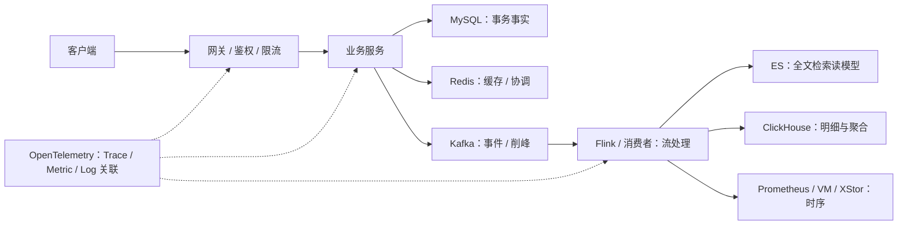

# 中间件专项索引与跨组件 20 问

> **收敛说明**：原“360 问”把每个知识点机械展开为原理、项目、排障、权衡四题，同一答案反复出现，并与各专项形成两套入口。本文件现在只承担两件事：给出唯一学习路线；保留真正需要跨中间件推理的综合题。组件内部细节以对应专项为准。

## 1. 一条系统链路理解全部中间件

统一答题顺序：

1. **职责**：它保存事实、缓存结果、传递事件，还是构建派生读模型？
2. **内部机制**：数据结构、读写路径、复制/提交协议和复杂度是什么？
3. **失败语义**：超时、重试、切主、重复、乱序时会发生什么？
4. **容量与观测**：哪个指标决定瓶颈，怎样用实验而不是直觉调参？
5. **项目证据**：最后才说项目用法；源码只能证明实现形态，生产规模需指标和部署证据。

## 2. 唯一权威入口

| 主题 | 权威文档 | 重点 |
| --- | --- | --- |
| Go | [Go 专项](./Go-专项.md) | GMP、GC、内存、channel、context、pprof |
| MySQL | [MySQL 专项](./MySQL-专项.md) | B+Tree、MVCC、锁、日志、复制、SQL 优化 |
| Redis | [Redis 专项](./Redis-专项.md) | 数据结构、持久化、高可用、缓存一致性、锁 |
| Kafka | [Kafka 专项](./Kafka-专项.md) | 分区、副本、offset、rebalance、可靠性、EOS |
| Elasticsearch | [Elasticsearch 专项](./Elasticsearch-专项.md) | Lucene、分片、写入、检索、聚合、深分页 |
| ClickHouse | [ClickHouse 专项](./ClickHouse-专项.md) | MergeTree、分区、排序键、MV、查询优化 |
| Prometheus / Alertmanager | [Prometheus 专项](./Prometheus-专项.md) | TSDB、PromQL、remote write、规则与告警路由 |
| VictoriaMetrics | [VictoriaMetrics 专项](./VictoriaMetrics-专项.md) | 集群写读路径、MetricsQL、多租户与长期存储 |
| XStor 项目用法 | [监控三存储选型](../../01-项目专题/02-监控可观测/01-机制原理/02-机制篇-三存储引擎选型.md) | 只讲 Global 代码能证明的写入、查询路由与失败边界 |
| FlinkCDC 项目用法 | [CMDB 一致性、元模型与全量同步](../../01-项目专题/01-CMDB/01-机制原理/04-机制篇-一致性巡检与元模型.md) | 脚本制品、Lint、灰度、Oceanus 编排与跨系统状态 |
| OpenTelemetry / Agent Trace | [TCUM-AI 可观测机制](../../01-项目专题/03-TCUM-AI/01-机制原理/04-机制篇-可观测性与ClaudeCode对照.md) | Agent 事件、Langfuse/Trace、工具与模型调用观测 |

### 三个证据边界

- **XStor**：本地仓库能证明 Global 如何按分库批写、重试和查询；不能由客户端代码反推 XStor 内核、复制协议或生产容量。
- **Flink**：`tcum-cmdb-global` 能证明脚本渲染、Lint、版本、灰度和 Oceanus API 编排；通用 checkpoint/watermark 机制要按 Flink 原理回答，具体参数必须看真实作业配置。
- **OpenTelemetry**：项目里出现 SDK、协议或 exporter 不等于三信号全部上线；必须区分埋点、Collector 配置、后端接收和查询使用四层证据。

## 3. 跨组件高频 20 问

### Q1. 为什么 MySQL、Redis、Kafka 不能互相替代？

MySQL 提供事务事实；Redis 用内存和受限数据模型换低延迟；Kafka 保存可重放事件流。把 Redis 当事实库会遇到持久性和复杂查询问题，把 Kafka 当在线查询库会遇到随机读和状态组装问题，把 MySQL 当消息总线会把扫描、锁和清理压力压到主库。

### Q2. Cache-Aside 如何处理数据库更新与缓存失效？

常用顺序是先提交数据库，再删除缓存；读路径 miss 后回源并回填。它仍有并发窗口，可用延迟双删、版本号、CDC 失效或短 TTL 缩小，但没有跨 DB/Redis 事务时不能宣称强一致。关键是先定义允许多旧、多久收敛。

### Q3. 为什么“先写缓存再写数据库”危险？

数据库失败时缓存暴露了不存在的事实；缓存淘汰后又回到旧数据库。若缓存只是派生视图，应让数据库提交成为事实边界，并让缓存可以安全重建。

### Q4. 数据库事务与 Kafka 事件怎样避免双写分叉？

首选 transactional outbox：业务数据和 outbox 同库事务提交，再由 relay 投递 Kafka；消费端幂等。若用 CDC 读 binlog，可减少应用双写，但仍要治理 Schema、位点、重复和下游幂等。不能用“依次调用两个接口”代替原子性。

### Q5. Kafka 手动提交为什么不自动等于 at-least-once？

提交必须晚于处理成功，并且不能越过同 partition 尚未成功的低 offset。并发处理后逐条 `CommitMessage` 可能让高 offset 提前提交；还要处理 commit 失败与 rebalance。正确做法是 partition 内串行或维护连续完成水位。

### Q6. Kafka EOS 能否保证数据库 exactly-once？

Kafka 事务能原子处理 Kafka 输入 offset 与 Kafka 输出记录；外部 MySQL 写通常不在同一事务域。数据库侧还需要幂等键、唯一约束、outbox/inbox 或可恢复状态机，因此应说清“哪个边界内 exactly-once”。

### Q7. 什么时候用 Redis 分布式锁，什么时候用数据库 CAS？

只保护单行状态迁移时优先数据库条件更新，事实与并发控制同域；跨多个资源、耗时操作或需要租约时才考虑分布式锁。锁必须有唯一 owner、TTL/续租和 fencing token，否则过期旧持有者仍可能写入。

### Q8. Elasticsearch、ClickHouse 和 MySQL 的检索边界是什么？

MySQL 适合事务和受控索引点查；ES 适合全文、相关性和灵活倒排过滤；CK 适合大规模列式扫描与聚合。ES/CK 通常是派生读模型，写入成功不应反向定义业务事实，必须允许重建和处理可见延迟。

### Q9. 为什么不能把所有高基数数据都放进 Prometheus？

每组 label 形成独立 series，高基数会扩大索引、Head 内存、查询扇出和 remote-write 成本。指标应保留用于聚合和告警的有限维度；请求 ID、用户 ID 等明细放日志/Trace/列存，并通过 exemplars 或共同属性关联。

### Q10. Prometheus、VictoriaMetrics、ClickHouse 如何分工？

Prometheus 提供采集协议、规则与 PromQL 生态；VM 擅长兼容该生态的长期、横向时序存储；CK 擅长高基数明细和 SQL 多维聚合。实际路由应由数据形态、查询模式、SLO 和成本决定，不能靠一句“超过多少 series 自动切库”概括。

### Q11. 多存储双写能否强一致？

没有共同事务或可靠 outbox 时通常不能。顺序写只能确定调用顺序，不能处理一边成功一边失败。需要每目标独立 durable queue、幂等写、最终确认水位、补偿/重放和差异监控；对用户明确哪个存储是读主。

### Q12. Flink checkpoint 为什么可能越来越慢？

常见原因是反压导致 barrier 对齐等待、状态变大、checkpoint 存储慢、并发 checkpoint 设置不当或 sink 阻塞。排查要串起 source lag、各算子 busy/backpressure、alignment time、state size、checkpoint duration/failure 和存储延迟。

### Q13. Savepoint 与 checkpoint 有什么区别？

Checkpoint 面向系统自动故障恢复，生命周期由运行时管理；savepoint 面向人工升级、迁移和回滚，要求可控保留与状态兼容。两者都不自动解决业务 Schema 或 sink 副作用兼容。

### Q14. CDC 从全量快照切到增量最难的是什么？

必须建立没有洞也不重复破坏状态的位点边界；还要处理长事务、DDL、无主键表、Schema 漂移、binlog 保留期和下游幂等。验证不能只看任务 Running，要对比源/目标水位、行数、抽样 hash 和延迟。

### Q15. OpenTelemetry Context 为什么会断链？

常见断点是新 goroutine/线程未传 Context、消息没有注入/提取 trace header、异步回调丢失父 Span，以及使用 background context 覆盖原上下文。修复要在进程内传递和跨进程 propagator 两侧同时做。

### Q16. Head sampling 与 tail sampling 怎么选？

Head sampling 在入口立即决定，成本低但可能丢掉后来才表现为错误的 Trace；tail sampling 观察完整 Trace 后按错误/延迟保留，质量高但需要集中缓冲、更多内存并增加决策延迟。实践中常以父级一致的 head sampling 控成本，再对关键流量做 tail policy。

### Q17. Collector 的 processor 顺序为什么重要？

`memory_limiter` 应尽早保护进程，属性删除/脱敏要在导出前，batch 会改变批次和延迟，tail sampling 需要在能够看到完整 Trace 的位置。顺序错误可能导致敏感属性先被导出、采样键被删除或 OOM 保护失效。

### Q18. 如何做一次跨 MySQL、Kafka、Flink、CK 的故障定位？

从业务相关 ID/时间窗出发，依次核对 MySQL 事实提交、outbox/binlog 位点、Kafka producer 成功与 partition lag、Flink source/current watermark/checkpoint、sink 写入错误和 CK 可见水位。每层都记录“最后确认成功的 ID/offset/time”，不要只看服务存活。

### Q19. 容量规划为什么不能只看平均 QPS？

系统由峰值、突发长度、单请求放大、状态/基数、P99 下游延迟和恢复追赶能力共同决定。至少计算入口峰值、队列增长率、消费者净处理能力、允许积压时长、存储写放大和故障后 catch-up 时间。

### Q20. 面试中怎样区分“原理会”与“项目真做过”？

原理回答机制和权衡；项目回答必须落到仓库、配置、调用链、指标或故障证据。只找到依赖或 TODO 时说“具备入口/设计中”，找到主路径调用时说“已实现”，生产规模、延迟和可用性仍要用部署与运行数据证明。

## 4. 建议学习顺序

1. MySQL → Redis：先掌握事实、事务和缓存一致性。
2. Kafka → Flink：再掌握事件交付、状态、位点和恢复。
3. ES / ClickHouse / Prometheus / VM：理解不同派生读模型。
4. OpenTelemetry：最后把请求、事件和存储链路用统一证据串起来。
5. 回到三个项目卷，用源码回答“我们实际上怎么做、哪里会坏、下一步怎么改”。
