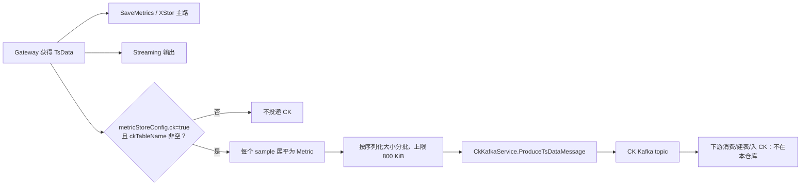
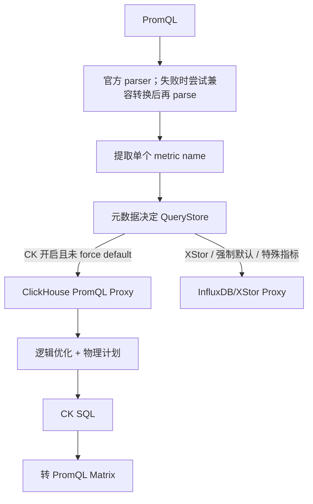

# ClickHouse 专项：从 MergeTree 到 TCUM PromQL 查询链路

> **定位**：本篇是 ClickHouse 的唯一专项入口。先讲可迁移的存储与查询原理，再讲 `tcum-yunshao-global` 源码真正实现的 CK 写入、PromQL 查询和 SLO SQL 链路。未在仓库中出现的 DDL、集群拓扑、性能数字和线上故障不得当作项目事实。

## 1. 面试先给结论

### 1.1 30 秒原理回答

ClickHouse 适合高吞吐追加写和大扫描聚合，核心是列式存储、向量化执行和 MergeTree。`INSERT` 生成不可变 part，part 内按 `ORDER BY` 排序，用稀疏主键索引跳过 granule，后台再合并小 part。它的强项是分析而不是高并发单行事务；性能是否好，很大程度由查询模式、排序键、分区、批量大小和预聚合决定。

### 1.2 TCUM 项目回答

TCUM 不是在这个仓库里自己管理 ClickHouse 集群。它实现了三类接入：

1. 指标网关按指标元数据决定是否把样本批量投递到 CK Kafka topic；
2. PromQL 查询根据指标存储配置选 XStor 或 ClickHouse，CK 规划器把 selector、label matcher、时间窗口和部分聚合下推为 SQL，再转回 PromQL Matrix；
3. SLO 链路另有一套 ClickHouse SQL 查询接口，支持结构化查询与高级原始 SQL。

项目亮点不是背诵 CK 参数，而是**用元数据统一 PromQL 语义，将查询路由、标签物理映射、SQL 下推和结果回填收敛在一层**。

## 2. 列式存储和 MergeTree

### 2.1 为什么分析查询快

| 机制 | 作用 | 代价 |
| --- | --- | --- |
| 列式存储 | 只读查询需要的列；同类型相邻数据更容易压缩 | 点查整行、高频小更新不是优势 |
| 向量化执行 | 一次对一批值做过滤、解码和聚合 | 复杂查询仍可能耗尽 CPU/内存 |
| `ORDER BY` 物理排序 | 使常用过滤维度局部连续，帮助索引裁剪与压缩 | 一种排序无法同时服务所有查询模式 |
| 稀疏主键索引 | 每个 granule 保存 mark，可跳过不可能命中的范围 | 不是逐行 B+Tree，也不保证唯一 |
| 后台 merge | 把小 part 合成大 part，降低读放大 | 带来 IO/CPU 写放大，追不上会 `too many parts` |

不要把“列存”简化成“必然快”。如果查 `SELECT *`、过滤不命中排序键、跨大量分区或最终返回数十亿行，列存也救不了不合理的查询。

### 2.2 table、partition、part、granule

```text
table
└─ partition（PARTITION BY 得到的逻辑数据组）
   ├─ part（一次 INSERT/合并产生的不可变物理单元）
   │  ├─ granule + mark
   │  ├─ 各列压缩数据
   │  └─ primary index / checksum / metadata
   └─ more parts...
```

- `PARTITION BY` 主要用于数据生命周期和粗粒度裁剪，不是分布式 shard。
- part 是写入、merge、mutation 的物理单元。
- granule 是索引和读取的基本块，默认常见粒度为 8192 行，但应以建表配置为准。
- 一个 partition 可有许多 part，一个 part 又有许多 granule。

### 2.3 一次写入发生什么

1. 客户端把一批 rows 交给 ClickHouse。
2. 按 partition key 分组，每个被触达的 partition 都可能产生 part。
3. part 内按 `ORDER BY` 排序，列式编码、压缩并写入 mark/索引。
4. part 提交后可查；后台异步把小 part 合并成更大 part。

这也解释了为什么要批量写入：过多小 INSERT 会创建过多 part，合并速度赶不上生成速度时，查询读放大和后台资源消耗都会上升。批量大小需要根据行宽、延迟、part 数和 merge 能力实测，不要把一个固定行数当万能值。

## 3. 表设计：分区、排序键、索引与压缩

### 3.1 `ORDER BY` 与 `PRIMARY KEY`

ClickHouse 的主键不是唯一约束。

- `ORDER BY` 决定 part 内的物理排序；
- `PRIMARY KEY` 决定稀疏索引，若单独定义，必须与排序键兼容；
- 常见建表只写 `ORDER BY`，两者逻辑上相同；
- 相同主键值可以存在多行。

选键时先看真实查询：

1. 常用必选过滤维度放前；
2. 需要范围查的时间通常在业务维度后，但具体顺序取决于查询模式；
3. 同时考虑数据局部性、压缩和去重键语义；
4. 对多套差异很大的查询模式，考虑 projection、MV 或独立服务表，不要无限加长一条排序键。

### 3.2 `PARTITION BY`

分区首先是运维和 TTL 边界，其次才是查询裁剪手段。粒度过细会让一批写入横跨更多 partition，产生更多 part、增加元数据和 merge 负担。

设计时问四个问题：

- 数据按天还是按月删除/冻结？
- 查询是否总带时间边界？
- 每个分区的 part 数和数据量是否可控？
- 同一逻辑行的所有版本是否会落到同一分区？

### 3.3 skip index 不是二级 B+Tree

`minmax`、`set`、Bloom Filter 之类的 data-skipping index 用来判断一个索引块“可能有”还是“肯定没有”。它的价值取决于数据分布：如果目标值在所有 granule 中都可能出现，索引就几乎无法跳过数据。应用 `EXPLAIN indexes = 1` 和实际扫描量证明有效，而不是“高基数就上 Bloom”。

### 3.4 类型与 codec

- 枚举性、重复度高的字符串可评估 `LowCardinality(String)`；
- 时间、单调整数可评估 Delta/DoubleDelta 类编码；
- LZ4 偏速度，ZSTD 偏压缩率，不同数据分布必须实测；
- `Nullable` 有额外 null map 成本，但不能为了性能用含糊哨兵值破坏业务语义。

压缩倍数和查询提升幅度是数据集相关结果，不能把官方 benchmark 或网文数字写成自己的生产成绩。

## 4. 更新、去重和 MergeTree 家族

### 4.1 mutation 为什么贵

part 不可变，批量 mutation 需要生成新 part 并替换旧 part。它适合受控的回填、合规删除或校正，不应当作 OLTP 的高频单行 UPDATE。要观测 mutation 队列、merge 压力、磁盘空间和副本进度。

### 4.2 ReplacingMergeTree

ReplacingMergeTree 通过追加新版本、在后台 merge 时按 `ORDER BY` key 对齐并选择版本。关键边界：

- 后台 merge 是异步的，不保证查询时已经去重；
- 需要当下正确状态时可使用 `SELECT ... FINAL`，但它有查询开销；
- 有明确 version 列比依赖 merge 顺序更稳妥；
- `OPTIMIZE TABLE ... FINAL` 是重写存储的管理操作，不是每次查询前的常规去重手段。

### 4.3 引擎选择

| 需求 | 可评估的引擎 | 必须说明的限制 |
| --- | --- | --- |
| 追加明细 | MergeTree | 不提供主键唯一约束 |
| 版本替换/去重 | ReplacingMergeTree | merge 前重复可见；正确性与 `FINAL`/argMax 等读路径有关 |
| 可合并数值汇总 | SummingMergeTree | 查询仍应按 key 聚合，不能假设 part 已完全 merge |
| 预聚合状态 | AggregatingMergeTree | 写 State，读 Merge；列类型和函数必须匹配 |
| CDC 折叠 | Collapsing/VersionedCollapsing | sign/version 契约复杂，错误事件难修复 |

## 5. 物化视图和 projection

### 5.1 incremental MV 是 insert trigger

ClickHouse 的增量 MV 只对**新插入源表的 block**执行 `SELECT`，把结果写到目标表。它不会因源表后续 mutation、partition drop 或 merge 自动重算目标表；JOIN 右表变化通常也不会触发。

因此设计 MV 要同时设计：

- 新数据增量语义；
- 历史回填和重建流程；
- 源数据删除/校正后的目标表修复；
- 重复投递和部分失败时的幂等性。

### 5.2 为什么分位数要存状态

`avg` 和 P95 不能通过“各分区结果再平均”正确合并。

- 平均值要保存 `sum` 与 `count` 或对应聚合状态；
- 分位数要保存可合并 sketch/state；
- 写入端使用 `xxxState`，读取端使用匹配的 `xxxMerge`。

具体 quantile 函数的算法、精度和内存成本不同，不要把所有 `quantileState` 都叫作 t-digest，更不要把近似 sketch 说成“精确 P99”。

### 5.3 refreshable MV 与 projection

- refreshable MV 按计划重算整个结果，适合允许滞后且需要多表/全量语义的任务；
- projection 存在表的 part 内，查询分析器可透明选择，适合同一数据的另一种排序/聚合形态；
- incremental MV 把计算成本移到写入时，视图过多会增加 insert 路径成本。

## 6. 分片、副本与 Keeper

### 6.1 四个概念不要混

| 概念 | 解决什么 | 不解决什么 |
| --- | --- | --- |
| shard | 分摊存储和计算 | 不自动带来同一数据的容灾 |
| replica | 同一 shard 内的数据冗余 | 不扩展唯一数据集容量 |
| Distributed table | 把查询/写入路由到 shard | 自己通常不存数据 |
| Keeper/ZooKeeper | 协调 ReplicatedMergeTree 元数据与副本任务 | 不代替数据副本本身 |

Keeper 使用 Raft，是 ClickHouse 为协调场景提供的 ZooKeeper 兼容实现。“应该几个 Keeper”、“每 shard 几副本”取决于故障域、RPO/RTO、成本和部署形态，不能从 TCUM 应用层仓库推断线上拓扑。

### 6.2 一致性要按路径讲

- 副本复制与查询选哪个副本是两个问题；
- insert quorum 可提高写入确认要求，但会增加延迟和可用性成本；
- 重试会带来重复风险，要说清 insert deduplication token、业务幂等 key 或读时去重方案；
- 副本不是备份，误删和错误 mutation 可以被复制，仍需独立 backup/restore 演练。

## 7. 查询优化与故障定位

### 7.1 优化顺序

1. 先从 `system.query_log` 确认频率、扫描行/字节、延迟、内存和异常；
2. 用 `EXPLAIN` 看 partition/主键/skip index 是否裁剪、计划是否选 projection；
3. 确认查询只读必要列，时间范围和业务过滤完整；
4. 再调整 `ORDER BY`、数据类型、projection/MV 或 skip index；
5. 最后才考虑加节点、提高内存或放宽并发。

优化要保留基线，分别测 cold/warm cache，一次只改一个变量。否则“快了多少”无法归因。

### 7.2 常见故障树

| 现象 | 优先查 | 常见解法 |
| --- | --- | --- |
| `too many parts` | insert 频率、批量、触发分区数、merge 队列 | 上游改批量/异步写、降低分区扇出、治理 merge 资源 |
| 查询扫描大 | `ORDER BY` 前缀、时间边界、分区裁剪 | 调整表形态或为高频查询建 projection/MV |
| JOIN OOM | 右表大小、join 算法、是否可先过滤 | 小表在右、Dictionary/预计算、选合适 join 算法并限额 |
| mutation/merge 积压 | `system.mutations`、`system.merges`、磁盘水位 | 停止新重任务、拆分回填、调整资源和数据建模 |
| 副本落后 | replication queue、Keeper、网络、磁盘 | 先区分数据传输、执行队列和协调故障 |
| 结果重复 | 引擎、排序键、version、merge 状态 | 明确读时 `FINAL`/argMax 或业务去重契约 |

## 8. TCUM 源码验证：写入链路

### 8.1 可以从代码证明的流程



`MetricCkKafkaService` 的真实数据契约：

- `measurement = ckTableName`；
- `field.name = MetricsName`，`field.value = sample.Value`；
- tag 同时携带逻辑 key/value 和 `physical_key`；
- 一条 sample 展平为一个 Kafka `Metric`；
- 序列化估算后以 800 KiB 为最大批阈值；
- 投递记录数量、耗时和错误数指标。

`ckTableName` 是元数据配置，不是代码强制的“一个 metric 一张表”。多个指标可以共用同一个 table name，但最终 Kafka 消费者如何分流、用什么 DDL/物化视图要查下游部署，不能从这段代码推断。

### 8.2 写链路现存问题与解法

| 问题 | 源码证据 | 后果 | 建议 |
| --- | --- | --- | --- |
| 转换局部失败仍返回 `nil` | `failedData` 只记日志/指标 | 调用方不知道部分样本被丢弃 | 返回 partial-error，记录 metric/reason，进 DLQ 或可重放队列 |
| 首个 Kafka batch 失败即结束 | `sendBatch` error 直接 return | 后续 batch 未投递，上游重试可产生部分重复 | 为每批建 attempt/batch ID，明确 Kafka producer 幂等与重试契约 |
| CK 投递在网关请求链内同步等待 | Gateway 顺序调 `WriteCkKafka` | CK/Kafka 慢会放大网关延迟 | 评估本地有界队列/outbox，定义溢出、背压和降级策略 |
| 端到端可观测不完整 | 当前只到 Kafka produce 指标 | 无法证明数据已可查 | 串起 gateway batch ID、Kafka offset、CK ingest part 和首次可查时间 |

这些是从当前代码可见行为得出的改进方向，不等于线上已经发生过数据丢失事故。

## 9. TCUM 源码验证：PromQL 查询链路

### 9.1 路由并不是“所有查询都去 CK”



选库规则在源码中很具体：

- `log_monitor` / `probe` 前缀指标走 XStor；
- streaming 指标走专用 XStor；
- 有全局或 stack-code 级 force-default 开关时走 XStor；
- 指标名多出字段、被视为 view 时回退 XStor；
- 含 `VRange` 配置的指标不走 CK；
- 只有标准指标元数据显式 `ck=true` 时才选 CK。

CK client 只在 `clickhouse.enable > 0` 且没有全局 force-default 时初始化。当前连接池配置包括 LZ4、`max_query_size=4 MiB`、最大 50/最小 5 连接和健康检查。这些是代码默认值，不能由此推导出集群容量。

### 9.2 CK 物理计划

CK 查询使用固定表前缀 `tcum_metric_default`，规划为：

- `tcum_metric_default_data`：`tsid`、`timestamp_ms`、值列；
- `tcum_metric_default_meta`：`tsid`、`ts_key`、`timestamp`；
- 元数据提供 metric 对应 measurement/field、采集周期和逻辑 label → CK 物理列映射；
- data 与 meta 查询并行执行，然后按 `tsid` 回填 label；
- meta 起始时间向前扩 10 分钟，结束时间放到下一 UTC 日起点，用来容忍元数据写入延迟；
- 普通 scan 让 PromQL engine 做后续计算；存在可下推计划时，目前 CK SQL 主要支持 `SUM/COUNT/MIN/MAX` 及受限的 `sum(count_over_time(...))` / `sum(sum_over_time(...))` 类形态。

label matcher 会转成 CK 条件：`=`/`!=`直接比较，`=~`/`!~` 保持 PromQL 整串匹配语义。逻辑优化器还会把可证明的正则分类为 exact、enum、contains、prefix 或 suffix，物理层改写成 `=`、`IN`、`position`、`startsWith` 或 `endsWith`，无法安全改写的仍用 `match()`。

### 9.3 查询链路的亮点

1. **存储选择与 PromQL API 解耦**：上层不用知道 CK SQL。
2. **逻辑 label 与物理列解耦**：元数据映射允许底层使用槽位列。
3. **正则优化可证明**：只重写能从 regexp AST 安全归类的形态，其他回退通用语义。
4. **计算分层**：可安全分配的聚合下推，其他由 PromQL engine 完成。
5. **data/meta 分离并行扫描**：值数据与 label 元数据独立查询后组合。

### 9.4 查询链路问题与解法

| 问题 | 当前代码 | 可能风险 | 演进方向 |
| --- | --- | --- | --- |
| 跨存储表达式不支持 | TODO 明示 `a+b` 分属 CK/XStor 尚不支持 | 只按单个 metric 选 proxy，复合表达式路由不完整 | AST 按 selector 切分子计划，各存储执行后在统一时间/标签语义下 join |
| CK 连接失败直接 `panic` | 服务初始化时 `chpool.Dial` 失败 panic | CK 旁路故障可阻断进程启动 | 健康状态机 + readiness，允许按政策回退 XStor，避免静默改变语义 |
| data/meta 结果在应用内聚合 | 两个 map 按 `tsid` 组合 | 高基数大窗口可占用大量内存 | 分页/流式 merge，推下 cardinality/row/byte 限制，建立 per-query 预算 |
| meta 扫描窗口更大 | 起点 -10m，终点到次日 UTC | 宽查可放大 IO，也可带来过期 label 选择问题 | 为元数据版本/有效期建模，测量延迟后动态容忍，用 Explain 验证裁剪 |
| value matcher 片段直接拼 SQL | `matcher.Value` 被追加到值列条件 | 若该内部 matcher 可被不可信输入控制，存在语法/注入风险 | 不接收任意 SQL 片段，改为有限 operator + typed value AST，并做负向测试 |
| 内部 label 被静默忽略 | filter builder 对 inner label `continue` | 查询条件被移除可改变语义 | 只允许已证明是控制标签的 allowlist，计划中显式记录 eliminated matcher |
| 下推覆盖有限 | 主要是 sum/count/min/max 等 | 更复杂计算需要拉回更多样本 | 以语义等价测试为门禁逐步增加下推，不为了性能冒正确性风险 |

## 10. TCUM 源码验证：SLO ClickHouse 查询

SLO 查询不经过上述 PromQL proxy，而是独立 `SloQueryService`：

- `sloclickhouse.clickhouse.enable > 0` 时通过 `clickhouse-go/v2` HTTP 协议建立 DB，初始 `Ping` 失败会 panic；
- basic query 由结构化请求构造 filter、projection、group/order；
- scan 会按 tag、timestamp 和 `insert_time` 排序；
- advanced query 允许请求直接提供 SQL，并声明目标 tag/timestamp/metric 列。

这里最值得追问的是高级 SQL 的信任边界：如果 API 可被广泛用户调用，仅靠 DB 账号权限不够。需要只读账号、SQL parser/AST allowlist、单语句限制、禁止 DDL/DML/table function、表白名单、行/字节/内存/时间配额以及审计。当前仓库中的 builder 只展示执行传入 SQL，不足以证明上述治理已完成。

## 11. 项目事实边界

| 表述 | 能否在面试中说 | 证据/原因 |
| --- | --- | --- |
| TCUM 按 metric store config 将部分指标发往 CK Kafka | 可以 | `MetricCkKafkaService` |
| CK Kafka 批次上限为 800 KiB | 可以，说清是当前代码值 | `maxBatchSizeBytes` |
| PromQL 可按元数据在 CK/XStor 中选择 | 可以 | `ResolvePromqlProxyKey` |
| CK 查询有 data/meta 两表、label 物理映射和受限聚合下推 | 可以 | clickhouse physical planner/plan |
| TCUM 已支持任意跨 CK/XStor PromQL | 不可以 | 源码 TODO 明示不支持跨存储复合表达式 |
| TCUM 的 CK 是 4 shard × 3 replica + 3 Keeper | 不可以 | 应用仓库没有部署拓扑证据 |
| 日写几百亿、单表几万亿、P99 查询秒级 | 不可以 | 没有生产度量/压测证据 |
| TCUM 已落地明细→1m→1h→1d 三层 MV | 不可以 | 当前仓库无对应 DDL/部署配置 |
| 我们经历过分片键迁移两周、JOIN OOM 等故障 | 不可以 | 无 incident/复盘/提交证据 |

## 12. 系统设计题：如何用 CK 承载高基数指标分析

回答时不要立刻拍 DDL，先建立约束：

1. **读模式**：按什么标签过滤，时间窗口多大，是原始值还是聚合。
2. **写模式**：样本速率、行宽、批量、乱序、重复与可接受延迟。
3. **正确性**：RPO/RTO，是否允许重复/稍后可见，回填如何幂等。
4. **生命周期**：原始明细、不同粒度聚合各保留多久。
5. **资源边界**：查询并发、单查询扫描量、内存、后台 merge 与回填竞争。

再给方案：

- Kafka 前置削峰，以有界批量写入；
- 根据高频 filter 设计 `ORDER BY`，根据 TTL/删除单元设计 partition；
- 明细表保留短窗口，高频聚合用可合并 State 的 MV 或 projection；
- 副本、备份和跨故障域根据 RPO/RTO 设计，不用固定拓扑套模板；
- 用 query log、part/merge/mutation/replication 指标和端到端可查延迟做容量闭环；
- 用回放数据比较新旧路径结果，再逐步切流。

## 13. 高频面试题

### Q1：ClickHouse 和 MySQL 的主键有什么不同？

MySQL InnoDB 主键通常是唯一约束与聚簇 B+Tree；ClickHouse MergeTree 主键是 granule 级稀疏索引，不保证唯一。`ORDER BY` 决定物理排序，对扫描裁剪和压缩影响极大。

### Q2：part 和 partition 是一回事吗？

不是。partition 是 `PARTITION BY` 得到的逻辑数据组；part 是每次写入或 merge 生成的不可变物理单元。一个 partition 通常包含许多 part。

### Q3：为什么小批量写入会出问题？

每个 insert 会产生 part，过多小 part 会放大文件、元数据和查询开销，并让 merge 队列追不上。解法是在可接受延迟下批量化、控制分区扇出、观测 part 生成/合并速率。

### Q4：分区越细越好吗？

不是。细分区可以加强粗粒度裁剪和删除，但会增加 part 和元数据数量。它要与 TTL/删除单元、查询时间窗口和写入扇出一起设计。

### Q5：稀疏索引为什么还能快？

因为part 内按键排序。索引不用指向每行，只需给 granule 标 mark，查询就能跳过不可能命中的大段。代价是最小仍以 granule 为读取单元。

### Q6：Bloom Filter 什么时候有效？

当查询是等值/IN/可支持文本模式，且目标值在许多索引块中完全不存在时才能大量跳过。需用 Explain 和实测验证；值均匀散落到每个 granule 时作用很小。

### Q7：ReplacingMergeTree 能保证实时去重吗？

不能。后台 merge 是异步的，未 merge 前多版本可同时可见。需要即时正确时使用 `FINAL`、argMax/版本聚合或单独结果表，并评估性能。

### Q8：`SELECT FINAL` 和 `OPTIMIZE ... FINAL` 有什么不同？

前者在查询时应用引擎合并逻辑，不修改底层 part；后者是物理重写/强制合并类管理操作，可造成大量 IO 和超大 part。

### Q9：incremental MV 会因源表 delete 自动更新吗？

不会。它只处理新 insert block，看不到后续 mutation、partition drop 和 merge。需要另行设计重建/校正流程。

### Q10：物化视图为什么要用 State/Merge？

因为每个 insert block 只生成部分聚合结果。sum 可直接合并，avg 需要 sum+count，quantile 需要可合并状态。只存每批 P95 后再平均是错的。

### Q11：MV 和 projection 怎么选？

MV 将新写入转换到独立目标表，灵活但查询要显式使用目标表，也要管回填与一致性。projection 与原表 part 共生命周期，分析器透明选择。根据是否需要独立表/复杂转换以及查询透明性选择。

### Q12：分片和副本的区别？

分片拆数据集以扩展容量/计算；副本复制同一 shard 数据以高可用和读扩展。两者可组合，但解决的问题不同。

### Q13：Keeper 保存全部数据吗？

不保存表数据本身，它为 ReplicatedMergeTree 提供协调元数据、日志/任务等。真正的 part 在 ClickHouse 数据节点/存储上。

### Q14：副本就是备份吗？

不是。副本能容忍节点故障，但误删、错误 mutation 和逻辑错误会被复制。备份需要独立时间点和恢复验证。

### Q15：慢查不先加机器，先做什么？

看 query log 与 Explain，确认扫描量、排序键/分区裁剪、读列、JOIN/聚合、返回量和内存。加机器只能暂时掩盖不合理数据布局。

### Q16：TCUM 的 CK 写入是直连 ClickHouse 吗？

当前可见指标链路不是。网关将样本转为 protobuf Kafka 消息，发往 CK topic；Kafka 后如何入库不在该仓库。

### Q17：TCUM 为什么用 `ckTableName` 而不是 metric name 当表名？

它把逻辑指标与物理存储分组解耦。多个 metric 可共用 measurement/table 分组，真实 metric 名作为 field name。但最终表路由要以下游消费实现为准。

### Q18：TCUM 如何选 CK 还是 XStor？

根据指标元数据和一系列保守回退规则。特殊前缀、streaming、复合 metric/view、VRange、全局/stack 强制默认都走 XStor；标准指标显式 CK 开启才走 CK。

### Q19：TCUM 是怎样把 PromQL label 变成 CK SQL 的？

元数据提供逻辑 label 到物理列映射。规划器处理等值、不等值与正则 matcher；可安全证明的正则改写为更便于 CK 执行的精确/IN/prefix/suffix/contains 条件，其他保留 `match()`。

### Q20：TCUM CK 查询为什么分 data 和 meta 两次扫描？

data 表保存 tsid/时间/值，meta 表保存 tsid 对应标签编码。两者并行查询后在应用层按 tsid 组合成 PromQL series，目的是将高频数值与标签元数据分离。

### Q21：这条 data/meta 路径最大的风险是什么？

大窗口高基数时，两份结果都在应用内存中组合；meta 宽查窗口也会增加 IO。需要流式/分页、cardinality 预算和元数据版本语义。

### Q22：TCUM 的 PromQL 已支持跨存储计算吗？

没有完整支持。源码 TODO 明示一个表达式中两个 metric 分属 CK 与 XStor 的情况尚未解决。正确演进需要 selector 级切计划和统一时间/标签对齐。

### Q23：为什么不把所有 PromQL 聚合都下推到 CK？

下推必须证明语义等价，包括 lookback、range window、step 对齐、staleness、label 分组和 NaN。当前只做受限聚合更保守；扫描放大是性能问题，错算是正确性问题。

### Q24：SLO 的高级原始 SQL 有什么风险？

除 SQL 注入外，还有任意大扫描、越权读表、table function 外联、多语句和资源耗尽。应用只读账号 + AST allowlist + 表白名单 + 查询配额 + 审计多层防护。

### Q25：如何证明 CK 优化真有效？

固定数据快照和查询集，记录结果 hash、扫描行/字节、CPU、内存、延迟分位数和 part/merge 后台影响；cold/warm cache 分开，新旧方案结果先做语义对齐，再谈性能。

## 14. 三分钟项目话术

> 我们在 TCUM 里没有把 ClickHouse 直接暴露给上层，而是做了写入和查询两个适配层。写入上，指标元数据决定是否开启 CK，并给出 ckTableName；网关把样本展平为 protobuf Metric，按 800 KiB 分批发 Kafka。下游如何消费和建 CK 表不在这个仓库，所以我不会把教学 DDL 当成线上事实。
>
> 查询上，外部仍是 PromQL。系统先用 parser 获得 AST 和 metric，根据元数据及回退规则选 XStor 或 CK。CK planner 用逻辑 label 到物理列的映射生成 SQL，data/meta 并行扫描后还原 PromQL series，并对可证明等价的正则和聚合做下推。
>
> 当前短板也很清楚：不支持 CK/XStor 跨存储复合表达式；大查询的 data/meta 应用层组合有内存风险；写链路部分转换失败只记录不透传；SLO 的高级 SQL 需要更强的只读与资源治理。我会优先做可回放的端到端数据契约和查询预算，再做跨存储计划和更多下推。

## 15. 源码与官方资料

### 15.1 TCUM 源码

- `service/bizservice/metric_ck_kafka_service/metric_ck_kafka_service.go`：CK Kafka 转换、分批和投递。
- `service/bizservice/gwservice/gw_service.go`：网关主存储、streaming 与 CK 输出调用顺序。
- `service/bizservice/metricservice/metric_meta_service.go`：CK/XStor 查询路由规则。
- `service/bizservice/pqlqueryservice/service.go`：PromQL parse、metric 提取与 CK client 初始化。
- `service/bizservice/pqlqueryservice/proxy-manager/proxy_manager.go`：proxy 选择与 CK 计划器注册。
- `service/integration/promql-proxy/clickhouse-base/`：正则改写、扫描/聚合规划和 PromQL 结果转换。
- `service/integration/slodb/`：SLO 结构化查询与高级 SQL 查询。

### 15.2 ClickHouse 官方资料

- [How columnar storage works](https://clickhouse.com/resources/engineering/what-is-columnar-storage)
- [ClickHouse query optimisation guide](https://clickhouse.com/resources/engineering/clickhouse-query-optimisation-definitive-guide)
- [Common ClickHouse mistakes（含 MV 触发语义）](https://clickhouse.com/blog/common-getting-started-issues-with-clickhouse)
- [Using Materialized Views in ClickHouse](https://clickhouse.com/blog/using-materialized-views-in-clickhouse)
- [When to use OPTIMIZE TABLE ... FINAL](https://clickhouse.com/resources/engineering/clickhouse-optimize-table-final)
- [ClickHouse Keeper](https://clickhouse.com/clickhouse/keeper)
