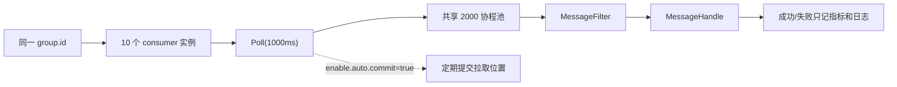

# Kafka 专项：从副本日志到 TCUM 端到端可靠性

> **定位**：本篇是 Kafka 的唯一专项入口。通用部分讲 partition log、ISR、producer、consumer group、offset 和事务；项目部分以 `tcum-yunshao-global` 源码为准，重点分析当前“自动提交 + 异步协程池”的真实可靠性和顺序性问题。仓库中没有的 broker 拓扑、流量、分区数、副本数和事故不当作项目事实。

## 1. 面试先给结论

### 1.1 30 秒原理回答

Kafka 把 topic 切成多个只追加 partition log，以 partition 为顺序、副本和并行的基本单元。Producer 批量压缩后写 partition leader，follower 主动拉取复制；消息被 ISR 复制后成为 committed。Consumer group 内一个 partition 同时只分配给一个 member，不同 group 各自保留 offset，因此同时支持水平扩展、广播和回放。

但 Kafka 本身不能替你保证业务处理端到端 exactly-once。真正的保证要把 producer 确认、broker 副本、offset 提交时机、业务副作用幂等和 DLQ/重放连在一起讲。

### 1.2 TCUM 项目回答

TCUM 当前用 `confluent-kafka-go` 做多条数据通道：指标到 Ark Streaming、指标/元数据到 CK topic、SLO 输出、变更影响面输入/输出，以及向 CMDB 发 Protobuf 增量消息。

当前最值得讲的不是“Kafka 多快”，而是一个源码可证的端到端问题：通用 consumer 开启 `enable.auto.commit=true`，Poll 到消息后马上丢到共享 2000 协程池处理。这会让 offset 可能早于业务成功提交，处理失败也不会自动重投；同一 partition 内的多条消息还可能并发完成，打破业务处理顺序。这比背 `acks` 配置更能体现工程深度。

## 2. Kafka 的核心模型

### 2.1 partition 是三种边界

| 边界 | 含义 |
| --- | --- |
| 顺序 | Kafka 只保证一个 partition log 内的 offset 顺序，不保证 topic 全局顺序 |
| 副本 | 一个 partition 有 leader 和 follower replicas，副本复制围绕该 log 进行 |
| 并行 | consumer group 内同一 partition 同时只给一个 member，活跃消费并行度不超过可分配 partition 数 |

Topic 只是逻辑命名空间。Broker 保存若干 partition replica，Controller 管理 broker/topic/partition 元数据和 leader 切换。

### 2.2 log、segment 与索引

partition 日志按 segment 分段。每段通常有 log 文件、offset 稀疏索引和时间索引。Broker 先根据目标 offset 定位 segment，再用稀疏索引找到附近位置并顺序扫描。

保留策略要区分：

- `delete`：按时间/大小删除旧 segment；
- `compact`：对 key 保留更新状态，但 compact 是后台过程，不是立即只剩一条；
- 两者可组合。

### 2.3 高吞吐来自哪里

- 只追加日志和 page cache；
- producer 按 partition 攒 batch，批量压缩和网络请求；
- broker 不在每条消息上做业务处理；
- partition 分散到 broker，consumer 可并行拉取；
- 文件到 socket 的数据传输可减少拷贝，但具体路径取决于 SSL、压缩、系统与版本。

“单 Broker 百万条/秒”不是原理。真实吞吐取决于消息大小、压缩、acks、副本、磁盘/网络、partition 分布和消费处理，必须压测。

## 3. 副本、ISR 与写入可见性

### 3.1 四个 offset/集合概念

- AR：该 partition 分配的全部 replicas；
- ISR：当前保持 in-sync 的 replicas，是动态集合；
- LEO：某个 replica 的 log end offset；
- HW：consumer 可见的 committed 高水位。

Follower 向 leader 发 fetch 请求拉取数据。跟不上超过 broker 允许时间的 replica 会离开 ISR，追上后可回归。当前 Kafka 的准确判断以对应版本 broker 配置为准，不要把已废弃的“固定落后条数”配置当成现状。

### 3.2 `acks=all` 和 `min.insync.replicas`

`acks=all` 表示 leader 等待当前 ISR 对写入确认。`min.insync.replicas` 是在 `acks=all` 时允许写入成功的最小 ISR 数；当 ISR 小于它时，broker 拒绝写入。

准确话术：

> `acks=all` 不是“等 replication factor 的每个副本”，而是等当前 ISR。`min.insync.replicas` 防止 ISR 收缩后 `all` 退化成只有一个 leader 确认。配置是数据持久性与写可用性的取舍，不能单独承诺“绝不丢”。

即使 broker 端没丢，producer 超时也可能不知道原请求是否成功，重试可带来重复；consumer 也可在副作用前提交 offset。所以端到端保证不能只看这两个参数。

### 3.3 leader 选举和 unclean 取舍

Controller 负责为失效 leader 选新 leader。正常从合格副本集合中选择；允许 unclean 选举可在没有 in-sync replica 时优先恢复可用性，但可能丢失已有日志。要按业务 RPO/RTO 决定，不把任一默认值当作所有业务的答案。

## 4. Producer：批量、顺序、幂等与事务

### 4.1 发送链路

```text
serialize
  → choose partition
    → accumulate per-partition batch
      → compress/send
        → leader append + replicate
          → delivery result
```

- key 参与 partition 选择时，相同 key 通常可路由到同一 partition，但增加 partition 可使映射变化；
- 无 key 的分区器可用 sticky 策略改善 batch，不应依赖它的具体路由作为业务顺序契约；
- `batch.size`、`linger.ms`、压缩、缓冲和 delivery timeout 是吞吐/延迟/内存的联动参数，不是越大越好。

### 4.2 幂等 producer 保证什么

Kafka producer idempotence 用 producer ID、partition 和 sequence 去除因可重试错误引起的重复，并在允许的 in-flight 范围内保持顺序。官方配置要求包括 `acks=all`、`retries>0`、`max.in.flight.requests.per.connection<=5`。

它不保证：

- 业务调用方重复构造两个不同消息；
- consumer 对外部 DB/HTTP 的副作用不重复；
- 多个独立 producer 流之间的全局顺序；
- 应用在 delivery 结果前就向上游报成功的语义。

### 4.3 Kafka 事务的边界

`transactional.id` 可以把多 partition 写入及 consumer offsets 放在 Kafka 事务中，`read_committed` consumer 不读未提交记录。它适合 Kafka → 处理 → Kafka 管道。若同时更新 MySQL/CMDB/HTTP 系统，仍需 outbox/inbox、业务幂等键、状态机或补偿，不要把 Kafka EOS 扩大成分布式全局 exactly-once。

## 5. Consumer：group、offset、rebalance 与处理语义

### 5.1 offset 提交时机决定语义

| 顺序 | 宸机窗口 | 语义 |
| --- | --- | --- |
| 先提交 offset，再处理 | 提交后崩溃 | 最多一次，可丢业务处理 |
| 先处理，再提交 | 处理成功但提交前崩溃 | 至少一次，可重复，业务必须幂等 |
| Kafka 读写在事务中 | abort/重试由 Kafka 事务管理 | Kafka 管道内 exactly-once，不自动覆盖外部副作用 |

`enable.auto.commit=true` 只是定期提交 consumer 已拉取位置，它不知道异步协程池里的业务是否成功。

### 5.2 rebalance 时要保护什么

Member 加入/退出、心跳/最大 Poll 间隔超时或 partition 变化都可能导致重分配。关键不是只背 assignor 名字，而是：

1. 被 revoke 前停止向该 partition 接收新任务；
2. 等待或取消在途处理；
3. 只提交每个 partition **最高连续成功 offset + 1**，不能因后一条先完成跳过前一条失败；
4. 分配给新 member 后恢复 partition-local 队列。

Cooperative rebalance 能减少不必要的全量撤销，但不会自动解决你的在途任务、offset 和副作用一致性。

### 5.3 顺序性需要 producer 和 consumer 同时守约

```text
同一业务 key → 同一 partition
                 → producer 重试不乱序
                 → consumer 对该 partition 按 offset 顺序完成
                 → 下游用 version/幂等键防旧事件覆盖新状态
```

只做“同 key 同 partition”不够。消费端若把同 partition 的消息并发丢给线程池，完成顺序仍会变化。

## 6. KRaft 和版本边界

KRaft 将集群元数据管理收回 Kafka controller quorum，不再依赖 ZooKeeper。Kafka 3.3 开始将 KRaft 视为 production-ready；Kafka 3.9 是最后的 ZooKeeper 迁移桥接系列；Kafka 4.0 已移除 ZooKeeper 模式。

因此面试不应再说“KRaft 是 2.8+ 新特性”就结束，而要问目标 broker 版本、当前是 ZK 还是 KRaft、是否要先迁到桥接版本，以及 controller/broker 角色、故障域和回滚边界。TCUM 应用仓库没有 broker 部署配置，无法判断线上模式。

## 7. TCUM 源码验证：Producer

### 7.1 当前有哪些 producer

| 通道 | 实现 | 行为 |
| --- | --- | --- |
| Ark Streaming | `sink/arkstreaming/ckafka_service.go` | 配置 acks/retries，Snappy，等待单条 delivery result |
| CK 指标/元数据 | `sink/ck/ck_ckafka_service.go` | 同类同步 delivery 等待，上层再做 800 KiB 批次 |
| SLO | `sink/slo/slo_ckafka_write_service.go` | 同类同步 delivery 等待 |
| 变更影响面输出 | `sink/impactevent/...` | 等待 delivery result，producer nil/topic 空做检查 |
| CMDB 增量同步 | `incrsync/incr_sync_service.go` | Protobuf，异步 Produce，delivery callback 只记日志 |

前四类中的通用 producer 配置从 ini 读 `acks` 和 `retries`，并设置 `retry.backoff.ms=100`、`request.timeout.ms=30000`、`reconnect.backoff.max.ms=3000`、`compression.type=snappy`。代码没有显式设置 `enable.idempotence`，也不能从仓库得知 broker/topic 的 `min.insync.replicas`、replication factor 和最终环境配置，所以不能宣称已实现端到端不丢。

### 7.2 CMDB 增量同步的顺序/确认问题

`IncrSyncService` 已经有很好的消息基础契约：ModelType、Operation、ResourceId、PreviousState、TraceId、BatchId 和 Protobuf。但当前发送方式有四个明确问题：

1. `PushMetricCreate/Update/Delete` 另起 goroutine，业务调用方无法感知入 producer queue 失败。
2. `sendMessage` 成功只代表本地 producer 接收，delivery callback 失败只打日志，没有重试队列/outbox/DLQ 状态。
3. Kafka message key 是 `TraceId`，默认又以时间生成；它不是 `ModelType + ResourceId`。同一 CI 的多次变更可落到不同 partition，不能依赖 Kafka 给出实体级顺序。
4. 源 DB 变更与 Kafka Produce 不在同一可恢复事务中，进程在 DB commit 后、Produce 前崩溃会漏事件。

推荐演进：

```text
DB 业务事务
  ├─ 修改业务表
  └─ 插入 outbox(event_id, aggregate_key, version, payload, status)

Outbox Relay
  → Kafka key = model_type + resource_id
  → 等 delivery report
  → CAS 标记 sent / 退避重试 / 毒消息隔离

CMDB Consumer
  → inbox/event_id 幂等
  → 按 resource version 拒绝旧事件覆盖新状态
```

## 8. TCUM 源码验证：Consumer

### 8.1 当前运行模型



- `DefaultConsumerNum=10`；
- `DefaultPoolSize=2000`；
- 每个 consumer 实例同步 Poll，拿到 Message 后异步交给共享池；
- `enable.auto.commit=true`，`session.timeout.ms=30000`，`heartbeat.interval.ms=10000`；
- role 决定启动 Ark Streaming 还是变更影响面 consumer；
- 空消息或时间戳超过 30 分钟的消息被过滤，自动提交模式下不再重读。

### 8.2 为什么当前更接近 at-most-once 业务处理

Poll 已经把 consumer position 向前推，auto commit 定时提交该位置；但业务任务可能还在协程池排队或执行。如果此时提交后进程崩溃，重启会从更新 offset 开始，未完成任务被跳过。

代码也明确注释“处理失败的消息不会被重新消费”。Ark Streaming 反序列化/转换失败还会主动返回 `nil`，影响面消息 JSON 失败也返回 `nil`。这是“记录后丢弃”政策，不是 at-least-once。

### 8.3 为什么打破 partition 处理顺序

设 partition 0 上先 Poll 到 offset 100，后 Poll 到 101。两个任务都进协程池，101 可先完成、100 后失败。Kafka log 仍有序，但业务副作用已乱序；而 auto commit 又可能已经越过两者。

### 8.4 正确的改造

1. 关闭 auto commit，Poll 线程持续维持 consumer 会话。
2. 建立 `partition -> bounded queue -> single logical worker`，不同 partition 并行，同 partition 顺序完成。
3. 业务成功后更新 partition-local contiguous watermark，由 consumer 所有者批量提交 `watermark+1`。
4. 可重试错误有上限指数退避，永久错误写 retry topic/DLQ，记录原 topic/partition/offset/schema/error。
5. 下游以 `event_id`/resource version 幂等，因为处理成功后、offset 提交前崩溃仍会重放。
6. 队列高水位时对相应 partition `pause`，回落后 `resume`，不用无界并发吸收背压。
7. Rebalance revoke 时排空/取消在途任务并提交已连续完成位置，assign 时重建 partition worker。

若业务明确允许尽力而为丢弃，可保留现有模式，但必须把“超 30 分钟丢弃、失败不重试、无顺序保证”写成业务 SLO，而不是口头宣称可靠。

## 9. TCUM 的可观测与还应补什么

当前 consumer 已经记录：实例启动、rebalance assigned/revoked、Poll 错误、消费数、过滤数、处理错误和耗时。Producer 通常会返回 delivery error，IncrSync 另有 callback 日志。

要进入可运维状态，还需要：

- consumer lag 与 lag 增长率，分 topic/group/partition；
- Poll 到业务成功的 processing lag，而不只是 handler 开始后耗时；
- 协程队列长度、partition 热点、pause 时长、连续成功 watermark 与 committed offset 差；
- retry/DLQ 数、重试次数、最老消息年龄、事件 schema/version 错误；
- producer local queue、delivery latency/error、timeout ambiguity；
- 端到端追踪 `event_id` 或 batch ID，能回到源 DB 变更和下游副作用。

## 10. 项目事实边界

| 表述 | 能否说 | 证据/边界 |
| --- | --- | --- |
| TCUM 使用 `confluent-kafka-go` 生产/消费多类事件 | 可以 | 多个 `sink/*` 和 `message/kafka/*` 实现 |
| Producer 配置 acks/retries/Snappy 并有 delivery result | 可以，说清不同通道同步/异步差异 | 实际 ConfigMap 和 delivery channel/events |
| 通用 consumer 是 10 实例 + 2000 协程池 + auto commit | 可以，说清是当前代码值 | `base_kafka_consumer.go` |
| 当前消费链路已经 at-least-once | 不可以 | auto commit 早于异步任务完成，失败不重投 |
| 同 partition 业务处理严格有序 | 不可以 | 共享协程池可并发完成 |
| CMDB 增量消息按 CI ID 做 key | 不可以 | 当前 key 是 TraceId |
| TCUM 的 topic 都是 3 副本、`min.insync=2` | 不可以 | 应用仓库没有 broker/topic 配置 |
| 日数百亿、数百 partition、百 broker | 不可以 | 无度量/部署证据 |
| 我们经历过 rebalance 雪崩/事务性能事故 | 不可以 | 无 incident/复盘证据 |

## 11. 系统设计题：可靠的变更事件管道

设计顺序：

1. **契约**：`event_id`、`aggregate_key`、`aggregate_version`、operation、schema_version、occurred_at、payload/previous_state。
2. **产生**：业务数据与 outbox 同事务；relay 按 aggregate key 发送，等 delivery 后 CAS 标 sent。
3. **Broker**：根据 RPO/RTO 选 acks、ISR 门槛、副本和跨 AZ，不用一套固定数字覆盖所有 topic。
4. **消费**：不同 partition 并行，同 partition 有序；处理成功后推进连续 watermark 再 commit。
5. **副作用**：inbox/event ID 幂等，version 防止旧事件覆盖新状态。
6. **失败**：可重试/永久错误分类，有界退避、retry topic、DLQ、人工重放审计。
7. **Rebalance**：revoke 时排空/取消在途处理，只提交连续成功位置。
8. **可观测**：lag、最老事件年龄、处理延迟、retry/DLQ、delivery error、版本冲突、端到端对账。
9. **发布**：shadow consume 不做副作用，对比新旧结果；小比例切组，保留回退 consumer group。

## 12. 高频面试题

### Q1：Kafka 是队列还是日志？

存储模型是持久化分区日志；consumer group 让它能表现为组内竞争消费，多 group 又能表现为广播和回放。

### Q2：为什么 partition 数是消费并行上限？

传统 consumer group 中一个 partition 同时只分配给一个 member。Member 内部可再并发业务处理，但会引入顺序、offset 和背压管理问题。

### Q3：分区数怎么选？

以峰值字节/秒、单 partition 实测吞吐、目标 consumer 并行、热 key、副本成本、rebalance/恢复时间和未来增长计算。“Broker×10”不是容量模型。

### Q4：增加 partition 有什么隐患？

默认 hash 路由的映射可变，同 key 的新消息可与旧消息落在不同 partition，不再具有跨扩容的实体顺序。需要自定义稳定分片/世代切换或下游 version 防护。

### Q5：ISR 是固定的吗？

不是。AR 是分配副本集，ISR 是其中当前跟得上的动态子集。慢副本离开 ISR 能避免它永久拖住可见性，但也减少了当前冗余。

### Q6：`acks=all` 就绝对不丢吗？

不是。它等当前 ISR，还要配 ISR 最小门槛、合适副本与 unclean 政策；producer 幂等、超时歧义和 consumer offset/副作用也会导致重复或业务丢失。

### Q7：幂等 Producer 如何去重？

Broker 按 producer ID、partition 和 sequence 识别因重试产生的重复 batch。它的保证范围是 Kafka producer 协议，不是业务请求全局幂等。

### Q8：Kafka 事务能保证 DB 与 Kafka 原子吗？

不能直接保证。Kafka 事务覆盖 Kafka 记录和 offsets。DB + Kafka 通常用 transactional outbox/CDC，consumer 外部副作用用 inbox/业务幂等。

### Q9：auto commit 有什么问题？

它提交的是 consumer 拉取位置，不知道异步业务是否成功。处理很快且容许丢失的场景可用；需要 at-least-once 时应在成功后管理 offset。

### Q10：为什么“处理完再 commit”仍可重复？

业务副作用已成功、offset 提交前崩溃，重启后会再读。因此 at-least-once 与业务幂等必须配对。

### Q11：同 key 同 partition 就能保证顺序吗？

还需 producer 重试不乱序、consumer 对 partition 按 offset 顺序完成，且下游不让旧 version 覆盖新 version。TCUM 当前共享协程池就会打破第三步。

### Q12：如何既并发又保序？

以 partition 为并行单元，每个 partition 有界队列内顺序执行；或再以业务 key 分 strand，但 offset 只能提交到最高连续成功位置。

### Q13：Rebalance 时最容易错在哪里？

旧 member 的在途任务尚未结束，partition 已给新 member，两边同时处理或 offset 跳跃。需要 revoke drain/cancel、连续 watermark commit 和业务幂等。

### Q14：Cooperative rebalance 能解决所有停顿吗？

不能。它减少一次性撤销的 partition，但 member 仍要正确处理 revoke/assign、在途任务和 offset。慢 handler/max-poll 问题也不会自动消失。

### Q15：Lag 低就说明 consumer 健康吗？

不一定。auto commit 可让 committed lag 很低，但业务任务仍在内部队列积压或已失败。还要看 processing lag、队列年龄、成功 watermark 和下游对账。

### Q16：毒消息怎么处理？

区分短暂和永久错误；有界退避后将永久错误放到 DLQ，携带原 topic/partition/offset/key/schema/error/attempt，提供修复后幂等重放工具和审计。

### Q17：KRaft 改变了什么？

用 Kafka controller quorum 的 Raft 元数据日志替代 ZooKeeper 控制面。Kafka 4.0 只支持 KRaft；旧 ZK 集群要在 3.9 等桥接版本完成迁移后再升 4.x。

### Q18：TCUM producer 已经幂等了吗？

源码 ConfigMap 未显式设置 `enable.idempotence`，环境 acks/retries/topic 配置也不在仓库定值中。因此只能说有可配 acks/retries 和 delivery 处理，不能宣称幂等已完成。

### Q19：TCUM consumer 当前保证什么？

高并发 Poll 后异步处理，有指标与日志，但 auto commit + 共享协程池不保证失败重投或 partition 业务有序。应把它称为当前尽力而为模式，不是 at-least-once。

### Q20：为什么 IncrSync 用 TraceId 当 key 有问题？

TraceId 每个事件通常不同，同一 ResourceId 的连续变更可分散到不同 partition，没有实体级顺序。应用 aggregate key 做 Kafka key，再用 event ID/version 幂等和防旧覆新。

### Q21：超过 30 分钟就过滤有什么风险？

当 broker 恢复、consumer 停机或下游故障导致 backlog 超过 30 分钟时，恢复后会把积压全部作过期丢弃。这必须是显式业务 TTL，且要用产生时间/接收时间语义、告警与对账支撑。

### Q22：如何发布 consumer 可靠性改造？

新 group 做 shadow consume，不执行真副作用，对比 decode/路由/结果；小流量启用幂等下游；观测 lag、重复、DLQ和连续 watermark；最后切主 group，保留旧 group 位置用于回退。

## 13. 三分钟项目话术

> TCUM 里 Kafka 不是单一 topic，而是指标 Streaming、CK 写入、SLO、变更影响面和 CMDB 增量同步的通用传输层。Producer 主要用 confluent-kafka-go，acks/retries 由环境配置，Snappy 压缩，多数通道会等 delivery result；CMDB IncrSync 是异步 Produce 和 callback 日志。
>
> 我源码复盘后认为最大风险在 consumer。它开 10 个 group member，Poll 后把任务丢到 2000 协程池，同时开 auto commit。这会在业务成功前提交 offset，处理失败不重投，同 partition 任务也可并发乱序。所以当前不能说 at-least-once 或严格顺序。
>
> 我会改成 partition 级有界队列，不同 partition 并行、同 partition 顺序；只在业务成功后推进最高连续 offset，手工批量 commit；下游以 event ID 幂等，可重试错误退避，永久错误进 DLQ，rebalance 时 drain 在途任务。CMDB 增量端再用 transactional outbox 解 DB commit 到 Kafka Produce 的窗口，并把 key 改为 model+resource，用 version 防旧事件覆盖新状态。

## 14. 源码与官方资料

### 14.1 TCUM 源码

- `message/kafka/base_kafka_consumer.go`：多 consumer、共享协程池、auto commit、过滤与监控。
- `message/kafka/arkstreaming_metrics_consumer.go`：Protobuf 解码、指标转换和 SLO 输入。
- `message/kafka/impact_event_consumer.go`：变更影响面消费。
- `service/integration/sink/{arkstreaming,ck,slo,impactevent}/`：各类 producer 配置和 delivery 处理。
- `service/incrsync/incr_sync_service.go`：CMDB Protobuf 增量消息与异步生产。
- `service/bizservice/metric_ck_kafka_service/metric_ck_kafka_service.go`：CK 指标转换和 800 KiB 批次。

### 14.2 Apache Kafka 官方资料

- [Kafka Design](https://kafka.apache.org/design/)
- [Kafka 4.2 Producer Configs](https://kafka.apache.org/42/configuration/producer-configs/)
- [Kafka 4.2 Consumer Config API](https://kafka.apache.org/42/javadoc/org/apache/kafka/clients/consumer/ConsumerConfig.html)
- [Kafka 4.0 release：移除 ZooKeeper，KRaft-only](https://kafka.apache.org/blog/2025/03/18/apache-kafka-4.0.0-release-announcement/)
- [Kafka 4.0 KRaft operations](https://kafka.apache.org/40/operations/kraft/)
- [Kafka 3.9 release：最后 ZK 桥接版本](https://kafka.apache.org/blog/2024/11/06/apache-kafka-3.9.0-release-announcement/)
