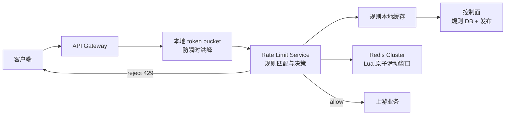

# 设计一个分布式滑动窗口限流系统

## 题目

设计一个部署在 API 网关上的分布式限流系统。它需要支持按租户、用户、API Key、路由和接口维度限流；在多网关实例间保持同一规则的一致配额；默认使用滑动窗口；支持规则动态变更、热点保护、可观测性与故障降级。

进一步说明：现有 YunAPI 网关基于 Traefik + Gubernator，向 Gubernator 请求 `TOKEN_BUCKET` 算法。核对当前 vendored 实现后可见，它按 `Duration` 到期整桶重置，实际行为更接近分布式固定窗口计数。说明其请求链路、与滑动窗口方案的差异，以及如何演进。

## 一、先澄清需求和语义

限流规则至少要包含以下字段：

| 字段 | 示例 | 说明 |
| --- | --- | --- |
| subject | `tenant:t1:user:u1` | 被限流主体 |
| scope | `tenant`、`user`、`apiKey`、`route` | 限流维度 |
| limit | `300` | 窗口内允许的总消耗 |
| window | `60s` | 滑动窗口长度 |
| cost | `1` 或 `5` | 本次请求的消耗；昂贵接口可大于 1 |
| action | `reject`、`shadow` | 拒绝，或仅观测不拦截 |
| failure policy | `fail-open`、`fail-closed` | 频控依赖不可用时的策略 |

一次请求通常会匹配多条规则：

```text
tenant: t1             10,000 / min
tenant: t1 + user: u1     300 / min
tenant: t1 + API Key       100 / min
tenant: t1 + route: pay     20 / min
```

所有规则均通过才放行；任意规则超限则返回 `429 Too Many Requests`。需要明确“被拒请求是否计数”：默认不计入，防止客户端无限重试把恢复时间继续推远；安全/反爬规则可单独配置为计入。

## 二、算法选择

### 1. 默认：滑动窗口计数器

将长度为 `W` 的窗口划分为当前 bucket 和前一 bucket。设：

```text
current      = 当前 bucket 的计数
previous     = 前一 bucket 的计数
elapsed      = 当前 bucket 已经过的时间
effective    = current + previous × (W - elapsed) / W

allow = effective + cost <= limit
```

它消除了固定窗口在边界瞬间重置导致的突发，同时每个主体、规则只需要两个计数器，空间和请求成本均为 `O(1)`。这是普通 API 配额的默认选择。

它是近似算法，不等价于“过去恰好 60 秒内的真实请求数”。若要求严格精确，使用滑动窗口日志。

### 2. 严格规则：滑动窗口日志

为每个 subject/rule 存储过去 `W` 时间内每次请求的时间戳，Redis 使用 ZSET：

```text
ZREMRANGEBYSCORE key 0 now-W
count = ZCARD key
若 count + cost > limit：拒绝
否则 ZADD key now request-id
```

它严格精确，但状态量与 QPS × 窗口长度正相关，热点 key 的内存和清理代价很高。因此仅用于支付、风控、验证码、精确付费额度等少量规则。

### 3. token bucket 的定位

token bucket 更适合“平均速率 + 可控 burst”的流量整形。例如 100 rps、burst 50。它不保证“过去一分钟最多 100 次”的窗口语义；因此本题的配额主算法使用滑动窗口，但仍可作为网关本地的第一层防突发保护。

### 4. 分布式 token bucket：Redis KV 与 Lua 设计

分布式 token bucket 完全可行。关键不是把同一个配置下发到每一台网关，而是让**同一个限流 key 的桶状态只在一个原子存储中扣减**。最常见的实现是 Redis Hash + Lua。

假设规则为“用户 `1000000` 调用 `cvm/2017-03-12/DescribeInstances`：平均 `10 rps`，最多积攒 `20` 个 token”，定义：

```text
subject = sha256("cvm|2017-03-12|DescribeInstances|1000000")
key     = rl:tb:{<subject>}:v1
```

使用 **Hash**，而不是 JSON String：单字段可读写，状态扩展不需要反序列化，便于排障。

```text
HGETALL rl:tb:{...}:v1
tokens       "17.000000"       # 当前可用 token，允许小数
refilled_at  "1720000000123"   # 最近一次计算补充的 Redis 时间，毫秒
rule_version "v1"              # 可选：用于观察/迁移，不参与算法
```

规则配置不应和高频运行状态混在一起。规则放在控制面数据库和 RLS 本地缓存，例如：

```text
rule_id = yunapi.user-api.default
capacity = 20
refill_per_ms = 0.01            # 即 10 token/s
cost = 1
failure_policy = fail-closed
```

桶的 TTL 至少覆盖“从空桶补满”的时间，再加空闲缓冲：

```text
ttlMs = ceil(capacity / refill_per_ms) + idleBufferMs
      = 2,000ms + 60,000ms
```

TTL 到期并不丢失仍应保留的额度：一个很久未访问的桶在语义上早已补满，因此下次可以从满桶重新创建。

#### Lua 的完整决策过程

Lua 脚本将读取、按时间补 token、判断、扣减、回写和 TTL 更新组成一次 Redis 原子执行。时间从 `TIME` 读取，避免网关机器时钟漂移。

```lua
-- KEYS[1] = rl:tb:{subject}:rule-version
-- ARGV[1] = capacity，例如 20
-- ARGV[2] = refillPerMs，例如 0.01
-- ARGV[3] = cost，例如 1
-- ARGV[4] = ttlMs，例如 62000
-- ARGV[5] = ruleVersion，例如 v1

local time = redis.call('TIME')
local now = tonumber(time[1]) * 1000 + math.floor(tonumber(time[2]) / 1000)
local capacity = tonumber(ARGV[1])
local refillPerMs = tonumber(ARGV[2])
local cost = tonumber(ARGV[3])
local ttlMs = tonumber(ARGV[4])

if cost > capacity then
  return {0, '0', '0', '-1'} -- 单次成本大于桶容量，永远不可放行
end

local tokens = tonumber(redis.call('HGET', KEYS[1], 'tokens'))
local refilledAt = tonumber(redis.call('HGET', KEYS[1], 'refilled_at'))

if tokens == nil or refilledAt == nil then
  tokens = capacity
  refilledAt = now
else
  local elapsed = math.max(0, now - refilledAt)
  tokens = math.min(capacity, tokens + elapsed * refillPerMs)
  refilledAt = now
end

if tokens < cost then
  local retryAfterMs = math.ceil((cost - tokens) / refillPerMs)
  redis.call('HSET', KEYS[1],
    'tokens', string.format('%.6f', tokens),
    'refilled_at', tostring(refilledAt),
    'rule_version', ARGV[5])
  redis.call('PEXPIRE', KEYS[1], ttlMs)
  return {0, string.format('%.6f', tokens), tostring(capacity), tostring(retryAfterMs)}
end

tokens = tokens - cost
redis.call('HSET', KEYS[1],
  'tokens', string.format('%.6f', tokens),
  'refilled_at', tostring(refilledAt),
  'rule_version', ARGV[5])
redis.call('PEXPIRE', KEYS[1], ttlMs)
return {1, string.format('%.6f', tokens), tostring(capacity), '0'}
```

返回值依次为 `allowed`、`remainingTokens`、`capacity`、`retryAfterMs`。应用侧用 `SCRIPT LOAD` 预加载脚本，以 `EVALSHA` 调用；收到 `NOSCRIPT` 时重载一次并重试。不要用多次 Redis 命令拼出这个逻辑，否则并发请求会重复消费同一个 token。

对于需要完全避免浮点表示误差的计费场景，将 token 放大为整数，例如 `1 token = 1,000,000 microtoken`；`capacity`、`cost`、补充速率和返回余额都使用整数。普通 API 频控使用小数 token 通常足够。

#### Redis Cluster 与多规则

`{subject}` 是 hash tag，使同一个桶的所有 Hash 操作落在同一 slot。若同一次请求还要同时扣 tenant、user、API Key 三个桶：

- 对同一个主 subject 的多个桶，可使用共同 hash tag，在一个 Lua 脚本中“先检查全部、再扣减全部”；
- 跨 subject 的桶通常不在同 slot，不能在 Redis Cluster Lua 中做全局事务；
- 默认采用保守语义：依次判定，后续规则失败时前面已消费的 token 不回滚；它不会多放请求，只会少量浪费额度；
- 真正要求 all-or-nothing 的跨主体配额，必须让它们共置于一个 shard，或交给强一致的专门配额服务。

## 三、总体架构



### 数据面

数据面在每次请求中执行，必须无状态、低延迟：

1. 网关完成认证，提取可信的 tenant、user、API Key 和标准化路由模板；不能直接信任客户端传来的限流身份 Header。
2. 网关先执行可选 L1 本地 token bucket，抵挡单实例瞬时洪峰。
3. 调用 RLS，或将 RLS 逻辑以内嵌库形式运行在网关中。
4. RLS 从本地规则缓存选出 descriptor，调用 Redis Lua 脚本。
5. 脚本返回 allow/reject、remaining、reset/retry-after；网关决定是否转发上游。

### 控制面

控制面不进入请求主链路，负责：

- 规则 CRUD、版本号、审计和灰度发布；
- 将规则存入 MySQL/PostgreSQL；
- 通过 Pub/Sub、Kafka 或配置推送通知各 RLS 失效/刷新本地缓存；
- 配置每条规则的 failure policy、shadow 模式和允许的维度；
- 维护租户套餐与默认规则。

## 四、Redis 滑动窗口计数器设计

### Key 设计

对窗口 `W=60000ms`，bucket 起点：

```text
bucketStart = floor(nowMs / W) * W
```

键示例：

```text
rl:{t1:u1:payments}:60000:1720000020000
rl:{t1:u1:payments}:60000:1719999960000
```

花括号中的部分是 Redis Cluster hash tag。当前和前一个 bucket 必须落在同一 slot，才能在同一个 Lua 脚本内原子读写。

- 使用 Redis `TIME` 作为决策时钟，避免网关节点时钟漂移。
- TTL 设置为 `2 × W + 随机抖动`，自动回收不活跃主体。
- 对原始用户 ID/API Key 进行稳定编码或 hash，避免 Redis key 泄漏敏感信息与过长 key。

### Lua 原子操作

禁止在应用端做 `GET → 判断 → INCR`：并发请求会都看见旧值，从而超发。Lua 脚本必须将读取、计算、判断、递增、设置 TTL 一次完成。

伪代码：

```lua
-- KEYS[1] currentKey, KEYS[2] previousKey
-- ARGV: windowMs, limit, cost, ttlMs
now = redis.call('TIME')
current = tonumber(redis.call('GET', KEYS[1]) or '0')
previous = tonumber(redis.call('GET', KEYS[2]) or '0')
effective = current + previous * remainingFraction

if effective + cost > limit then
  return {0, limit, floor(max(0, limit - effective)), retryAfterMs}
end

new = redis.call('INCRBYFLOAT', KEYS[1], cost)
if new == cost then redis.call('PEXPIRE', KEYS[1], ttlMs) end
return {1, limit, floor(max(0, limit - effective - cost)), 0}
```

生产实现使用 `SCRIPT LOAD` + `EVALSHA`，Redis 重启/脚本淘汰后再回退到 `EVAL`。限流脚本不能查询数据库，也不应在脚本中做复杂正则、规则匹配。

### 多规则的原子性

一个请求可能命中 tenant、user、route 等多个 descriptor。

- 单一 subject 下的多个窗口可以放在一个 hash slot 中，先全部预检查，再全部递增，做到“全通过或全拒绝”。
- 跨 subject 的 key 通常会位于不同 Redis slot，Redis Cluster Lua 无法做跨 slot 原子事务。
- 默认接受“部分额度已消费但请求最终被更严格规则拒绝”的保守语义；不会多放流量，只会少量浪费额度。
- 若业务必须跨多规则 all-or-nothing，需要将这些计数按同一主维度共置，或改为拥有强一致事务能力的配额服务；不要假设 Redis Cluster 能免费提供跨 slot 原子性。

## 五、可用性、热点和多地域

### 故障策略

| 场景 | 建议 |
| --- | --- |
| 登录、验证码、反爬、昂贵 LLM | fail-closed；必要时以本地严格小额度兜底 |
| 普通读接口 | fail-open + 告警 + 本地 token bucket |
| Redis 超时/连接池饱和 | 快速结束，不无限重试；熔断后按规则策略执行 |
| 规则配置不可用 | 使用最后一个成功版本，记录版本滞后指标 |

### 热点优化

- L1 本地 token bucket 保护网关和 Redis；它是保护层，不是全局额度真相。
- 识别 top-N tenant/API key/route；对热点使用独立 Redis 资源池或更严格上游并发限制。
- 极高 QPS 下可发放短期“额度租约”：RLS 一次从全局取 100/1000 个许可，本地消费；以最多一个 lease 的超发换 Redis QPS。
- 不要把所有请求都计到一个“全站总 key”；按租户与路由分层，再配合独立的全站保护规则。

### 多地域

严格的跨地域全局窗口与低延迟不可同时无代价获得：

1. 单 Region：全部网关访问同一个 Redis Cluster，语义最清晰。
2. 每 Region 独立额度：将全球额度预分配到各 Region，延迟低、容灾好，但额度利用率降低。
3. 短期额度租约 + 异步汇总：允许少量超发，适合保护性限流。
4. 支付、余额、硬计费配额：路由到单主 Region 或强一致配额服务。

## 六、接口、响应与观测

RLS 可以定义为 gRPC，也可以嵌入网关。最小请求：

```json
{
  "descriptors": [
    {"key": "tenant:t1", "limit": 10000, "windowMs": 60000},
    {"key": "tenant:t1:user:u1", "limit": 300, "windowMs": 60000}
  ],
  "cost": 1,
  "mode": "enforce"
}
```

拒绝返回 HTTP `429`，并返回 `Retry-After`、`RateLimit-Limit`、`RateLimit-Remaining`、`RateLimit-Reset`。错误响应不要暴露内部 Redis key、用户身份或规则实现。

必须有的指标：

- `rate_limit_decision_total{rule,scope,result}`；
- `rate_limit_backend_latency_seconds`；
- `rate_limit_backend_error_total{reason}`；
- `rate_limit_shadow_reject_total`；
- 每个规则的 top-N subject（只使用脱敏/hash 标签，避免指标基数爆炸）；
- 配置版本、缓存命中率、Redis 脚本错误、fail-open/fail-closed 次数。

日志只对拒绝和依赖故障采样；不要为每一个成功请求记录 INFO 日志。

## 七、YunAPI 当前实现的实际链路

YunAPI 不只有一套限流能力，需区分标准 Traefik 和 TCE 扩展。

### 标准 Traefik `RateLimit`

`pkg/middlewares/ratelimiter/rate_limiter.go` 使用 Go 的 `x/time/rate.Limiter`，以来源 IP、请求 Header 或 Host 为 key，在每个 Traefik 进程的 `ttlmap` 内维护 token bucket。

```text
请求 → source extractor → 本机 ttlmap[source] → rate.Limiter.Reserve()
                         → 延迟在容许范围内则转发，否则 429
```

它是本地 token bucket：多副本网关间不共享 bucket，因此一个用户轮询 N 个网关实例，理论上可获得约 N 倍额度。它适合 L1 防突发和单实例保护，不能承担全局配额。

### YunAPI `GlobalRateLimit`

YunAPI 请求路由实际挂载的是 TCE 的 `GlobalRateLimit`。`tce/config/entrypoint.yaml` 中 TC2/TC3/TC3Stream 都将它放在 `CamAuth` 之后，因此可使用已认证的登录身份。

请求路径：

```text
HTTP 请求
  → Unify：解析 module/version/action 与接口元数据
  → CamAuth：得到 OperatorUin
  → GlobalRateLimit
  → Gubernator gRPC GetRateLimits
  → 后端服务
```

该中间件：

1. 从接口元数据读 `RateLimit`，并可按 `RateLimitWhitelist` 对指定 UIN 覆盖额度；
2. 以 `module|version|action|loginUin` 组成 `UniqueKey`；
3. 固定设置 `Hits=1`、`Duration=1s`、`Algorithm=TOKEN_BUCKET`、`Behavior=NO_BATCHING`；
4. 调用 Gubernator；超限则转为 YunAPI 的频控错误；
5. gRPC 失败时当前代码直接返回内部依赖错误；若 Gubernator 返回业务 `Error`，才由 `failureDeny` 决定是否拒绝。

Gubernator 会为同一个 key 选 owner；非 owner 节点把请求转发给 owner，因此同一 Gubernator 集群内，同 key 的额度可以集中决策。请求中的算法枚举虽为 `TOKEN_BUCKET`，但当前 vendored `tokenBucket()` 实现保存 `Remaining` 和 `ExpireAt`，在创建时设 `ExpireAt = now + Duration`，并在到期后恢复完整 `Limit`；它没有按每次请求的 elapsed time 连续 refill。因此 YunAPI 当前实际是按 owner 集中的**固定窗口计数语义**，不是标准的连续补充 token bucket，也不是滑动窗口。

#### 具体 YunAPI 调用推演

以下示例是根据仓库 TC3 路由与 middleware 代码构造的调用。网关域名以部署实际域名替换；模块名来自 host 的第一个标签，版本和动作来自 TC3 headers：

```http
POST / HTTP/1.1
Host: cvm.<yunapi-gateway-domain>
Content-Type: application/json
Authorization: TC3-HMAC-SHA256 Credential=..., Signature=...
X-Tc-Version: 2017-03-12
X-Tc-Action: DescribeInstances
X-Tc-Region: ap-guangzhou
X-Tc-Timestamp: 1720000000

{"Limit":20}
```

假设 CAM 鉴权后的 `OperatorUinStr = "1000000"`，并且元数据中的该接口 `RateLimit = 10`，没有对该 UIN 的白名单覆盖。实际过程为：

1. `UnifyTC3` 从 Host、`X-Tc-Version`、`X-Tc-Action` 取出 `cvm`、`2017-03-12`、`DescribeInstances`，并查询接口元数据。
2. `CamAuthTC3` 校验 Authorization，向 request context 写入 `OperatorUinStr="1000000"`。
3. `GlobalRateLimit` 组装：

   ```text
   UniqueKey = "cvm|2017-03-12|DescribeInstances|1000000"
   Name      = "traefik"
   Limit     = 10
   Duration  = 1000 ms
   Hits      = 1
   Algorithm = TOKEN_BUCKET
   Behavior  = NO_BATCHING
   ```

4. 网关以 30ms 配置超时调用 `GetRateLimits`。Gubernator 将该 UniqueKey 一致性路由到它的 owner；该 key 首次出现时记录 `Remaining=Limit-Hits=9`、`ExpireAt=now+1000ms`。连续前 10 次请求各扣 1 个并放行，第 11 次在该 expiry 前返回 `OVER_LIMIT`。
5. 网关将 `OVER_LIMIT` 映射为 YunAPI 的 `ErrorRateLimit`，不再调用后端。即使在 100ms 后再请求，也仍会被拒绝；只有这个 key 的 1 秒 expiry 到期后，Gubernator 才重新创建满额度计数并再次放行。

所以这里的 `Limit=10`、`Duration=1s` 表示“owner 所在固定 1 秒周期内至多 10 次”，而不是持续补充速率。当前代码也没有把业务 burst 传给 Gubernator；它把 `Burst` 字段用于追踪时间戳，且该版本的 token-bucket 实现不读取该字段。应将 trace 放入 gRPC metadata/OpenTelemetry context，并在需要真正 token bucket 时明确实现 `capacity` 与连续 refill。

如果未来将该规则迁移到上面的 Redis token bucket，可设 `capacity=10`、`refillPerMs=0.01`、`cost=1`，并使用：

```text
rl:tb:{sha256(cvm|2017-03-12|DescribeInstances|1000000)}:v1
```

该 Redis Hash 里的 `tokens` 从 10 递减到 0；100ms 后按速率补回约 1。它**不等同于当前 YunAPI 行为**：它是连续 refill 的标准 token bucket，而当前 Gubernator 路径是到期整桶重置。二者都可以是分布式的，但客户端体验和边界流量不同。

## 八、当前 YunAPI 与目标方案的差异

| 项目 | YunAPI 当前 `GlobalRateLimit` | 目标滑动窗口方案 |
| --- | --- | --- |
| 主算法 | 请求枚举为 `TOKEN_BUCKET`；当前版本实际按 `Duration` 整桶重置 | 默认滑动窗口计数器；严格规则用 ZSET 日志 |
| 窗口语义 | 当前实现为 `Duration` 到期整桶重置；存在固定窗口边界突发 | 最近 W 时间内的平滑/精确配额 |
| 全局一致性 | 同 key 路由到 Gubernator owner | Redis Lua 对同 slot key 原子计数 |
| 限流 key | `module|version|action|loginUin` | tenant/user/API Key/route 等可组合 descriptor |
| 请求权重 | 固定 `Hits=1` | 支持 `cost` |
| 规则来源 | 接口 metadata + UIN 白名单 | 控制面规则、版本、灰度、审计与缓存 |
| 多规则 | 一次仅一个 key | 多 descriptor 与明确的部分消费语义 |
| 失败策略 | 配置有 `failureDeny`，但 gRPC transport error 当前直接报内部错误 | 每规则 fail-open/fail-closed，配合熔断与 L1 兜底 |
| 客户端反馈 | YunAPI 业务错误；代码未设置标准额度 headers | 429 + Retry-After + RateLimit-* headers |
| 可观测性 | access log 中有频控耗时，且逐请求 INFO 日志 | 指标、拒绝采样、规则维度的可控基数 |

## 九、针对 YunAPI 的改进建议

### P0：先修正现有全局频控的可靠性和表达

1. `globalratelimit.overLimit()` 的 gRPC transport error 目前无条件转为内部错误，未使用 `failureDeny`。应统一定义：gRPC 超时、连接失败、协议错误、Gubernator 返回 `rl.Error` 分别走哪种 failure policy；不要让同一“频控依赖不可用”出现两套语义。
2. 给 `GlobalRateLimit` 增加连接复用、健康检查、熔断和明确的超时预算；构造函数当前创建 client，但未保留/关闭底层 `ClientConn`。
3. 返回标准 HTTP 429 与 `Retry-After`；可在不破坏 YunAPI 错误体的前提下增加 `RateLimit-*` headers。Gubernator response 已有 `Limit`、`Remaining`、`ResetTime`。
4. 成功请求的 `Infof` 日志会在高 QPS 下制造大量日志与成本，应降到 debug 或改为 Prometheus 指标。
5. `Burst` 字段当前被借用于 trace 时间戳。协议字段应保持其算法含义；把 trace ID 放 gRPC metadata 或 OpenTelemetry context，避免未来 Gubernator 行为升级后产生隐患。

### P1：把“算法”做成按规则可选，而不是全局硬编码 token bucket

扩展 `GlobalRateLimit` / 接口 metadata：

```yaml
algorithm: sliding-window-counter # 或 token-bucket、sliding-window-log
window: 60s
limit: 300
burst: 30                         # 仅 token bucket 生效
dimensions: [tenant, user, route]
cost: 1
failurePolicy: fail-closed
mode: enforce                      # 或 shadow
```

不要把滑动窗口硬塞进现有 Gubernator 请求。更稳妥的演进是：新增 RLS provider 或在 Gubernator 前新增可选的 Redis 滑动窗口 backend，保留现有固定窗口兼容路径，并额外实现真正 token bucket 路径，按接口灰度切换。

### P2：加入滑动窗口服务

在 `GlobalRateLimit` 中间件后抽象一个内部接口：

```go
type Evaluator interface {
    Check(ctx context.Context, descriptors []Descriptor, cost int64) (Decision, error)
}
```

实现：

- `GubernatorEvaluator`：保持现有 Gubernator 固定窗口兼容行为；
- `RedisSlidingWindowEvaluator`：Redis Cluster + Lua；
- `ShadowEvaluator`：只打点，不拦截，用于验证新规则。

网关仍只负责身份提取、descriptor 构造和响应映射；算法/存储可独立演进与压测。

### P3：分层和多维度配额

保留现有 `module|version|action|loginUin` 作为用户接口额度，再增加：

- tenant 全局额度，防单租户打满系统；
- route/API 额度，保护高成本接口；
- API Key 额度，适配机器调用；
- IP/匿名额度，位于认证之前，保护登录和公开接口；
- L1 本地 token bucket，保护网关与频控后端。

认证后按 UIN 限流是正确的；但认证前公开接口不能依赖 `OperatorUin`，需要独立的 IP/API Key key 规则。

## 十、面试回答主线

1. 先问清楚：是要控制平均速率、限制最近 N 秒请求数，还是保护下游并发；算法不能脱离语义。
2. 默认选滑动窗口计数器，解释公式、近似误差与为什么不是固定窗口。
3. 用 Redis Lua 保证原子性，说明 Cluster hash slot 和多规则跨 slot 的取舍。
4. 讲清控制面/数据面分离、身份可信来源、429 与可观测性。
5. 主动说明 Redis/RLS 故障策略、热点、租约和多地域下严格一致性的不可能三角。
6. 最后补充：token bucket 仍保留为 L1 突发保护；严格精确规则才使用 ZSET。

## 代码定位

- 标准本地 token bucket：`/Users/yaao/Documents/code/traefik/pkg/middlewares/ratelimiter/rate_limiter.go`
- 标准 RateLimit 配置：`/Users/yaao/Documents/code/traefik/pkg/config/dynamic/middlewares.go`
- YunAPI 全局中间件：`/Users/yaao/Documents/code/traefik/tce/pkg/middlewares/globalratelimit/globalratelimit.go`
- YunAPI 限流配置：`/Users/yaao/Documents/code/traefik/tce/pkg/config/dynamic/middlewares.go`
- YunAPI 请求中间件顺序：`/Users/yaao/Documents/code/traefik/tce/config/entrypoint.yaml`
- Gubernator owner 转发逻辑（vendor）：`/Users/yaao/Documents/code/traefik/vendor/github.com/mailgun/gubernator/v2/gubernator.go`
