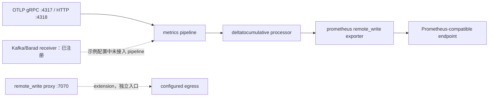
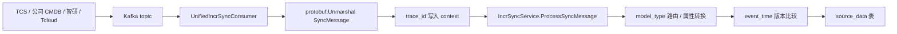
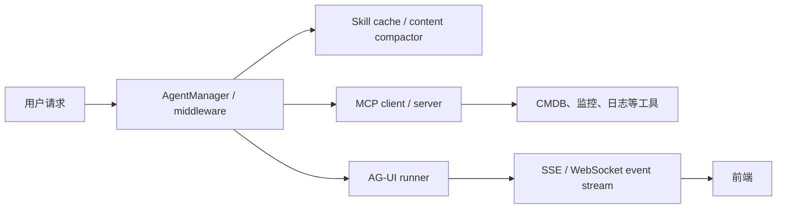
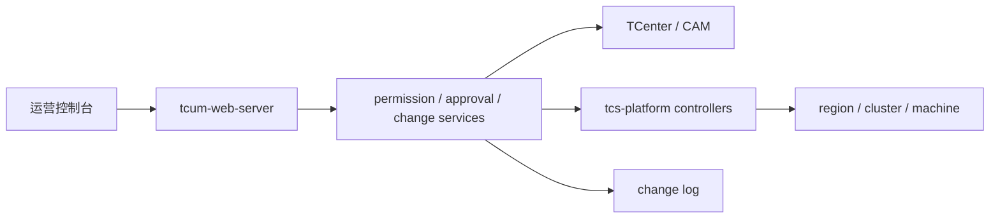

# 源码核验与深挖补充

> 这是高频项目题的**代码校验版答案**。每条均区分“代码已证实”和“工程推演”，避免把依赖、示例配置或设计文档说成线上事实。源码路径以本机工作区为准；敏感地址、账号与密钥不复述。

## 使用方式

- 先答“结论”，再用“代码证据”讲清一段调用链；继续追问时再谈风险和边界。
- 只有“代码已证实”可作为项目事实；“建议”不能说成已上线。
- 当前示例配置并没有让 Kafka receiver 进入 metrics pipeline，不能说所有协议走同一条链。

## 1. 统一指标网关：真实的接入与写出链路

### Q1 / Q2：网关如何接入、转换并写出指标？

**可直接回答：** 这不是只做 HTTP 转发的网关，而是以 OpenTelemetry Collector 组件模型组装的 metrics 数据面。`cmd/components.go` 注册了 OTLP receiver、自定义 Kafka receiver、batch / delta-to-cumulative processor、自定义 Prometheus remote_write exporter，以及 remote-write proxy extension。当前 `config/config.yaml` 中**实际声明**的 metrics pipeline 是 `otlp → deltatocumulative → prometheusremotewrite`；OTLP 同时开放 gRPC `4317` 和 HTTP `4318`。exporter 将 OTLP `pmetric.Metrics` 翻译为 Prometheus `TimeSeries`，按批切分、Snappy 压缩后写到 remote-write endpoint。

**代码证据：**

- [组件注册](/Users/yaao/Documents/code/unified-gateway/cmd/components.go:23) 同时注册 OTLP、Kafka、processor 和自定义 exporter。
- [实际 pipeline](/Users/yaao/Documents/code/unified-gateway/config/config.yaml:50) 只列出 `otlp`、`deltatocumulative`、`prometheusremotewrite`；已注册 Kafka receiver 不等于已接入这条 pipeline。
- [协议入口](/Users/yaao/Documents/code/unified-gateway/config/config.yaml:1) 配置 OTLP gRPC / HTTP 监听端口。
- [转换与写出](/Users/yaao/Documents/code/unified-gateway/exporter/prometheusremotewriteexporter/exporter.go:201) 调用 `FromMetrics`，部分转换失败时仍发送已成功转换的序列。

**追问与边界：** delta-to-cumulative 解决累积型指标的时序语义，不等于去重。高基数治理、租户标签策略、限流和鉴权不能仅凭 `include_metadata` 就说已实现，须再看生产配置或对应 processor。

### Q3：remote_write 失败时，数据一定不丢吗？

**可直接回答：** 不能说“一定不丢”。代码提供 WAL、批大小、并发和 retry 配置能力，但是否启用 WAL、队列和实际参数取决于部署配置。示例 `config.yaml` 没有 `wal` 或 `remote_write_queue`，因此只能说组件支持，不能说该环境已经靠 WAL 兜底。

**代码证据：**

- [配置模型](/Users/yaao/Documents/code/unified-gateway/exporter/prometheusremotewriteexporter/config.go:14) 包含 retry、queue、WAL、批大小与并行度。
- [配置校验](/Users/yaao/Documents/code/unified-gateway/exporter/prometheusremotewriteexporter/config.go:83) 拒绝负队列与“启用但容量为 0”的丢数配置；默认批大小约 3 MB。
- [WAL 分支](/Users/yaao/Documents/code/unified-gateway/exporter/prometheusremotewriteexporter/exporter.go:247) 未启用时直接 export，启用时先持久化、由另一 goroutine 发送。

**工程推演：** 生产上应同时看 exporter 发送批次、转换失败、请求失败、WAL backlog / 磁盘占用及目的端 429 / 5xx。WAL 抵抗瞬态故障，但会引入磁盘与重放延迟风险。

### Q4 / Q5：Kafka 消费的可靠性如何说？

**可直接回答：** Kafka receiver 采用 consumer group；启动时把 offset 自动提交、session / heartbeat、抓取大小等映射到 Sarama。为了处理 rebalance，消费循环反复调用 `Consume`。单条消息先按编码反序列化，再交给下游 `ConsumeMetrics`；代码记录 partition、当前 offset 和 lag。提交时机由 `messageMarking` 和 `autoCommit` 决定，所以不能脱离实际配置笼统称为 exactly-once。

**代码证据：** [Sarama 参数映射](/Users/yaao/Documents/code/unified-gateway/receiver/kafkareceiver/kafka_receiver.go:64)、[rebalance 循环](/Users/yaao/Documents/code/unified-gateway/receiver/kafkareceiver/kafka_receiver.go:160)、[offset / lag 指标](/Users/yaao/Documents/code/unified-gateway/receiver/kafkareceiver/kafka_receiver.go:258)、[提交边界](/Users/yaao/Documents/code/unified-gateway/receiver/kafkareceiver/kafka_receiver.go:241) 和 [前/后标记](/Users/yaao/Documents/code/unified-gateway/receiver/kafkareceiver/kafka_receiver.go:254)。

**追问要点：** “处理后标记 + 下游幂等”通常实现至少一次语义；处理前标记会有失败丢消息窗口。使用哪一种必须以 `message_marking` 的生产配置为证。

## 2. CMDB：协议、顺序与版本控制

### Q1 / Q9 / Q10：多源增量同步的统一契约是什么？

**可直接回答：** 统一增量消息并非裸 JSON。`SyncMessage` 包含 `trace_id`、操作类型、`model_type`、`event_time`、`source` 和 metadata；payload 通过 Protobuf `oneof` 区分 create / update / delete / batch upsert。资源 ID 位于每类 payload 内，更新还分离更新字段与删除字段。因此消费端可以按 `model_type` 路由，并保留可观测关联和操作语义。

**代码证据：** [消息结构](/Users/yaao/Documents/code/tcum-cmdb-global/service/kafka/kafkapb/common_incr_sync_message.proto:11)、[操作枚举](/Users/yaao/Documents/code/tcum-cmdb-global/service/kafka/kafkapb/common_incr_sync_message.proto:31)、[更新字段语义](/Users/yaao/Documents/code/tcum-cmdb-global/service/kafka/kafkapb/common_incr_sync_message.proto:110)、[消费者入口](/Users/yaao/Documents/code/tcum-cmdb-global/service/kafka/consumer/unified_incr_sync_consumer.go:200)。

**追问边界：** `trace_id` 用于关联，不是幂等键。幂等依赖资源主键、消息唯一性或条件写；在未核到生产者 message ID 与 DAO 条件更新前，不能称协议“天然幂等”。

### Q11 / Q12 / Q13：如何处理乱序、全量与增量并发？

**可直接回答：** 设计选择最终一致性而非分布式锁：增量事件以 `event_time` 为版本，只有新版本才覆盖旧版本；全量同步以同步开始时间作为版本。全量/增量竞态和 Kafka 乱序最终收敛为“新版本胜出”。这是乐观并发控制，不承诺任意瞬时读取都强一致。

**证据与边界：** [演进动机](/Users/yaao/Documents/code/tcum-cmdb-global/INCR_SYNC_DESIGN.md:34)、[版本与最终一致性规则](/Users/yaao/Documents/code/tcum-cmdb-global/INCR_SYNC_DESIGN.md:83)、[竞态场景与比较条件](/Users/yaao/Documents/code/tcum-cmdb-global/INCR_SYNC_DESIGN.md:190)。这部分是仓库设计文档证据；delete、batch 与所有 DAO 是否已经完整落地，仍应沿 `IncrSyncService → DAO → migration` 继续核验。

### Q3 / Q19：Flink CDC 自定义模型怎样发布和回滚？

**可直接回答：** Flink CDC 被建模为与数据源类型正交的同步模式。脚本保留历史版本、灰度地域、SQL hash、Lint 结果和状态机：`DRAFT → VALIDATED → ACTIVE`，运行中可 `PAUSED`，新版本替换旧版本后标记 `SUPERSEDED`。发布、暂停和回滚围绕状态机而非直接改线上 SQL。

**代码证据：** [正交模型](/Users/yaao/Documents/code/tcum-cmdb-global/service/dao/entity/custom_model_entity/flink_cdc_entity.go:3)、[版本/灰度/Lint 字段](/Users/yaao/Documents/code/tcum-cmdb-global/service/dao/entity/custom_model_entity/flink_cdc_entity.go:27)、[状态定义](/Users/yaao/Documents/code/tcum-cmdb-global/service/dao/entity/custom_model_entity/flink_cdc_entity.go:92)、[转换规则](/Users/yaao/Documents/code/tcum-cmdb-global/service/dao/entity/custom_model_entity/flink_cdc_entity.go:117)。

**边界：** 代码注释明确 `PAUSED` 仅是 CMDB 层状态、不联动 Flink 平台；不能声称暂停必然停止实际作业，除非再展示编排调用证据。

## 3. TCUM AI：Agent、MCP、Skill 与 AG-UI 的边界

### Q1 / Q2：多 Agent 架构如何做严谨表述？

**可直接回答：** 代码库可确证有 Agent 层、MCP 工具层和 AG-UI 交互层。Agent 基础层包含工具错误、动态 MCP、上下文自适应重试、摘要和 Skill 内容压缩；业务工具按可观测领域注册。因此项目事实应讲为“为 Agent 提供可治理的工具和上下文”。固定路由模型、自治协作策略或并行度，需要以 manager 初始化与生产配置为准，不能只凭目录断言。

**代码证据：** [Agent 管理器](/Users/yaao/Documents/code/tcum-ai/pkg/agent/manager.go:1)、[错误中间件](/Users/yaao/Documents/code/tcum-ai/pkg/agent/tool_error_handler_middleware_test.go:1)、[上下文重试](/Users/yaao/Documents/code/tcum-ai/pkg/agent/adaptive_context_retry.go:1)、[MCP client](/Users/yaao/Documents/code/tcum-ai/pkg/mcp/client.go:1)、[MCP server](/Users/yaao/Documents/code/tcum-ai/pkg/mcp/server.go:1)、[CMDB 工具注册](/Users/yaao/Documents/code/tcum-ai/usercases/mcp_server/obs_cmdb/tool_register.go:1)。

### Q6 / Q7：MCP Provider 与 Consumer 的边界？

**可直接回答：** Consumer 让 Agent 发现、调用外部 MCP 工具；Provider 把 CMDB、Grafana、日志等能力封装成输入输出契约明确的工具。共同治理点应是认证、超时、参数校验、错误映射和审计，而不是让模型直连后端。代码同时有 client、server 和领域 `tool_register.go`，故这种分层有直接证据。

**边界：** 不能由目录存在推出所有工具都支持并行、最小权限或完整审计；需继续核 client middleware、鉴权 bootstrap、schema 和日志字段。

### Q9：AG-UI 的流式边界？

**可直接回答：** AG-UI 是前端请求与 runner 事件流之间的适配层，允许 SSE、WebSocket 等传输实现。它既不是模型推理引擎，也不等于持久化记忆；不要把 UI streaming 与 Agent 调度、工具执行混为一谈。

**代码证据：** [AG-UI Service 接口](/Users/yaao/Documents/code/tcum-ai/pkg/agui/eino-agui/service/service.go:17) 明确契约为“接收请求 → 转发 runner → 返回事件流”。

### Q10 / Q11 / Q12：Skill 如何构建及如何控制敏感信息？

**可直接回答：** Skill 源文件和构建产物分离。构建脚本生成 internal / public 两类产物；public 产物会重写 MCP 地址与鉴权，internal 构建也会移除指定敏感鉴权头。Skill 按模块拆分，Agent 层另有 cache 与 content compactor 实现入口。文件分层为渐进披露提供基础，但“每轮只加载最小内容”须再看实际调用链，不能仅凭目录下结论。

**代码证据：** [构建产物说明](/Users/yaao/Documents/code/tcum-ai-skills/scripts/build_skills.py:4)、[敏感头定义](/Users/yaao/Documents/code/tcum-ai-skills/scripts/build_skills.py:36)、[重写逻辑](/Users/yaao/Documents/code/tcum-ai-skills/scripts/build_skills.py:61)、[Skill cache](/Users/yaao/Documents/code/tcum-ai/pkg/agent/skill_cache.go:1)、[内容压缩](/Users/yaao/Documents/code/tcum-ai/pkg/agent/skill_content_compactor.go:1)。

## 4. 统一运维底座：权限、审批与多集群的证据边界

### Q4 / Q5 / Q6：权限、CAM 和审批如何回答才不空泛？

**可直接回答：** 仓库能直接证实平台将权限、审批和变更服务拆分：`tcum-web-server` 有 permission、approval、approval stage / mapping、change log service；`tcs-platform` 有 TCenter 认证和 CAM client。项目事实应表达为“控制面把身份/授权、审批编排和变更记录分层”。CAM policy 的资源粒度、审批节点、是否全量审计，则需查看具体策略和流程实现，不能直接断言。

**代码证据：** [权限服务](/Users/yaao/Documents/code/tcum-web-server/service/service/permission_service.go:1)、[审批服务](/Users/yaao/Documents/code/tcum-web-server/service/service/approval_service.go:1)、[变更日志](/Users/yaao/Documents/code/tcum-web-server/service/service/change_log_service.go:1)、[CAM client](/Users/yaao/Documents/code/tcs-platform/pkg/clientset/auth/tcenter/cam.go:1)。

### Q9 / Q10 / Q11：多地域、多集群与容灾的事实边界？

**可直接回答：** `tcs-platform` 有 region、cluster、machine controller / clientset，Helm chart 也包含 RBAC 和监控资源，足以证明面向多集群基础资源的控制面代码。两地三中心、RPO/RTO、跨地域自动切换却是更高层容灾结论，必须再引用部署拓扑、演练报告或生产配置；不能由 controller 文件存在推出。

**代码证据：** [region controller](/Users/yaao/Documents/code/tcs-platform/pkg/clientset/controllers/tcns/region.go:1)、[cluster controller](/Users/yaao/Documents/code/tcs-platform/pkg/clientset/controllers/tcns/cluster.go:1)、[machine controller](/Users/yaao/Documents/code/tcs-platform/pkg/clientset/controllers/tcns/machine.go:1)、[部署 RBAC](/Users/yaao/Documents/code/tcs-platform/helm/apiserver/templates/rbac.yaml:1)、[监控模板](/Users/yaao/Documents/code/tcs-platform/helm/apiserver/data/tcs-platform-monitor.yaml:1)。

## 面试前最后核对

1. 用实际 values / 配置核对 pipeline、WAL、队列、限流、TLS 与鉴权，不要拿测试配置替代线上事实。
2. 沿 CMDB 的 `IncrSyncService → DAO → migration` 核对版本比较是否真正落库，重点查 delete / batch。
3. 沿 AgentManager 初始化、middleware 和生产 appconfig 核对路由、并行、重试阈值及 memory 存储。
4. 容灾、容量、SLO 数字仅在有监控、压测或演练记录时宣称“已达到”。
