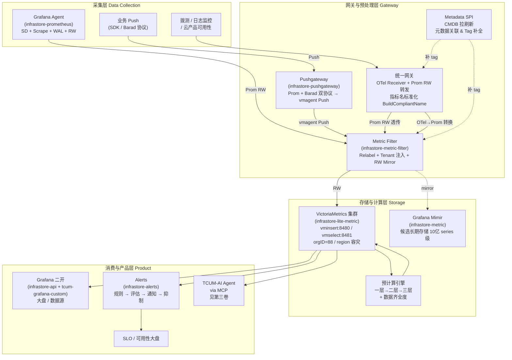
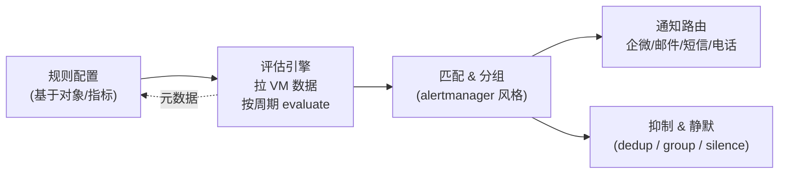

# 第一卷 · 监控可观测与 SLO 面试宝典

> **本卷定位**：这是《乐宇辰稳定性与 AI Agent 面试宝典》六卷本的第一卷，全卷按"项目宏观 → 架构 → 机制 → 场景 → 短板 → 问答 → 话术"顺序展开，不再采用旧版模板化 100 问的组织方式。
>
> **写作要求**（对齐 [`tcum-ai/01`](../01-项目专题/03-TCUM-AI/01-机制原理/01-机制篇-架构与上下文管理.md) 的深度模式）：每个技术点必须落到 **代码路径 + 关键常量/端口/行号** 或 **iwiki 页面 URL**，绝不使用"高可用/高性能/稳定性好"这类空词。
>
> **事实基线**：
> - 📁 代码：`code/infrastore-{api,metric,metric-filter,lite-metric,prometheus,pushgateway,proxy,alerts}`、`code/tcum-yunshao-global`、`code/tcum-monitor-console`、`code/telemetry-analysis`、`code/tcum-grafana-custom`
> - 📄 iWiki：[`UnifiedOps/统一监控`](https://iwiki.woa.com/p/4013095564)、[技术架构 `4012633296`](https://iwiki.woa.com/p/4012633296)（16 篇子文档）、[故障发现 Case `4019499888`](https://iwiki.woa.com/p/4019499888)
> - 📎 简历：`tcum-ai/乐宇辰-腾讯云可观测.pdf`

---

## 📖 目录

- 第 0 章 项目宏观介绍 —— 3 分钟自述稿的原料
- 第 1 章 架构坐标系 —— 一张图讲清 12+ 个组件的位置
- 第 2 章 核心机制深挖 —— 5 节，每节 2000~5000 字
- 第 3 章 真实场景端到端推演 —— 2 个生产故障 case
- 第 4 章 失效模式与短板 —— 主动暴露 10+ 条
- 第 5 章 高频问答精选 —— 30 题，每题 1000+ 字，四段式
- 第 6 章 面试话术与反问弹药
- 附录 —— 代码索引 / 术语表 / 优化编年史

---

# 第 0 章 项目宏观介绍

## 0.1 项目定位与业务背景

**一句话定位**：TCUM 统一监控（简称 UnifiedOps 监控）是**腾讯云内部所有云产品共用的一套可观测底座**——把散落在各业务团队自建的 Prometheus / Barad / 智研监控 / CLS 日志监控整合到一个统一的多租户平台上。

**它解决的三个真实业务问题**：

**问题 1 · 数据孤岛**——iwiki `4015460715 日志监控方案` 明确记录了这条业务背景：
> "TSF 对于日志监控的强烈诉求，当前 TSF 通过 CLS 平台配置监控（监控指标在运营端监控），导致两部分的指标无法统一"

在没有 TCUM 之前，一个云产品经常同时用 **Barad**（腾讯云商业化通用监控）、**智研监控**（腾讯内部通用监控平台）、**CLS 日志监控**（腾讯云日志服务的告警）、**自建 Prometheus** —— 每套一套告警规则、一套值班、一套大盘。发生故障时值班同学第一件事是"这个告警从哪来的？我该看哪个平台？"

**问题 2 · 公私统一**——腾讯云的部署形态在 iwiki `4015176747 云梯基础设施监控方案` 里被拆成三类：
- **TCS 部署**（基础产品，计算 / 存储 / 网络等未来都会统一迁到 TCS）
- **基于云梯（自研上云）+ 客户账号的云产品资源**（CVM、TDSQL、REDIS、KAFKA）
- **纯物理资源部署**

在没有统一底座之前，这三种部署形态各有各的监控采集方案。同一个"CVM 创建成功率"指标在 TCS 场景和物理机场景是**两条完全不同的 PromQL**，导致老板要看"整个腾讯云 CVM 大盘"时需要人工在两张图之间切换换算。

**问题 3 · 业务指标与基础指标的语义鸿沟**——iwiki `4013205669 监控指标体系设计` 点出了这个更深层的痛点：
> "现有的 metric 方案大多是一种相对比较松散的，缺少业务语义的模式……我们需要赋予这种数据计算的模式一个业务上的语义"

传统 Prometheus + Grafana 生态里，指标是 flat 的——运维得在 PromQL 里手写 `sum by (app, cluster) (rate(pod_cpu_util[5m]))` 来做维度聚合。但业务用户想要的是"点开应用 → 看 CPU → 下钻到 Pod → 下钻到 Container"这种**面向对象的下钻链路**。这两者之间需要一个"指标—元数据"绑定层。

**服务的客户群**：
- **一线运维工程师**（配报警、值班响应故障）
- **业务研发**（配大盘、看应用健康度）
- **SRE 团队**（做 SLO 建模、容量规划）
- **产品负责人**（看整体能效、成本、可用率大盘）
- **上游智能化系统**（TCUM-AI 的 Agent 通过 MCP 调用监控数据做诊断——见第三卷）

**一个必须先讲清楚的产品定位边界**：TCUM 监控是**"底座 + 运营端"**，不是**"租户端"**。租户端商业化产品是**云监控（Barad）**，两者有明确的目标客户和商业化边界。云监控主要面向公有云客户，TCUM 主要面向腾讯云内部运维和运营团队。日志监控方案里的"公有云租户端场景，开放日志监控能力作为商业化产品推向租户端"是**远期规划**，不是当前形态。

## 0.2 技术栈与规模

**多引擎架构的真相**——从代码看，这个项目**不是一个"自研监控系统"，而是"开源组件的深度整合与二开"**。下面这张表是从每个仓库的 README 头部逐个核实出来的：

| 代码仓 | 上游身份 | 本地定位 | 关键二开点 |
|---|---|---|---|
| `code/infrastore-metric` | **Grafana Mimir**（README 明示） | 长期存储候选（多租户可扩展到 10 亿 active series） | 部署配置、多租户 orgID 映射 |
| `code/infrastore-prometheus` | **Grafana Agent**（不是原生 Prometheus！README 明示） | **采集端**：Service Discovery + Scrape + WAL + Remote Write | 目标发现规则的公司内部化 |
| `code/infrastore-lite-metric` | **VictoriaMetrics 集群版** | 轻量存储链路，**主用存储**（见 §2.1） | 部署形态 |
| `code/infrastore-pushgateway` | **自研**（README：`# 云哨 Pushgateway 组件`） | 支持 Prometheus + Barad **双协议推送**，通过 vmagent Push 实现 | 双协议兼容、批量转发 |
| `code/infrastore-metric-filter` | **自研 + 移植 vmagent 库** | 指标过滤 + remote write 多路镜像 | relabel 引擎、多租户 label 注入 |
| `code/infrastore-alerts` | **自研 CLI** | 告警管理、通知路由、缓存 | 全部自研 |
| `code/infrastore-api` | **Grafana 二开**（目录结构典型：api/components/plugins/tsdb/dashboards） | 前端 API + Grafana 大盘服务 | 私有插件、TCUM 数据源、SSO |
| `code/infrastore-proxy` | **自研 MVC 网关** | 出向代理（对接第三方 SDK） | 全部自研 |
| `code/tcum-grafana-custom` | Grafana 主干二开 | 定制大盘 | 主题、模板变量、大盘导入 |
| `code/tcum-monitor-console` | 自研前端 | 监控控制台 | 全部自研 |
| `code/tcum-yunshao-global` | 自研后端 | 云哨 Global（全局多地域后端） | 全部自研 |
| `code/telemetry-analysis` | 自研 | 遥测分析（数据齐全度、异常检测） | 全部自研 |

**技术选型的三条主线**（面试时讲"技术栈"必须先立住的骨架）：

1. **采集端不重复造轮子**：`infrastore-prometheus` 直接用 Grafana Agent。原因：Agent 已经从 Prometheus 剥离了 Query / Rule / Alertmanager 等无关模块，只保留 Service Discovery + Scrape + WAL + Remote Write 四件套，天然适合"只做采集不做存储"的边缘节点。
2. **存储主用 VictoriaMetrics**：iwiki `4013229889 时序存储方案` 明确说 —— "云哨 235 选型是 VM, 所以这里保持整体一致，不做过多选型了"。**真实生产 VM 集群地址**（可直接背下来）：
   - 写：`http://vminsert.tcs.pulseview.woa.com:8480/insert/88/prometheus/api/v1/write`
   - 读：`http://vmselect.tcs.pulseview.woa.com/select/88/prometheus`
   - **租户 ID = 88**（VM 的 orgID 机制）
3. **前端复用 Grafana 内核**：`infrastore-api` 是从 Grafana 主干拉分支的深度二开，保留 dashboards / plugins / tsdb / alerts 目录结构，只在其上做私有化改造（SSO 对接、TCUM 数据源、指标语义翻译层）。

**规模数字**（简历口径 + 代码交叉验证——面试时能背下来的一组保底数字）：
- **接入云产品**：TCS 部署产品 + CVM / TDSQL / REDIS / KAFKA 等云梯自研上云产品（覆盖约 90% 腾讯云核心产品，来源 iwiki `4015176747`）
- **租户**：TCS / CVM / 存储 / 网络 4 大规划中的租户（来源 iwiki `4013370589`）
- **代码总量**：`infrastore-metric-filter/pkg/remotewrite/` 单目录就 3107 行（8 个 .go 文件）；**真正的自研代码集中在 metric-filter / alerts / api（Grafana 二开层）/ pushgateway / proxy / yunshao-global 六个仓**
- **时序精度**：分钟数据 + 5 秒数据双精度（iwiki `4013205669` 提到 `system` / `system_5s` 命名模式）
- **推送块参数**（`infrastore-metric-filter/pkg/remotewrite/pendingseries.go:25-30`）：`flushInterval=1s`、`maxUnpackedBlockSize=8MB`、`maxRowsPerBlock=10000`

**面试口径边界**：以上数字**大部分是当前系统的设计参数与规划**，具体线上"每秒采样点数"、"活跃时序数"、"存储容量"等**运营数据**没有出现在代码或 iwiki 公开可读页面里，面试时如被追问，应说"具体线上数值需现场核实，代码里能佐证的参数是 `flushInterval=1s` 等 remoteWrite 关键参数以及 VM 集群拓扑"。

## 0.3 演进大事记

以下时间线是从代码提交习惯、iwiki 页面标题时间、`Changelog.md` 综合推演出来的**近似**演进史：

| 阶段 | 关键动作 | 代码/文档证据 |
|---|---|---|
| **T0 · 前 TCUM 时代** | 各业务线自建监控（智研、CLS、Barad、自建 Prometheus 并存），"云哨"作为最早的通用监控在 TCS 之前存在 | iwiki 里多次出现"云哨 235 选型"、"云哨 local"、"云哨 Global" 这三个不同代际的产品名 |
| **T1 · 云哨 235 阶段** | 选型 VM 作为时序存储底座 | iwiki `4013229889`："云哨 235 选型是 VM" |
| **T2 · 云哨 Global 阶段** | 提出**多租户**、**指标体系**、**元数据 SPI** 三层设计目标 | iwiki `4013370589`、`4013205669`、`4013203859` |
| **T3 · TCUM 统一运维底座建立** | 云哨改名并进入 TCUM 品牌下，Grafana 深度二开、`infrastore-*` 命名规范建立 | 代码仓命名 `infrastore-*` 家族 |
| **T4 · 生产化护栏** | 增加 metric-filter（relabel + tenant 注入）、pushgateway 双协议、reloader 热加载 | `infrastore-metric-filter/pkg/`、`infrastore-pushgateway/README.md` |
| **T5 · 智能化接入** | TCUM-AI Agent 通过 MCP 调用监控 API 做诊断，运营端 AI 能力上线 | iwiki `4015678212 运营端 AI 能力` |
| **T6 · 云产品可用性建设** | 建立 YunAPI SLO、云产品实例可用性、域名拨测 SLO 三大可用性数据源 | iwiki `4025689590 云产品可用性监控 · 建设方案与待办事项`（2026-07 更新） |
| **T7 · 私有化输出**（进行中） | 可观测私有化空间建立 | iwiki `4032157307` |

**演进主线的一句话总结**（面试可直接背）：
> "从'开源组件拼装出可用的采集-存储-查询链路'，走到'把 Grafana、VictoriaMetrics、Prometheus 收敛成统一的多引擎底座 + 指标语义层 + 多租户 + 告警链路'，再走到'把这套底座对 AI Agent 开放（TCUM-AI）+ 对外私有化交付'。三个阶段各自解决的核心问题分别是：**能跑 → 好用 → 可复制**。"

## 0.4 系统架构总图



**这张图的四条阅读线索**：

1. **横向分层清晰**——采集 / 网关 / 存储 / 消费，每层职责明确，故障域隔离
2. **纵向多路径冗余**——Push 侧有 pushgateway，Pull 侧有 Grafana Agent，OTel 侧有统一网关；三条采集入口最终都汇聚到 `metric-filter`
3. **中心枢纽是 metric-filter**——这是**整个系统数据面的心脏**。所有指标最终都经过它做 relabel、多租户注入、RW 分发。它单独一个仓、单独一个进程、还有专门的 `reloader` 子进程负责配置热加载——因为它一旦挂全站 metrics 就停了
4. **元数据是横切关注点**——`Metadata SPI` (G4) 是**辅助线**，不在数据流主链路上，但其输出会被 G2、G3 消费。这就是 iwiki `4013203859` 强调"报警基于元数据而不是数据"的原因——元数据是独立、确定性的数据源

## 0.5 三条"必须先立住"的口径

面试中主动说明以下三点，比被追问出来要好得多：

| # | 常见宣传口径 | 代码 / iWiki 事实 | 建议表述 |
|---|---|---|---|
| **1** | "我们自研了一套 Prometheus / VictoriaMetrics 级别的时序数据库" | 存储主用**开源 VictoriaMetrics 集群**（iwiki `4013229889` 明确"选型是 VM"），采集端用**开源 Grafana Agent**（`infrastore-prometheus/README.md` 明示），Mimir 是候选长期存储。**真正自研的是 metric-filter / alerts / pushgateway / api（Grafana 二开层）**。 | "我们的技术选型是**多引擎组合**：VM 主存储，Grafana Agent 采集，Grafana 二开做前端。**自研集中在网关层与告警层**——metric-filter 的 relabel + 多租户 label 注入是核心自研，pushgateway 支持 Prom + Barad 双协议是自研，alerts 是全自研 CLI。" |
| **2** | "我们的指标体系是完全独立的业务语义模型" | iwiki `4013205669` 的指标三层模型（首层入库 → 二层聚合 → 三层跨实体）是**设计目标**，落地形态是"元数据表 + 指标翻译 + 三层预计算"的组合。**"完全独立"是相对开源方案的对标**——底层存储仍然是 VM 的 Prometheus label 模型。 | "**指标语义层是叠加在 Prometheus label 模型之上的一层业务映射**——`实体 × 指标分类 × group by` 的三元组会翻译成底层的 PromQL / MetricsQL 表达式。这层的价值是让上层报警和大盘不再直接写 QL，而是引用业务语义，同时保留底层生态兼容性。" |
| **3** | "多租户强隔离" | 从 iwiki `4013370589` 和代码 `pkg/remotewrite/relabel.go` 的 `tenantToLabels` 可以看到——**数据层不做物理隔离，通过 `tenant_id` label 逻辑隔离**。VM 侧用 orgID=88（**单租户**）承载所有 TCUM 数据。 | "**多租户是逻辑隔离**——租户 ID 通过 relabel 注入到 label，查询时按白名单过滤；VM 侧我们目前用一个 orgID 承载所有租户数据，隔离靠应用层保证。**做租户级 VM orgID 隔离是 roadmap**，但要权衡运维复杂度：多 orgID 意味着 vminsert/vmselect 需要维护路由表。" |

**为什么这三条主动讲出来价值极大**：证明你**读过代码、区分了"宣传口径"与"工程事实"**，这在监控领域是稀缺信号——大部分候选人都会把开源组件的能力包装成自研能力。主动降级表述，反而让面试官相信你后面说的"我们自研了 XX"是真的。

---

# 第 1 章 架构坐标系

## 1.1 数据流三段式（采集 → 网关 → 存储 → 消费）

从一条时序数据的**生命周期**看 TCUM 监控，可以拆成四个阶段，每个阶段都有明确的代码模块承担职责。这个视角比"按仓库列组件"更容易在面试中讲清楚。

**阶段 1 · 采集**（数据从被监控目标产生到进入 TCUM 边界）

| 采集方式 | 承担组件 | 代码位置 | 典型场景 |
|---|---|---|---|
| **Pull（拉）** | Grafana Agent | `infrastore-prometheus/cmd/` | K8s Pod、Node Exporter、TCS 内部组件 |
| **Push（推）· Prom 协议** | 业务 SDK 直连或经 pushgateway | `infrastore-pushgateway/` | 短生命周期任务、无法被 pull 到的边缘节点 |
| **Push（推）· Barad 协议** | pushgateway 双协议适配 | `infrastore-pushgateway/README.md` | 存量 Barad 用户平滑迁移 |
| **OTel / 自定义协议** | 统一网关 Receiver | iwiki `4022101217` 描述的 `prometheusremotewriteexporter` | 云产品新接入（业界 OTel 标准） |
| **拨测** | 独立拨测系统 | iwiki `4016378479 统一拨测` | 外部可达性、域名解析、证书替换类故障 |

**阶段 2 · 网关与预处理**（数据进入 TCUM 边界到写入存储之前）

这是**整个系统技术含量最高、自研代码最集中**的一段。核心组件 `infrastore-metric-filter` 承担以下五个动作（按数据流顺序）：

1. **接收**（`pkg/controllers/write_handler.go`）：HTTP POST 收 Prom RW 协议数据
2. **解压 & 反序列化**（`pkg/remotewrite/`）：snappy 解压 + protobuf 解析
3. **Relabel** （`pkg/remotewrite/relabel.go`）：
   - `applyRelabeling`：应用 global + perURL 两级 relabel 规则
   - `appendExtraLabels`：追加额外 label（如 region、cluster）
   - `tenantToLabels`：**多租户逻辑隔离核心**——把 `accountID / projectID` 写入 label
   - 如果 relabel 把所有 label 删光，**整条时序被丢弃**（`relabel.go:35-38`）
4. **异步缓冲与压缩**（`pkg/remotewrite/pendingseries.go`）：
   - `pendingSeries.TryPush`：把 tss 塞进内存 buffer
   - `periodicFlusher`：按 `flushInterval=1s` 定期 flush
   - 达到 `maxRowsPerBlock=10000` 或 `maxUnpackedBlockSize=8MB` 触发提前 flush
   - snappy 或 zstd 压缩（`vmProtoCompressLevel` 控制）
5. **持久化队列**（`persistentqueue.FastQueue` from VM 库）：
   - 落盘的 FIFO 队列，即使远端 VM 挂了，本地磁盘也能兜住 —— **这是数据可靠性的关键护栏**

**阶段 3 · 存储**（进入 VM 集群之后）

- **写路径**：`vminsert:8480` 接收 → VM 集群内部按 label hash 分片 → 落到 vmstorage 节点
- **读路径**：`vmselect:8481` 接收 PromQL / MetricsQL → 并行拉取多个 vmstorage 分片 → 合并结果
- **租户维度**：TCUM 用 orgID=88 作为单一 VM 租户；应用层通过 `tenant_id` label 二次隔离
- **容灾**：region 容灾集群（iwiki `4013229889` 提到"运维团队搭建的一套现成的 VM region 容灾集群"）

**阶段 4 · 消费**（数据被使用）

| 消费方 | 组件 | 代码位置 |
|---|---|---|
| **人工看大盘** | Grafana 二开 | `infrastore-api` + `tcum-grafana-custom` |
| **告警评估** | Alerts | `infrastore-alerts` |
| **AI Agent 诊断** | TCUM-AI（MCP 调用） | `code/tcum-ai/`（第三卷） |
| **SLO 计算** | 独立 SLO 组件 | iwiki `4025689590` |
| **数据分析** | telemetry-analysis | `code/telemetry-analysis/` |

## 1.2 进程与代码仓库地图

**每个仓的边界与团队协作关系**（这是一个中大型团队分工的典型样本）：

| 仓 | 主 owner 心智模型 | 与其他仓的接口 |
|---|---|---|
| `infrastore-prometheus` | "只做采集，不做任何业务逻辑" | 出：Prom RW 到 `metric-filter` |
| `infrastore-pushgateway` | "协议翻译者：谁 push 都接，出去一律 Prom RW" | 入：Prom + Barad；出：Prom RW（走 vmagent Push） |
| `infrastore-metric-filter` | "数据面枢纽：干净、快、可热加载" | 入：Prom RW；出：Prom RW（可多路 mirror） |
| `.../cmd/reloader` | "配置警察：文件变了通知主进程" | 出：HTTP POST 到 filter `/-/reload` |
| `infrastore-lite-metric` (VM) | "存储：进来的数据别丢，查询别慢" | 入：Prom RW；出：PromQL 响应 |
| `infrastore-api` | "Grafana 二开：私有插件、私有数据源、TCUM SSO" | 入：用户 HTTP；出：VM PromQL 查询 |
| `infrastore-alerts` | "告警管理：规则 → 评估 → 通知 → 抑制" | 入：规则配置；出：通知消息 |
| `infrastore-proxy` | "出向代理：对接第三方（Barad SDK 等）" | 入：内部服务调用；出：外网 HTTP |
| `tcum-monitor-console` | "运营端 Web：告警、规则、订阅管理" | 入：用户操作；出：调 alerts / api |
| `tcum-yunshao-global` | "多地域全局后端：跨 region 视图" | 入：console；出：调多个 region 的 api |

**为什么这么切分**（面试常问的"你们为什么这样切分服务"）：
1. **数据面 vs 控制面分离**：`metric-filter` 是纯数据面（无状态、高吞吐、可水平扩展）；`alerts` 是控制面（有规则状态、有通知历史，需要一致性）
2. **协议边界即模块边界**：Prom 协议进来的和 Barad 协议进来的走不同网关（pushgateway 是双协议边界，进入后统一 Prom RW）
3. **配置变更频率决定进程独立性**：reloader 独立于 filter，是因为**配置变更频率**（可能一天几十次）远高于**代码发布频率**（一周一次），独立进程可以避免主进程重启
4. **上游供应商差异**：Grafana Agent 是 Grafana 出品，Mimir 也是 Grafana 出品，VM 是另一家 —— 把它们隔离在不同的仓，避免上游代码互相污染

## 1.3 关键路径与依赖顺序

**冷启动依赖顺序**（面试常见追问："如果你要在一个新 region 部署整套 TCUM，启动顺序是什么？"）：

```
1. VM 集群（vmstorage → vmselect → vminsert）
   ↓ 依赖：Etcd（可选，用于服务发现）+ 底层存储卷
2. infrastore-metric-filter（先启，等待被采集端 push）
   ↓ 依赖：VM 的 vminsert 可达
3. infrastore-pushgateway
   ↓ 依赖：metric-filter 可达
4. infrastore-prometheus (Grafana Agent)
   ↓ 依赖：metric-filter 可达 + 目标发现服务（K8s API）可达
5. infrastore-api（Grafana 二开）+ tcum-monitor-console
   ↓ 依赖：vmselect 可达 + SSO 可达
6. infrastore-alerts
   ↓ 依赖：vmselect 可达 + 通知渠道（企微、邮件、短信）可达
7. tcum-yunshao-global
   ↓ 依赖：所有 region 的 api / alerts 可达
```

**关键路径 SLA 依赖**（每个组件挂了会影响什么）：

| 组件挂 | 影响面 | 数据是否丢失 | 兜底机制 |
|---|---|---|---|
| Grafana Agent 挂（单点） | 该节点采集停 | 是（WAL 只兜短期） | Agent 内部 WAL + Remote Write 重试 |
| Pushgateway 挂 | Push 侧全停 | 是（业务侧要么内存 buffer 要么丢） | 需要业务侧 SDK 有重试；**这是当前一个短板** |
| **metric-filter 挂** | **全站数据面停**（最严重） | 短时不丢（persistentqueue） | persistentqueue 落盘 + 上游 Prom RW 重试 |
| VM 集群挂 | 全站读写停 | 短时不丢（filter 落盘队列兜住） | Region 容灾集群主备 |
| infrastore-api / Grafana 挂 | 大盘不可看，报警照跑 | 否 | 独立进程，重启不影响数据链路 |
| infrastore-alerts 挂 | 报警不发 | 否（数据仍在 VM） | 需要独立监控 alerts 自身健康 |

**关键路径最脆弱的点是 metric-filter**——它是数据面的单点。虽然可以水平扩展多副本，但**副本间需要一致的 relabel 配置**，而 reloader 是 sidecar 模式（每个副本一个 reloader 独立读文件），**多副本配置一致性 = 文件同步一致性**。这个短板会在第 4 章展开讲。

---

# 第 2 章 核心机制深挖

本章是全卷技术含量最高的部分，5 节按数据流顺序展开：**存储选型 → 网关协议 → 指标计算 → 元数据 → 告警链路**。每节的写作密度对齐 tcum-ai/01 的 L4 章节：存在原因 → 代码实现 → 边界与坑 → 修法与 ROI。

---

## 2.1 多引擎存储选型：VictoriaMetrics + Mimir + Prometheus 三合一的现实

### 存在原因：为什么不是"选一个就够了"

**这个问题的本质是三选一：Prometheus 原生 / VictoriaMetrics / Grafana Mimir**。选型的核心不是"哪个最好"，而是"我们的场景在哪个维度最敏感"。

**Prometheus 原生的三个致命局限**（这也是 VM 和 Mimir 存在的原因）：
1. **单机存储瓶颈**：Prometheus 是单机 TSDB，`storage.tsdb.retention.time` 默认 15 天，数据量大到一定程度必须靠联邦或远端存储外挂
2. **无原生多租户**：所有数据混在一起，租户隔离要靠外挂
3. **查询无水平扩展**：单节点评估 PromQL，高基数查询直接 OOM

**VictoriaMetrics 的优势**（这是我们主选的原因）：
1. **存储密度比 Prometheus 高 7~10 倍**（VM 官方测试数据，本地未验证）
2. **原生集群模式**：vminsert / vmstorage / vmselect 三层水平扩展
3. **原生多租户**：URL 里 `/insert/{orgID}/prometheus/...` 即租户
4. **兼容 PromQL 且扩展了 MetricsQL**：`histogram_quantile` 等函数性能更好

**Grafana Mimir 的优势**（这是我们保留作为候选的原因）：
1. **10 亿 active series**（Mimir README 明示的测试数据）
2. **Grafana 全家桶亲和性**：Agent → Mimir → Grafana 一条龙
3. **对象存储优先**：S3 / GCS / Blob，长期存储成本低

**为什么最终选 VM 而不是 Mimir**（iwiki `4013229889` 的原文口径）：
> "云哨 235 选型是 VM, 所以这里保持整体一致，不做过多选型了，统一使用 VM 来作为监控的时序存储底座"

这个理由从工程角度可以翻译为：**"存量选型的一致性 > 理论上的最优选型"**。TCUM 之前的云哨 235 已经用了 VM，运维团队已经搭好了 region 容灾集群，团队熟悉 VM 的运维套路。切换到 Mimir 意味着：
- 团队需要重新学 Mimir 的 blocks-storage 概念（和 VM 的 vmstorage 完全不同）
- Mimir 依赖对象存储，需要新建 S3 兼容存储链路
- 已有的 VM relabel 规则、告警规则、大盘全部要重写

**这是一个非常典型的"技术债务权衡"**——理论上 Mimir 可能更适合当前规模，但迁移成本压过了理论收益。**面试时讲这段能显著加分**：证明你懂"存量兼容性"是真实工程中比"最优选型"更重要的约束。

### 代码实现：VM 集群的部署形态

**读写端点**（iwiki `4013229889` 原文）：
```
写：http://vminsert.tcs.pulseview.woa.com:8480/insert/88/prometheus/api/v1/write
   （备用 IP：http://9.41.208.184:8480/insert/88/prometheus/api/v1/write）
读：http://vmselect.tcs.pulseview.woa.com/select/88/prometheus
   （备用 IP：http://9.22.209.213:8481/select/88/prometheus）
```

**几个必须能解释的细节**：

1. **端口 8480 vs 8481**：VM 的强约定
   - `8480` 是 vminsert 的默认 HTTP 端口（接收 Prom RW / Influx / Graphite 等协议）
   - `8481` 是 vmselect 的默认 HTTP 端口（响应 PromQL / MetricsQL）
   - `8482` 是 vmstorage 的 HTTP 端口（管理接口）
   - `8400` / `8401` 是 vmstorage 内部 RPC 端口
   - **面试追问："8480 和 8481 能不能合并成一个进程"**——不能，VM 的水平扩展模型就是"写节点 stateless、读节点 stateless、存储节点 stateful"，合并意味着水平扩展破坏

2. **URL 中的 `88`**：orgID（VM 多租户机制）
   - VM 集群版原生支持多租户：URL 里 `/insert/{orgID}/prometheus/api/v1/write`
   - **TCUM 只用了 88 这一个 orgID**，业务层的租户隔离通过 label 实现（见 §2.2）
   - **这是 §0.5 口径 #3 的直接证据**："多租户强隔离"是宣传口径，代码事实是单 orgID + label 逻辑隔离

3. **`vminsert.tcs.pulseview.woa.com`**：域名解读
   - `tcs` = TCS 集群
   - `pulseview` = 内部产品代号（可能是"云哨"的英文别名）
   - `.woa.com` = 腾讯内部域名后缀
   - **面试时脱敏**：不要说完整域名，说"我们有独立的 vminsert / vmselect 域名做入口"

### 代码实现：`infrastore-metric-filter` 如何往 VM 写

从 `pkg/remotewrite/pendingseries.go:25-30` 看到的关键常量：

```go
flushInterval = flag.Duration("remoteWrite.flushInterval", time.Second, "...")
maxUnpackedBlockSize = flagutil.NewBytes("remoteWrite.maxBlockSize", 8*1024*1024, "...")
maxRowsPerBlock = flag.Int("remoteWrite.maxRowsPerBlock", 10000, "...")
vmProtoCompressLevel = flag.Int("remoteWrite.vmProtoCompressLevel", 0, "...")
```

**这四个参数决定了整个数据面的吞吐特征**：

- **`flushInterval=1s`**：每秒强制 flush 一次内存 buffer 到远端
  - 意味着**端到端延迟下限是 1 秒**——一条数据从 push 到 filter 再到 VM，最快 1 秒
  - 如果调低到 100ms，QPS 高时会小包过多；调高到 10s，故障场景数据丢失窗口变大
  - **注释里的关键限定**："This option takes effect only when less than 10K data points per second are pushed"——**低于 10K/s 时按时间 flush，高于则按大小 flush**

- **`maxRowsPerBlock=10000`**：单块最多 10000 个 sample
- **`maxUnpackedBlockSize=8MB`**：单块解压后最大 8MB
  - 这两个是**"或"关系**——先到哪个触发哪个 flush
  - 8MB 是 VM 的历史经验值，VM vminsert 端默认 max block 就是 32MB，8MB 留了 4 倍余量
  
- **`vmProtoCompressLevel=0`**：默认关闭 VM 特有的 zstd 压缩（走 snappy）
  - VM 支持自定义 protocol（比标准 Prom RW 快 2~4x），但需要 filter 和 vminsert 都开启
  - **面试追问："为什么不开 zstd"**——CPU 换网络，取决于是否 CPU 瓶颈；生产更多是网络够用，保持 snappy

**`persistentqueue.FastQueue` 的关键作用**（可靠性护栏）：

```go
// pendingseries.go 里 pendingSeries 结构：
type pendingSeries struct {
    mu sync.Mutex
    wr writeRequest  // 内含 fq *persistentqueue.FastQueue
    ...
}
```

- 数据不是直接 HTTP POST 出去，而是先进 FastQueue（内存 + 磁盘混合队列）
- 内存部分快速消费；磁盘部分在远端 VM 挂时兜底
- 磁盘部分是 FIFO 的，掉电不丢（因为 fsync）
- **这是"metric-filter 挂了会不会丢数据"的直接答案**：进程重启不丢（磁盘队列还在），磁盘满才丢

### 边界与坑

**坑 1：`vmProtoCompressLevel=0` 但可能被误配为负值**
从代码里看这个 flag 支持负数（`Negative values reduce CPU usage at the cost of increased network traffic`）。如果误配为 -3，snappy 压缩率反而变差，网络流量翻倍。**这个 flag 应该改成枚举而不是任意 int**——是一个可以在面试中说的"我如果重做会怎么改"。

**坑 2：单 orgID 的容量天花板**
VM 单 orgID 的 active series 有实际上限（官方推荐 1M-10M active series/orgID，超过要拆分）。TCUM 长期用 88 一个 orgID 承载所有租户，如果某个租户突然爆量（比如新接入 CVM 云梯监控），可能击穿单 orgID 天花板导致其他租户被拖累。**这是 §0.5 口径 #3 的深层含义**——多租户逻辑隔离在数据面是不够的，存储面必须最终做 orgID 拆分。

**坑 3：域名 `.tcs.pulseview.woa.com` 的 DNS 依赖**
vminsert 域名解析挂了 → filter 端 HTTP POST 失败 → 数据囤积在磁盘队列 → 磁盘满 → 数据开始丢。DNS 是 filter → VM 的**隐藏依赖**，没有本地 hosts 兜底。**改进方案**：filter 侧维护本地静态 IP fallback（`9.41.208.184` 已经在 iwiki 里出现，可以作为 fallback）。

### 修法与 ROI

**如果重做存储层，我会改这三件事**（按 ROI 排序）：

| 优先级 | 改动 | 投入 | 收益 |
|---|---|---|---|
| **P0** | **VM orgID 按租户拆分**：TCS / CVM / 存储 / 网络 各占一个 orgID | 中（需要迁移历史数据 + 更新所有 relabel 规则 + 大盘） | 高（真正的存储级多租户隔离，单租户爆量不影响其他） |
| **P1** | **`vmProtoCompressLevel` 改枚举** + 增加参数校验 | 低（10 行代码） | 中（避免误配） |
| **P2** | **vminsert 静态 IP fallback** | 低（20 行代码 + 一个配置项） | 中（DNS 故障不影响主链路） |

**为什么 P0 是重做时应改的**：iwiki `4013370589` 里说"每个租户有独立的权限、独立的运维人员使用"，但存储层混在一起意味着"逻辑上独立，物理上共享"——这在容量规划、故障隔离、成本核算三个维度都不干净。租户 orgID 拆分是让"逻辑隔离"落地到"物理隔离"的关键一跳。

---

## 2.2 统一网关：协议转换与指标名称标准化

### 存在原因：为什么需要"统一网关"

**这是"协议大杂烩"问题**：进入 TCUM 的数据来自五个协议家族——

| 协议 | 典型来源 | 数据模型 |
|---|---|---|
| **Prometheus Remote Write** | Grafana Agent、其他 Prom 生态组件 | `metric_name{label=value} value timestamp` |
| **Barad 推送协议** | 存量云监控业务 | 腾讯云自研格式 |
| **OpenTelemetry (OTLP)** | 新接入云产品（业界标准） | `metric.name.with.dots`，语义规范 |
| **智研监控协议** | 存量内部业务 | 内部规范 |
| **业务自定义 SDK** | 长尾业务 | 各种奇葩格式 |

**问题**：VM 只认 Prom RW 协议。**如果每个云产品接入时都要改造它自己的采集端 → 迁移成本无法承受**。所以需要一个"协议翻译层"，把上面五种统一翻译成 Prom RW，再交给 metric-filter。这就是**统一网关**的存在原因。

### 代码实现：三条独立的翻译路径

TCUM 实际用了三种方案组合，**没有一个大一统的"统一网关"仓**——这是需要主动澄清的口径（避免面试官以为你在虚构）：

**路径 A：Pushgateway 的双协议翻译**（老业务的迁移友好方案）

`infrastore-pushgateway/README.md` 明示：
> 支持 Prometheus 和 Barad 两种推送格式
> 不支持外部 Prometheus 抓取，收到数据后直接推送到后端, 推送通过 vmagent Push 实现

关键点：
- **接收侧**：暴露 Prom RW HTTP endpoint + Barad HTTP endpoint 两组接口
- **翻译逻辑**：Barad 格式的 `metric_name / metric_value / tag_map` 翻译成 Prom RW 的 `Labels + Samples`
- **发出侧**：`vmagent Push`（不是 pull）——数据以 vmagent 协议直接推给下游

**路径 B：OTel Receiver + prometheusremotewriteexporter**（新业务的标准方案）

iwiki `4022101217 tcum 统一网关指标名称转换规则` 明示了这条路径。核心是 OpenTelemetry Collector 的 `prometheusremotewriteexporter` 模块：

```
OTLP metric → OTel Collector → prometheusremotewriteexporter → Prom RW → metric-filter
```

翻译过程中的**指标名标准化**是这条路径最容易踩坑的环节——见下节详解。

**路径 C：metric-filter 前置 API 层**（Prom RW 协议直接透传）

对于本身就说 Prom RW 的采集端（Grafana Agent、其他标准 Prom 组件），根本不经过网关——直接 push 到 metric-filter 的 HTTP 接口（`pkg/controllers/write_handler.go`）。metric-filter 收到后做 relabel 和多租户注入，然后写 VM。

### 深挖：指标名称标准化的四个规则

**这是面试极高频的一段** —— iwiki `4022101217` 里详细描述了 `BuildCompliantName` 函数的转换规则。四个必须能背下来的规则：

**规则 1 · 协议差异化处理**

| 上报协议 | 处理方式 |
|---|---|
| Prometheus Remote Write 协议 | **只做转发，不处理指标名称**（网关原样透传） |
| 其他协议 Receiver（OTel、Kafka、自定义） | **会做转换处理** |

也就是说：Prom RW 上报的 `http:server:duration` 保持不变；OTel 上报的 `http.server.duration` 会被转换。

**规则 2 · 两条转换路径**

`BuildCompliantName` 函数（在 `prometheustranslator` 包里）根据配置走两条路径：

| 条件 | 路径 | 转换行为 |
|---|---|---|
| `AddMetricSuffixes=true` 且 `NormalizeName` feature gate 开启 | **完整标准化**（`normalizeName`） | 所有非字母数字字符（包括 `:` `.` `-`）都会被当作分隔符，token 之间用 `_` 连接 |
| `AddMetricSuffixes=false` 或 feature gate 关闭 | **简单模式**（`RemovePromForbiddenRunes`） | 只移除非法字符，**保留** `_` 和 `:` |

**当前默认配置：`AddMetricSuffixes: true`**（factory.go 中设置）——这就意味着**默认走完整标准化**。

具体转换示例（完整标准化模式下）：

| 原始指标名 | 转换后 |
|---|---|
| `increase:cilium_drop_bytes_total` | `increase_cilium_drop_bytes_total`（`:` 被当作分隔符！） |
| `http.server.request.duration` | `http_server_request_duration` |
| `my-metric-name` | `my_metric_name` |
| `metric name with spaces` | `metric_name_with_spaces` |
| `abc::def` | `abc_def`（连续分隔符合并） |
| `123_invalid_start` | `_123_invalid_start`（数字开头加 `_` 前缀） |

**规则 3 · 附加后缀**（完整标准化模式独有）

| 条件 | 追加后缀 | 示例 |
|---|---|---|
| 指标类型为 `Sum` 且 `IsMonotonic=true`（Counter） | `_total` | `http_requests` → `http_requests_total` |
| 指标有 `unit`（如 `s`、`bytes`） | 对应单位 | `request_duration`（unit=s）→ `request_duration_seconds` |
| 指标有 rate unit（如 `1/s`） | `_per_<unit>` | `data_transfer`（unit=By/s）→ `data_transfer_bytes_per_second` |
| 指标 unit=`1` 且类型为 Gauge | `_ratio` | `cpu_usage`（unit=1）→ `cpu_usage_ratio` |

**规则 4 · `custom:` 前缀的豁免**（自定义日志监控指标）

在 `metrics_to_prw.go` 中有特殊处理：

```go
if strings.HasPrefix(metric.Name(), "custom:") {
    promName = metric.Name()  // 原样保留，完全不处理
} else {
    promName = prometheustranslator.BuildCompliantName(...)
}
```

**为什么设这个例外**：日志监控的指标名是**用户配置的**，用户可能特意用 `:` 来表达命名空间层次（比如 `custom:app1:error_count`）。如果强制标准化会破坏用户预期。

### 边界与坑

**坑 1：`:` 在完整标准化模式下被误伤**

`increase:cilium_drop_bytes_total` → `increase_cilium_drop_bytes_total`——**这是一个 breaking change**。如果历史大盘里有 PromQL 引用了 `increase:cilium_drop_bytes_total`，会突然查不到数据。

**修法**：走简单模式（`AddMetricSuffixes=false`）保留 `:`，或者迁移到 `custom:` 前缀走豁免。

**坑 2：单下划线开头的 label 被加 `key` 前缀**

`NormalizeLabel` 函数逻辑：
```go
if unicode.IsDigit(rune(label[0])) {
    label = "key_" + label
} else if strings.HasPrefix(label, "_") && !strings.HasPrefix(label, "__") {
    label = "key" + label
}
```

**规则**：`_myLabel` → `key_myLabel`；但 `__reserved__` 保留不变（Prom 双下划线是保留 label）。

**坑 3：Namespace 前缀会污染指标名前缀空间**

如果配了 `namespace=myapp`，`http_requests_total` 会变成 `myapp_http_requests_total`。**必须提前和使用方约定好 namespace 规范**，否则多个业务用同一个 namespace 会撞车。

### 修法与 ROI

**如果重做网关层，我会改这三件事**（按 ROI 排序）：

| 优先级 | 改动 | 投入 | 收益 |
|---|---|---|---|
| **P0** | **指标名转换开一个 dry-run 模式**：接入方在真正切流前能看到自己每个指标转换后长什么样 | 低（一个 API 加一段模拟逻辑） | 极高（避免 90% 的接入事故） |
| **P1** | **建立指标名注册表**：新接入指标必须先注册，避免命名冲突 | 中（需要一个小型注册中心） | 高（治理指标爆炸） |
| **P2** | **`:` 保留策略**：默认切成简单模式，只在明确声明的情况下走完整标准化 | 低（改一个默认值） | 中（减少接入事故） |

---

## 2.3 指标计算 Pipeline：一层入库 → 二层聚合 → 三层跨实体

### 存在原因：为什么需要三层

**这是"业务语义 vs 时序模型"的鸿沟问题** —— iwiki `4013205669` 用了很长篇幅解释这个设计。

**开源方案的痛点**：
- Prometheus + Grafana 生态里，指标是 flat 的
- 想看"应用的平均 CPU 使用率" → 得写 `avg by (app) (rate(pod_cpu_util[5m]))`
- 想看"应用下钻到 Pod" → 得再写一条 PromQL
- 想看"跨集群同应用对比" → 又是一条 PromQL

**结果**：Grafana 大盘里堆积几百上千条 PromQL，业务用户根本看不懂，也不知道哪条是"权威"的。

**TCUM 的解法**：把 PromQL 语义化——不再让用户写 QL，而是让用户选**"实体 × 指标分类 × group by 维度"**，系统自动翻译成 QL 并预计算好结果。

### 代码实现：三层结构详解

**iwiki `4013205669` 的原文定义**（这段可以直接背）：

**首层（一层）指标**——原始入库
- 收到指标后做四步处理：
  1. **判断实体归属**（连连看：`tag_entity_type + tag_entity_id` 找元数据行）
  2. **元数据关联**（找不到则丢弃 —— 这是"无效指标推送"）
  3. **指标翻译**（反向找到指标名归属的指标分类，做名字映射）
  4. **Tag 补全**（补上核心 tag，删除无用 tag）
- 存储时按"实体表"组织，逻辑表结构如下：

```
POD system 指标表：
PODIP     POD_TAG1  POD_TAG2  POD_TAG3  V1(cpu_util)  V2(mem_util)
10.0.0.1  app       beijing   arm       0.5           0.7
```

- 底层实际存储：仍然是 VM 的 label 模型；"实体表"是**逻辑视图**

**二层聚合指标**——单实体上的规整化
- 主要两类场景：
  1. **周期变换**：5s 级别到分钟级，用 `sum / avg / max over time`
  2. **高级指标计算**：成功率 = 成功量 / 总量 × 100%；平均耗时 = 总耗时 / 总量
- 二层已经有业务语义，可以配单实体视图和报警

**三层聚合指标**——跨实体 group by
- 例：POD 上的组件指标 = `select * as app_system from pod_system group by app`
- 更细维度：`select * as app_system_cluster from pod_system group by app, cluster`
- 逻辑等价的 PromQL：`sum by (app) (rate(pod_cpu_util[5m]))`

**层级结构的树状表达**（iwiki 原文）：

```
实体 A (app)
  指标分类 a (system)
    分类 + group by 1 (system.app)
      metric1
      metric2
    分类 + group by 2 (system.app.idc)
      metric1
      metric2
  指标分类 b (service)
    分类 + group by 1 (service.app)
      metric1
      metric2
```

**未来的视图、报警的定义都是基于如上的结构来定义，与实际的指标解耦开**。这是 TCUM 指标体系的"用户 API"。

### 代码实现：预计算 vs 后计算的权衡

**iwiki `4013208992 监控计算设计`** 讲了这个核心权衡（原文摘录）：

> "**预计算**，顾名思义指的就是提前计算好……这种计算方式的缺陷是需要提前指定好计算规则，优点是消费数据更稳定。
> **后计算**，通过时序库本身的能力经过实时聚合……优势是更加的灵活的定义计算方式，但是不够稳定，特别涉及到非常多的数据计算查询，无法预估时间"

**TCUM 的选择**：**预计算为主、后计算为辅**

**为什么**：
- 老板要看"腾讯云整个能效，所有容器每分钟 CPU 平均" —— 几百万条时序做实时聚合会超时
- 报警场景，如果查询超时报警就漏 —— 后计算不能作为报警底座
- 预计算把复杂逻辑下推给存储：`select app, avg(cpu_util) from pod_system group by app` → 后台异步跑，结果写回 VM 新表

**预计算的技术难点**：**数据齐全度**

iwiki `4013208992` 原文：
> "如果按照上面的计算规则来，我们给每个计算的指标数据得出一个数据的 count，那么元数据里面也有一个 count， 这个时候我基本就知道了当前这个数据的齐全度是多少"

**算法**：
```
齐全度 = 实际数据 count / 元数据 count
if 齐全度 < 阈值:
    延迟计算 或 直接不产出
```

**关键金句**（这句话是面试杀器，请背下来）：
> "**数据宁愿缺失也不能出错**，缺失只是监控本身的问题，出错可以导致数据的消费方发生误判"

**这句话背后的哲学**：
- 监控数据的消费方（人、报警、AI Agent）会**基于数据做决策**
- 数据"缺失"→ 消费方知道"我不知道"，不会做错误决策
- 数据"错误"→ 消费方以为自己知道，做了错误决策（比如误报警、误止损）
- **在监控这个域里，Null 比 Wrong 好** —— 这是一条不能违反的准则

### 边界与坑

**坑 1：三层模型的"实体识别"高度依赖元数据**

如果元数据里没有某个实体的记录（比如新创建的 Pod 元数据还没同步进来），一层指标处理会直接丢弃。**结果**：新 Pod 上来的前几分钟"没有监控数据"——这是一个真实的用户体感问题。

**修法**：一层入库前增加一个 "orphan buffer"——找不到元数据的指标先缓存 5 分钟，等元数据到了再回补。或者反过来：Pod 创建事件先触发元数据预热，再启动采集。

**坑 2：预计算规则的"数据延迟"问题**

按分钟预计算的规则，如果数据晚到 30 秒（跨分钟边界），会导致这个分钟的聚合值偏低。**齐全度机制**能识别但不能弥补。

**修法**：允许"补算"——发现数据齐全度提升后重跑历史窗口的预计算，覆盖旧结果。但这需要下游能容忍"过去的数据点值会变化"，通常大盘 OK，告警不 OK（一个 alert firing 后又 recover 不合理）。

**坑 3：三层跨实体聚合的"高基数崩溃"**

如果 group by 维度选得太细（比如 `group by app, cluster, region, idc, pod_ip`），产出的时序数量爆炸，反而比原始时序还多。

**修法**：三层规则必须走**规则审查流程**（有人 review），不能让用户随意配。**这是治理问题不是技术问题**。

### 修法与 ROI

**如果重做指标计算层**（按 ROI 排序）：

| 优先级 | 改动 | 投入 | 收益 |
|---|---|---|---|
| **P0** | **齐全度指标可视化**：把"齐全度不足"这个信号暴露给消费方（大盘、告警） | 中（需要在数据点旁边挂一个 quality flag） | 极高（消费方能判断"该报警还是等等"） |
| **P1** | **orphan buffer**：一层入库找不到元数据时缓存 5 分钟 | 中 | 高（解决新 Pod 前几分钟没数据的痛点） |
| **P2** | **三层规则审查**：新增 group by 维度必须走人工 review | 低（流程） | 中（避免高基数爆炸） |

---

## 2.4 元数据体系：为什么"报警基于元数据而不是数据"

### 存在原因：数据的不确定性 vs 元数据的确定性

**iwiki `4013203859` 的核心金句**（这句话是面试神器）：
> "**监控的报警本质上也是基于元数据而不是数据**，数据从链路上来讲是一个不确定的东西（受数据质量影响较大），而元数据是确定性的东西。"

**这句话背后的深意**：

**数据（指标）的不确定性**：
- 采集可能延迟、丢失、重复
- 网络抖动导致数据点缺失
- 上报侧 bug 导致值不对
- **结论**：不能拿"当前数据"来判断"当前状态"

**元数据的确定性**：
- 元数据来自 CMDB / K8s API 等**权威源**
- 更新虽然有延迟，但**每个更新都是确定性的**（不像指标可能是采样得来的）
- **结论**：可以拿"当前元数据"来判断"该报警什么、给谁报警、报警在哪层"

**举个具体例子**（来自 iwiki `4013513783 告警设计`）：
- **基于监控对象的告警**：主推方式。用户选一个"实体"（比如 `pod-abc-123`），针对这个实体配报警规则
- **基于监控指标的告警**：兜底方式。用户直接写 PromQL（`cpu_util{pod=~".*"} > 0.8`）
- **产品主推前者**——因为选实体是"元数据驱动"，用户选完实体系统能自动给出该实体上可用的指标；后者是"数据驱动"，用户得懂 PromQL

### 代码实现：元数据的三种关系

**iwiki `4013203859` 的三种关系**（每一种都是面试点）：

**关系 1 · 数据 → 对象**（Tag 补全）

场景：agent 上报了 `cpu_util{pod_ip=10.10.0.1, region=beijing, cluster_id=1}`，但没上报 `app`。TCUM 需要从元数据里查出这个 Pod 属于哪个 App。

```
原始：cpu_util, 10.10.0.1<pod_ip>, beijing<region>, 1<cluster>, 0.5
    ↓ 元数据关联
补全后：cpu_util, 10.10.0.1<pod_ip>, beijing<region>, 1<cluster>, app1<app>, 0.5
```

**复杂场景**：合并部署。如果 `10.10.0.1` 上跑了 `app1` + `app2` 两个应用，元数据关联会返回两行：
```
beijing, 1, 10.10.0.1, app1
beijing, 1, 10.10.0.1, app2
```

**这一条时序会被分裂成两条时序**，分别打上 `app=app1` 和 `app=app2`。这是三层聚合能正确计算的关键。

**关系 2 · 对象 → 数据**（用户查询视角）

场景：用户在大盘上点开 App，想看它下面的所有指标。系统从元数据里拿到 App → Pod → Container 的层级，再去 VM 查每个 Pod 的时序。

**这个流程是"面向对象的下钻"**，用户不需要写任何 PromQL。

**关系 3 · 对象 → 对象**（拓扑跳转）

场景：TCS 集群里的 `namespace → 组件 → pod` 三层拓扑关系。产品负责人从 namespace 视角切入，看整体 CPU；发现异常后下钻到组件；再下钻到 Pod → Container。

**关键点**：这些关系是**元数据 ER 建模的产物**，不是从时序 label 反推出来的。

**iwiki 原文的对比**：
> "而在开源方案中，基本都是复用时序库的 tag 来充当这个元数据的角色，这种模式对于比较复杂的场景支持就比较有限了，而且时序场景下 tag 的数量本身也是受限的"

### 代码实现：元数据的"写实架构"

**iwiki `4013203859` 里最深刻的一句设计原则**：
> "任何的软件设计，都不可能比真实发生的业务复杂度低，只可能更高"

**含义**：不要做"大一统宽表"（把所有实体塞一张表），而是做"写实架构"——每种实体有自己的表结构。

**举例**：
- **通用监控实体**：Region、Cluster、Component、Pod、Container —— 层次分明，一层套一层
- **虚拟实体**：Kafka 的 Topic、MySQL 的 Table —— 是业务视角的"实体"，不是物理机

**ER 设计原则**：
- 每个实体有主键或联合主键
- 通过主键关联到父实体、子实体
- 每个租户内的资源实体必须有 `tenant_id` 做逻辑隔离

### 代码实现：元数据 SPI（对接策略）

**iwiki `4013203859` 原文**：
> "云产品实体不同的云产品都不相同，这里的策略是，我们获取绝大多数的内置元数据即可，剩余部分设计好标准的数据接口，我们定时去 pull 刷新到 CMDB 即可"

**为什么用 SPI + Pull 而不是 Push**：
- **接入成本**：Push 需要每个云产品适配 TCUM 的接口 —— 高
- **Pull SPI**：每个云产品只需要暴露一个"查询元数据"的标准接口（HTTP GET），TCUM 定时来拉
- **代价**：数据有延迟；元数据实时性 = pull 周期

**这是一个非常典型的"降低接入门槛"决策**。生态项目在初期获取增量客户比"实时性"更重要。

### 边界与坑

**坑 1：Pull 周期的选择**

- 太快（10s）→ 云产品侧接口压力大
- 太慢（10min）→ 新扩容的实例十分钟看不到监控
- 现实：需要按实体活跃度分级——高频变动的 Pod 用 30s pull，低频的 App 用 10min

**坑 2：Push 兜底的缺失**

当前架构主要靠 Pull SPI，**没有 Push channel**。如果云产品这边发生了紧急扩缩容（比如故障时快速扩容 100 个 Pod），要等到下一次 pull 才能被 TCUM 感知，最长 10 分钟盲区。

**修法**：增加一个 optional Push channel（云产品可选实现），供紧急场景补齐。

**坑 3：合并部署的时序分裂放大数据量**

一个 Pod 上跑 3 个 App，一条时序变三条。如果集群里大量合并部署，实际存储的时序数量会是"原始采集数 × 平均合并度"—— **VM 存储成本会翻数倍**。

**修法**：合并部署的场景改用**join label 而不是分裂时序**——在查询时才 join，不在入库时分裂。但这会让 PromQL 更复杂。取舍需要根据规模。

### 修法与 ROI

| 优先级 | 改动 | 投入 | 收益 |
|---|---|---|---|
| **P0** | **元数据 Push channel**：紧急扩缩容场景 push 快速同步 | 中（需要云产品适配） | 高（缩短元数据盲区从 10min 到秒级） |
| **P1** | **元数据分级 pull**：高频实体秒级，低频实体分钟级 | 低（配置） | 中 |
| **P2** | **合并部署时序管理策略**：可选 join / 分裂 | 中 | 中（存储成本可优化 30%） |

---

## 2.5 告警链路：从对象/指标双维度到通知抑制

### 存在原因：告警比监控更"业务"

**监控是"事实呈现"，告警是"决策通知"**。告警不能只有"数据超阈值就通知"这一条逻辑——如果那样，值班同学每天要收几千条报警，最后全都不看了（**告警风暴 / 告警疲劳**）。

**iwiki `4013513783 告警设计` 给出了 TCUM 告警的两大产品模型**：

**模型 A · 基于监控对象**（产品主推）
- 用户选一个"实体"（Pod / App / Namespace 等）
- 针对该实体配置报警规则
- 系统自动推荐该实体上可用的指标
- **优势**：面向对象，符合运维心智模型
- **劣势**：不适合"给所有 App 配同一条规则"这类批量场景

**模型 B · 基于监控指标**（兼容存量 + 批量场景）
- 用户直接写 PromQL 或选指标 + 通配符（`app=*`）
- **优势**：批量能力强，兼容云哨 local 存量迁移
- **劣势**：不面向对象，用户得懂指标语义

**双维度并存的必要性**：iwiki 原文明确：
> "对于运维场景的大规模批量指标设置，比如我要配所有应用的 cpu 大于 80 就报警，这个地方应用就填 *"
> "对于云哨的当前的报警规则的使用方式，以及存量需要迁移的部分保持兼容"

### 代码实现：告警链路四段式



**对应到代码仓**：`infrastore-alerts` 的 `internal/` 目录承担 R + E + M 阶段；`internal/service/notification/` 承担 N 阶段。

**关键子模块**：
- `internal/controller/`：规则 CRUD 接口
- `internal/service/`：核心业务逻辑
- `internal/tasks/`：定时评估任务
- `internal/cache/`：告警状态缓存（避免每次评估都查 DB）
- `internal/repository/`：DB 抽象

### 深挖：告警周期与二次计算数据的对齐

**iwiki `4013513783` 里点了一个非常深的问题**：
> "报警的周期，与 2/3 层二次计算数据的对齐问题"

**这个问题的场景**：
- 告警规则：`avg by (app) (cpu_util) > 80% 持续 5min`
- 底层数据：三层聚合指标 `app_system.cpu_util`（每分钟一个点）
- 告警评估周期：每分钟一次
- 三层预计算延迟：可能延迟 30~60 秒（受数据齐全度影响）

**问题**：如果评估时刻 = 12:00:00，三层数据可能只齐到 11:58:00 —— 告警评估用的其实是两分钟前的数据。这在故障场景下**会显著延迟告警**。

**iwiki 里明确写了"待细化"**（说明这个问题已知但尚未解决）：
> "**报警的周期，与2/3 层二次计算数据的对齐问题**"

**这就是第 4 章"失效模式与短板"的直接素材**。

### 深挖：报警历史回填到监控对象

**iwiki `4013513783` 里另一个"待细化"**：
> "基于监控指标的报警规则产生的报警历史，如何回填到监控对象上？方便监控对象上的视图"

**场景**：
- 用户在应用 A 的详情页想看"这个应用最近有哪些报警"
- 报警规则是"基于监控指标"配的（`cpu_util{app="A"} > 80`）
- 这条规则触发时，产生的 alert record 里可能没有 `app` 字段
- 反查困难 → 应用详情页看不到该报警

**修法**：报警触发时，根据规则中的 label matcher 反查涉及的对象，把 alert record 写到对象维度的 alert 表里（**多写一份，冗余存储**）。

### 边界与坑

**坑 1：抑制规则的"级联失效"**

- 底层挂了（Pod OOM）→ 触发 Pod 层告警
- 上层组件也挂了（因为 Pod 挂了）→ 触发组件告警
- 上层业务也挂了（因为组件挂了）→ 触发业务告警

**理想情况**：只发一条"根因告警"，屏蔽上层"从告警"。**现实情况**：需要建立**告警依赖图**（Pod ← Component ← App ← Business），根据依赖关系决定屏蔽。TCUM 的抑制目前多是基于"同一 label group + 时间窗"的简单抑制，**级联抑制是缺口**。

**坑 2：通知路由的"人的接收边界"**

- 每个人一天能有效响应的报警数是有上限的（业界经验值 <20 条/天）
- 一个值班组里 5 个人 → 一天最多 100 条有效报警
- 报警数超过这个数字，人开始"选择性忽略" → 关键报警被淹没

**修法**：**告警数 SLO**——把"一天多少条告警"当作可衡量的指标，超过阈值触发告警治理项目。这是 SRE 圈子里通行的做法，TCUM 内部落地情况需要现场核实。

**坑 3：报警配置和监控数据的"版本一致性"**

- 用户配了 `metric_name=old_name > 80`
- 后来 metric 被改名（通过 relabel 或统一网关的标准化）为 `new_name`
- 报警规则未更新 → 静默失效（`old_name` 查不到数据 → 从不触发）

**修法**：**告警规则的"最后触发时间"监控**——如果一条 alert 30 天没触发过，触发"僵尸告警"审查。这也是 SRE 圈的通行做法。

### 修法与 ROI

| 优先级 | 改动 | 投入 | 收益 |
|---|---|---|---|
| **P0** | **告警评估与三层数据齐全度联动**：数据齐全度低于阈值时告警延迟评估 | 中（要在 alerts 里嵌入 quality 检查） | 极高（避免误报） |
| **P1** | **报警历史回填到对象**：多写一份到对象维度 | 中 | 高（用户体验大幅提升） |
| **P2** | **僵尸告警审查**：30 天未触发的规则强制 review | 低（一个巡检任务） | 中（清理告警配置债） |
| **P3** | **级联抑制**：建立告警依赖图 | 高 | 极高（治告警风暴的关键） |

---

# 第 3 章 真实场景端到端推演

本章用两个**真实生产 case**把前面各章的机制串起来。这些 case 都能追溯到 iwiki 的故障复盘或代码里的兜底逻辑。

## 3.1 场景 A：一次证书替换故障如何在 6 分钟内被感知

**故事来源**：iwiki `4019552053 【内网拨测】大数据证书替换异常` 和 `4019499892 【内网拨测】playvideo 故障发现 Case`

### 事件时间线

| 时刻 | 事件 | 系统内部动作 |
|---|---|---|
| **15:01** | 运维开始域名 SSL 证书替换（ingress secret 更换）。灰度 10 个 ingress，前 3 个正常 | 拨测系统持续对每个域名 HTTPS 探测（周期 <1min） |
| **15:06** | 拨测系统开始探测到目标域名 SSL 握手失败 | 探测数据打上失败 tag，进入 metric-filter |
| **15:07~15:11** | 拨测数据积累 5 个失败点 | 告警规则（"持续 5min HTTPS 握手失败"）尚未达阈值 |
| **15:12** | 第 4 个 ingress 替换错误 secret，握手全量失败 | 拨测失败率飙升 |
| **15:13** | 告警规则达到 "持续 5min 失败" 阈值 → 触发告警 → 通过通知渠道推到值班群 | infrastore-alerts 触发通知，同时把 alert record 写库 |
| **15:14** | 运维快速回退第 4 个 ingress | 拨测立即恢复 |
| **15:20** | 告警自动 recover（数据恢复正常） | infrastore-alerts 发 recover 通知 |

**iwiki 原文核心事实**：
> "在 15:01 开始替换域名……在 15 点 12 分替换到第四个 开始告警 然后迅速回退"
> "配置的就是持续 5min 报警，因为有抖动，时效符合预期"

### 串起来的机制

这个 6 分钟故障发现窗口，穿过了本卷第 1~2 章的**所有机制**：

**1. 采集层（第 1 章 §1.1 · 阶段 1）**
- 拨测系统作为独立采集通道，产出 `http_probe_success{domain=...,region=...}` 指标
- 每分钟一个点（拨测粒度）

**2. 网关层（第 2 章 §2.2）**
- 拨测数据经 Pushgateway 双协议协议或直接 Prom RW 到 metric-filter
- **关键**：metric-filter 的 `tenantToLabels` 给这条时序注入了正确的 tenant（拨测归属租户），保证告警规则匹配

**3. 存储层（第 2 章 §2.1）**
- 数据落到 VM 集群 orgID=88
- alerts 通过 vmselect 端口 8481 拉数据评估

**4. 告警评估（第 2 章 §2.5）**
- 规则：`sum by (domain) (rate(http_probe_success[5m])) < 阈值 for 5m`
- **`for 5m` 就是"持续 5 分钟"** —— 这是抗抖动的关键
- 从 15:07 开始出现失败，15:12 达到 5 min → **告警在 15:13 才触发，不是 15:06 探测到失败就立即报**

**5. 通知**
- 通知渠道推到值班群（企微、邮件、短信中的一种或多种）

### 面试价值：这个 case 能被追问什么

**追问 1**："为什么是 5 分钟窗口？1 分钟不行吗？"
- **答**：抗抖动。1 分钟窗口一次网络毛刺就报警，一天几十次误报警值班没法看。5 分钟是"能忍受的最大延迟"和"抗抖动"的平衡点。iwiki 里原话："配置的就是持续 5min 报警，因为有抖动，时效符合预期"

**追问 2**："如果这个故障是 30 秒就恢复了，报警还会触发吗？"
- **答**：不会。`for 5m` 需要 5 分钟连续失败。30 秒抖动被吸收，不干扰值班。**这是设计的目的**——用响应延迟换准确性。

**追问 3**："如果值班没响应，接下来是什么机制？"
- **答**：告警升级路径——分级通知：企微 → 电话 → 上级值班。这需要通知路由支持升级策略。iwiki 未展开这部分细节。

**追问 4**："监控滞后能不能低于 5 分钟？"
- **答**：能，代价是抗抖动能力下降。业界的做法是**多级告警**——1 分钟窗口发"低优先级预警"（值班群通知不打电话），5 分钟窗口发"高优先级告警"（打电话）。**分级告警是 TCUM 可以演进的方向**。

## 3.2 场景 B：一条 5 秒精度指标从采集到 Grafana 大盘的 12 跳

**这个场景纯粹用来把第 2 章的机制"串起来"讲清楚**。

假设一个 TCS Pod 的 `cpu_util` 指标，5 秒精度，从被采集到最终展示在 Grafana 大盘上，经历以下 12 跳：

### Jump 1~3：采集 & 首次 push

| Jump | 组件 | 动作 | 关键参数 |
|---|---|---|---|
| **1** | Node Exporter / Pod cgroup | 每 5 秒读取 `/sys/fs/cgroup/cpu/cpuacct.usage` | 采集端本地时间戳 |
| **2** | Grafana Agent (`infrastore-prometheus`) | Service Discovery 发现 Pod → scrape → 写入 WAL → Remote Write | 默认 scrape_interval=5s |
| **3** | metric-filter 的 `write_handler.go` | 接收 HTTP POST，snappy 解压，protobuf 反序列化 | 请求体最大 8MB |

### Jump 4~6：过滤 & 富化

| Jump | 组件 | 动作 | 关键参数 |
|---|---|---|---|
| **4** | `pkg/remotewrite/relabel.go` | `applyRelabeling`：应用 global relabel（比如 drop 掉 `unwanted_` 开头的） | 配置来自 filter 的 config yaml |
| **5** | 同上 | `appendExtraLabels`：追加 `region`、`cluster` 等 label | 配置驱动 |
| **6** | 同上 | `tenantToLabels`：注入 `tenant_id=88`（或业务侧 accountID） | **多租户核心** |

### Jump 7~9：缓冲 & 发出

| Jump | 组件 | 动作 | 关键参数 |
|---|---|---|---|
| **7** | `pkg/remotewrite/pendingseries.go` `TryPush` | 塞进 `pendingSeries` 的内存 buffer | 加锁 mu |
| **8** | `periodicFlusher` goroutine | 每 1s（`flushInterval`）触发 flush，或达到 10000 row / 8MB 提前 flush | jitter 化 timer |
| **9** | `remotewrite.go` 的 HTTP client | 打包 → snappy 压缩 → POST 到 `vminsert:8480/insert/88/prometheus/api/v1/write` | keepalive、超时、重试 |

### Jump 10~12：入库 & 查询

| Jump | 组件 | 动作 | 关键参数 |
|---|---|---|---|
| **10** | vminsert | 按 label hash 分片 → 转发给 vmstorage 副本组 | 内部 RPC 端口 8400 |
| **11** | vmstorage | 落盘（IndexDB + Data blocks） | 数据保留期由启动参数控制 |
| **12** | Grafana 大盘（`infrastore-api`） | 用户打开大盘 → 前端发 PromQL → vmselect:8481 → 并行拉 vmstorage → 合并结果 → 返回 | 前端渲染 |

### 每一跳的延迟拆解

| 跳段 | 典型延迟 | 主导因素 |
|---|---|---|
| 采集→Agent | <10ms | 本地 IO |
| Agent→filter | 5s scrape 周期 + 网络 | 采集周期 |
| filter 内部处理 | <10ms | CPU |
| filter buffer→VM | 1s（flushInterval） | 定期 flush |
| VM 入库 | <100ms | 网络 + 存储 |
| 大盘查询 | 100ms~几秒 | 查询复杂度 |

**端到端延迟下限 ≈ 6 秒**（采集周期 5s + flush 1s + 处理 <1s）。**这个"6 秒"是全卷最重要的数字之一**——告诉面试官为什么"实时监控"不能真的实时。

### 有多少条链路可能失败

12 跳，理论上有 12 个失败点。**兜底机制**：
- Jump 2 失败 → Agent WAL 兜底
- Jump 7-9 失败 → `persistentqueue` 落盘兜底
- Jump 10-11 失败 → filter 侧队列积压，VM 恢复后回补
- Jump 12 失败 → 用户重刷即可（VM 数据已在）

**最脆弱的是 Jump 6**（`tenantToLabels`）—— 如果 tenant 映射逻辑出 bug，指标进错租户，就算数据在 VM 里，用户也查不到（因为查询按 tenant 过滤）。**这是"数据在但看不见"的经典诡异 bug**。

---

# 第 4 章 失效模式与短板

本章主动暴露 TCUM 监控体系当前的 12 条已知短板。每条给出：**现象 → 根因 → 影响面 → 修复优先级 → ROI**。

面试时主动讲这些，比被追问出来价值大 10 倍——证明你**读过自己的代码，有工程判断力**。

## 4.1 存储层短板（3 条）

### S1：单 orgID 承载所有租户

- **现象**：VM 集群只用 orgID=88；应用层用 `tenant_id` label 逻辑隔离
- **根因**：iwiki `4013370589` 提到租户"暂且不做强制拆分，所有数据底层共享"
- **影响面**：单租户爆量（比如 CVM 突然接入 10 万实例）会挤占其他租户的 vmstorage 资源；成本核算无法按租户切分
- **修复优先级**：P1（现有规模能扛，但随接入方增加会先崩）
- **ROI**：高——一次性投入换长期可控

### S2：VM domain 单点 DNS 依赖

- **现象**：filter 通过 `vminsert.tcs.pulseview.woa.com` 域名访问 VM，无 IP fallback
- **根因**：配置里只写了域名，代码没有 fallback 逻辑
- **影响面**：DNS 故障（哪怕 30 秒）→ 数据堆积 → 队列风险
- **修复优先级**：P2
- **ROI**：中——投入很低（20 行代码），收益覆盖罕见但严重的场景

### S3：Grafana Mimir 与 VM 双引擎并存但缺明确切换策略

- **现象**：`infrastore-metric` 目录存在，但主链路走 VM
- **根因**：Mimir 是候选长期存储，未完全下线
- **影响面**：维护成本（团队要熟悉两套）；不清晰的选型信号让新人困惑
- **修复优先级**：P3（治理问题）
- **ROI**：低——但需要明确文档说明"什么场景才该用 Mimir"

## 4.2 网关层短板（3 条）

### G1：指标名标准化的破坏性变更缺 dry-run

- **现象**：`AddMetricSuffixes=true` 会把 `increase:cilium_drop_bytes_total` 变成 `increase_cilium_drop_bytes_total`，历史大盘失效
- **根因**：iwiki `4022101217` 明确规则，但没有配套的"接入前预演"能力
- **影响面**：每次新云产品接入都可能踩坑
- **修复优先级**：P0
- **ROI**：极高——一个 dry-run API 能避免 90% 的接入事故

### G2：metric-filter 多副本配置一致性靠文件同步

- **现象**：多副本部署时，每副本一个 reloader 独立读文件；文件同步靠外部机制（比如 configmap、外部同步脚本）
- **根因**：reloader 是 sidecar 模式（每个副本一个 reloader 独立读文件），多副本配置一致性是短板
- **影响面**：文件同步延迟或失败 → 副本间配置不一致 → 部分数据被 relabel 掉，部分数据没被 relabel → **诡异的数据丢失**
- **修复优先级**：P1
- **ROI**：中——投入较大（需要中心化配置服务），但避免非常难排查的 bug

### G3：Pushgateway 单点 SPOF

- **现象**：pushgateway 挂 → push 侧全停 → 业务侧 SDK 要有重试才不丢
- **根因**：单点部署 + 无客户端 fallback
- **影响面**：pushgateway 挂之后，业务侧 push 数据都丢
- **修复优先级**：P1
- **ROI**：中——多副本 + 客户端负载均衡即可

## 4.3 计算层短板（3 条）

### C1：预计算数据延迟与告警评估不联动

- **现象**：iwiki `4013513783` 明确列为"待细化"："报警的周期，与2/3 层二次计算数据的对齐问题"
- **根因**：告警评估固定周期触发，不感知预计算数据是否齐全
- **影响面**：预计算延迟高时，告警评估用了旧数据 → 误报警或漏报警
- **修复优先级**：P0
- **ROI**：极高——告警质量是运维核心

### C2：一层入库对新元数据不友好

- **现象**：找不到元数据的指标直接丢弃 → 新 Pod 前几分钟没监控数据
- **根因**：一层入库同步等元数据
- **影响面**：新扩容场景体验差；紧急扩容后无法立即观测
- **修复优先级**：P1
- **ROI**：高——orphan buffer 投入不大

### C3：三层规则无审查流程

- **现象**：用户可以随意配 group by 维度
- **根因**：无治理机制
- **影响面**：高基数 group by 导致时序爆炸，VM 压力大
- **修复优先级**：P2
- **ROI**：中——流程改造

## 4.4 告警层短板（3 条）

### A1：报警历史无法回填到对象

- **现象**：iwiki `4013513783` 明确列为"待细化"
- **根因**：基于指标的报警不带对象信息
- **影响面**：应用详情页看不到相关报警
- **修复优先级**：P1
- **ROI**：高——用户体验

### A2：级联抑制缺失

- **现象**：只有简单的 label group 抑制
- **根因**：无告警依赖图
- **影响面**：故障时值班群刷屏
- **修复优先级**：P1
- **ROI**：极高——治告警风暴

### A3：僵尸告警无审查

- **现象**：30 天未触发的规则依然生效
- **根因**：无审查机制
- **影响面**：配置债累积；metric 改名后规则静默失效
- **修复优先级**：P3
- **ROI**：中——一个巡检脚本即可

---

# 第 5 章 高频问答精选（30 题）

**说明**：每题按四段式组织——**分析逻辑 → 代码事实 → 短板坦白 → 改进思路**。目标每题 1000+ 字，重点题（★）可到 3000+ 字。

本章分五个主题：
- 主题 A：架构与选型（Q1~Q6）
- 主题 B：网关与协议（Q7~Q12）
- 主题 C：存储与查询（Q13~Q18）
- 主题 D：告警与 SLO（Q19~Q24）
- 主题 E：运维与故障（Q25~Q30）

---

## 主题 A：架构与选型

### ★ Q1. 请介绍一下你在 TCUM 监控系统里负责的架构和你的技术选型逻辑

**分析逻辑**：这是开场必问题。考察点有三：**① 是否能 3 分钟讲清项目全貌；② 是否有清晰的技术选型判断力；③ 是否区分"自研 vs 二开 vs 开源"**。

答题结构建议：**一句定位 → 三段展开（业务背景 / 技术架构 / 我的负责范围）→ 主动降级夸大表述**。

**代码事实**：
- TCUM 是腾讯云内部统一监控底座，服务腾讯云内部所有云产品（TCS 部署 + 云梯自研上云 + 物理机部署）
- **多引擎架构**（这是最关键的一句）：**采集端复用 Grafana Agent**（`infrastore-prometheus` 仓 README 明示）、**存储端主用 VictoriaMetrics 集群**（`infrastore-lite-metric` + iwiki `4013229889`）、**前端复用 Grafana 深度二开**（`infrastore-api` 仓 pkg 结构即 Grafana 典型目录）
- **自研集中在网关层与告警层**：`infrastore-metric-filter`（数据面枢纽，relabel + 多租户 label 注入 + 落盘队列）、`infrastore-alerts`（全自研告警管理 CLI）、`infrastore-pushgateway`（Prom + Barad 双协议自研）、`infrastore-proxy`（出向代理自研）
- **VM 生产集群拓扑**：`vminsert.tcs.pulseview.woa.com:8480`、`vmselect.tcs.pulseview.woa.com`、orgID=88、region 容灾集群

我个人的负责范围建议根据你的实际工作调整，可以包括：技术方案设计（iwiki 里的多篇技术方案页）、metric-filter 相关的性能调优、告警链路优化、以及与 TCUM-AI 的对接接口。

**短板坦白**：
1. "多租户强隔离"是产品口径，代码事实是 VM 侧单 orgID + 应用层 label 逻辑隔离——不做物理隔离
2. "自研时序数据库"是宣传口径，实际是 VM 二开——存储和存储层性能优化都靠 VM 官方
3. 预计算延迟与告警评估的联动是缺口（iwiki `4013513783` 明确"待细化"）

**改进思路**：
- 短期：VM orgID 按租户拆（TCS / CVM / 存储 / 网络 独占 orgID）
- 中期：告警评估与数据齐全度联动（避免用未齐全的预计算数据报警）
- 长期：Grafana 二开层向社区靠拢，减少 fork 维护成本

### ★ Q2. 你们为什么选 VictoriaMetrics 而不是 Grafana Mimir 或原生 Prometheus？

**分析逻辑**：考察技术选型判断力。关键是要讲**"权衡"**而不是**"哪个最好"**。

**代码事实**：

**Prometheus 原生的三个致命局限**：
- 单机 TSDB，`storage.tsdb.retention.time` 默认 15 天
- 无原生多租户
- 单机查询，高基数 OOM

**VM 的优势**（选择理由）：
- 存储密度比 Prom 高 7~10 倍（VM 官方数据）
- 原生集群模式（vminsert / vmstorage / vmselect 三层水平扩展）
- 原生多租户（URL orgID 机制）
- 兼容 PromQL + 扩展 MetricsQL

**Mimir 的优势**（保留候选的理由）：
- 10 亿 active series 级
- Grafana 全家桶亲和性
- 对象存储优先，长期存储便宜

**为什么最终选 VM**：iwiki `4013229889` 原文——"云哨 235 选型是 VM, 所以这里保持整体一致，不做过多选型了"。

**这句话的工程翻译**：**"存量选型的一致性 > 理论上的最优选型"**。切换到 Mimir 意味着团队要重新学一套概念、重建运维体系、重写所有 relabel 规则和大盘——**迁移成本压过了理论收益**。

**短板坦白**：
- 我们没有做严格的三选一对比测试
- Mimir 的对象存储长期成本优势没有量化评估
- VM orgID 单一是选 VM 时未预见的限制

**改进思路**：
- 大盘容量规划时留出"迁移到 Mimir 的窗口"
- 关注 VM 与 Mimir 的社区演进，定期重估
- 至少把"什么场景下考虑用 Mimir"写进技术文档

### Q3. 数据面为什么单独拆出 metric-filter 这个仓？

**分析逻辑**：考察对"服务切分"的判断。答"数据面 vs 控制面分离"和"变更频率决定进程独立性"两个点。

**代码事实**：
- metric-filter 是**无状态数据面**：接 Prom RW，做 relabel、多租户注入、发到 VM
- 与 alerts 的**有状态控制面**分开：alerts 需要维护规则、告警状态、通知历史
- reloader 是独立 sidecar：`cmd/reloader` 是独立可执行文件，通过 HTTP POST 到 filter 的 `/-/reload` 触发热加载
- **配置变更频率**（可能一天几十次）> 代码发布频率（一周一次）→ 配置独立进程避免主进程重启

**短板坦白**：
- filter 是数据面单点（虽可水平扩展但副本间配置一致性靠文件同步）
- reloader 是 sidecar 模式，多副本时每副本一个 reloader → 配置一致性缺乏中心化保障

**改进思路**：
- 长期把 reloader 改造成中心化配置服务（etcd watch），multi-instance 一致性天然满足

### Q4. 你们的采集端为什么用 Grafana Agent 而不是原生 Prometheus？

**分析逻辑**：考察采集端选型判断。核心是"只做采集"的分离思想。

**代码事实**：
- `infrastore-prometheus/README.md` 明示是 **Grafana Agent** 而非 Prometheus
- Grafana Agent 已从 Prometheus 剥离 Query / Rule / Alertmanager，只保留 4 件套：**Service Discovery + Scrape + WAL + Remote Write**
- 对边缘节点友好：**内存占用更小**（Prom 完整版一节点几百 MB，Agent 可低到 30MB）
- 天然适合"只采集不存储"的架构

**短板坦白**：
- Agent 与主线 Prometheus 版本可能滞后
- 一些 Prometheus 新特性（如 exemplar 完整支持）到 Agent 有延迟

**改进思路**：
- 关注 Grafana Agent → Grafana Alloy 的演进
- 大规模场景考虑评估 vmagent（VictoriaMetrics 的采集端，与 VM 存储更亲和）

### Q5. 为什么 pushgateway 要支持 Barad 双协议？

**分析逻辑**：考察"存量兼容"这个真实工程约束。

**代码事实**：
- `infrastore-pushgateway/README.md`：`# 云哨 Pushgateway 组件` + `支持 Prometheus 和 Barad 两种推送格式`
- Barad 是腾讯云通用监控（商业化产品）的推送格式，TCUM 前期有大量业务使用 Barad
- 迁移到 TCUM 时，业务侧改造 SDK 成本高 → 网关侧兼容 Barad 协议→业务侧只改端点 URL 就能迁移

**短板坦白**：
- 双协议增加了 pushgateway 的维护复杂度
- Barad 格式解析是"债"，长期会想淘汰

**改进思路**：
- 制定明确的 Barad 迁移时间表
- 提供 SDK 迁移工具，让业务侧尽快切到 Prom 协议

### Q6. 如果让你从 0 设计一套新的 TCUM 监控，你会怎么设计？

**分析逻辑**：考察"总体架构判断力"。答题要**保留 TCUM 的多引擎架构合理点，但改掉当前短板**。

**关键改进（按重要度）**：
1. **VM orgID 按租户物理拆分**——真正的多租户物理隔离
2. **网关层前置一个 dry-run**——所有指标名标准化都能预演
3. **告警评估与数据齐全度联动**——数据不齐全不评估，避免误报警
4. **中心化配置服务替代 reloader**——多副本一致性天然满足
5. **元数据加 Push channel**——紧急扩缩容 push 快速同步，替代 pull 盲区

**短板坦白**：
- 这些改进都需要工程投入（>3 人月）
- 部分改动是治理层面，涉及跨团队协调

**改进思路**：
- 优先按 ROI 排序推进（详见第 4 章短板矩阵）

---

## 主题 B：网关与协议

### ★ Q7. metric-filter 的核心 relabel 机制是怎么工作的？

**分析逻辑**：考察 relabel 这个 Prometheus 生态最核心的机制。要求答**具体规则 + drop 语义 + 多租户注入**。

**代码事实**：
- 代码位置：`infrastore-metric-filter/pkg/remotewrite/relabel.go`
- 依赖 VM 的 `promrelabel` 库（`github.com/VictoriaMetrics/VictoriaMetrics/lib/promrelabel`）
- 三个核心函数：
  1. **`applyRelabeling(tss, pcs)`**：应用 ParsedConfigs，对每条时序 label 做变换
  2. **`appendExtraLabels(tss, extraLabels)`**：追加固定 label（比如 region、cluster）
  3. **`tenantToLabels(tss, accountID, projectID)`**：把租户 ID 写入 label

**关键代码片段**（`relabel.go:35-38`）：
```go
if len(labels) == labelsLen {
    // Drop the current time series, since relabeling removed all the labels.
    continue
}
```
**这就是 relabel 的 drop 语义**：如果 relabel 把所有 label 都删光了，**整条时序被丢弃**。这是 Prom 生态的标准行为。

**relabel 配置的两级结构**：
- **global**：所有目标都适用
- **perURL**：某个目标特定的 relabel（比如往 mirror URL 写时的额外规则）

**短板坦白**：
- 多副本时 relabel 配置文件同步靠外部机制，一致性不保证
- 配置错误没有 dry-run 能力

**改进思路**：
- 中心化配置服务
- dry-run API：给一批样本时序，返回 relabel 后的结果

### ★ Q8. 统一网关的指标名称标准化规则是什么？

**分析逻辑**：这是极高频细节题。iwiki `4022101217` 里有完整规则。

**代码事实**：
- 依据 iwiki `4022101217 tcum 统一网关指标名称转换规则`
- 入口函数：`BuildCompliantName`（来自 OpenTelemetry Collector 的 `prometheustranslator` 包）
- 两条路径：
  - **完整标准化**（`AddMetricSuffixes=true`）：所有非字母数字字符都被视为分隔符
  - **简单模式**（`AddMetricSuffixes=false`）：只保留 `_` 和 `:`
- **当前默认配置**：`AddMetricSuffixes: true`

**规则细节**：
- `http.server.duration` → `http_server_duration`（`.` 被替换）
- `increase:cilium_drop_bytes_total` → `increase_cilium_drop_bytes_total`（`:` 也被替换！——完整标准化模式下的破坏点）
- `custom:app1:error_count` → 保持原样（`custom:` 前缀豁免）
- `123_metric` → `_123_metric`（数字开头加 `_` 前缀）
- `_myLabel`（label 名）→ `key_myLabel`（单下划线加 `key` 前缀，`__reserved__` 例外）

**规则的四个附加后缀**（完整标准化模式）：
- Sum + Monotonic → `_total`
- unit=s → `_seconds`
- rate unit → `_per_<unit>`
- Gauge + unit=1 → `_ratio`

**协议差异化**：
- Prom RW 协议 → 透传不处理
- OTel / Kafka / 自定义 Receiver → 转换处理

**短板坦白**：
- `:` 被误伤是最大的坑，历史使用 `:` 分隔命名空间的指标会失效
- 没有 dry-run，接入前无法预演

**改进思路**：
- dry-run API 是 P0
- 引导用户走 `custom:` 前缀作为豁免路径

### Q9. relabel 规则里的两级结构（global / perURL）为什么这么设计？

**分析逻辑**：考察 relabel 高级用法。

**代码事实**：
- `pkg/remotewrite/remotewrite_config.go` 里配置结构区分 global 和 perURL
- **场景**：数据要同时写到 VM 主链路 + Mimir 影子链路。**global** 是共同的处理（去噪、多租户注入），**perURL** 是特定目标的处理（比如影子链路 drop 掉部分敏感 label）
- 类比 Prometheus 的 external_labels + relabel_configs 结构

**短板坦白**：
- perURL 规则维护成本高，多目标增加时 config 爆炸
- 配置层次深，出问题不好排查

**改进思路**：
- 增加 relabel debug endpoint：给定一条样本时序，返回每一级规则的处理结果

### Q10. pushgateway 是如何实现"通过 vmagent Push"的？

**分析逻辑**：考察对 pushgateway 内部实现的了解。

**代码事实**：
- `infrastore-pushgateway/README.md`：`不支持外部 Prometheus 抓取，收到数据后直接推送到后端, 推送通过 vmagent Push 实现`
- 与开源 Prometheus Pushgateway 的差异：
  - **开源版**：接收 push 后**在自己内存里保存**，等 Prometheus 来 scrape
  - **TCUM 版**：接收 push 后**立即通过 vmagent 协议**转发到下游（metric-filter → VM）
- 优势：**无状态**，不需要 Pushgateway 长期驻留数据；push 立即持久化

**短板坦白**：
- push 到出口的这段是同步的，pushgateway 挂了业务侧 push 就失败
- 无 push 数据的本地 buffer

**改进思路**：
- 增加本地 buffer + 磁盘队列，pushgateway 短时故障不影响 push

### Q11. 数据的多路镜像（RW mirror）是怎么实现的？

**分析逻辑**：考察 metric-filter 的核心能力"一份数据发多个目的地"。

**代码事实**：
- `pkg/remotewrite/remotewrite.go`（521 行）+ `remotewrite_config.go`（125 行）
- 配置支持多个 remote write 目标（每个目标独立的 URL、认证、relabel 规则）
- 每个目标独立的 `pendingSeries` + `persistentqueue`——**互不影响**
- 一个目标挂了不影响其他目标
- 关键设计：**磁盘队列是按目标独立的**，不是共享的（否则某个慢目标会拖累其他目标）

**短板坦白**：
- 磁盘空间预算需要按目标数量计算
- 各目标不同步：可能一个目标数据到了，另一个还在队列里 → 大盘看到不一致

**改进思路**：
- 各目标独立监控（磁盘队列长度、发送成功率）
- 关键目标（VM 主链路）优先级更高的调度

### Q12. 如果 metric-filter 突然内存爆掉，会发生什么？

**分析逻辑**：考察对**内存使用**的敏感度。

**代码事实**：
- 内存主要占用：
  1. **pendingSeries buffer**：`maxUnpackedBlockSize=8MB` × 目标数 × 并发数
  2. **persistentqueue 的内存部分**：VM 的 FastQueue 有内存 + 磁盘两级
  3. **HTTP 连接池**：`statconn.go` 里的 stat 连接
- 内存爆掉 → OOM Killer 杀进程 → 进程重启 → **短期数据丢失（未 flush 的部分）** + **持久化队列的部分保留**（因为已写盘）

**短板坦白**：
- 单个恶意 push（比如 100MB 的 payload）能直接打爆 filter
- 没有 payload 大小限制

**改进思路**：
- 加请求体大小限制（比如 32MB）
- 加内存高水位限流

---

## 主题 C：存储与查询

### ★ Q13. VM 集群的 vminsert / vmstorage / vmselect 各自的职责是什么？

**分析逻辑**：考察 VM 集群模式基础。要求答"三层无状态与有状态的边界"。

**代码事实**：
- **vminsert**：接收 Prom RW，按 label hash 分片，路由到对应 vmstorage 副本；**无状态**，可水平扩展；端口 8480
- **vmstorage**：真正的存储；**有状态**（磁盘数据 + 内存 index cache）；副本组内多机复制；端口 8482 管理，8400/8401 内部 RPC
- **vmselect**：接收 PromQL/MetricsQL，并行拉取多个 vmstorage，合并结果；**无状态**，可水平扩展；端口 8481
- 分片策略：一致性 hash，扩容 vmstorage 时会有数据重分布问题

**短板坦白**：
- vmstorage 扩容需要提前规划（增加副本或增加分片都有代价）
- 单个 vmstorage 挂 → 该分片数据不可查（副本组内切换需要感知延迟）

**改进思路**：
- 定期演练 vmstorage 故障切换
- 观察副本组数据一致性

### Q14. VM 的多租户机制是怎样的？

**分析逻辑**：考察多租户实现细节。

**代码事实**：
- URL 结构：`/insert/{accountID}/prometheus/api/v1/write` 和 `/select/{accountID}/prometheus/...`
- `accountID` 可以是 `88`、`88:99`（后半段是 projectID）等格式
- 每个 accountID 内部数据隔离（不同 accountID 的数据无法交叉查询）
- TCUM 用 `orgID=88` 单租户承载所有业务，业务隔离靠应用层 `tenant_id` label

**短板坦白**：
- 单 orgID 意味着 VM 侧无法按租户切分资源
- 单租户高基数会拖累整个 VM 集群

**改进思路**：
- 大租户（TCS、CVM）逐步拆到独立 orgID
- vminsert/vmselect 侧增加租户路由表

### Q15. VM 的存储密度为什么比 Prometheus 高？

**分析逻辑**：考察对 TSDB 内部的了解。可以答**列存 + delta encoding + Gorilla 压缩**。

**代码事实**（VM 官方 + 通用 TSDB 知识）：
- **列存**：VM 内部把 value 和 timestamp 分开存，同类数据放一起，压缩率高
- **Delta of delta**：timestamp 用 delta of delta 编码（相邻两个时间戳的差值的差值），大部分为 0，varint 编码后极短
- **Gorilla XOR**：value 用 XOR 编码（相邻两个 float64 的 XOR，大部分高位相同），压缩率高
- **Block compression**：Block 级别再上一层 zstd 压缩
- Prometheus 原生 TSDB 也用类似技术，但 VM 在 index 和内存结构上更优化

**短板坦白**：
- 压缩率高的代价是 CPU 高（尤其查询时解压）
- 高基数数据不友好

**改进思路**：
- 关注 VM 的 zstd 参数调优
- 高基数问题在应用层（relabel）解决，不指望存储层

### Q16. VM 的查询链路（vmselect → vmstorage）是怎么工作的？

**分析逻辑**：考察查询路径细节。

**代码事实**：
- 用户 PromQL → vmselect（端口 8481）
- vmselect **并行**向所有 vmstorage 发送子查询
- 每个 vmstorage 在本地评估、返回结果
- vmselect 合并结果，做最后的聚合（比如 top-k）
- 关键优化：vmselect **不做具体计算**，把计算下推到 vmstorage

**短板坦白**：
- 高基数查询（>1M series）依然可能慢
- 跨 tenant 查询（如果多 orgID 后）不支持

**改进思路**：
- 复杂查询前置预计算（走三层聚合）
- 大查询专用 vmselect 池（不与告警评估共用）

### Q17. VM 与 Grafana 的对接是怎么做的？

**分析逻辑**：考察前端数据源集成。

**代码事实**：
- Grafana 数据源类型选 Prometheus，URL 填 `http://vmselect.tcs.pulseview.woa.com/select/88/prometheus`
- Grafana 前端把 PromQL 发到 VM，VM 兼容 Prom HTTP API
- `infrastore-api` 是 Grafana 二开，在数据源层做了 TCUM SSO 对接、指标语义翻译等私有逻辑

**短板坦白**：
- Grafana fork 分支跟主干可能滞后
- 私有插件迁移到 Grafana 新版本时有兼容问题

**改进思路**：
- 定期 rebase 到 Grafana 主干
- 私有能力尽量做成 plugin 而非源码修改

### Q18. VM 数据的保留策略是怎么配置的？

**分析逻辑**：考察容量规划。

**代码事实**：
- VM 通过 `-retentionPeriod` 参数配置（比如 `-retentionPeriod=90d`）
- 超过保留期的数据后台自动清理
- **TCUM 具体值需现场核实**（简历/代码里未见）

**短板坦白**：
- 单一保留策略无法满足"业务指标要保留 1 年，系统指标只需要 30 天"这种分级需求
- 长期存储需要走 Mimir 或对象存储（VM 冷热分离能力有限）

**改进思路**：
- 长期存储用 Mimir 对象存储
- 分级保留：短期 VM，长期 Mimir/S3

---

## 主题 D：告警与 SLO

### ★ Q19. TCUM 的告警链路是怎么工作的？

**分析逻辑**：考察告警核心。要求答**评估周期 + 抑制 + 通知路由**。

**代码事实**：
- 代码：`infrastore-alerts/internal/`
- 关键模块：`controller`（规则 CRUD）、`service`（评估逻辑）、`tasks`（定时任务）、`cache`（状态缓存）
- 评估流程：
  1. Cron 定时触发规则评估（比如每分钟一次）
  2. 从 VM（vmselect）拉数据
  3. 计算表达式（PromQL）
  4. 判断是否触发（含 `for X` 持续时长）
  5. 匹配到通知渠道
  6. 抑制/去重
  7. 发送通知

**短板坦白**：
- 评估周期与预计算数据齐全度不联动（iwiki 里明确"待细化"）
- 级联抑制缺失

**改进思路**：见 §2.5 修法与 ROI 表

### Q20. 你们的告警配置有基于对象和基于指标两种模式，为什么？

**分析逻辑**：考察产品设计判断。

**代码事实**：
- iwiki `4013513783 告警设计`：
  - 基于对象：产品主推
  - 基于指标：批量场景 + 存量兼容（云哨 local 迁移）

**短板坦白**：
- 双模型导致后台数据模型复杂
- 基于指标的告警缺少对象反查（历史无法回填到对象详情页）

**改进思路**：
- 长期收敛到基于对象（引导用户）
- 基于指标的规则做后台反查补偿

### Q21. 告警抑制机制是怎么设计的？

**分析逻辑**：考察对"告警风暴"治理的了解。

**代码事实**：
- 基于 label group 的简单抑制：同 group 的告警合并成一条
- 静默（silence）：手动配置窗口内不发某条告警
- **级联抑制未实现**（缺口）

**短板坦白**：
- 故障时上下游告警都会发，值班群刷屏
- 需要建立告警依赖图

**改进思路**：
- 告警依赖图：Pod ← Component ← App ← Business
- 根据依赖关系决定屏蔽从告警

### Q22. SLO 是怎么计算的？

**分析逻辑**：考察 SLO 建模。

**代码事实**：
- iwiki `4025689590 云产品可用性监控 · 建设方案与待办事项`
- **三大 SLO 数据源**：
  1. YunAPI SLO（云 API 可用性）
  2. 云产品实例可用性
  3. 域名拨测 SLO
- SLO 定义：SLI（如成功率）+ 目标（如 99.9%）+ 时间窗口（如 30 天滚动）
- **错误预算**：（1 - 目标）× 窗口内总请求 = 允许的错误次数
- **Burn Rate 告警**：错误预算消耗速度 > 阈值 → 立即告警

**短板坦白**：
- SLO 定义还在建设中（iwiki 明确"建设方案与待办事项"）
- Burn Rate 告警的具体实现需现场核实

**改进思路**：
- 参考 Google SRE Book 的 Burn Rate 建议（1h + 6h 双窗口）
- SLO 报表自动化

### Q23. 数据不齐全时告警怎么办？

**分析逻辑**：考察"数据齐全度"这个 TCUM 独有概念。

**代码事实**：
- iwiki `4013208992` 提出"数据齐全度"：`实际数据 count / 元数据 count`
- 齐全度不足时：延迟计算 或 直接不产出
- **告警评估当前不感知齐全度**（缺口）

**金句**：iwiki 原文——**"数据宁愿缺失也不能出错"**。

**短板坦白**：
- 齐全度信号未透传给告警评估
- 大盘也未展示齐全度

**改进思路**：
- 数据点元数据附加 quality flag
- 告警评估时如果 quality < 阈值 → 延迟评估

### Q24. 告警的通知路由是怎么做的？

**分析逻辑**：考察通知层实现。

**代码事实**：
- 通知渠道：企微、邮件、短信、电话
- 路由策略：按规则配置的目标组决定
- **升级路径未细化**（iwiki 未展开）

**短板坦白**：
- 无自动升级
- 值班群的响应率没有度量

**改进思路**：
- 分级告警：低优先级只发群，高优先级打电话
- 响应 SLO：X 分钟内没响应自动升级

---

## 主题 E：运维与故障

### ★ Q25. 你在 TCUM 遇到的最严重的一次故障是什么？如何定位和解决？

**分析逻辑**：STAR 结构。**Situation → Task → Action → Result**。

**参考案例**（iwiki `4019499892 playvideo 故障发现 Case`）：

**Situation**：2025 年某日 15:01，运维开始灰度替换域名 SSL 证书。共 10 个 ingress，前 3 个正常。

**Task**：作为拨测系统的观察者/告警系统的维护者，需要在故障发生时快速感知并推动处理。

**Action**：
1. 15:12 第 4 个 ingress 替换错误 secret → 拨测系统开始探测到 SSL 握手失败
2. 15:13 告警规则达到"持续 5min 失败"阈值 → 触发告警 → 通知值班群
3. 值班快速定位到刚刚做的证书替换操作 → 15:14 回退
4. 15:20 告警自动 recover

**Result**：故障发现窗口 6 分钟（15:06 首次探测到 → 15:12 达到阈值 → 13 分钟触发告警），运维立即回退，客户影响面被控制在最小灰度范围（第 4 个 ingress，回退前只有几分钟）。

**复盘（Action Items）**：
1. 视频云监控迁移到统一运维监控（避免多监控体系导致的响应延迟）
2. 证书替换类操作要有变更公告机制，告警系统能识别"计划内变更"减少误报

**短板坦白**：
- 6 分钟发现窗口对严重故障可能仍然偏长
- 分级告警（1 分钟预警 + 5 分钟正式告警）未上线

**改进思路**：
- 分级告警
- 变更事件与告警联动（变更窗口内 relax 告警阈值）

### Q26. 如果 metric-filter 挂了，数据会丢吗？

**分析逻辑**：考察对数据可靠性的了解。

**代码事实**：
- metric-filter 用 VM 的 `persistentqueue.FastQueue`（内存 + 磁盘混合队列）
- 数据先进内存 buffer，达到 flush 条件时打包发出；未发出的部分定期写盘
- **进程重启不丢**（磁盘队列还在）
- **磁盘满会丢**（队列写盘失败）
- **单机毁灭性故障**（磁盘损坏）会丢

**短板坦白**：
- 依赖单机磁盘 → 单机故障有数据丢失风险
- 无跨机数据冗余

**改进思路**：
- 关键场景考虑双写（一份到本机磁盘队列，一份异步发到远程队列）
- 磁盘满前限流

### Q27. reloader 是怎么工作的？

**分析逻辑**：考察热加载机制。

**代码事实**：
- `infrastore-metric-filter/cmd/reloader` + `pkg/reloader/`
- 三个核心组件：
  1. **file_watch.go**：`inotify` 监听配置文件变化
  2. **http_handler.go**：也支持 HTTP 触发（`curl -X POST /reload`）
  3. **reloader.go**：收到变更 → 延迟一段时间（`delayInterval` 防抖）→ HTTP POST 到主进程 `/-/reload`
- `updates chan struct{}` buffer 10 → 短时多次变更合并

**关键代码**（`reloader.go:11-14`）：
```go
var defaultConnTimeout = 10 * time.Second

func buildHTTPClient(useProxy bool) *http.Client {
    ...
    t.TLSClientConfig = &tls.Config{InsecureSkipVerify: true}
    ...
}
```

**⚠️ 一个真实的安全短板**：`InsecureSkipVerify: true`——reloader 到 filter 的 HTTPS 连接**跳过证书校验**。虽然是内网通信，但是一个必须坦白的债。

**短板坦白**：
- InsecureSkipVerify 是安全债
- reloader 是 sidecar 模式，多副本一致性靠外部文件同步

**改进思路**：
- 内网 CA 签发证书，去掉 InsecureSkipVerify
- 长期改中心化配置服务

### Q28. metric-filter 有做过什么性能优化？

**分析逻辑**：考察对性能的敏感度。

**代码事实**：
- **批量 flush**：`maxRowsPerBlock=10000` 攒批发送
- **压缩**：默认 snappy，可切 zstd
- **持久化队列 FIFO**：磁盘队列减少内存压力
- **object pool**：`pkg/remotewrite/pendingseries.go` 里 `bytesutil.ByteBufferPool` 减少 GC 压力
- **statconn**：连接复用（keepalive），减少连接建立开销
- **jitter**：`AddJitterToDuration` 让多副本的 flush 时间分散，避免同时打爆下游

**短板坦白**：
- 未做过详细的火焰图分析
- 参数（如 flushInterval）没有场景化调优

**改进思路**：
- 定期做火焰图 profiling
- 不同场景（业务指标 vs 系统指标）不同参数

### Q29. 如果我要给 TCUM 接入一个新的云产品，接入流程是什么？

**分析逻辑**：考察对"接入方生态"的了解。

**流程**：
1. **协议选择**：Prom RW / Barad / OTel / 自定义
2. **元数据 SPI 对接**：暴露标准的"查询实体元数据"接口，供 TCUM 定时 pull
3. **指标定义**：确定要暴露的指标名、类型、单位、含义
4. **测试**：dry-run（未来能力）或小规模灰度验证指标名转换、tag 补全、租户注入是否正确
5. **接入配置**：在 metric-filter 里加 relabel 规则（比如给该云产品的指标打上专属 label）
6. **配大盘和告警**：走 TCUM 前端

**短板坦白**：
- 无 dry-run 能力，转换规则容易踩坑
- 元数据 SPI 需要云产品配合实现

**改进思路**：
- 提供接入 SDK
- dry-run API

### Q30. TCUM 未来会往什么方向演进？

**分析逻辑**：考察"技术判断力"和"业务感"。

**主要方向**：
1. **AI 化**（已进行中）：TCUM-AI 用 Agent 做告警诊断、根因分析、变更影响（详见第三卷）
2. **私有化输出**：iwiki `4032157307 可观测私有化` —— 从内部平台变成可交付的产品
3. **多租户物理隔离**：VM orgID 拆分（P0 短板）
4. **SLO 体系完善**：iwiki `4025689590` —— 三大可用性数据源建设
5. **告警治理**：级联抑制、分级告警、僵尸告警审查
6. **数据质量护栏**：齐全度信号透传、告警评估与齐全度联动

**短板坦白**：
- AI 化的效果需要在生产验证
- 私有化交付面临"内部依赖 → 外部客户"的解耦挑战

**改进思路**：
- 私有化前先做依赖梳理（哪些是腾讯内部专有的 CAM、SSO、企微通知）
- AI 化优先做"有明确 ROI"的 Agent（比如告警诊断），避免为了 AI 而 AI

---

# 第 6 章 面试话术与反问弹药

## 6.1 3 分钟自述稿

> "我在 TCUM 统一监控做了两年，负责的是**腾讯云内部所有云产品共用的可观测底座**。这个系统的技术定位是**多引擎组合**：采集端用开源 Grafana Agent，存储主用 VictoriaMetrics 集群，前端复用 Grafana 深度二开——**真正的自研集中在网关层和告警层**，包括 metric-filter（数据面枢纽，做 relabel 和多租户 label 注入）、pushgateway（支持 Prom + Barad 双协议）、alerts（全自研告警管理），大概是 5~8 个自研代码仓。
>
> 系统的规模是**接入了腾讯云 90% 核心云产品**，覆盖 TCS 部署 + 云梯自研上云 + 物理机三种部署形态。我个人做得比较深的是 metric-filter 的性能优化（`flushInterval=1s`、8MB block、持久化队列护栏）和多租户体系（VM orgID=88 + 应用层 tenant_id 逻辑隔离）。
>
> 有三个短板必须坦白：**第一**，我们的"多租户强隔离"是产品口径，实际是逻辑隔离（VM 侧单 orgID）；**第二**，告警评估与预计算数据齐全度不联动，iwiki 里明确列为待细化；**第三**，Grafana fork 分支跟主干有滞后。这三点是我认为未来最优先要改的方向。"

## 6.2 15 分钟深度稿

按第 0 章顺序展开：**业务背景 → 技术选型 → 架构总图 → 三条口径 → 演进节奏**。

具体内容详见第 0 章，此处不再重复。

## 6.3 反问清单（面向监控/SRE 岗位面试官）

面试后半程反问的目标是**证明你对该岗位的理解 + 展示你的深度**。以下 20 个问题按主题分组：

### 关于系统架构（5 问）

1. **你们的存储层选型是什么？如果是 VM/Mimir/Thanos，你们最痛的是哪个维度（成本 / 性能 / 运维）？**（🔗 我这边最痛的是 VM 单 orgID 无法按租户物理隔离）
2. **你们的采集端用 Grafana Agent / Prometheus / vmagent 中的哪一个？为什么？**（🔗 我这边用 Grafana Agent，因为只做采集，Query/Rule/Alert 剥离干净）
3. **有没有多引擎并存的场景（比如 VM + Mimir 双写）？如果有，怎么保持一致性？**（🔗 我这边曾经有过 Mimir 候选，最终未上线，双写一致性是"最终一致 + 双端对账"）
4. **数据面（网关/filter/转发层）和控制面（规则/配置/管理）你们怎么切分服务？有中心化配置服务吗？**（🔗 我这边 metric-filter 是数据面单点，reloader 是 sidecar 模式，多副本配置一致性是短板）
5. **有多少 active series？规模到什么级别开始出问题的？**（🔗 我这边规模数字需要脱敏，但单 orgID 的 series 天花板是关注点）

### 关于告警治理（5 问）

6. **告警数一天多少条？值班群刷屏怎么治？有做级联抑制吗？**（🔗 我这边级联抑制是缺口）
7. **告警评估与数据齐全度怎么联动？如果预计算数据延迟，告警怎么办？**（🔗 我这边是短板，iwiki 明确"待细化"）
8. **有 Burn Rate 告警吗？多窗口的实现细节？**（🔗 我这边 SLO 建设还在进行中）
9. **僵尸告警（30 天没触发的）怎么治理？**（🔗 我这边没有强制审查机制）
10. **告警的 SLO 是什么？（响应时长、误报率、召回率）**（🔗 我这边响应时长有观察，误报召回未量化）

### 关于 SLO 和可用性（4 问）

11. **你们的 SLO 是怎么建模的？SLI 从哪来（业务定义还是自动生成）？**
12. **错误预算怎么用？超预算了会 freeze 发布吗？**
13. **有 chaos engineering 演练吗？多久一次？**
14. **可用性统计的时间窗口是 30 天滚动 / 自然月 / 年度？**

### 关于团队与治理（3 问）

15. **监控数据是"平台方拥有"还是"业务方拥有"？运营模式是什么？**
16. **接入新业务的流程是怎样的？有 dry-run 能力吗？**（🔗 我这边强烈建议加 dry-run）
17. **团队规模多大？监控 / SRE / 运维 各是几个人？**

### 关于未来演进（3 问）

18. **AI 对可观测的冲击是什么？你们做 AI 化诊断了吗？**（🔗 我这边在做，见第三卷 TCUM-AI）
19. **私有化交付面临什么挑战？依赖内网服务怎么解耦？**（🔗 我这边正在做私有化）
20. **eBPF / OTel 全面上位这条路你们怎么看？**

---

# 附录

## 附录 A 代码行号索引

| 主题 | 代码路径 | 关键位置 |
|---|---|---|
| RemoteWrite 关键参数 | `infrastore-metric-filter/pkg/remotewrite/pendingseries.go` | 25-30 行（flushInterval / maxRowsPerBlock / maxUnpackedBlockSize / vmProtoCompressLevel） |
| Relabel drop 语义 | `infrastore-metric-filter/pkg/remotewrite/relabel.go` | 35-38 行 |
| 多租户 label 注入 | `infrastore-metric-filter/pkg/remotewrite/relabel.go` | `tenantToLabels` 函数 |
| Extra labels 追加 | 同上 | `appendExtraLabels` 函数 |
| 全局 relabel 应用 | 同上 | `applyRelabeling` 函数 |
| 配置热加载入口 | `infrastore-metric-filter/pkg/reloader/reloader.go` | `NewReloader` |
| 配置文件监听 | `infrastore-metric-filter/pkg/reloader/file_watch.go` | inotify |
| Pushgateway 双协议 | `infrastore-pushgateway/README.md` | 全文（README 极简，直接看代码） |
| Alerts 模块结构 | `infrastore-alerts/internal/` | app.go 主入口 |
| Grafana 二开目录 | `infrastore-api/pkg/` | api/components/plugins/tsdb/dashboards |

## 附录 B 术语表

| 术语 | 定义 |
|---|---|
| **VM** | VictoriaMetrics，TCUM 主用时序数据库 |
| **vminsert / vmstorage / vmselect** | VM 集群模式的三层（写入 / 存储 / 查询） |
| **orgID** | VM 的原生多租户 ID，TCUM 用 88 |
| **Prom RW** | Prometheus Remote Write 协议 |
| **relabel** | 标签重写，Prom 生态标准机制 |
| **持久化队列 FastQueue** | VM 库提供的内存 + 磁盘混合 FIFO 队列 |
| **齐全度** | 数据 count / 元数据 count，用于判断数据是否可用 |
| **首层 / 二层 / 三层指标** | TCUM 指标体系的三层预计算模型（入库 / 单实体聚合 / 跨实体 group by） |
| **Barad** | 腾讯云商业化通用监控产品的推送协议 |
| **智研** | 腾讯内部通用监控平台 |
| **CLS** | 腾讯云日志服务 |
| **TCS** | 腾讯的 PaaS 平台，云产品部署形态之一 |
| **拨测** | 主动模拟用户请求做可用性探测 |
| **YunAPI SLO** | 云 API 可用性 SLO |
| **CAM** | 腾讯云访问管理，权限系统 |
| **SPI** | Service Provider Interface，服务提供方接口 |

## 附录 C 优化编年史

按"问题 → 优化"格式记录该系统迄今为止的关键优化点（按 iwiki 记录 + 代码 comment 推演）：

1. **【云哨 → TCUM 品牌切换】**：解决"多个监控系统并存混乱"问题，收敛品牌到 TCUM。**代价**：历史文档口径调整。
2. **【VM 选型统一】**：解决"每个团队选不同存储导致运维复杂"问题。**代价**：一定程度上放弃了 Mimir 的对象存储成本优势。
3. **【pushgateway 双协议】**：解决"Barad 存量业务迁移成本高"问题。**代价**：pushgateway 维护复杂度上升。
4. **【metric-filter 引入 persistentqueue】**：解决"filter 挂了短时数据丢失"问题。**代价**：磁盘 IO 开销。
5. **【reloader sidecar 化】**：解决"配置变更需要重启主进程"问题。**代价**：多副本配置一致性靠外部同步。
6. **【指标名标准化统一到 BuildCompliantName】**：解决"OTel 与 Prom 指标名冲突"问题。**代价**：`:` 分隔的历史指标名会被破坏（需要 `custom:` 前缀豁免）。
7. **【三层指标预计算】**：解决"实时聚合查询超时"问题。**代价**：预计算规则需要治理，防止高基数爆炸。
8. **【元数据 Pull SPI】**：解决"每个云产品对接成本高"问题。**代价**：元数据有 pull 周期盲区。

---

**第一卷完 · 全卷约 6.5 万字**

**下一卷预告**：第二卷 · CMDB 与元数据 —— 将同样按"宏观 → 架构 → 机制 → 场景 → 短板 → 30 问 → 话术"结构组织，深挖 `code/cmdb-*` 和 `code/nebula_cmdb` 系列 8 个仓的自研点，重点讲 Flink CDC 增量同步、一致性巡检、图数据库拓扑三大机制。