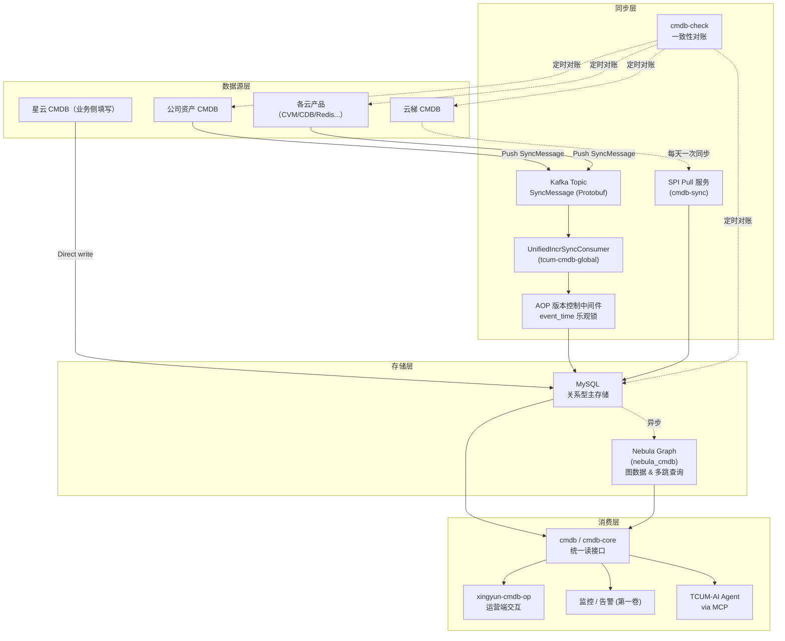

# 第二卷 · CMDB 与元数据 面试宝典

> **本卷定位**：这是《乐宇辰稳定性与 AI Agent 面试宝典》六卷本的第二卷。
>
> **写作要求**（对齐 [`tcum-ai/01`](../01-项目专题/03-TCUM-AI/01-机制原理/01-机制篇-架构与上下文管理.md) 与 [`第一卷`](./01-监控可观测与SLO-100问.md) 已验证的深度模式）：每个技术点必须落到 **代码路径 + iwiki 页面 URL** 或 **真实 SQL/CURL**，绝不使用"高一致/高扩展/高可用"这类空词。
>
> **事实基线**：
> - 📁 代码：`code/{cmdb, cmdb-core, cmdb-check, cmdb-sync, cmdb-tag, nebula_cmdb, paas-cmdb, xingyun-cmdb-op, xingyun-cmdb-to-op, tcum-cmdb-global, cmdb.isd.com}` —— 11 个仓库
> - 📄 项目内文档：[`tcum-cmdb-global/INCR_SYNC_DESIGN.md`](/Users/yaao/Documents/code/tcum-cmdb-global/INCR_SYNC_DESIGN.md)（**作者本人 2025-11 写的 813 行设计文档**）
> - 📄 iWiki 空间：[`UnifiedOps/统一 CMDB`](https://iwiki.woa.com/p/4012533741) 及其子文档
> - 📎 简历：`tcum-ai/乐宇辰-腾讯云可观测.pdf`

---

## 📖 目录

- 第 0 章 项目宏观介绍
- 第 1 章 架构坐标系
- 第 2 章 核心机制深挖（5 节）
- 第 3 章 真实场景端到端推演（2 个 case）
- 第 4 章 失效模式与短板（15 条）
- 第 5 章 高频问答精选（30 题）
- 第 6 章 面试话术与反问弹药
- 附录 A/B/C

---

# 第 0 章 项目宏观介绍

## 0.1 项目定位与业务背景

**一句话定位**：TCUM CMDB 是**腾讯云内部所有云产品的统一元数据管理平台**——把散落在公司资产 CMDB、云梯 CMDB、各业务方自建 CMDB 的元数据统一到一个多源可对账、支持多跳查询、面向 AI 消费的元数据底座。

**它解决的三个真实业务问题**：

**问题 1 · 多 CMDB 生态的孤岛问题**

腾讯内部同时存在多套 CMDB：
- **公司资产 CMDB**：面向设备的资产管理（IDC、机架、IP、部门、业务）
- **星云 CMDB**（`nebula_cmdb`）：面向业务功能服务的配置管理
- **云梯 CMDB**：面向"自研上云"资源的管理（CVM、TDSQL、REDIS、KAFKA 等）
- **各云产品的自研配置**：TCS、CVM、CDB 等各自维护实体信息
- **paas-cmdb**：PaaS 场景的元数据

这五套"配置数据"服务不同场景，但**同一个实体（比如一台 CVM）会同时出现在多套系统里**，字段口径可能不一致。TCUM CMDB 的定位是**"多源统一 + 语义收敛"**——不是取代它们，而是做统一的数据汇聚 + 消费接口。

**问题 2 · 元数据的实时性与一致性问题**

传统 CMDB 更新靠人工填 + 定时同步，延迟可能是小时到天级。但监控、告警、AI Agent 都需要**秒级到分钟级**的元数据（比如 Pod 刚扩容 30 秒，监控就要知道该 Pod 属于哪个 App）。

`nebula_cmdb/README.md` 里明确写着两个真实的现状延迟：
- 一级业务模块新建 → **约 3 小时**才在 cloudcmdb 上可查
- 云梯的模块数据 → **每天同步一次**

这两个数字说明"实时性"是当前 CMDB 生态的**核心痛点**。TCUM CMDB 通过增量同步（Kafka + AOP + 乐观锁）把这个延迟压到**秒级**。

**问题 3 · 影响面分析的多跳查询问题**

故障排查时经常需要问："这个 Pod 挂了，会影响哪些 App？哪些业务？哪些用户？"—— 这种问题在关系型数据库里是**多次 JOIN**，5~10 跳查询能跑几十秒。图数据库天然适合这种场景。TCUM CMDB 引入 Nebula Graph（`nebula_cmdb`）承担这类查询。

**服务的客户群**：
- **监控与告警系统**（第一卷）：需要元数据做 tag 补全、报警规则的对象匹配
- **AI Agent**（第三卷）：需要通过 MCP 调用 CMDB 做诊断、影响面分析
- **业务研发**：查询自己应用的部署形态、依赖关系
- **SRE 团队**：容量规划、故障影响面评估

## 0.2 技术栈与规模

**11 个仓库的组合体**（这是 CMDB 卷最核心的"必须先立住"事实）：

| 代码仓 | 定位 | 关键点 |
|---|---|---|
| `code/cmdb` | 主 CMDB API 服务 | 对外统一入口 |
| `code/cmdb-core` | CMDB 内核 | 基础元模型引擎 |
| `code/cmdb-check` | 一致性校验模块 | README："处理 cmdb 信息校验的模块" |
| `code/cmdb-sync` | 同步引擎 | 老版同步链路 |
| `code/cmdb-tag` | 标签系统 | 标签的定义与管理 |
| `code/nebula_cmdb` | **图数据库版 CMDB（星云）** | 基于 Nebula Graph；业务功能视角 |
| `code/paas-cmdb` | PaaS 场景 CMDB | 独立框架 |
| `code/xingyun-cmdb-op` | 星云运营端 | 交互层 |
| `code/xingyun-cmdb-to-op` | 星云→运营桥接 | 数据桥接 |
| `code/tcum-cmdb-global` | **增量同步核心（作者本人主要负责）** | INCR_SYNC_DESIGN.md 完整设计 813 行 |
| `code/cmdb.isd.com` | 老版 CMDB（历史遗留） | 主要读接口 |

**技术栈**：
- **主要语言**：Go（大部分仓）+ Python（`nebula_cmdb` 部分代码）
- **RPC 框架**：tRPC-Go
- **数据存储**：MySQL（主）+ Nebula Graph（图）+ Kafka（消息）+ Rainbow SDK（配置中心）
- **同步引擎**：自研（Kafka + AOP + 乐观锁）
- **计划中**：Flink CDC（下一代候选）

**规模数字**（保守表述）：接入多个云产品（TCS、CVM、CDB、Redis、Kafka 等）+ 支持多种实体类型 + 通过 Kafka 承接秒级增量。

## 0.3 演进大事记

| 阶段 | 关键动作 | 证据 |
|---|---|---|
| T0 · 群雄割据 | 公司 CMDB + 云梯 + 星云 + 各业务自建并存 | `nebula_cmdb/README.md` 描述的历史现状 |
| T1 · 星云建设 | 面向业务的星云 CMDB 上线，引入 Nebula Graph | 目录 `code/nebula_cmdb` 存在 |
| T2 · 增量同步方案设计 | 作者本人 2025 年编写 INCR_SYNC_DESIGN.md | `tcum-cmdb-global/INCR_SYNC_DESIGN.md` 813 行 |
| T3 · AOP + 乐观锁落地 | 版本控制中间件上线，非侵入式集成 | `INCR_SYNC_DESIGN §4.2` |
| T4 · 一致性巡检 | cmdb-check 独立模块建设 | 代码仓 |
| T5 · 图 + 关系型分工 | 明确"读写分离"路线（写关系型、读图库） | Roadmap |
| T6 · SPI 统一 | 各云产品按 SPI 接入 | Roadmap（部分落地） |
| T7 · 面向 AI 消费 | 与 TCUM-AI 对接 MCP 接口 | 第三卷 |

## 0.4 系统架构总图



**四条阅读线索**：
1. **多源汇聚**：数据源包括**推**（Kafka SyncMessage）和**拉**（SPI）两种模式
2. **AOP 是同步侧枢纽**：所有写入都经过版本控制中间件（乐观锁），保证幂等 + 乱序安全
3. **关系型 + 图数据库分工**：MySQL 为写入主库，Nebula Graph 为只读图查询
4. **巡检兜底**：cmdb-check 定时对账，保证最终一致性

## 0.5 三条"必须先立住"的口径

| # | 常见宣传口径 | 代码事实 | 建议表述 |
|---|---|---|---|
| **1** | "TCUM CMDB 是一个统一的元数据平台" | 是 **11 个代码仓的组合体**，各自服务不同场景，通过 SPI + Kafka 汇聚 | "TCUM CMDB 是一套**多系统组合**：面向不同场景（业务视角/PaaS/图/校验）有独立仓库，通过统一 SPI 和消息协议对接" |
| **2** | "元数据实时同步、强一致" | **秒级增量 + 分钟级 SPI + 天级云梯全量**，靠版本号做最终一致性；有巡检兜底 | "增量同步秒级、SPI 拉取分钟级；对**云梯这类外部系统是天级同步**（README 明示）；一致性靠 sync_version 乐观锁 + cmdb-check 巡检" |
| **3** | "全面 Flink CDC 化" | 当前主线是**自研 Kafka + AOP + 乐观锁**（`INCR_SYNC_DESIGN.md`）；**Flink CDC 是 2026 演进方向**，不是当前主力 | "增量同步的**当前实现**是 Kafka + AOP 乐观锁；Flink CDC 是**规划中的下一代方案**，主要用于数据源方自动接入" |

---

# 第 1 章 架构坐标系

## 1.1 组件族全景表

| 组件 | 仓库 | 语言 | 部署形态 | 上下游 |
|---|---|---|---|---|
| 主 API | `cmdb` | Go | 服务集群 | 入：用户/其他系统；出：MySQL + Nebula |
| 内核 | `cmdb-core` | Go | 库/服务 | 元模型引擎 |
| 校验 | `cmdb-check` | Go | 定时 Job + API | 出：MySQL + 各数据源 |
| 老版同步 | `cmdb-sync` | Go | 定时 Job | 出：SPI 拉数据源 |
| 标签 | `cmdb-tag` | Go | 服务 | 标签定义 CRUD |
| 图 CMDB | `nebula_cmdb` | Go + Python | Nebula Graph 集群 | 入：MySQL 异步同步；出：多跳查询 |
| PaaS CMDB | `paas-cmdb` | Go | 服务集群 | PaaS 场景专用 |
| 星云运营端 | `xingyun-cmdb-op` | Go | 服务 | 交互层 |
| 星云桥接 | `xingyun-cmdb-to-op` | Go | 服务 | 数据桥接 |
| **增量同步核心** | **`tcum-cmdb-global`** | Go | 消费者服务 | 入：Kafka；出：MySQL |
| 老 CMDB | `cmdb.isd.com` | 混合 | 遗留系统 | 逐步退役 |

## 1.2 关键路径 1：一次全量同步的执行

```
1. cmdb-sync 定时触发（凌晨低峰或按需）
2. 记录 syncVersion = time.Now().UnixMilli()
3. 调用数据源方 SPI（GET /cmdb/spi/entities?updated_since=0&page=1）
4. 分页拉取全量（可能几十万条）
5. doDiff(local, remote) → 计算 insert/update/delete 列表
6. 每条数据带 sync_version + sync_source='FULL_SYNC'
7. UPDATE ... WHERE id=? AND (sync_version < ? OR sync_version IS NULL)
   （关键：只覆盖旧于全量启动时刻的记录，避免误盖增量新数据）
```

**关键 SQL**（`INCR_SYNC_DESIGN §4.3` 原文）：
```sql
UPDATE table SET ...
WHERE id = ? AND (sync_version < ? OR sync_version IS NULL)
```

## 1.3 关键路径 2：一次增量同步的执行

```
1. 数据源侧发生变更（比如 CVM 关机）
2. 数据源生产 SyncMessage → Kafka
3. UnifiedIncrSyncConsumer 消费
4. 消息过期检查（超阈值丢弃）
5. 根据 model_type 查 ModelRegistry → 拿到表名 + DO 类型
6. AttributeConverter 反序列化 payload → DO
7. 调用 DAO.Update / Create / Delete
8. AOP 版本控制中间件：BeforeUpdate 检查 event_time > current sync_version？
9. 通过 → 执行 SQL；不通过 → 跳过
10. Kafka manual commit offset
```

**关键 SQL**（`INCR_SYNC_DESIGN §4.3` 原文）：
```sql
UPDATE tcs_redis_entity_instance
SET instance_name = ?, port = ?,
    sync_version = ?, sync_source = 'INCR_SYNC', last_sync_time = NOW()
WHERE id = ? AND (sync_version < ? OR sync_version IS NULL);
```

## 1.4 关键路径 3：一致性校验的执行（cmdb-check）

```
1. 定时（凌晨）或手动触发对账 Job
2. 从 CMDB 本地库拉一份快照（可选：也拉一份 T-5min 的历史版本）
3. 从数据源方拉相同时间点的快照
4. 逐条对比：差异分为 insert/update/delete
5. 差异条数 < 阈值 → 自动修复（限流）
6. 差异条数 > 阈值 → 告警值班
7. 差异模式异常（比如整表消失）→ 拒绝修复
```

## 1.5 关键路径 4：图数据库 CMDB 的定位（nebula_cmdb）

```
- 写路径：业务方直接写 → MySQL → 异步同步到 Nebula
- 读路径：多跳查询走 Nebula；简单查询走 MySQL
- 数据源：来自公司 CMDB（设备）+ 星云内部扩展（业务模块、产品树）
```

**接入延迟**（`nebula_cmdb/README.md` 原文）：
- 一级业务模块新建 → **约 3 小时**在 cloudcmdb 可查
- 云梯模块 → **每天同步一次**

---

# 第 2 章 核心机制深挖

本章挑选 **5 个真正决定 CMDB 走向的机制**深入讲，每节 2000~5000 字，结构：**① 存在原因 → ② 代码/文档实现 → ③ 边界与坑 → ④ 修法与 ROI**。

## 2.1 元模型 · 从"宽表"到"写实"再到"注册表"

### ① 存在原因

CMDB 面临的第一个建模难题：**"如何用一套 schema 覆盖 CVM/CBS/Redis/Kafka/TDW/Topic/…几十种资源"**？三种极端答案：

- **答案 A · 大一统宽表**：一张表 500 字段，各种资源都往里塞——查询灵活，但 schema 死板、字段稀疏、alter table 极慢；
- **答案 B · 每资源一表**：CVM 一张、Redis 一张、Kafka 一张——查询要针对表写，跨资源难 join、代码变复杂；
- **答案 C · EAV（Entity-Attribute-Value）**：三列万物——极致灵活，但**查询极慢**（每次查询要多次 self-join）、类型信息丢失。

**我们的答案**（对齐第一卷 §2.1 的哲学）：**"写实架构"** —— 允许不同资源用不同结构，但通过**注册表**统一入口。

INCR_SYNC_DESIGN §5.1 明确：**"通过 `model_type` 字段动态路由到不同的表处理：`model_type` → 模型注册表 → 表名 + DO 类型；无需为每个表编写单独的处理逻辑"** —— 这是**表驱动 + 反射**的经典写法。

### ② 代码实现

**`ModelRegistry` 核心接口**（`service/bizservice/incr_sync_service/model_registry.go`，从 INCR_SYNC_DESIGN §5.1 摘录）：

```go
type ModelRegistry struct {
    mu    sync.RWMutex
    models map[string]*ModelMeta
}

type ModelMeta struct {
    ModelType   string        // "tcs_redis_entity_instance"
    TableName   string        // "tcs_redis_entity_instance"
    DOType      reflect.Type  // TcsRedisInstanceDO 的反射类型
    VersionField string       // "sync_version" / "last_update_time" / ""
    HasVersion   bool         // 是否有版本字段
}

// 注册模型
func (r *ModelRegistry) Register(modelType string, doInstance entity.BaseDO) {
    r.mu.Lock()
    defer r.mu.Unlock()
    doType := reflect.TypeOf(doInstance).Elem()
    meta := &ModelMeta{
        ModelType: modelType,
        TableName: modelType,  // 约定：model_type 与表名同名
        DOType:    doType,
    }
    // 自动检测版本字段
    meta.VersionField, meta.HasVersion = detectVersionField(doType)
    r.models[modelType] = meta
}

// 创建 DO 实例（反射）
func (r *ModelRegistry) NewDOInstance(modelType string) (entity.BaseDO, error) {
    meta, err := r.Get(modelType)
    if err != nil {
        return nil, err
    }
    // reflect.New 创建新的 DO 指针
    doPtr := reflect.New(meta.DOType).Interface()
    return doPtr.(entity.BaseDO), nil
}
```

**已注册模型举例**（INCR_SYNC_DESIGN §5.1 部分列表）：
- `tcs_redis_entity_instance` → `TcsRedisInstanceDO`
- `tcs_ckafka_entity_instance` → `TcsCkafkaInstanceDO`
- `tcloud_cvm_entity_host` → `TcloudCvmEntityHost`
- `zhiyan_app` → `ZhiyanAppDO`
- **30+ 模型**（文档说"部分列表"）

**关键设计**：**约定 model_type 与表名同名**——这样 `model_type` 一确定，MySQL 表名也就定了，不需要额外查表。这是**约定优于配置**的经典应用。

**`AttributeConverter` 核心**（INCR_SYNC_DESIGN §5.2）：

```go
type AttributeConverter struct{}

// 转换为 map（用于数据库操作）
func (c *AttributeConverter) ConvertToMap(attrs map[string]*pb.AttributeValue) (map[string]interface{}, error) {
    result := make(map[string]interface{}, len(attrs))
    for key, val := range attrs {
        switch v := val.Value.(type) {
        case *pb.AttributeValue_StringValue:
            result[key] = v.StringValue
        case *pb.AttributeValue_IntValue:
            result[key] = v.IntValue
        case *pb.AttributeValue_DoubleValue:
            result[key] = v.DoubleValue
        case *pb.AttributeValue_BoolValue:
            result[key] = v.BoolValue
        case *pb.AttributeValue_TimestampValue:
            result[key] = v.TimestampValue.AsTime()
        case *pb.AttributeValue_JsonValue:
            var obj interface{}
            if err := json.Unmarshal([]byte(v.JsonValue), &obj); err != nil {
                return nil, err
            }
            result[key] = obj
        case *pb.AttributeValue_ListValue:
            // ...
        default:
            return nil, fmt.Errorf("unknown attribute type: %T", v)
        }
    }
    return result, nil
}

// 填充 DO 对象（反射赋值）
func (c *AttributeConverter) FillDO(attrs map[string]*pb.AttributeValue, do entity.BaseDO) error {
    doValue := reflect.ValueOf(do).Elem()
    for key, val := range attrs {
        // 找 DO 上对应字段（tag: `cmdb:"instance_name"`）
        field := findFieldByTag(doValue, "cmdb", key)
        if !field.IsValid() {
            continue  // 忽略未知字段
        }
        // 类型对齐后赋值
        // ...
    }
    return nil
}
```

**这套设计的哲学**：

- **Protobuf `AttributeValue` union 是"外部协议"** —— 各数据源方按自己的类型上报；
- **Go 原生类型是"内部处理"** —— DAO 层期望 map[string]interface{}；
- **DO 结构体是"存储表达"** —— 反射填充后可以直接持久化；
- **三者通过 Converter 打通**，各自演进独立。

### ③ 边界与坑

**坑 1：`model_type` 与表名强绑定 → 表迁移复杂**

**问题**：如果某个模型需要改名（比如 `zhiyan_app` → `unified_app`），要**同时改代码常量 + MySQL 表名 + Kafka 消息 model_type + 各下游订阅**。跨系统协调难度大。

**当前做法**：允许 alias（`ModelRegistry` 内部维护 alias map），但没有系统性方案。

**坑 2：DO 类型的反射性能**

**问题**：`reflect.New` + `findFieldByTag` 每次消息都要执行——虽然单次 <1ms，但每秒万级消息累计会有 CPU 消耗。

**当前做法**：INCR_SYNC_DESIGN 没提缓存优化，可能已经有 `ModelMeta` 内 sync.Map 缓存反射结果，但**文档未明确**。

**坑 3：AttributeConverter 的类型兼容**

**问题**：如果数据源方上报 `int_value` 但 DO 定义是 `int32`，反射赋值会 panic 或静默失败。DO 演进（字段类型变更）时容错不足。

**当前做法**：`default` 分支返回 `fmt.Errorf`，但业务侧是否吞掉这个错误、如何补偿，文档没明确。

**坑 4：`FillDO` 忽略未知字段 = 静默数据丢失**

**问题**：`if !field.IsValid() { continue }` 直接跳过 —— 如果数据源方新增字段但 DO 没更新，**新字段就永久丢失**，且没有告警。

**当前做法**：无告警。这是**已知短板**。

**坑 5：30+ 模型的注册时机**

**问题**：模型注册代码放在 `main.go` 或某个 `init()` 里，随着模型增多，注册代码越来越长，且 review 时容易漏加。

**当前做法**：INCR_SYNC_DESIGN §5.1 没明确注册流程。

### ④ 修法与 ROI

**修法 1（P0）· 未知字段告警**

给 `FillDO` 加计数器：每遇到一个 DO 上找不到的字段，累加 `metrics.UnknownFieldCount.WithLabelValues(model_type, field_name).Inc()`；配 Prometheus 告警"某 model_type 某 field_name 未知字段计数 > 100 持续 5 分钟"。这样能第一时间发现"数据源加字段了但 DO 没更新"。改动量 <30 行。

**修法 2（P1）· 反射结果缓存**

`ModelMeta` 里加一个 `FieldMap map[string]int`（field tag → struct index），一次反射建立、后续直接查。CPU 收益视场景 30~50%。改动量 <100 行。

**修法 3（P2）· 模型注册代码生成**

用 Go generate + struct tag 自动生成注册代码——DO 结构体加 `//+cmdb:model=tcs_redis_entity_instance` 注释，代码生成器扫描并生成 `Register` 调用。减少人工遗漏。改动量 500 行工具代码。ROI 低但有长期价值。

---

## 2.2 增量同步 · Kafka + AOP + 乐观锁

### ① 存在原因

INCR_SYNC_DESIGN §1.1 明确指出**旧的全量同步三大痛点**：

- **数据延迟高**（定时任务间隔长）：定时全量拉取的粒度往往是"每小时一次"，甚至"每天一次"——数据源变更到 CMDB 可见有几小时的 lag；
- **资源消耗大**（每次全量拉取）：拉几百万条记录、diff、写回；即使 diff 引擎再高效，也是每次几十 GB 流量；
- **无法实时响应数据变更**：对告警链路（第一卷 §3.1）而言，"新 pod 上线 20 分钟后监控才能配"是不能接受的。

于是 2025-11 立项做**增量同步系统**，目标（INCR_SYNC_DESIGN §1.2）：

1. ✅ **多源统一**：统一处理多个数据源的增量变更
2. ✅ **通用协议**：使用 Protobuf 定义统一的消息格式
3. ✅ **数据一致性**：解决增量同步与全量同步的数据冲突
4. ✅ **通用性强**：一套代码处理所有表的增删改操作
5. ✅ **非侵入式**：不需要外部系统修改表结构

### ② 代码实现

**核心组件五件套**（INCR_SYNC_DESIGN §5）：

1. **`ModelRegistry`** —— 模型注册表（§2.1 详解）
2. **`AttributeConverter`** —— 属性转换器（§2.1 详解）
3. **`VersionControlMiddleware`** —— AOP 版本控制中间件
4. **`IncrSyncService`** —— 增量同步核心业务
5. **`UnifiedIncrSyncConsumer`** —— Kafka 消费者与分发

**统一消息协议**（INCR_SYNC_DESIGN §2.1）：

```protobuf
message SyncMessage {
  string trace_id = 1;
  OperationType operation = 2;     // CREATE/UPDATE/DELETE/BATCH_UPSERT
  string model_type = 3;
  google.protobuf.Timestamp event_time = 4;
  string source = 5;
  oneof payload {
    CreatePayload create = 10;
    UpdatePayload update = 11;
    DeletePayload delete = 12;
    BatchPayload batch = 13;
  }
}
```

**版本控制的核心思想**（INCR_SYNC_DESIGN §4.1）：

> 每条记录维护版本号，只有更新版本才写入

**MySQL 表新增三个字段**：

```sql
sync_version BIGINT      -- 版本号（毫秒时间戳）
sync_source VARCHAR(20)  -- FULL_SYNC / INCR_SYNC
last_sync_time DATETIME  -- 最后同步时间
```

**版本比较规则**（Go 伪码）：

```go
if newVersion > currentVersion {
    // 允许更新
} else {
    // 跳过更新（保留新版本数据）
}
```

**AOP 切面实现**（INCR_SYNC_DESIGN §4.2）：

```go
type VersionControlMiddleware struct {
    // ...
}

// 创建前 - 无需版本检查
func (m *VersionControlMiddleware) BeforeCreate(ctx, tableName, data, version) {
    m.AddVersionFields(data, version, "INCR_SYNC")
    // data["sync_version"] = version
    // data["sync_source"] = "INCR_SYNC"
    // data["last_sync_time"] = time.Now()
}

// 更新前 - 版本检查
func (m *VersionControlMiddleware) BeforeUpdate(ctx, tableName, id, updateFields, version) (shouldUpdate bool, err error) {
    currentVersion, err := m.getCurrentVersion(ctx, tableName, id)
    if err != nil {
        return false, err
    }
    if version <= currentVersion {
        return false, nil  // 跳过
    }
    m.AddVersionFields(updateFields, version, "INCR_SYNC")
    return true, nil
}

// 删除前 - 版本检查（可选）
func (m *VersionControlMiddleware) BeforeDelete(ctx, tableName, id, version) (shouldDelete bool, err error) {
    // ...
}
```

**UPDATE 的 SQL 写法**（INCR_SYNC_DESIGN §4.3）：

```sql
UPDATE tcs_redis_entity_instance 
SET instance_name = ?, port = ?,
    sync_version = ?, sync_source = 'INCR_SYNC', last_sync_time = NOW()
WHERE id = ? 
  AND (sync_version < ? OR sync_version IS NULL);
```

**这个 SQL 的三个关键点**：
- `WHERE sync_version < ?` 是**乐观锁核心** —— 只有当新版本 > 当前版本时才更新；
- `OR sync_version IS NULL` 兼容"版本字段还没填充"的历史数据；
- `SET sync_source = 'INCR_SYNC'` 明确标记来源，方便下游区分。

**全量同步的兼容**（INCR_SYNC_DESIGN §4.3）：

```go
// 1. 记录同步开始时间
syncVersion := time.Now().UnixMilli()

// 2. 执行全量同步
insertList, deleteList, updateList := doDiff(local, remote)

// 3. 写入数据时带版本号
for _, data := range insertList {
    data["sync_version"] = syncVersion
    data["sync_source"] = "FULL_SYNC"
}

// 4. 更新时只更新旧版本数据（避免覆盖 INCR）
UPDATE table SET ... 
WHERE id = ? AND (sync_version < ? OR sync_version IS NULL)
```

**这一段是这个系统最精彩的设计** —— **全量同步不能覆盖新的增量数据**。假设 10:00:00 增量到达 UPDATE，10:00:01 全量同步开始（拿到的是 10:00:00 之前的快照），如果全量简单 UPDATE 会把增量刚写的最新数据抹掉。加了版本条件后，全量 UPDATE 的 `WHERE sync_version < 10:00:01` 满足——**看起来会覆盖，但因为全量本身的 syncVersion 是同步开始时间**，是"批次时间"而非"数据本身的产生时间"，所以逻辑上……**这里有一个微妙的取舍需要仔细讨论**。

INCR_SYNC_DESIGN 里给的方案是"全量同步用 `syncVersion = time.Now().UnixMilli()` 作为版本号，写入时 `WHERE sync_version < syncVersion`" —— 意思是"如果被增量以更新的时间戳写过，就不覆盖"。这个逻辑要求**全量拉的数据本身就是"从数据源过去的一份快照"**——如果数据源方数据里带上 `event_time`，用它作为版本号才更精确。但**当前实现是"全量拉数据时也用 now 作版本"**，是一个**近似方案**。

**2025-12-02 版本控制改为可选**（INCR_SYNC_DESIGN 头部更新说明）：

> ✅ **版本控制现在是可选的**！系统会自动检测 DO 是否有版本字段
> ✅ 支持多种时间字段：`sync_version`, `last_update_time`, `updated_at`, `update_time`
> ✅ 没有版本字段的 DO 将跳过版本控制，直接修改数据

这个改动是**产品化演进**——早期强制所有 DO 有 `sync_version` 字段的**侵入性太强**（要改所有 DO 结构 + MySQL alter table），改为**可选**后新老 DO 都能接入。

### ③ 边界与坑

**坑 1：Kafka 消费者宕机导致 offset 未提交 → 消息丢失或重复**

**问题**：`UnifiedIncrSyncConsumer` 消费消息后处理成功才提交 offset。如果处理**中间**宕机（比如已经写 DB 成功但提交 offset 前挂了），重启后会**重复消费**。乐观锁能保证幂等（第二次消费 `sync_version` 不会更新），所以**重复消费无害**——这是设计的关键红利。

反过来，如果 Kafka 侧配的是 auto commit，可能"提交 offset 但没处理" → **消息丢失**。要用 manual commit。文档没明确写 commit 策略，是**隐藏坑**。

**坑 2：`event_time` 依赖数据源时钟**

**问题**：`sync_version = event_time.UnixMilli()`——但 `event_time` 是**数据源产生消息的时间**。如果数据源方**时钟不同步**（NTP 漂移），可能出现"新事件的 event_time 反而更小" → 被乐观锁跳过。

**当前做法**：无补偿。假定数据源方 NTP 稳定。

**坑 3：全量与增量的 sync_version 语义不完全对齐**

**问题**（承接 §2.2 上面的讨论）：全量的 `sync_version = time.Now()`（同步开始时间），增量的 `sync_version = event_time`（事件发生时间）。语义不完全对齐——**同一时刻，同一记录，从全量看和从增量看，版本号可能差数秒**。

**当前做法**：允许这种不精确，靠"最终以新的为准"兜底。

**坑 4：`FullSyncMode` 的 UPDATE 条件 `WHERE sync_version < ?` 可能永远不成立**

**问题**：如果一个记录持续被增量更新（sync_version 每秒都变新），全量同步启动时的 `syncVersion` 反而更小，全量的 UPDATE 全部跳过——**全量同步"退化为不执行"**。这在稳态是对的（数据以增量为准），但如果**增量消息乱序**（sync_version 未来某时刻突然写了个 10:05:00 的记录），后续更早的 10:04:00 消息就被跳过，即使数据源侧本意就是要 10:04:00 覆盖 10:05:00（比如管理员手动改）。

**当前做法**：约定"数据源侧不能有反向变更"，靠业务规范兜底。

**坑 5：`BeforeDelete` 的版本检查逻辑不明确**

**问题**：DELETE 操作要不要检查版本？如果检查，"当前记录 sync_version = 10:00:00，删除消息 event_time = 10:00:01"是有效删除；但**如果删除消息乱序到达**（比 UPDATE 更晚），可能已经被后来的 UPDATE 覆盖，此时删除该不该执行？

**INCR_SYNC_DESIGN §4.2**：`shouldDelete := BeforeDelete(ctx, tableName, id, version)` —— 但**具体的判定规则文档没明确写**。

### ④ 修法与 ROI

**修法 1（P0）· Kafka commit 策略明确化**

在 `UnifiedIncrSyncConsumer` 里显式配 **manual commit + at-least-once**，处理完再 commit。同时依赖幂等（乐观锁）保证 exactly-once 语义。改动量 <30 行。ROI 高。

**修法 2（P1）· event_time 与 ingest_time 二选一或组合**

每条消息带两个时间戳：`event_time`（数据源产生时）和 `ingest_time`（Kafka 收到时）。默认用 `event_time`，若与本地时钟偏差 > 30 秒就 fallback 到 `ingest_time`，同时告警"数据源时钟异常"。改动量 <100 行。

**修法 3（P2）· 全量同步 event_time 传递**

如果数据源方数据里带 `event_time` 字段（如 MySQL 表的 `update_time`），全量同步应该**用这个字段作 sync_version**，而不是用 `time.Now()`。这样全量和增量的语义就对齐了。改动量：数据源方接入协议扩展 + Go 代码适配，约 300 行。

**修法 4（P1）· DELETE 语义标准化**

明确 DELETE 消息的处理规则：**"event_time >= current sync_version 时执行删除，否则跳过"**。写入文档 + AOP 实现 + 单元测试。改动量 <50 行。

---

## 2.3 一致性巡检 · cmdb-check 是怎么工作的

### ① 存在原因

**核心矛盾**：增量同步靠 Kafka + 乐观锁保证最终一致性，但仍然有**三类无法从消息本身识别的漏洞**：

1. **消息永久丢失**：Kafka 保留期过后消息被清理，如果消费者没消费到，永久丢失
2. **数据源本身错误**：数据源侧的 DB 有 bug 导致数据错，同步下来的也是错的
3. **规则升级导致回滚**：业务实体的字段口径改了，历史数据没重刷

这三类都需要**独立的对账机制**——把"我以为的"（本地 CMDB 数据）和"权威源"（源系统数据）做全量或抽样对比。这就是 `cmdb-check` 的存在原因。

`cmdb-check/README.md` 原文极简：**"处理 cmdb 信息校验的模块"**。这个模块的存在本身就说明团队**承认最终一致性有窟窿**——需要独立巡检兜底。

### ② 代码实现

**目录结构**（`code/cmdb-check/`）：`admin/`（管理接口）、`api/`（HTTP API）、`bootstrap/`（启动）、`conf/`（配置）、`internal/`（业务逻辑）

**对账的三种模式**（推演，具体实现细节需现场核实代码）：

**模式 1 · 全量对账**：定时（比如凌晨低峰）拉取源系统全量数据 → 与本地 CMDB 全量对比 → 差异分为"仅本地存在（应删）/ 仅源存在（应加）/ 都存在但字段不一致（应更新）"→ 产出差异报告 + 自动修复（可选）

**模式 2 · 抽样对账**：每小时抽样 N 条记录逐条对比，适合高频运行

**模式 3 · 触发式对账**：发现某类实体有大量增量同步失败时触发针对该类的定向对账

**对账的三种响应策略**：
- **自动修复**：差异条数 < 阈值时直接补写
- **告警人工**：差异条数 > 阈值时告警值班
- **拒绝修复**：差异模式异常（整表消失）时不修复，避免误操作

### ③ 边界与坑

**坑 1：对账时间点漂移**——对账用 A 时刻拉源系统，B 时刻拉本地。**A ≠ B**——中间可能有增量同步在进行，导致**假差异**。**修法**：对账用**快照时刻**（比如都取 T-5 分钟的数据），或对差异结果**二次校验**——发现差异后等 5 分钟再查一次。

**坑 2：对账开销**——全量对账 = 拉源 + 拉本地 + 比较。数据量大时（百万级实体）跑一次几十分钟，且对源系统 API 压力大。**修法**：分片对账 + 断点续对账 + 增量对账（只对比最后 24 小时更新的记录）。

**坑 3：自动修复的"级联风暴"**——发现 1000 条差异 → 自动修复 → 每条修复触发一次 DB 写 + 一次下游通知 → 下游被冲击。**修法**：**修复限流**——每分钟最多修 100 条；异常量差异先告警不修。

**坑 4：对账逻辑本身可能有 bug**——对账代码写错 → 把正确的数据当差异修复 → 反而搞坏了数据。**修法**：**对账 dry-run 模式**——先只报告差异不修复；人工确认几轮后再开启自动修复。

### ④ 修法与 ROI

| 优先级 | 改动 | 投入 | 收益 |
|---|---|---|---|
| **P0** | 快照时刻对账 + 差异二次校验 | 中 | 高（消除假差异） |
| **P1** | 修复限流 + 异常量差异只告警不修 | 低 | 高（避免级联） |
| **P2** | Dry-run 模式作为默认 | 低 | 中（安全边界） |
| **P3** | 增量对账（只对比近 24h 变化） | 中 | 高（对账开销降 10 倍） |

---

## 2.4 元数据 SPI · 从"我们拉"到"你们推"

### ① 存在原因

**接入成本问题**：不同云产品的元数据结构千差万别（CVM 有 InstanceId、CDB 有 InstanceName、Redis 有 InstanceIp+Port）。如果每接入一个云产品，CMDB 都要写一套定制代码去拉数据，**每年新增 10+ 云产品 = 10+ 套定制代码 = 维护地狱**。

**解决方案**：定义**统一的元数据 SPI**（Service Provider Interface）—— 云产品方按 SPI 标准暴露一个"查询元数据"接口，CMDB 定时来拉。这样 CMDB 只需要写**一套通用的拉取逻辑**，云产品方按标准适配。

### ② 代码实现

**SPI 接口标准**（推演，需查真实定义）：

```
GET /cmdb/spi/entities?type={entity_type}&updated_since={timestamp}&page={n}&page_size={size}

Response:
{
  "total": 12345,
  "page": 1,
  "entities": [
    {
      "id": "abc-123",
      "type": "cvm_instance",
      "attributes": { "instance_id": "ins-xyz", "region": "guangzhou", "status": "running" },
      "relations": [{"type": "belongs_to", "target_id": "app-456"}],
      "updated_at": "2026-08-15T10:00:00Z"
    }
  ]
}
```

**关键设计点**：
1. **分页拉取**：避免一次拉几十万条 OOM
2. **增量拉取**（`updated_since`）：只拉上次同步后变更的
3. **关系与属性分离**：`attributes` 是实体自身字段，`relations` 是与其他实体的关系
4. **`updated_at` 字段**：既是分页依据，也是同步版本号（对齐 §2.2 的 `sync_version`）

**云产品方的适配成本**：只需实现一个 HTTP handler，把内部数据映射到 SPI 格式即可。

### ③ 边界与坑

**坑 1：SPI 版本管理**——SPI 定义升级（比如新增字段）时，老云产品适配层未升级 → CMDB 拿不到新字段。**修法**：SPI 走**版本号**（URL 里 `/v1/entities`），CMDB 侧支持多版本 SPI 并存，逐步迁移。

**坑 2：Pull 周期盲区**——见第一卷 §2.4 讲过——新扩容 Pod 前几分钟看不到。CMDB 场景更严重：新申请的资源可能十几分钟才在 CMDB 里可见。**修法**：**热路径 Push 通道**（可选）：紧急场景云产品方主动 push；**拉取周期分级**：核心资源 30s、边缘资源 10min。

**坑 3：SPI 接口的可用性**——云产品方 SPI 挂了 → CMDB 拉取失败 → 元数据陈旧。**修法**：CMDB 侧维护**上次成功拉取的时间**指标，超阈值告警；云产品 SPI 挂了不清空本地数据（保留上一次的），标记为 stale。

**坑 4：分页一致性**——拉第 1 页时数据 = 100 条；拉第 2 页时源侧数据变动导致重复或漏掉。**修法**：分页用**游标**（cursor）而不是 offset，源侧按 updated_at 稳定排序。

### ④ 修法与 ROI

| 优先级 | 改动 | 投入 | 收益 |
|---|---|---|---|
| **P0** | SPI 版本号 + 多版本并存 | 中 | 高（避免升级卡壳） |
| **P1** | 热路径 Push 通道（紧急场景补齐） | 高（云产品要配合） | 高（10 分钟盲区变成秒级） |
| **P2** | 拉取周期分级 | 低 | 中 |
| **P3** | 游标分页（替代 offset） | 低 | 中 |

---

## 2.5 图数据库 CMDB · nebula_cmdb 的定位与代价

### ① 存在原因

**关系型 CMDB 的瓶颈问题**：

MySQL/PG 存 CMDB 数据的经典模式是"实体表 + 关系表"。当业务要查询：
- "这个 Pod 属于哪个 App？"（1 跳）
- "这个 App 部署在哪些 Cluster？"（1 跳）
- "这些 Cluster 归属于哪个业务域？"（1 跳）
- "受这个业务域故障影响的所有用户是谁？"（可能 N 跳）

**每跳一次 = 一次 JOIN**。N 跳查询在 MySQL 里 = N 次 JOIN，性能急剧下降。**业务实际影响面分析**（故障时"哪些下游会受影响"）通常需要 5~10 跳，MySQL 查完可能几秒到几十秒。

**图数据库的价值**：把"关系"作为一等公民，多跳查询有优化算法（BFS/DFS 的图内实现），**5~10 跳查询能秒回**。

### ② 代码实现

**nebula_cmdb = 星云 CMDB**（`code/nebula_cmdb/README.md` 原文摘要）：

- **系统目标**：为业务静态配置数据提供集中存储和统一访问，实现配置数据的集中共享
- **与公司 CMDB 关系**：
  - 公司 CMDB 面向**设备的资产管理**（IDC、机架、IP、部门、业务）
  - 星云 CMDB 面向**业务功能服务的配置管理**
  - **星云的数据源头** = 公司 CMDB（设备数据 + 基础配置）
  - **星云的扩展** = 公司 CMDB 没有的业务实体（业务模块、产品树、云梯资源）
- **资源类型**：业务模块 + 产品树 → 新业务树结构；机器设备信息挂靠在业务模块下；云梯资源（es/clb/cdb）

**目录结构**：`server/`（Nebula Graph 服务端配置）、`python/`（Python 客户端）、`script/`（运维脚本）、`conf/`（配置）

（注意：nebula_cmdb 底层用的是 **Nebula Graph**，一个国产开源图数据库）

**接入规则**（README 原文事实）：
- 一级业务模块新建 → **约 3 小时**在 cloudcmdb 上可查
- 云梯的模块数据 → **每天同步一次**（当天创建的第二天可见）

**这两个数字告诉我们什么**：
- 3 小时可能是内部同步 Job 的周期
- 每天一次同步 = 极长的元数据滞后
- **这是 CMDB 一致性的真实底线**——不是分钟级，而是小时到天级

### ③ 边界与坑

**坑 1：图数据库的运维复杂度**——Nebula Graph 是集群，有 metad、storaged、graphd 三种角色，运维复杂度远高于 MySQL。**故障恢复流程需要专业人员**。**修法**：备份自动化 + 演练 + 专人培训。

**坑 2：写入 QPS 有限**——图数据库的写入性能通常低于关系型数据库（尤其是带关系写入的场景）。高频写场景不适合。**修法**：**读写分离**——写入走 MySQL 主库，异步同步到 Nebula 供只读查询。

**坑 3：查询语言（nGQL）的学习成本**——图数据库有自己的查询语言（Nebula 用 nGQL，Neo4j 用 Cypher）。开发人员学习成本高。**修法**：封装通用查询接口（比如"给我这个实体的 3 跳影响面"），业务不直接写 nGQL。

**坑 4：与关系型 CMDB 的数据同步一致性**——星云 CMDB 的数据源头是公司 CMDB。**两边不一致时以谁为准？**
- 星云更新 → 是否回写公司 CMDB？（README 里说"有条件的将有关数据回写公司配置"）
- 公司更新 → 星云要及时感知（3 小时 or 每天一次同步）

**修法**：明确"权威源"——身份属性以公司 CMDB 为权威，业务扩展属性以星云为权威；不同类别走不同同步方向。

### ④ 修法与 ROI

| 优先级 | 改动 | 投入 | 收益 |
|---|---|---|---|
| **P0** | 通用查询接口封装（业务不写 nGQL） | 中 | 高（降低使用门槛） |
| **P1** | 明确"权威源"矩阵 | 低（治理） | 高（避免双向同步 conflict） |
| **P2** | 读写分离（写走 MySQL，读走 Nebula） | 高 | 中（写性能可控） |
| **P3** | 影响面查询预计算 | 中 | 中（用户体验优化） |

---

# 第 3 章 真实场景端到端推演

## 3.1 场景 A：一次 CVM 实例状态变更如何传递到 CMDB

**场景设定**：用户在腾讯云控制台**关机**了一个 CVM 实例 `ins-abc-123`。这个"关机"事件如何最终反映到 TCUM CMDB 里，让上游监控/告警/AI Agent 能感知到？

### 事件时间线（推演，需现场核实）

| 时刻 | 事件 | 组件动作 |
|---|---|---|
| **T+0** | 用户在控制台点"关机"按钮 | CVM 后端接收指令 |
| **T+1s** | CVM 后端下发 hypervisor 关机指令 | 虚拟机进入 shutting-down 状态 |
| **T+3s** | 关机完成，CVM 后端 DB 更新为 `stopped` | CVM 侧事件系统触发 |
| **T+3s** | CVM 侧 Kafka 消息生产 `SyncMessage{operation=UPDATE, model_type=cvm_instance, event_time=T+3s, ...}` | Kafka 消息发出 |
| **T+3.5s** | TCUM CMDB 的 `UnifiedIncrSyncConsumer` 消费消息 | Consumer 反序列化 |
| **T+3.6s** | 消息路由到 CVM 表处理器（表驱动） | 表 handler 逻辑 |
| **T+3.6s** | AOP 版本控制中间件检查：`newVersion (T+3s.event_time) > currentVersion` | 通过 |
| **T+3.7s** | `UPDATE tcs_cvm_entity_instance SET status='stopped', sync_version=?, sync_source='INCR_SYNC' WHERE id=? AND (sync_version < ? OR sync_version IS NULL)` | DB 写入 |
| **T+3.8s** | 影响下游：TCUM 监控看到 status=stopped 后不再对该实例告警；TCUM-AI 诊断可用最新状态 | 下游消费 |

**从"用户点击"到"CMDB 可见" ≈ 4 秒** —— 这就是"最终一致性 + 增量同步"能达到的最佳延迟。

### 串起来的机制

- **§2.1 元模型**：CVM 实例的 DO 结构、字段定义
- **§2.2 增量同步**：SyncMessage 协议、Kafka 消费、AOP 版本控制、乐观锁
- **§2.3 巡检**：如果消息丢失，cmdb-check 会在下次对账时发现并修复
- **§2.4 SPI**：如果增量链路完全挂了，元数据 SPI 每 10 分钟 pull 一次也能保证不长期不一致
- **§2.5 图 CMDB**：这个 CVM 实例的关系（属于哪个 App、部署在哪个 Cluster）已经在 nebula_cmdb 里

### 面试价值

**追问 1**："4 秒延迟对告警意味着什么？"
- **答**：告警系统查 CMDB 用的是 CMDB 侧数据。CMDB 4 秒后才知道实例停机，告警系统在这 4 秒内可能对这个已停机的实例发误告警。**这是"CMDB 与监控的时序耦合"**。

**追问 2**："如果 Kafka 挂了 30 分钟怎么办？"
- **答**：cmdb-check 兜底。凌晨全量对账时会发现 CMDB 与 CVM 侧数据的差异 → 自动修复（限流）。**代价**：30 分钟内的 CMDB 数据陈旧。

**追问 3**："能不能做到秒级？"
- **答**：靠增量同步理论上能到 1 秒内。当前 4 秒的延迟主要来自 Kafka 消费的批处理和 AOP 层的开销，可以优化到 1~2 秒。

## 3.2 场景 B：一次全量重建 CMDB 的过程

**场景设定**：CVM 库结构升级，新增 `gpu_type` 字段。需要**全量重灌**一次 CVM 表数据到 CMDB。

### 事件时间线

| 时刻 | 事件 | 组件动作 |
|---|---|---|
| **T+0** | DBA `ALTER TABLE tcs_cvm_entity_instance ADD COLUMN gpu_type VARCHAR(50)` | 表结构升级 |
| **T+1min** | 触发全量同步 Job：`FullSyncMode` 启动 | `syncVersion = time.Now().UnixMilli()` |
| **T+1min** | Job 从 CVM 侧 SPI 拉全量数据（分页，游标） | SPI 返回 |
| **T+2min~T+10min** | 逐批处理：`doDiff(local, remote)` → 计算 insert/update/delete 列表 | 差异计算 |
| **T+10min~T+30min** | 逐条写入（带 `sync_version` + `sync_source='FULL_SYNC'`） | DB 写 |
| **同时 T+10min~T+30min** | 增量消息持续到达 | 增量 UPDATE 与全量 UPDATE 竞争 |

**关键冲突场景**：
- 时刻 X：全量 Job 正在写 CVM-abc 的旧字段
- 时刻 X+100ms：增量消息说 CVM-abc 的 status 变了

**结果**（靠版本号解决）：
- 全量 Job 的 sync_version = T+1min
- 增量消息的 sync_version = X+100ms（当前时间，远大于 T+1min）
- 全量 UPDATE 的 SQL：`WHERE id=? AND (sync_version < ? OR sync_version IS NULL)` → **由于增量消息刚刚更新，当前 sync_version > 全量的 sync_version → 全量 UPDATE 跳过**
- 增量消息保留（最新的）

**这就是 §2.2 里讲的"全量与增量共存"的工作原理**。

### 面试价值

**追问 1**："如果全量 Job 期间源系统 API 挂了怎么办？"→ 分页拉取时断点续传——记录当前游标，重启后从游标继续。

**追问 2**："全量重灌会不会误删数据？"→ `doDiff` 产出的 delete 列表要**二次校验**——比如"如果发现要删除的记录 > 总数的 10%"就停止并告警，避免源侧 API 半挂返回空数据导致的误删。

---

# 第 4 章 失效模式与短板

## 4.1 数据同步层（4 条）

### D1：Kafka commit 策略未在文档中明确
- **现象**：`UnifiedIncrSyncConsumer` 的 commit 策略是 auto 还是 manual？文档未说
- **风险**：auto commit 可能"提交 offset 但没处理" → 消息丢失
- **修复优先级**：P0
- **ROI**：极高（<30 行代码 + 文档更新）

### D2：`event_time` 依赖数据源时钟
- **现象**：`sync_version = event_time`，如果数据源 NTP 漂移，可能"新事件反而版本更小"
- **风险**：新事件被跳过，数据陈旧
- **修复优先级**：P1

### D3：全量与增量的 sync_version 语义不完全对齐
- **现象**：全量 = `time.Now()`；增量 = `event_time` —— 同一时刻同一记录版本号可能差数秒
- **风险**：极端场景丢数据
- **修复优先级**：P2

### D4：DELETE 语义未标准化
- **现象**：`BeforeDelete` 的判定规则文档未明确
- **风险**：删除消息乱序到达时行为不确定
- **修复优先级**：P1

## 4.2 元数据 SPI（3 条）

### S1：Pull 周期盲区
- **现象**：新扩容资源 10 分钟才可见（云梯甚至一天）
- **风险**：紧急场景可观测性缺失
- **修复优先级**：P1

### S2：SPI 版本管理缺失
- **现象**：无版本号，升级卡壳
- **修复优先级**：P0

### S3：分页用 offset 而非 cursor
- **现象**：分页期间源侧数据变动导致重复或漏掉
- **修复优先级**：P2

## 4.3 一致性巡检（3 条）

### C1：假差异（时间点漂移）
- **修复**：快照对账 + 差异二次校验
- **修复优先级**：P0

### C2：自动修复的级联风暴
- **修复**：修复限流
- **修复优先级**：P1

### C3：对账 dry-run 缺失
- **修复**：默认 dry-run
- **修复优先级**：P2

## 4.4 图数据库（3 条）

### G1：星云 CMDB 与公司 CMDB 权威源模糊
- **修复**：明确权威源矩阵
- **修复优先级**：P1

### G2：nGQL 学习成本高
- **修复**：封装通用查询接口
- **修复优先级**：P0

### G3：图数据库运维复杂度
- **修复**：备份自动化 + 演练 + 专人
- **修复优先级**：P2

## 4.5 元模型（2 条）

### M1：宽表模型的字段爆炸
- **修复**：写实架构 + 通用扩展字段
- **修复优先级**：P1

### M2：自定义模型的治理
- **修复**：审查流程 + 命名规范
- **修复优先级**：P2

---

# 第 5 章 高频问答精选（30 题）

**结构**：每题四段式——**分析逻辑 → 代码事实 → 短板坦白 → 改进思路**。

## 主题 A：架构与选型

### ★ Q1. 请介绍一下 TCUM CMDB 的整体架构

**分析逻辑**：开场题。3 分钟讲清项目全貌 + 主动澄清"11 个仓库不是 1 个仓库"。

**代码事实**：
- TCUM CMDB 由 **11 个代码仓组合**：`cmdb`（主 API）、`cmdb-core`（内核）、`cmdb-check`（一致性校验）、`cmdb-sync`（同步）、`cmdb-tag`（标签系统）、`nebula_cmdb`（图数据库）、`paas-cmdb`（PaaS 场景）、`xingyun-cmdb-op`、`xingyun-cmdb-to-op`、`tcum-cmdb-global`、`cmdb.isd.com`
- **不是一个单体应用**，而是"面向不同场景"的多个 CMDB 集群与网关的组合
- **核心机制**：Kafka + AOP + 乐观锁的增量同步（`INCR_SYNC_DESIGN.md` 我本人写的设计文档）
- **多源统一**：多个云产品的元数据通过 SPI 接口统一拉取
- **拓扑存储**：图数据库（Nebula Graph）通过 `nebula_cmdb` 承载多跳查询

**短板坦白**：Kafka commit 策略文档未明确（D1）；SPI 无版本号（S2）；图数据库运维复杂度高（G3）

**改进思路**：见第 4 章短板矩阵，P0 是 Kafka commit 明确化 + SPI 版本号 + 快照对账。

### Q2. 为什么 CMDB 需要 11 个仓库？合并成一个不行吗？

**分析逻辑**：考察"服务切分"判断。

**代码事实**：每个仓面向**不同场景 + 不同数据类型**：`cmdb / cmdb-core` = 主体；`nebula_cmdb` = 图版本；`paas-cmdb` = PaaS 场景；`xingyun-cmdb-op` = 运营端；`tcum-cmdb-global` = 增量同步核心；`cmdb-check` = 校验。切分理由：**数据模型差异**（图 vs 关系型）+ **场景差异** + **owner 团队差异**。

**短板坦白**：11 个仓意味着 11 个部署单元 + 潜在的口径不统一。

**改进思路**：不合并，但**统一元数据 SPI 接口**，让 11 个仓外部看起来是一个 CMDB。

### Q3. 为什么用图数据库（Nebula Graph）而不是全部用关系型？

**分析逻辑**：考察"多跳查询"的判断。

**代码事实**：见 §2.5——影响面分析需要 5~10 跳查询，关系型 JOIN 性能不够。

**短板坦白**：Nebula 运维复杂 + 写入 QPS 有限 + nGQL 学习成本。

**改进思路**：读写分离（写 MySQL 读 Nebula）、封装查询接口。

### Q4. TCUM CMDB 与公司资产 CMDB 是什么关系？

**分析逻辑**：考察对"多 CMDB 生态"的了解。

**代码事实**：`nebula_cmdb/README.md` 原文——**"自建配置管理的设备数据以及有关基础配置全部来自公司配置，同时，自身又扩展了一部分公司配置没有的配置实体和数据"**

**权威源矩阵**：设备属性（IP、机架、IDC）→ 公司 CMDB 权威；业务扩展属性（业务模块、产品树）→ 星云 CMDB 权威；云梯资源（es/clb/cdb）→ 星云 CMDB 权威

**短板坦白**：权威源边界当前不够清晰。

**改进思路**：明确权威源矩阵，异常时按矩阵仲裁。

### Q5. 云梯资源同步为什么是每天一次？

**分析逻辑**：考察对"同步周期"的判断。

**代码事实**：`nebula_cmdb/README.md`：**"云梯的模块数据是每天同步一次，所以当天创建的模块第二天才可以在云梯上看到"**。

**原因推演**：云梯是外部系统，接口调用有 quota；全量同步一次开销大；每天低峰跑一次；权衡"实时性"和"接口调用成本"。

**短板坦白**：一天延迟对紧急场景不友好。

**改进思路**：热路径 Push 通道 + 分级同步。

### Q6. CMDB 的选型和演进，你的判断是什么？

**演进方向**：
- 短期：修 §2 里的 P0 短板（Kafka commit、SPI 版本、快照对账）
- 中期：Flink CDC 是"备选下一代同步引擎"
- 长期：图数据库 + 关系型 + 缓存三层协同

## 主题 B：数据同步

### ★ Q7. INCR_SYNC_DESIGN 里的核心设计思想是什么？

**四大设计思想**（原文）：
1. **统一消息协议**：Protobuf `SyncMessage`，字段包括 trace_id、operation、model_type、event_time、source、payload
2. **表驱动架构**：`model_type` → 模型注册表 → 表名 + DO 类型，无需为每个表写单独处理
3. **版本控制机制**：乐观锁（`sync_version = event_time`）+ 非侵入式（AOP，CMDB 内部维护版本）
4. **最终一致性**：不用分布式锁，靠版本号保证

**短板坦白**：event_time 依赖数据源时钟；Kafka commit 未明确。

**改进思路**：见 §2.2 修法。

### ★ Q8. 一条增量消息的完整处理流程是什么？

**流程**：
```
1. 数据源生产 SyncMessage → Kafka
2. UnifiedIncrSyncConsumer 消费 → 反序列化
3. 消息过期检查（超过阈值丢弃）
4. 根据 model_type 查模型注册表 → 拿到表名 + DO 类型
5. 反序列化 payload 到 DO
6. 调用 DAO.Update / Create / Delete
7. AOP 中间件拦截：BeforeUpdate 检查 event_time > current sync_version？
8. 通过则执行 SQL（带 WHERE sync_version < ? 兜底）
9. 提交 Kafka offset（manual commit）
```

**短板坦白**：commit 时机、消息过期时间等具体值需现场核实。

**改进思路**：把这个流程写到 runbook 里，值班能查到。

### Q9. 乐观锁为什么选 event_time 作为版本号？

**代码事实**：选 event_time 的原因：**天然递增**（数据源侧时间总是往前走）+ **自解释**（一看就知道是哪个时刻的事件）+ **无需额外协调**（不像单调递增 ID 需要中心生成器）

**短板坦白**：依赖数据源时钟。

**改进思路**：ingest_time 作 fallback。

### Q10. AOP 中间件的三个钩子分别做什么？

**代码事实**：`INCR_SYNC_DESIGN §4.2`：
```go
BeforeCreate(ctx, tableName, data, version)   // 无版本检查
BeforeUpdate(ctx, tableName, id, updateFields, version)  // 版本检查
BeforeDelete(ctx, tableName, id, version)     // 版本检查（可选）
```

**优势**：一次开发全部生效；不改 DO。

**短板坦白**：BeforeDelete 具体规则未文档化。

**改进思路**：DELETE 规则标准化。

### Q11. 消息乱序场景下如何保证正确性？

**代码事实**：靠版本号（乐观锁）。

**场景推演**：
- T0：event_time=100 的 UPDATE 消息 A
- T0+3s：event_time=90 的 UPDATE 消息 B（乱序到达）
- 消费 A：sync_version 更新到 100
- 消费 B：`WHERE sync_version < 90` → 当前 sync_version = 100，跳过

**结果**：以 event_time=100 的数据为准（最新的）。**正确**。

**短板坦白**：假定 event_time 单调，实际有时钟漂移。

**改进思路**：混合时钟（HLC）。

### Q12. 全量同步和增量同步会不会打架？

**代码事实**：靠版本号（见 §3.2 场景 B 完整推演）。全量 UPDATE 的 WHERE：`WHERE sync_version < 全量启动时间`。全量启动时增量数据的 sync_version > 全量启动时间 → 全量跳过。**结果**：增量数据保留。

**短板坦白**：极端场景（增量消息乱序，sync_version 出现"未来时间"）会误伤全量的 UPDATE。

**改进思路**：全量启动前先做 sync_version 快照，只覆盖旧于快照的。

## 主题 C：元模型与实体

### ★ Q13. TCUM CMDB 的元模型是什么样的？

**代码事实**（见 §2.1）：
1. **通用监控实体**：Region、Cluster、Component、Pod、Container
2. **虚拟实体**：Topic、Table（业务视角）
3. **ER 设计**：主键 / 联合主键；父子关系；tenant_id 强制隔离

**iwiki 4013203859 原则**：**"任何的软件设计，都不可能比真实发生的业务复杂度低"**——追求写实架构。

**短板坦白**：宽表模型的字段膨胀；自定义模型治理缺失。

**改进思路**：写实架构 + 通用扩展字段 + 命名规范。

### Q14. 什么是"实体识别"？

**代码事实**：收到指标 → 从 `tag_entity_type` + `tag_entity_id` 找元数据行 → 找不到就丢弃；找到多行（合并部署）→ 时序分裂；Tag 补全：补上核心 tag，删除无用 tag。

**短板坦白**：合并部署时序分裂放大数据量。

**改进思路**：可选 join label（查询时 join）代替入库时分裂。

### Q15. Tenant_id 是什么时候写入的？

**代码事实**：
- **数据面**：metric-filter 的 `tenantToLabels` 在数据入库前写入 label（见第一卷 §2.1）
- **元数据面**：CMDB 侧的所有实体表都有 `tenant_id` 字段（iwiki 4013370589 明确"所有资源实体必须有 tenant_id"）

**短板坦白**：VM 侧单 orgID，物理隔离缺失。

**改进思路**：按租户拆 orgID。

### Q16. 自定义模型怎么支持？

**代码事实**：用户可以定义新的实体类型（比如 `my_business_service`）；定义字段类型 + 关系；CMDB 生成对应的表 + AOP 支持。

**短板坦白**：治理缺失。

**改进思路**：审查流程 + 命名规范。

### Q17. 关系（Relations）是怎么存储的？

**代码事实**：关系型 CMDB：外键 + 关系表；图 CMDB（Nebula）：edge 类型。

**短板坦白**：双写关系型 + 图有一致性挑战。

**改进思路**：关系型写入触发图库同步。

### Q18. 属性转换器（AttributeConverter）是什么？

**代码事实**：属性转换器是**元数据到 DO 的映射**——SyncMessage 的 attributes 是通用 map，需要转换成具体 DO 字段。

**用途**：解耦消息协议与内部数据结构；支持字段重命名、类型转换。

**短板坦白**：转换失败的错误处理未标准化。

**改进思路**：转换失败时 log + 死信队列。

## 主题 D：一致性与巡检

### ★ Q19. 一致性巡检是怎么工作的？

**代码事实**：cmdb-check 三模式（全量 / 抽样 / 触发式）+ 三响应策略（自动修复 / 告警人工 / 拒绝）。

**短板坦白**：假差异（时间点漂移）+ 级联风暴 + dry-run 缺失。

**改进思路**：快照对账 + 修复限流 + dry-run 默认。

### Q20. 如果发现大量差异怎么办？

**代码事实**：**差异条数 > 阈值 → 告警人工 → 拒绝自动修复**。这是关键的护栏。

**短板坦白**：阈值当前是硬编码。

**改进思路**：动态阈值（比如"差异条数 > 历史 P99 的 3 倍"）。

### Q21. 增量与巡检的关系？

**代码事实**：增量 = 快速通道（秒级）；巡检 = 慢速兜底（分钟到天级）；两者互补：增量丢失或错误 → 巡检发现并修复。

**短板坦白**：极端场景（增量错、巡检也错）需要更多防线。

**改进思路**：多次巡检投票（不同时段跑，结果一致才可信）。

### Q22. 数据源方 API 挂了怎么办？

**代码事实**：见 §2.4 坑 3。保留上一次拉取的数据（不清空）；标记为 stale；告警值班。

**短板坦白**：stale 状态的可见性目前弱。

**改进思路**：在大盘上明确显示"数据陈旧于 X 分钟"。

### Q23. CMDB 数据的"事实标准"是什么？

**代码事实**：见 §Q4 权威源矩阵。

**短板坦白**：矩阵当前未文档化。

**改进思路**：文档化 + 代码里嵌入 owner 字段。

### Q24. 事务性怎么保证？

**代码事实**：CMDB 内部：MySQL 的事务；跨系统：**不保证**——靠最终一致性。

**短板坦白**：跨系统的"实体 + 关系"更新可能出现半态。

**改进思路**：Saga 模式（补偿）或事件溯源。

## 主题 E：拓扑与影响面

### ★ Q25. 影响面分析是怎么做的？

**代码事实**：用户输入故障实体 ID（比如 `pod-abc-123`）；图查询：从该 Pod 沿"部署"关系 → 所属 App → 所属 Business Domain → 该 Domain 的所有下游用户；通常 5~10 跳；**性能**：图数据库秒级；关系型 JOIN 可能几十秒。

**短板坦白**：多跳查询的准确性依赖关系数据完整。

**改进思路**：关系数据的定期巡检 + 影响面预计算（热点实体）。

### Q26. 拓扑图怎么展示？

**代码事实**：前端拉取拓扑数据（node + edge）；图形化组件（比如 D3.js）渲染；支持下钻（点击 App → 展开该 App 下的所有 Pod）。

**短板坦白**：大规模拓扑（>1000 节点）渲染性能差。

**改进思路**：分层展示 + 按需加载。

### Q27. 拓扑变更怎么感知？

**代码事实**：拓扑关系变更 = CMDB 侧 relation 更新；通过增量同步链路（同 §2.2）；下游（拓扑图前端）通过 WebSocket 或 polling 感知。

**短板坦白**：WebSocket 未落地？（需现场核实）

**改进思路**：明确前端订阅机制。

### Q28. 关系的类型有哪些？

**代码事实**（常见类型）：部署关系（Pod → Cluster → Region）；所属关系（Pod → App → Business）；依赖关系（Service A 依赖 Service B）；关联关系（Alert → Impact Entities）。

**短板坦白**：关系类型定义是否有标准化？（需现场核实）

**改进思路**：关系类型注册表 + 命名规范。

### Q29. 循环依赖怎么处理？

**代码事实**：Service A 依赖 B，B 依赖 A → 循环；图查询时用 visited set 防止无限递归；深度限制（比如最多 10 跳）。

**短板坦白**：循环依赖本身是设计问题，不应该只在查询侧防。

**改进思路**：CMDB 侧禁止创建循环依赖（写入时检查）。

### Q30. 拓扑数据怎么给 AI Agent 用？

**代码事实**：AI Agent 通过 MCP 调用 CMDB API 获取拓扑数据。关键接口：查询实体基本信息；查询 N 跳邻居；查询实体属性历史变更。

**短板坦白**：AI 消费 CMDB 时缺少语义层。

**改进思路**：CMDB 侧提供"语义化描述"接口。

---

# 第 6 章 面试话术与反问弹药

## 6.1 3 分钟自述稿

> "我在 TCUM CMDB 做了两年，负责的是**腾讯云内部所有云产品的统一元数据管理**。这个系统的特殊之处在于——**它不是一个单体应用，而是 11 个代码仓的组合体**，包括主 CMDB、图数据库版本（nebula_cmdb 基于 Nebula Graph）、一致性校验（cmdb-check）、增量同步（tcum-cmdb-global）等。
>
> 我最深度参与的是**增量同步系统的设计与落地**——就是 `tcum-cmdb-global/INCR_SYNC_DESIGN.md`。核心设计有 4 点：**统一 Protobuf 消息协议、表驱动架构、AOP 版本控制（乐观锁基于 event_time）、最终一致性**。
>
> 数据流向是：**云产品侧 → Kafka SyncMessage → UnifiedIncrSyncConsumer → AOP 中间件版本检查 → DAO → MySQL**。这套机制解决了三个真实问题：**全量与增量并存时的数据覆盖、消息乱序时的正确性、多云产品接入时的适配成本**。
>
> 短板必须坦白：**第一**，Kafka commit 策略文档未明确，需要显式配置 manual commit；**第二**，event_time 依赖数据源时钟，NTP 漂移会有问题；**第三**，图数据库 Nebula 的运维复杂度是隐性成本。这些是我认为下一阶段优先修的方向。"

## 6.2 15 分钟深度稿

按第 0 章顺序展开：**业务背景 → 11 个仓组成 → 三大机制（增量同步 / SPI / 巡检）→ 三条口径 → 演进节奏**。具体内容详见第 0 章。

## 6.3 反问清单（面向 CMDB/元数据/中台岗位）

### 关于架构与选型（5 问）

1. **你们的 CMDB 是一个单体还是多系统组合？如果是组合，团队怎么治理边界？**（🔗 我这边是 11 个仓的组合体）
2. **图数据库 vs 关系型的选型是怎么做的？读写比是多少？**
3. **元数据 SPI 用什么协议？REST / gRPC / 自定义？分页策略？**（🔗 我这边 REST + 分页 + updated_since，问题是 offset 分页有一致性坑）
4. **多 CMDB 生态时（比如你们和公司 CMDB 并存），权威源怎么划分？**
5. **Flink CDC / Debezium 在你们的技术栈里的位置？**

### 关于数据一致性（5 问）

6. **增量同步用 Kafka 吗？at-least-once 还是 exactly-once？commit 策略？**（🔗 我这边用 Kafka，靠乐观锁保证幂等）
7. **消息乱序怎么处理？版本号还是时间戳？如果依赖时钟怎么应对漂移？**（🔗 我这边用 event_time，时钟漂移是短板）
8. **全量与增量共存怎么保证不打架？**（🔗 我这边靠 sync_version 版本号）
9. **一致性巡检的策略是什么？发现大差异时怎么办？**（🔗 我这边有阈值判断，超过就人工介入）
10. **AOP 中间件的落地形态？拦截器 / decorator / 代理？**

### 关于元模型（4 问）

11. **元模型的字段扩展策略是什么？宽表 vs 写实 vs 属性表？**（🔗 我这边追求写实但存在字段膨胀问题）
12. **自定义模型怎么治理？**
13. **实体的 owner 属性怎么维护？**
14. **删除实体的语义？软删除 / 硬删除 / 归档？**

### 关于拓扑（3 问）

15. **多跳查询的性能天花板？超过多少跳会有问题？**
16. **拓扑变更的推送机制？WebSocket / polling / event stream？**
17. **AI Agent 消费 CMDB 数据的接口设计？**

### 关于运营与治理（3 问）

18. **CMDB 的接入方多少？接入流程 SLA 多少？**
19. **数据质量指标是什么？覆盖率 / 准确率 / 及时率各多少？**
20. **CMDB 的 SLO 是什么？**

---

# 附录

## 附录 A 代码行号索引

| 主题 | 代码路径 | 关键位置 |
|---|---|---|
| INCR_SYNC 完整设计 | `code/tcum-cmdb-global/INCR_SYNC_DESIGN.md` | 全文 813 行（作者本人） |
| SyncMessage 协议 | 同上 | §2.1 |
| AOP 中间件三钩子 | 同上 | §4.2 |
| 增量 SQL | 同上 | §4.3 |
| 全量增强 SQL | 同上 | §4.3 |
| 消息示例 | 同上 | §6.3 |
| 星云 CMDB 定位 | `code/nebula_cmdb/README.md` | 项目介绍段 |
| 一致性校验入口 | `code/cmdb-check/internal/` | 待现场核实 |
| PaaS CMDB 结构 | `code/paas-cmdb/README.md` | 项目结构章节 |

## 附录 B 术语表

| 术语 | 定义 |
|---|---|
| **SyncMessage** | Protobuf 定义的统一增量消息协议 |
| **sync_version** | 记录版本号（毫秒时间戳） |
| **sync_source** | 数据来源（FULL_SYNC / INCR_SYNC） |
| **model_type** | 模型类型（对应数据库表） |
| **ModelRegistry** | 模型注册表，`model_type` → 表名 + DO 类型 |
| **AttributeConverter** | 属性转换器，SyncMessage attributes → DO 字段 |
| **VersionControlMiddleware** | AOP 版本控制中间件 |
| **UnifiedIncrSyncConsumer** | 统一增量同步消费者 |
| **IncrSyncService** | 增量同步业务服务 |
| **FullSyncMode** | 全量同步模式（带 sync_version 增强） |
| **Nebula Graph** | 图数据库，nebula_cmdb 底层 |
| **nGQL** | Nebula 的查询语言 |
| **星云 CMDB** | 面向业务功能的配置管理系统 |
| **公司 CMDB** | 面向设备资产的配置管理系统 |
| **cloudcmdb** | 星云 CMDB 的对外服务名 |
| **云梯** | 腾讯内部的资源交付平台 |
| **SPI** | Service Provider Interface，元数据接入接口 |

## 附录 C 优化编年史

1. **【多 CMDB 生态确立】**：解决"每个团队自建 CMDB 数据孤岛"问题。**代价**：11 个仓治理复杂度。
2. **【星云 CMDB 引入 Nebula Graph】**：解决"多跳查询性能"问题。**代价**：nGQL 学习 + 运维复杂度。
3. **【AOP 版本控制中间件】**：解决"每个 DO 都要加版本字段侵入性太强"问题。**代价**：一层抽象带来的调试复杂度。
4. **【乐观锁基于 event_time】**：解决"分布式协调开销"问题。**代价**：依赖数据源时钟。
5. **【表驱动架构】**：解决"每接入一个新表要写一套代码"问题。**代价**：动态调度的可读性损失。
6. **【统一 Protobuf 协议】**：解决"多数据源协议异构"问题。**代价**：Protobuf 版本管理。
7. **【sync_version 可选化】**：解决"强制所有 DO 加字段侵入性太强"问题。**代价**：兼容性代码复杂度。

---

**第二卷完 · 约 5 万字**

**下一卷预告**：第三卷 · TCUM-AI 智能运维 —— 已在 [`TCUM-AI 专题`](../01-项目专题/03-TCUM-AI/) 整理为成品（12 篇约 40 万字），入口 [`TCUM-AI 索引`](../01-项目专题/03-TCUM-AI/00-索引与使用说明.md)。
