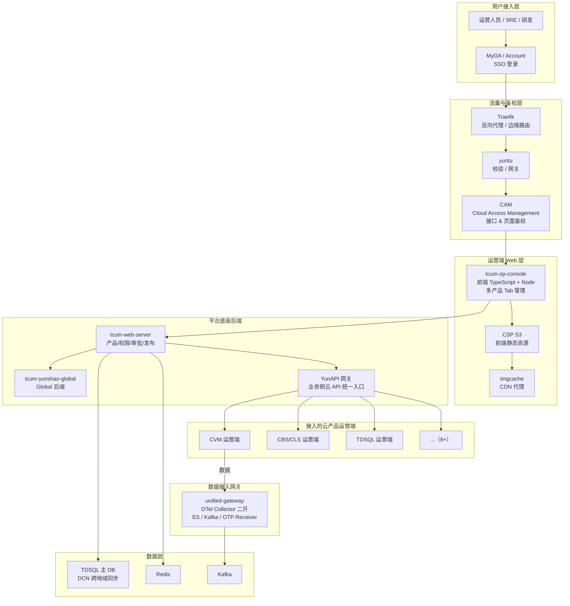

# TCUM 统一运维底座 · 待拆总册

> **状态：尚未拆分、非正式入口。** 本稿保留统一运维底座的独有材料，后续仍需按“机制、场景、题库、复盘”拆分并逐项复核源码；在完成前，不应与三个正式项目专题采用同等事实强度。
>
> **写作要求**（对齐 [`TCUM-AI 架构与上下文`](../01-项目专题/03-TCUM-AI/01-机制原理/01-机制篇-架构与上下文管理.md) 与 [`监控可观测专题`](../01-项目专题/02-监控可观测/00-索引与使用说明.md) 已验证的深度模式）：每个技术点必须落到 **代码路径 + iWiki 页面 URL** 或 **真实环境/组件名**，绝不使用"高可用/高扩展/稳定性好"这类空词。
>
> **事实基线**：
> - 📁 代码：`code/tcum-web-server`、`code/tcum-op-console`、`code/tcum-yunshao-global`、`code/unified-gateway`、`code/link-common`、`code/tcs-platform`、`code/tce`、`code/demeter`
> - 📄 iWiki：[统一运维平台整体总结与规划](https://iwiki.woa.com/p/4019789108)、[两地三中心容灾方案](https://iwiki.woa.com/p/4018944587)、[容灾监控体系](https://iwiki.woa.com/p/4020284007)、[TCUM 业务与技术实现结构](https://iwiki.woa.com/p/4019772291)、[细粒度权限申请与审批](https://iwiki.woa.com/p/4013408168)
> - 📎 简历：`tcum-ai/乐宇辰-腾讯云可观测.pdf`

---

## 📖 目录

- 第 0 章 项目宏观介绍
- 第 1 章 架构坐标系（组件族全景 + 关键路径）
- 第 2 章 核心机制深挖（5 节）
- 第 3 章 真实场景端到端推演（2 个 case）
- 第 4 章 失效模式与短板（12 条）
- 第 5 章 高频问答精选（30 题）
- 第 6 章 面试话术与反问弹药
- 附录 A/B/C

---

# 第 0 章 项目宏观介绍

## 0.1 项目定位与业务背景

**一句话定位**：**TCUM（Tencent Cloud Unified Management Platform）是腾讯云统一运维运营平台**——为公有云产品运营端提供**底座能力**（前端入驻、后端应用部署、统一账户和权限、统一审批）+ **基础运维能力**（CMDB、运营端监控、运营端巡检、变更、日志、SLO 等），并帮助**云产品运营端**（前端+后端）入驻。

**它解决的三个真实业务问题**（iwiki `4019789108` 原文摘录）：

**问题 1 · 云产品运营端"公私一体输出"**

腾讯云的每个云产品（CVM、CBS、CDB、Redis、CLS、TDSQL...）都有一套**面向运营人员的控制台**——过去，同一个云产品在公有云内部和私有云（对外交付给客户）有**两套完全不同的运营端**（不同 UI、不同后端、不同权限体系）。维护成本极高。

TCUM 的核心目标是**"云产品的运营端可以无感知地输出到私有云"**——通过统一的框架、入驻标准、发布流程，让公有云内部的运营端组件能直接被打包成私有云版本，不需要业务方重复开发。这就是 iwiki 里"以 TCS Core + TCenter 为基础搭建"的含义——**TCS 是私有云底座，TCenter 是私有云运营端**，TCUM 是"公有云版本"。

**问题 2 · 云产品接入门槛问题**

在没有 TCUM 之前，一个新云产品要有运营端，需要自己搭建：SSO 登录、权限系统、审批流、发布流水线、监控接入、CMDB 接入、YunAPI 网关...每套都要花几个月。

TCUM 提供了**"产品入驻 = 填一个产品Code + 选管理员 = 拿到全套基础能力"**的接入模型。**产品入驻的第一步是创建产品**（iwiki 4019789108 明确），产品Code 是唯一标识（不能修改，谨慎填写）。**申请权限延迟最多 30s**（这是硬性指标）。

**问题 3 · 多接入方的运维治理问题**

TCUM 接入方包括 **CBS/CLS、CVM、网络、QCM、TCS、TDSQL、TCE、安全** 等（iwiki 4018944587 明示）。每个接入方都有自己的运维需求、发布节奏、故障习惯。TCUM 需要给出**标准化的治理机制**——统一发布流水线、统一审批、统一 SSO、统一权限模型——让接入方"用平台的能力，不重复造轮子"，同时不干涉接入方的业务差异。

**服务的客户群**：
- **云产品运营端研发**（接入方的开发者，用 TCUM 部署自己的运营端）
- **云产品运营端使用者**（运维、运营人员，日常使用运营端）
- **云产品租户端稳定性负责人（SRE）**（基于 TCUM 提供的 CMDB、监控、巡检建设自家稳定性体系）
- **平台自身研发**（作者所在的角色）

## 0.2 技术栈与规模

**技术底座**（iwiki `4019789108` 原文）：
> "平台以 **TCS Core + TCenter** 为基础搭建而来，在这个基础上针对公有云的一些部署结构、产品特性做了一些适配、扩展"

**代码仓组成**：

| 代码仓 | 语言 | 定位 |
|---|---|---|
| `code/tcum-web-server` | Go | 平台后端主服务（bootstrap + controller + service + task） |
| `code/tcum-op-console` | TypeScript + Node.js | 运营端前端（i18n 多语言 + pnpm workspace + 完整 Web） |
| `code/tcum-yunshao-global` | Go | 公私统一运维项目的 yunshao-global（含 `_metricimport` 指标导入 + `_sloimport` SLO 导入 + `grafana_product_table.json` Grafana 产品映射表） |
| `code/unified-gateway` | Go | 监控统一网关（**OpenTelemetry Collector 二开**，见下表） |
| `code/link-common` | Go | 通用库（`configcenter` 配置中心 + `pb` 协议 + `storage`） |
| `code/tcs-platform` | Go | PaaS 平台底座 |
| `code/tce` | Go | TCE 集成 |
| `code/demeter` | Go | 相关基础组件 |

**unified-gateway 的目录结构直接暴露了它的 OTel Collector 二开身份**：
```
cmd/           -- 主入口
config/        -- 配置
receiver/      -- 输入端（自研 3 种）
  esreceiver/       -- 从 ES 拉数据
  kafkareceiver/    -- 从 Kafka 拉数据
  otpreceiver/      -- OTP 协议接收
processor/     -- 处理端
  metricsdebugprocessor/  -- 指标调试
exporter/      -- 输出端
extension/     -- 扩展
```

**这就是第一卷 §2.2 讲的"统一网关"的代码实现**——它不是一个新框架，而是**OTel Collector 的公司内部二开版本**，通过自研 receiver 适配公司内部数据源（ES / Kafka / OTP）。

**关键底层依赖组件**（iwiki `4018944587` 术语表原文）：
- **Traefik**：反向代理 / 边缘路由，TCUM 的流量入口
- **yuntu**：TCUM 平台的校验 / 网关组件
- **CSP S3**：对象存储，用于前端静态资源托管
- **imgcache**：Image Cache / CDN Proxy，静态资源代理加速层
- **CAM**：Cloud Access Management，云访问管理，用于资源和接口鉴权
- **MyOA / Account**：用户登录入口组件
- **TDSQL**：Tencent Distributed SQL，TCUM 使用的分布式支撑数据库
- **DCN**：Data Communication Network，TDSQL 跨地域数据同步/复制机制

**三套环境**（iwiki `4019789108` 原文）：
- **公有云测试环境（DevCloud - IDC）**：完整 tcs 集群权限，研发测试用
- **预发环境**：只读权限，特殊运维找平台协助
- **生产环境**：只读权限，特殊运维找平台协助

**基础版本**：**TCE 3.10.11**（每套环境都基于该版本的 TCE 环境构建）

## 0.3 演进大事记

| 阶段 | 关键动作 | 证据 |
|---|---|---|
| T0 · 前 TCUM 时代 | 各云产品运营端各自建设，公有云内外两套 | iwiki 4019789108 背景描述 |
| T1 · TCUM 底座建立 | 基于 TCS Core + TCenter 搭建公有云版本 | 同上 |
| T2 · 产品入驻模式落地 | 产品Code + CAM + YunAPI 三件套 | iwiki 4019789108 平台功能章节 |
| T3 · 统一网关引入 | OTel Collector 二开 + 3 种自研 receiver | `unified-gateway` 代码 |
| T4 · 两地三中心容灾 | 上海双 AZ + 北京异地 | iwiki 4018944587 |
| T5 · 容灾监控体系 | RTO/RPO 目标制定 + SOP 沉淀 | iwiki 4020284007 |
| T6 · 云产品可用性建设 | YunAPI SLO / 实例可用性 / 拨测 SLO | iwiki 4025689590（第一卷已引） |
| T7 · TCUM-AI 上线 | 底座层向 AI Agent 开放能力 | 第三卷 |

## 0.4 系统架构总图



**四条阅读线索**：
1. **横向清晰分层**：接入→流量→鉴权→前端→后端→数据源
2. **入驻是分层解耦**：接入方（云产品）只需实现自己的运营端 + 使用 TCUM 提供的 SSO / CAM / YunAPI / 数据接入网关
3. **两个"网关"的角色不同**：**yuntu = 用户流量网关**（HTTP/HTTPS 出入口）；**unified-gateway = 数据接入网关**（Metric/Log/Trace 数据接入）
4. **数据侧走 OTel 生态**：unified-gateway 是 OTel Collector 二开，说明 TCUM 已经在拥抱 OTel 标准

## 0.5 三条"必须先立住"的口径

| # | 常见宣传口径 | 代码/iWiki 事实 | 建议表述 |
|---|---|---|---|
| **1** | "TCUM 是一个自研的运维平台" | **基于 TCS Core + TCenter** 搭建（iwiki 4019789108 原文），在此之上做**公有云适配 + 扩展**；底层依赖 **TCE 3.10.11** 版本 | "TCUM 的底座是 **TCS Core + TCenter** 的公有云版本适配，我们做的是'公私统一运营端'的框架层——SSO、CAM、YunAPI、审批、发布流水线；底层 TCE 环境本身是私有云基础设施" |
| **2** | "两地三中心容灾能力" | **规划完整、演练进行中**——iwiki 4018944587 明确"需要针对两地三中心进行系统性的容灾能力建设和演练验证"；架构是 **上海双 AZ（AZ-A/AZ-B）同城双活 + 北京 AZ-C 异地灾备** | "两地三中心是我们的架构目标，落地形态是**上海双 AZ 双活 + 北京异地灾备**；RTO/RPO 目标已定义，SOP 已沉淀，**具体演练结果需现场核实**" |
| **3** | "统一网关支持所有协议" | 代码事实是 unified-gateway = OTel Collector 二开 + 3 种自研 receiver（ES / Kafka / OTP）；其他协议靠 OTel 生态原生 receiver | "统一网关是 **OTel Collector 二开**——业界标准协议靠 OTel 生态原生 receiver，公司内部数据源（ES/Kafka/OTP）我们自研了 3 个 receiver；这个技术选型的好处是标准 + 生态兼容" |

---

<!-- INSERT_HERE -->
