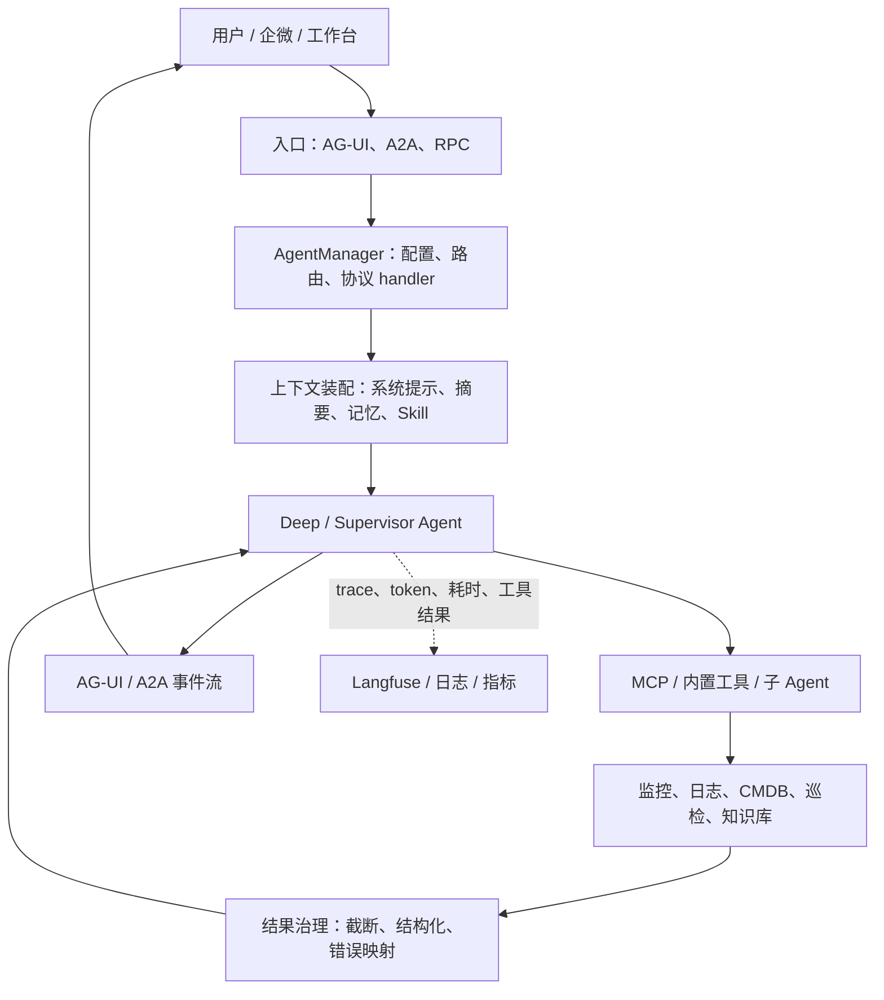
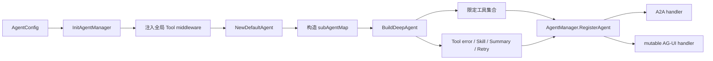
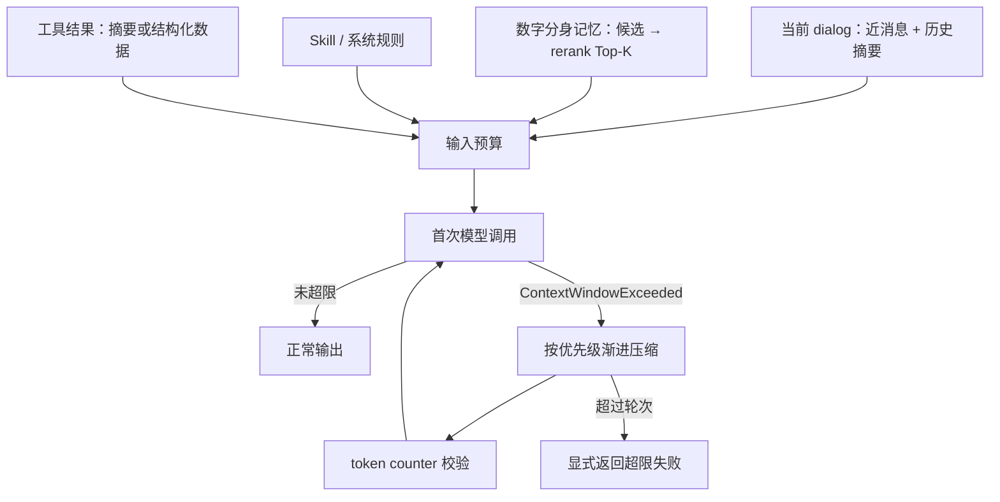
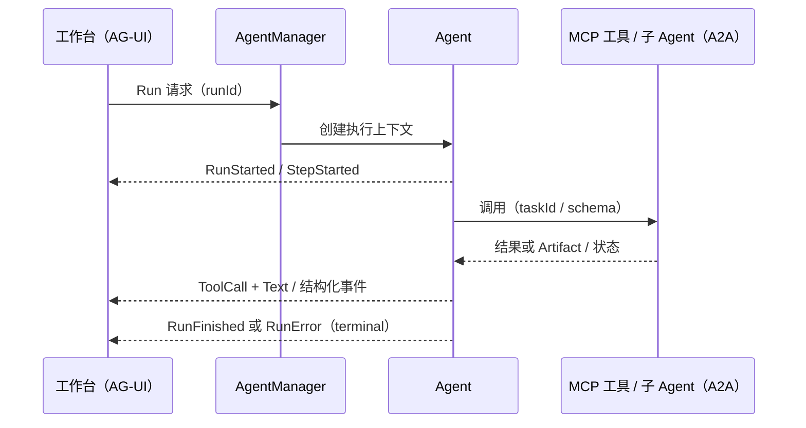

# TCUM-AI 架构与面试宝典

> 这是一册以“一个请求怎样在系统中成为可信运维结论”为主线的项目面试书，而不是技术名词清单。内容以 `tcum-ai` 仓库、仓库内的架构 / 协议 / 数字分身文档为证据。每个问题先给出可在一面使用的完整回答，再拆解代码路径、设计动机、当前风险和下一步改进。没有配置、部署或运行指标支撑的结论会明确标为“方案”或“待核验”。

## 阅读顺序与事实口径

先读第一部分建立产品全貌；随后按请求生命周期读第二部分；最后用第三部分的九个深问演练。面试时不要背全文：每章先提炼成 90 秒结论，面试官追问代码、失败路径或权衡时再展开。

| 证据级别 | 含义 | 在面试中的说法 |
|---|---|---|
| A | 当前仓库中有实现代码或测试 | “代码当前是这样处理的” |
| B | 仓库中有设计 / 产品文档 | “方案设计为……，上线状态需要以部署和验收再确认” |
| C | 基于 A/B 的改进建议 | “我会这样演进，而不是说已经上线” |

## 第一部分：先把项目讲成一个完整系统

### 1. 产品问题与边界

TCUM-AI 的问题不是“给运维人员接一个聊天框”。产品 README 描述的原始矛盾是监控规则、PromQL、告警、巡检、知识和多个外部平台的操作门槛都很高；经验分散在专家与文档中，排障链路又需要跨指标、日志、CMDB 和巡检系统。因此平台试图提供“感知—分析—决策—执行”的闭环。README 写了 `1 分钟感知异常 → 5 分钟根因定位 → 10 分钟自动恢复` 的目标；它是产品目标（B），不是当前代码已证明的 SLO（A），面试中不能把它读成已达成指标。

这个边界尤其重要：平台负责把自然语言任务转成受治理的 Agent 推理和工具调用，提供对话、数字分身、技能、协议、记忆和审计能力；它不应替代监控、日志、CMDB、天巡或云 API 自身的数据真相。模型只能提出计划、调用被授权的工具、基于工具返回的证据形成建议。涉及写操作、资源变更和高风险动作必须进入权限、审批或显式确认链路；仓库中有关“自治处置”的内容应按设计方案理解，不能说成模型可以无约束执行生产操作。

### 2. 一次请求的宏观运行图

这里有三个控制点。第一，**配置与能力控制**：AgentManager 根据配置注册 Agent 和协议路由，Agent 构建阶段选择工具、中间件与 Skill。第二，**上下文控制**：长对话、工具输出和记忆都不能无限拼接，必须筛选、摘要和压缩。第三，**行动控制**：工具不是模型直连后端，而是有 schema、鉴权、错误语义和审计边界的能力单元。后面的章节都围绕这三个控制点展开。

### 3. 代码地图

| 目录 / 文档 | 它回答的问题 |
|---|---|
| `cmd/server/common/agentserver` | Agent 如何从配置装配为运行时实例 |
| `pkg/agent/manager.go` | A2A / AG-UI handler 如何注册、热更新与路由 |
| `pkg/agent/adaptive_context_retry.go` | 模型超上下文后怎样逐级压缩并重试 |
| `usercases/agent_access/service/memory_context_service.go` | 数字分身怎样召回、重排并注入记忆 |
| `pkg/mcp` 与 `usercases/mcp_server/*` | 工具怎样作为 MCP Provider / Consumer 接入 |
| `pkg/agui`、`docs/protocol/*` | 流式事件怎样让前端与 Agent 协作 |
| `docs/arch/自主型领域Agent设计方案.md` | 自主 Agent、RCA、Guardrail 等演进设计（B） |

## 第二部分：从请求到结果的详细讲解

### 4. Agent 构建不是 `new` 一个模型

启动时 `InitAgentManager` 先拿到 Agent 配置，为每个 Agent 注入全局工具调用中间件，再构建基础 Agent、子 Agent 映射，最后通过 `BuildDeepAgent` 形成最终实例。代码刻意让**没有子 Agent 的 Agent 也走 Deep 构建路径**，目的不是强行多 Agent，而是保证 COS Skill backend、工具结果截断、摘要、运行时模型选择、超限自适应重试等中间件在不同 Agent 形态下行为一致。这个细节说明真正的运行单元不是“模型 + prompt”，而是“模型 + 有限工具集合 + 中间件栈 + 上下文策略 + 协议 handler”。

### 5. 记忆、摘要和 Skill 是三种不同的上下文

不要把它们统称为 memory。对话摘要服务负责把单个 dialog 的旧消息压缩成可继续对话的状态；数字分身记忆服务从 `twin_memory` 候选池找与 query 相关的经验和历史，结合分身 soul 组成 system prompt；Skill 则是可版本化的操作规程和工具使用说明。它们的更新频率、可信度、失效策略都不同：摘要是对过去对话的有损压缩，记忆可能过期或被误召回，Skill 是规则资产且需要发布治理。把三者分层，才能在问题发生时分别排查“模型没记住”“召回错了”“流程指令不正确”。

### 6. 结果要成为可消费事件，而不是一段文本

AG-UI 和 A2A 的价值是把 Agent 执行的生命周期、步骤、工具调用、文本和结构化产物编码为事件流。前端因而能显示“正在查什么”，而不只是等待一个最终字符串；上游 Agent 也能识别下游任务状态和 artifact。协议层面要保证 run / task ID、事件顺序、final、错误和大结果引用的语义稳定，否则断线重连、重复渲染、工具结果与最终结论错配都会出现。

## 第三部分：深度面试问题

## 问题一：请完整介绍 TCUM-AI。它解决的到底是什么问题，系统边界在哪里？

### 可直接作答（建议 90 秒后展开）

我会把 TCUM-AI 定义为面向统一运维场景的 Agent 平台，而不是通用聊天机器人。它试图解决的是：监控、日志、巡检、CMDB 和企业知识分别存在于不同系统；普通运维同学需要知道指标名、PromQL、告警规则和各种后台入口，专家经验又难以复用。平台把这些系统封装成工具，用领域 Agent、Skill、数字分身记忆和流式工作台把一次自然语言请求组织为“理解任务—获取证据—分析—输出可行动结论”的过程。产品文档中的分钟级目标是方向，不是我会直接声称已经达到的线上指标。

系统边界上，LLM 不拥有事实源，也不应直接拥有生产写权限。真实指标、日志、资源状态来自外部系统；模型只依据检索和工具返回作出假设与解释。平台负责四件事：第一，编排能力，把不同领域 Agent、工具和 Skill 装配起来；第二，上下文治理，避免历史、记忆和工具大结果淹没当前任务；第三，协议与体验治理，把过程以 AG-UI/A2A 事件准确呈现；第四，运行治理，处理权限、错误、可观测性、配置更新和质量评估。这样说的好处是能同时解释为什么要有 MCP、为什么要有 AgentManager、为什么要有数字分身，而不是把它们列成技术栈。

### 代码与文档如何支撑这段话

`README.md` 明确列出了入口层、接口适配层、`agent_access` / `obs_agent` 业务层、`pkg` 基础设施层和外部服务；并把产品拆为 AI 工作台、数字分身、多 Agent、Skill 和 MCP 工具生态。代码中 `AgentManager` 同时生成 A2A 和 AG-UI handler，说明平台并不只服务一个网页入口；`usercases/mcp_server` 下按监控、CMDB、日志等领域注册工具，说明外部系统以工具契约进入平台。数字分身不是一个 prompt 别名：记忆服务在会话初始化时查询分身相关的候选记忆并注入上下文。

这也揭示了边界风险。README 中“已上线 Agent”列表、技能数量和分钟级目标都是文档陈述，面试中若被问到“是否已全量生产”，应进一步给出环境、灰度范围、请求量、成功率和事故数据；如果没有这些证据，最稳妥的回答是“仓库与产品文档这样定义，具体上线范围我会按实际负责模块说明”。此外，工具结果可能陈旧、权限可能不足、模型可能错误解释，平台最多提高决策效率，不能把“生成了结论”说成“完成了恢复”。

### 改进路线

我会把平台指标从“回答像不像人”升级为闭环指标：任务成功率、证据覆盖率、工具失败率、人工采纳率、从告警到确认根因的时间、以及每类高风险动作的审批通过 / 回滚率。对读操作可先做可解释诊断；对写操作采用建议—预览—人工确认—审计—可回滚五段式。这样才能逐步逼近自治，而不是让模型在没有反馈控制的情况下直接执行。

**证据：** [产品架构](/Users/yaao/Documents/code/tcum-ai/README.md:1)，[AgentManager](/Users/yaao/Documents/code/tcum-ai/pkg/agent/manager.go:50)，[记忆注入服务](/Users/yaao/Documents/code/tcum-ai/usercases/agent_access/service/memory_context_service.go:30)。

## 问题二：一个 Agent 从配置到可服务，具体经过哪些代码路径？为什么要让所有 Agent 都走 Deep 构建？

### 可直接作答

这条链路体现的是平台的工程化，而不是“读取一段 prompt 调一次模型”。`InitAgentManager` 先读取 Agent 配置；在将配置存入 map 前，它为每个 Agent 放入全局工具调用中间件。代码注释特别说明，若这个动作放晚了，Deep 模式重新创建 ToolsNode 时会拿到没有 middleware 的配置副本，结果截断等通用保护会丢失。随后系统创建基础 Agent、建立 `ProtocolAgent → adk.Agent` 映射，根据 `SubAgents` 或自定义 provider 组装子 Agent，最后调用 `BuildDeepAgent`。

我不会简单说“Deep 适合复杂任务”。从实现看，即便一个 Agent 没有子 Agent，也会统一走 `BuildDeepAgent`。原因是 Deep 构建集中装配了工具集合、Agent middleware、ChatModel middleware、Skill backend、可选的 skill_exec、摘要 handler、运行时模型选择器、上下文超限重试和扩展 handler。统一路径能避免单 Agent 与多 Agent 在工具错误、上下文、Skill 加载等行为上分叉。子 Agent 只是 Deep 的一种能力，不是它存在的唯一理由。

### 代码细节与设计取舍

`BuildDeepAgent` 并不是把所有已注册工具塞给模型，而是遍历 `agCfg.Tools`，仅从注册表取配置列出的项；这为最小工具集提供了代码基础。`WithGeneralSubAgent` 默认关闭，只有配置显式开启才使用通用子 Agent，这也体现了避免无边界委派的意图。工具错误中间件被放在 handlers 链前面，以包住后续动态 / Skill 注入的工具；摘要 handler 和自适应重试又在后续追加，试图使 Deep 与 DefaultAgent 一致。

当前实现仍有风险。第一，配置里写了一个不存在的 tool 或 middleware 时，代码会跳过而非启动失败；这是可用性友好，但会形成“能力静默缺失”。第二，所有 Agent 走 Deep 统一了语义，也可能给简单问答引入更多中间件和延迟。第三，配置到运行时实例的可观测性需要足够好：至少记录 Agent 名称、有效工具数、Skill 加载结果、配置 hash 和中间件链，否则“为什么这次没调用某工具”很难定位。第四，模型能看到的工具描述本身就是 prompt 的一部分，工具过多仍会导致选择困难和 token 成本上升。

### 改进路线

我会增加配置预检：启动或发布前校验每个工具、Skill、middleware 和子 Agent 是否解析成功，缺失项按风险级别 fail-fast 或告警；同时输出一份“最终生效 Agent manifest”。对简单任务可以在不改变保护性 middleware 的前提下设置轻量运行 profile，例如禁用不需要的子 Agent、缩短 Skill 描述、选择低成本模型。最终要用每个 Agent 的工具选择准确率、平均步骤数、P95 延迟和超限重试率来决定是否值得保持 Deep 路径。

**证据：** [初始化与中间件注入](/Users/yaao/Documents/code/tcum-ai/cmd/server/common/agentserver/agent_builder.go:64)，[统一 Deep 构建](/Users/yaao/Documents/code/tcum-ai/cmd/server/common/agentserver/agent_builder.go:19)，[工具 / Skill / 摘要 / 重试装配](/Users/yaao/Documents/code/tcum-ai/cmd/server/common/agentserver/agent_builder.go:176)。

## 问题三：Supervisor、多 Agent、工具调用分别应该解决什么问题？怎样避免“多 Agent 只是多花 token”？

### 可直接作答

我会先拒绝一个常见误解：多 Agent 不是默认优于单 Agent。单个领域问题，例如根据一个明确告警 ID 查详情、拉一段指标并解释，通常由拥有有限工具集的专业 Agent 直接完成更快、更稳定。Deep 模式解决的是同一个 Agent 在有限职责内多步工具调用、根据结果调整下一步的问题。Supervisor 或 A2A 更适合跨领域分解，例如一个故障同时需要监控趋势、CLS 日志、CMDB 影响面和巡检历史；它的职责是拆解并收敛任务，而不是把原问题广播给所有专家。

当前代码对这种区分有直接支撑。Agent 配置中有 `SubAgents` 和自定义 `SubAgentsProvider`，构建阶段只装配目标子 Agent；另有动态任务工具 middleware，根据运行上下文构造可调用 Agent 的描述。工具本身也不是任意函数：MCP server 按业务域注册，并借由 tool schema 告诉模型输入输出。换句话说，调度质量取决于职责、可见工具、上下文和结果契约四件事，而不是 Agent 数量。

### 怎样设计调度与失败路径

一个靠谱的调度流程应先做轻量分类：是否能由当前 Agent 的工具完成、是否需要权限更高的域、是否需要并行查多个独立证据源。若需要委派，Supervisor 的输入必须是最小化任务包：用户目标、已知时间范围 / 资源标识、已确认事实、需要返回的结构，而不是完整长对话。子 Agent 的输出也不该只是自然语言，应至少包含结论、证据引用、未验证假设、失败原因和下一步建议。Supervisor 才能比较矛盾证据，而非把多段文本再让模型“凭感觉总结”。

风险有四类。第一，递归委派和互相调用会产生循环，必须控制最大深度、最大步骤、并发度和总 token 预算。第二，多个 Agent 查同一系统会造成重复查询和不一致时间窗，适合共享 run context、查询结果 cache 和统一的时间范围。第三，子 Agent 的一句“分析完成”若没有原始证据，会在聚合时被错误放大。第四，委派失败不应默默降级成编造回答；需要把工具 / 子 Agent 不可用显式交回给上游并标注结论不完整。

### 改进路线

我会以数据决定是否拆分：统计任务分类准确率、每次委派带来的边际证据增量、重复工具调用率、子 Agent 超时率和端到端成功率。对低复杂任务默认单 Agent；只有任务横跨两个以上独立数据域、或第一轮证据不足时再升级。对高风险根因分析，可采用仓库设计文档中的 Planner—Analyst—Critic 思路，但它目前属于方案（B），需要先在离线案例集上证明 Critic 真能降低无证据结论，而不是只增加轮次。

**证据：** [子 Agent 选择与默认关闭通用子 Agent](/Users/yaao/Documents/code/tcum-ai/cmd/server/common/agentserver/agent_builder.go:19)，[动态任务工具](/Users/yaao/Documents/code/tcum-ai/pkg/agent/dynamic_task_tool_middleware.go:33)，[自治领域 Agent 的分层与对抗辩论设计](/Users/yaao/Documents/code/tcum-ai/docs/arch/自主型领域Agent设计方案.md:705)。

## 问题四：长对话、工具大结果与模型上下文窗口冲突时，TCUM-AI 现在怎么做？它的缺口是什么？

### 可直接作答

上下文工程在这个项目里不是简单的“截断历史”。一条运维诊断对话既有用户消息和系统规则，也有 Prometheus 时间序列、日志样本、CMDB 资源、工具调用参数和前几轮结论；把它们全部塞给模型既慢又会产生 lost-in-the-middle。当前代码至少有两层处理：对话历史服务按周期生成并压缩 dialog summary；模型调用侧的 `AdaptiveContextRetry` 在真正收到上下文超限错误后，才对输入做渐进压缩并原地重试。

后者的细节很重要。`Generate` 先原样调用模型，正常请求没有额外 token 计算 RPC；只有识别出 overflow 后才启用 token counter，基于错误中可解析的目标长度或计数器估算需要节省的 token。第一轮压缩刻意不动未读消息；工具消息优先采用结构化采样，保留部分 rows / frames、warning 与 COS URL，之后才逐级压到仅保留引用占位；assistant 长内容采用头尾采样。压缩后的 token 如果仍比目标大很多，代码会跳过无意义的再次请求继续压缩；达到上限才返回 exhausted error。这个设计的目标是保留可追溯线索，而不是为了“能发出去”把所有证据删掉。

### 当前问题与排障方式

第一，`Stream` 路径目前不做同样的自适应重试，代码注释已明确这一点；因而同一个长上下文任务，非流式可能恢复、流式可能直接失败。第二，压缩本身是有损的，工具结果保留样本并不保证关键异常点在样本中。第三，本地 token 估算采用字符近似时，中文、JSON、工具 schema 和真实模型 tokenizer 的偏差可能导致压缩不足或过度。第四，压缩发生在已经超限之后，会经历一次失败模型调用；高频场景会造成尾延迟尖峰。第五，summary、memory 和 runtime retry 都可能同时压缩信息，如果没有来源标记，模型和人都无法判断“这个结论建立在原始证据还是摘要上”。

### 改进路线

我会建立输入预算器，在首次模型调用前根据 system prompt、Skill、历史、工具结果和记忆分别计算预算；优先在源头限制工具返回字段和行数，远比事后压缩大 JSON 更可靠。对工具结果应提供“摘要 + 可按 ID / URL 回查的原文”两层输出；Agent 在推理时只拿摘要，需验证时再局部展开。流式路径需要实现等价的超限错误恢复，或在开始流之前完成预算检查。观测上必须记录压缩轮数、被压缩来源、前后 token、重试成功率和最终答案的人工纠错率；否则只看到“请求成功”并不能证明压缩没有伤害诊断质量。

**证据：** [自适应重试入口](/Users/yaao/Documents/code/tcum-ai/pkg/agent/adaptive_context_retry.go:164)，[渐进压缩实现](/Users/yaao/Documents/code/tcum-ai/pkg/agent/adaptive_context_retry.go:476)，[流式边界](/Users/yaao/Documents/code/tcum-ai/pkg/agent/adaptive_context_retry.go:272)，[对话摘要服务](/Users/yaao/Documents/code/tcum-ai/usercases/agent_access/service/dialog_history_service.go:593)。

## 问题五：数字分身的记忆如何注入？为什么不把所有历史都放进 prompt？

### 可直接作答

数字分身不是把某个专家的历史聊天记录无脑拼接给模型。当前 `MemoryContextService` 在会话初始化时至少区分两类上下文：分身的 `soul` 作为角色与稳定偏好全量注入；`twin_memory` 中的 history / experience 则先取最近的候选池，再用 LLM rerank 选 Top-K，最后以带 category 与 key 的 XML 风格标签格式化。代码默认候选池是 50 条、最终保留 10 条。这种“两阶段候选—重排”比全量注入更能控制 token，同时允许当前 query 决定哪些历史经验相关。

这样做背后的模型是分层记忆：soul 描述长期稳定的行为边界；history 是跨会话的历史状态；experience 是可复用的处理经验；当前 dialog 则由消息和摘要维持。它们不应具有相同可信度。比如一条旧告警处理经验可被新问题召回，但不能覆盖实时工具返回；用户偏好可影响报告格式，却不能改变安全校验。面试时讲清这个优先级，能说明你不把“记忆”当作模型事实库。

### 当前实现的局限

LLM rerank 不可避免会带来额外时延和成本，还可能输出无法解析的 JSON。代码为此有 fallback：重排调用失败或解析失败时退回最近记忆；这保障了可用性，却可能在“最新不等于最相关”的场景降低质量。候选池先按最近记录取 50 条，也可能让很久以前但极有价值的经验永远进不了 rerank。更严重的是记忆生命周期：经验可能过期、被错误总结、包含过度具体的环境信息或不再适用的 SOP；如果没有有效期、来源、置信度、反馈和删除机制，模型会把陈旧经验当成权威。XML 标签提高了区分来源的可读性，并不等于抵抗提示注入；外部记忆内容仍需清洗和隔离。

### 改进路线

我会为每条记忆增加来源会话 / 工具证据、适用资源范围、创建与过期时间、人工确认状态、成功 / 失败反馈计数和敏感等级；检索先做 metadata filter，再混合使用向量 / 关键词和时间衰减，LLM rerank 只重排小候选集。注入时应明确告诉模型“记忆是历史建议，实时工具结果优先”，并要求最终报告标出采用了哪些记忆。还应对“召回但未采纳”“采纳后被人工纠正”建立反馈闭环，才能让数字分身从静态 prompt 升级为可治理的经验系统。

**证据：** [记忆服务与默认 Top-K](/Users/yaao/Documents/code/tcum-ai/usercases/agent_access/service/memory_context_service.go:19)，[查询候选并 rerank](/Users/yaao/Documents/code/tcum-ai/usercases/agent_access/service/memory_context_service.go:45)，[失败 fallback](/Users/yaao/Documents/code/tcum-ai/usercases/agent_access/service/memory_context_service.go:83)，[记忆数据模型方案](/Users/yaao/Documents/code/tcum-ai/docs/agent_access/digital_twin_memory_implementation.md:13)。

## 问题六：MCP 与 Skill 分别是什么？怎样避免把“工具接入”做成新的安全洞？

### 可直接作答

我会把 MCP 和 Skill 分开讲。MCP 解决的是能力互操作：Consumer 侧让 Agent 发现和调用外部工具，Provider 侧把 CMDB、Grafana、日志、巡检等能力暴露为有输入 / 输出 schema 的工具。Skill 解决的是操作知识与流程复用：它告诉模型在什么场景选择哪些工具、调用顺序、约束和输出格式。一个工具可以没有 Skill，但模型难以稳定地编排复杂流程；一个 Skill 也不应该携带绕过权限的后端连接信息。代码中存在 MCP client/server、按领域的 tool register，以及构建 `tcum-ai-skills` public/private 产物的脚本，能支撑这种分层。

运行时 Agent 并非看到所有工具。Deep 构建只从 `agCfg.Tools` 选择注册工具；Skill 仅在配置了 `agCfg.Skills` 时加载。工具错误中间件把一般工具执行错误转换为模型可理解的结果，避免一个瞬态失败直接让整轮会话 ERROR。这个处理不是“让模型无限重试”：模型应根据错误类型选择澄清、退避、换工具或停止。鉴权、输入白名单、危险操作确认和服务端审计仍属于工具提供者与网关的责任，不能交给 prompt。

### 当前风险

第一，工具 description 是模型决策的重要输入，描述模糊会让模型选错工具；工具 schema 过大则反过来吞噬上下文。第二，动态 MCP / Skill 意味着能力集合会变化，若没有 allowlist、版本和来源校验，可能把不可信 endpoint 或不安全指令带进推理。第三，`ToolErrorHandler` 增强了可恢复性，但若把权限拒绝、参数校验错误和下游 5xx 都表现得一样，模型难以做正确决策。第四，Skill 构建脚本删除固定敏感 header、public 侧改为 Bearer token，这是构建期保护，不等价于运行时密钥管理；产物中仍可能有敏感 URL、示例数据或过宽的 allowedTools。第五，模型可以被工具返回内容提示注入，特别是 wiki、日志和外部知识库内容，必须当作不可信数据而非系统指令。

### 改进路线

工具元数据应声明副作用等级、所需权限、可重试错误、超时、幂等键、最大结果量和数据敏感等级；Agent 根据这些字段而不是仅靠自然语言 description 决策。所有写操作走 dry-run / plan、用户确认、审批 token、审计和补偿 / 回滚。Skill 发布使用签名、SBOM / 静态扫描、review、canary 与一键回滚；MCP server 使用 allowlist 与短期凭证。工具结果要经过数据脱敏、长度限制和“data not instruction”边界包装。最终安全 KPI 不只是拒绝率，还包括越权拦截、危险调用的确认覆盖率、敏感数据输出命中和错误重试放大率。

**证据：** [MCP client](/Users/yaao/Documents/code/tcum-ai/pkg/mcp/client.go:1)，[MCP server](/Users/yaao/Documents/code/tcum-ai/pkg/mcp/server.go:1)，[Skill 加载与 tool error handler](/Users/yaao/Documents/code/tcum-ai/cmd/server/common/agentserver/agent_builder.go:198)，[Skill 产物与敏感头处理](/Users/yaao/Documents/code/tcum-ai-skills/scripts/build_skills.py:4)。

## 问题七：为什么 TCUM-AI 同时需要 AG-UI 和 A2A？流式协议最容易出什么问题？

### 可直接作答

AG-UI 与 A2A 解决的是不同方向的互操作。AG-UI 面向人机交互：浏览器或工作台需要看到 run 开始、步骤、文本增量、工具调用及结构化结果，进而渲染指标图、表格或链路，而不是只拿一段最终 Markdown。A2A 面向 Agent 间协作：调用方关心下游任务、状态更新、artifact 与最终结果，以便继续编排。`AgentManager` 为 Agent 分别创建 A2A server 和 AG-UI handler；仓库内两份协议文档也分别定义生命周期、工具事件、任务、artifact、final 与错误语义。因此它们不是重复造协议，而是同一执行过程面对不同消费者的表达。

面试中我会沿一个流式 run 解释：入口为请求生成 run / task 关联；Agent 规划或进入步骤时发送 StepStarted；工具调用需要开始、参数、结束和结果事件；文本以 chunk 增量发送；正常完成必须发送最终状态，失败则发送可机器识别的错误状态。前端不能以“收到最后一个文本 chunk”猜完成，因为工具结果、artifact 和状态更新可能独立到达。A2A 侧也不应该把所有模型输出塞回 Message；项目文档选择用 Artifact 承载模型产物，以区分用户输入、工具输出与最终内容。

### 当前风险与如何排查

流式系统最难的是顺序与恢复。网络断开后若客户端不知道上次确认的 event id，重连可能丢内容或重复渲染。多 Agent 嵌套时，只有 stepName 或 agent 归属不清会让前端把子 Agent 的工具结果展示到错误卡片。final 语义若不统一，会出现 UI 一直 loading、任务已失败却显示成功、或者最后文本已经显示但 artifact 还没写完。大工具结果直接通过事件流传输还会触发浏览器内存、SSE 帧大小和网关超时问题。当前协议文档有工具渲染、错误码、artifact 和重连建议，这属于较强的设计证据；是否每个具体 handler 都满足幂等 / 重放，需要从服务实现与 E2E 测试进一步验证。

### 改进路线

我会让每个事件含稳定的 runId、taskId、stepId、sequence、timestamp、producer 与 schemaVersion；服务端可按 sequence 重放窗口内事件，客户端按 runId + sequence 去重。大结果只传摘要、类型和签名 URL / artifact 引用，前端按需取详情；这样也能复用上下文治理。为每种结束路径建立契约测试：成功、工具失败、模型超限、客户端取消、子 Agent 超时和断线重连都必须有可预测的 terminal event。观测上将前后端事件序列写入同一 trace，才能定位“模型没答”与“答了但 UI 没渲染”的差别。

**证据：** [AG-UI handler 创建](/Users/yaao/Documents/code/tcum-ai/pkg/agent/manager.go:428)，[A2A handler 创建](/Users/yaao/Documents/code/tcum-ai/pkg/agent/manager.go:388)，[AG-UI 事件规范](/Users/yaao/Documents/code/tcum-ai/docs/protocol/ag-ui-events.md:65)，[A2A 任务 / artifact / final 规范](/Users/yaao/Documents/code/tcum-ai/docs/protocol/a2a-event-specification.md:19)。

## 问题八：Agent 配置热更新是怎样工作的？它怎样避免把一个坏配置立刻打到所有请求上？

### 可直接作答

当前实现是请求触发式热更新，而不是简单地每隔几十秒把全局对象替换掉。每次 AG-UI 请求到来时，可变 handler 的 reload hook 调用 `ReloadAgentIfChanged`；它经由 `configLoader` 取最新配置并计算 hash。若 hash 未变就直接返回；若是新 Agent 尝试注册；若已变更，则先调用 rebuilder 构建新 Agent。重建失败时记录错误并保留旧配置；只有新 handler 更新成功后，才在锁内替换实例与 config hash。这是一种“先构建、后切换”的思路，能避免因一份坏配置让已有 Agent 立即不可用。

另一个非常具体的协议 / 路由细节是，AG-UI 注册使用精确 `Path` 而不是 `PathPrefix`。代码注释解释了原因：若 `/tianxun_inspect_expert` 先注册，它可能吞掉 `/tianxun_inspect_expert_private` 的请求，后者被错误 handler 处理并返回 404；因此还额外兼容带尾斜杠路径。面试里讲这个例子比泛泛说“注意路由冲突”更有说服力，因为它体现你理解实际线上故障来自哪里。

### 风险与边界

请求触发式更新意味着长期没有流量的 Agent 不会预先发现配置错误；第一次请求可能承担重建冷启动延迟。hash 是否覆盖所有影响运行的字段、配置读取是否有一致快照、同时多个请求到达时是否会重复 rebuild，都需要从 `AgentConfig.Hash` 和并发测试进一步核验。更新成功也不保证语义安全：新 prompt 可能改变工具选择、新 Skill 可能带来额外权限、新模型配置可能大幅提升成本。精确 path 解决了前缀冲突，却需要持续维护路径唯一性；A2A 侧仍使用 `PathPrefix`，更要留意其路径命名和路由重建行为。

### 改进路线

我会把热更新拆成发布管道：schema 校验 → 工具 / Skill / 子 Agent 依赖解析 → 离线 case 回归 → shadow / canary Agent → 指标门禁 → 灰度切流。线上采用版本化配置与 active / candidate 双实例，明确每个 run 绑定的 config version，避免一轮执行中途改变 prompt。每次 reload 打出原因、旧新 hash、耗时、依赖差异和结果；监控失败率、首请求延迟、回滚次数、配置导致的工具选择变化。对于高风险 Agent，不应等用户请求时才 build，而应在发布前预热和健康检查。

**证据：** [hash 对比、重建失败保留旧实例](/Users/yaao/Documents/code/tcum-ai/pkg/agent/manager.go:147)，[AG-UI 可变 handler 与精确路径](/Users/yaao/Documents/code/tcum-ai/pkg/agent/manager.go:304)，[路由重建](/Users/yaao/Documents/code/tcum-ai/pkg/agent/manager.go:600)。

## 问题九：如何评价 TCUM-AI 的效果与安全性？不能只用“回答正确率”吗？

### 可直接作答

不能。Agent 的最终文本正确率只是最末端表现，无法告诉我们失败发生在意图路由、检索、工具、上下文、推理还是协议渲染。TCUM-AI 应采用分层评估：第一层是**能力可用性**，例如 Agent 注册成功、工具 schema 正常、协议事件完整、请求 P95 和错误率；第二层是**证据链质量**，检索是否命中正确指标 / 文档、工具参数是否正确、结论中的 claim 是否能追到工具或知识证据；第三层是**任务质量**，根因诊断是否正确、建议是否可执行、用户是否采纳、是否减少处理时长；第四层是**安全与成本**，越权拦截、敏感数据泄露、危险动作确认覆盖、token / 工具成本和重试放大。这样才能区分“模型说得流畅”与“系统真的帮助运维”。

代码和设计已有一些基础：Agent 配置包含 Langfuse 配置，manager 创建 A2A / AG-UI server 时会注入 Langfuse 上下文；`pkg/telemetry` 提供与底层实现解耦的 metric API；工具错误中间件有测试覆盖成功透传、错误转换、取消语义和错误消息截断。架构设计文档还描述了推理链路追踪、效果评估与 A/B 测试。这些可说明团队已经把可观测性和评估作为一等能力，但不要跳到“已有完整生产指标体系”的结论，除非能展示 dashboard、采样率、trace 关联和实际评测集结果。

### 一个可执行的评估设计

我会为每个核心场景建立带证据的 case：输入包括用户问题、可访问资源、时间范围；golden 标注包括应调用 / 不应调用的工具、关键证据、允许的结论范围和安全动作。离线评测先看路由、工具选择、参数、证据引用、最终结论；线上再看匿名采纳、人工纠错、升级人工比例和时延。对于根因分析，不能只标“答案对错”，还要标“是否把猜测标为猜测”“是否提出反例”“是否在证据不足时停下”。对于写操作，最重要的不是自动完成率，而是未经确认执行率应接近零、失败后是否可回滚、审计是否完整。

### 改进路线

将每次 run 关联 prompt / skill / tool / model / config version、输入输出 token、工具耗时与错误码、压缩和记忆召回信息，形成可复盘 trace。采样时要脱敏，尤其是日志和工具结果。引入 counterfactual 回放：用同一请求比较不同模型、不同 Skill 版本和单 / 多 Agent 策略，只有在证据质量不下降、成本和延迟可接受时才发布。最终把评估结果接入配置灰度门禁，让“改了一段 prompt”也像普通生产变更一样可回滚、可审计。

**证据：** [Agent Langfuse 配置](/Users/yaao/Documents/code/tcum-ai/pkg/agent/config.go:168)，[AG-UI Langfuse 上下文注入入口](/Users/yaao/Documents/code/tcum-ai/pkg/agent/manager.go:428)，[工具错误中间件测试](/Users/yaao/Documents/code/tcum-ai/pkg/agent/tool_error_handler_middleware_test.go:15)，[评估与 A/B 设计](/Users/yaao/Documents/code/tcum-ai/docs/arch/自主型领域Agent设计方案.md:1057)。

## 第四部分：把它用于真实面试

### 四层回答法

每一题都按四层说：

1. **业务矛盾**：为什么原有流程不够；
2. **当前实现**：准确说出调用链、数据与确认点；
3. **取舍与边界**：明确它没有解决什么；
4. **演进与验证**：提出可观测、可灰度、可回滚的下一步。

### 不能说的三类话

- “项目已经自动恢复故障。”除非有受控写操作、审批、执行记录与恢复结果证据。
- “上下文问题已经解决。”当前流式路径尚未做同等自适应重试，摘要与压缩也是有损的。
- “所有 Agent 和工具都安全可靠。”构建期去敏、工具错误兜底和配置限集只是基础；最小权限、输入治理和审计要继续以运行时证据验证。

### 后续章节的扩写标准

本书不再用“架构 / 设计 / 性能 / 演进”五个相同模板复制问题。后续新增专题应像本章一样：一个真实的代码分支、至少一条失败路径、明确的生产边界和可验收的改进指标。原 [03-TCUM-AI智能运维-100问.md](./03-TCUM-AI智能运维-100问.md) 保留为旧题目索引，不能作为本书的主要学习材料。
